# HTML5 中的可缩放矢量图形（SVG）
基本概念和使用

**标签:** Web 开发

[原文链接](https://developer.ibm.com/zh/articles/wa-scalable/)

Jeremy Wischusen

发布: 2012-09-17

* * *

## 简介

可缩放矢量图形 (SVG) 是基于矢量的图形家族的一部分。它们与基于光栅的图形不同，后者在一个数据数组中存储每个像素的颜色定义。如今，网络上使用的最常见的光栅图形格式包括 JPEG、GIF 和 PNG，每种格式都具有优缺点。

##### 常用缩写词

- CSS：级联样式表
- GIF：图形交换格式
- GUI：图形用户界面
- HTML：超文本标记语言
- JPEG：联合图像专家组
- PNG：可移植网络图形
- SVG：可缩放矢量图形
- XML：可扩展标记语言

相比任何基于光栅的格式，SVG 具有多项优势：

- SVG 图形是使用数学公式创建的，需要在源文件中存储的数据要少得多，因为您无需存储每个独立像素的数据。
- 矢量图形可更好地缩放。对于网络上的图像，尝试从原始大小放大图像可能产生失真（或像素化的）图像。

    原始像素数据是针对特定大小进行设计的。当图像不再是该大小时，显示图像的程序会猜测使用何种数据来填充新的像素。矢量图像具有更高的弹性；当图像大小变化时，数据公式可相应地调整。

- 源文件大小可能更小，所以 SVG 图形比其他光栅图形的加载速度更快，使用的带宽更少。
- SVG 图像由浏览器渲染，可以以编程方式绘制。SVG 图像可动态地更改，这使它们尤其适合数据驱动的应用程序，比如图表。
- SVG 图像的源文件是一个文本文件，所以它既具有易于访问和搜索引擎友好特征。

本文将介绍 SVG 格式的优势，以及它们如何在 HTML5 中的 Web 设计工作中提供帮助。

## SVG 基础知识

要创建 SVG 图形，您会经历与创建 JPEG、GIF 或 PNG 文件完全不同的流程。JPEG、GIF 和 PNG 文件通常使用图像编辑程序创建，比如 Adobe Photoshop。SVG 图像通常使用基于 XML 的语言创建。有一些 SVG 编辑 GUI 将为您生成基础的 XML。但是，对于本文，我们假设您使用的是原始的 XML 语言。请参见 参考资料 获取有关 SVG 编辑程序的信息。

清单 1 给出了一个简单 SVG XML 文件的示例，该文件绘制一个具有 2 像素宽的黑色边框的红色圆形。

##### SVG XML 文件

```
<svg xmlns="http://www.w3.org/2000/svg" version="1.1">
     <circle  cx="100" cy="50" r="40" stroke="black"
            stroke-width="2" fill="red" />
</svg>

```

Show moreShow more icon

上述代码会得到图 1 中的图形。

##### 具有 2 像素宽的黑色边框的红色圆形

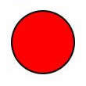

## 创建基本形状

对于 SVG 图形，需要使用 XML 标记来创建形状，下表给出了这些 XML 元素。

##### 创建 SVG 图形的 XML 元素

元素描述`line`创建一条简单的线。`polyline`定义由多个线定义构成的形状。`rect`创建一个矩形。`circle`创建一个圆形。`ellipse`创建一个椭圆。`polygon`创建一个多边形。`path`支持任意路径的定义。

### `line` 元素

`line` 元素是基本的绘图元素。清单 2 展示了如何创建一条水平线。

##### 创建一条水平线

```
<svg xmlns="http://www.w3.org/2000/svg" version='1.1'
width="100%" height="100%" >
<line x1='25' y1="150" x2='300' y2='150'
           style='stroke:red;stroke-width:10'/>
</svg>

```

Show moreShow more icon

清单 2 中的代码会生成图 2 中的图形。

##### 基本的水平线


根 SVG 标记具有宽度和高度属性，用于定义可用于绘制的画布区域。它们的原理类似于其他 HTML 元素的宽度和高度属性。在本例中，画布设置为占据所有可用空间。

该示例还使用了 `style` 标记。SVG 图形支持使用多种方法设置其内容的样式。本文中的样式可用于使他们变得显眼，也可在必须使用某些属性（比如笔画颜色和宽度）才能渲染图像时使用。 参考资料 中提供了有关设置 SVG 图形样式的更多信息。

要创建一个线定义，可以定义相对于画布的开始和结束 x 和 y 坐标。 `x1` 和 `y1` 属性是开始坐标， `x2` 和 `y2` 属性是结束坐标。要更改线的方向，只需更改这些坐标。例如，通过修改上一个示例，可以生成一条对角线，如清单 3 所示。

##### 创建一条对角线

```
<svg xmlns="http://www.w3.org/2000/svg" version='1.1'
                width="100%" height="100%" >
                    <line x1="0" y1="0" x2="200" y2="200"
                        style='stroke:red;stroke-width:10'/>
                </svg>

```

Show moreShow more icon

图 3 给出了清单 3 中的代码的结果。

##### 对角线

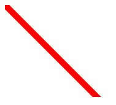

### `polyline` 元素

多直线图形是一个由多个线定义组成的图形。清单 4 中的示例创建了一个类似一组楼梯的图形。

##### 创建多直线楼梯

```
<svg xmlns="http://www.w3.org/2000/svg"
width="100%" height="100%" version='1.1'>
<polyline points="0,40 40,40 40,80 80,80 80,120 120,120 120,160"
         style="fill:white;stroke:red;stroke-width:4"/>
</svg>

```

Show moreShow more icon

清单 4 中的代码会生成图 4 中的图形。

##### 多直线楼梯

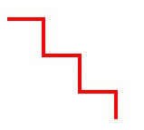

要创建一个多直线图形，可以使用 `points` 属性并定义由逗号分隔的 x 和 y 坐标对。在本例中，第一个点定义为 `0,40` ，其中 `0` 是 x 值， `40` 是 y 值。但是，单独一组点无法在屏幕上显示任何东西，因为这仅告诉 SVG 渲染器从何处开始。在最低限度上，您需要两组点：一个开始点和一个结束点（例如 `points="0,40 40,40”` ）。

与简单的线图形一样，这些线不需要完全水平或垂直。如果更改上一个示例中的值，如清单 5 所示，可以生成不规则的线形状。

##### 创建不规则的线

```
<svg xmlns="http://www.w3.org/2000/svg"
width="100%" height="100%" version='1.1'>
<polyline points="20,20 40,25 60,40 80,120 120,140 200,180"
         style="fill:white;stroke:red;stroke-width:3"/>
</svg>

```

Show moreShow more icon

清单 5 中的代码会生成图 5 所示的图形。

##### 不规则线

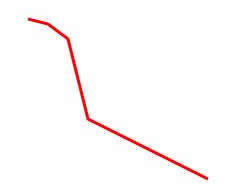

### `rect` 元素

创建一个矩形非常简单，只需定义宽度和高度，如清单 6 所示。

##### 创建矩形

```
<svg xmlns="http://www.w3.org/2000/svg"
width="100%" height="100%" version='1.1'>
    <rect width="300" height="100"
          style="fill:red"/>
</svg>

```

Show moreShow more icon

清单 6 中的代码会生成图 6 中的图形。

##### 矩形

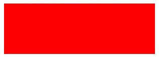

您也可以使用 `rect` 标记创建一个正方形，正方形就是高和宽相等的矩形。

### `circle` 元素

要创建一个圆，可以定义圆心的 x 和 y 坐标和一个半径，如清单 7 所示。

##### 创建一个圆

```
<svg xmlns="http://www.w3.org/2000/svg" version="1.1">
    <circle cx="100" cy="50" r="40" fill="red"/>
</svg>

```

Show moreShow more icon

清单 7 中的代码会生成图 7 中的图形。

##### 圆

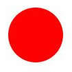

`cx` 和 `cy` 属性定义圆心相对于绘图画布的位置。因为半径是圆宽度的一半，所以在定义半径时，请记住图像的总宽度将是该值的两倍。

### `ellipse` 元素

椭圆基本上是一个圆，其中的代码定义了两个半径，如清单 8 所示。

##### 创建一个椭圆

```
<svg xmlns="http://www.w3.org/2000/svg" version="1.1">
                    <ellipse cx="300" cy="80" rx="100" ry="50" style="fill:red;"/>
                </svg>

```

Show moreShow more icon

清单 8 中的代码会生成图 8 中的图形。

##### 椭圆

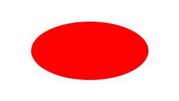

再次说明， `cx` 和 `cy` 属性定义了相对于画布的中心坐标。但是对于椭圆，需要使用 `rx` 和 `ry` 属性为 x 轴定义一个半径，为 y 轴定义一个半径。

### `polygon` 元素

多边形这个形状包含至少 3 条边。清单 9 创建了一个简单的三角形。

##### 创建一个三角形

```
<svg xmlns="http://www.w3.org/2000/svg" version="1.1">
                    <polygon points="200,10 250,190 160,210"
                        style="fill:red;stroke:black;stroke-width:1"/>
                </svg>

```

Show moreShow more icon

清单 9 中的代码会生成图 9 中的图形。

##### 三角形

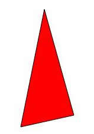

类似于 `polyline` 元素，可使用 `points` 属性定义几对 x 和 y 坐标来创建多边形。

可以通过添加 x 和 y 对，创建具有任意多条边的多边形。通过修改上一个示例，可以创建一个四边形，如清单 10 所示。

##### 创建一个四边形

```
<svg xmlns="http://www.w3.org/2000/svg" version="1.1">
                    <polygon points="220,10 300,210 170,250 123,234"
                        style="fill:red;stroke:black;stroke-width:1"/>
                </svg>

```

Show moreShow more icon

清单 10 中的代码会生成图 10 中的图形。

##### 四边形

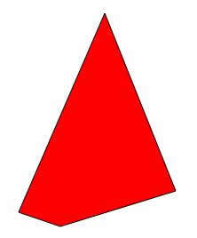

甚至可以使用 `polygon` 标记创建复杂的形状。清单 11 创建一个星形。

##### 创建一个星形

```
<svg xmlns="http://www.w3.org/2000/svg" version="1.1">
      <polygon points="100,10 40,180 190,60 10,60 160,180 100,10"
            style="fill:red;stroke:black;stroke-width:1"/>
</svg>

```

Show moreShow more icon

清单 11 中的代码会生成图 11 中的图形。

##### 星形

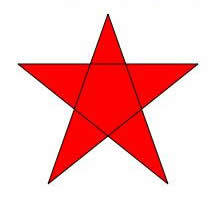

### `path` 元素

使用 `path` 元素（所有绘图元素中最复杂的），可以使用一组专门的命令创建任意图形。 `path` 元素支持下表中的命令。

##### `path` 元素支持的命令

命令描述`M`移动到`L`连线到`H`水平连线到`V`垂直连线到`C`使用曲线连接到`S`使用平滑曲线连接到`Q`使用二次贝塞尔曲线连接到`T`使用平滑的二次贝塞尔曲线连接到`A`使用椭圆曲线连接到`Z`将路径封闭到

能以大写或小写形式使用这些命令。当命令为大写时，应用绝对位置。当它为小写时，应用相对位置。提供所有命令示例已超出了本文的范围。但是，以下示例会演示它们的基本使用。

可以使用 `path` 元素从本文前面的示例创建任何简单的形状。清单 12 使用 `path` 元素创建了一个基本的三角形。

##### 使用 `path` 元素创建一个三角形

```
<svg xmlns="http://www.w3.org/2000/svg" version="1.1">
    <path d="M150 0 L75 200 L225 200 Z" style="fill:red"/>
</svg>

```

Show moreShow more icon

清单 12 中的代码会生成图 12 中的图形。

##### 使用 `path` 元素的三角形

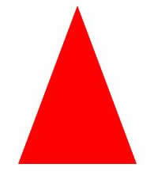

这组命令使用 `d` 属性定义。在本例中，从 x 坐标 150 和 y 坐标 0 处开始绘制，这在移动到命令 (`M150 0`) 中定义。然后再使用 “连线到” 命令绘制一条直线连接到 x 坐标 75 和 y 坐标 200 的位置 (`L75 200`)。接下来，使用另一个 “连线到” 命令绘制另一条线 (`L225 200`)。最后，使用 “封闭到” 命令封闭图形 (`Z`)。 `Z` 命令没有提供任何坐标，因为要关闭您所在的路径，根据定义，要绘制一条从当前位置到图形起点（在本例中为 x = 150 y =0）的线。

这里的意图是展示一个基本示例；如果您想要的只是一个简单的三角形，最好使用 `polygon` 标记。

`path` 元素的真正强大之处是创建自定义形状的能力，如清单 13 所示。该示例来自万维网联盟 (W3C) 文档 _可缩放矢量图形 (SVG) 1.1（第二版）_ （参见 参考资料 ）。

##### 使用 `path` 元素创建一个自定义形状

```
<svg xmlns="http://www.w3.org/2000/svg" version="1.1">
       <path d="M300,200 h-150 a150,150 0 1,0 150,-150 z"
                fill="red" stroke="blue" stroke-width="5"/>
       <path d="M275,175 v-150 a150,150 0 0,0 -150,150 z"
                 fill="yellow" stroke="blue" stroke-width="5"/>
       <path d="M600,350 l 50,-25
                 a25,25 -30 0,1 50,-25 l 50,-25
                 a25,50 -30 0,1 50,-25 l 50,-25
                 a25,75 -30 0,1 50,-25 l 50,-25
                 a25,100 -30 0,1 50,-25 l 50,-25"
                 fill="none" stroke="red" stroke-width="5"/>
</svg>

```

Show moreShow more icon

清单 13 中的代码会生成图 13 中的图形。

##### 使用 `path` 元素的自定义形状

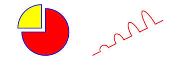

使用 `path` 元素，可以创建复杂的图形，比如图表和波浪线。请注意，这个示例使用了多个 `path` 元素。当创建图形时，根 SVG 标记中可以包含多个绘图元素。

## 过滤器和渐变

除了目前为止许多示例中的基本 CSS 样式，SVG 图形还支持使用过滤器和渐变。本节将介绍如何向 SVG 图形应用过滤器和渐变。

### 过滤器

可以使用过滤器向 SVG 图形应用特殊的效果。SVG 支持以下过滤器。

- feBlend
- feColorMatrix
- feComponentTransfer
- feComposite
- feConvolveMatrix
- feDiffuseLighting
- feDisplacementMap
- feFlood
- feGaussianBlur
- feImage
- feMerge
- feMorphology
- feOffset
- feSpecularLighting
- feTile
- feTurbulence
- feDistantLight
- fePointLight
- feSpotLight

请参见 参考资料 ，了解使用这些过滤器的详细说明。

清单 14 创建了一种应用到矩形上的投影效果。

##### 创建矩形的投影效果

```
<svg xmlns="http://www.w3.org/2000/svg" version="1.1">
          <defs>
                   <filter id="f1" x="0" y="0"
                             width="200%" height="200%">
                         <feOffset result="offOut" in="SourceAlpha"
                              dx="20" dy="20"/>
                         <feGaussianBlur result="blurOut"
                               in="offOut" stdDeviation="10"/>
                         <feBlend in="SourceGraphic"
                                in2="blurOut" mode="normal"/>
                    </filter>
         </defs>
          <rect width="90" height="90" stroke="green"
                   stroke-width="3" fill="yellow" filter="url(#f1)"/>
</svg>

```

Show moreShow more icon

清单 14 中的代码会生成图 14 中的图形。

##### 一个矩形的投影效果

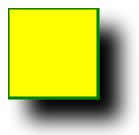

过滤器在 `def` （表示定义）元素中定义。本示例中的过滤器分配了一个 `id "f1"` 。 `filter` 标记本身拥有定义过滤器的 x 和 y 坐标及宽度和高度的属性。在 `filter` 标记中，可以使用想要的过滤器元素并将其属性设置为想要的值。

定义过滤器之后，使用 `filter` 属性将它与一个特定图形关联，如 [`rect` 元素](#code-rect-code-元素) 中所示。将 `url` 值设置为您分配给过滤器的 `id` 属性的值。

### 渐变

_渐变_ 是从一种颜色到另一种颜色逐渐的过渡。渐变具有两种基本形式：线性和径向渐变。所应用的渐变类型由您使用的元素确定。以下示例展示了应用于一个椭圆形的线性和径向渐变。

清单 15 创建了一个具有线性渐变的椭圆。

##### 创建一个具有线性渐变的椭圆

```
<svg xmlns="http://www.w3.org/2000/svg" version="1.1">
         <defs>
            <linearGradient id="grad1" x1="0%" y1="0%"
                     x2="100%" y2="0%">
           <stop offset="0%"
                     style="stop-color:rgb(255,255,0);stop-opacity:1"/>
           <stop offset="100%"
                     style="stop-color:rgb(255,0,0);stop-opacity:1"/>
           </linearGradient>
         </defs>
         <ellipse cx="200" cy="70" rx="85" ry="55"
                        fill="url(#grad1)"/>
</svg>

```

Show moreShow more icon

清单 15 中的代码会生成图 15 中的图形。

##### 具有线性渐变的椭圆

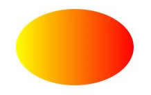

清单 16 创建了一个具有径向渐变的椭圆。

##### 创建一个具有径向渐变的椭圆

```
<svg xmlns="http://www.w3.org/2000/svg" version="1.1">
             <defs>
                     <radialGradient id="grad1" cx="50%" cy="50%"
                            r="50%" fx="50%" fy="50%">
                     <stop offset="0%"
                            style="stop-color:rgb(255,255,255);stop-opacity:0"/>
                     <stop offset="100%"
                            style="stop-color:rgb(255,0,0);stop-opacity:1"/>
                     </radialGradient>
             </defs>
             <ellipse cx="200" cy="70" rx="85" ry="55"
                     fill="url(#grad1)"/>
</svg>

```

Show moreShow more icon

清单 16 中的代码会生成图 16 中的图形。

##### 具有径向渐变的椭圆

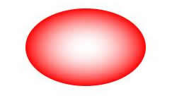

像过滤器一样，渐变在 `def` 元素内定义。每个渐变分配有一个 `id` 。渐变属性（比如颜色）可使用 `stop` 元素在渐变标记内设置。要将渐变应用于图形，可以将 `fill` 属性的 `url` 值设置为想要的渐变的 `id` 。

## 文本和 SVG

除了基本形状，还可以使用 SVG 生成文本，如清单 17 所示。

##### 使用 SVG 创建文本

```
<svg xmlns="http://www.w3.org/2000/svg" version="1.1">
       <text x="0" y="15" fill="red">I love SVG</text>
</svg>

```

Show moreShow more icon

清单 17 中的代码会生成图 17 中的图形。

##### SVG 文本

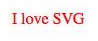

此示例使用了一个 `text` 元素来创建句子 `I love SVG` 。当使用 `text` 元素时，要显示的实际文本在开始和结束 `text` 元素之间。

您可以沿多个轴，以及甚至沿多条路径显示文本。清单 18 沿一条弧形路径显示文本。

##### 沿一条弧形路径创建文本

```
<svg xmlns="http://www.w3.org/2000/svg" version="1.1"
xmlns:xlink="http://www.w3.org/1999/xlink">
        <defs>
                  <path id="path1" d="M75,20 a1,1 0 0,0 100,0"/>
        </defs>
        <text x="10" y="100" style="fill:red;">
                   <textPath xlink:href="#path1">I love SVG I love SVG</textPath>
         </text>
</svg>

```

Show moreShow more icon

清单 18 中的代码会生成图 18 中的图形。

##### 一个弧形路径上的文本

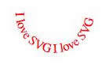

在此示例中，向根 SVG 标记添加了一个额外的 XML 命名空间 `xlink` 。用户显示文本的弧形路径在 `def` 元素内创建，所以该路径不会在图形中实际渲染出来。要显示的文本嵌套在一个 `textPath` 元素内，该元素使用 `xlink` 命名空间引用想要的路径的 `id` 。

与其他 SVG 图形一样，也可以向文本应用过滤器和渐变。清单 19 向一些文本应用了一个过滤器和一种渐变。

##### 创建具有过滤器和渐变的文本

```
<svg xmlns="http://www.w3.org/2000/svg" version="1.1"
xmlns:xlink="http://www.w3.org/1999/xlink">
          <defs>
                    <radialGradient id="grad1" cx="50%" cy="50%"
                           r="50%" fx="50%" fy="50%">
                           <stop offset="0%"
                                style="stop-color:red; stop-opacity:0"/>
                           <stop offset="100%"
                               style="stop-color:rgb(0,0,0);stop-opacity:1"/>
                    </radialGradient>
                    <filter id="f1" x="0" y="0"
                               width="200%" height="200%">
                           <feOffset result="offOut"
                               in="SourceAlpha" dx="20" dy="20"/>
                           <feGaussianBlur result="blurOut"
                               in="offOut" stdDeviation="10"/>
                           <feBlend in="SourceGraphic"
                               in2="blurOut" mode="normal"/>
                    </filter>
          </defs>
          <text x="10" y="100" style="fill:url(#grad1); font-size: 30px;"
                        filter="url(#f1)">
                        I love SVG I love SVG
          </text>
</svg>

```

Show moreShow more icon

[创建具有过滤器和渐变的文本](#创建具有过滤器和渐变的文本) 中的代码会生成图 19 中的图形。

##### 具有过滤器和渐变的文本

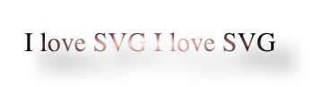

## 向网页添加 SVG XML

创建 SVG XML 之后，可采用多种方式将它包含在 HTML 页面中。第一种方法是直接将 SVG XML 嵌入到 HTML 文档中，如清单 20 所示。

##### 直接将 SVG XML 嵌入 HTML 文档

```
<html>
     <head>
             <title>Embedded SVG</title>
     </head>
     <body style="height: 600px;width: 100%; padding: 30px;">
              <svg xmlns="http://www.w3.org/2000/svg" version="1.1">
                    <circle cx="100" cy="50" r="40" fill="red"/>
              </svg>
     </body>
</html>

```

Show moreShow more icon

此方法可能最简单，但它不支持重用。请记住，可以使用 .svg 扩展名保存 SVG XML 文件。当将 SVG 图形保存在 .svg 文件中时，您可以使用 `embed` 、 `object` 和 `iframe` 元素来将它包含在网页中。清单 21 显示了使用 `embed` 元素包含 SVG XML 文件的代码。

##### 使用 `embed` 元素包含一个 SVG XML 文件

```
<embed src="circle.svg" type="image/svg+xml" />

```

Show moreShow more icon

清单 22 显示了如何使用 `object` 元素包含一个 SVG XML 文件。

##### 使用 `object` 元素包含一个 SVG XML 文件

```
<object data="circle.svg" type="image/svg+xml"></object>

```

Show moreShow more icon

清单 23 给出了使用 `iframe` 元素包含一个 SVG XML 文件的代码。

##### 使用 `iframe` 元素包含一个 SVG XML 文件

```
<iframe src="circle1.svg"></iframe>

```

Show moreShow more icon

当使用其中一种方法时，可以将同一个 SVG 图形包含在多个页面中，并编辑 .svg 源文件来进行更新。

## 结束语

本文介绍了使用 SVG 格式创建图形的基础知识。您学习了如何使用内置的集合元素（比如线、矩形、圆等）创建基本形状。您还学习了如何通过发出一系列命令（比如移动到、连线到和使用弧线连接到），使用 `path` 元素创建复杂的图形。本文还探讨了如何对 SVG 图形应用过滤器和渐变，包括文本图形，以及如何在 HTML 页面中包含 SVG 图形。