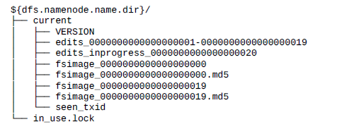
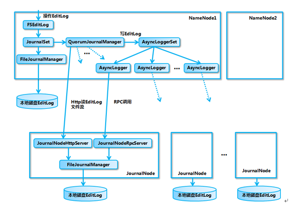
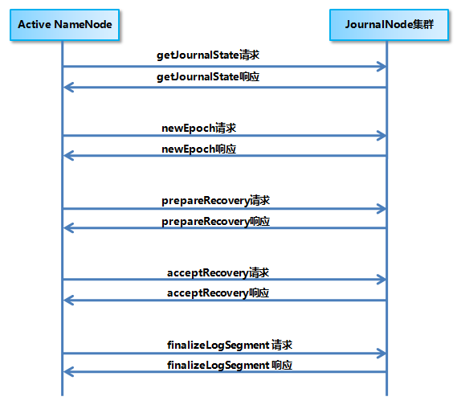
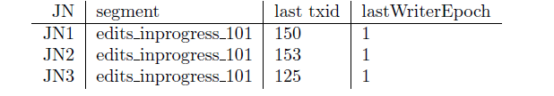

# Hadoop NameNode 高可用 (High Availability) 实现解析
理解 Hadoop NameNode

**标签:** 分析

[原文链接](https://developer.ibm.com/zh/articles/os-cn-hadoop-name-node/)

程磊, 杨剑飞

发布: 2015-11-10

* * *

## NameNode 高可用整体架构概述

在 Hadoop 1.0 时代，Hadoop 的两大核心组件 HDFS NameNode 和 JobTracker 都存在着单点问题，这其中以 NameNode 的单点问题尤为严重。因为 NameNode 保存了整个 HDFS 的元数据信息，一旦 NameNode 挂掉，整个 HDFS 就无法访问，同时 Hadoop 生态系统中依赖于 HDFS 的各个组件，包括 MapReduce、Hive、Pig 以及 HBase 等也都无法正常工作，并且重新启动 NameNode 和进行数据恢复的过程也会比较耗时。这些问题在给 Hadoop 的使用者带来困扰的同时，也极大地限制了 Hadoop 的使用场景，使得 Hadoop 在很长的时间内仅能用作离线存储和离线计算，无法应用到对可用性和数据一致性要求很高的在线应用场景中。

所幸的是，在 Hadoop2.0 中，HDFS NameNode 和 YARN ResourceManger(JobTracker 在 2.0 中已经被整合到 YARN ResourceManger 之中) 的单点问题都得到了解决，经过多个版本的迭代和发展，目前已经能用于生产环境。HDFS NameNode 和 YARN ResourceManger 的高可用 (High Availability，HA) 方案基本类似，两者也复用了部分代码，但是由于 HDFS NameNode 对于数据存储和数据一致性的要求比 YARN ResourceManger 高得多，所以 HDFS NameNode 的高可用实现更为复杂一些，本文从内部实现的角度对 HDFS NameNode 的高可用机制进行详细的分析。

HDFS NameNode 的高可用整体架构如图 1 所示 (图片来源于参考文献 [1])：

##### 图 1\. HDFS NameNode 高可用整体架构

从上图中，我们可以看出 NameNode 的高可用架构主要分为下面几个部分：

Active NameNode 和 Standby NameNode：两台 NameNode 形成互备，一台处于 Active 状态，为主 NameNode，另外一台处于 Standby 状态，为备 NameNode，只有主 NameNode 才能对外提供读写服务。

主备切换控制器 ZKFailoverController：ZKFailoverController 作为独立的进程运行，对 NameNode 的主备切换进行总体控制。ZKFailoverController 能及时检测到 NameNode 的健康状况，在主 NameNode 故障时借助 Zookeeper 实现自动的主备选举和切换，当然 NameNode 目前也支持不依赖于 Zookeeper 的手动主备切换。

Zookeeper 集群：为主备切换控制器提供主备选举支持。

共享存储系统：共享存储系统是实现 NameNode 的高可用最为关键的部分，共享存储系统保存了 NameNode 在运行过程中所产生的 HDFS 的元数据。主 NameNode 和

NameNode 通过共享存储系统实现元数据同步。在进行主备切换的时候，新的主 NameNode 在确认元数据完全同步之后才能继续对外提供服务。

DataNode 节点：除了通过共享存储系统共享 HDFS 的元数据信息之外，主 NameNode 和备 NameNode 还需要共享 HDFS 的数据块和 DataNode 之间的映射关系。DataNode 会同时向主 NameNode 和备 NameNode 上报数据块的位置信息。

下面开始分别介绍 NameNode 的主备切换实现和共享存储系统的实现，在文章的最后会结合笔者的实践介绍一下在 NameNode 的高可用运维中的一些注意事项。

## NameNode 的主备切换实现

NameNode 主备切换主要由 ZKFailoverController、HealthMonitor 和 ActiveStandbyElector 这 3 个组件来协同实现：

ZKFailoverController 作为 NameNode 机器上一个独立的进程启动 (在 hdfs 启动脚本之中的进程名为 zkfc)，启动的时候会创建 HealthMonitor 和 ActiveStandbyElector 这两个主要的内部组件，ZKFailoverController 在创建 HealthMonitor 和 ActiveStandbyElector 的同时，也会向 HealthMonitor 和 ActiveStandbyElector 注册相应的回调方法。

HealthMonitor 主要负责检测 NameNode 的健康状态，如果检测到 NameNode 的状态发生变化，会回调 ZKFailoverController 的相应方法进行自动的主备选举。

ActiveStandbyElector 主要负责完成自动的主备选举，内部封装了 Zookeeper 的处理逻辑，一旦 Zookeeper 主备选举完成，会回调 ZKFailoverController 的相应方法来进行 NameNode 的主备状态切换。

NameNode 实现主备切换的流程如图 2 所示，有以下几步：

1. HealthMonitor 初始化完成之后会启动内部的线程来定时调用对应 NameNode 的 HAServiceProtocol RPC 接口的方法，对 NameNode 的健康状态进行检测。
2. HealthMonitor 如果检测到 NameNode 的健康状态发生变化，会回调 ZKFailoverController 注册的相应方法进行处理。
3. 如果 ZKFailoverController 判断需要进行主备切换，会首先使用 ActiveStandbyElector 来进行自动的主备选举。
4. ActiveStandbyElector 与 Zookeeper 进行交互完成自动的主备选举。
5. ActiveStandbyElector 在主备选举完成后，会回调 ZKFailoverController 的相应方法来通知当前的 NameNode 成为主 NameNode 或备 NameNode。
6. ZKFailoverController 调用对应 NameNode 的 HAServiceProtocol RPC 接口的方法将 NameNode 转换为 Active 状态或 Standby 状态。

##### 图 2\. NameNode 的主备切换流程

下面分别对 HealthMonitor、ActiveStandbyElector 和 ZKFailoverController 的实现细节进行分析：

### HealthMonitor 实现分析

ZKFailoverController 在初始化的时候会创建 HealthMonitor，HealthMonitor 在内部会启动一个线程来循环调用 NameNode 的 HAServiceProtocol RPC 接口的方法来检测 NameNode 的状态，并将状态的变化通过回调的方式来通知 ZKFailoverController。

HealthMonitor 主要检测 NameNode 的两类状态，分别是 HealthMonitor.State 和 HAServiceStatus。HealthMonitor.State 是通过 HAServiceProtocol RPC 接口的 monitorHealth 方法来获取的，反映了 NameNode 节点的健康状况，主要是磁盘存储资源是否充足。HealthMonitor.State 包括下面几种状态：

- INITIALIZING：HealthMonitor 在初始化过程中，还没有开始进行健康状况检测；
- SERVICE\_HEALTHY：NameNode 状态正常；
- SERVICE\_NOT\_RESPONDING：调用 NameNode 的 monitorHealth 方法调用无响应或响应超时；
- SERVICE\_UNHEALTHY：NameNode 还在运行，但是 monitorHealth 方法返回状态不正常，磁盘存储资源不足；
- HEALTH\_MONITOR\_FAILED：HealthMonitor 自己在运行过程中发生了异常，不能继续检测 NameNode 的健康状况，会导致 ZKFailoverController 进程退出；

HealthMonitor.State 在状态检测之中起主要的作用，在 HealthMonitor.State 发生变化的时候，HealthMonitor 会回调 ZKFailoverController 的相应方法来进行处理，具体处理见后文 ZKFailoverController 部分所述。

而 HAServiceStatus 则是通过 HAServiceProtocol RPC 接口的 getServiceStatus 方法来获取的，主要反映的是 NameNode 的 HA 状态，包括：

- INITIALIZING：NameNode 在初始化过程中；
- ACTIVE：当前 NameNode 为主 NameNode；
- STANDBY：当前 NameNode 为备 NameNode；
- STOPPING：当前 NameNode 已停止；

HAServiceStatus 在状态检测之中只是起辅助的作用，在 HAServiceStatus 发生变化时，HealthMonitor 也会回调 ZKFailoverController 的相应方法来进行处理，具体处理见后文 ZKFailoverController 部分所述。

### ActiveStandbyElector 实现分析

Namenode(包括 YARN ResourceManager) 的主备选举是通过 ActiveStandbyElector 来完成的，ActiveStandbyElector 主要是利用了 Zookeeper 的写一致性和临时节点机制，具体的主备选举实现如下：

#### 创建锁节点

如果 HealthMonitor 检测到对应的 NameNode 的状态正常，那么表示这个 NameNode 有资格参加 Zookeeper 的主备选举。如果目前还没有进行过主备选举的话，那么相应的 ActiveStandbyElector 就会发起一次主备选举，尝试在 Zookeeper 上创建一个路径为/hadoop-ha/${dfs.nameservices}/ActiveStandbyElectorLock 的临时节点 (${dfs.nameservices} 为 Hadoop 的配置参数 dfs.nameservices 的值，下同)，Zookeeper 的写一致性会保证最终只会有一个 ActiveStandbyElector 创建成功，那么创建成功的 ActiveStandbyElector 对应的 NameNode 就会成为主 NameNode，ActiveStandbyElector 会回调 ZKFailoverController 的方法进一步将对应的 NameNode 切换为 Active 状态。而创建失败的 ActiveStandbyElector 对应的 NameNode 成为备 NameNode，ActiveStandbyElector 会回调 ZKFailoverController 的方法进一步将对应的 NameNode 切换为 Standby 状态。

#### 注册 Watcher 监听

不管创建/hadoop-ha/${dfs.nameservices}/ActiveStandbyElectorLock 节点是否成功，ActiveStandbyElector 随后都会向 Zookeeper 注册一个 Watcher 来监听这个节点的状态变化事件，ActiveStandbyElector 主要关注这个节点的 NodeDeleted 事件。

#### 自动触发主备选举

如果 Active NameNode 对应的 HealthMonitor 检测到 NameNode 的状态异常时， ZKFailoverController 会主动删除当前在 Zookeeper 上建立的临时节点/hadoop-ha/${dfs.nameservices}/ActiveStandbyElectorLock，这样处于 Standby 状态的 NameNode 的 ActiveStandbyElector 注册的监听器就会收到这个节点的 NodeDeleted 事件。收到这个事件之后，会马上再次进入到创建/hadoop-ha/${dfs.nameservices}/ActiveStandbyElectorLock 节点的流程，如果创建成功，这个本来处于 Standby 状态的 NameNode 就选举为主 NameNode 并随后开始切换为 Active 状态。

当然，如果是 Active 状态的 NameNode 所在的机器整个宕掉的话，那么根据 Zookeeper 的临时节点特性，/hadoop-ha/${dfs.nameservices}/ActiveStandbyElectorLock 节点会自动被删除，从而也会自动进行一次主备切换。

#### 防止脑裂

Zookeeper 在工程实践的过程中经常会发生的一个现象就是 Zookeeper 客户端”假死”，所谓的”假死”是指如果 Zookeeper 客户端机器负载过高或者正在进行 JVM Full GC，那么可能会导致 Zookeeper 客户端到 Zookeeper 服务端的心跳不能正常发出，一旦这个时间持续较长，超过了配置的 Zookeeper Session Timeout 参数的话，Zookeeper 服务端就会认为客户端的 session 已经过期从而将客户端的 Session 关闭。”假死”有可能引起分布式系统常说的双主或脑裂 (brain-split) 现象。具体到本文所述的 NameNode，假设 NameNode1 当前为 Active 状态，NameNode2 当前为 Standby 状态。如果某一时刻 NameNode1 对应的 ZKFailoverController 进程发生了”假死”现象，那么 Zookeeper 服务端会认为 NameNode1 挂掉了，根据前面的主备切换逻辑，NameNode2 会替代 NameNode1 进入 Active 状态。但是此时 NameNode1 可能仍然处于 Active 状态正常运行，即使随后 NameNode1 对应的 ZKFailoverController 因为负载下降或者 Full GC 结束而恢复了正常，感知到自己和 Zookeeper 的 Session 已经关闭，但是由于网络的延迟以及 CPU 线程调度的不确定性，仍然有可能会在接下来的一段时间窗口内 NameNode1 认为自己还是处于 Active 状态。这样 NameNode1 和 NameNode2 都处于 Active 状态，都可以对外提供服务。这种情况对于 NameNode 这类对数据一致性要求非常高的系统来说是灾难性的，数据会发生错乱且无法恢复。Zookeeper 社区对这种问题的解决方法叫做 fencing，中文翻译为隔离，也就是想办法把旧的 Active NameNode 隔离起来，使它不能正常对外提供服务。

ActiveStandbyElector 为了实现 fencing，会在成功创建 Zookeeper 节点 hadoop-ha/${dfs.nameservices}/ActiveStandbyElectorLock 从而成为 Active NameNode 之后，创建另外一个路径为/hadoop-ha/${dfs.nameservices}/ActiveBreadCrumb 的持久节点，这个节点里面保存了这个 Active NameNode 的地址信息。Active NameNode 的 ActiveStandbyElector 在正常的状态下关闭 Zookeeper Session 的时候 (注意由于/hadoop-ha/${dfs.nameservices}/ActiveStandbyElectorLock 是临时节点，也会随之删除)，会一起删除节点/hadoop-ha/${dfs.nameservices}/ActiveBreadCrumb。但是如果 ActiveStandbyElector 在异常的状态下 Zookeeper Session 关闭 (比如前述的 Zookeeper 假死)，那么由于/hadoop-ha/${dfs.nameservices}/ActiveBreadCrumb 是持久节点，会一直保留下来。后面当另一个 NameNode 选主成功之后，会注意到上一个 Active NameNode 遗留下来的这个节点，从而会回调 ZKFailoverController 的方法对旧的 Active NameNode 进行 fencing，具体处理见后文 ZKFailoverController 部分所述。

### ZKFailoverController 实现分析

ZKFailoverController 在创建 HealthMonitor 和 ActiveStandbyElector 的同时，会向 HealthMonitor 和 ActiveStandbyElector 注册相应的回调函数，ZKFailoverController 的处理逻辑主要靠 HealthMonitor 和 ActiveStandbyElector 的回调函数来驱动。

#### 对 HealthMonitor 状态变化的处理

如前所述，HealthMonitor 会检测 NameNode 的两类状态，HealthMonitor.State 在状态检测之中起主要的作用，ZKFailoverController 注册到 HealthMonitor 上的处理 HealthMonitor.State 状态变化的回调函数主要关注 SERVICE\_HEALTHY、SERVICE\_NOT\_RESPONDING 和 SERVICE\_UNHEALTHY 这 3 种状态：

- 如果检测到状态为 SERVICE\_HEALTHY，表示当前的 NameNode 有资格参加 Zookeeper 的主备选举，如果目前还没有进行过主备选举的话，ZKFailoverController 会调用 ActiveStandbyElector 的 joinElection 方法发起一次主备选举。
- 如果检测到状态为 SERVICE\_NOT\_RESPONDING 或者是 SERVICE\_UNHEALTHY，就表示当前的 NameNode 出现问题了，ZKFailoverController 会调用 ActiveStandbyElector 的 quitElection 方法删除当前已经在 Zookeeper 上建立的临时节点退出主备选举，这样其它的 NameNode 就有机会成为主 NameNode。

而 HAServiceStatus 在状态检测之中仅起辅助的作用，在 HAServiceStatus 发生变化时，ZKFailoverController 注册到 HealthMonitor 上的处理 HAServiceStatus 状态变化的回调函数会判断 NameNode 返回的 HAServiceStatus 和 ZKFailoverController 所期望的是否一致，如果不一致的话，ZKFailoverController 也会调用 ActiveStandbyElector 的 quitElection 方法删除当前已经在 Zookeeper 上建立的临时节点退出主备选举。

#### 对 ActiveStandbyElector 主备选举状态变化的处理

在 ActiveStandbyElector 的主备选举状态发生变化时，会回调 ZKFailoverController 注册的回调函数来进行相应的处理：

- 如果 ActiveStandbyElector 选主成功，那么 ActiveStandbyElector 对应的 NameNode 成为主 NameNode，ActiveStandbyElector 会回调 ZKFailoverController 的 becomeActive 方法，这个方法通过调用对应的 NameNode 的 HAServiceProtocol RPC 接口的 transitionToActive 方法，将 NameNode 转换为 Active 状态。
- 如果 ActiveStandbyElector 选主失败，那么 ActiveStandbyElector 对应的 NameNode 成为备 NameNode，ActiveStandbyElector 会回调 ZKFailoverController 的 becomeStandby 方法，这个方法通过调用对应的 NameNode 的 HAServiceProtocol RPC 接口的 transitionToStandby 方法，将 NameNode 转换为 Standby 状态。
- 如果 ActiveStandbyElector 选主成功之后，发现了上一个 Active NameNode 遗留下来的/hadoop-ha/${dfs.nameservices}/ActiveBreadCrumb 节点 (见”ActiveStandbyElector 实现分析”一节”防止脑裂”部分所述)，那么 ActiveStandbyElector 会首先回调 ZKFailoverController 注册的 fenceOldActive 方法，尝试对旧的 Active NameNode 进行 fencing，在进行 fencing 的时候，会执行以下的操作：

- 首先尝试调用这个旧 Active NameNode 的 HAServiceProtocol RPC 接口的 transitionToStandby 方法，看能不能把它转换为 Standby 状态。

- 如果 transitionToStandby 方法调用失败，那么就执行 Hadoop 配置文件之中预定义的隔离措施，Hadoop 目前主要提供两种隔离措施，通常会选择 sshfence：

- sshfence：通过 SSH 登录到目标机器上，执行命令 fuser 将对应的进程杀死；

- shellfence：执行一个用户自定义的 shell 脚本来将对应的进程隔离；

只有在成功地执行完成 fencing 之后，选主成功的 ActiveStandbyElector 才会回调 ZKFailoverController 的 becomeActive 方法将对应的 NameNode 转换为 Active 状态，开始对外提供服务。

## NameNode 的共享存储实现

过去几年中 Hadoop 社区涌现过很多的 NameNode 共享存储方案，比如 shared NAS+NFS、BookKeeper、BackupNode 和 QJM(Quorum Journal Manager) 等等。目前社区已经把由 Clouderea 公司实现的基于 QJM 的方案合并到 HDFS 的 trunk 之中并且作为默认的共享存储实现，本部分只针对基于 QJM 的共享存储方案的内部实现原理进行分析。为了理解 QJM 的设计和实现，首先要对 NameNode 的元数据存储结构有所了解。

### NameNode 的元数据存储概述

一个典型的 NameNode 的元数据存储目录结构如图 3 所示 (图片来源于参考文献 [4])，这里主要关注其中的 EditLog 文件和 FSImage 文件：

##### 图 3\. NameNode 的元数据存储目录结构

NameNode 在执行 HDFS 客户端提交的创建文件或者移动文件这样的写操作的时候，会首先把这些操作记录在 EditLog 文件之中，然后再更新内存中的文件系统镜像。内存中的文件系统镜像用于 NameNode 向客户端提供读服务，而 EditLog 仅仅只是在数据恢复的时候起作用。记录在 EditLog 之中的每一个操作又称为一个事务，每个事务有一个整数形式的事务 id 作为编号。EditLog 会被切割为很多段，每一段称为一个 Segment。正在写入的 EditLog Segment 处于 in-progress 状态，其文件名形如 edits _inprogress_ ${start _txid}，其中${start\_txid} 表示这个 segment 的起始事务 id，例如上图中的 edits\_inprogress\_0000000000000000020。而已经写入完成的 EditLog Segment 处于 finalized 状态，其文件名形如 edits_ ${start\_txid}-${end\_txid}，其中${start\_txid} 表示这个 segment 的起始事务 id，${end\_txid} 表示这个 segment 的结束事务 id，例如上图中的 edits\_0000000000000000001-0000000000000000019。

NameNode 会定期对内存中的文件系统镜像进行 checkpoint 操作，在磁盘上生成 FSImage 文件，FSImage 文件的文件名形如 fsimage\_${end\_txid}，其中${end\_txid} 表示这个 fsimage 文件的结束事务 id，例如上图中的 fsimage\_0000000000000000020。在 NameNode 启动的时候会进行数据恢复，首先把 FSImage 文件加载到内存中形成文件系统镜像，然后再把 EditLog 之中 FsImage 的结束事务 id 之后的 EditLog 回放到这个文件系统镜像上。

### 基于 QJM 的共享存储系统的总体架构

基于 QJM 的共享存储系统主要用于保存 EditLog，并不保存 FSImage 文件。FSImage 文件还是在 NameNode 的本地磁盘上。QJM 共享存储的基本思想来自于 Paxos 算法 (参见参考文献 [3])，采用多个称为 JournalNode 的节点组成的 JournalNode 集群来存储 EditLog。每个 JournalNode 保存同样的 EditLog 副本。每次 NameNode 写 EditLog 的时候，除了向本地磁盘写入 EditLog 之外，也会并行地向 JournalNode 集群之中的每一个 JournalNode 发送写请求，只要大多数 (majority) 的 JournalNode 节点返回成功就认为向 JournalNode 集群写入 EditLog 成功。如果有 2N+1 台 JournalNode，那么根据大多数的原则，最多可以容忍有 N 台 JournalNode 节点挂掉。

基于 QJM 的共享存储系统的内部实现架构图如图 4 所示，主要包含下面几个主要的组件：

##### 图 4\. 基于 QJM 的共享存储系统的内部实现架构图

FSEditLog：这个类封装了对 EditLog 的所有操作，是 NameNode 对 EditLog 的所有操作的入口。

JournalSet： 这个类封装了对本地磁盘和 JournalNode 集群上的 EditLog 的操作，内部包含了两类 JournalManager，一类为 FileJournalManager，用于实现对本地磁盘上 EditLog 的操作。一类为 QuorumJournalManager，用于实现对 JournalNode 集群上共享目录的 EditLog 的操作。FSEditLog 只会调用 JournalSet 的相关方法，而不会直接使用 FileJournalManager 和 QuorumJournalManager。

FileJournalManager：封装了对本地磁盘上的 EditLog 文件的操作，不仅 NameNode 在向本地磁盘上写入 EditLog 的时候使用 FileJournalManager，JournalNode 在向本地磁盘写入 EditLog 的时候也复用了 FileJournalManager 的代码和逻辑。

QuorumJournalManager：封装了对 JournalNode 集群上的 EditLog 的操作，它会根据 JournalNode 集群的 URI 创建负责与 JournalNode 集群通信的类 AsyncLoggerSet， QuorumJournalManager 通过 AsyncLoggerSet 来实现对 JournalNode 集群上的 EditLog 的写操作，对于读操作，QuorumJournalManager 则是通过 Http 接口从 JournalNode 上的 JournalNodeHttpServer 读取 EditLog 的数据。

AsyncLoggerSet：内部包含了与 JournalNode 集群进行通信的 AsyncLogger 列表，每一个 AsyncLogger 对应于一个 JournalNode 节点，另外 AsyncLoggerSet 也包含了用于等待大多数 JournalNode 返回结果的工具类方法给 QuorumJournalManager 使用。

AsyncLogger：具体的实现类是 IPCLoggerChannel，IPCLoggerChannel 在执行方法调用的时候，会把调用提交到一个单线程的线程池之中，由线程池线程来负责向对应的 JournalNode 的 JournalNodeRpcServer 发送 RPC 请求。

JournalNodeRpcServer：运行在 JournalNode 节点进程中的 RPC 服务，接收 NameNode 端的 AsyncLogger 的 RPC 请求。

JournalNodeHttpServer：运行在 JournalNode 节点进程中的 Http 服务，用于接收处于 Standby 状态的 NameNode 和其它 JournalNode 的同步 EditLog 文件流的请求。

下面对基于 QJM 的共享存储系统的两个关键性问题同步数据和恢复数据进行详细分析。

### 基于 QJM 的共享存储系统的数据同步机制分析

Active NameNode 和 StandbyNameNode 使用 JouranlNode 集群来进行数据同步的过程如图 5 所示，Active NameNode 首先把 EditLog 提交到 JournalNode 集群，然后 Standby NameNode 再从 JournalNode 集群定时同步 EditLog：

##### 图 5\. 基于 QJM 的共享存储的数据同步机制

#### Active NameNode 提交 EditLog 到 JournalNode 集群

当处于 Active 状态的 NameNode 调用 FSEditLog 类的 logSync 方法来提交 EditLog 的时候，会通过 JouranlSet 同时向本地磁盘目录和 JournalNode 集群上的共享存储目录写入 EditLog。写入 JournalNode 集群是通过并行调用每一个 JournalNode 的 QJournalProtocol RPC 接口的 journal 方法实现的，如果对大多数 JournalNode 的 journal 方法调用成功，那么就认为提交 EditLog 成功，否则 NameNode 就会认为这次提交 EditLog 失败。提交 EditLog 失败会导致 Active NameNode 关闭 JournalSet 之后退出进程，留待处于 Standby 状态的 NameNode 接管之后进行数据恢复。

从上面的叙述可以看出，Active NameNode 提交 EditLog 到 JournalNode 集群的过程实际上是同步阻塞的，但是并不需要所有的 JournalNode 都调用成功，只要大多数 JournalNode 调用成功就可以了。如果无法形成大多数，那么就认为提交 EditLog 失败，NameNode 停止服务退出进程。如果对应到分布式系统的 CAP 理论的话，虽然采用了 Paxos 的”大多数”思想对 C(consistency，一致性) 和 A(availability，可用性) 进行了折衷，但还是可以认为 NameNode 选择了 C 而放弃了 A，这也符合 NameNode 对数据一致性的要求。

#### Standby NameNode 从 JournalNode 集群同步 EditLog

当 NameNode 进入 Standby 状态之后，会启动一个 EditLogTailer 线程。这个线程会定期调用 EditLogTailer 类的 doTailEdits 方法从 JournalNode 集群上同步 EditLog，然后把同步的 EditLog 回放到内存之中的文件系统镜像上 (并不会同时把 EditLog 写入到本地磁盘上)。

这里需要关注的是：从 JournalNode 集群上同步的 EditLog 都是处于 finalized 状态的 EditLog Segment。”NameNode 的元数据存储概述”一节说过 EditLog Segment 实际上有两种状态，处于 in-progress 状态的 Edit Log 当前正在被写入，被认为是处于不稳定的中间态，有可能会在后续的过程之中发生修改，比如被截断。Active NameNode 在完成一个 EditLog Segment 的写入之后，就会向 JournalNode 集群发送 finalizeLogSegment RPC 请求，将完成写入的 EditLog Segment finalized，然后开始下一个新的 EditLog Segment。一旦 finalizeLogSegment 方法在大多数的 JournalNode 上调用成功，表明这个 EditLog Segment 已经在大多数的 JournalNode 上达成一致。一个 EditLog Segment 处于 finalized 状态之后，可以保证它再也不会变化。

从上面描述的过程可以看出，虽然 Active NameNode 向 JournalNode 集群提交 EditLog 是同步的，但 Standby NameNode 采用的是定时从 JournalNode 集群上同步 EditLog 的方式，那么 Standby NameNode 内存中文件系统镜像有很大的可能是落后于 Active NameNode 的，所以 Standby NameNode 在转换为 Active NameNode 的时候需要把落后的 EditLog 补上来。

### 基于 QJM 的共享存储系统的数据恢复机制分析

处于 Standby 状态的 NameNode 转换为 Active 状态的时候，有可能上一个 Active NameNode 发生了异常退出，那么 JournalNode 集群中各个 JournalNode 上的 EditLog 就可能会处于不一致的状态，所以首先要做的事情就是让 JournalNode 集群中各个节点上的 EditLog 恢复为一致。另外如前所述，当前处于 Standby 状态的 NameNode 的内存中的文件系统镜像有很大的可能是落后于旧的 Active NameNode 的，所以在 JournalNode 集群中各个节点上的 EditLog 达成一致之后，接下来要做的事情就是从 JournalNode 集群上补齐落后的 EditLog。只有在这两步完成之后，当前新的 Active NameNode 才能安全地对外提供服务。

补齐落后的 EditLog 的过程复用了前面描述的 Standby NameNode 从 JournalNode 集群同步 EditLog 的逻辑和代码，最终调用 EditLogTailer 类的 doTailEdits 方法来完成 EditLog 的补齐。使 JournalNode 集群上的 EditLog 达成一致的过程是一致性算法 Paxos 的典型应用场景，QJM 对这部分的处理可以看做是 Single Instance Paxos(参见参考文献 [3]) 算法的一个实现，在达成一致的过程中，Active NameNode 和 JournalNode 集群之间的交互流程如图 6 所示，具体描述如下：

##### 图 6\. Active NameNode 和 JournalNode 集群的交互流程图

#### 生成一个新的 Epoch

Epoch 是一个单调递增的整数，用来标识每一次 Active NameNode 的生命周期，每发生一次 NameNode 的主备切换，Epoch 就会加 1。这实际上是一种 fencing 机制，为什么需要 fencing 已经在前面”ActiveStandbyElector 实现分析”一节的”防止脑裂”部分进行了说明。产生新 Epoch 的流程与 Zookeeper 的 ZAB(Zookeeper Atomic Broadcast) 协议在进行数据恢复之前产生新 Epoch 的过程完全类似：

1. Active NameNode 首先向 JournalNode 集群发送 getJournalState RPC 请求，每个 JournalNode 会返回自己保存的最近的那个 Epoch(代码中叫 lastPromisedEpoch)。
2. NameNode 收到大多数的 JournalNode 返回的 Epoch 之后，在其中选择最大的一个加 1 作为当前的新 Epoch，然后向各个 JournalNode 发送 newEpoch RPC 请求，把这个新的 Epoch 发给各个 JournalNode。
3. 每一个 JournalNode 在收到新的 Epoch 之后，首先检查这个新的 Epoch 是否比它本地保存的 lastPromisedEpoch 大，如果大的话就把 lastPromisedEpoch 更新为这个新的 Epoch，并且向 NameNode 返回它自己的本地磁盘上最新的一个 EditLogSegment 的起始事务 id，为后面的数据恢复过程做好准备。如果小于或等于的话就向 NameNode 返回错误。
4. NameNode 收到大多数 JournalNode 对 newEpoch 的成功响应之后，就会认为生成新的 Epoch 成功。

在生成新的 Epoch 之后，每次 NameNode 在向 JournalNode 集群提交 EditLog 的时候，都会把这个 Epoch 作为参数传递过去。每个 JournalNode 会比较传过来的 Epoch 和它自己保存的 lastPromisedEpoch 的大小，如果传过来的 epoch 的值比它自己保存的 lastPromisedEpoch 小的话，那么这次写相关操作会被拒绝。一旦大多数 JournalNode 都拒绝了这次写操作，那么这次写操作就失败了。如果原来的 Active NameNode 恢复正常之后再向 JournalNode 写 EditLog，那么因为它的 Epoch 肯定比新生成的 Epoch 小，并且大多数的 JournalNode 都接受了这个新生成的 Epoch，所以拒绝写入的 JournalNode 数目至少是大多数，这样原来的 Active NameNode 写 EditLog 就肯定会失败，失败之后这个 NameNode 进程会直接退出，这样就实现了对原来的 Active NameNode 的隔离了。

#### 选择需要数据恢复的 EditLog Segment 的 id

需要恢复的 Edit Log 只可能是各个 JournalNode 上的最后一个 Edit Log Segment，如前所述，JournalNode 在处理完 newEpoch RPC 请求之后，会向 NameNode 返回它自己的本地磁盘上最新的一个 EditLog Segment 的起始事务 id，这个起始事务 id 实际上也作为这个 EditLog Segment 的 id。NameNode 会在所有这些 id 之中选择一个最大的 id 作为要进行数据恢复的 EditLog Segment 的 id。

#### 向 JournalNode 集群发送 prepareRecovery RPC 请求

NameNode 接下来向 JournalNode 集群发送 prepareRecovery RPC 请求，请求的参数就是选出的 EditLog Segment 的 id。JournalNode 收到请求后返回本地磁盘上这个 Segment 的起始事务 id、结束事务 id 和状态 (in-progress 或 finalized)。

这一步对应于 Paxos 算法的 Phase 1a 和 Phase 1b(参见参考文献 [3]) 两步。Paxos 算法的 Phase1 是 prepare 阶段，这也与方法名 prepareRecovery 相对应。并且这里以前面产生的新的 Epoch 作为 Paxos 算法中的提案编号 (proposal number)。只要大多数的 JournalNode 的 prepareRecovery RPC 调用成功返回，NameNode 就认为成功。

选择进行同步的基准数据源，向 JournalNode 集群发送 acceptRecovery RPC 请求 NameNode 根据 prepareRecovery 的返回结果，选择一个 JournalNode 上的 EditLog Segment 作为同步的基准数据源。选择基准数据源的原则大致是：在 in-progress 状态和 finalized 状态的 Segment 之间优先选择 finalized 状态的 Segment。如果都是 in-progress 状态的话，那么优先选择 Epoch 比较高的 Segment(也就是优先选择更新的)，如果 Epoch 也一样，那么优先选择包含的事务数更多的 Segment。

在选定了同步的基准数据源之后，NameNode 向 JournalNode 集群发送 acceptRecovery RPC 请求，将选定的基准数据源作为参数。JournalNode 接收到 acceptRecovery RPC 请求之后，从基准数据源 JournalNode 的 JournalNodeHttpServer 上下载 EditLog Segment，将本地的 EditLog Segment 替换为下载的 EditLog Segment。

这一步对应于 Paxos 算法的 Phase 2a 和 Phase 2b(参见参考文献 [3]) 两步。Paxos 算法的 Phase2 是 accept 阶段，这也与方法名 acceptRecovery 相对应。只要大多数 JournalNode 的 acceptRecovery RPC 调用成功返回，NameNode 就认为成功。

#### 向 JournalNode 集群发送 finalizeLogSegment RPC 请求，数据恢复完成

上一步执行完成之后，NameNode 确认大多数 JournalNode 上的 EditLog Segment 已经从基准数据源进行了同步。接下来，NameNode 向 JournalNode 集群发送 finalizeLogSegment RPC 请求，JournalNode 接收到请求之后，将对应的 EditLog Segment 从 in-progress 状态转换为 finalized 状态，实际上就是将文件名从 edits _inprogress_ ${startTxid} 重命名为 edits\_${startTxid}-${endTxid}，见”NameNode 的元数据存储概述”一节的描述。

只要大多数 JournalNode 的 finalizeLogSegment RPC 调用成功返回，NameNode 就认为成功。此时可以保证 JournalNode 集群的大多数节点上的 EditLog 已经处于一致的状态，这样 NameNode 才能安全地从 JournalNode 集群上补齐落后的 EditLog 数据。

需要注意的是，尽管基于 QJM 的共享存储方案看起来理论完备，设计精巧，但是仍然无法保证数据的绝对强一致，下面选取参考文献 [2] 中的一个例子来说明：

假设有 3 个 JournalNode：JN1、JN2 和 JN3，Active NameNode 发送了事务 id 为 151、152 和 153 的 3 个事务到 JournalNode 集群，这 3 个事务成功地写入了 JN2，但是在还没能写入 JN1 和 JN3 之前，Active NameNode 就宕机了。同时，JN3 在整个写入的过程中延迟较大，落后于 JN1 和 JN2。最终成功写入 JN1 的事务 id 为 150，成功写入 JN2 的事务 id 为 153，而写入到 JN3 的事务 id 仅为 125，如图 7 所示 (图片来源于参考文献 [2])。按照前面描述的只有成功地写入了大多数的 JournalNode 才认为写入成功的原则，显然事务 id 为 151、152 和 153 的这 3 个事务只能算作写入失败。在进行数据恢复的过程中，会发生下面两种情况：

##### 图 7.JournalNode 集群写入的事务 id 情况

- 如果随后的 Active NameNode 进行数据恢复时在 prepareRecovery 阶段收到了 JN2 的回复，那么肯定会以 JN2 对应的 EditLog Segment 为基准来进行数据恢复，这样最后在多数 JournalNode 上的 EditLog Segment 会恢复到事务 153。从恢复的结果来看，实际上可以认为前面宕机的 Active NameNode 对事务 id 为 151、152 和 153 的这 3 个事务的写入成功了。但是如果从 NameNode 自身的角度来看，这显然就发生了数据不一致的情况。
- 如果随后的 Active NameNode 进行数据恢复时在 prepareRecovery 阶段没有收到 JN2 的回复，那么肯定会以 JN1 对应的 EditLog Segment 为基准来进行数据恢复，这样最后在多数 JournalNode 上的 EditLog Segment 会恢复到事务 150。在这种情况下，如果从 NameNode 自身的角度来看的话，数据就是一致的了。

事实上不光本文描述的基于 QJM 的共享存储方案无法保证数据的绝对一致，大家通常认为的一致性程度非常高的 Zookeeper 也会发生类似的情况，这也从侧面说明了要实现一个数据绝对一致的分布式存储系统的确非常困难。

### NameNode 在进行状态转换时对共享存储的处理

下面对 NameNode 在进行状态转换的过程中对共享存储的处理进行描述，使得大家对基于 QJM 的共享存储方案有一个完整的了解，同时也作为本部分的总结。

#### NameNode 初始化启动，进入 Standby 状态

在 NameNode 以 HA 模式启动的时候，NameNode 会认为自己处于 Standby 模式，在 NameNode 的构造函数中会加载 FSImage 文件和 EditLog Segment 文件来恢复自己的内存文件系统镜像。在加载 EditLog Segment 的时候，调用 FSEditLog 类的 initSharedJournalsForRead 方法来创建只包含了在 JournalNode 集群上的共享目录的 JournalSet，也就是说，这个时候只会从 JournalNode 集群之中加载 EditLog，而不会加载本地磁盘上的 EditLog。另外值得注意的是，加载的 EditLog Segment 只是处于 finalized 状态的 EditLog Segment，而处于 in-progress 状态的 Segment 需要后续在切换为 Active 状态的时候，进行一次数据恢复过程，将 in-progress 状态的 Segment 转换为 finalized 状态的 Segment 之后再进行读取。

加载完 FSImage 文件和共享目录上的 EditLog Segment 文件之后，NameNode 会启动 EditLogTailer 线程和 StandbyCheckpointer 线程，正式进入 Standby 模式。如前所述，EditLogTailer 线程的作用是定时从 JournalNode 集群上同步 EditLog。而 StandbyCheckpointer 线程的作用其实是为了替代 Hadoop 1.x 版本之中的 Secondary NameNode 的功能，StandbyCheckpointer 线程会在 Standby NameNode 节点上定期进行 Checkpoint，将 Checkpoint 之后的 FSImage 文件上传到 Active NameNode 节点。

#### NameNode 从 Standby 状态切换为 Active 状态

当 NameNode 从 Standby 状态切换为 Active 状态的时候，首先需要做的就是停止它在 Standby 状态的时候启动的线程和相关的服务，包括上面提到的 EditLogTailer 线程和 StandbyCheckpointer 线程，然后关闭用于读取 JournalNode 集群的共享目录上的 EditLog 的 JournalSet，接下来会调用 FSEditLog 的 initJournalSetForWrite 方法重新打开 JournalSet。不同的是，这个 JournalSet 内部同时包含了本地磁盘目录和 JournalNode 集群上的共享目录。这些工作完成之后，就开始执行”基于 QJM 的共享存储系统的数据恢复机制分析”一节所描述的流程，调用 FSEditLog 类的 recoverUnclosedStreams 方法让 JournalNode 集群中各个节点上的 EditLog 达成一致。然后调用 EditLogTailer 类的 catchupDuringFailover 方法从 JournalNode 集群上补齐落后的 EditLog。最后打开一个新的 EditLog Segment 用于新写入数据，同时启动 Active NameNode 所需要的线程和服务。

#### NameNode 从 Active 状态切换为 Standby 状态

当 NameNode 从 Active 状态切换为 Standby 状态的时候，首先需要做的就是停止它在 Active 状态的时候启动的线程和服务，然后关闭用于读取本地磁盘目录和 JournalNode 集群上的共享目录的 EditLog 的 JournalSet。接下来会调用 FSEditLog 的 initSharedJournalsForRead 方法重新打开用于读取 JournalNode 集群上的共享目录的 JournalSet。这些工作完成之后，就会启动 EditLogTailer 线程和 StandbyCheckpointer 线程，EditLogTailer 线程会定时从 JournalNode 集群上同步 Edit Log。

## NameNode 高可用运维中的注意事项

本节结合笔者的实践，从初始化部署和日常运维两个方面介绍一些在 NameNode 高可用运维中的注意事项。

### 初始化部署

如果在开始部署 Hadoop 集群的时候就启用 NameNode 的高可用的话，那么相对会比较容易。但是如果在采用传统的单 NameNode 的架构运行了一段时间之后，升级为 NameNode 的高可用架构的话，就要特别注意在升级的时候需要按照以下的步骤进行操作：

1. 对 Zookeeper 进行初始化，创建 Zookeeper 上的/hadoop-ha/${dfs.nameservices} 节点。创建节点是为随后通过 Zookeeper 进行主备选举做好准备，在进行主备选举的时候会在这个节点下面创建子节点 (具体可参照”ActiveStandbyElector 实现分析”一节的叙述)。这一步通过在原有的 NameNode 上执行命令 hdfs zkfc -formatZK 来完成。
2. 启动所有的 JournalNode，这通过脚本命令 hadoop-daemon.sh start journalnode 来完成。
3. 对 JouranlNode 集群的共享存储目录进行格式化，并且将原有的 NameNode 本地磁盘上最近一次 checkpoint 操作生成 FSImage 文件 (具体可参照”NameNode 的元数据存储概述”一节的叙述) 之后的 EditLog 拷贝到 JournalNode 集群上的共享目录之中，这通过在原有的 NameNode 上执行命令 hdfs namenode -initializeSharedEdits 来完成。
4. 启动原有的 NameNode 节点，这通过脚本命令 hadoop-daemon.sh start namenode 完成。
5. 对新增的 NameNode 节点进行初始化，将原有的 NameNode 本地磁盘上最近一次 checkpoint 操作生成 FSImage 文件拷贝到这个新增的 NameNode 的本地磁盘上，同时需要验证 JournalNode 集群的共享存储目录上已经具有了这个 FSImage 文件之后的 EditLog(已经在第 3 步完成了)。这一步通过在新增的 NameNode 上执行命令 hdfs namenode -bootstrapStandby 来完成。
6. 启动新增的 NameNode 节点，这通过脚本命令 hadoop-daemon.sh start namenode 完成。
7. 在这两个 NameNode 上启动 zkfc(ZKFailoverController) 进程，谁通过 Zookeeper 选主成功，谁就是主 NameNode，另一个为备 NameNode。这通过脚本命令 hadoop-daemon.sh start zkfc 完成。

### 日常维护

笔者在日常的维护之中主要遇到过下面两种问题：

Zookeeper 过于敏感：Hadoop 的配置项中 Zookeeper 的 session timeout 的配置参数 ha.zookeeper.session-timeout.ms 的默认值为 5000，也就是 5s，这个值比较小，会导致 Zookeeper 比较敏感，可以把这个值尽量设置得大一些，避免因为网络抖动等原因引起 NameNode 进行无谓的主备切换。

单台 JouranlNode 故障时会导致主备无法切换：在理论上，如果有 3 台或者更多的 JournalNode，那么挂掉一台 JouranlNode 应该仍然可以进行正常的主备切换。但是笔者在某次 NameNode 重启的时候，正好赶上一台 JournalNode 挂掉宕机了，这个时候虽然某一台 NameNode 通过 Zookeeper 选主成功，但是这台被选为主的 NameNode 无法成功地从 Standby 状态切换为 Active 状态。事后追查原因发现，被选为主的 NameNode 卡在退出 Standby 状态的最后一步，这个时候它需要等待到 JournalNode 的请求全部完成之后才能退出。但是由于有一台 JouranlNode 宕机，到这台 JournalNode 的请求都积压在一起并且在不断地进行重试，同时在 Hadoop 的配置项中重试次数的默认值非常大，所以就会导致被选为主的 NameNode 无法及时退出 Standby 状态。这个问题主要是 Hadoop 内部的 RPC 通信框架的设计缺陷引起的，Hadoop HA 的源代码 IPCLoggerChannel 类中有关于这个问题的 TODO，但是截止到社区发布的 2.7.1 版本这个问题仍然存在。