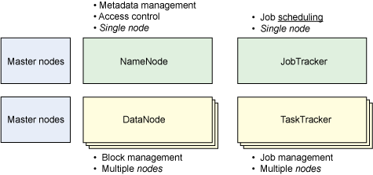

# Hadoop 中的调度
可插入式调度器框架简介

**标签:** 数据库

[原文链接](https://developer.ibm.com/zh/articles/os-hadoop-scheduling/)

M. Jones

发布: 2012-02-01

* * *

Hadoop 是一个通用系统，可以对一组分散的节点上的数据进行高性能处理。这样的定义也说明，Hadoop 是一个多任务系统，它可以同时为多个用户、多个作业处理多个数据集。这种多处理的能力也意味着 Hadoop 能以更优的方式将作业映射到资源。

在 2008 年以前，Hadoop 只支持与 JobTracker 逻辑混合在一起的单一调度器。尽管这样的实现对处理 Hadoop 传统批处理作业（如日志挖掘和 Web 索引）已经足够，但却不够灵活，而且无法定制。此外，Hadoop 在批处理模式下运行，作业提交给队列，Hadoop 基础架构只是简单地按照接收顺序对其进行处理。

幸运的是，有人为实现独立于 JobTracker 的调度器提交了一份 bug 报告 (HADOOP-3412)。更重要的是，新的调度器是可插入式的，从而能够使用新的调度算法来帮助优化一些特殊的作业。这项改变的另一巨大优势是增加了调度器的可靠性，从而进一步发掘潜力，以支持更多的调度器来处理 Hadoop 中不断增加的应用程序。

因为这项更改，Hadoop 现在成为一个多用户数据仓库，它支持大量不同类型的处理作业，它通过使用可插入式调度器框架来提供更广泛的控制。该框架可以优化各种不同工作负载（从小型作业到大型作业等一切作业）上的 Hadoop 集群使用方法。脱离 FIFO 调度（按提交时间确定重要性）可以让 Hadoop 集群支持具有不同优先级和性能限制的工作负载。

**请注意：** 本文假设您对 Hadoop 有一些了解。请参阅 参考资料 ，获取有关 Hadoop 架构简介以及有关安装、配置和编写 Hadoop 应用程序的 Hadoop 实用系列文章的链接。

## Hadoop 核心架构

Hadoop 集群包含了相对简单的主从架构（参见 [图 1](#图-1-hadoop-集群的元素) ）。NameNode 是一个 Hadoop 集群的总主节点，它负责文件系统命名空间和客户端的访问控制。还有 JobTracker，它的任务是将作业分配给等待的节点。这两项（NameNode 和 JobTracker）就是 Hadoop 架构的主要部分。跟随部分包含 TaskTracker，它负责管理作业执行（包括启动和监控作业、获取其输出，以及通知 JobTracker 作业完成）。DataNode 是 Hadoop 集群中的存储节点，它表示分布式文件系统（多个 DataNodes 节点的情况下，是其中一部分）。TaskTracker 和 DataNode 是 Hadoop 集群中的跟随部分。

##### 图 1\. Hadoop 集群的元素

请注意，Hadoop 非常灵活，可支持单节点集群（所有内容在一个节点）或多节点集群（JobTracker 和 NameNodes 分布在数千个节点）。尽管关于现存大型生产环境的信息非常很少，但是拥有最大型 Hadoop 集群的是 Facebook，它包含 4000 个节点。这些节点分为多种型号（其中一半包含 8 核和 16 核 CPU）。Facebook 集群还支持分散在多个 DataNodes 节点上的 21PB 存储。由于存在着大量资源和大量用户的多种作业的潜力，调度是一项需要推进的重要优化。

## Hadoop 调度器

自从可插入式调度器实现以来，已开发了多种调度器算法。接下来的章节将会介绍各种算法以及各自适用的情况。

### FIFO 调度器

集成在 JobTracker 中的原有调度算法被称为 _FIFO_ 。在 FIFO 调度中，JobTracker 从工作队列中拉取作业，最老的作业最先。这种调度方法不会考虑作业的优先级或大小，但很容易实现，而且效率很高。

### 公平调度

公平共享调度器的核心概念是，随着时间推移平均分配工作，这样每个作业都能平均地共享到资源。结果是只需较少时间执行的作业能够访问 CPU，那些需要更长时间执行的作业中结束得迟。这样的方式可以在 Hadoop 作业之间形成交互，而且可以让 Hadoop 集群对提交的多种类型作业作出更大的响应。公平调度器是由 Facebook 开发出来的。

Hadoop 的实现会创建一组池，将作业放在其中供调度器选择。每个池会分配一组共享以平衡池中作业的资源（更多的共享意味着作业执行所需的资源更多）。默认情况下，所有池的共享相等，但可以进行配置，根据作业类型提供更多或更少的共享。如果需要的话，还可以限制同时活动的作业数，以尽量减少拥堵，让工作及时完成。

为了保证公平，每个用户被分配一个池。在这样的方式下，如果一个用户提交很多作业，那么他分配的集群资源与其他用户一样多（与他提交的工作数无关）。无论分配到池的共享有多少，如果系统未加载，那么作业收到的共享不会被使用（在可用作业之间分配）。

调度器实现会追踪系统中每个作业的计算时间。调度器还会定期检查作业接收到的计算时间和在理想的调度器中应该收到的计算时间的差距。会使用该结果来确定任务的亏空。调度器作业接着会保证亏空最多的任务最先执行。

在 mapred-site.xml 文件中配置公平共享。该文件会定义对公平共享调度器行为的管理。一个 XML 文件（即 `mapred.fairscheduler.allocation.file` 属性）定义了每个池的共享的分配。为了优化作业大小，您可以设置 `mapread.fairscheduler.sizebasedweight` 将共享分配给作业作为其大小的函数。还有一个类似的属性可以通过调整作业的权重让更小的作业在 5 分钟之后运行得更快 (`mapred.fairscheduler.weightadjuster`)。您还可以用很多其他的属性来调优节点上的工作负载（例如某个 TaskTracker 能管理的 maps 和 reduces 数目）并确定是否执行抢占。参见参考资源中所有可配置参数的链接。

### 容量调度器

容量调度器的原理与公平调度器有些相似，但也有一些区别。首先，容量调度是用于大型集群，它们有多个独立用户和目标应用程序。由于这个原因，容量调度能提供更大的控制和能力，提供用户之间最小容量保证并在用户之间共享多余的容量。容量调度是由 Yahoo! 开发出来的。

在容量调度中，创建的是队列而不是池，每个队列的 map 和 reduce 插槽数都可以配置。每个队列都会分配一个保证容量（集群的总容量是每个队列容量之和）。

队列处于监控之下；如果某个队列未使用分配的容量，那么这些多余的容量会被临时分配到其他队列中。由于队列可以表示一个人或大型组织，那么所有的可用容量都可以由其他用户重新分配使用。

与公平调度另一个区别是可以调整队列中作业的优先级。一般来说，具有高优先级的作业访问资源比低优先级作业更快。Hadoop 路线图包含了对抢占的支持（临时替换出低优先级作业，让高优先级作业先执行），但该功能尚未实现。

另一个区别是对队列进行严格的访问控制（假设队列绑定到一个人或组织）。这些访问控制是按照每个队列进行定义的。对于将作业提交到队列的能力和查看修改队列中作业的能力都有严格限制。

可在多个 Hadoop 配置文件中配置容量调度器。队列是在 hadoop-site.xml 中定义，在 capacity-scheduler.xml 中配置。可以在 mapred-queue-acls.xml 中配置 ACL。单个的队列属性包括容量百分比（集群中所有的队列容量少于或等于 100）、最大容量（队列多余容量使用的限制）以及队列是否支持优先级。更重要的是，可以在运行时调整队列优先级，从而可以在集群使用过程中改变或避免中断的情况。

### 其他方法

虽然本身不是调度器，但 Hadoop 也支持从大型物理集群内部提供虚拟集群的概念，这称之为 _Hadoop On Demand_ (HOD)。HOD 方法使用 Torque 资源管理器根据虚拟集群的需要进行节点分配。有了分配的节点，HOD 系统自动准备好配置文件，然后根据虚拟集群中的节点进行初始化。虚拟化之后，就能以相对对立的方式使用 HOD 虚拟集群。

HOD 还具有自适应性，在工作负载变化时会收缩。如果某个时间段内检测到没有运行的作业，HOD 会自动解除虚拟集群的节点分配。这种方式可以保证整个物理集群资产的使用效率达到最高。

HOD 对于在云基础架构中部署 Hadoop 集群来说，是个很有意思的模型。它还有个优势，通过与节点尽量少的共享，从而有了更大的安全性，而且某些情况下，由于节点中多个用户作业之间内部缺乏竞争，性能得到提升。

## 何时使用各个调度器

从以上的讨论中可以看出，这些调度算法各具针对性。如果正在运行一个大型 Hadoop 集群，它具有多个客户端和不同类型、不同优先级的作业，那么容量调度器是最好选择，它可以确保访问，并能重用未使用的容量并调整队列中作业的优先级。

尽管不太复杂，但无论是小型还是大型集群，如果由同一个组织使用，工作负载数量有限，那么公平调度器也能运转得很好。公平调度可以将容量不均匀地分配给池（作业的），但是它较为简单且可配置性较低。公平调度在存在多种作业的情况下非常有用，因为它能为小作业和大作业混合的情况提供更快的响应时间（支持更具交互性的使用模型）。

## Hadoop 调度的未来开发

既然 Hadoop 调度器是可插入式的，那么您会看到针对某个独特集群部署而开发的新调度器。有两种正在开发的调度器（来自 Hadoop 事项列表），分别是自适应调度器和学习调度器。学习调度器 (MAPREDUCE-1349) 可用来在出现多种工作负载情况下维持利用率水平。目前，此调度器的实现重点关注 CPU 平均负载，网络和磁盘 I/O 的利用率仍处于计划之中。自适应调度器 (MAPREDUCE-1380) 重点关注根据性能和用户定义的业务目标自动调整某个作业。

## 结束语

可插入式调度器的出现是 Hadoop 集群计算的又一革新。可插入式调度器允许使用（和开发）已针对特殊工作负载和应用程序而进行优化的调度器。因为能够与多个用户和组织共享整个 Hadoop 基础架构，所以新的调度器能够使用 Hadoop 创建多用户数据仓库。

随着使用模式的发展，Hadoop 也在不断发展，它现在可支持多种类型的工作负载和使用场景（例如多用户或多组织大型数据仓库）。Hadoop 所提供的新的灵活性使得优化大型数据分析中集群资源的使用向前迈进了一大步。

本文翻译自： [Scheduling in Hadoop](https://developer.ibm.com/articles/os-hadoop-scheduling/)（2011-12-06）