# Hadoop 压缩实现分析
使用 Hadoop 压缩实现分析

**标签:** 分析

[原文链接](https://developer.ibm.com/zh/articles/os-cn-hadoop-compression-analysis/)

王腾腾, 邵兵

发布: 2015-11-26

* * *

## 引子

随着云时代的来临，大数据（Big data）也获得了越来越多的关注。著云台的分析师团队认为，大数据（Big data）通常用来形容一个公司创造的大量非结构化和半结构化数据，这些数据在下载到关系型数据库用于分析时会花费过多时间和金钱。大数据分析常和云计算联系到一起，因为实时的大型数据集分析需要像 MapReduce 一样的框架来向数十、数百或甚至数千的电脑分配工作。

“大数据”在互联网行业指的是这样一种现象：互联网公司在日常运营中生成、累积的用户网络行为数据。这些数据的规模是如此庞大，以至于不能用 G 或 T 来衡量。所以如何高效的处理分析大数据的问题摆在了面前。对于大数据的处理优化方式有很多种，本文中主要介绍在使用 Hadoop 平台中对数据进行压缩处理来提高数据处理效率。

## 压缩简介

Hadoop 作为一个较通用的海量数据处理平台，每次运算都会需要处理大量数据，我们会在 Hadoop 系统中对数据进行压缩处理来优化磁盘使用率，提高数据在磁盘和网络中的传输速度，从而提高系统处理数据的效率。在使用压缩方式方面，主要考虑压缩速度和压缩文件的可分割性。综合所述，使用压缩的优点如下：

1. 节省数据占用的磁盘空间；

2. 加快数据在磁盘和网络中的传输速度，从而提高系统的处理速度。


## 压缩格式

Hadoop 对于压缩格式的是自动识别。如果我们压缩的文件有相应压缩格式的扩展名（比如 lzo，gz，bzip2 等）。Hadoop 会根据压缩格式的扩展名自动选择相对应的解码器来解压数据，此过程完全是 Hadoop 自动处理，我们只需要确保输入的压缩文件有扩展名。

Hadoop 对每个压缩格式的支持, 详细见下表：

##### 表 1\. 压缩格式

压缩格式工具算法扩展名多文件可分割性DEFLATE无DEFLATE.deflate不不GZIPgzipDEFLATE.gzp不不ZIPzipDEFLATE.zip是是，在文件范围内BZIP2bzip2BZIP2.bz2不是LZOlzopLZO.lzo不是

如果压缩的文件没有扩展名，则需要在执行 MapReduce 任务的时候指定输入格式。

```
hadoopjar/usr/home/hadoop/hadoop-0.20.2/contrib/streaming/
hadoop-streaming-0.20.2-CDH3B4.jar-file/usr/home/hadoop/hello/mapper.py-mapper/
usr/home/hadoop/hello/mapper.py-file/usr/home/hadoop/hello/
reducer.py-reducer/usr/home/hadoop/hello/reducer.py-inputlzotest-outputresult4-
jobconfmapred.reduce.tasks=1*-inputformatorg.apache.hadoop.mapred.LzoTextInputFormat*

```

Show moreShow more icon

## 性能对比

Hadoop 下各种压缩算法的压缩比，压缩时间，解压时间见下表:

##### 表 2\. 性能对比

压缩算法原始文件大小压缩文件大小压缩速度解压速度`gzip``8.3GB``1.8GB``17.5MB/s``58MB/s``bzip2``8.3GB``1.1GB``2.4MB/s``9.5MB/s``LZO-bset``8.3GB``2GB``4MB/s``60.6MB/s``LZO``8.3GB``2.9GB``49.3MB/s``74.6MB/s`

因此我们可以得出：

1) Bzip2 压缩效果明显是最好的，但是 bzip2 压缩速度慢，可分割。

2) Gzip 压缩效果不如 Bzip2，但是压缩解压速度快，不支持分割。

3) LZO 压缩效果不如 Bzip2 和 Gzip，但是压缩解压速度最快！并且支持分割！

这里提一下，文件的可分割性在 Hadoop 中是很非常重要的，它会影响到在执行作业时 Map 启动的个数，从而会影响到作业的执行效率！

所有的压缩算法都显示出一种时间空间的权衡，更快的压缩和解压速度通常会耗费更多的空间。在选择使用哪种压缩格式时，我们应该根据自身的业务需求来选择。

下图是在本地压缩与通过流将压缩结果上传到 BI 的时间对比。

##### 图 1\. 时间对比

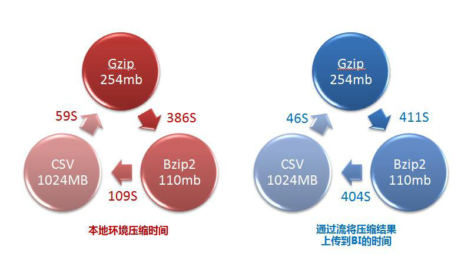

## 使用方式

MapReduce 可以在三个阶段中使用压缩。

1. 输入压缩文件。如果输入的文件是压缩过的，那么在被 MapReduce 读取时，它们会被自动解压。

2. MapReduce 作业中，对 Map 输出的中间结果集压缩。实现方式如下：

     1）可以在 core-site.xml 文件中配置，代码如下


    ##### 图 2\. core-site.xml 代码示例


    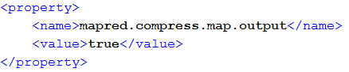

     2）使用 Java 代码指定


    ```
    conf.setCompressMapOut(true);
    conf.setMapOutputCompressorClass(GzipCode.class);

    ```


    Show moreShow more icon

     最后一行代码指定 Map 输出结果的编码器。

3. MapReduce 作业中，对 Reduce 输出的最终结果集压。实现方式如下：

     1）可以在 core-site.xml 文件中配置，代码如下


    ##### 图 3\. core-site.xml 代码示例


    

     2）使用 Java 代码指定


    ```
    conf.setBoolean("mapred.output.compress”,true);
    conf.setClass("mapred.output.compression.codec”,GzipCode.class,CompressionCodec.class);

    ```


    Show moreShow more icon

     最后一行同样指定 Reduce 输出结果的编码器。


## 压缩框架

我们前面已经提到过关于压缩的使用方式，其中第一种就是将压缩文件直接作为入口参数交给 MapReduce 处理，MapReduce 会自动根据压缩文件的扩展名来自动选择合适解压器处理数据。那么到底是怎么实现的呢？如下图所示：

##### 图 4\. 压缩实现情形

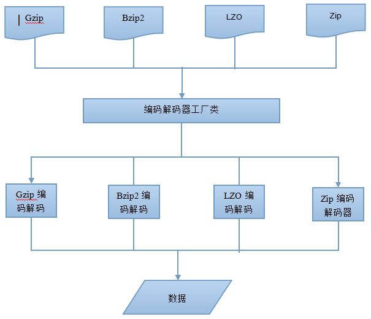

我们在配置 Job 作业的时候，会设置数据输入的格式化方式，使用 conf.setInputFormat() 方法，这里的入口参数是 TextInputFormat.class。

TextInputFormat.class 继承于 InputFormat.class，主要用于对数据进行两方面的预处理。一是对输入数据进行切分，生成一组 split，一个 split 会分发给一个 mapper 进行处理；二是针对每个 split，再创建一个 RecordReader 读取 split 内的数据，并按照<key,value>的形式组织成一条 record 传给 map 函数进行处理。此类在对数据进行切分之前，会首先初始化压缩解压工程类 CompressionCodeFactory.class，通过工厂获取实例化的编码解码器 CompressionCodec 后对数据处理操作。

下面我们来详细的看一下从压缩工厂获取编码解码器的过程。

## 压缩解压工厂类 CompressionCodecFactory

压缩解压工厂类 CompressionCodeFactory.class 主要功能就是负责根据不同的文件扩展名来自动获取相对应的压缩解压器 CompressionCodec.class，是整个压缩框架的核心控制器。我们来看下 CompressionCodeFactory.class 中的几个重要方法：

1. 初始化方法


    ##### 图 5\. 代码示例


    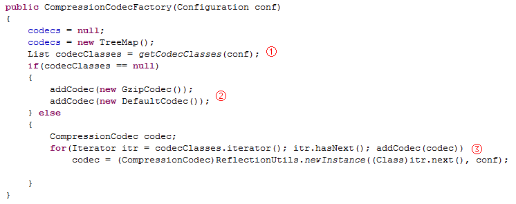

    ① getCodeClasses(conf) 负责获取关于编码解码器 CompressionCodec.class 的配置信息。下面将会详细讲解。

    ② 默认添加两种编码解码器。当 getCodeClass(conf) 方法没有读取到相关的编码解码器 CompressionCodec.class 的配置信息时，系统会默认添加两种编码解码器 CompressionCodec.class，分别是 GzipCode.class 和 DefaultCode.class。

    ③ addCode(code) 此方法用于将编码解码器 CompressionCodec.class 添加到系统缓存中。下面将会详细讲解。

2. getCodeClasses(conf)


    ##### 图 6\. 代码示例


    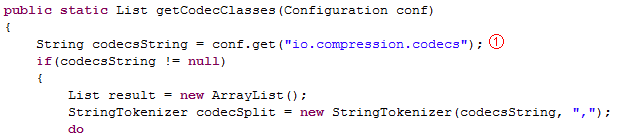

    ① 这里我们可以看，系统读取关于编码解码器 CompressionCodec.class 的配置信息在 core-site.xml 中 io.compression.codes 下。我们看下这段配置文件，如下图所示：


    ##### 图 7\. 代码示例


    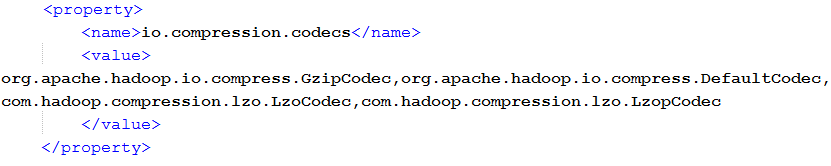

    Value 标签中是每个编码解码 CompressionCodec.class 的完整路径，中间用逗号分隔。我们只需要将自己需要使用到的编码解码配置到此属性中，系统就会自动加载到缓存中。

    除了上述的这种方式以外，Hadoop 为我们提供了另一种加载方式：代码加载。同样最终将信息配置在 io.compression.codes 属性中，代码如下：


    ```
    conf.set("io.compression.codecs","org.apache.hadoop.io.compress.DefaultCodec,
    org.apache.hadoop.io.compress.GzipCodec,com.hadoop.compression.lzo.LzopCodec");)

    ```


    Show moreShow more icon

3. addCode(code) 方法添加编码解码器


    ##### 图 8\. 代码示例


    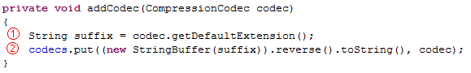

    addCodec(codec) 方法入口参数是个编码解码器 CompressionCodec.class，这里我们会首先接触到它的一个方法。

    ① codec.getDefaultExtension() 方法看方法名的字面意思我们就可以知道，此方法用于获取此编码解码所对应文件的扩展名，比如，文件名是 xxxx.gz2，那么这个方法的返回值就是”.bz2”，我们来看下 org.apache.hadoop.io.compress.BZip2Codec 此方法的实现代码：


    ##### 图 9\. 代码示例


    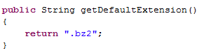

    ② Codecs 是一个 SortedMap 的示例。这里有个很有意思的地方，它将 Key 值，也就是通过 codec.getDefaultExtension() 方法获取到的文件扩展名进行了翻转，举个例子，比如文件名扩展名”.bz2”，将文件名翻转之后就变成了”2zb.”。

    系统加载完所有的编码解码器后，我们可以得到这样一个有序映射表，如下：


    ##### 图 10\. 代码示例


    现在编码解码器都有了，我们怎么得到对应的编码解码器呢？看下面这个方法。

4. getCodec() 方法


    ```
         此方法用于获取文件所对应的的编码解码器 CompressionCodec.class。

    ```


    Show moreShow more icon


    ##### 图 11\. 代码示例


    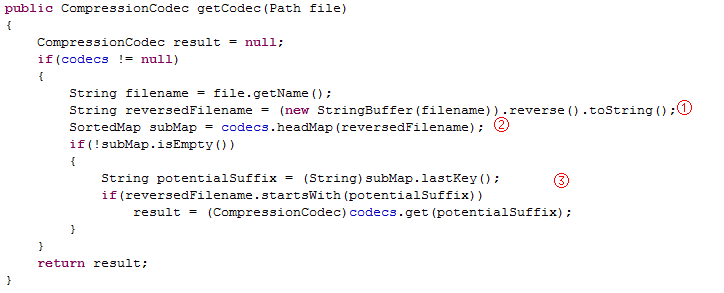

     getCodec(Path) 方法的输入参数是 Path 对象，保存着文件路径。

     ① 将文件名翻转。如 xxxx.bz2 翻转成 2zb.xxxx。

     ② 获取 codecs 集合中最接近 2zb.xxxx 的值。此方法有返回值同样是个 SortMap 对象。

     在这里对返回的 SortMap 对象进行第二次筛选。


## 编码解码器 CompressionCodec

刚刚在介绍压缩解压工程类 CompressionCodeFactory.class 的时候，我们多次提到了压缩解压器 CompressionCodecclass，并且我们在上文中还提到了它其中的一个用于获取文件扩展名的方法 getDefaultExtension()。

压缩解压工程类 CompressionCodeFactory.class 使用的是抽象工厂的设计模式。它是一个接口，制定了一系列方法，用于创建特定压缩解压算法。下面我们来看下比较重要的几个方法：

1. createOutputStream() 方法对数据流进行压缩。


    ##### 图 12\. 代码示例


    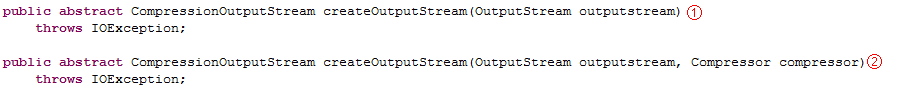

     此方法提供了方法重载。

     ① 基于流的压缩处理；

     ② 基于压缩机 Compress.class 的压缩处理

2. createInputStream() 方法对数据流进行解压。


    ##### 图 13\. 代码示例


     这里的解压方法同样提供了方法重载。

     ① 基于流的解压处理；

     ② 基于解压机 Decompressor.class 的解压处理；

     关于压缩/解压流与压缩/解压机会在下面的文章中我们会详细讲解。此处暂作了解。

3. getCompressorType() 返回需要的编码器的类型。

     getDefaultExtension() 获取对应文件扩展名的方法。前文已提到过，不再敖述。


## 压缩机 Compressor 和解压机 Decompressor

前面在编码解码器部分的 createInputStream() 和 createInputStream() 方法中我们提到过 Compressor.class 和 Decompressor.class 对象。在 Hadoop 的实现中，数据编码器和解码器被抽象成了两个接口：

1. org.apache.hadoop.io.compress.Compressor;

2. org.apache.hadoop.io.compress.Decompressor;


它们规定了一系列的方法，所以在 Hadoop 内部的编码/解码算法实现都需要实现对应的接口。在实际的数据压缩与解压缩过程，Hadoop 为用户提供了统一的 I/O 流处理模式。

我们看一下压缩机 Compressor.class，代码如下：

##### 图 14\. 代码示例

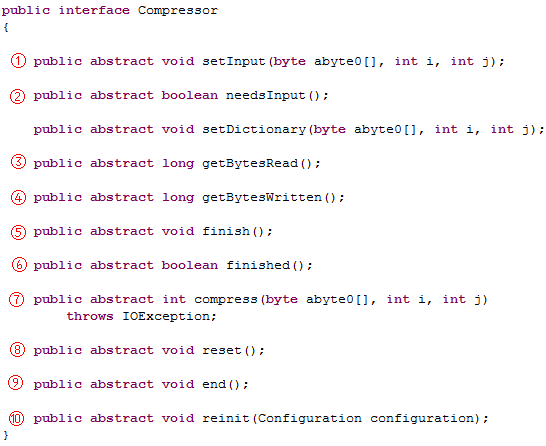

① setInput() 方法接收数据到内部缓冲区，可以多次调用；

② needsInput() 方法用于检查缓冲区是否已满。如果是 false 则说明当前的缓冲区已满；

③ getBytesRead() 输入未压缩字节的总数；

④ getBytesWritten() 输出压缩字节的总数；

⑤ finish() 方法结束数据输入的过程；

⑥ finished() 方法用于检查是否已经读取完所有的等待压缩的数据。如果返回 false，表明压缩器中还有未读取的压缩数据，可以继续通过 compress() 方法读取；

⑦ compress() 方法获取压缩后的数据，释放缓冲区空间；

⑧ reset() 方法用于重置压缩器，以处理新的输入数据集合；

⑨ end() 方法用于关闭解压缩器并放弃所有未处理的输入；

⑩ reinit() 方法更进一步允许使用 Hadoop 的配置系统，重置并重新配置压缩器；

为了提高压缩效率，并不是每次用户调用 setInput() 方法，压缩机就会立即工作，所以，为了通知压缩机所有数据已经写入，必须使用 finish() 方法。finish() 调用结束后，压缩机缓冲区中保持的已经压缩的数据，可以继续通过 compress() 方法获得。至于要判断压缩机中是否还有未读取的压缩数据，则需要利用 finished() 方法来判断。

## 压缩流 CompressionOutputStream 和解压缩流 CompressionInputStream

前文编码解码器部分提到过 createInputStream() 方法返回 CompressionOutputStream 对象，createInputStream() 方法返回 CompressionInputStream 对象。这两个类分别继承自 java.io.OutputStream 和 java.io.InputStream。从而我们不难理解，这两个对象的作用了吧。

```
我们来看下 CompressionInputStream.class 的代码：

```

Show moreShow more icon

##### 图 15\. 代码示例

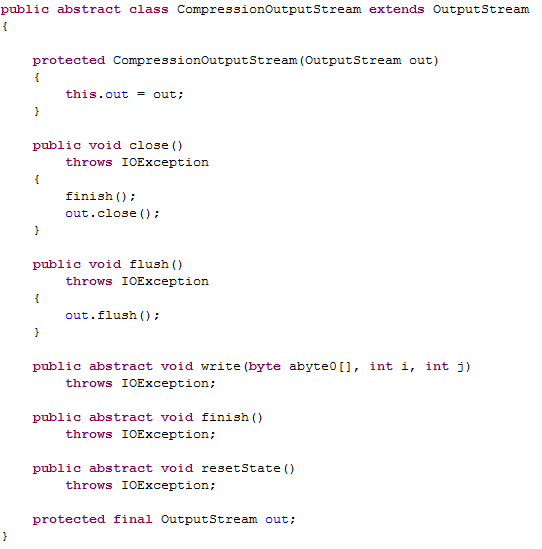

可以看到 CompressionOutputStream 实现了 OutputStream 的 close() 方法和 flush() 方法，但用于输出数据的 write() 方法以及用于结束压缩过程并将输入写到底层流的 finish() 方法和重置压缩状态的 resetState() 方法还是抽象方法，需要 CompressionOutputStream 的子类实现。

Hadoop 压缩框架中为我们提供了一个实现了 CompressionOutputStream 类通用的子类 CompressorStream.class。

##### 图 16\. 代码示例

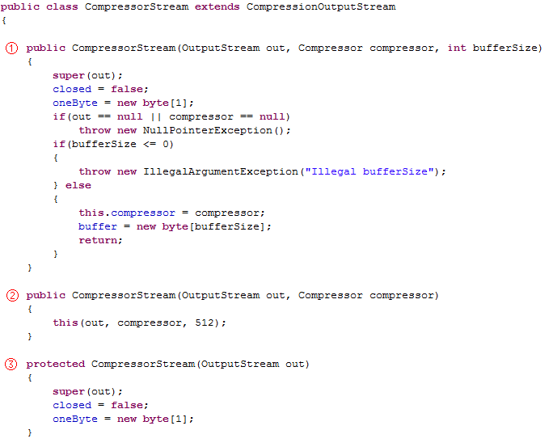

CompressorStream.class 提供了三个不同的构造函数，CompressorStream 需要的底层输出流 out 和压缩时使用的压缩器，都作为参数传入构造函数。另一个参数是 CompressorStream 工作时使用的缓冲区 buffer 的大小，构造时会利用这个参数分配该缓冲区。第一个可以手动设置缓冲区大小，第二个默认 512，第三个没有缓冲区且不可使用压缩器。

##### 图 17\. 代码示例

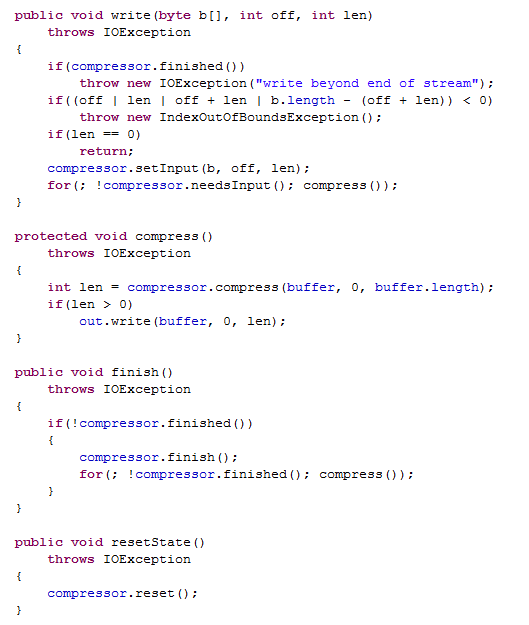

在 write()、compress()、finish() 以及 resetState() 方法中，我们发现了压缩机 Compressor 的身影，前面文章我们已经介绍过压缩机的的实现过程，通过调用 setInput() 方法将待压缩数据填充到内部缓冲区，然后调用 needsInput() 方法检查缓冲区是否已满，如果缓冲区已满，将调用 compress() 方法对数据进行压缩。流程如下图所示：

##### 图 18\. 调用流程图

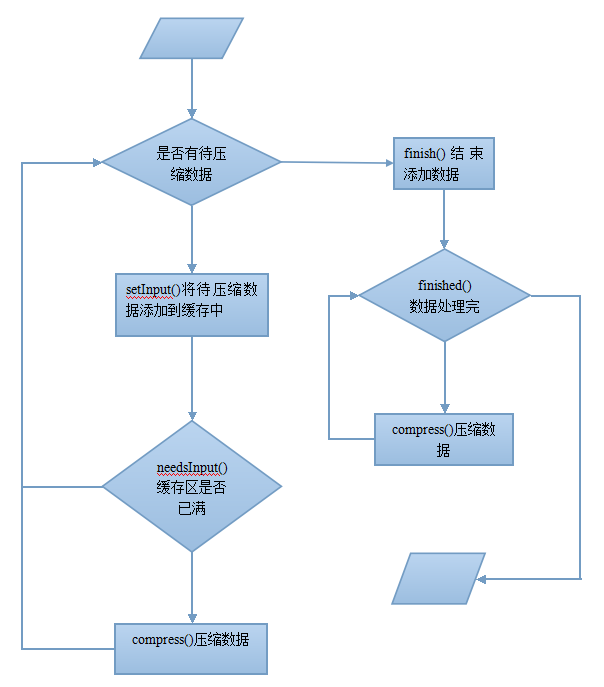

## 结束语

本文深入到 Hadoop 平台压缩框架内部，对其核心代码以及各压缩格式的效率进行对比分析，以帮助读者在使用 Hadoop 平台时，可以通过对数据进行压缩处理来提高数据处理效率。当再次面临海量数据处理时， Hadoop 平台的压缩机制可以让我们事半功倍。