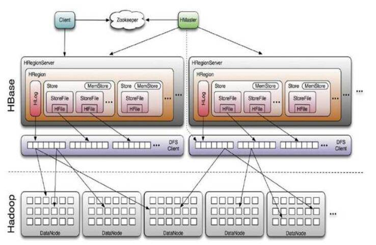
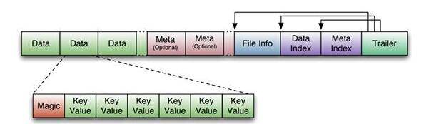
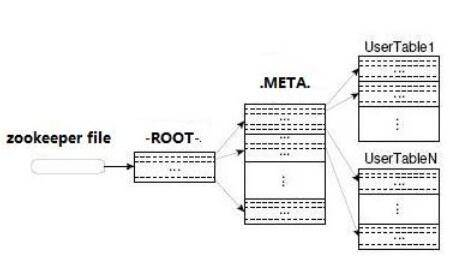

# Hbase 设计与开发实战
了解 Hbase

**标签:** 分析

[原文链接](https://developer.ibm.com/zh/articles/ba-1604-hbase-develop-practice/)

唐清原

发布: 2016-04-19

* * *

## Hbase 概述

### 大数据及 NoSQL 的前世今生

传统的关系型数据库处理方式是基于全面的 ACID 保证，遵循 SQL92 的标准表设计模式（范式）和数据类型，基于 SQL 语言的 DML 数据交互方式。长期以来这种基于关系型数据库的 IT 信息化建设中发展良好，但受制于关系型数据库提供的数据模型，对于逐渐出现的，为预先定义模型的数据集，关系型数据库不能很好的工作。越来越多的业务系统需要能够适应不同种类的数据格式和数据源，不需要预先范式定义，经常是非结构化的或者半结构化的（如用户访问网站的日志)，这需要系统处理比传统关系型数据库高几个数量级的数据（通常是 TB 及 PB 规模级别）。传统关系型数据库能够纵向扩展到一定程度（如 Oracle 的 RAC，IBM 的 pureScale）。但这通常意味着高昂的软件许可费用和复杂的应用逻辑。

基于系统需求发生了巨大变化，数据技术的先驱们不得不重新设计数据库，基于大数据的 NoSQL 的曙光就这样出现了，大数据及 NoSQL 的使用首先在 google、facebook 等互联网公司，随后是金融、电信行业，众多 Hadoop&NoSQL 的开源大数据项目如雨后春笋般发展，被互联网等公司用于处理海量和非结构化类型的数据。一些项目关注于快速 key-value 的键值存储，一些关注内置数据结构或者基于文档的抽象化，一些 NoSQL 数据管理技术框架为了性能而牺牲当前的数据持久化，不支持严格的 ACID，一些开源框架甚至为了性能放弃写数据到硬盘……

Hbase 就是 NoSQL 中卓越的一员，Hbase 提供了键值 API，承诺强一致性，所以客户端能够在写入后马上看到数据。HBase 依赖 Hadoop 底层分布式存储机制，因此能够运行在多个节点组成的集群上，并对客户端应用代码透明，从而对每个开发人员来说设计和开发 Hbase 的大数据项目变得简单易行。Hbase 被设计来处理 TB 到 PB 级的数据，并针对该类海量数据和高并发访问做了优化，作为 Hadoop 生态系统的一部分，它依赖 Hadoop 其他组件提供的重要功能，如 DataNode 数据冗余和 MapReduce 批注处理。

## Hbase 架构及框架简介

本文中我们简要介绍下 Hbase 的架构及框架，Hbase 是一种专门为半结构化数据和水平扩展性设计的数据库。它把数据存储在表中，表按”行健，列簇，列限定符和时间版本”的四维坐标系来组织。Hbase 是无模式数据库，只需要提前定义列簇，并不需要指定列限定符。同时它也是无类型数据库，所有数据都是按二进制字节方式存储的，对 Hbase 的操作和访问有 5 个基本方式，即 Get、Put、Delete 和 Scan 以及 Increment。Hbase 基于非行健值查询的唯一途径是通过带过滤器的扫描。

由于 Hbase 针对 PB、TB 存储级别，亿级行数据的海量表记录的高并发，极限性能查询检索的设计初衷，Hbase 在物理架构方面设计成一个依靠 Hadoop HDFS 的全分布式的存储集群，并基于 Hadoop 的 MapReduce 网格计算框架，用以支持高吞吐量数据访问，支持可用性和可靠性，其整体架构如下图所示：

##### 图 1.Hbase 整体架构图



从上图我们可以看出 Hbase 的组成部件，HBase 中的每张表都通过行键按照一定的范围被分割成多个子表（HRegion），默认一个 HRegion 超过 256M 就要被分割成两个，由 HRegionServer 管理，管理哪些 HRegion 由 HMaster 分配。

HRegionServer 存取一个子表时，会创建一个 HRegion 对象，然后对表的每个列族 (Column Family) 创建一个 Store 实例，每个 Store 都会有 0 个或多个 StoreFile 与之对应，每个 StoreFile 都会对应一个 HFile，HFile 就是实际的存储文件。因此，一个 HRegion 有多少个列族就有多少个 Store。此外，每个 HRegion 还拥有一个 MemStore 内存缓存实例。

HBase 存储格式是基于 Hadoop 的 HDFS 分布式文件系统，HBase 中的所有数据文件都存储在 Hadoop HDFS 上，格式主要有两种：

（1）HFile：HBase 中 KeyValue 数据的存储格式，HFile 是 Hadoop 的二进制格式文件，实际上 StoreFile 就是对 HFile 做了轻量级包装，即 StoreFile 底层就是 HFile。

（2）HLog File：HBase 中 WAL（Write Ahead Log）的存储格式，物理上是 Hadoop 的 Sequence File。

HBase 是基于类似 Google 的 BigTable 的面向列的分布式存储系统，其存储设计是基于 Memtable / SSTable 设计的，主要分为两部分：一部分为内存中的 MemStore (Memtable)，另外一部分为 HDFS 上的 HFile (SSTable)。还有就是存储 WAL 的 log，主要实现类为 HLog。

（3）MemStore：MemStore 即内存里放着的保存 KEY/VALUE 映射的 MAP，当 MemStore（默认 64MB）写满之后，会开始 flush 到磁盘（即 Hadoop 的 HDFS 上）的操作。

为帮助读者理解，这里我们再把 HFile 更 detail 的数据结构做简要的介绍，HFile 是基于 Hadoop TFile 的文件类型，其结构如下图所示：

##### 图 2.HFile 结构图



如上图所示，HFile 的文件长度是变长的，仅 FILE INFO/Trailer 部分是定长，Trailer 中有指针指向其他数据块的起始点。而 Index 数据块则记录了每个 Data 块和 Meta 块的起始点。Data 块和 Meta 块都是可有可无的，但对于大多数 HFile，都有 Data 块。

HLog 用来存放 HBase 的日志文件，与传统关系型数据库类似，为保证读一致性及 undo/redo 回滚等数据恢复操作，Hbase 在写入数据时即先进行 write-ahead-log(WAL) 操作。每个 HRegionServer 对应一个 HLog 实例，HRegion 在初始化的时候 HRegionServer 会将该 HLog 作为构造函数传入其中，以便初始化 HLog 实例。

HLog File 是一个 Sequence File，只能在文件的末尾添加内容。除了文件头以外，HLog File 由一条条 HLog.Entry 构成。Entry 是 HLog 的基本组成部分，也是 Read /Write 的基本单位。

读者如果对 HBase 架构的细节内容感兴趣，可以通过 [Hbase](http://docs.oracle.com/javaee/6/tutorial/doc/bncdq.html) 官网，了解 Hbase 整体架构及底层物理存储机制。

## Hbase 检索时间复杂度

既然使用 Hbase 的目的是高效、高可靠、高并发的访问海量非结构化数据，那么 Hbase 检索数据的时间复杂度是关系到基于 Hbase 的业务系统开发设计的重中之重，Hbase 的运算有多快，本文从计算机算法的数学角度做简要分析，以便读者理解后文的项目实例中 Hbase 业务建模及设计模式中的考量因素。

我们先以如下变量定义 Hbase 的相关数据信息：

n=表中 KeyValue 条目数量（包括 Put 结果和 Delete 留下的标记）

b=HFile 李数据库（HFile Block）的数量

e=平均一个 HFile 里面 KeyValue 条目的数量（如果知道行的大小，可以计算得到）

c=每行里列的平均数量

我们知道 Hbase 中有两张特殊表：-ROOT- & .META.，其中.META. 表记录 Region 分区信息，同时，.META. 也可以有多个 Region 分区，同时-ROOT-表又记录.META. 表的 Region 信息，但-ROOT-只有一个 Region，而-ROOT-表的位置由 Hbase 的集群管控框架，即 Zookeeper 记录。

关于-ROOT- & .META. 表的细节这里不再累述，感兴趣的读者可以参阅 [Hbase –ROOT-及.META. 表](http://hbase.apache.org/0.94/book/arch.catalog.html) 资料，理解 Hbase IO 及数据检索时序原理。

Hbase 检索一条数据的流程如下图所示。

##### 图 3.Hbase 检索示意图



如上图我们可以看出，Hbase 检索一条客户数据需要的处理过程大致如下：

(1) 如果不知道行健，直接查找列 key-value 值，则你需要查找整个 region 区间，或者整个 Table，那样的话时间复杂度是 O(n)，这种情况是最耗时的操作，通常客户端程序是不能接受的，我们主要分析针对行健扫描检索的时间复杂度情况，也就是以下 2 至 4 步骤的内容。

(2) 客户端寻找正确的 RegionServer 和 Region。话费 3 次固定运算找到正确的 region，包括查找 ZooKeeper，查找-ROOT-表，找找.META 表，这是一次 O(1) 运算。

(3) 在指定 Region 上，行在读过程中可能存在两个地方，如果还没有刷写到硬盘，那就是在 MemStore 中，如果已经刷写到硬盘，则在一个 HFile 中

假定只有一个 HFile，这一行数据要么在这个 HFile 中，要么在 Memstore 中。

(4) 对于后者，时间复杂度通常比较固定，即 O(log e)，对于前者，分析起来要复杂得多，在 HFile 中查找正确的数据块是一次时间复杂度为 O(log b) 的运算，找到这一行数据后，再查找列簇里面 keyvalue 对象就是线性扫描过程了（同一列簇的列数据通常是在同一数据块中的），这样的话扫描的时间复杂度是 O(el b), 如果列簇中的列数据不在同一数据块，则需要访问多个连续数据块，这样的时间复杂度为 O(c)，因此这样的时间复杂度是两种可能性的最大值，也就是 O(max(c ,el b)

综上所述，查找 Hbase 中某一行的时间开销为：

O(1) 用于查找 region

+O(log e) 用来在 region 中定位 KeyValue，如果它还在 MemStore 中

+O(log b）用来查找 HFile 里面正确的数据块

+O(max（c el b) 用来查找 HFile

对上述 O(1)，log 等标记不熟悉的读者，可以参见参考资源中的” [算法参考，了解计算机时间复杂度的相关数学统计符号及计算公式](https://en.wikibooks.org/wiki/Data_Structures/Asymptotic_Notation) ”。

## Hbase 设计实战

由上文介绍的 Hbase 的整体架构及检索的时间复杂度分析我们可以看出，行键、列簇等的设计及数据存储决定了 Hbase 总体的性能及执行查询的效率，很多使用 Hbase 的项目及技术人员能熟练的使用 Hbase Shell 或 SDK API 访问 Hbase，进行表创建、删除等 DDL，以及 put/delete/scan 等 DML 操作，但并深入探究需要多少个列簇，一个列簇需要多少列，什么数据应该存入列名中，以及什么数据应该存入单元等开发设计中的关键问题。

基于 Hbase 的系统设计与开发中，需要考虑的因素不同于关系型数据库，Hbase 模式本身很简单，但赋予你更多调整的空间，有一些模式写性能很好，但读取数据时表现不好，或者正好相反，类似传统数据库基于范式的 OR 建模，在实际项目中考虑 Hbase 设计模式是，我们需要从以下几方面内容着手：

1. 这个表应该有多少个列簇
2. 列簇使用什么数据
3. 每个列簇应有多少个列
4. 列名应该是什么，尽管列名不必在建表时定义，但是读写数据时是需要的
5. 单元应该存放什么数据
6. 每个单元存储什么时间版本
7. 行健结构是什么，应该包括什么信息

以下我们以一个使用 Hbase 技术的真实客户案例为例，说明 Hbase 设计模式在真实项目中的实践，并通过不同的表设计模式，可以看出在模式是如何影响到表结构和读写表的方式方法，以及对客户端检索查询的性能的影响

### 客户场景介绍

客户简介：客户是一个互联网手机游戏平台，需要针对广大手游玩家进行手游产品的统计分析，需要存储每个手游玩家即客户对每个手游产品的关注度（游戏热度），且存储时间维度上的关注度信息，从而能针对客户的喜好进行挖掘并进行类似精准营销的手游定点推送，广告营销等业务，从而扩大该平台的用户量并提升用户粘着度。

该平台上手游产品分类众多，总共在 500 余以上，注册玩家（用户帐号）数量在 200 万左右，在线玩家数量 5 万多，每天使用手游频率峰值在 10 万/人次以上，年增量 10%以上。

根据以上需求，手游产品动态增长，无法确定哪些手游产品需要被存储，全部存储又会表超过 200 列，造成大量空间浪费，玩家每天使用手游的频率及分类不确定，客户注册用户超百万，按天的使用热度数据量超过 1000 万行，海量数据也使得表查询及业务分析需要的集群数量庞大及 SQL 优化，效率低下，因此传统关系型数据库不适合该类数据分析和处理的需求，在项目中我们决定采用 Hbase 来进行数据层的存储的分析。

### 高表设计

让我们回到上文中设计模式来考虑该客户案例中表的设计，我们需要存储玩家信息，通常是微信号，QQ 号及在该手游平台上注册的帐号，同时需要存储该用户关注什么手游产品的信息，而用户每天会玩一个或者多个手游产品，每个产品玩一次或者多次，因此存储的应该是该用户对某一手游产品的关注度（使用次数），该使用次数在每天是一个动态的值，而用户对手游产品也是一个多对多的 keyvalue 键值的集合。该手游平台厂商关心的是诸如”XXX 客户玩家关注 YYY 手游了么？”，”YYY 手游被用户关注了么？”这类的业务维度分析。

假设每天每个手游玩家对每个产品的关注度都存在该表中，则一个可能的设计方案是每个用户每天对应一行，一用户 ID+当天的时间戳作为行健，建立一个保存手游产品使用信息的列簇，每列代表该天该用户对该产品的使用次数。

本案例中我们只设计一个列簇，一个特定的列簇在 HDFS 上会由一个 Region 负责，这个 region 下的物理存储可能有多个 HFile，一个列簇使得所有列在硬盘上存放在一起，使用这个特性可以使不同类型的列数据放在不同的列簇上，以便隔离，这也是 Hbase 被称为面向列存储的原因，在这张表里，因为所有手游产品并没有明显的分类，对表的访问模式也不需区分手游产品类型，因此并不需要多个列簇的划分，你需要意识到一点：一旦创建了表，任何对该表列簇的动作通常都需要先让表 offline。

我们可以使用 Hbase Shell 或者 Hbase SDK api 创建表，Hbase shell 脚本示例如下：

##### 清单 1\. Hbase shell 脚本示例

```
$hbase shell
Version 0.92.0, r1231986, Mon Nov 16 13:16:35 UTC 2015
$hbase(main):001:0 >create 'prodFocus' , 'degeeInfo'
0 row(s) in 0.1200 seconds
hbase(main):008:0> describe 'prodFocus'
DESCRIPTION ENABLED
'prodFocus', {NAME => 'cf', DATA_BLOCK_ENCODING => true
'NONE', BLOOMFILTER => 'ROW', REPLICATION_SCOPE =>
'0', VERSIONS => '1', COMPRESSION => 'NONE', MIN_VE
RSIONS => '0', TTL => '2147483647', KEEP_DELETED_CE
LLS => 'false', BLOCKSIZE => '65536', IN_MEMORY =>
'false', BLOCKCACHE => 'true'}
1 row(s) in 0.0740 seconds

```

Show moreShow more icon

现在的表如下图所示，一个存有示例数据的表。

表 1\. prodFocus 表示例 {: #表-1-prodfocus-表示例}

rowkey:用户 ID$当天时间degee（列簇，手游热度信息）QQ121102645$20141216degee：3DARPG：6degeeInfo:DTLegend：1WeiXin\_295y603765de8$12140928degree:DTLegend：3ChaoChenYY$12141109degree:3CountryBattle：1degree:Forget Xian:1–QQ5863976645$20141214degree:Frus3D：2HeXaoYang$20140907degree:Space Hunter:1degree:3CountryBattle:2degree:Frus3DFengKe\_Tony$20150216degree:DTLegend:1junping\_Jeff$20141204degree:Frus3D：2XiaoFenXia$20150716degree:Forget Xian:3

表设计解释如下：

rowkey 为 QQ121102645$20141216 表示帐号为 QQ121102645 的手游玩家（以 QQ 号联邦认证的）在 2014 年 12 月 16 日当天的游戏记录；列簇 focuspro 记录该行账户当天对每种产品类型的点击热度 (游戏次数)，比如 Space Hunter:：1 表示玩 (或者点开)Space Hunter:(时空猎人) 的次数为 1 次

现在你需要检验这张表是否满足需求，为此最重要的事是定义访问模式，也就是应用系统如何访问 Hbase 表中的数据，在整个 Hbase 系统设计开发过程中应该尽早这么做。

我们现在来看，我们设计的该 Hbase 表是否能回答客户关心的问题：比如”帐号为 QQ121102645 的用户关注过哪些手游？”，沿着这个方向进一步思考，有相关业务分析的问题：”QQ121102645 用户是否玩过 3CountryBattle（三国 3）手游？””哪些用户关注了 DTLegend（刀塔传奇)？””3CountryBattle（三国 3）手游被关注过吗？”

基于现在的 prodFocus 表设计，要回答”帐号为 QQ121102645 的用户关注过哪些手游？”这个访问模式，可以在表上执行一个简单的 Scan 扫描操作，该调用会返回整个 QQ121102645 前缀的整个行，每一行的列簇进行列遍历就能找到用户关注的手游列表。

代码示例如下：

##### 清单 2\. 客户端查询用户关注手游列表

```
static {
Configuration HBASE_CONFIG = new Configuration();
HBASE_CONFIG.set("hbase.zookeeper.quorum”,"192.168.2.6”);
HBASE_CONFIG.set("hbase.zookeeper.property.clientPort”,"2181”);
cfg = new HBaseConfiguration(HBASE_CONFIG);
}
HTablePool pool = new HTablePool();
HTableInterface prodTable = pool.getTable("prodFocus”);
Scan a = new Scan();
a.addFamily(Bytes.toBytes("degreeInfo”));
a.setStartRow(Bytes.toBytes("QQ121102645”));
ResultScanner results = prodTable.getScanner(a);
List<KeyValue> list = result.list();
List<String> followGamess = new ArrayList<String>();
for(Result r:results){
KeyValue kv = iter.next();;
String game =kv.get(1];
followGames.add(user);
}

```

Show moreShow more icon

代码解释：首先通过 Configuration 设置 Hbase Master 主机及客户端连接端口，然后使用 HtableInterface 接口示例连接上 prodFocus 表，因为 prodFocus 表 rowkey 设计为用户 ID+$+当天的时间戳，因此我们创建以用户”QQ121102645”为检索前缀的 Scan 扫描，扫描返回的 ResultScanner 即为该用户相关的所有行数据，遍历每行的”degreeInfo”列簇中的各个列即可获得该用户所有关注（玩过）的手游产品。

关于 Hbase API 操作的代码这里不再详述，感兴趣的读者可以查阅 [Hbase SDK](https://hbase.apache.org/apidocs/index.html) ，熟悉操作 HBase 表及 put、scan、delete 代码。

第二个问题”QQ121102645 用户是否玩过 3CountryBattle（三国 3）手游”的业务跟第一个类似，客户端代码可以用 Scan 找出行健为 QQ121102645 前缀的所有行，返回的 result 集合可以创建一个数组列表，遍历这个列表检查 3CountryBattles 手游是否作为列名存在，即可判断该用户是否关注某一手游，相应代码与上文问题 1 的代码类似：

##### 清单 3\. 客户端判断用户是否关注某一手游

```
HTablePool pool = new HTablePool();
HTableInterface prodTable = pool.getTable("prodFocus”);
Scan a = new Scan();
a.addFamily(Bytes.toBytes("degreeInfo”));
a.setStartRow(Bytes.toBytes("QQ121102645”));
ResultScanner results = prodTable.getScanner(a);
List<Integer> degrees = new ArrayList<Integer>();
List<KeyValue> list = results.list();
Iterator<KeyValue> iter = list.iterator();
String gameNm ="3CountryBattle”;
while(iter.hasNext()){
KeyValue kv = iter.next();
if(gameNm.equals(Bytes.toString(kv.getKey()))){
return true;
}
}
prodTable.close();

```

Show moreShow more icon

代码解释：同样通过扫描前缀为”QQ121102645”的 Scan 执行表检索操作，返回的 List数组中每一 Key-value 是 degreeInfo 列簇中每一列的键值对，即用户关注（玩过）的手游产品信息，判断其 Key 值是否包含”3CountryBattle”的游戏名信息即可知道该用户是否关注该手游产品。

看起来这个表设计是简单实用的，但是如果我们接着看第三个和第四个业务问题”哪些用户关注了 DTLegend（刀塔传奇)？””3CountryBattle（三国 3）手游被关注过吗？”

如你所看到的，现有的表设计对于多个手游产品是放在列簇的多个列字段中的，因此当某一用户对产品的喜好趋于多样化的时候（product key-value 键值对会很多，意味着某一 rowkey 的表列簇会变长，这本身也不是大问题，但它影响到了客户端读取的代码模式，会让客户端应用代码变得很复杂。

同时，对于第三和第四问题而言，每增加一种手游关注的 key-value 键值，客户端代码必须要先读出该用户的 row 行，再遍历所有行列簇中的每一个列字段。从上文 Hbase 索引的原理及内部检索的机制我们知道，行健是所有 Hbase 索引的决定性因素，如果不知道行健，就需要把扫描限定在若干 HFile 数据块中，更麻烦的是，如果数据还没有从 HDFS 读到数据块缓存，从硬盘读取 HFile 的开销更大，从上文 Hbase 检索的时间复杂度分析来看，现在的 Hbase 表设计模式下需要在 Region 中检索每一列，效率是列的个数\*O(max(el b)，从理论上已经是最复杂的数据检索过程。

对关注该平台业务的客户公司角度考虑，第三个第四个的业务问题更加关注客户端获取分析结果的实时分析的性能，因此从设计模式上应该设计更长的行健，更短的列簇字段，提高 Hbase 行健的检索效率并同时减少访问宽行的开销。

### 宽表设计

Hbase 设计模式的简单和灵活允许您做出各种优化，不需要做很多的工作就可以大大简化客户端代码，并且使检索的性能获得显著提升。我们现在来看看 prodFocus 表的另一种设计模式，之前的表设计是一种宽表（wide table）模式，即一行包括很多列。每一列代表某一手游的热度。同样的信息可以用高表（tall table）形式存储，新的高表形式设计的产品关注度表结构如表 2 所示。

##### 表 2\. prodFocusV2 表示例

cf（列簇，按日期时间戳的关注度数据）rowkey:被关注产品$某用户`3DARPG$QQ121102645``20141224:6``DTLegend$QQ121102645``20141216:1``DTLegend$WeiXin_295y603765de8``20141212:3``3CountryBattle$ChaoChenYY``20141214` ： `2``Frus3D$QQ 5863976 645``20150906:2`Space Hunter:&HeXaoYang20140907:1`3CountryBattle $HeXiaoYang`20140907:2`Frus3D$Hex iaoYang`20140907:1`DTLegend$` FengKe\_Tony20150216 `:1``Frus3D$` junping\_Jeff20141204： `2`Forget Xian$XiaoFenXia20150716:3

表解释：将产品在某一天被某用户关注的关联关系设计到 rowkey 中，而其关注度数据只用一个 key-value 来存储，行健 Daqier\_weixin1398765386465 串联了两个值，产品名和用户的帐号，这样原来表设计中某一用户在某天的信息被转换为一个”产品-关注的用户”的关系，这是典型的高表设计。

HFile 中的 keyvalue 对象存储列簇名字。使用短的列簇名字在减少硬盘和网络 IO 方面很有帮助。这种优化方式也可以应用到行健，列名，甚至单元。紧凑的 rowkey 存储业务数据意味应用程序检索时，IO 负载方面会大大降低。这种新设计在回答之前业务关心的”哪些用户关注了 XXXX 产品？”或者”XXXX 产品被关注过吗？”这类问题时，就可以基于行健使用 get() 直接得到答案，列簇中只有一个单元，所以不会有第一种设计中多个 keyvalue 遍历的问题，在 Hbase 中访问呢驻留在 BlockCache 离得一个窄行是最快的读操作。从 IO 方面来看，扫描这些行在一个宽行上执行 get 命令然后遍历所有单元相比，从 RegionServer 读取的数据量是相同的，但索引访问效率明显大大提高了

例如要分析”3CountryBattles（三国群雄）手游是否被 QQ121102645 用户关注？”时，客户端代码示例如下：

##### 清单 4\. 客户端判断某一手游产品是否被关注

```
HTablePool pool = new HTablePool();
HTableInterface prodTable = pool.getTable("prodFocusV2”);
String userNm ="QQ121102645”;
String gameNm ="3CountryBattles”;
Get g = new Get(Bytes.toBytes(userNm+”$”+gameNm));
g.addFamily(Bytes.toBytes("degreeInfo”));
Result r = prodTable.get(g);
if(!r.isEmpty()){
return true;
}
table.close();

```

Show moreShow more icon

代码解释：由于 prodFocusV2 的 rowkey 设计改为被关注产品$用户 Id 的高表模式，手游产品及用户信息直接存放在行健中，因此代码以手游产品名”3CountryBattles”+”$”+用户帐号”QQ121102645”的 Byte 数据作为 Get 键值，在表上直接执行 Get 操作，判断返回的 Result 结果集是否为空即可知道该手游产品是否被用户关注。

我们使用压力测试来检验一下两种 Hbase 表设计模式下的并发访问性能的对比，在百万级及千万级行数据条件下，采用宽表和高表的两种设计模式下，在进行”关注 3CountryBattles 手游的用户”查询，取得 result 检索结果的相应时间如下表所示：

##### 表 3\. 高表 vs 宽表检索性能对比

宽表设计模式（prodFocsV1）高表设计模式 (prodFocsV2）5 百万行数据0.237s0.079s1 千万行数据0.418s0.112s2 千万行数据0.83s0.283s

可以看到在客户关心的产品关注度维度上，高表的性能比宽表要高出 50%以上，这是 rowkey 和列簇的设计影响到 Hbase 索引检索在 Hbase 设计模式中成功运用的表现。掌握 Hbase 数据存储机制及内部检索工作机制之所以重要，很大一部分原因就在于运用该机制是提升性能的机会。

## 其他调优考虑

当然还有一些其他优化技巧。你可以使用 MD5 值做为行健，这样可以得到定长的 rowkey。使用散列键还有其他好处，你可以在行健中使用 MD5 去掉”$”分隔符，这会带来两个好处：一是行键都是统一长度的，可以帮助你更好的预测读写性能。第二个好处是，不再需要分隔符后，scan 的操作代码更容易定义起始和停止键值。这样的话你使用基于用户+手游名的 MD5 散列值来设定 Scan 扫描紧邻的起始行（startRow 和 stopRow）就可以找到该手游受关注的最新的热度信息。

使用散列键也会有助于数据更均匀的分布在 region 上。如该案例中，如果客户的关注度是正常的（即每天都有不同的客户玩不同的游戏），那数据的分布不是问题，但有可能某些客户的关注度是天生倾斜的（即某用户就是喜欢某一两个产品，每天热度都在这一两个产品上），那就会是一个问题，你会遇到负载没有分摊在整个 Hbase 集群上而是集中在某一个热点的 region 上，这几个 region 会成为整体性能的瓶颈，而如果对 Daqier\_weixin1398765386465 模式做 MD5 计算并把结果作为行键，你会在所有 region 上实现一个均匀的分布。

使用 MD5 散列 prodFocusV2 表后的表示例如下：

##### 表 4\. rowkey MD5 表示例

rowkey:MD5（被关注产品$某用户）cf（列簇，按日期时间戳的关注度数据）`3b2c85f43d6410d6``20141224:6``82c85c2cdf16dcee``20141216:1``8480986fd88c1a39``20141212:3``3671c0efbe01ae88``20141214` ： `2``baf933cac7dd2814``12141109:2``65ae48cfaae57972`20140907:1`732106051f4a2ef8`20140907:1`f3b59010d3f8fb2d`20140907:2`402480df0adfbcf9`20150216 `:1``9171607fa5190507`20141204： `2``296be556a86dd505`20150716:3

## 结束语

本文介绍了 Hadoop 大数据平台下的 nonsql 的典型平台-Hbase 的整体架构及基本原理，分析了在 Hbase 物理模型和检索工作机制下 Hbase 表的设计模式。并以一个实际手游公司的客户案例，描述了设计 Hbase 表时针对客户访问模式及性能需求时的技巧，通过不同设计模式下代码实现和测试对比进行了最佳实践参考案例的详解。

## Download

[nibirutech-example-code.zip](http://www.ibm.com/developerworks/cn/analytics/library/ba-1604-hbase-develop-practice/nibirutech-example-code.zip): 代码示例

## 相关主题

- 通过 [Hbase](https://docs.oracle.com/javaee/6/tutorial/doc/bncdq.html) 官网，了解 Hbase 整体架构及底层物理存储机制。
- 参阅 Hbase –ROOT-及.META. 表资料，理解 Hbase IO 及数据检索时序原理。
- 查阅 [Hbase API document](https://hbase.apache.org/apidocs/index.html)，了解 HbaseShell 及 SDK API 开发编程。
- 参见 [算法标记](https://en.wikibooks.org/wiki/Data_Structures/Asymptotic_Notation)，了解计算机算法时间复杂度的相关数学统计符号及计算公式。
- [nibirutech-example-code.zip](http://www.ibm.com/developerworks/cn/analytics/library/ba-1604-hbase-develop-practice/nibirutech-example-code.zip): 代码示例