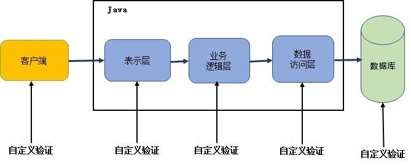
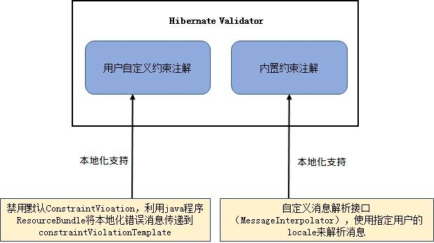

# Hibernate Validator 对全球化支持的实践
如何对内置的和用户自定义的约束注解提供本地化支持以及如何从用户自定义的资源文件中读取本地化的错误验证消息

**标签:** Java

[原文链接](https://developer.ibm.com/zh/articles/j-cn-hibernate-validator/)

夏怀英, [David Chen](https://developer.ibm.com/zh/profiles/davidsc)

发布: 2017-05-09

* * *

输入验证是 Spring 处理的最重要 Web 开发任务之一，在 Spring MVC 中有两种方式可以验证输入：一种是 Spring 自带的验证框架，另外一种是利用 JSR 实现，JSR 验证比 Spring 自带的验证器使用起来方便很多。JSR 是一个规范文档，指定了一整套 API， 通过标注给对象属性添加约束。Hibernate Validator 就是 JSR 规范的具体实现，Hibernate Validator 提供了 JSR 规范中所有内置约束注解的实现，以及一些附加的约束注解，除此之外用户还可以自定义约束注解。然而 Hibernate Validator 提供的接口没有直接支持输出本地化的错误验证消息。本文结合项目实践，总结了如何对内置的和用户自定义的约束注解提供本地化支持，以及如何从用户自定义的资源文件中读取本地化的错误验证消息。

## Hibernate Validator 概述

在 Java 应用程序中，必须要对输入进来的数据从语义上分析是有效的，也就是数据校验。对数据的校验是一项贯穿于从表示层到持久化层的常见任务，通常在每个层中都需要做相同的验证逻辑，然而不同的层通常有不同的开发人员做编码，这样就会存在冗余代码以及语义一致性等代码管理上的问题，如图 1 所示。

##### 图 1\. 原始的 Java 分层验证



为了避免重复验证以及管理问题，开发人员经常将验证逻辑与相应的域模型进行捆绑。JSR 349 Bean 验证 1.1 是一个数据验证的规范，为 Java Bean 验证定义了相应的元数据模型和接口，默认的元数据是 Java 注释，通过使用 XML 对原有的元数据进行覆盖和扩展。在 Java 应用程序中，通过使用 Bean 验证自带的约束或者用户自定义的约束验证来确保 Java Bean 的正确性。Bean 验证是一个 runtime 的数据验证框架，如果验证失败，错误信息会立马返回。从而使验证逻辑从业务代码中分离出来，如图 2 所示。

##### 图 2\. Bean 验证模型


Hibernate Validator 是 对 JSR 349 验证规范的具体实现，提供了 JSR 规范中所有内置约束注解的实现，以及一些附加的约束注解，表 1 是 Hibernate Validator 附加约束注解示例。

##### 表 1\. Hibernate Validator 附加的约束注解

约束注解含义@NotEmpty被约束的字符串不能为空@Length被约束的字符串长度必须在指定范围内@Email被约束的是邮件格式

## Hibernate Validator 对全球化支持概述

世界经济日益全球化的同时软件国际化势在必然，当一个软件或者应用需要在全球范围内使用的时候，最简单的要求就是界面上的信息能用本地化的语言来显示。然而 Hibernate Validator 4.0 提供的接口对全球化支持存在下面两个问题：

**问题 1：** 只能显示英文的错误消息，不能读取翻译的错误验证消息。因为默认的消息解释器（message interpolator）使用的是 JVM 默认的 locale（Locale.getDafult()），通常情况下为英文;

**问题 2：** Hibernate Validator 验证过程中的失败消息默认是从类路径下的资源文件 ValidationMessage.properties 读取， 然而在实际项目中，通常会根据模块结构自定义资源文件名称，方便源代码的管理以及资源文件的重用。

### 问题 1 的解决方案

在实际项目中，有两种方式使用 Hibernate Validator，一种就是使用自定义的约束注解进行验证；另外一种方式就是使用 Hibernate Validator 内置的约束注解进行验证。图 3 列出了对于这两种验证方式是如何显示本地化错误验证消息的。

##### 图 3\. 两种约束注解对本地化支持的解决办法



### 问题 2 的解决方案

如果需要从用户自定义的资源文件中读取错误验证消息，而不是默认的 ValidationMessage.properites，可以自定义资源文件定位器 PlatformResourceBundleLocator，将自定义的资源文件列表作为参数传递给资源文件定位器。

下面将结合实际项目经验，详细介绍如何解决这两个问题的。

## 自定义约束注解提供本地化支持

自定义约束注解就是用户根据自己的需要重新定义一个新的约束注解，通常包括两部分，一是约束注解的定义，二是约束验证器。

约束注解就是对某一方法、字段、属性或其组合形式等进行约束的注解，通常包含以下几个部分：

- @Target({ })：约束注解应用的目标元素类型，METHOD（约束相关的 getter 方法）, FIELD（约束属性）, TYPE（约束 java bean）, ANNOTATION\_TYPE（用在组合约束中）, CONSTRUCTOR（对构造函数的约束）, PARAMETER（对参数的约束）。
- @Retention()：约束注解应用的时机，比如在应用程序运行时进行约束
- @Constraint(validatedBy ={})：与约束注解关联的验证器，每个约束注解都对应一个验证器
- String message() default ” “：约束注解验证失败时的输出消息；
- Class<?>[] groups() default { };：约束注解在验证时所属的组别
- Class<? extends Payload>[] payload() default { };：约束注解的有效负载

清单 1 列出的@AlphaNumeric 就是一个自定义的约束注解示例，这是一个只对相关的 getter 方法和属性进行约束的注解，在应用程序运行时进行验证，当验证失败时，返回的错误消息为”Invalid value for it. Allowed characters are letters, numbers, and #.-\_()”。

##### 清单 1\. 自定义的约束注解@AlphaNumeric

```
package com.ibm.bean.test;

import static java.lang.annotation.ElementType.FIELD;
import static java.lang.annotation.ElementType.METHOD;
import static java.lang.annotation.RetentionPolicy.RUNTIME;
import java.lang.annotation.Documented;
import java.lang.annotation.Retention;
import java.lang.annotation.Target;
import javax.validation.Constraint;

@Documented
@Constraint(validatedBy = AlphaNumericValidator.class)
@Target({METHOD, FIELD})
@Retention(RUNTIME)

public @interface AlphaNumeric {
    String message() default "Invalid value for it. Allowed characters are letters, numbers, and {allowedPunc}";
    String allowedPunc() default "#.-_()";
    Class<?>[] groups() default {};
    Class<? extends javax.validation.Payload>[] payload() default {};
}

```

Show moreShow more icon

每一个约束注解都存在对应的约束验证器，约束验证器用来验证具体的 Java Bean 是否满足该约束注解声明的条件。约束验证器有两个方法，方法 initialize 对验证器进行实例化，它必须在验证器的实例在使用之前被调用，并保证正确初始化验证器，它的参数是约束注解；方法 isValid 是进行约束验证的主体方法，其中 value 参数代表需要验证的实例，context 参数代表约束执行的上下文环境。清单 1 定义的约束注解@AlphaNumeric，清单 2 给出了与该注解对应的验证器的实现。

##### 清单 2\. 自定义约束注解@AlphaNumeric 对应的验证器

```
package com.ibm.bean.test;

import javax.validation.ConstraintValidator;
import javax.validation.ConstraintValidatorContext;
import com.silverpop.marketer.util.PropertyGetter;

/**
* Implementation of the AlphaNumeric validator
*/
public class AlphaNumericValidator implements ConstraintValidator<AlphaNumeric, String> {

    AlphaNumeric alphaNumeric;

    @Override
    public void initialize(AlphaNumeric alphaNumeric) {
        this.alphaNumeric = alphaNumeric;
    }

    @Override
    public boolean isValid(String o, ConstraintValidatorContext arg1) {
        return isValid(o, alphaNumeric.allowedPunc());
    }

public boolean isValid(String o, String allowedPunc) {
        boolean isValid = true;

        if (o == null) {
            return true;
        }

        for (char ch : ((String) o).toCharArray()) {

            if (Character.isWhitespace(ch)) {
                continue;
            }
            if (Character.isLetter(ch)) {
                continue;
            }

            if (Character.isDigit(ch)) {
                continue;
            }

            if (allowedPunc.indexOf(ch) >= 0) {
                continue;
            }
            isValid = false;
        }
        return isValid;
}

```

Show moreShow more icon

对于这样的自定义约束验证器，当验证失败后输出的错误信息将是验证里定义的英文消息”Invalid value for it. Allowed characters are letters, numbers, and #.-\_()”。对于支持多语言的应用程序来说，想针对不同区域的客户显示不同的错误验证消息提示，ConstraintVioation 这个对象就是用来描述某一验证的失败信息。对某一个实体对象进行验证的时候，会返回 ConstraintViolation 的集合。我们需禁用默认 ConstraintVioation，并将我们的本地化错误消息传递到 constraintViolationTemplate。清单 3 和清单 4 是就是支持多语言的自定义约束规范。

##### 清单 3\. 支持多语言的自定义的约束注解@AlphaNumeric

```
package com.ibm.bean.test;

import static java.lang.annotation.ElementType.FIELD;
import static java.lang.annotation.ElementType.METHOD;
import static java.lang.annotation.RetentionPolicy.RUNTIME;
import java.lang.annotation.Documented;
import java.lang.annotation.Retention;
import java.lang.annotation.Target;
import javax.validation.Constraint;

@Documented
@Constraint(validatedBy = AlphaNumericValidator.class)
@Target({METHOD, FIELD})
@Retention(RUNTIME)

public @interface AlphaNumeric {
    String message() default " validator.invalidAlphaNumeric"
    String allowedPunc() default "#.-_()";
    Class<?>[] groups() default {};
    Class<? extends javax.validation.Payload>[] payload() default {};
}

```

Show moreShow more icon

validator.invalidAlphaNumeric: 是资源文件中对应的键值（key）。这里认为读者已经熟悉 Java 程序的国际化和本地化，同时（ [Java 程序的国际化和本地化介绍](https://www.ibm.com/developerworks/cn/java/joy-i18n/) ）这篇文章详细介绍了 Java 程序如何实现本地化。

##### 清单 4\. 支持多语言的约束验证器

```
package com.ibm.bean.test;

import javax.validation.ConstraintValidator;
import javax.validation.ConstraintValidatorContext;
import com.silverpop.marketer.util.PropertyGetter;

/**
* Implementation of the AlphaNumeric validator
*/
public class AlphaNumericValidator implements ConstraintValidator<AlphaNumeric, String> {

    AlphaNumeric alphaNumeric;

    @Override
    public void initialize(AlphaNumeric alphaNumeric) {
        this.alphaNumeric = alphaNumeric;
    }

    @Override
    public boolean isValid(String o, ConstraintValidatorContext arg1) {
        boolean isValid =isValid(o, alphaNumeric.allowedPunc());

       if(!isValid) {
         arg1.disableDefaultConstraintViolation();
         String errorMessage = PropertyGetter.getProperty(alphaNumeric.message() ,alphaNumeric.allowedPunc());
        arg1.buildConstraintViolationWithTemplate(errorMessage  ).addConstraintViolation();
    }

        return isValid;
}

```

Show moreShow more icon

- PropertyGetter.getProperty(alphaNumeric.message(), alphaNumeric.allowedPunc())：从对应资源文件中读取相关的验证信息。
- PropertyGetter：是将读取 Java 资源文件相关的 API 进行了包装，不属于这篇文章讨论范围。有兴趣的读者可以参考文后链接。
- arg1.disableDefaultConstraintViolation(): 禁用默认 ConstraintVioation。
- arg1.buildConstraintViolationWithTemplate(errorMessage).addConstraintViolation()：将指定的错误验证消息传递给 ConstraintVioation。

## 内置约束注解提供本地化支持

Hibernate Validation 内置约束注解对 Java Bean 的验证是通过调用 Validator.validate(JavaBeanInstance) 方法后，Bean Validation 会查找在 JavaBeanInstance 上所有的约束声明，对每一个约束调用对应的约束验证器进行验证，最后的结果由约束验证器的 isValid 方法产生，如果该方法返回 true，则约束验证成功；如果 isValid 返回 false 验证失败，对于失败的验证，消息解释器将从默认的 ValidationMessage.properties 中读取验证失败信息放到约束违规对象（ConstraintViolation 的实例）中。对于支持多语言的应用软件来说，要想将翻译的验证错误消息显示给用户，我们需要自定义消息解释器 MessageInterpolator，通过将用户的 locale 传递给自定义的 消息解释器，实现读取翻译的错误验证消息。

##### 清单 5\. 自定义的 MessageInterpolator

```
package com.ibm.bean.test;

public class LocalizedMessageInterpolator implements MessageInterpolator {
    private MessageInterpolator defaultInterpolator;
    private Locale defaultLocale;

    public LocalizedMessageInterpolator(MessageInterpolator interpolator, Locale locale) {
            this.defaultLocale = locale;
            this.defaultInterpolator = interpolator;
     }

    /**
      * 将用户的 locale 信息传递给消息解释器，而不是使用默认的 JVM locale 信息
      */
     @Override
      public String interpolate(String message, Context context) {
        return defaultInterpolator.interpolate(message, context, this.defaultLocale);
     }

     @Override
      public String interpolate(String message, Context context, Locale locale) {
        return defaultInterpolator.interpolate(message, context, locale);
      }
}

```

Show moreShow more icon

通过自定义接口 Validator 调用上述自定义的消息解析器，从而实现将用户的 locale 信息传递给验证器，当验证失败的时候自动读取对应翻译的错误验证消息。示例代码如清单 6 所示。

##### 清单 6\. 自定义 Validator Provider

```
package com.ibm.bean.test;

public class BeanValidator {

    public boolean isValid(Object bean, Locale locale) {
        return getValidationErrorsFor(bean, locale).isEmpty();
    }

    public List<ValidationError> getValidationErrorsFor(Object bean, Locale locale) {
        ValidatorFactory factory = Validation.buildDefaultValidatorFactory();
        MessageInterpolator interpolator = new LocalizedMessageInterpolator(locale);
        javax.validation.Validator classValidator = factory.usingContext().messageInterpolator(interpolator).getValidator();
        Set<ConstraintViolation<Object>> invalidValues = classValidator.validate(bean);
        return validationErrors(invalidValues);
    }

    private List<ValidationError> validationErrors( Set<ConstraintViolation<Object>> invalidValues) {
        List<ValidationError> validationErrors = list();
        for (ConstraintViolation<Object> invalidValue : invalidValues) {
            validationErrors.add(new ValidationError(invalidValue));
        }
        return validationErrors;
    }
}

```

Show moreShow more icon

## Hibernate Validator 使用用户自定义的资源文件

文章开头提到 Hibernate Validator 验证过程中第二个问题是验证失败的错误消息默认从类路径下的 ValidationMessage.properties 中读取，但是很多时候我们希望从自定义的资源文件（resource bundle）文件中读取，而不是指定路径下的 ValidationMessage.properties，以便于翻译以及重用已有的资源文件。在这种情况下，Hibernate Validator 的资源包定位器 ResourceBundleLocator 可以解决这个问题。

Hibernate Validator 中的默认资源文件解析器（ResourceBundleMessageInterpolator）将解析资源文件和检索相应的错误消息委派给资源包定位器 ResourceBundleMessageInterpolator。如果要使用用户自定义的资源文件，只需要将用户自定义资源文件名作为参数传递给资源包定位器 PlatformResourceBundleLocator，在启用 ValidatorFactory 的时候将新的资源包定位器示例作为参数传递给 ValidatorFactory。示例代码如清单 7 所示。

##### 清单 7\. 使用用户指定的资源文件

```
Validator validator = Validation.byDefaultProvider()
        .configure()
        .messageInterpolator(new ResourceBundleMessageInterpolator(new PlatformResourceBundleLocator("MyMessages" )))
        .buildValidatorFactory()
        .getValidator();

```

Show moreShow more icon

除了 PlatformResourceBundleLocator 外，Hibernate Validator 还提供了另一种资源包定位器的实现，即 AggregateResourceBundleLocator，它允许从多个资源包检索错误消息。 例如，您可以在多模块应用程序中使用此实现，其中每个模块都有一个资源文件。示例代码如清单 8 所示。

##### 清单 8\. 从多个资源文件中读取错误验证消息

```
Validator validator = Validation.byDefaultProvider()
               .configure()
               .messageInterpolator(new ResourceBundleMessageInterpolator( new AggregateResourceBundleLocator(Arrays.asList("MyMessages1","MyMessages2","MyMessages3"))))
              .buildValidatorFactory()
              .getValidator();

```

Show moreShow more icon

读取资源文件的顺序是按照传递给构造函数的顺序处理的。 这意味着如果多个 resource bundle 包含给定消息键的一个条目，则该值将从包含键的列表中的第一个 resource bundle 中获取。

## 结束语

本文总结了 Hibernate Validator 对国际化支持存在的一些问题，结合项目经验，介绍了如何实现从翻译的资源文件中读取错误验证消息，以及如何从用户项目自定义的资源文件中读取错误验证消息。希望这篇文章能为正在开发国际化 Web 应用程序的读者提供一定的参考价值。