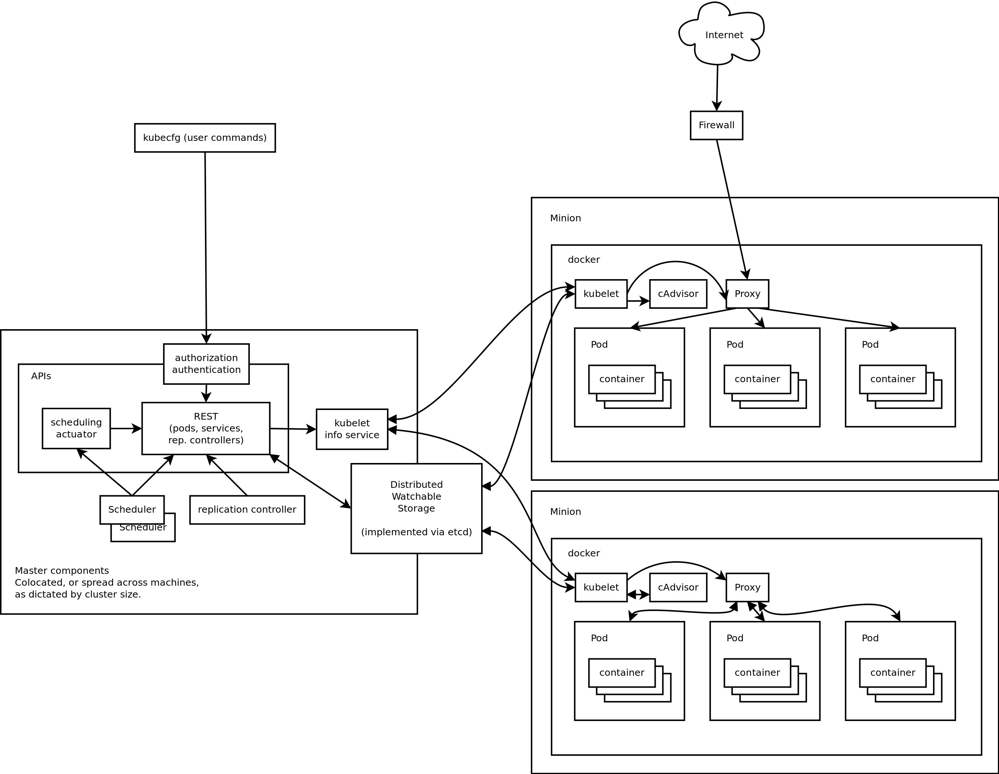
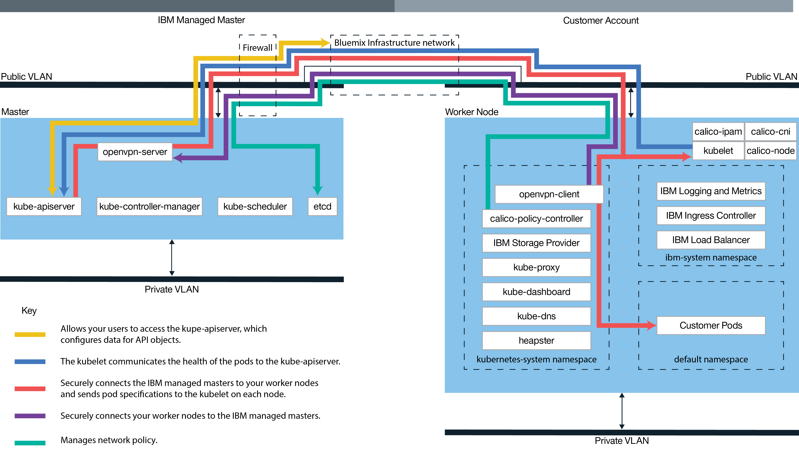

# IBM Cloud Kubernetes 实战入门
Kubernetes 基本架构和核心组件功能

**标签:** 云计算

[原文链接](https://developer.ibm.com/zh/articles/cl-cn-bluemix-kubernetes-cluster-practice1/)

安立学

发布: 2017-07-05

* * *

## 前言

2017 年 5 月 23 日 IBM Cloud 正式发布了 Kubernetes Cluster 容器管理平台，IBM Cloud 在原有的 Cloud Foundry 架构下全面兼容开源的 Kubernetes 和 Docker 容器技术，这标志着 IBM Cloud 在 PaaS 领域的发展步入了一个新的台阶。

近几年来，以 Docker 为代表的容器技术发展迅猛，给传统的开发运维模式提供了一种新的有颠覆性意义的标准，促进了企业应用的开发和运维更加标准化、自动化， 给企业应用迁移到云平台扫除了最后的障碍。国内外云厂商纷纷加入，全面支持 Docker 技术，Docker 给云计算厂商在 PaaS 领域的发展开启了新的篇章，也给互联网公司的运营平台的重构和以容器技术为基础提供服务的创业公司的发展提供了新的机遇。

企业应用走向云端是个趋势，以 Docker 为代表的容器技术的出现和发展，打破了原有的云平台供应商的技术壁垒，让走向云端的应用不再被具体的 某个云平台自身的技术锁定。企业应用可以在几乎零代码入侵的情况下顺利走向云端，也可以平滑的在不同的云厂商之间迁移，这是容器技术给云计算 技术带来的最大贡献。

本文介绍了 Kubernetes 基本架构和核心组件功能，在 IBM Cloud 云平台如何创建 Kubernetes Cluster，如何部署应用到 Cluster。 通过一个简单的 golang 编写的 Web Application，演示 Kubernetes 核心功能：Service Loadbalance、Failover、Scale up、Scale down、Rolling update 等，以及如何在 Kubernetes Cluster 中使用 IBM Cloud 已经有的 Cloud Foundry Base 服务。

## Kubernetes 简介

Kubernetes 是由 Google 开源出来的容器集群管理系统和编排引擎，是基于 Google 多年大规模集群管理技术 Borg 系统的开源改进版本。Kubernetes 简称 K8S，其提供应用部署、健康监测、负载均衡、灵活伸缩、滚动升级等核心功能，有效解决了传统的云端应用从开发，部署到运维。 特别是大规模集群应用在自动化运维方面所面临的各种问题，使容器化应用程序部署到集群中，就像部署到单个机器一样容易。

我们可以像管理单个机器一样，管理一个大规模集群，应用程序按需分布在集群中的各个节点，它们按照预设的策略健康运行。当某个应用发生故障时， 集群自动监测到故障并快速重建一个新的可用的实例以提供服务；当外来的访问压力增大时，集群帮助水平扩展出更多的应用实例以应对当前的压力， 相反在压力变小时，回缩实例个数，释放资源，以提高资源使用效率，降低运营成本；当有新的应用程序版本发布时，确保对外服务不间断的情况下滚动升级， 在新版本有问题时，顺利回退到老版本。

Kubernetes 的功能日渐丰富并在快速发展中。由于有 Google 多年运维大规模集群的经验作基础，Kubernetes 很快被各大云计算厂商和互联网公司所青睐，特别是在云计算方面，它促进了 PaaS 平台走向成熟和规范，直接推动 PaaS 平台步入容器云时代。

### Kubernetes 架构图



### Kubernetes 核心组件

Kubernetes 集群由 Master Node 和 Worker Node 组成，Master 和 Worker 可以运行在物理机器也可以是虚拟机上，它们协同工作，完成对容器化应用程序的部署，监控，升级等管理任务；Master Nodes 上运行 API Server、Scheduler 等管理组件，将管理指令下发到 Worker Node，Worker Node 上面运行 Docker 或者类似的容器引擎，Worker Node 按 Master 的策略设置以 Pod 为逻辑单元管理应用容器的生命周期。

#### Master Node

集群管理节点，上面运行 API Server、Controller Manager、Scheduler 等组件。

#### Worker Node

集群工作节点，在 Kubernetes 早期的版本中也叫 Minion，上面运行着 Docker 或者类似的容器引擎，Kubernetes 的 kubelet、 proxy 等组件和我们的应用程序容器。

#### API Server：

是整个 Cluster 的核心，通过 RESTful API 接口，对资源对象进行统一的配置和管理，并提供认证、授权、访问控制等机制为集群提供了一个安全的可操作的前端入口。

#### Controller Manager

负责维护集群的状态，并确保当前状态是策略要求的目标状态，比如对容器进行 Failover，伸缩容器运行个数，Rolling update 到新的 image 版本等。

#### Scheduler

负责资源的调度，按设置的策略将应用容器调度到特定的 Worker Node 上。

#### 分布式存储

由开源组件 etcd 实现，是个分布式 Key-Value 数据库，用来保存集群的持久化信息。

#### Kubelet

作为 Worker Node Agent 组件，按 Master 指定的要求，管理维护应用容器的生命周期。

#### Proxy

负责 TCP/UDP 转发和负载均衡，把对 Service 的访问 Loadbalance 到 Cluster 里面具体的应用容器上。

#### cAdvisor

监控容器资源使用情况和性能分析的代理组件。

### Kubernetes 常用术语

#### Pod

一个或者多个容器构成的集合，它们共享相同的网络和存储，是 Kubernetes 最小部署单元。

#### Deployment

应用部署，创建 Deployment 时候，指定要部署的 image，可以附加指定副本（replica）数量，这些 replica 组成 replicaSet 由 Controller Manager 自动管理，创建指定数量的 Pod，并监控 Pod 的运行状态，按设定的 replica 数量进行 Failover、Scale up/Scale down 等。

#### Service

逻辑相关的一组 Pod 的抽象定义，是应用程序对外提供服务的入口，Service 定义时，Kubernetes 分配一个唯一的 Cluster IP 和 DNS 名字，由于 Pod 的生命周期和存活的位置是不定的，通过 Service 去访问，屏蔽了 Pod Failover、Rolling update 等操作造成的容器的短期不可访问性，确保正在访问的服务持续可用。

#### ReplicationController

在 Kubernetes 早期版本中使用，功能类似 Deployment 加 ReplicaSet，维护 Pod 的数量和状态。

#### DaemonSet

DaemonSet 可以简单的理解为一类特殊的 Deployment，部署的应用在 Cluster 的每个 Node 有且只有一个 replica。当增加新 Node 成员到 Cluster 时候，DaemonSet 类型的应用自动在新的 Node 启动。 比如一些做监控或者日志管理的应用比较适合用 DaemonSet 类型部署。

#### Namespace

对资源对象进行分组，便于查询和管理。一般初始创建的 namespace 有 kube-system 和 default，缺省的 namespace 是 default。

#### Secret

用于保存应用的敏感信息，比如用户密码、证书、ssh keys 等。

#### Label

附加在任何对象上的由 key/value 组成的标签，供 Label Selector 做对象的选择。

Job 和 CronJob

Job 运行一次批处理任务，比如做数据库初始化等，CronJob 类似 Unix Cron，定时运行一个任务，比如定期做备份等。

其他更多概念参考官方文档

[https://Kubernetes.io/docs/concepts/](https://kubernetes.io/docs/concepts/)

## 安装 IBM Cloud CLI，Plugins 和 Kubernetes CLI，Docker

具体安装步骤参考

[https://cloud.ibm.com/docs/containers?topic=containers-cs\_cli\_install#cs\_cli\_install](https://cloud.ibm.com/docs/containers?topic=containers-cs_cli_install#cs_cli_install)

### IBM Cloud CLI

IBM Cloud CLI 是 IBM Cloud 云平台命令行管理工具，用于管理 IBM Cloud 上的应用程序、服务、网络等各种资源，是 IBM Cloud Console GUI 的命令行实现，其命令语法简单易懂，并且有很好的扩展性，可以安装很多 Plugins 来满足不同的管理需要。支持 MacOS、 Linux、Windows 等主流客户端操作系统。安装好后，主程序是 IBM Cloud 有个别名 bx， shell 中输入 bx 命令，会打印出使用帮助。

### Container service plugin

Container service plugin 用来在 IBM Cloud 云平台上创建，管理 Kubernetes Cluster， 获取 Cluster 相关配置信息的工具。安装好 Container service plugin 后，bx 命令会增加 cs 命令集合，输入 bx cs 可以打印 Container service 命令使用帮助。

### Container registry plugin

Container registry plugin 是用来管理保存在 IBM Cloud 上的 Docker image repository 的命令集合。

安装好 Container registry plugin 后，bx 命令会增加 cr 命令集合，输入 bx cr 可以打印 container registry 使用帮助。

### Kubernetes CLI – kubectl

Kubectl 是 Kubernetes 客户端程序，用来连接 Kubernetes cluster，部署维护应用程序的命令行工具。

### 安装 Docker

下载地址：

[https://www.docker.com/](https://www.docker.com/)

## 创建 IBM Cloud Kubernetes Cluster

用你的 IBM Cloud 账号通过 bx 命令登陆 IBM Cloud 云平台，如果你还没有 IBM Cloud 账号，可以在 [这里](https://cloud.ibm.com/registration?cm_sp=ibmdev-_-developer-articles-_-cloudreg) 免费申请一个。

具体创建步骤参考：

[https://cloud.ibm.com/docs/containers?topic=containers-getting-started](https://cloud.ibm.com/docs/containers?topic=containers-getting-started)

## IBM Cloud Kubernetes 概览



IBM Cloud Kubernetes 是社区版 Kubernetes 的产品化实现。为了满足 PaaS 云平台的需要，IBM 对社区版本作了适当的改进和完善。

从上图可以看出，除了 Kubernetes 原有的 Kube-\*、etcd 等核心组件外，IBM Cloud Kubernetes 增加了几个组件，OpenVPN、heapster、IBM Logging and Metrics、Loadbalancer、Storage Provider、Calico。它们分别实现安全、监控、日志和计量管理、负载均衡、存储管理、网络管理等 PaaS 平台所需的核心功能。实现了多租户的隔离，并提供了完备的操作接口和 API，自动化响应用户扩展和释放 Worker Node 资源的请求，自动部署 Master Node 和 Worker Node 中所需的各种管理组件，并按资源实际用量计费。

在当前发布的 IBM Cloud Kubernetes 版本，为了满足云平台的安全性的需要， IBM Cloud Kubenetes Master Node 由 IBM 拥有和管理。对用户不可见，对于集群中的 Worker Node，用户也只能使用。不能像使用 IaaS 云平台那样远程登陆，更改配置，安装软件等。 IBM Cloud Kubernetes 完全保持了 Kubernetes 原有的操作接口（Dashboard GUI 和 Kubectl CLI）。从部署和管理应用的角度来看，其和社区版本在使用上没有任何区别。另外，同样出于安全性考虑，Kubernetes Dashboard GUI 没有通过 Service 形式暴露出来，可以通过 kubectl proxy 在本地访问 Dashboard。

```
# 本地启动 proxy dashboard UI
$ kubectl proxy
Starting to serve on 127.0.0.1:8001

```

Show moreShow more icon

浏览器中输入 [http://127.0.0.1:8001/ui](http://127.0.0.1:8001/ui) 来访问 IBM Cloud Kubernetes Dashboard。如果现有的 Dashboard UI 不能满足需要，也可以通过 REST API 接口开发客户化的管理界面。Kubenetes 提供了丰富的 REST API，实际上 kubectl 也是通过 REST API 和 Kubernetes API server 组件进行交互的。为了便于理解，本文将主要使用 kubectl 命令行做所有管理操作，不使用 Dashboard UI。

## 部署第一个测试 nginx Webserver 到 Kubernetes Cluster

Nginx 是一款轻量的 Web 和反向代理服务器，在互联网公司中使用非常广泛，在 Docker Hub Registry 上有做好的 nginx 的 Docker image，参见： [https://hub.docker.com/\_/nginx/](https://hub.docker.com/_/nginx/)

我们部署一个在 Docker hub 上的 nginx 到 IBM Cloud Kubernetes cluster，后续章节我们会自己创建应用 image，push 到 IBM Cloud registry 上面，然后部署到 Cluster。

```
#部署两个 nginx webserver
$ kubectl run nginx --image=nginx --port=80 --replicas 2
部署时候可以指定 image 版本，不如 nginx:1.12.0
# expose nginx 让外网可以访问
$ kubectl expose deployment nginx --type=NodePort

$ kubectl get svc,deploy,pod
NAME                    CLUSTER-IP     EXTERNAL-IP   PORT(S)          AGE
svc/Kubernetes          10.10.10.1     <none>        443/TCP          2d
svc/nginx               10.10.10.211   <Nodes>       80:31969/TCP     2m

NAME                       DESIRED   CURRENT   UP-TO-DATE   AVAILABLE   AGE
deploy/nginx               2         2         2            2           2m

NAME                                    READY     STATUS    RESTARTS   AGE
po/nginx-3449338310-p5sh0               1/1       Running   0          2m
po/nginx-3449338310-swkhg               1/1       Running   0          2m

# 查看 Cluster Node ip
$ kubectl get Node
NAME              STATUS    AGE       VERSION
184.172.241.x   Ready     2d        v1.5.6-4+abe34653415733

```

Show moreShow more icon

上面命令部署 Docker HUB 上的 nginx image 到 IBM Cloud Kubernetes，运行两个 replica。这两个 replica 只在 Cluster 内部可用，如果让外面的用户可访问的话，需要 expose 作为 service，expose 的 service 类型为 NodePort。有三种 service 类型: ClusterIP、 NodePort、 LoadBalancer、 ClusterIP 是只在集群内可以访问的 IP，免费用户无法选择 LoadBalancer，我们用 NodePort 做测试，Kubernetes 会在每个 Cluster 成员 Node 开放一个 port，Loadbalance 到不同的容器端口，上面输出的 service NodePort 是 31969， NODEIP 是 184.172.241.xxx。

浏览器访问 [http://$NODEIP:$NODEPORT/，](http://$NODEIP:$NODEPORT/，) 可以看到 nginx 的欢迎页面。如果有多个 Node 成员，访问其他的 Node 的 Service Node Port 可以得到相同的 nginx 欢迎页面。现在我们完成了第一步，我们有两个容器运行 nginx，但我们现在还不知道哪一个 nginx 容器响应了我们的请求，是否 Kubernetes 把我们的请求 Loadbalance 到不同的 nginx。

使用下面命令清理本次实验中所创建的资源：

```
$ kubectl delete svc/nignx
$ kubectl delete deploy/nginx

```

Show moreShow more icon

## 创建一个简单的 WebApp，部署到 Kubernetes Cluster

下面的示例 WebApp 使用 go 语言编写，go 语言是 Google 在 2009 年开源出来的编程语言，是一种跨平台的编译型高级语言，既有 C／C++的运行性能，同时又有像 java 等高级语言那样简洁的语法，适合编写高性能、高并发、分布式的网络应用程序；Docker 和 Kubernetes 都是 go 语言开发的，本文用 go 语言提供示例，是希望没有接触过 go 的读者对 go 语言有个基本的了解，对深入学习 Docker，Kubernetes 等技术有所帮助，下面示例代码创建一个简单的 Web 应用程序。

### 编写 WebApp 代码

```
$ mkdir k8s-go-handson-01 && cd k8s-go-handson-01
$ vi webserver.go 或者用你喜欢的文本编辑器

package main
import (
        "fmt"
        "net/http"
        "os"
)
func indexHandler(w http.ResponseWriter, r *http.Request) {
        fmt.Println("Accessing:", r.URL.Path)
        var version = "Version 1.0"
        var hostName = os.Getenv("HOSTNAME")
        var output = version + "\nHello Bluemix Kubernetes Cluster! \n" + "HostName:" + hostName + "\n"
        fmt.Fprintf(w, output)
}
func killHandler(w http.ResponseWriter, r *http.Request) {
        fmt.Println("Kill server!")
        os.Exit(1)
}
func main() {
        http.HandleFunc("/kill", killHandler)
        http.HandleFunc("/", indexHandler)
        port := os.Getenv("WEBAPP_PORT")
        if port == "" {
                port = "8000"
        }
        fmt.Println("WebServer listening port:" + port)
        http.ListenAndServe(":"+port, nil)
}

```

Show moreShow more icon

### 代码说明

- Go 语言引入其他代码库用 import 关键字，类似 java，python 等；
- main 函数是程序入口，类似 C 语言；
- os.Getenv(“WEBAPP\_PORT”)取得容器系统环境变量 WEBAPP\_PORT；
- http.ListenAndServe 启动 Web 服务器，监听 TCP 网络端口，等待客户端请求；
- http.HandleFunc 指定当访问的 http URI 匹配某个字符串时，调用什么函数处理；
- os.Getenv(“HOSTNAME”)获得系统环境变量，Kubernetes 启动容器时候把主机名注入到容器系统环境变量 HOSTNAME；

上面代码主要作用是启动一个 Web 服务器，当客户端访问缺省的上下文”/”时候，返回当前 Web 应用的版本信息，欢迎语和容器主机名，版本信息便于我们做应用程序升级测试时，知道当前响应的 Web 应用版本，容器主机名便于测试 Loadbalance 和 Failover 功能，知道当前是哪个容器响应了请求；当客户端访问/kill 时候，Web 服务器退出，模拟容器因各种原因 crash 掉，便于测试 Kubernetes Failover 功能。Kubernetes 也支持在应用容器没有停止掉，只是 App 自身运转不健康的情况下做 Failover，详情参考下面文档：

[https://Kubernetes.io/docs/tasks/configure-Pod-container/configure-liveness-readiness-probes/](https://kubernetes.io/docs/tasks/configure-pod-container/configure-liveness-readiness-probes/)

### 创建 Dockerfile

```
FROM golang:1.8-alpine
COPY webserver.go /go/src/webserver/
RUN go install webserver && rm -rf /go/src/webserver
ENV WEBAPP_PORT=8000
EXPOSE $WEBAPP_PORT
CMD /go/bin/webserver

```

Show moreShow more icon

上面 Dockerfile 使用 golang:1.8-alpine 做 Base Image，是个非常小的 golang 环境，我们本地不需要安装 golang，直接使用这个 base image 即可，golang 是编译型语言，编译好二进制后是不再需源码运行的。

### Build Image

Build Docker image， push 到 IBM Cloud registry

```
#列出你的 IBM Cloud registry namespace
$ bx cr login
$ bx cr namespaces

$ docker build -t registry.ng.bluemix.net/<YOUR-NAMESPACE>/k8s-go-handson-01:v1 .
$ docker push registry.ng.bluemix.net/<YOUR-NAMESPACE>/k8s-go-handson-01:v1

```

Show moreShow more icon

### 部署 WebApp 到 Kubernetes Cluster

```
$ kubectl run handson01 --image=registry.ng.bluemix.net/<YOUR-NAMESPACE>/k8s-go-handson-01:v1 --replicas=3
$ kubectl expose deployment handson01 --type=NodePort --port 8000

$ kubectl get node,svc,deploy,pod
NAME                 STATUS    AGE       VERSION
no/184.172.241.xxx   Ready     4d        v1.5.6-4+abe34653415733

NAME             CLUSTER-IP     EXTERNAL-IP   PORT(S)          AGE
svc/handson01    10.10.10.94    <Nodes>       8000:32062/TCP   12s
svc/Kubernetes   10.10.10.1     <none>        443/TCP          4d

NAME                DESIRED   CURRENT   UP-TO-DATE   AVAILABLE   AGE
deploy/handson01    3         3         3            3           15s

NAME                            READY     STATUS    RESTARTS   AGE
po/handson01-1536601282-71x7j   1/1       Running   0          15s
po/handson01-1536601282-8ngwk   1/1       Running   0          15s
po/handson01-1536601282-vqk11   1/1       Running   0          15s

$ NODEIP=184.172.241.xxx
$ NODEPORT=32062

```

Show moreShow more icon

部署到 Cluster 的 3 个 WebApp 通过 Node 端口 32062 对外服务。

### Service Loadbalance and failover

开启另一个 shell 用 curl 或者 Web 浏览器，持续访问 NODEIP 的 NODEPORT。

```
$ while true; do curl http://$NODEIP:$NODEPORT;sleep 3; done
可以看见来自 3 个 webserver 的响应，示例输出
Version 1.0
Hello Bluemix Kubernetes Cluster!
Hostname: handson01-1536601282-71x7j

Version 1.0
Hello Bluemix Kubernetes Cluster!
Hostname: handson01-1536601282-8ngwk

Version 1.0
Hello Bluemix Kubernetes Cluster!
Hostname: handson01-1536601282-vqk11

```

Show moreShow more icon

开启一个新 shell 运行 curl 或者浏览器窗口， 访问 [http://$NODEIP:$NODEPORT/kill](http://$NODEIP:$NODEPORT/kill) 两次，观察第一个 shell 的 webserver response 的 hostname 发生了变化，从 3 个变 1 个，然后很快又变成 3 个，也可以通 kubectl get pod 看到 RESTARTS 值从 0 变 1， Cluster 自动 restart 失败的 webserver，重新产生新的应用容器来满足 replica 数量的设定。

### Service 伸缩

假设外面来的访问量发生变化，当前的 WebApp 实例数量不能满足要求，我们可以通过下面命令增加或者减少实例数，如果有多个 Worker Node，Kubernetes 会按资源使用情况自动调度 App 到不同的 Node 运行。

Scale Up

```
$ kubectl scale --replicas=5 deployment/handson01
$ kubectl get pod

```

Show moreShow more icon

观察第一个 shell webserver response 的变化，response 的 hostname 从 3 个变为 5 个。

Scale down

```
$ kubectl scale --replicas=3 deployment/handson01

```

Show moreShow more icon

### Rolling update and rollback

下面测试一下，当我们的 App 开发了新的版本，增加了新的功能或者修复了已有的 Bug，如何在应用不线下，不影响对外服务的情况下完成版本升级，当新版本有问题时候，如何在不中断服务的情况下回退到旧版本。

Update image 到新版本

更改 webserver.go 代码， 改变字符串 “Version 1.0” 为 “Version 2.0″，重新 build image，tag 为 v2，push 到 registry.ng.bluemix.net

```
$ docker build -t registry.ng.bluemix.net/<YOUR-NAMESPACE>/k8s-go-handson-01:v2 .
$ docker push registry.ng.bluemix.net/<YOUR-NAMESPACE>/k8s-go-handson-01:v2

```

Show moreShow more icon

更新 image 到 v2 并记录更新历史

```
$ kubectl set image deployment handson01 handson01=registry.ng.bluemix.net/<YOUR-NAMESPACE>/k8s-go-handson-01:v2 --record

```

Show moreShow more icon

查看历史

```
$ kubectl rollout history deployment handson01
deployments "handson01"
REVISION    CHANGE-CAUSE
1       <none>
2       kubectl set image deployment handson01 handson01=registry.ng.bluemix.net/<YOUR-NAMESPACE>/k8s-go-handson-01:v2 --record=true

```

Show moreShow more icon

注：第一个 revision change-cause 是 none，如果我们最初运行 kubectl run 增加了参数–record， 就会在历史里面记录执行的命令了。

查看第一个 shell 的输出，在服务不中断的情况下 response 页面显示的版本号变为 Version 2.0。

回退到旧版本

```
$ kubectl rollout undo deployment handson01 --to-revision=1

$ kubectl rollout history deployment handson01
deployments "handson01"
REVISION    CHANGE-CAUSE
2       kubectl set image deployment handson01 handson01=registry.ng.bluemix.net/<YOUR-NAMESPACE>/k8s-go-handson-01:v2 --record=true
3       <none>

```

Show moreShow more icon

查看第一个 shell 的输出，在服务不中断的情况下 response 页面的版本变回 1 了。

使用下面命令清理本次实验中所创建的资源：

```
$ kubectl delete svc/handson01
$ kubectl delete deploy/handson01

```

Show moreShow more icon

## 总结

上面简单介绍了 Kubernetes 和 IBM Cloud Kubernetes 基本架构和核心组件功能，如何创建和部署应用到 IBM Cloud Kubernetes Cluster，并通过一个非常简单的 WebApp 展示了 IBM Cloud Kubernetes Failover，Loadbalance，Scale Up/Scale Down，Rolling update 等核心功能。 接下来在 [《IBM Cloud Kubernetes 实战进阶》](https://www.ibm.com/developerworks/cn/cloud/library/cl-cn-bluemix-kubernetes-cluster-practice2/index.html) 中我将通过增加简单的代码，演示部署和管理复杂的应用，以及介绍如何在 Kubernetes Cluster 环境中使用 IBM Cloud 已有的 Cloud Foundry Base 服务。