# IBM Cloud Object Storage 访问权限设置及 CDN 静态资源加速
两种对象存储服务来存储介质的静态资源加速方案

**标签:** 云计算

[原文链接](https://developer.ibm.com/zh/articles/cl-lo-cloud-object-storage-cdn-static-resource-acceleration/)

杨 晓蓓, 卢 江, 赵 斐, 陈 宏亮

发布: 2019-07-24

* * *

## 概览

当用户在建立网站和应用程序时，经常需要使用 CDN 服务来对高频访问的静态资源（如图片，视频，文档等）进行访问加速。在 IBM Cloud 云平台上，我们为客户提供了两种对象存储服务来存放介质，一种是经典的 S3 Cloud Object Storage（下文中简称 S3 COS），一种是标准 IBM Cloud Object Storage（下文中简称 ICOS）。本文将分别介绍以这两种对象存储服务来存储介质的静态资源加速方案。

## 相关产品和工具简介

1. IBM Cloud Object Storage 简介

    随着大数据、移动互联网时代的发展，非结构化数据呈现出爆发的态势。在云存储的舞台上，ObjectStorage 对象存储作为新生事物已经被广大用户熟知和使用了。对象存储具备数据分离、高兼容性、高并发高可扩展等优势，在很多应用场景中都发挥了重要的作用。例如用户使用对象存储来进行冷备份；使用对象存储来作为大数据分析的存储调用介质。IBM 云对象存储平台，能够帮助世界各地的企业解决非结构化数据难题，除了具备可扩展、可用性、安全性，还具有易管理性以及较低成本的特性。

    IBM 在之前的对象存储服务体系中，曾提供过给予 OpenStack Swift 的对象存储服务，目前已经停止了商业服务。目前在 IBM 云平台上有两种对象存储服务，都是基于 S3 API 的。一种被称为经典的对象存储服务，我们简称为 S3 COS。S3 COS 是针对从 IaaS 入口购买的对象存储服务，提供了一定的法规遵从性，但不提供 PaaS 平台特有的 IAM（用户和访问管理），以及不具备集成 IBM Key Protect 服务的能力。

    另一种对象存储服务，用户可以从 IBM Cloud 的 [存储分类](https://cloud.ibm.com/catalog?category=storage?cm_sp=ibmdev-_-developer-articles-_-cloudreg) 中直接购买，我们简称 ICOS 或标准 COS。这种版本的对象存储服务可以完美的和 IBM 云服务集成，包括 Watson Studio。并且可以使用 IAM 进行访问权限管理，集成 Key Protect 服务，以及未来其它可能新增加的云上的功能。

    本文将不过多对 Cloud Object Storage 的特性进行介绍。读者可以登录 [IBM Cloud](https://cloud.ibm.com?cm_sp=ibmdev-_-developer-articles-_-cloudreg) 免费试用 IBM Cloud Object Storage 的 Lite 版本以了解其特性。更详细的介绍请大家参照下面的文档： [关于 IBM Cloud Object Storage](https://cloud.ibm.com/docs/services/cloud-object-storage?topic=cloud-object-storage-about-ibm-cloud-object-storage) 。

2. IBM Content Delivery Network 简介

    相信大家对 Content Delivery Network (CDN) 即内容分发网络都不会陌生了。CDN 依靠部署在各地的缓存服务器，通过中心平台的负载均衡、内容分发、调度等功能模块，可以使用户就近获得所需要的资源。从而可以提高用户访问资源的响应速度和命中率。

    IBM Cloud 和 Akamai 合作提供 CDN 内容分发的特性，可以在超过 50 个城市提供边缘服务器，从而极大的解决了资源响应速度。


**免费试用 IBM Cloud**

利用 [IBM Cloud Lite](https://cocl.us/IBM_CLOUD_GCG) 快速轻松地构建您的下一个应用程序。您的免费帐户从不过期，而且您会获得 256 MB 的 Cloud Foundry 运行时内存和包含 Kubernetes 集群的 2 GB 存储空间。 [了解所有细节](https://www.ibm.com/cloud/blog/announcements/introducing-ibm-cloud-lite-account-2) 并确定如何开始。

## 需要做的准备工作

IBM Cloud 帐户。如果您还没有 IBM Cloud 帐户，可以先获取一个 [免费试用](https://cocl.us/IBM_CLOUD_GCG) 帐户。

## 应用场景描述

一个网站应用，其中包含了很多种不同类型的资源文件，例如图片、视频、文档，还有些样式文件，脚本文件等。在网站建设初期，没有大量用户访问量的时候，资源访问性能问题还没有那么凸显。但是随着应用访问量的增加，高频访问的资源往往需要进行访问”分离”或者”隔离”。而且对于这些高频资源的访问，网站运营者往往希望来自各地的客户都能在同一时间得到更好的体验。在这种情况下，开发者就会使用 CDN 服务来加速网站静态资源的访问。

在本文中，我们的用户场景是帮助客户将 IBM Cloud 中部署的一个 web 应用，使用 IBM 对象存储服务和 IBM CDN 服务来实现网站的静态资源响应加速。具体的方案是首先我们将把网站的静态资源剥离并存储在 IBM Cloud Object Storage 对象存储服务中，再通过购买使用 IBM CDN 服务来实现对象存储服务中特定资源的分发以提高响应速度和命中率。

### 应用场景实现方案描述

前面我们提到，一个网络应用程序，往往包括很多的资源，如 HTML、图片、视屏、样式文件、脚本文件等等。有些内容是经常需要变化的，有些则是不变的。还有些文件是相对会被客户高频访问的。对于这些不经常改变并且高频访问的静态资源，我们可以把它们从我们的主程序访问流量中隔离开，选择 CDN 可以将这些资源分发到离客户更近的地方，从而达到网站针对不同地区的客户在同一时间都能为其提供更加快速的加载体验。

IBM CDN 可以对不同来源的资源进行配置，例如主机、对象存储。我们将使用具体的用户场景来介绍如何使用 IBM CDN 和对象存储来加速静态文件的访问。在介绍方案之前，我们从下面这张图片可以了解一下在 IBM 云上使用 CDN 服务和 COS 服务的服务架构。

##### 图 1\. IBM 云上使用 CDN 服务和 COS 服务的架构

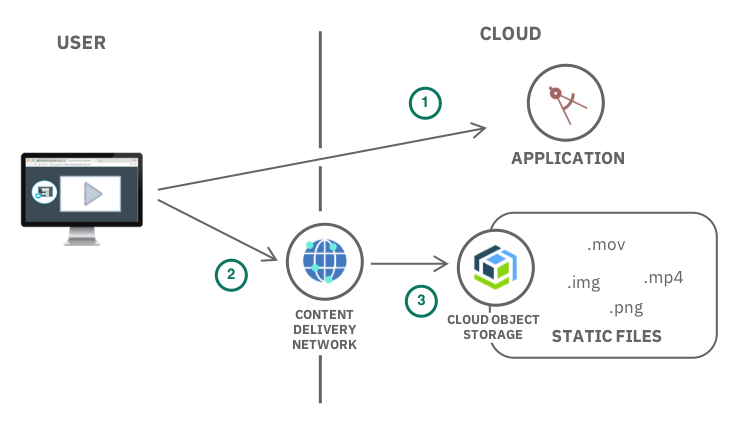

更详细的内容大家可以参照 [文档](https://cloud.ibm.com/docs/tutorials?topic=solution-tutorials-static-files-cdn) 。

首先，用户需要访问云上的一个应用，这个应用中的一些静态资源使用了 IBM CDN 服务进行了服务分发。这时，用户就可以直接访问到 CDN 分发的那部分静态资源。如果内容不存在或者已经过期，那么 IBM CDN 服务会从 COS 服务提取静态资源。

因为 IBM S3 COS 和 ICOS 由于包含的特性不同，在具体操作步骤上也会有不同。由于这两类对象存储在真实的客户场景中都大量使用过，我们将分别介绍。后面的章节里，我们会分别介绍如何使用 IBM CDN 服务对 ICOS 和 S3 COS 两种对象存储服务介质进行资源加速。

## 第 1 步： 资源文件的剥离

首先我们看一下运行在 IBM 云中的 web 应用的源文件结构。可以看到已经简单的实现了静态资源的分离即存放在单独的文件夹 content 中。在这个文件夹中存放了我们高频访问的所有的静态资源。

##### 图 2\. IBM 云中 web 应用的文件结构

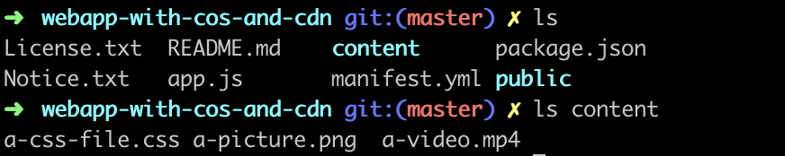

在 html 中，我们的访问方式还是直接访问 content 目录下的资源。

接下来，我们将会在在 ICOS 中创建一个 Bucket 用来存放所有的样式文件。在 S3 COS 中创建一个 Bucket 用来存放项目用到的视频文件和图片文件。也可以将 Bucket 全部创建到 ICOS 或者 S3 COS，由于两种 COS 都有大量的用户，所以我们在一个场景中混合使用了两种对象存储服务。

## 第 2 步：资源文件上传以及其访问权限的设置

资源文件的上传可以通过操作界面或者命令行来进行。但是往往客户在实际操作中会忽略了访问权限问题。在我们观察到的客户使用场景中，很多客户会将来自不同项目的文件无规则的直接散放在”篮子” Bucket 中。但是这样并不是一个很好的资源组织方式。我们通常会建议客户用 Bucket 来组织数据，例如一个 Bucket 存放一个项目的资源。这种方式也会方便我们在 Bucket 层面简单快速的赋予权限。后面讲详细解释不同场景下的权限设置方法。

**_2.1 对 Bucket 直接设置访问访问权限_**

首先，我们介绍最简单的一种情况，对象存储的篮子里存放的全部都是需要 CDN 分发的静态文件，例如我们在本场景中所有的 css 文件都需要 CDN 分发。

Public Access (IAM Anonymous)，是 ICOS 的一个新特新。它使用户能够赋予某个 Bucket 公共访问属性。一旦配置了 Public Access，所有用户（授权的和未授权的）都将被准许读取这个 Bucket 里面的数据。

拥有管理权限的用户可以通过 IBM Cloud 的 UI 去给指定的 Bucket 创建一个访问策略使其具备公共访问属性。

首先，登录 [https://cloud.ibm.com](https://cloud.ibm.com/?cm_sp=ibmdev-_-developer-articles-_-cloudreg) ，找到你的 ICOS，进入 ICOS 的 WEB 管理界面。然后选择创建好的 Bucket “cos-cdn-public”。

上传程序源码中 content/\*css 文件到 “cos-cdn-public”。我们可以通过 http(s)://[Bucket Name].[Endpoint]/[Object Name] 访问验证一下此时该文件的可读性。可以看到此时的文件是访问拒绝的。

##### 图 3\. Bucket 目前的文件访问是不允许的


然后，选择 Policies，Public Access。这里你就可以通过 “Create access policy” 按钮创建公共访问 policy 并赋予当前 Bucket。

##### 图 4\. 给 Bucket 赋权限

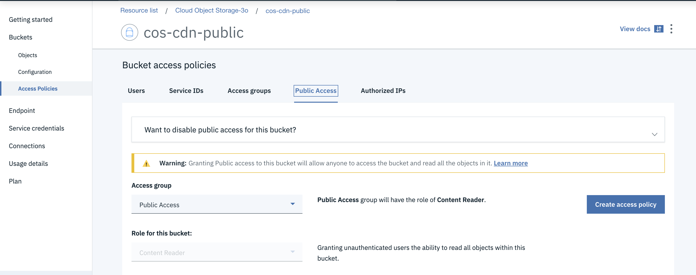

最后，回到 Buckets 列表的页面，你就能看到对应的 Bucket 多了一个 Public Access 属性。

##### 图 5\. Bucket 目前所具有的权限

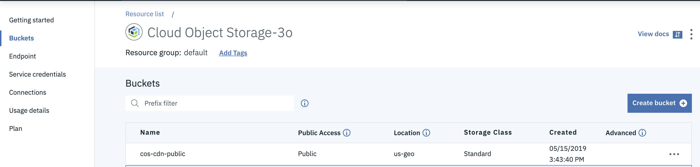

你可以通过 Manage -> Access(IAM) -> Access groups 去管理公共访问 policy。

##### 图 6\. 管理公共访问 Policy

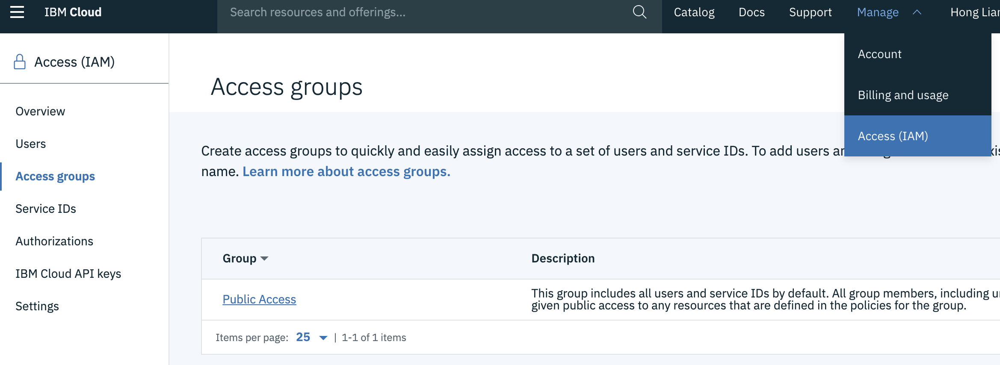

设置好公共访问权限之后，我们再通过下面的方式直接访问 Bucket 里面的数据，http(s)://[Bucket Name].[Endpoint]/[Object Name] 已经可以访问到了。

##### 图 7\. 直接访问 Bucket 里的数据

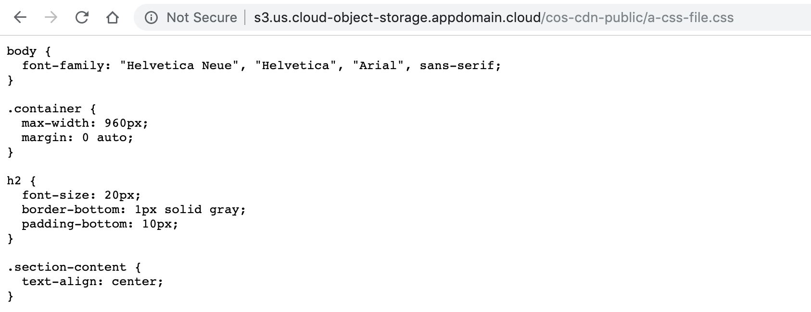

**_2.2 对 o bject 设置访问权限_**

接下来我们将图片文件和 视频文件存放到 S3 COS 服务中。上传文件时直接赋予权限，或者先上传后赋予权限都是可行的。另外，我们如果选择使用 ICOS，Bucket 混合存储了需要分发和不可以分发的文件，我们不能直接对 Bucket 进行访问权限设置，因为有可能会将不可以分发的文件的访问权限也进行的改写。在这种场景下，我们需要对 Bucket 中的对象单独进行访问权限的设置。

首先我们将图片文件通过 UI 上传到 S3 COS 的 Bucket 中。

##### 图 8\. 将图片上传到 S3 COS Bucket 中


通过 browser 访问来查看一下文件的访问属性。客户看到文件访问是被拒绝的。

接下来我们使用 aws cli 来设置文件的 public-read 权限。

```
➜✗ aws --endpoint-url=https://developer.ibm.com s3api put-object-acl --bucket "cos-cdn-media" --key "a-picture.png" --acl "public-read"

```

Show moreShow more icon

同样的，我们可以用 aws cli 来查看设置的权限是否生效。

```
➜  demo aws --endpoint-url=https://developer.ibm.com s3api get-object-acl --bucket "cos-cdn-media" --key "a-picture.png"
{
    "Owner": {
        "DisplayName": "4ac4adbb0f1944438b41f82504ff8286",
        "ID": "4ac4adbb0f1944438b41f82504ff8286"
    },
    "Grants": [
        {
            "Grantee": {
                "Type": "Group",
                "URI": "http://acs.amazonaws.com/groups/global/AllUsers"
            },
            "Permission": "READ"
        },
        {
            "Grantee": {
                "DisplayName": "4ac4adbb0f1944438b41f82504ff8286",
                "ID": "4ac4adbb0f1944438b41f82504ff8286",
                "Type": "CanonicalUser"
            },
            "Permission": "FULL_CONTROL"
        }
    ]
}

```

Show moreShow more icon

也可以通过 browser 访问来验证一下文件的访问属性。

##### 图 9\. 验证文件的访问属性

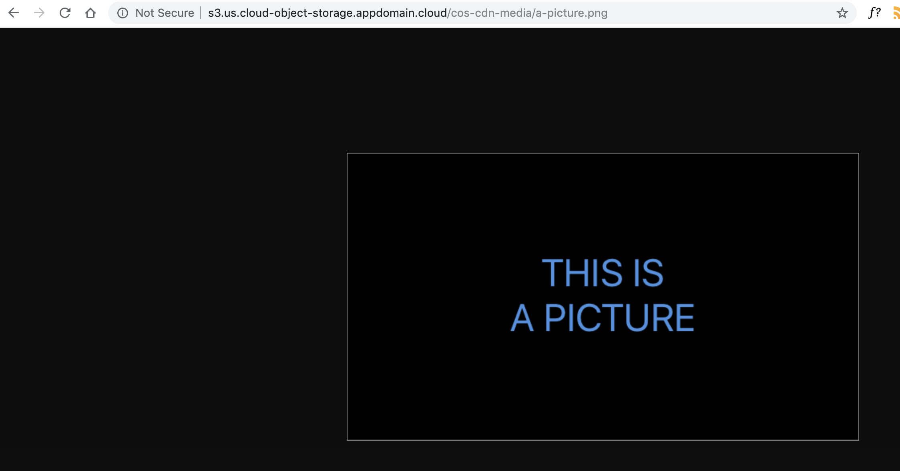

然后，我们可以用 aws cli 直接上传视频，并且设置了 public-read 属性。

```
➜  content git:(master) ✗ aws --endpoint-url=https://developer.ibm.com s3 cp a-video.mp4 s3://cos-cdn-media/a-video.mp4 --acl "public-read"
upload: ./a-video.mp4 to s3://cos-cdn-media/a-video.mp4

```

Show moreShow more icon

通过 browser 访问来验证一下文件的访问属性。

##### 图 10\. 继续验证文件的访问属性

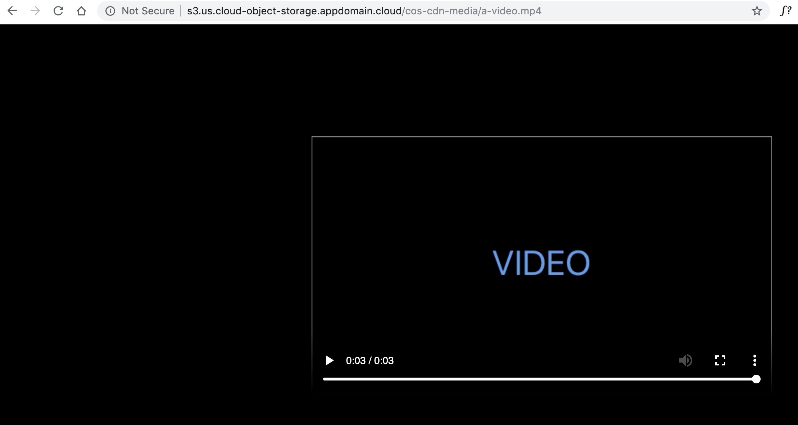

现在，我们就已经把所有的资源文件分别存储在 ICOS 和 S3 COS 中了。

除了上面的方式，由于 S3 COS 没有 Public Access (IAM Anonymous) 的特性，如果 Bucket 中的 object 也可以一次性设置为 public-read。

下面是脚本样例：

```
$ export ENDPOINT="YOUR_ENDPOINT"
$ export BUCKET="YOUR_BUCKET"
$ KEYS=( "$(aws --endpoint-url "$ENDPOINT" s3api list-objects --no-paginate --query 'Contents[].{key: Key}' --output text --bucket "$BUCKET")" )
$ for KEY in "${KEYS[@]}"
> do
>   aws --endpoint-url "$ENDPOINT" s3api put-object-acl --bucket "$BUCKET" --key "$KEY" --acl "public-read"
> done

```

Show moreShow more icon

## 第 3 步：设置 IBM 云 CDN

首先需要在域名服务商购买一个域名，例如本文作者已经有一个 51xhb.cn 的域名。

接下来在 IBM Cloud 上购买 IBM CDN 服务。

##### 图 11\. 在 IBM Cloud 上购买 IBM CDN 服务

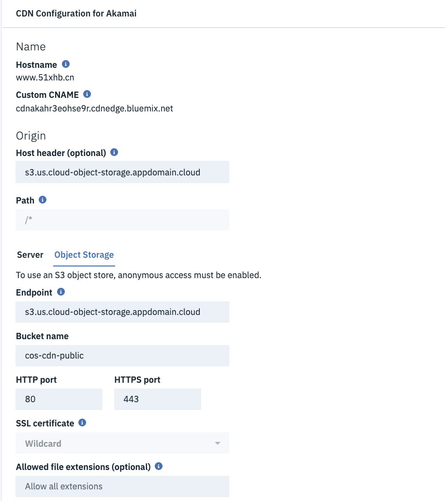

之后，我们需要到 DNS 提供商配置域名 CNAME 解析。CNAME 的值可以从刚才购买的 CDN 详情页面中得到。

##### 图 12\. 到 DNS 提供商配置域名 CNAME 解析

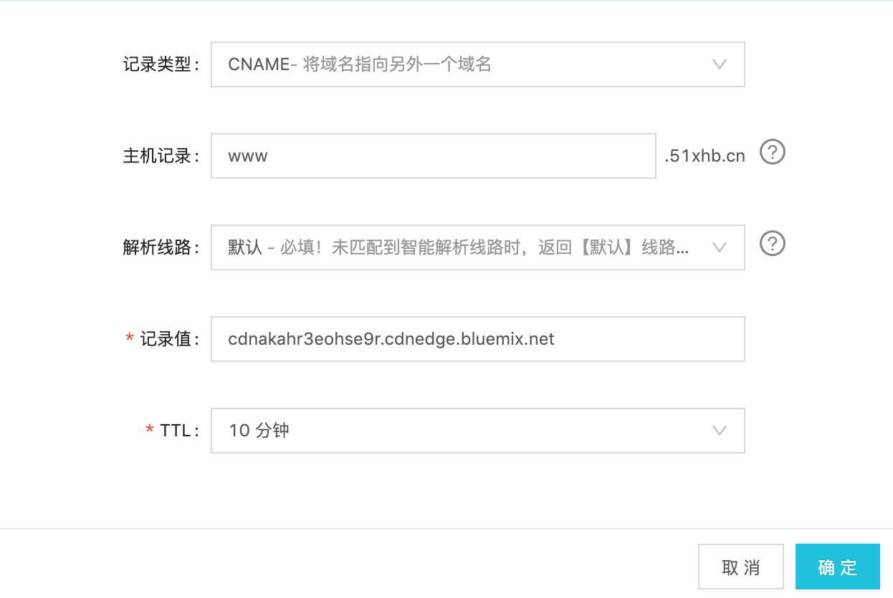

这时，我们可以看到在 CDN 列表里面我们刚才购买的 CDN 服务已经是 running 的状态了。

我们可以通过访问 COS 里面的资源来验证 CDN CNAME 是否已经正常工作。

例如通过 CNAME 访问：

##### 图 13\. 通过 CNAME 访问 COS 里面的资源

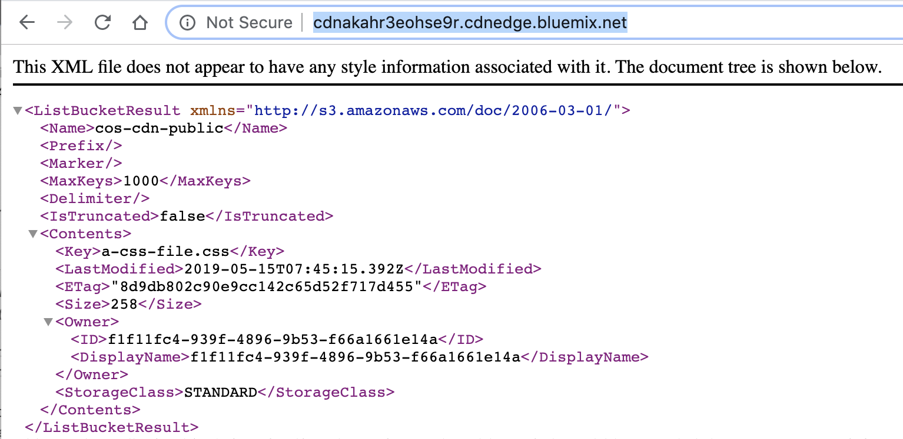

## 第 4 步：增加 CDN origin 实现资源的分类访问

在官方教程中提供了样例教程可以参考。也可以在资源访问时参考不同情况设置 CDN 访问方式。

在这里，我们通过在 CDN 中设置不同的 origin 来示例对不同类型资源分类访问以及同时使用两种对象存储的方式。

首先，在前面设置 IBM CDN 的时候，我们已经指定了默认的 origin，并绑定了对象存储为 ICOS 的 Bucket “cos-cdn-public”。

现在，我们增加一个 origin。在 CDN 中选择之前生成的实例，打开后，来到 Origins 页面，选择增加一个 origin。

##### 图 14\. 增加一个 origin

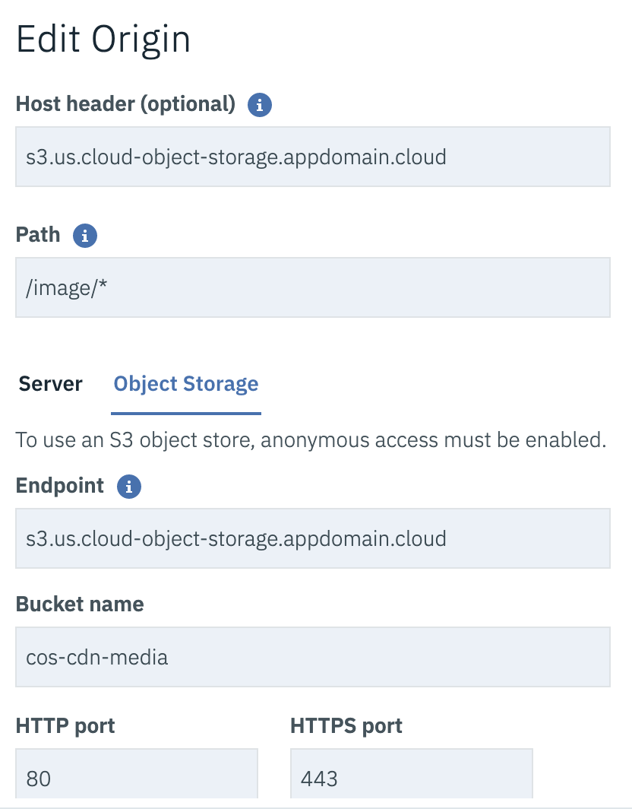

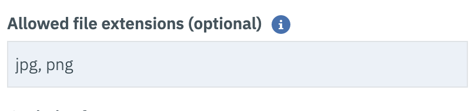

上图实例中，我们指定了 S3 COS 类型的对象存储中的 Bucket，并且设置 Path 为 /image/ _，在允许的文件后缀中输入了 jpg，png。这样我们便在访问 /image/_ 的时候允许 CDN 分发在该 Bucket 中类型为 txt 的资源了。如下图所示：

##### 图 15\. 访问 COS 里面的文件资源

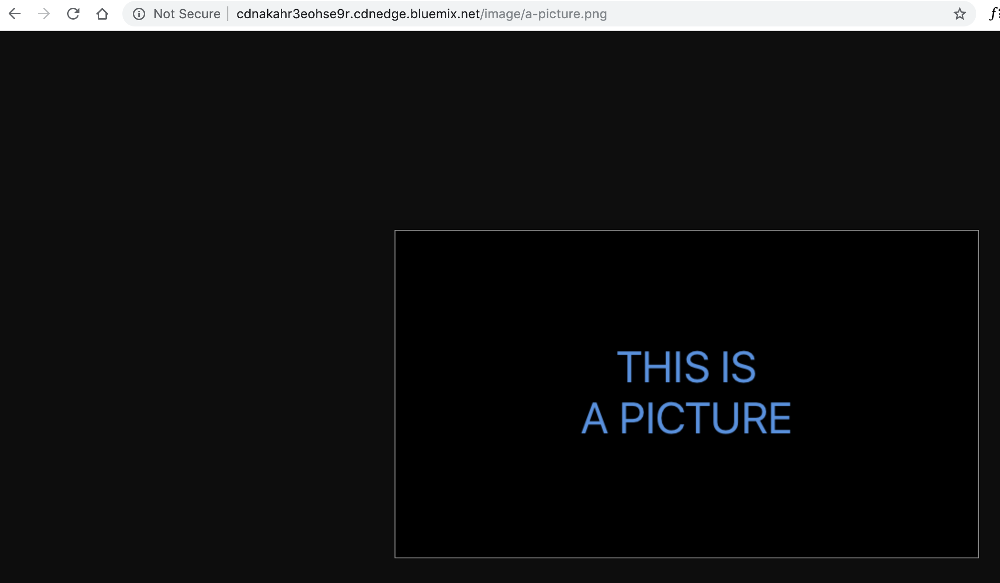

同样，我们也可以访问增加 video 的 path，如下图：

##### 图 16\. 访问增加 video 的资源

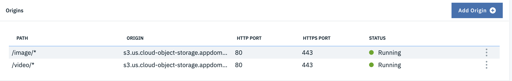

## 第 5 步：更新程序中资源的访问方式

最后，我们需要做的就是更新应用程序的资源访问方式了。我们可以在引用资源的时候指定 CNAME。加载的时候就会通过 CDN 去访问分发的资源了。

## 结束语

在本文中，我们通过一个具体的用户场景介绍了使用 IBM CDN 服务和 IBM 云对象存储服务进行资源访问加速的解决方案。由于在 IBM 云中，存在两种云对象存储服务（ICOS 和 S3 COS），我们分别对这两种对象存储服务的静态资源访问方式进行了介绍。从文中可以看出，在主要的三个步骤中，只有第一个步骤，即对象存储资源访问权限设置有较明显的区别外，CDN 服务的设置和使用并没有什么区别。我们也可以在 CDN 中通过增加 Origin 来整理和使用这两种对象存储服务中的 Bucket 资源。或者指定 path 及文件类型来进一步规划网站中静态资源的使用方式。

## 参考资源

- 访问 [IBM Cloud](https://cocl.us/IBM_CLOUD_GCG) 了解具体 IBM Cloud 提供的服务和功能。
- 访问 [IBM Cloud Object Storage](https://cloud.ibm.com/docs/services/cloud-object-storage?topic=cloud-object-storage-about) 中了解获得更多 ICOS 相关的功能和特性。
- 访问 [IBM S3 Cloud Object Storage](https://cloud.ibm.com/docs/infrastructure/cloud-object-storage-infrastructure?topic=cloud-object-storage-infrastructure-about-ibm-cloud-object-storage-classic-) ，中了解获得更多 S3 COS 相关的功能和特性。