# IBM Cloud Private for Data 私有云平台上数据治理性能调优与实践
了解 ICPD 平台上数据治理的典型案例

**标签:** 分析

[原文链接](https://developer.ibm.com/zh/articles/ba-lo-data-governance-performance/)

石 建玲, 孙 春华

发布: 2019-07-01

* * *

IBM Cloud Private for Data 是一个组合的预先配置的微服务私有云集群平台。这些微服务能够使客户快速有效的在一个单一应用系统上连接到数据源，无论这些数据源是在本地的还是远程。之后对这些数据进行治理，分析洞察和发现。IBM Cloud Private for Data 以下简称 ICPD，上面的数据治理、数据洞察发现特性是 IBM 信息管理（Information management）产品系列的重要组成部分。本文将详细讲解 ICPD 平台上数据治理的典型案例，以及在数据治理过程中的性能调优和实践经验，以此来帮助客户更加容易和顺畅地使用 IBM 私有云平台和数据治理产品。

## 基本功能和产品介绍

这些数据治理组件主要介绍 Information Governance Catalog（以下简称 IGC）和 InfoSphere Auto Discovery。

IGC 是 InfoSphere Information Server 产品家族中一个专注于数据治理的产品，用来负责治理和管理数据流。大概涵盖以下三个方面：

- 基于浏览器的交互式工具，支持用户创建、管理和共享一个企业词汇表和分类系统；
- 用于理解和管理信息治理策略和需求及数据管理的框架；
- 元数据资产管理（比如包含关键业务数据的数据库表）的存储库，以及一项用于报告目录内的关系的查询功能。

InfoSphere Auto Discovery 主要是做数据的自动发现和元数据的自动剖析，包括匹配企业术语（term assignment）、列分析（column analysis）和数据质量分析（data quality analysis），之后再把分析后的结果发布到 IGC。

## 连接外部、内部数据源

本文以连接分析 Db2 数据库为例，介绍把客户已有的数据源 catalog 到 ICPD 平台。

### 配置外部、内部数据源的连接

添加数据连接，在 ICPD 界面点击 Add Connection。

在以下字段添加合适的值：

Connection Name: 建立外部数据连接的名字

Connection Type: 选择合适的数据源类型，如 Db2、HDFS、Oracle、SQL Server、TeraData 等。图 1 为 Db2 为例。

Host：Db2 数据源所在的机器名

Port：源数据库的端口

如此，配置好 JDBC URL，点击 Test Connection 测试新建连接是否能成功。测试通过，点击 Add 按钮添加。

图 1\. 添加数据连接页面


添加数据连接后的页面如图 2 所示。

图 2\. 完成添加数据连接的页面

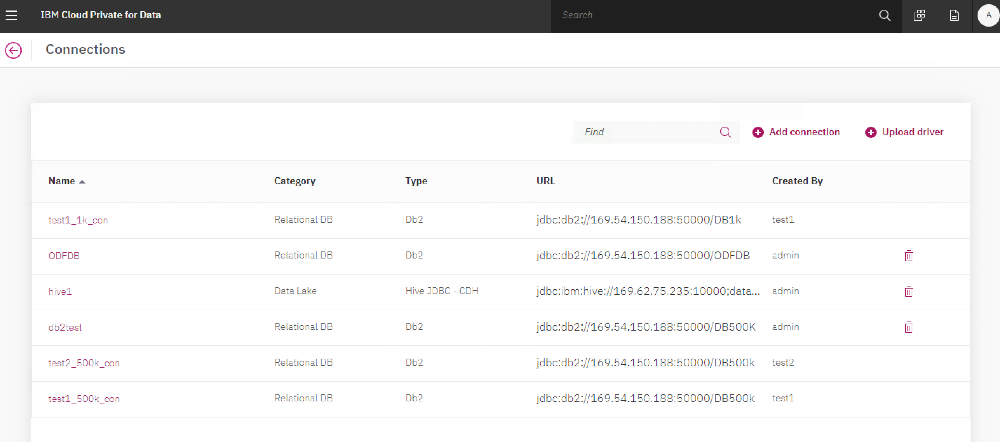

## 数据分析洞察服务以及分析结果的分布

数据连接添加成功后，使用数据分析洞察服务对选择的数据进行全面的分析，同时对分析后的结果进行发布，本节讲详细展示如何做 Auto Discovery 以及如何到 IGC 查看结果。

在 ICPD 主页面，点击 Discover assets 菜单如下：

图 3\. 点击 Discover assets 的菜单

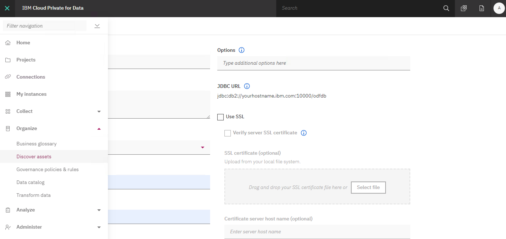

连上新建好的数据源连接（可以是一个或多个 schema 或数据表），选择目标数据源。

图 4\. 建立好数据源连接后，可选的数据源

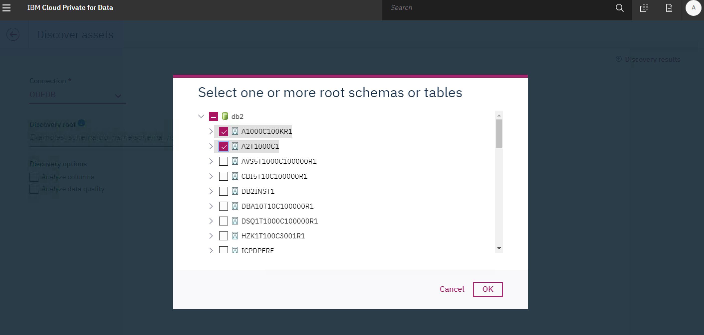

### 选择需要自动分析的选项

在做数据自动发现时，可选的类型有如下几种：

**列分析（ Analy z e columns ）** ： 对数据集运行列分析，以识别数据类，数据类型和格式等属性。

**匹配企业术语：** 根据数据分类，数据相似性和其他等因素为导入的数据资产分配企业术语。

**数据质量分析** ：对数据集进行质量分析，以扫描数据质量的常见维度，如缺失值或数据类违规等。此外数据质量分析还支持 Sampling(抽样)，这样用户无需全部分析，可以通过采集样本只分析部分数据，以快速得到结果，抽样的方式有下列几种方式：

- 顺序（前 n 行）

    该示例包含您指定的前 n 个记录。例如，如果您有 1,000,000 条记录，并且指定的样本大小为 2,000，则样本包含前 2,000 条记录。

- Nth（每隔第 n 行使用）

    样本将读取您指定的每个第 n 个间隔，直到达到样本大小中的记录数。例如，如果您有 1,000,000 条记录并指定样本大小为 2,000 且间隔为 10，则读取最多 20,000 条记录（2,000 \* 10），并选择每 10 条记录以检索 2,000 的样本大小。

- 随机（随机选择行）

    样本随机选择样本大小的记录。用于随机选择记录的公式为（100 / sample\_percent） _sample\_size_ 2。公式中使用数字 2 以确保读取足够的记录以生成有效的随机样本大小。例如，如果您有 1,000,000 条记录，并且指定的样本大小为 2,000 且百分比为 5，则该样本返回 2,000 条记录，最多读取 80,000 条记录（（100/5） _2,000_ 2 = 80,000）。


点击 Discover 按钮对所选数据进行数据自动剖析。

### 从总体概况到更细的粒度（到每一列）层层递进查看数据自动发现的结果

#### 查看发现结果的概况

Discover 根据源数据量大小，完成所需要的时间不等，在 ICPD 页面点击 Discovery result 查看分析的状态。如图 5，会获得每一次数据自动发现的结果。比如：每一次自动发现结果的 ID、源数据、源数据的细节（schema 个数，表的个数等）、数据源连的名字，用户名（即谁做的此次数据分析）、分析的开始时间、分析的状态：Finished(已完成)、Running（运行中）、Cancelled(已取消)、Error（错误）。当需要重新做分析的时候，可点开 Actions 下的图标，点击 Discovery Again 按钮做再次分析，值得注意的是再次分析并不会利用上次分析的任何数据，是一次全新的分析。

图 5\. 所有数据自动发现的结果集

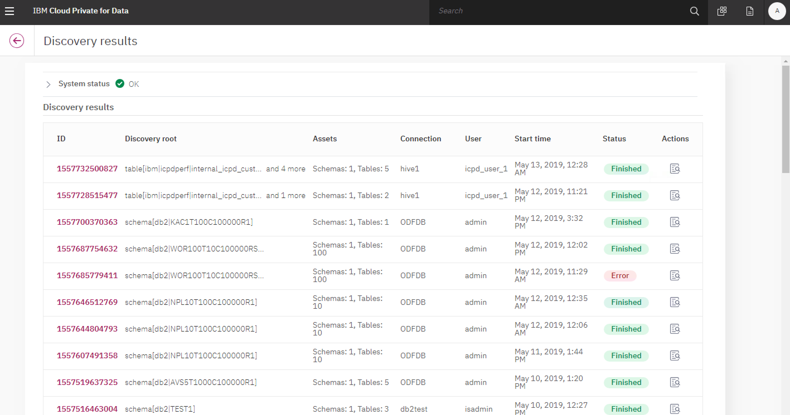

#### 查看每一次的自动发现结果

点开 ID 链接，得到这次自动发现对应的概况。包括分析的状态，基本信息：如数据发现起始时间、发起数据发现的用户名称和自动发现包含的资产数目；自动发现的各种项目：源数据连接名称、自动发现用到的各种选项（列分析，企业术语匹配，质量分析等）；自动发现完成后的订单资产信息：重点项包括、源数据资产名、源数据资产类型、自动发现各个阶段的状态、起始时间、完成率、取消率、失败率。

图 6\. 每一次数据自动发现的结果总示

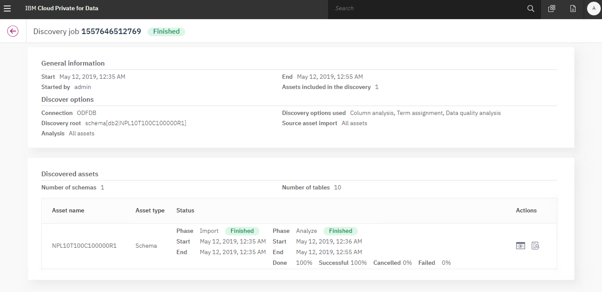

点开 Review discovery result 图标（有眼睛标识的图标）查看分析结果，粒度到数据表级别。可得到每个表的数据质量分数。

图 7\. 粒度到表的数据自动发现的结果示例


选中某个表，查看该数据表的发现细节：

如图 7，可以看到该表中每一列的发现结果： 该列的数据质量分数、数据类情况、资产术语匹配情况、最后一次更新的时间。Action 下的图标，类似矩形的图标名称为 Manage Terms，允许用户手动匹配企业术语，把某个术语加到对应的表或列上。箭头向上的图标名称 Publish this dataset to catalog, 即把资产发布到 IGC。

图 8\. 粒度到列的数据自动发现的结果示例


### AutoDiscovery 完成后，把结果发布到 IGC, 下面将展示如何从 IGC 查看结果

打开 IGC 页面，可以获得所有发布到 IGC 里的资产，比如业务术语数目、数据库、数据表、多少列等等。

图 9\. 发布到 IGC 的资产总况

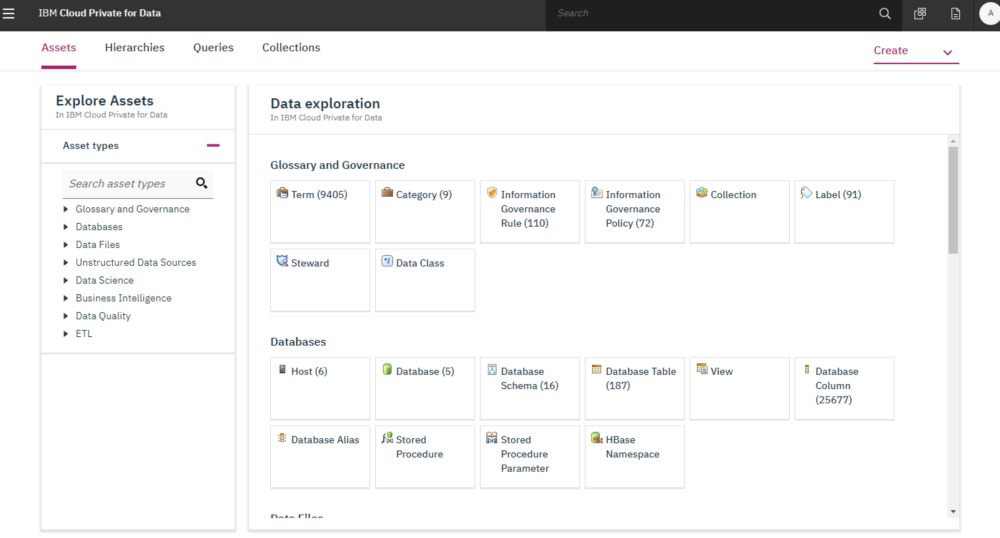

查看某一类资产类型，可在左侧 Filter Results 中个性化选择，因为上文我们主要 Db2 做了自动发现，这里我们以表为例。点击 DatabaseDatabase > Table，将看到发布到 IGC 里的所有数据表，如图 10 所示。

图 10\. IGC 里所有数据库表的概况

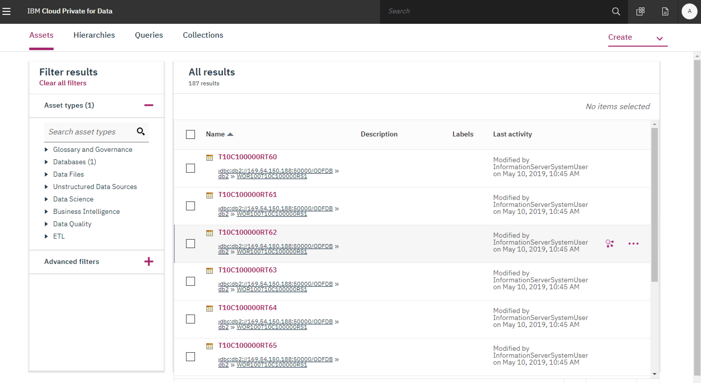

查看数据列，选中、点击任意一列查看详情。点击 Quality Analysis，可得质量分析分数，行数、重复主键数、外键冲突数等信息。

图 11\. IGC 里查看某个表的质量分析详情(Quality Analysis)

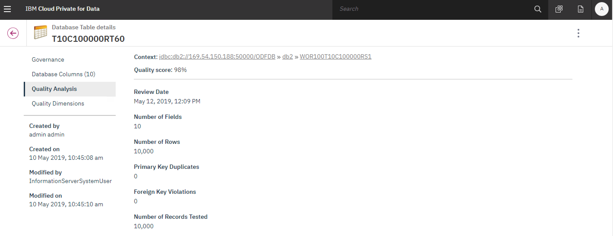

点击 Quality Dimensions, 可得数据类比如违规数、数据类型违规数、数据重复数、数据格式违规数等等信息。

图 12\. IGC 里查看某个表的质量分析详情(Quality Dimension)

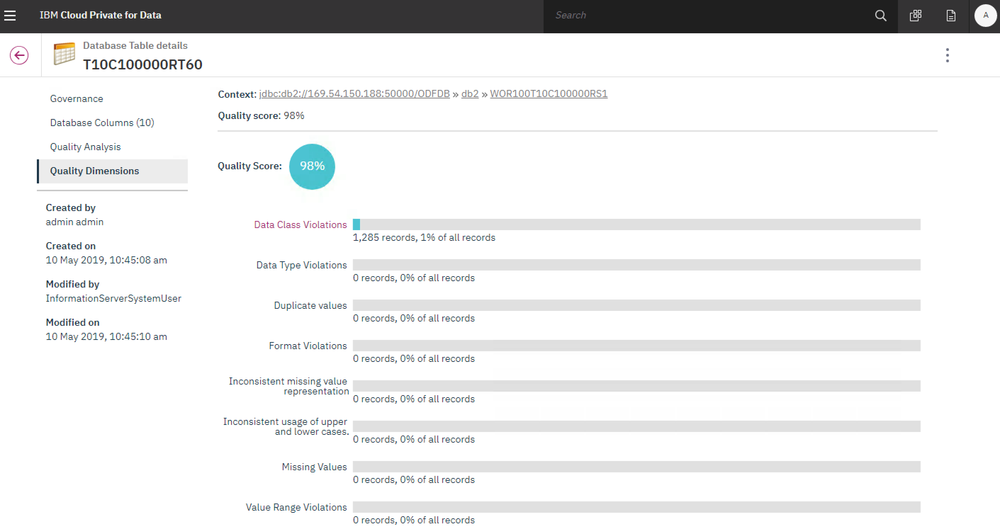

## 介绍关键组件的调优，以及它们对客户数据分析性能的影响

包括分析库日志调节，事务超时设置，数据分析中的 Sampling 调节，任务并发个数，系统参数调优，以及工作任务资源调度等。数据的自动发现和元数据的自动剖析发布等是 ICPD 的主要功能之一，本节将对此功能过程中的性能调优，性能扩展，系统参数设置等做详细的讲述。对于大型数据量的数据的自动发现和元数据的自动剖析，一般情况下会花费很长时间。因此针对于系统参数，系统的性能扩展等调优设置就很有必要。首先第一点：针对于数据的自动发现和元数据的自动剖析并发数调节。在默认情况下，自动数据剖析（以下简称 Auto Discovery）最多一次并行处理分析 10 个数据资产。最多一次并行运行 20 个 DataStage 的作业来做列分析 column analysis (CA)和数据质量分析 data quality analysis (DQA)。此参数用于设置启动 DataStage 的作业并发服务处理个数，默认情况下是 20。具体设置调优步骤如下：

### 修改最大运行的作业数量

按照 [DataStage Workload Manager system policies](https://www.ibm.com/support/knowledgecenter/en/SSZJPZ_11.7.0/com.ibm.swg.im.iis.ds.monitor.doc/topics/opcsystempolicies.html) 文档，具体界面参考如下：

图 13\. 修改最大运行的作业数量界面

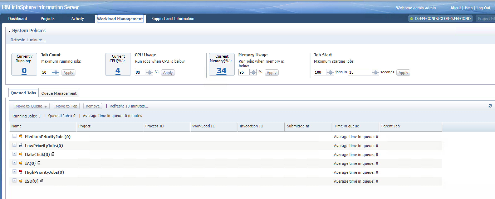

#### 设置最大运行的 DataStage 作业数量：

1. 在 IPCD 的主节点上运行如下命令，进入 DataStage 服务器节点：


    ```
    [root@icp4d-perf-01 scripts]# kubectl exec -it is-en-conductor-0 bash -n zen

    ```


    Show moreShow more icon

    图 14\. 执行进入 DataStage 服务器节点的命令图示

    

2. 在 DataStage 服务器节点上修改 /opt/IBM/InformationServer/ASBNode/conf/odf.properties配置文件，添加一行：

    com.ibm.iis.odf.datastage.max.concurrent.requests=40这个设置将修改最多可以运行 40 个 DataStage 作业。

    图 15\. odf.properties 配置文件图示

    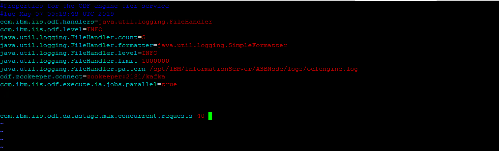

3. 在 DataStage 服务器节点上重启 ODFEngine：


    ```
    [root@is-en-conductor-0 logs]#<
    service ODFEngine stop
    service ODFEngine start

    ```


    Show moreShow more icon


### DataStage 计算节点的扩展

在 ICPD 环境中，默认情况下配置有一个 DataStage 服务器节点和一个 DataStage 计算节点。如果针对于大数据量的 asset discovery，那么需要扩展 DataStage 计算节点来提高系统的整体性能。具体配置方法如下：

1. 在 ICPD 主页面，点击 Transform Data 菜单如下：

    图 16\. ICPD 主页面中 Transform Data 菜单
    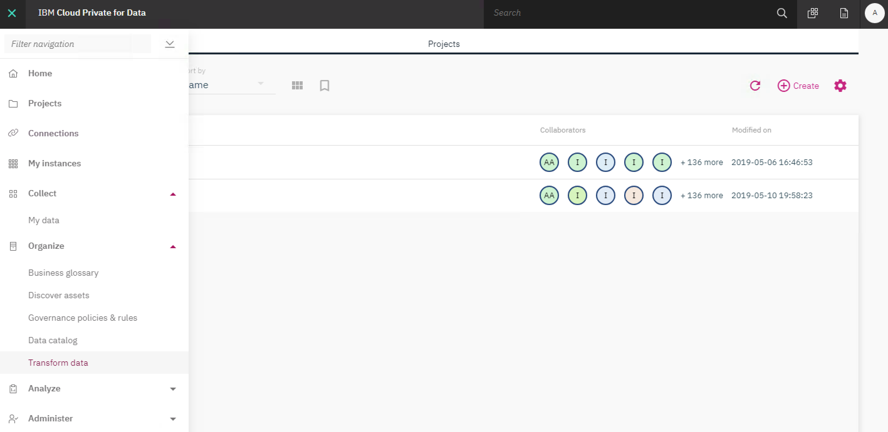

2. 然后点击配置按钮，选择 Adjust Compute Nodes 功能菜单如下：

    图 17\. Adjust Compute Nodes 功能菜单

    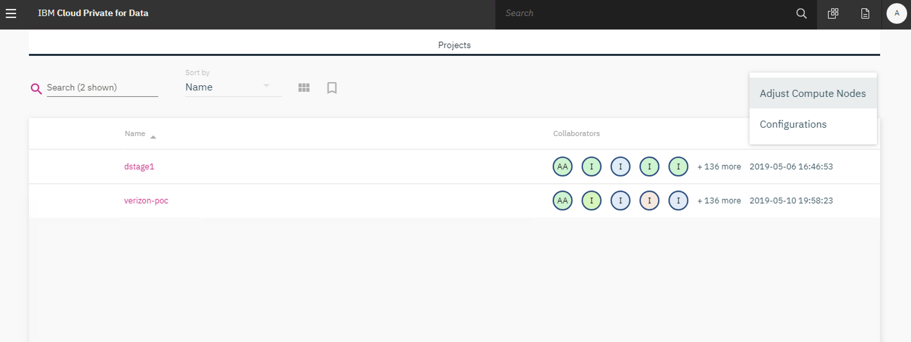

3. 此项设置具体功能是对于一个 DataStage 作业，可以把这个作业扩展运行到多个 DataStage 计算节点上。例如如果设置 DataStage 计算节点个数为 3，那么在 ICPD 环境中将会有一个 DataStage 主节点，和三个 DataStage 计算节点可用。

    详细介绍和配置如图 18 所示：

    图 18\. Adjust Compute Nodes 功能详细菜单

    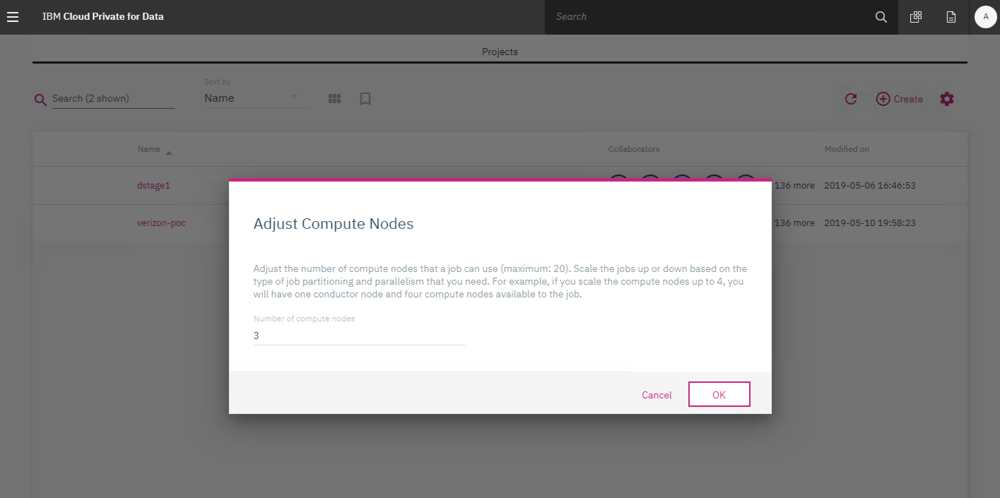

4. 配置完成后等待几分钟后，到 ICPD 环境中验证当前扩展出来的 DataStage 计算节点： 命令如下： `kubectl get pods -n zen|grep compute`

    图 19\. 验证扩展的 DataStage 计算节点命令图示

    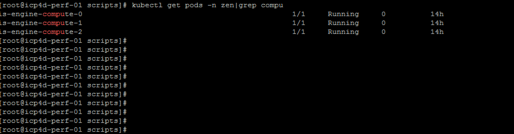

5. 当所有计算节点都显示为正在运行后，就可以设置 DataStage 作业配置文件，设置它们可运行的节点，点击配置按钮，然后选择 Configuration 菜单，例子如下：

    图 20\. DataStage 作业配置图示

    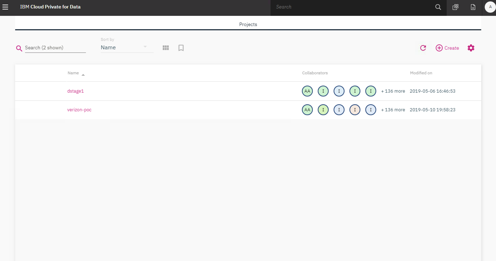

    设置 DataStage 作业配置文件如下:


    ```
              {
        node "node1"
        {
            fastname "is-en-conductor-0.en-cond"
            pools ""
            resource disk "/opt/IBM/InformationServer/Server/Datasets" {pools ""}
            resource scraatchdisk "/opt/IBM/InformationServer/Server/Scratch" {pools ""}
        }
        node "node2"
        {
            fastname "is-en-conductor-0.en-cond"
            pools ""
            resource disk "/opt/IBM/InformationServer/Server/Datasets" {pools ""}
            resource scratchdisk "/opt/IBM/InformationServer/Server/Scratch" {pools ""}
        }
    }

    ```


    Show moreShow more icon

6. 所有上述步骤配置完成后，就可以运行 DataStage 作业了，可以通过作业的日志验证其所在的 DataStage 计算节点。


## 数据治理分析过程中的常见的超时，错误等情况的处理

上述章节是对 ICPD 数据剖析的性能扩展配置介绍。在大多数情况下，除了通过上述扩展方法，还需要对其它的参数进行设置来提高性能或解决实际中的问题。本章节将详细介绍一些常见的参数调节方法：

1. 对于一些特大数据表列数的情况，例如一个表有超过一千个列，必须要设置 APT\_DEFAULT\_TRANSPORT\_BLOCK\_SIZE 如下的参数，才能使得数据的 discovery 成功运行。具体设置方法如下： 在 ICPD 环境中进入 DataStage 服务器节点：


    ```
    [root@icp4d-perf-01 scripts]# kubectl exec -it is-en-conductor-0 bash -n zen

    ```


    Show moreShow more icon

    图 21\. 在 ICPD 环境中进入 DataStage 服务器节点图示

    

    然后运行下面的命令：


    ```
    ". /opt/IBM/InformationServer/Server/DSEngine/dsenv;
    /opt/IBM/InformationServer/Server/DSEngine/bin/dsadmin -envset APT_DEFAULT_TRANSPORT_BLOCK_SIZE -value 3073896 ANALYZERPROJECT"

    ```


    Show moreShow more icon

2. 对于一些数据库中列的长度过大的情况下，需要调节下面的 com.ibm.iis.ia.jdbc.columns.length 参数，否则会碰到如下错误：

    “Fatal Error: The connector detected character data truncation for the link column post\_mvvar2. The length of the value is 419 and the length of the column is 255. “

    解决方法如下：

    在 ICPD 环境中进入 Information Server 的服务器节点：


    ```
    [root@icp4d-perf-01 scripts]#
    kubectl exec -it `kubectl get pod --all-namespaces  | grep -i "iis-services" | awk -F' ' '{print $2}'` -n zen bash

    ```


    Show moreShow more icon

    图 22\. 在 ICPD 环境中进入 Information Server 的服务器节点图示

    

    然后运行下面的命令：


    ```
    "/opt/IBM/InformationServer/ASBServer/bin/iisAdmin.sh -set -k com.ibm.iis.ia.jdbc.columns.length -value 8000

    ```


    Show moreShow more icon

    图 23\. 在 ICPD 环境中调节参数图例

    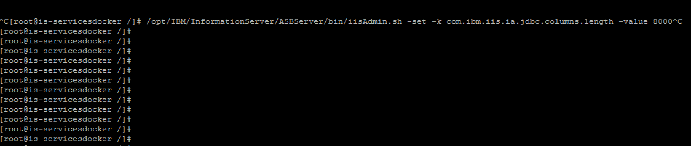

    验证设置后的这个属性值是否正确：


    ```
    "/opt/IBM/InformationServer/ASBServer/bin/iisAdmin.sh -d -k com.ibm.iis.ia.jdbc.columns.length

    ```


    Show moreShow more icon

    图 24\. 在 ICPD 环境中验证参数是否修改正确图例

    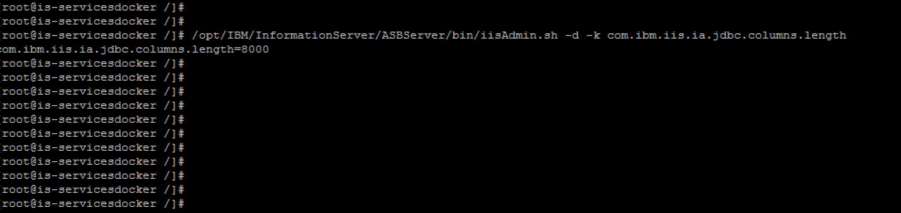

    然后重新运行数据的 discovery，到 DataStage 服务器节点检查验证是否还有上述错误信息：


    ```
    [root@is-en-conductor-0 logs]# tail -f odfenginelog.out
    [root@is-en-conductor-0 logs]# pwd
    /opt/IBM/InformationServer/ASBNode/logs

    ```


    Show moreShow more icon

    图 25\. 到 DataStage 服务器节点检查验证错误信息图例

    

3. 对于 discovery 过程中数据库表数量特别多的情况，例如表的数量在上万张表以上时，需要设置 com.ibm.iis.ia.server.useSingleFDTable 参数来避免分析过程中 IADB 表对象过多，表空间不足的错误。具体方法如下： 在 ICPD 环境中进入 Information Server 的服务器节点：


    ```
    [root@icp4d-perf-01 scripts]#
    kubectl exec -it `kubectl get pod --all-namespaces  | grep -i "iis-services" | awk -F' ' '{print $2}'` -n zen bash

    ```


    Show moreShow more icon

    然后运行下面的命令：


    ```
    /opt/IBM/InformationServer/ASBServer/bin/iisAdmin.sh -s -k com.ibm.iis.ia.server.useSingleFDTable -value true

    ```


    Show moreShow more icon

4. 针对于表中数据量很大时，需要增大设置 DataStage 作业的 heap size（com.ibm.iis.ia.engine.javaStage.heapSize）来避免 OutOfMemory （OOM）的错误，同时需要调节 com.ibm.iis.ia.server.jobs.postprocessing.timeout 参数来避免分析超时的错误，具体方法如下:

    在 ICPD 环境中进入 Information Server 的服务器节点：

    [root@icp4d-perf-01 scripts]#

    kubectl exec -it `kubectl get pod --all-namespaces | grep -i "iis-services" | awk -F' ' '{print $2}'` -n zen bash

    然后运行下面两条命令：

    /opt/IBM/InformationServer/ASBServer/bin/iisAdmin.sh -set -key com.ibm.iis.ia.engine.javaStage.heapSize -value 4096

    /opt/IBM/InformationServer/ASBServer/bin/iisAdmin.sh -set -key com.ibm.iis.ia.server.jobs.postprocessing.timeout -value 3000

    然后用下面的命令来验证设置是否正确：

    /opt/IBM/InformationServer/ASBServer/bin/iisAdmin.sh -d -key com.ibm.iis.ia.server.jobs.postprocessing.timeout


## 结束语

本文详细讲解 ICPD 平台上数据治理的典型案例，以及在数据治理过程中的性能调优和实践经验，以此来帮助客户更加容易和顺畅的使用 IBM 私有云平台和数据治理产品。