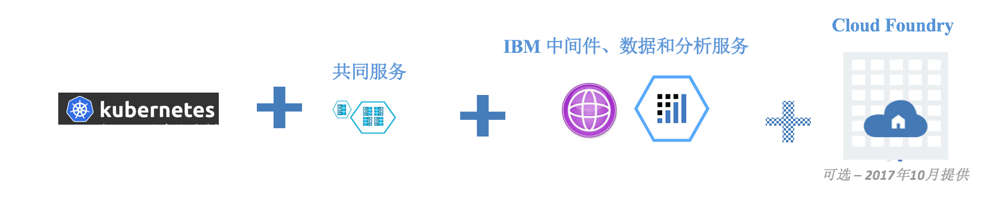
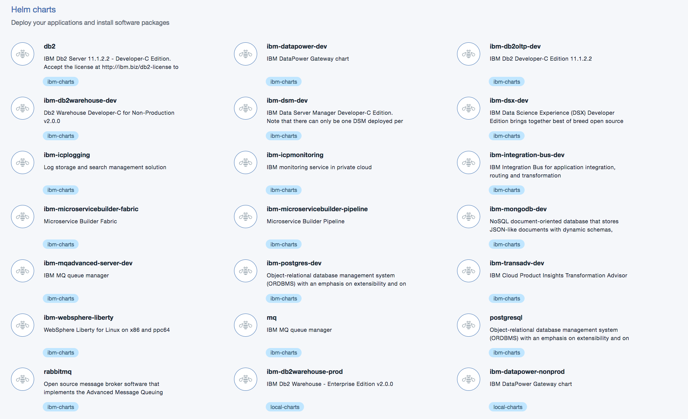
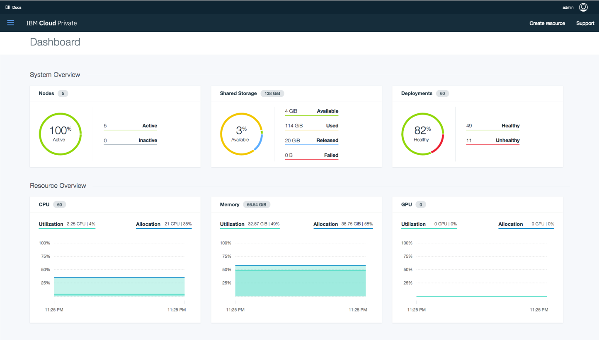

# IBM Cloud Private 企业私有云方案概述
基于 Kubernetes 及容器的企业私有云

**标签:** 云计算

[原文链接](https://developer.ibm.com/zh/articles/cl-ibm-icp1-kubernetes/)

陈谷

更新: 2018-02-07 \| 发布: 2017-09-06

* * *

最新上市的 IBM Cloud Private 是 IBM 新一代的企业私有云方案，基于市场主流的 Kubernetes 及容器技术搭建。可以部署在 VMWare 及 OpenStack 等 IaaS 架构上，并且支持 x86, POWERLinux 及 zLinux 架构。上层可以部署各种 IBM，第三方及社区的镜像及模版应用。在设计上提供了最大的灵活性及可靠性。 该方案为企业利用云计算，实现技术创新，提出了先进和可行的建议，下面会从五个方面给广大读者做个介绍。

1. 私有云技术趋势
2. 容器优先与技术热点
3. IBM Cloud Private 的定位与能力
4. IBM Cloud Private 的技术选择
5. IBM Cloud Private 起步

## 私有云技术趋势

云计算概念问世已有十几年的时间，IBM 从 2007 年开始就致力于云计算的研发与推广，从私有云、公有云到混合云，经历了云的了解和探索、实践与创新以及广泛部署和应用的过程。

私有云是很多企业最早采用的云计算技术，因为私有云能够带来虚拟化、自动化、快速开发运维一体化、资源动态扩展等云的好处，同时通过私有网络，也能保证企业数据的安全性和合规要求。

私有云主要分为 IaaS 和 PaaS 两层，即基础架构服务和平台服务，IaaS 市场主要有 VMWare, OpenStack, 以及开源虚拟化底层技术 XEN、KVM 等构建的商业化产品，PaaS 主要有 Cloud Foundry 和容器两大类。很多企业说它们已经完成了私有云的搭建，是指它们完成了基础架构的虚拟化、能够提供虚拟机的快速供给，使用了 VMWare 或搭建了 OpenStack， 但要真正提供应用的自动化部署和扩展，还需要 PaaS 的支持。企业 IT 的主要目的是提供对业务的支持，通过软件应用支撑业务的数字化，所以应用的快速部署、运营监控和生命周期管理，才是私有云的发展方向，提供虚拟机和基础架构只是私有云的首要步骤。

## 容器优先与技术热点

近几年，容器的技术发展非常快，也很快形成了较成熟的生态圈。容器具有很多特点，比如部署简单、启动快速、动态扩展、易于迁移等等。应用程序作成一个镜像（Image）文件，就能部署在物理机和虚拟机的容器中，启动是用秒做单位的，十多秒甚至几秒钟就能启动一个应用，之所以容器的启动比虚拟机快很多，是因为虚拟机的操作系统的启动会费很多时间。

容器的易于部署和快速启动的特点，使容器的使用很快推广开来。有些企业的容器数量很快上万，甚至达到几十万个。那么多容器，生命周期管理、编排、调度和监控成为难题，于是出现了多个相关的开源项目，解决集群管理的问题。下表列出了常见的开源软件项目：

**功能****项目名称**调度Docker Swarm, Mesos, Kubernetes监控Prometheous存储Flocker网络Calico, Weave, Flannel编排Docker compose，Kubernetes helm

在这些开源项目中，Kubernetes 是发展最快的一个。据最新的 OpenStack 用户对应用平台选择的调查，2016 年的调查与 2015 年相比较，Kubernetes 占有率提高了30%（从21%到27%），而 Cloud Foundry 下降了30%（从23%到16%），Mesos 下降了25%（从16%到11%），Docker Swarm 则下降了80%，从16%跌到2%，使得 Kubernetes 成为 OpenStack 上，容器管理的领先平台。另外， Kubernetes 通过 CNCF（Cloud Native Computing Foundation）国际组织，建立了一个非常强大的生态体系，使得 Kubernetes 成为 PaaS 的最主要平台。

## IBM Cloud Private 的定位与能力

IBM 于 2017 年 6 月 27 日 正式发布了 IBM Cloud 私有云（IBM Cloud Private）。IBM Cloud Private 提供了一个包括 IaaS、PaaS、和开发服务的集成和私有的云平台。主要面对企业客户，企业可以利用 IBM Cloud 私有云- IBM Cloud Private 创建、运行和管理云应用，快速实现动态 IT 对业务增长和转型的支撑。例如，在私有云中开发原生云应用程序，并在私有云生产环境中运行；在私有云中安全地集成和使用企业原有或外部的数据和服务，最终重构IT环境，使传统企业应用程序实现现代化。

IBM Cloud 私有云是一个集成平台，在 IaaS 和 PaaS 层提供了基于开源技术的综合运营管理和开发运维一体化（DevOps）能力，同时提供一系列服务，如微服务生成器（Micro Service Builder）服务、数据和分析服务、通讯服务、缓存服务等，满足开发者利用快速迭代和创新方法实现企业的业务需求。IBM Cloud Private 这个私有云平台也是 IBM Cloud 组合系列的一部分，它提供了跨越 IBM 公有云、私有云和专属云模型的一致性选择。

IBM Cloud 私有云提供了以下能力：

- 为企业提供一个集成的、客户自己控制的、能安全运行 IT 工作负载的私有云平台。
- 基于 Docker 容器和 Kubernetes 技术，支持集中运维管理和开发服务，做到开发运维一体化（DevOps）。
- 基于 12 因素应用原则和技术设计架构，如微服务架构，设计成为原生云应用的创建平台。
- 提供应用分析的能力，并为企业 IT 现代化提供规划性指导，推动传统企业应用向模块化云时代的转型，实现高可用、高优化，满足企业的多种需要。
- 包含了流行的开源工具、IBM 应用中间件及开发服务，是一个完整的云环境。能够帮助开发者和运维管理人员释放创新能力，满足企业的业务需求。

## IBM Cloud Private 的技术选择

IBM 在私有云的技术选择上采取了开放的原则，支持主流的 IaaS 和 PaaS 平台，在基础架构 IaaS 层面，IBM Cloud 私有云可以安装在 Open Stack 或 VMWare 上， 也可安装在 Intel 或运行 POWERLinux，zLinux 的物理机上；在平台服务 PaaS 层面，IBM Cloud 私有云支持 Kubernetes， 并将在十月份支持 Cloud Foundry。

##### 图 1\. IBM Cloud Private 的主要组件

图 1 中列出了 IBM Cloud Private 的主要四个组件：

- 基于 Kubernetes 的容器平台：业界领先的，跨越私有云、专属云和公有云的容器编排平台
- 共同服务：简化操作管理、开发运维一体化（DevOps）和混合集成
- IBM 中间件、数据和分析服务： 提供支持云计算的中间件、应用程序运行环境、通讯、数据库和数据分析服务，来优化现有的投资，实现快速创新
- Cloud Foundry：用于指定的应用程序的开发和部署（可选）

IBM Cloud Private 支持灵活的基础架构和平台服务，这种对主流的 IaaS 和 PaaS 的支持，使得 IBM Cloud Private 能够更灵活地支持企业的私有云战略，结合企业的实际 IT 环境，提供云中应用中心 (App Center)， 完成在私有云中对应用程序的云化管理。IBM Cloud Private 的运维管理可由客户自己完成，也可通过 IBM 的专业服务团队进行管理，这也给企业带来了灵活性。IBM Cloud Private 的技术选择为企业在移动互联时代，应对业务需求的快速变化，实现 IT 更高层次的应用云化管理提供了保障。

## IBM Cloud Private 起步

IBM Cloud Private 的安装比较简单，如果安装社区版本，可以将管理节点和工作节点全部安装在一个虚拟机中，安装也仅需十多分钟就可完成。当然作为一个企业私有云，硬件资源是有一定要求的，建议5台机器：CPU超过4核、内存多于8GB、100GB磁盘。让我们首先来看一下 IBM Cloud Private 的界面：

##### 图2\. IBM Cloud Private 的主要界面

左边显示了 IBM Cloud Private 所管理的项目，主要包括仪表盘、工作负载、基础架构资源、应用中心和系统。右边是每个管理项目的具体内容。

IBM Cloud Private 是一个应用型平台 PaaS 云，意味着要能够提供应用服务，并允许客户自己定义常用的应用服务，这是通过应用中心(App Center) 中的容器镜像实现的。IBM Cloud Private中开箱即用的服务包含了微服务生成器 (Micro Service Builder)， 它能够为企业快速搭建微服务的应用，为企业进行微服务转型提供了基础平台。开箱即用的服务还包含了WebSphere Liberty、MQ 高级开发版、DB2 开发版，以及开源服务 Redis、Tomcat、Jerkins、Nginx 等，利用这些服务，可以支撑企业的传统应用，并构建新应用，使企业的IT真正转型到云中，从而获得云计算的快速部署，动态扩展，易于迁移的优势，能更好的满足业务部门对 IT 的需求。

综上所述，IBM Cloud Private 是企业私有云的最佳选择。请查看相关资源获取更多资料。