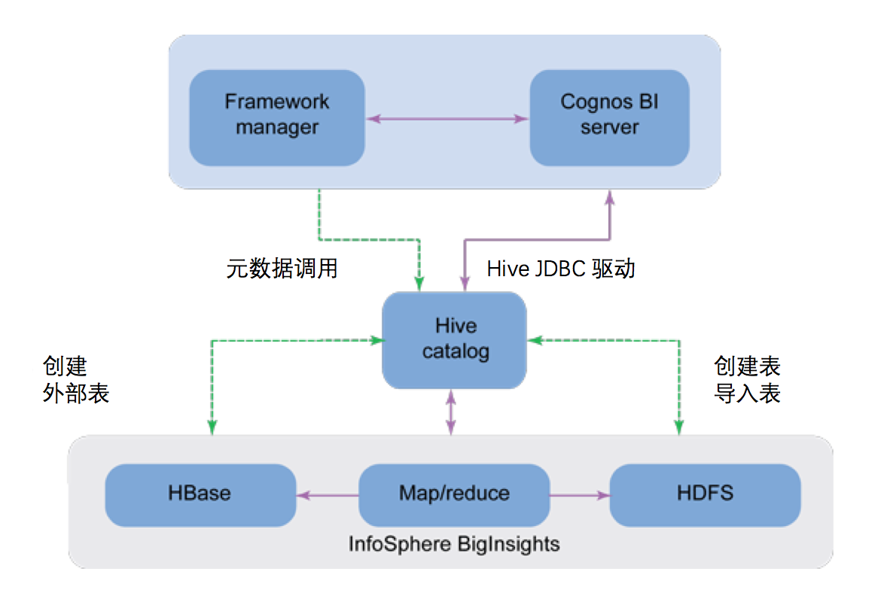
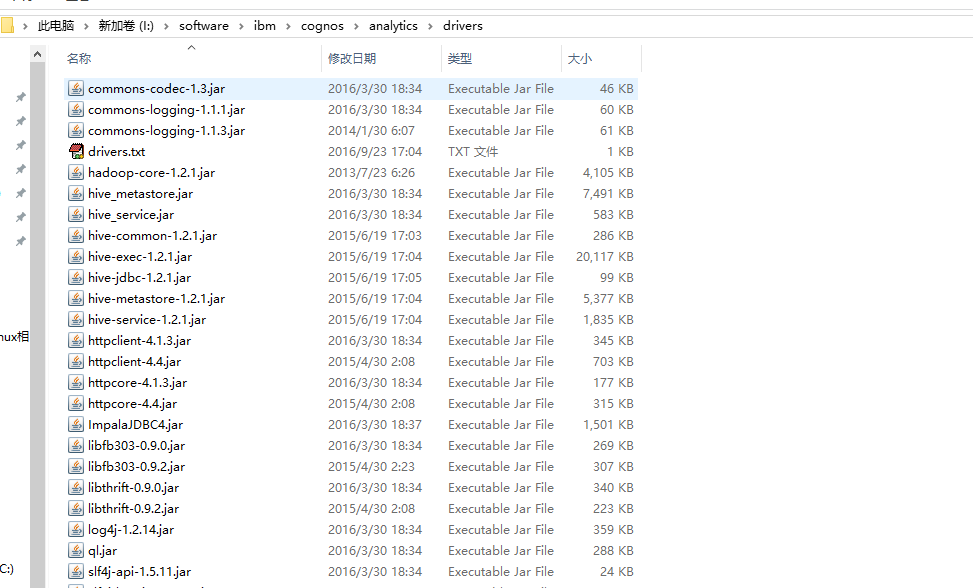
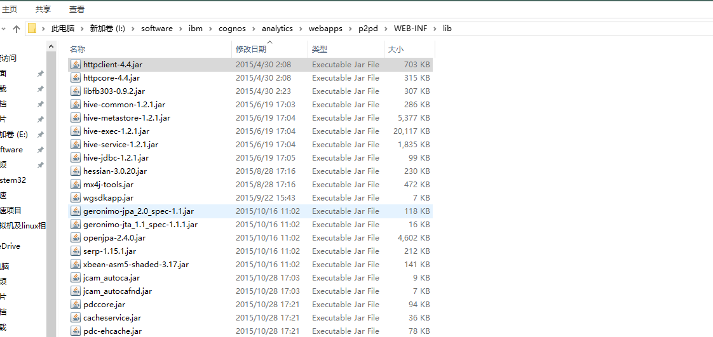
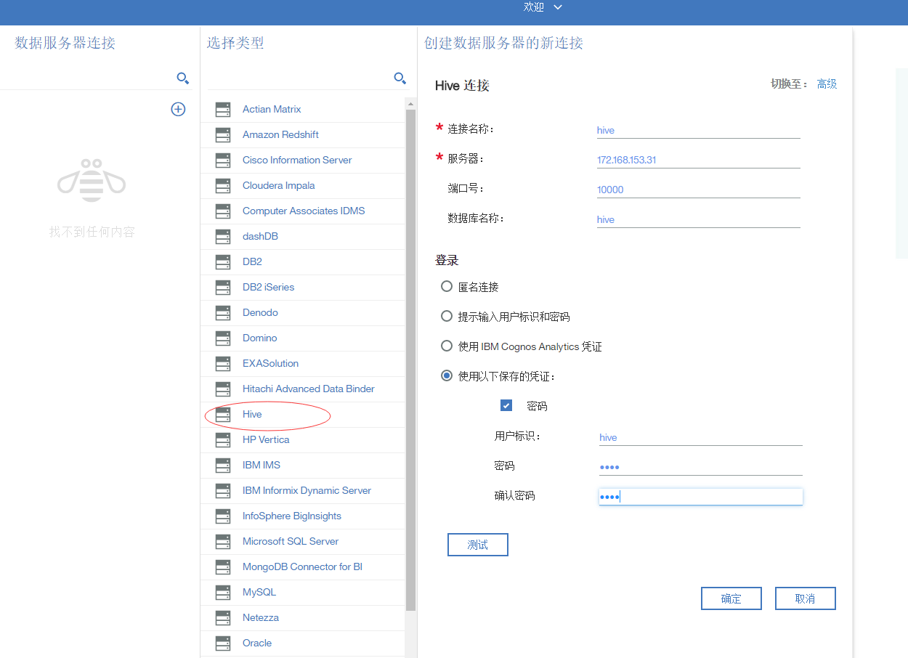
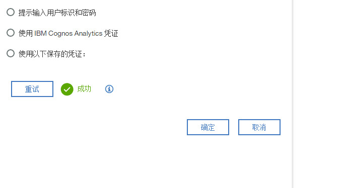

# IBM Cognos 11 连接 Hadoop 的最佳实践
IBM Cognos 11 与 Hadoop 集成

**标签:** Apache Hadoop,分析

[原文链接](https://developer.ibm.com/zh/articles/ba-cn-cognos11-hadoop/)

廖显

发布: 2017-10-17

* * *

大数据标志着业务分析的新时代到来，各商业组织现在有机会就数据在容量、速度和多样性的传统处理能力不足问题上作出更加明智的决策。IBM 具有得天独厚的优势, 可以提供全面的技术和服务, 从大数据中吸取可操作的洞察力，通过与如 IBM InfoSphere BigInsights 为代表的 Hadoop 技术互链, IBM Cognos 商业智能现在可以轻松访问非结构化源数据, 从而使业务分析人员能够接触到大量非结构化数据中发现的关键洞察。

Hadoop 是一个分布式系统基础架构，由 Apache 基金会开发。用户可以在不了解分布式底层细节的情况下，开发分布式程序。充分利用集群的威力高速运算和存储。是一个可以更容易开发和运行处理大规模数据的软件平台。Hadoop 实现了一个分布式文件系统（Hadoop Distributed File System），简称 HDFS。HDFS 有着高容错性（fault-tolerent）的特点，并且设计用来部署在低廉的（low-cost）硬件上。而且它提供高传输率（high throughput）来访问应用程序的数据，适合那些有着超大数据集（large data set）的应用程序。简而言之, Hadoop 是一个用于操作大型数据集的分布式平台。它建立了容错能力, 这使得它吸引了停机时间可能影响业务流程的组织。Cognos 是一种商业智能工具, 它允许用户浏览和报告数据。然而, Hadoop 并没有像其它技术所评论的那样, 自己进行即席查询。这里只有一个 Hadoop 项目可以做到这点——Hive。开发人员已经发布了 ODBC 连接器来访问配置单元数据库 (这仅仅是您的 Hadoop 数据的数据仓库视图, 可以使用称为 Hive QL 的类似 SQL 的语言进行查询)。由于 Cognos 可以从 ODBC 数据库中提取数据, 因此 Cognos 可以通过配置单元从 Hadoop 提取数据。

在最新的 Cognos Analytics 11 环境中使用 Hadoop 的另一种方法是使用文本文件 (如 CSV) 传输数据。Hadoop 可以生成一个数据文件, 然后可以将其导入到 Cognos 中。

然而, 为什么要使用 Hadoop 来连接 Cognos 呢？举个例子，我使用 Hadoop 的两个应用程序是库存预测和现金流量/预算，如果您正在尝试执行对数十万 SKU 的常规预测, 则 Hadoop 是一个非常好的工具。另外，如果您试图执行蒙特卡洛模拟超过 1000 预算项目, Hadoop 也是非常棒的选择。只需从数据仓库导入数据, 运行您的 Hadoop 作业, 然后将生成的 CSV 文件导入 Cognos，一切就完成了。

不过要小心, Hadoop 不是万能药。有时,传统的 SQL 和你的编程语言的选择效果是一样好的，或者更好，因为 Hadoop 带有学习曲线和资源需求。你可以通过下载 Hortonworks 的沙箱学习：它是一个预配置的虚拟机, 在 VMware 中运行。所以你不必安装或配置任何东西。

另外，IBM InfoSphere BigInsights 为 IBM 官方的 Hadoop 产品，本文将用该产品作为 Hadoop 的连接对象，并且，将通过 Cognos 最新的 Hadoop 连接能力说明，来为 Cognos 的大数据使用作指导。

## IBM Cognos 11 新特性

首先，Cognos 升级到 Cognos 11 版本有很多重大的变化，名称也由 Cognos Business Intelligence 变更为 Cognos Analytics，从而更加强调分析能力，比如时下流行的敏捷 BI，大数据可视化，协同等能力。即很好的保持了 Cognos 以往稳健的数据工程学体系，来保证用户对于数据的信任，另一方面也提供了简洁的界面来增强用户的使用体验，并且支持云部署。特别是引入的协同能力能使得组织能够轻松地在成百上千的用户和他们的生态系统中共享知识，并为驱动业务结果的决策和操作提供动力,另外，新的 Cognos Analytics 同时提供企业级 BI+敏捷 BI 能力，包括让业务分析师可以及时的拖动数据来快速的搭建分析视图,下面新的 Cognos Analytics 的详细新功能介绍:

**提供用户端分析**

- 可定制的用户界面，为桌面、平板电脑和智能手机提供一致的体验
- 综合搜索功能，帮助您导航和快速访问已知内容和发现新内容
- 自动选择基于数据类型的最佳默认可视化
- 易于访问参考模板和样式以创建一致的和专业的报告
- 能够通过引导菜单个性化您的分析环境，并更容易地导航内容，包括收藏夹、通知和我的内容
- 共享报告和数据模型，为创建新的、扩展的报告和数据模型提供了基础

**提供分析和内容的创作**

- 更快速的格式和风格的选择，在需要的地方。
- 更快地构建交互式报告和预览内容(演练、排序或筛选)。该解决方案还允许用户在 web 上启动或移动，反之亦然。
- 更容易将数据拖放到一个可以自动显示数据的环境中。

**提供建模能力**

- 使用搜索启用完全基于 Web 和基于意图的建模。
- 支持快速创建新模型或修改现有模型的能力，更改模型属性，并提交给每个人使用，并报告多个模型。
- 提供在相同环境中测试和验证模型的能力。

这些特点让 Cognos 11 的使用体验充满了期待，

## IBM Cognos 11 对 Hadoop 的支持

在 Cognos 11 最新的功能里，也强化了对于 Hadoop 的支持，首先，Hive 是一个驻留在 Hadoop 之上的数据仓库系统，Hive 提供了数据提取，转换和导入（ETL）工具，它可以添加结构到甚至是基于文本的数据源中，并且能够嵌入大量数据分析到 Hadoop 的分布式文件系统 Hadoop Distributed File System（HDFS）中。

Cognos 商业智能系统能生成 Hive QL 去调用查询 BigInsights 文件系统，Cognos 商业智能服务器通过 BigInsights 配置 Hive JDBC 驱动程序连接到 BigInsights。Hive 目录的元数据可以导入进 Cognos Framework Manager，并作为商业智能的元数据建模发布包含 BigInsights 内容包到 Cognos 的商业智能服务器中。这些包可以用于创建 Cognos 报表（包括 Cognos 互动报表），仪表盘，以及 WorkSpaces，同时驱动 BigInsights 的里的 Map/reduce 的能力。

图 1.Cognos 与 Hadoop 的连接架构图



## IBM Cognos 11 成功配置 Hadoop 的最佳实践

首先，Cognos 11 支持的数据源，我们可以在 Cognos 官方的得到，Cognos 最新版本的数据支持可以在产品生命周期支持找到： [https://www.ibm.com/software/reports/compatibility/clarity-reports/report/html/prereqsForProduct?deliverableId=A6C8D9F0FF5611E6A4D1A0107E2821F7#](https://www.ibm.com/software/reports/compatibility/clarity-reports/report/html/prereqsForProduct?deliverableId=A6C8D9F0FF5611E6A4D1A0107E2821F7)!

支持的软件 版本 最小要求 Apache Hive  0.13.0 and future fix packs  0.13.0  0.14.0 and future fix packs  0.14.0  1.1 and future fix packs  1.1  1.2 and future fix packs  1.2  2.1 and future fix packs  2.1

当使用不同版本的驱动 0.12.0，0.14.0，1.2 测试 Apache Hive 1.2 数据库连接的时候，第一次会遇到如下的报错：

#### 清单 1\. 报错

```

XQE‑DS‑0006 Unable to logon to the data source.
com.ibm.cognos.jdbc.adaptor.sqlexception.SQLCognosInvalidLogonException: The connection object was not initialized properly.
Caught error in V5QueryHandler: java.lang.NoClassDefFoundError: org.apache.http.config.Lookup

```

Show moreShow more icon

在进一步在 XQE 日志里分析，我们可以看到：

#### 清单 2\. 日志分析

```

XQE‑GEN‑0002 An unexpected exception occurred.

XQE‑GEN‑0002 An unexpected exception occurred: org.apache.http.config.Lookup

```

Show moreShow more icon

这是由于不正确的驱动导致的连接错误，因此，我们需要从 Hive/Hadoop 去下载驱动，并且 Copy 进 Cognos Analytics 11 安装的驱动目录路径，Cognos 11.0.4 连接 hive 的配置过程，目前只在 hive 1.2.1 版本上测试连接成功。

Hadoop 是个很流行的分布式计算解决方案，Hive 是基于 hadoop 的数据分析工具。一般来说我们对 Hive 的操作都是通过 cli 来进行，也就是 Linux 的控制台，但是，这样做本质上是每个连接都存放一个元数据，各个之间都不相同，这样的模式用来做一些测试比较合适，并不适合做产品的开发和应用。因此，就产生 Hive 的 JDBC 连接的方式。使得我们可以连接 Hive 并进行一些类关系型数据库的 sql 语句查询等操作，首先我们需要将这些驱动拷贝到报表工程下面，然后再建立连接，最后通过连接进行数据查询。

在安装之前，我们需要先进行驱动文件的添加，下面是成功安装需要的文件包:

- commons-logging-1.1.3.jar
- hadoop-core-1.2.1.jar
- hive-exec-1.2.1.jar
- hive-jdbc-1.2.1.jar
- hive-metastore-1.2.1.jar
- hive-service-1.2.1.jar
- httpclient-4.4.jar
- httpcore-4.4.jar
- libfb303-0.9.2.jar
- libthrift-0.9.2.jar
- commons-codec-1.4.jar

然后我们将进行这些文件包的配置步骤详细介绍，我们需要将上面的包放在 %C11\_HOME %\\drivers\ 路径下面，如下图所示：

图 2.驱动的文件目录 drivers



然后找到其子路径 %C11\_HOME%\ webapps\\p2pd\\WEB-INF\\lib 里面，把这些驱动包拷贝进去。

图 3.驱动的文件目录 lib



然后，重启 Cognos Analytics 11 的服务，并且测试连接。

配置 hive 数据源，填入相应的 Hive 连接信息，以及用户登录信息。

图 4.Hive 连接测试界面



测试 Hive 的连接，如果成功会显示连接成功的界面，如下图所示：

图 5.Hive 测试成功界面



在 Hive 0.11.0 版本之前，只有 HiveServer 服务可用，在程序操作 Hive 之前，必须在 Hive 安装的服务器上打开 HiveServer 服务。而 HiveServer 本身存在很多问题（比如：安全性、并发性等）；针对这些问题，Hive0.11.0 版本提供了一个全新的服务：HiveServer2，这个很好的解决 HiveServer 存在的安全性、并发性等问题。

## 结束语

通过 Hadoop 的连接，有许多新的信息来源现在可以在 Cognos 商业智能上进行分析，而这些重要的数据来源以前却因技术限制而被放弃。这使用户可以利用 Cognos 的优势, 在诸如仪表盘, 报表分发,和数据可视化, 和对 BigInsights 的大规模并行处理能力支持。本文中描述的互操作性仅仅是 IBM Cognos 商业智能和 Hadoop 之间的集成的一个未来重要的里程碑。