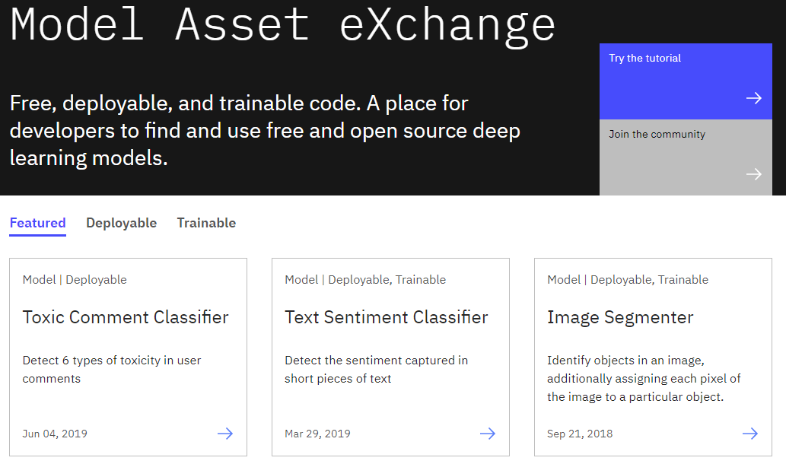
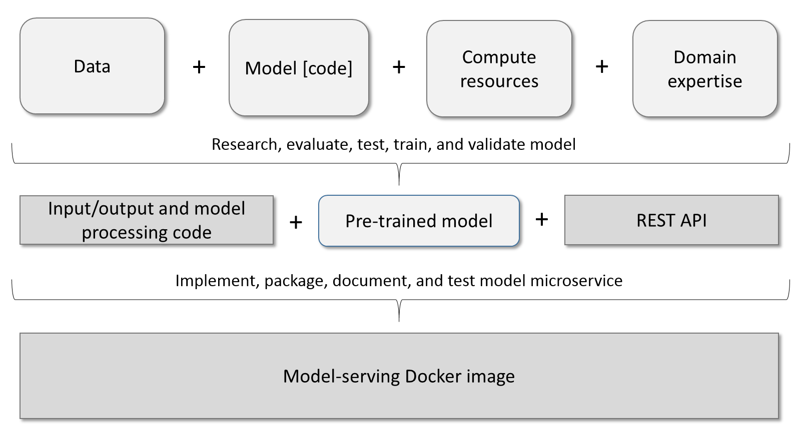
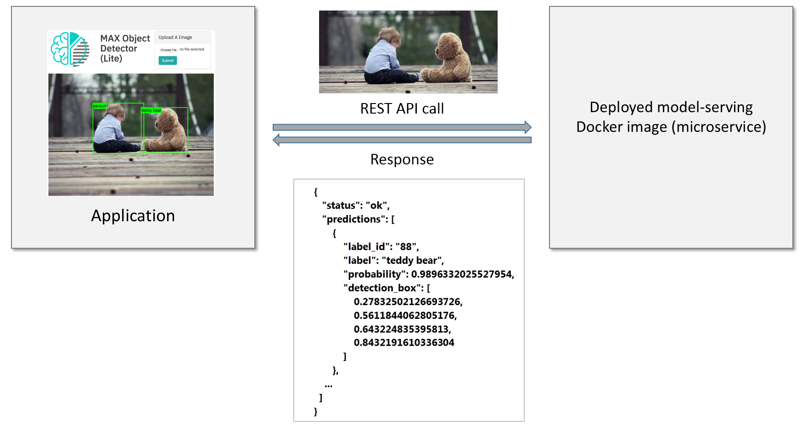
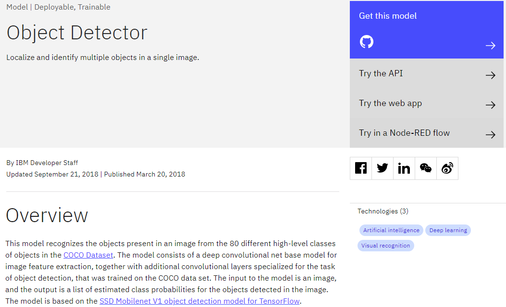
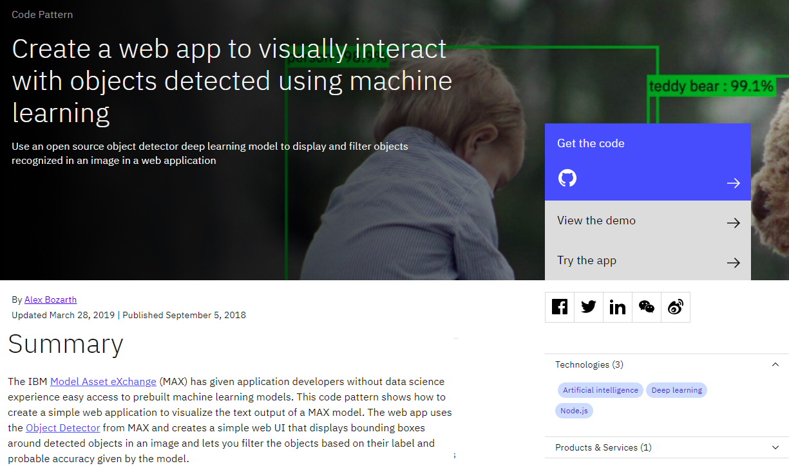

# IBM Developer 上的 Model Asset Exchange 简介
查找适用于常见应用领域的免费、开源且最先进的深度学习模型

**标签:** Docker,IBM Cloud,Kubernetes,MAX - Model Asset eXchange,人工智能,微服务,数据科学,机器学习,深度学习

[原文链接](https://developer.ibm.com/zh/articles/introduction-to-the-model-asset-exchange-on-ibm-developer/)

[Patrick Titzler](https://developer.ibm.com/zh/profiles/ptitzler)

发布: 2019-01-22

* * *

IBM Developer 上的 [Model Asset eXchange](https://developer.ibm.com/zh/exchanges/models/) (简称 MAX) 支持开发者在其中查找和使用适用于常见应用领域（如文本、图像、音频和视频处理）的免费、开源且最先进的深度学习模型。精选列表提供了丰富的可部署（现成）模型和可训练（使用前定制）模型。

## 可部署的深度学习模型

MAX 上的可部署深度学习模型已经过研究、评估、预训练和封装，且已作为 Docker 容器镜像发布到 Docker Hub 上，可随时通过 Kubernetes 部署到本地或云环境中。

每个模型提供的 Docker 镜像都实现了一项微服务，用于公开一个 REST-API，应用程序（或其他服务）通过调用该 API 来使用其中封装的深度学习模型。

在以下示例中，Web 应用程序将调用 Object Detector 微服务并提供图像作为输入。此微服务将处理图像，调用模型，对输出进行后处理，并采用应用程序友好的 JSON 格式向调用者返回结果（“在图像中识别的对象”）。

调用者不需要了解为服务提供支持的深度学习模型、用于实施和运行模型的框架或者原生模型输入或输出，因为微服务会隐藏这些详细信息。

### 浏览可部署模型

在 Model Asset Exchange 中，可以按领域过滤可部署模型（对音频内容进行分类、对视频内容进行分类和识别图像中的实体），深入了解模型（底层研究、训练数据集和许可信息），试验模型（无需安装任何程序），并浏览部署和定制选项。

[Object Detector](https://developer.ibm.com/zh/exchanges/models/all/max-object-detector/) 是一个热门模型。

许多模型都包含说明如何在 [物联网( IOT )](https://developer.ibm.com/zh/tutorials/learn-how-to-leverage-deep-learning-in-your-node-red-flows/) 应用程序、 [无服务器应用程序](https://developer.ibm.com/zh/tutorials/leverage-deep-learning-in-apache-openwhisk-ibm-cloud-functions/) 或 web 应用程序(如此 [Code Pattern](https://developer.ibm.com/cn/patterns/create-a-web-app-to-interact-with-objects-detected-using-machine-learning/))中使用它的示例。

## 可训练的深度学习模型

点击链接学习 [训练模型](https://developer.ibm.com/exchanges/models/all/?fa=date%3ADESC&fb=14524)。

在基于 IBM 云的 Watson Machine Learning 服务的帮助下使用您自己的数据。

要了解 Model Asset Exchange 的更多信息，查看 [Model Asset Exchange 入门教程](https://developer.ibm.com/zh/tutorials/getting-started-with-the-ibm-code-model-asset-exchange/)。其中详细介绍了本地环境中的模型微服务部署过程，并概括了如何通过 Web 应用程序使用此服务。

本文翻译自： [Get an introduction to the Model Asset Exchange on IBM Developer](https://developer.ibm.com/articles/introduction-to-the-model-asset-exchange-on-ibm-developer/)（2019-01-22）