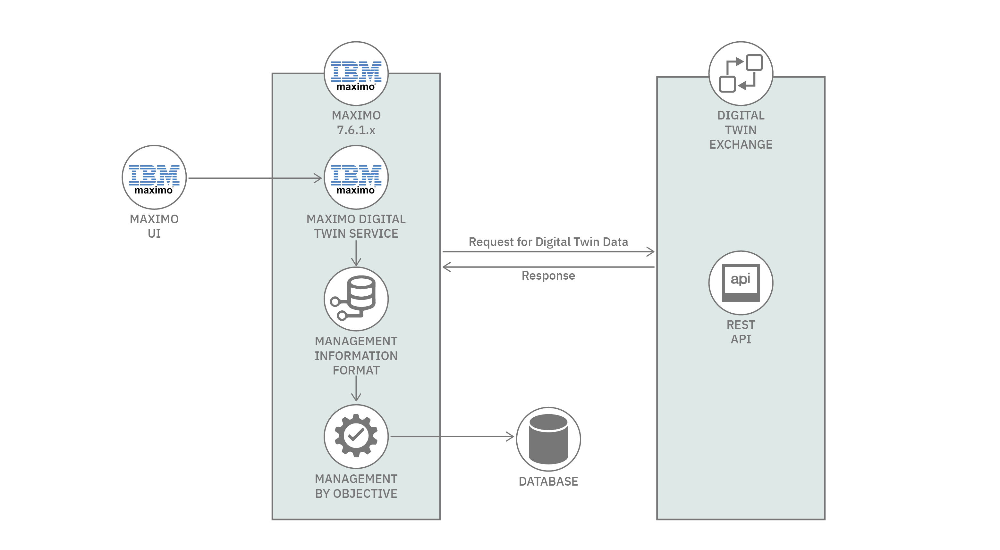
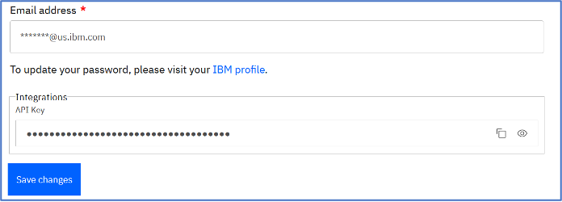
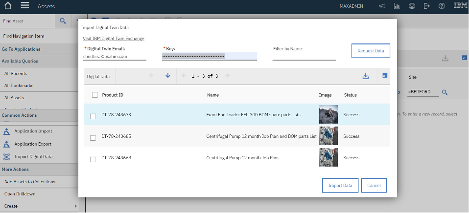

# IBM Maximo 和 IBM Digital Twin Exchange 的集成
以数字孪生的方式共享数字数据

**标签:** IBM Maximo,IoT

[原文链接](https://developer.ibm.com/zh/articles/ibm-maximo-asset-management-integration-ibm-digital-twin-exchange/)

Cathy Wang, Sarika Budhiraja

发布: 2020-12-14

* * *

## 简介

IBM Maximo Asset Management V7.612 包括与 IBM Digital Twin Exchange 的集成。IBM Digital Twin Exchange 允许制造商、OEM 和第三方内容提供商以数字孪生的方式共享数字数据。这种集成有助于为 Maximo 系列产品带来准确的数据，并缩短为客户创造价值的时间。Maximo 客户能够围绕关键资产的维护交流常见的业务实践，最大程度地减少停机时间，并使用此集成在资产所有者、运营商和维护人员之间建立有效的沟通。

## 架构

下图展示了消息如何在 Maximo 和 Digital Twin Exchange 之间传输。Maximo 通过调用数字孪生 REST API 来请求数字孪生资产数据。

Maximo Digital Twin 服务调用以下数字孪生 API：

- 产品/资产列表 API，用来获取用户购买的产品列表。
- 产品/资产 API，用来获取资产详细信息。
- 备件 API，用来获取资产的备件详细信息。
- 作业计划 API，用来获取资产的作业计划/作业任务。
- 附件 API，用来获取资产的附件。

API 返回的数据使用内部 Maximo Integration Framework API 保存在 Maximo 中。

## IBM Digital Twin Exchange

访问 [Digital Twin Exchange](https://digitaltwinexchange.ibm.com/) 以浏览和搜索数字孪生资源。

用户需要创建一个 Digital Twin Exchange 帐户（参阅下面的 IBM Digital Twin 链接部分）。他们可以从其 [Digital Twin 帐户](https://digitaltwinexchange.ibm.com/my-account/edit-account) 获得 API 密钥。

用户可以从 Digital Twin Exchange 购买产品，数字孪生数据可以通过这个新集成导入 Maximo。

## 与 Maximo Digital Twin Exchange 的集成

这种集成允许在 Maximo 中添加或更新与实物资产相关的内容提供商和制造商数字资产数据。该数据可用于使用作业计划创建工单进行资产维护。

已将新操作 **导入数字数据** 添加到“资产”应用程序。当用户单击操作时，将显示 **导入数字孪生数据** 对话框。用户需要在此对话框中输入来自 Digital Twin Exchange 帐户的 **电子邮件标识** 和 **密钥**，然后单击 **请求数据** 按钮。它将调用 API 以获取用户在数字市场中使用 IBM Digital Twin Exchange 购买的产品列表。

**按名称过滤** 字段可用于按名称过滤产品。可以选择多个记录来导入资产/产品数字数据。选择要导入的记录后，单击 **导入数据** 按钮。导入数据后， **状态** 字段将相应的显示为 **成功** 或 **失败**。如果发生故障，信息图标将显示错误。可以启用数字数据记录器 (digitaldata) 以通过系统属性应用程序进行调试。

## Maximo 中的 Digital Twin Exchange 数据

**导入数字数据** 操作会创建以下数据对象：

- 带镜像的项目记录。
- 针对带镜像和附件的所选数字孪生产品包含备件记录的资产。
- 具有资产链接记录的作业计划和作业任务记录。

Maximo 数字孪生服务使用 MXAPIASSETSPARE、MXITEM 和 MXAPIJOBPLAN 集成对象来添加/更新数据。

## 定制集成映射

Maximo 中的其他字段可以映射到 IBM Digital Twin Exchange 的传入数据。自动化脚本可用于在 Maximo 与 Digital Twin Exchange 的集成中定制集成点的映射。

可用于映射 Maximo Digital Twin 服务中其他字段的 API 如下：

- 对于资产数据的其他映射，可通过调用方法 `public JSONObject getProducts (String productid)` 在 JSONObject 中添加映射。
- 对于备件/项目数据的其他映射，可通过调用方法 `public JSONObject getProducts (String productid)` 在 JSONObject 中添加映射。
- 对于作业计划数据的其他映射，可通过调用方法 `public JSONObject getProducts (String productid)` 在 JSONObject 中添加映射。

[Maximo Asset Management 产品文档](https://www.ibm.com/support/knowledgecenter/SSLKT6_7.6.1.2/com.ibm.mbs.doc/asset/t_dt_customize_int_mapping.html) 中提供了一个样本。

如果您想了解有关如何优化 IBM Maximo 的更多信息，可查看本网站的 [IBM Maximo 教程](https://developer.ibm.com/zh/components/maximo/tutorials/) 部分。

本文翻译自： [Integrate IBM Maximo and IBM Digital Twin Exchange](https://developer.ibm.com/articles/ibm-maximo-asset-management-integration-ibm-digital-twin-exchange/)（2020-11-12）