# IBM Predictive Maintenance and Quality – 单节点安装最佳实践
以 PMQ 解决方案平台（ 2.5.3 版本）为例进行说明

**标签:** 分析

[原文链接](https://developer.ibm.com/zh/articles/ba-lo-predictive-maintenance-and-quality/)

廖 显

发布: 2018-06-28

* * *

IBM Predictive Maintenance and Quality，简称 PMQ，是 IBM 推出的在物联网技术下的大数据分析平台的解决方案，适用于重资产行业，能帮助客户进行资产的预测性维护以及质量管理体系化，是一个端到端的平台级别解决方案。使用 IBM PMQ,您可以监视、分析和从设备收集信息报告。此外，可以通过 PMQ 来生成操作性的建议。

IBM PMQ 是一个集成的解决方案，您可以使用它来执行以下任务:

- 预测一个仪器资产的失败，这样你就可以防止昂贵的意外停机造成的损失。
- 对预测维修计划和任务进行调整，以减少维修成本，减少停机时间。
- 快速维修日志，以确定最有效的维修程序和维护周期。
- 更快地确定资产失败的根源，以便采取纠正措施。
- 明确并及时地确定质量和可靠性问题。

仪表化资产生成诸如设备 ID、时间戳、温度和状态代码等数据。这些数据主要用于在 PMQ 模型中收集和使用，也包括维护记录和其他数据，我们使用这些数据来预测什么时候资产可能会失败。

仪器资产的例子包括:制造设备、采矿设备、钻井设备、农业设备、安全设备、汽车、卡车、火车、直升机、发动机、起重机、石油平台和风力涡轮机。

例如，一个炼油厂是一个结合了成千上万个连锁的系统。这样一个系统能够安全有效地工作，这是至关重要的。您可以使用 IBM PMQ 来监视和跟踪每个炼油厂的生命周期，例如每个管道、泵、压缩机、阀门、熔炉、涡轮、坦克、热交换单元和锅炉。报告给您提供的信息，以确保您有必要的可用部件，并能在资产不运行的时期进行安排维修工作。

**预测性维护**

在预测维护中，您将寻找发生故障的相关设备的使用和环境中信息的模式。该信息用于创建预测模型以获得新数据。你可以预测失败的可能性。分数是由这些信息产生的，这说明了这些设备的健康状况。此外，还收集了用于报告的关键性能指标 (KPI)。KPIs 帮助您识别不符合正常行为模式的资产。当一个设备被标识为具有很高的失败概率时，您可以定义规则来生成建议。建议可以被输入到其他系统中，这样人们就可以自动提醒他们。

**制造业的预测性质量管理**

过去的操作数据、环境数据和历史缺陷数据可以用来确定缺陷率升高的原因。这些信息用于预测模型，因此当输入的数据输入模型时，您可以预测可能的缺陷率。然后，预测值用于分析和报告，并驱动建议，例如修改检查模式，或重新校准机器。评分可以在接近实时的基础上进行。

PMQ 可以比传统的技术更快地检测质量和可靠性问题。

这里我们进行 PMQ 2.5.3 版本的单节点安装。

## 平台安装准备

### 单节点安装介绍

在单节点安装中，每个节点的组件安装在同一台计算机上。每个节点配置为运行在一个单独的 WebSphere® 应用程序服务器概要文件。

例如，BI 节点被安装在一个名为 CUSTOMProfile 的 WebSphere® 应用程序服务器概要文件，它使用 9080 端口号；Predictive Analytics 节点被安装在一个名为 CNDSProfile 的 WebSphere® 应用程序服务器概要文件，它使用 9082 端口号。

每个概要文件在同一个 WebSphere Application Server 实例上运行。

下表列出了每个 WebSphere 应用服务器的端口号。

##### 表 1\. WebSphere 应用服务器端口号

**组件****Admin port****SSL admin port****Application port**Business Intelligence (BI) node960690409080IBM SPSS614181

**注意** ：单节点安装只能用于测试或演示环境。

### 系统支持和硬件需求

**服务器电脑** ：

IBM PMQ 必须安装在运行 64 位 Red Hat Enterprise Linux server Edition version 6.5,6.6，或 6.7(x86\_64) 操作系统的计算机上。

**硬件要求** ：

在最低限度内，您安装 PMQ 的计算机或虚拟机必须具备以下硬件要求:

- 4 处理器
- 8 GB 的内存
- 500 GB 的硬盘空间

运行安装的计算机必须有足够的磁盘空间，分配给/目录。对于正在运行安装的计算机，该目录的最低推荐磁盘空间为 400 GB。

我这里安装 PMQ 是在虚拟机上使用 64 位红帽 6.5 版本。

### 基本环境设置

1. 使用如下命令，编辑主机名，我这里将 hostname 修改为 pmq：

    `vi /etc/sysconfig/network`

2. 使用如下命令编辑 hosts 文件，添加本机 ip 和 hostname：

    `vi /etc/hosts`

3. 保证系统语言环境为英语，不然可能报错。输入命令： `vi /etc/sysconfig/i18n`

    保证 lang=”en US.UTF-8″。


### 设置静态 ip

使用如下命令编辑配置文件：

`vi /etc/sysconfig/network-scripts/ifcfg-eth0`

添加或修改清单 1 的内容。

##### 清单 1\. 网卡设置

```
ONBOOT=yes #开机自启动
BOOTPROTO=static #静态
IPADDR=172.16.7.123 #ip 地址
GATEWAY=172.16.7.1  #网关
DNS1=140.207.198.6  #DNS
NETMASK=255.255.255.0 #子网掩码

```

Show moreShow more icon

保存退出后使用如下命令重启网卡，使其生效：

service network restart

ping 局域网内任意 ip，ping 百度网址来测试连接是否成功。

### 设置本地镜像作为 yum 源

1. 使用如下命令，新建镜像文件挂载目录：

    `mkdir /mnt/iso`

2. 设置开机自动挂载系统镜像文件，编辑 `vi /etc/fstab` 文件，并向其中添加以下内容：

    `/opt/source/rhel-server-6.5-x86_64-dvd.iso /mnt/iso iso9660 defaults,ro,loop 0 0 ，`

3. 使用如下命令，挂载 fstab 下的所有选项：

    `mount -a`

4. 使用如下命令查看挂载情况：

    `df -hT`

5. 设置本地 yum 源

    修改配置文件：

    `vi /etc/yum.repos.d/rhel-source.repo`

    修改内容为清单 2 所示。

6. 使用如下命令，将 `rhel-source.repo` 文件更名为 `local.repo` ：

    `mv rhel-source.repo local.repo`

7. 用 yum list 命令测试 yum 源是否安装成功。

##### 清单 2\. Yum 源配置

```
[Local]
name=Local
baseurl=file:///mnt/iso
enabled=1
gpgcheck=0

```

Show moreShow more icon

### 为所有的节点安装操作系统补丁包

操作系统所需的补丁包有：

- `compat-libstdc++-33-3.2.3-69.el6.i686.rpm`
- `compat-libstdc++-33-3.2.3-69.el6.x86_64.rpm`
- `pam-1.1.1-20.el6.i686.rpm`
- `nfs.utils.rpm` (这里有错，应该是 `nfs-utils`)
- `libaio.x86_64.rpm`
- `dos2unix.x86_64.rpm`
- `unzip.x86_64.rpm`
- `sed.x86_64.rpm`
- `openssl.i686.rpm`
- `openssl.x86_64.rpm`
- `libstdc++.i686.rpm`
- `libstdc++.x86_64.rpm`

执行如下命令，进行安装：

```
yum -y install --setopt=protected_multilib=false compat-libstdc++*.i686 compat-libstdc++*
pam-*.i686 nfs-utils.* libaio dos2unix unzip sed openssl.i686 openssl.x86_64 libstdc++.i686
libstdc++.x86_64

```

Show moreShow more icon

### 为 BI 节点打补丁包

BI 节点所需的补丁包有：

- `openmotif-2.3.3-4.el6.i686.rpm`
- `libgcc-4.8.3-9.el7.i686.rpm`
- `libselinux-2.0.94-5.3.el6.i686.rpm`
- `cracklib-2.8.16-4.el6.i686.rpm`
- `db4-4.7.25-17.el6.i686.rpm`
- `audit-libs-2.2-2.el6.i686.rpm`
- `pam-1.1.1-13.el6.i686.rpm`
- `libXtst-1.0.99.2-3.el6.i686.rpm`
- `apr-util-1.3.9-3.el6_0.1.i686.rpm`

执行如下命令，进行安装：

```
yum -y install --setopt=protected_multilib=false libselinux.i686 cracklib.i686 db4.i686
audit-libs.i686 pam.i686 openmotif openmotif.i686libgcc.i686 libXtst.i686 apr-util.i686

```

Show moreShow more icon

### 为 BUS 节点打补丁包

Bus 节点所需的补丁包有：

- `gtk2-2.24.23-6.el6.i686.rpm`
- `libXtst-1.0.99.2-3.el6.i686.rpm`
- `glibc-2.12-1.80.el6.i686.rpm`
- `libgcc-4.8.3-9.el7.i686.rpm`
- `webkitgtk-1.4.3-9.el6.i686.rpm`
- `webkitgtk-1.4.3-9.el6.x86_64.rpm`

执行如下命令，进行安装：

```
yum -y install --setopt=protected_multilib=false gtk2.i686 libXtst.i686glibc.i686 libgcc.i686
webkitgtk.i686 webkitgtk

```

Show moreShow more icon

### 在预测分析节点（Predictive Analytics node）计算机上安装 JAVA

必须安装 1.7 或更高版本的 java。

查看已有的 java 版本：java –version

### 设置 ulimit values

设置 ulimit values，在所有安装 WAS 的服务器都需要设置：

需要修改的节点包括：

- `BI Node`
- `Analytics Node`

执行如下命令： `vim /etc/security/limits.conf`

将以下几行添加到文件中并保存：

```
@root soft nofile 10000
@root hard nofile 16384
* soft nofile 10000
* hard nofile 16384

```

Show moreShow more icon

### 创建解决方案程序的安装路径

解决方案安装程序使用 `/opt/IBM` 目录来复制许可证文件和其他文件。这个目录必须存在于每个节点计算机上。因此，执行以下命令创建该目录：

`mkdir /opt/IBM`

### 闭防火墙并更改 selinux 安全模式

永久关闭防火墙，重启后生效： `chkconfig iptables off`

立即关闭防火墙： `service iptables stop`

执行如下命令： `vim /etc/sysconfig/selinux`

将 selinux 的 enforcing 模式改为 `disabled` 。

selinux 对很多服务的要求以及安全策略非常多非常多，新手很难驾驭，所以一般搜建议关闭。

## 安装 PMQ 服务

### 安装进程

图 1 显示了 PMQ 单节点安装的过程。

##### 图 1\. PMQ 单节点安装过程

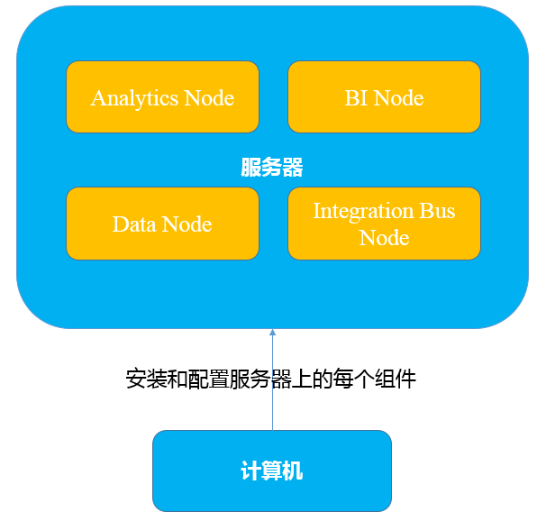

在图中，计算机表示您运行解决方案安装程序的计算机。并将 PMQ 的组件安装到了同一台计算机上。

### 开始服务器安装解决方案

**在你开始之前** ：

在这个任务中，您必须访问与包含安装文件的计算机相分离的计算机。这台计算机有以下要求:

- 有一个屏幕分辨率大于 1024/760 的显示器。
- 操作系统使用英语。
- 谷歌 Chrome 44 版本及其以后的版本，或 Mozilla Firefox 38 及其后版的浏览器本安装在它上面。已安装的 web 浏览器语言的语言 **必须是英语** 。
- 安装文件必须位于您拥有执行权限的目录中。

**步骤：**

1. 以 root 用户登录，进入解压后的路径

    `cd PMQ_2.5.3_linux/SolutionInstaller/`

2. 执行安装文件

    `./setup.sh`

3. 在另一台计算机上打开一个 web 浏览器，然后进入安装程序 URL

    `https://servername:8080/UI/index.html`


### 使用解决方案

你使用解决方案安装程序来定义 IBM 预测性维护和质量环境的安装。在此过程中，通过识别节点计算机并添加希望在每个节点上安装的软件，从而定义环境。通过将节点拖放到画布上，然后将组件拖放到节点中，为解决方案创建一个安装配置。

**步骤：**

1. 在 web 浏览器中打开解决方案安装程序。在解决方案安装程序运行后，您可以从任何来自 Firefox 或 Chrome web 浏览器的计算机访问如下 URL： `https://servername:8080/UI/index.html` ，其中 servername 是服务器的名称或者是 ip。

    **注意** ：不要在正在运行解决方案安装程序的计算机上使用 web 浏览器，也不要在安装了预测维护和质量组件的计算机上使用。您必须在另一台计算机上使用 web 浏览器。

2. 在许可信息页面上，单击 Accept。如图 2 所示。
3. 选择 Predefined Configurations，并且点击 OK。
4. 选择 PMQ Single Node Configuration 进行默认的单节点安装。然后可以看到如图 3 所示界面，需要对各个节点进行相关配置。
5. Single node 的配置如图 4 所示，其中 Hostname 是服务器的 name 或者 ip，Username 和 password 是服务器对应的用户名和密码。
6. 配置 Db2，如图 5 所示。
7. 配置 Websphere MQ，如图 6 所示。
8. 配置 Websphere Application Server，如图 7 所示。
9. 配置 IBM Db2 Data Server Runtime Client，如图 8 所示。

##### 图 2\. 安装界面首页

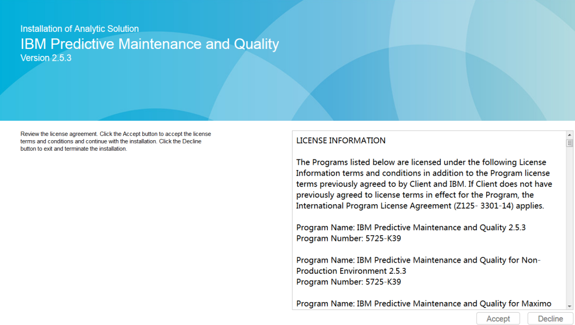

##### 图 3\. 单节点安装配置

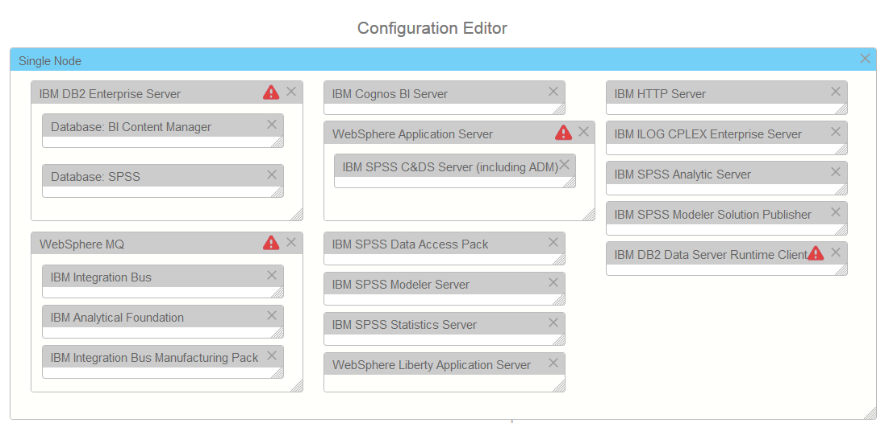

##### 图 4\. 单节点配置

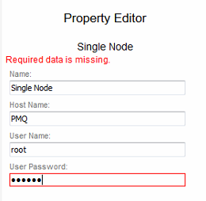

##### 图 5\. Db2 配置

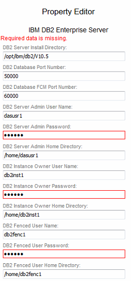

##### 图 6\. Websphere MQ 配置

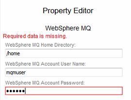

##### 图 7\. Websphere Application Server 配置

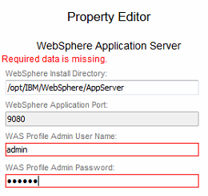

##### 图 8\. IBM Db2 Data Server Runtime Client 配置

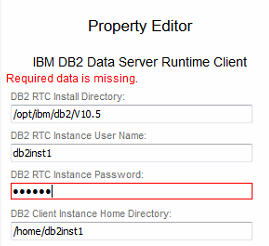

### 开始安装

1. 单击 Validat 进行验证。如果显示错误或信息丢失，您必须更正错误或提供信息，然后才能运行安装。如图 9 所示。
2. 单击 Run。安装成功后如图 10 所示。

##### 图 9\. 验证成功

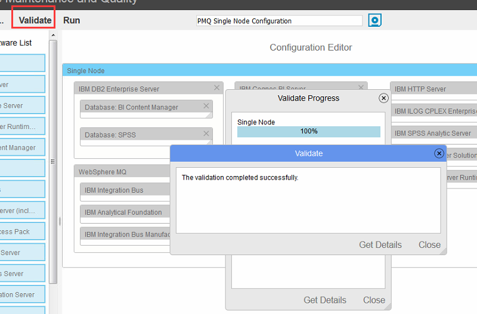

##### 图 10\. 安装成功

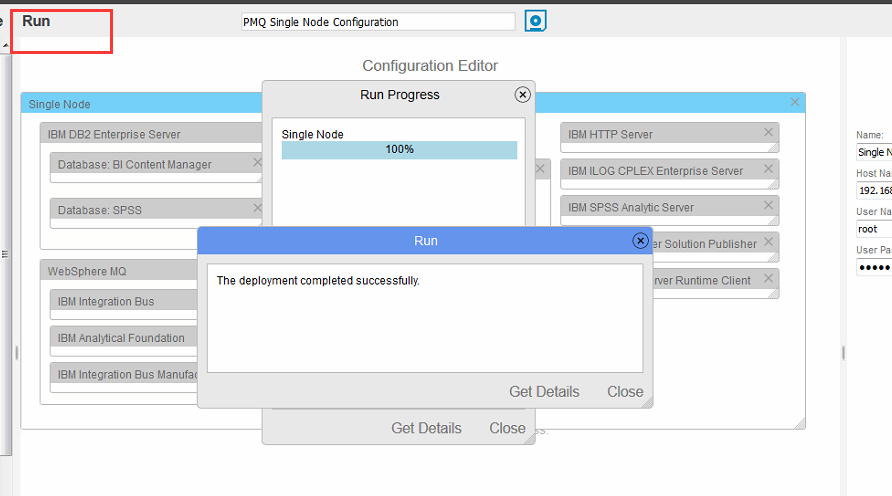

## 测试安装

在安装 IBM® 预测性维护和质量 server components 之下，你必须完成的任务和当时的一些额外配置测试的安装。

### 测试数据库

1. 打开终端窗口，并切换到数据库实例所有者用户。例如，

    `su - db2inst1`

2. 输入以下命令在计算机上列出数据库：

    `db2 list database directory`

    列出的数据库应该包含以下两项:

    - COG110CS
    - SPSSDB

### 测试 Cognos BI

验证您可以访问 IBM® BI 门户。

**在开始之前**:

确保 IBM 预测维护和质量解决方案服务正在运行。

**步骤**:

打开一个 web 浏览器并输入以下 URL: `http://servername:9300/bi/` 其中，Servername 安装 BI 服务组件的计算机的主机名或 IP 地址。成功安装应出现如图 11 所示界面。

##### 图 11\. Cognos BI 界面

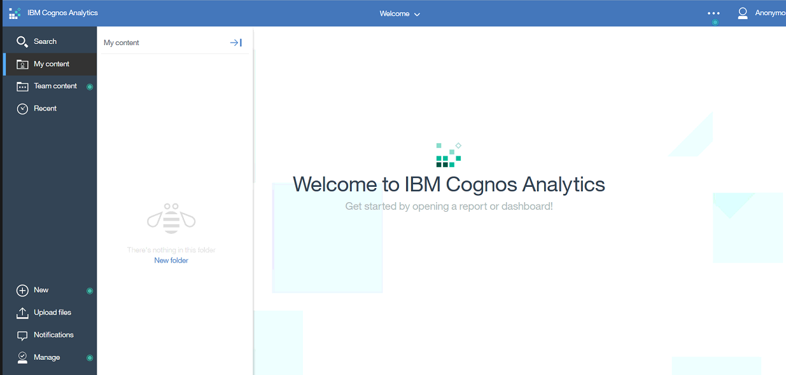

## 启动服务

### 在数据节点计算机上启动服务

1. 切换至 db2inst1 用户：

    `su - db2inst1`

2. 启动 db2:

    `db2start`


### 在分析节点计算机上启动服务

1. 使用 root 用户:

    `su - root`

2. 转至 Websphere 目录：

    `cd /opt/IBM/WebSphere/AppServer/profiles/CNDSprofile/bin`

3. 启动服务：

    `./startServer.sh server1`

4. 转至 IBM SPSS Modeler 服务器目录：

    `cd /opt/IBM/SPSS/ModelerServer/18.0`

5. 启动 SPSS Modeler Server:

    `./modelersrv.sh start`


### 在集成总线节点计算机上启动服务

1. 使用 mqmuser 用户:

    `su - mqmuser`

2. 转至目录：

    `cd /opt/IBM/IIB/bin`

3. 启动 broker:

    `./mqsistart pmqbroker`

4. 验证服务启动:

    `./mqsilist pmqbroker`

    或者

    `./mqsilist pmqbroker -e pmqgroup`

5. 执行下面的命令:

    `runmqsc pmqmanager`

    输入

    `START LISTENER`

    `END`


### 在 BI 节点计算机上启动服务

1. 使用 root 用户:

    `su - root`

2. 转至目录：

    `cd /opt/ibm/cognos/analytics/wlp/bin`

3. 执行以下命令：

    `./server start cognosserver`

4. 转至 IBM HTTP Server bin 目录：

    `cd /opt/IBM/HTTPServer/bin`

5. 执行以下命令，启动 http 服务：

    `./apachectl -f ./conf/httpd.conf -k start`

    或者

    `./apachectl start`


## 停止服务

### 在 BI 节点计算机上停止服务

1. 使用 root 用户:

    `su - root`

2. 转至目录：

    `cd /opt/ibm/cognos/analytics/wlp/bin`

3. 执行命令：

    `./server stop cognosserver`

4. 进入 HTTP Server 安装路径：

    `cd /opt/IBM/HTTPServer/bin`

5. 输入下面的命令停止 http 服务：

    `./apachectl -f ./conf/httpd.conf -k stop`


### 在集成总线计算机上停止服务

1. 切换至 mqm 用户:

    `su - mqmuser`

2. 转至 IBM Integration Bus bin 目录：

    `cd /opt/IBM/IIB/bin`

3. 执行命令：

    `./mqsistop pmqbroker -i`

4. 确定服务已经停止：

    `./mqsilist pmqbroker`


### 在分析节点计算机上停止服务

1. 使用 root 用户:

    `su - root`

2. 转至路径：

    `cd /opt/IBM/WebSphere/AppServer/profiles/CNDSprofile/bin`

3. 执行停止命令：

    `./stopServer.sh server1`

4. 转至 SPSS Modeler Server 目录：

    `cd /opt/IBM/SPSS/ModelerServer/18.0/`

5. 输入命令：

    `./modelersrv.sh stop`

6. 验证服务是否停止：

    `ps -ef | grep statisticsd`

7. 如果没有停掉服务，需要用下面的命令强制停止：

    `kill -9 'cat statisticsd.pid'`


### 在数据节点计算机上停止服务

1. 切换到 db2inst1 用户:

    `su - db2inst1`

2. 停止 Db2 administration 服务：

    `db2stop`


## 总结

IBM PMQ 作为 IBM 面向物联网大数据的重要平台级解决方案，无论是在软件集成，模型设计上都有完整的考虑，是 IBM 为数不多的端到端的平台级解决方案，能快速帮助企业进入到以预测能力为基础的大数据平台实践当中，该文章是全面了解 IBM PMQ 的入门级最佳实践。

## 参考资源

- 在实践本文的时候，可能会遇到一些其他的安装问题，可以参考： [MustGather 与故障排除:：PMQ 服务器安装](http://www-01.ibm.com/support/docview.wss?uid=swg22005096)

- 以及其他关于 PMQ 方案的高级实践文章： [使用 IBM Predictive Maintenance and Quality 实现实时数据分析](http://www.ibm.com/developerworks/cn/data/library/ba/ba-predictive-maint/index.html?ca=drs-&utm_source=tuicool)