# IBM SPSS ARIMA 算法使用案例介绍
在 Python Notebook 中调用 ARIMA API 来进行预测分析

**标签:** 分析

[原文链接](https://developer.ibm.com/zh/articles/ba-lo-spss-arima/)

刘 耀东, 宋 波, 于 东海

发布: 2019-02-13

* * *

## ARIMA 算法概述

时间序列是以规律的时间间隔采集的测量值的有序集合。时间序列分析的主要目的是根据现有的历史数据来预测未来的数据。

IBM SPSS ARIMA（差分自回归移动平均值）模型是一种典型的时间序列模型，可用于预测未来值，提供比指数平滑模型更复杂的趋势和季节性成分建模方法，在模型中包含预测变量。包括自回归模型（AR），移动平均模型（MA）和自回归移动平均模型（ARMA）。

## Python Notebook 环境

可以通过下面两种 notebook 环境来进行预测分析：

### 本地环境

本地环境需要有 IBM SPSS 算法 jar 包及其依赖的包（如果没有的话可以用后面介绍的 [IBM Watson Studio](https://www.ibm.com/cloud/watson-studio) 环境，除了加载输入数据不同其它代码是一样的）。

首先安装 Python 到路径 C:\\Python35，这里 Python 版本是 3.5.2，选择自定义安装，指定安装路径，并加入系统 PATH 变量。如果下面三个库还没有安装的话从命令行执行 pip 安装：

- pip install pyspark
- pip install jupyter
- pip install numpy

然后把下面 IBM SPSS 两个 jar 包放到指定路径 C:\\Python35\\Lib\\site-packages\\pyspark\\jars，这里 com.ibm.spss.com.ibm.json.JSON4J-1.0.jar 是 IBM SPSS 算法包依赖的库，IBM SPSS 算法包这里使用的版本号是 5.1。

- spss-assembly-spark2.0-scala2.11-5.1\*.jar
- com.ibm.spss.com.ibm.json.JSON4J-1.0.jar

解压文件 sparkspsspy-5.1\*.zip, 然后把目录 spss 复制到下面的路径即可。 C:\\Python\\Python35\\Lib\\site-packages

任选工作目录，从命令行运行下面的命令就会在当前缺省浏览器中打开 Jupyter Notebook.

C:\\temp\\arima\\jupyter notebook

如图 1：

##### 图 1\. Jupyter Home


右键点击 New 按钮，下拉菜单中选择 Python 3，如图 2：

##### 图 2\. Jupyter Notebook

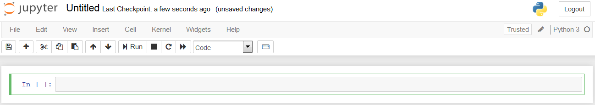

接下来就可以在 notebook 的 cell 里面输入 Python 代码了。

### IBM Watson Studio

[IBM Watson Studio](https://www.ibm.com/cloud/watson-studio) 已经集成了 IBM SPSS 算法包及依赖包。登录进去后，在 Projects 里面新建一个 Project，然后在 Assets->Notebooks->New notebook，选择 run time 的环境去创建 notebook，图 3 显示了内核是 Python 3.5 with Spark 2.1 的 notebook.

##### 图 3\. IBM Watson Studio Notebook

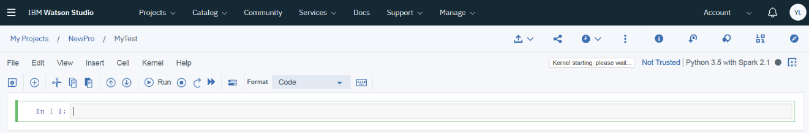

## 使用案例说明

某产品分类公司想要根据过去十年的销售数据来预测来年的男装季度销售，还想知道哪些预测变量（predictor）对目标被预测变量（target）影响比较大，从而做出相应的决策。预测变量包括：邮递的产品目录数（mail）和产品目录的页数（page）、开通的订购热线数目（phone）、印刷广告投入额（print）以及客户服务代表人数（service）。

这里的使用案例的输入数据 catalog _seasfac.csv 来自文件 \*\*\_catalog\_seasfac.sav ，_ **可在任何 IBM® SPSS® Modeler 安装程序的** _Demos_\\*\\* 目录中找到。

## 输入原始数据的转换

首先加载数据 `catalog_seasfac.csv` 为 `spark dataframe` ，清单 1 显示了在本地 notebook 环境下的代码，csv 文件在当前 notebook 路径”C:\\temp\\arima\\”下面。

##### 清单 1\. 本地环境加载输入数据为 Spark Data Frame

```
from pyspark.sql import SparkSession
spark = SparkSession.builder.getOrCreate()
from pyspark.sql.types import *
from pyspark import SparkContext
from pyspark import SQLContext
sc = SparkContext.getOrCreate();
sqlContext=SQLContext.getOrCreate(sc);

df = sqlContext.read.format('com.databricks.spark.csv') \
    .options(header='true', inferschema='true') \
.load('./catalog_seasfac.csv') # this is your csv file
print(df.schema)
df.show(5)

```

Show moreShow more icon

如果是 IBM Watson Studio notebook, 需要把 catalog\_seasfac.csv 上传使用。登录 IBM Watson Studio 后，新建一个 project，然后在 Assets 里面新建一个 notebook,在 notebook 右上方，点击”Find and add data”图标上传数据，然后右键选择已上传的数据 catalog\_seasfac.csv ，选择 Insert to Code ->Insert SparkSession DataFrame，notebook 于是自动插入代码来创建 Spark Dataframe,这里也可以修改自动插入代码加入预先定义数据的类型 df\_schema，见清单 2。

##### 清单 2\. 在 IBM Watson Studio 中加载输入数据为 Spark Data Frame

```
from pyspark.sql import SparkSession
from pyspark.sql.types import *
spark = SparkSession.builder.getOrCreate()
df_schema = StructType([
                StructField("date",TimestampType(),True),
                StructField("men",DoubleType(),True),
                StructField("women",DoubleType(),True),
                StructField("jewel",DoubleType(),True),
                StructField("mail",DoubleType(),True),
                StructField("page",DoubleType(),True),
                StructField("phone",DoubleType(),True),
                StructField("print",DoubleType(),True),
                StructField("service",DoubleType(),True),
                StructField("YEAR_",DoubleType(),True),
                StructField("MONTH_",DoubleType(),True),
                StructField("DATE_",StringType(),True),
                StructField("Seasonal_Err_Men",DoubleType(),True),
                StructField("Seasonal_AdjSer_Men",DoubleType(),True),
                StructField("Seasonal_Factors_Men",DoubleType(),True),
                StructField("Seasonal_TrendCycle_Men",DoubleType(),True)])
df = spark.read\
.format('org.apache.spark.sql.execution.datasources.csv.CSVFileFormat')\
.option('header', 'true')\
.schema(df_schema)\
.load(cos.url('catalog_seasfac.csv', '***********************************'))
print(df.schema)
df.show(5)

```

Show moreShow more icon

图 4 是打印出的数据模式和前 5 行数据，从图中可以看到输入数据的所有字段及其类型，注意 date 这里是 TimestampType 类型。因为该产品分类公司希望预测来年的男装季度销售，而当前原始数据的时间间隔是月，所以需要对原始数据作转换把时间间隔转换为季度。

##### 图 4\. Data schema 和数据

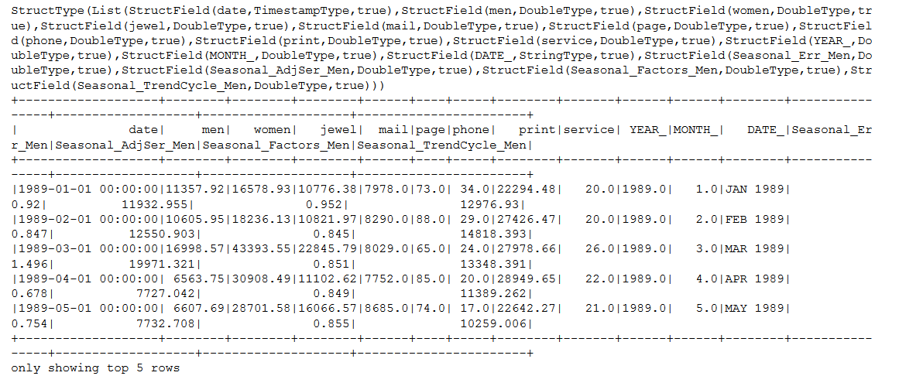

清单 3 代码引入 TSDP, RTSDP 和 ARIMA 模型相关的包。

##### 清单 3\. TSDP, RTSDP 和 ARIMA 相关依赖包

```
from spss.ml.forecasting.timeseriesdatapreparation import TimeSeriesDataPreparation
from spss.ml.forecasting.traditional.timeseriesforecasting import TimeSeriesForecastingArima
from spss.ml.forecasting.reversetimeseriesdatapreparation import ReverseTimeSeriesDataPreparation
from spss.ml.forecasting.params.predictor import Predictor,ScorePredictor
from spss.ml.forecasting.params.targetorderlist import TargetOrderList
from spss.ml.forecasting.params.tforderlist import TFOrderList
from spss.ml.forecasting.params.temporal import ForecastEs
from spss.ml.common.wrapper import LocalContainerManager

```

Show moreShow more icon

基于 IBM SPSS 当前对算法的设计,输入的原始数据必须由 IBM SPSS TSDP (Time Series Data Preparation) 先处理转换为一个合适的格式供 ARIMA 模型或其它 IBM SPSS 时间序列模型来消费,然后 IBM SPSS RTSDP (Reverse Time Series Data Preparation) 再将 ARIMA 或其它 IBM SPSS 时间序列模型的输出转换为同原始数据一样的格式。

在 IBM SPSS Modeler 和 IBM SPSS Statistics 中，TSDP 和 RTSDP 被嵌入在产品中对用户是透明的，所以不需要考虑数据转换的问题。但是在 notebook 中这种通过 API 调用来使用 IBM SPSS 时间序列模型的方式必须考虑数据前后的转换。

清单 4 代码即调用 TSDP，把输入数据的 dataframe 转换为供 ARIMA 消费的格式。这里可以通过 TSDP 对输入数据做不同的转换。

##### 清单 4\. 调用 TSDP

```
lcm = LocalContainerManager()
tsdp = TimeSeriesDataPreparation(lcm). \
    setMetricFieldList(["men","mail","page","phone","print","service"]). \
    setDateTimeField("date"). \
    setInputTimeInterval("MONTH"). \
    setOutTimeInterval("QUARTER")
tsdpOutput=tsdp.transform(df)

```

Show moreShow more icon

LocalContainerManager 用来创建容器（container）的对象, 通常包含数据转换或建模过程中产生的 Json, PMML 或 StatXML 等与模型相关的文件。

setMetricFieldList 指定变量字段，这里的变量应该是连续变量，包括被预测变量字段和预测变量字段。

setDateTimeField 指定时间日期字段的名字，这里是 date。

setInputTimeInterval 指定输入数据的时间间隔是天（DAY），星期（WEEK），月（MONTH），季度（QUARTER）或年（YEAR），通过 setOutTimeInterval 指定转换后的时间间隔。本文指定的输入时间间隔是月（MONTH），输出时间间隔是季度（QUARTER）。这里的时间间隔根据原始数据的不同，还可以是时间间隔秒（SECOND），分钟（MINUTE）或小时（HOUR），甚至非标准时间间隔循环周期（CYCLIC\_PERIOD）。

在选择时间序列的模型建模之前，通常需要分析一下时间序列曲线。清单 5 的代码用来把 TSDP 转换后的格式再通过 RTSDP 转换为和输入原始数据一样的格式，这样就可以把历史每个季度的男装销售曲线图画出来，便于进一步的分析。

##### 清单 5\. 调用 RTSDP

```
rtsdpRawdata = ReverseTimeSeriesDataPreparation(lcm). \
    setInputContainerKeys([tsdp.uid])
rtsdpRawdataOutput=rtsdpRawdata.transform(tsdpOutput)
print(rtsdpRawdataOutput.schema)
rtsdpRawdataOutput.show(5)

```

Show moreShow more icon

从图 5 中可以看到，经过 TSDP 处理之后，输入数据的时间间隔已经从月变成了季度，这里对预测变量作了聚集，现在每个季度的值是之前三个月的值的和。

##### 图 5\. TSDP, RTSDP 转换后的数据

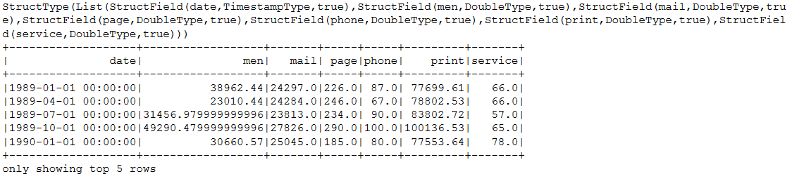

清单 6 代码画出过去十年（1989 – 1999）的男装季度销售额曲线图：

##### 清单 6\. 画出时间序列图

```
import matplotlib.pyplot as plt
import matplotlib.pyplot as plt
%matplotlib inline
fig = plt.figure(figsize=(16,8))
x=rtsdpRawdataOutput.select('date').rdd.map(lambda row : row[0]).collect()
y=rtsdpRawdataOutput.select('men').rdd.map(lambda row : row[0]).collect()
plt.plot(x, y,color="blue", linewidth=1.0, linestyle="-", label="men")
plt.xlabel('date')
plt.legend(loc=0)

```

Show moreShow more icon

从图 6 中可以看到，该时间序列整体呈现上升趋势，即序列值趋向于随时间变化而增加，并维持线性趋势。此序列还有一个明显的季节模式，即年度高点在第四季度。

##### 图 6\. 时间序列图

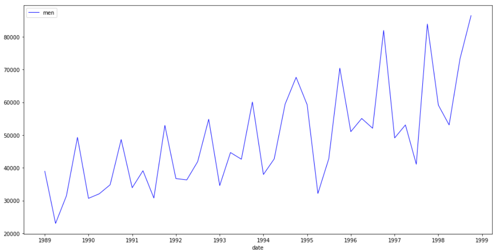

因为该产品分类公司除了想预测来年每个季度的销售额，还想知道哪些变量对该销售额影响最大，所以考虑使用 IBM SPSS ARIMA 模型来进行预测分析。

## ARIMA 算法建模

清单 7 的代码用来创建 ARIMA 模型。

##### 清单 7\. 创建 ARIMA 模型

```
arima = TimeSeriesForecastingArima(lcm). \
    setInputContainerKeys([tsdp.uid]). \
    setTargetPredictorList([Predictor(targetList = [["men"]],
                                     predictorIncludeList=[["mail"],["page"],["phone"],["print"],["service"]])]).\
    setTargetOrderList([TargetOrderList(
     targetList=[["men"]],
     nonSeasonal=[1,0,1],
     seasonal=[1,0,1],
     transType="none"
     )]). \
    setTFOrderList([TFOrderList(
     targetList=[["men"]],
     predictorList=[["mail"],["page"],["phone"],["print"],["service"]],
     nonSeasonal=[1,0,0],
     seasonal=[0,0,0],
     transType="none"
     )]). \
    setOutInputData(True). \
    setCalcPI(True)
arima_model=arima.fit(tsdpOutput)

```

Show moreShow more icon

setInputContainerKeys 用来设置 TSDP 转换后的容器相关信息。

setTargetPredictorList 用来设置被预测变量（target）和预测变量（predictor）。这里被预测变量就是要预测的男装销售额 men，预测变量包括 mail, page, phone, print 和 service。

setTargetOrderList 用来设置 ARIMA 的阶数，针对被预测变量(target)。对于 ARIMA 的阶数，所有的值都必须是非负整数。对于自回归和移动平均值来说，该值表示最大阶数。所有低于该值的正阶数都将包括在模型中。例如，如果指定 2，那么模型包括的阶数是 2 和 1。阶数依次包括下面三个值,本文中阶数的设置为实验值。

- 自回归（Autoregressive, p）：模型中的自回归阶数。自回归阶数指定序列中哪些以前的值用于预测当前值。例如，自回归阶数 1 指定序列中过去一个时限的值用于预测当前值。
- 差分（Difference, d）：指定在估计模型之前应用于序列的差分的阶。当趋势出现时（具有趋势的序列通常是不稳定的，而 ARIMA 建模时假定是稳定的），差分是必需的并可用于去除这些趋势的影响。差分阶数与序列趋势度一致，1 即一阶差分表示线性趋势，2 即二阶差分表示二次趋势，0 表示没有差分。
- 移动平均值（Moving Average, q）：模型中移动平均值阶数的值。移动平均值阶数指定如何使用与序列以前值均值之间的偏差来预测当前值。例如，移动平均值阶数 1 指定在预测序列的当前值时，可考虑与序列（来自过去一个时限中的每一个）均值之间的偏差。

setTFOrderList 用来设置转换函数的阶数,针对预测变量（predictor）。对于转换函数的阶数，所有的值都必须是非负整数。对于分子和分母来说，该值表示最大阶数。所有低于该值的正阶数都将包括在模型中。阶数依次包括下面三个值,本文中阶数的设置为实验值。

- 分子（Numerator）: 转换函数的分子阶数指定选定的独立（预测变量）序列中哪些先前的值用于预测相依序列的当前值。例如，分子阶数 1 指定独立序列过去一个时限的值以及独立序列的当前值可用于预测每个相关序列的当前值。
- 差分（Difference）:指定在估计模型之前应用于所选独立（预测变量）序列的差分的阶数。当趋势出现时，差分是必需的并可用于去除这些趋势的影响。
- 分母（Denominator）: 转换函数的分母阶数指定如何使用与选定独立（预测变量）序列的先前值均值之间的偏差来预测相依序列的当前值。例如，分母阶数 1 指定当预测每个相关序列的当前值时，可考虑与独立序列过去一个时限的均值之间的偏差。

nonSeasonal 指非季节性的阶数，取值可以参考上面阶数的定义。

seasonal 指季节性的阶数，取值可以参考上面阶数的定义。

注意：季节性自回归成分、移动平均值成分和差分成分与其非季节性对应成分起着相同的作用（季节性分子、分母和差分成分与其非季节性对应成分起着相同的作用）。但是对于季节阶数，当前的序列值会受到由一个或多个季节周期分隔的以前序列值的影响。例如，对于以月为时间单位的数据（季节周期为 12），季节阶数 1 表示当前序列值会受到当前序列之前的 12 个周期内的序列值的影响。因此，对于以月为时间单位数据，将季节阶数指定为 1 相当于将非季节阶数指定为 12。

setOutInputData 用来将输入数据包含在预测的输出中，从而可以比较输入值和输出预测值。

setCalcPI 用来计算预测变量的重要性,只有在存在预测变量的时候才有效。

## ARIMA 模型解析及预测变量重要性

建模后还需要对模型相关文件进行解析，清单 8 的代码用来输出容器中所有模型相关的文件的列表：

##### 清单 8\. 输出模型相关文件列表

```
arima_container = lcm.importContainerSeq(arima.uid)
arima_container.entriesNames()

```

Show moreShow more icon

图 7 为输出文件列表的例子，这里 TSDPOutput.json 是 TSDP 的输出，datamodel.xml 是数据模型文件，containers[0]中的 \*.es.xml 和 0.xml 是 PMML 文件，containers[1]中的 StatXML.xml 和 0.xml 都是 StatXML。StatXML.xml 中可以看到构建模型的各种设置及其值，0.xml 可以查看模型的各个统计量的信息进而判断模型的好坏。

##### 图 7\. 模型相关文件列表

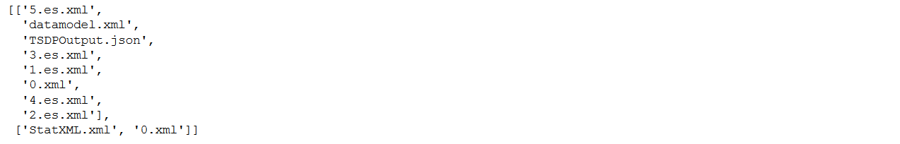

清单 9 中的代码输出 PMML 文件，数据模型文件和 StatXML 文件，其它文件可仿照例子输出。

##### 清单 9\. 输出模型相关文件

```
containers = arima_container.containers();
print("containers[0] 0.xml:\n"+containers[0].containerEntry('0.xml').stringContent()+"\n")
print("containers[0] datamodel.xml:\n"+containers[0].containerEntry('datamodel.xml').stringContent()+"\n")
print("containers[1] StatXML.xml:\n"+containers[1].containerEntry('StatXML.xml').stringContent()+"\n")
print("containers[1] 0.xml:\n"+containers[1].containerEntry('0.xml').stringContent()+"\n")

```

Show moreShow more icon

从 containers[0]中的 PMML 文件 0.xml 可以得到各个预测变量的重要性，见图 8：

##### 图 8\. 预测变量重要性

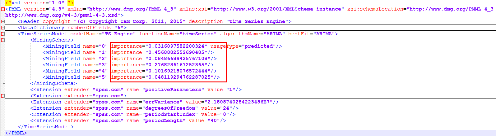

从数据模型 datamode.xml 中可以得到对应的变量的编码，１对应的是 mail，3 对应的是 phone，见图 9。因为这两个预测变量的 importance 值最大，所以这两个预测变量对被预测变量 men 的影响最大。

##### 图 9\. 数据模型中的变量

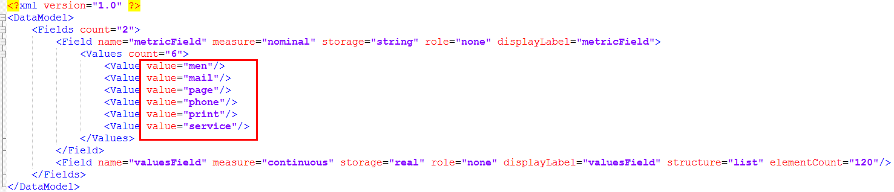

从 containers[1]中的 StatXML 文件 0.xml 中可以看到模型相关的统计量，可以对模型的好坏做出评估，见图 10：

##### 图 10\. 模型相关统计量

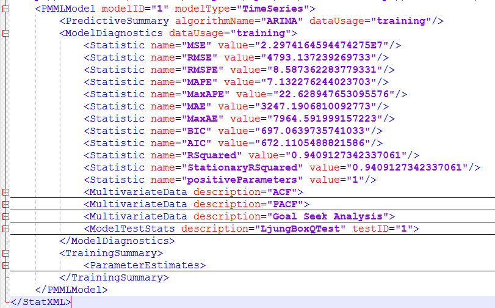

## ARIM 算法预测

清单 10 的代码用来作预测及设置预测参数:

##### 清单 10\. 预测及参数设置

```
transformer = arima_model. \
setTargets(ScorePredictor(targetIncludedList=[["men"]])). \
setForecast(ForecastEs(outForecast = True, forecastSpan = ４,outCI = True))
predictions = transformer.transform(tsdpOutput)

```

Show moreShow more icon

setTargets 用来指定被预测变量 men。

setForecast 用来指定预测相关设置，outForecast 指定是否作预测，forecastSpan 指定预测的时间间隔，这里时间间隔是季度，所以 4 指定预测来年的 4 个季度，outCI 指定是否计算输出预测置信区间 LCI (Lower Confidence Interval) 和 UCI (Upper Confidence Interval)。

清单 11 的代码用来将预测结果通过 RTSDP 转换为和输入原始数据一样的格式。对于输出的 dataframe, 为了便于显示没有选取所有字段而通过 select 选取了部分字段。

##### 清单 11\. RTSDP 转换

```
rtsdp = ReverseTimeSeriesDataPreparation(lcm). \
    setInputContainerKeys([tsdp.uid]). \
    setDeriveFutureIndicatorField(True)

score = rtsdp.transform(predictions).select("date","$FutureFlag","men","$TS-men","$TSLCI-men","$TSUCI-men")
score.show(score.count())

```

Show moreShow more icon

setInputContainerKeys 用来设置 TSDP 转换后的容器相关信息。

setDeriveFutureIndicatorField 是否输出未来指示字段。

图 11 为预测的输出，这里$FutureFlag 列为 0 显示历史时间，为 1 显示未来的时间。$TS-men 列为男装销量的预测值，$TSLCI-men 列和$TSUCI-men 列表明了预测值的置信区间。

##### 图 11\. 预测输出

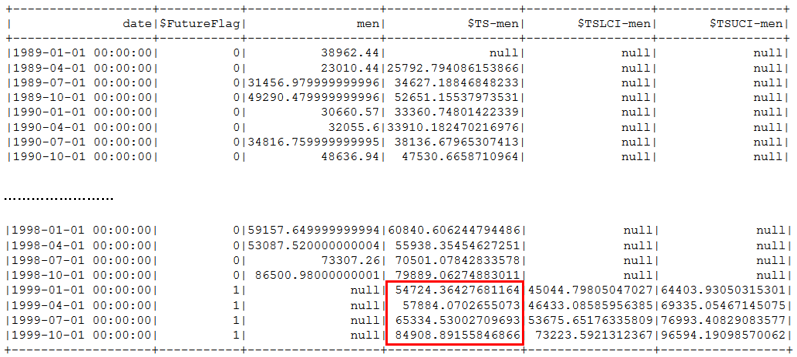

清单 12 的代码用来画出男装销量的历史值和预测值的比较图：

##### 清单 12\. 画出预测图

```
from datetime import datetime,time
x=score.select('date').rdd.map(lambda row : row[0]).collect()
yObserve=score.select('men').rdd.map(lambda row : row[0]).collect()
yPredict=score.select('$TS-men').rdd.map(lambda row : row[0]).collect()

fig = plt.figure(figsize=(16,8))
plt.plot(x, yObserve,color="blue", linewidth=1.0, linestyle="-", label="men")
plt.plot(x, yPredict,color="red", linewidth=1.0, linestyle="-", label="$TS-men")
plt.xlabel('date')
plt.legend(loc=0)

```

Show moreShow more icon

图 12 展示了男装季度销售额 men 和其预测值的比较图$TS-men，从图中可以看到 1999 年的整体销售情况预测较好，1998 年第四季度高峰期后 1999 年上半年再次回复正常，下半年一直保持平稳的上升趋势。

##### 图 12\. 预测图

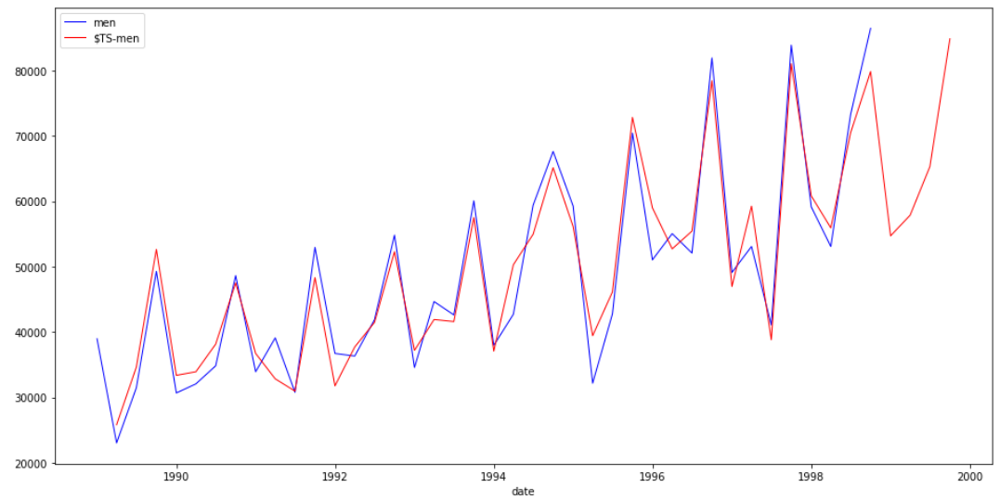

## 结束语

本文通过在 notebook 中转换原始数据，设置模型参数，创建模型，并根据预测变量的重要性（Predictor Importance）找到对预测影响最大的预测变量，做出预测，完整地展示了如何通过 Python 调用 IBM SPSS ARIMA API 进行建模、预测及分析。

## 参考资料

- 查看 [IBM SPSS Modeler 关于时间序列算法的帮助文档](https://www.ibm.com/support/knowledgecenter/SS3RA7_18.0.0/modeler_mainhelp_client_ddita/clementine/timeser_as_node_general.html) ，了解 IBM SPSS 时间序列算法。
- 参考 [IBM SPSS Modeler 中应用 ARIMA 来进行预测分析的教程](https://www.ibm.com/support/knowledgecenter/SS3RA7_18.0.0/modeler_tutorial_ddita/clementine/ex_catsales_arima.html) ，了解如何使用 IBM SPSS Modeler 来进行 ARIMA 模型的预测分析。
- 查看 [IBM SPSS 预测分析算法在 IBM Watson Studio Notebook 中的帮助文档](https://dataplatform.cloud.ibm.com/docs/content/analyze-data/spss-algorithms.html?context=analytics) ，这里 Forecasting 包括多种时间序列相关的算法。
- 查看 [IBM Watson Studio](https://www.ibm.com/cloud/watson-studio) 首页，查看相关内容及登录后使用 Notebook。