# IBM Serverless 解决方案 – IBM Cloud Functions 使用简介
IBM cloud Functions 如何在 Functions-as-a-Service 层面提供支持

**标签:** IBM Cloud Functions,Serverless,云计算

[原文链接](https://developer.ibm.com/zh/articles/cl-lo-serverless-ibm-cloud-functions/)

郑海贝, 孙志刚, 张宇刚

发布: 2020-08-26

* * *

## 前言

随着云计算的迅猛发展，无论是 Iaas、Paas 再到容器化和云原生都无一例外的深刻影响着并重塑了整个软件行业的开发部署模式。而近年来被广泛提及的 Serverless 技术的主要理念是通过提供对于底层硬件资源和运行时环境的更高级别抽象使得开发人员只需专注于业务逻辑的代码编写，是软件发展历程中的又一个里程碑式的出现。

## Serverless 简介

Serverless 直译为“无服务”，但不意味着应用不再需要服务器来提供运行环境，而是云计算的提供商负责管理底层的硬件基础设施和代码运行时环境。开发人员只需关注于业务层的实现，通过遵循特定的开发模型便可以快速实现应用的部署。

Serverless 技术有着诸多的优点：

1. 正如 Serverless 定义所说，我们无需再去花费人力或资源去管理底层硬件基础设施。而通常对于公司而言最能产生直接价值的正是业务代码，底层硬件和运行环境的搭建乃至 devops 角色的引入是原有开发模式下不得不花费的资源和精力，因此 serverless 通过帮助开发人员屏蔽底层应托管环境的复杂性能够很大程度提高公司业务价值的产出效率。
2. Serverless 有着不同的计费模型，用户只需为应用实际的运行时间来付费，精度甚至可以达到毫秒级。而传统的云服务，即使应用只有非常低频的访问或者是只用来运行定时触发的任务，应用服务器仍然需要 7\*24 小时在线，因此对于应用空闲时间，我们仍旧需要为相关的计算资源进行付费。
3. Serverless 提供了开箱即用的动态扩容和高可用性，当应用的访问请求流量增大，应用能够按需自动扩容来保证应用正常提供服务。

然而当大家谈论起 Serverless 时，大多都会把 Serverless 等同于 Functions-as-a-Service(FaaS)：一种通过将无状态的应用转换为函数的形式来部署到相应云平台上的开发模型；其实 Serverless 指代的范畴要比 Faas 更广泛。本文主要介绍 IBM 的 Serverless 解决方案 —— IBM cloud Functions 是如何在 Function、Functions-as-a-Service 层面提供的支持。

## IBM Cloud Functions 环境搭建

前置条件：

1. 创建一个 IBM Cloud 的账户，可以通过访问 [IBM Cloud 用户注册页面](https://cocl.us/IBM_CLOUD_GCG) 创建账户。
2. 访问 [IBM Cloud Functions 控制面板](https://cloud.ibm.com/functions/?cm_sp=ibmdev-_-developer-articles-_-cloudreg) 即可以进入 IBM Cloud Functions 的管理页面。

客户端工具安装：

以 mac 和 linux 系统为例，执行如下命令安装 IBM Cloud CLI 工具集。

```
curl -sL https://ibm.biz/idt-installer | bash

```

Show moreShow more icon

说明：针对不同类型的 IBM Cloud 服务或产品，需要通过安装对应 plugin 来进行交互。IBM Cloud Functions plug-in 提供了客户端同 IBM Cloud Functions 交互的能力。上述命令会默认安装 IBM Cloud Functions plug-in。

验证安装是否成功：

- 可通过命令 ibmcloud fn –help 来验证 IBM Cloud Functions plug-in 是否安装成功。
- 或执行命令 ibmcloud plugin list 输出结果应如图 1 所示。

**图 1\. 查看 IBM Cloud Plugin**

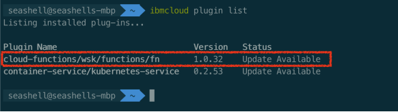

客户端工具安装完成后，通过命令 ibmcloud login 执行登录操作（登录所需参数参考 [ibmcloud login 帮助文档](https://cloud.ibm.com/docs/cli?topic=cloud-cli-ibmcloud_cli#ibmcloud_login)），登录完成后可以执行 ibmcloud fn 命令来同 IBM Cloud Functions 进行交互。

## IBM Cloud Functions 基本组件

IBM Cloud Functions 的核心组件有三大类：

- Action
- Trigger
- Rule

### Action 组件

Action 对应的就是完成特定业务逻辑的函数代码。Action 目前支持 python、nodejs、PHP、Swift、 Go、Java 等主流编程语，同时也支持 docker 容器，用户可通过定制 docker 镜像并上传到公共的镜像库创建 action 时关联镜像地址即可。

#### 创建 Action

对于使用用 Java 来编写 action 需要遵循特定的规范：

1. 入口方法签名格式为如下所示：

    `public static com.google.gson.JsonObject main(com.google.gson.JsonObject);`

     即 main 方法为静态函数，输入参数类型定义为 `google-gson` 的 `JsonObject` 类型；返回结果的类型也必须为 `google-gson` 的 `JsonObject` 类型。

2. Java 编写的代码需要进行编译并创建 jar 包，然后通过 ibmcloud fn action create 命令来部署：


`ibmcloud fn action create {action 名字} {action 对应 jar 包的全路径} --main {main 方法所在的 java 类全名称}`

注意：

- IBM Cloud Functions 在执行 action 时会在默认从 action 对应的 Java 代码类中寻找符合方法签名规范并名为 main 方法作为执行的入口，但同时也支持用户自定义入口方法的名字，如果用户想要自定制方法名称，需要在创建 action 的时候额外指定入口方法名称，也就是设置 `--main` 参数时，在类名称后额外添加 # 符号和方法名。
- Action 对应 Java 代码实现所有的类库依赖，包括 `google-gson` 依赖必须全部一同打包进 jar 包（fatJar）。以 gradle 工程为例，使用 Java 插件时可添加如下 jar 任务来实现：

```
// create a fat jar
jar {
    from {
        configurations.compile.collect { it.isDirectory() ? it : zipTree(it) }
    }
}

```

Show moreShow more icon

#### Action 调用

Action 被执行时 IBM Cloud Functions 会从系统的存储库中获取要执行的代码信息，初始化 Docker 容器并将要执行的代码注入其中。Action 的一次执行会在 IBM Cloud Functions 生成一个 activation，activation 记录了 Action 执行的全部详细信息。

通常 Action 的执行是事件驱动来触发的，例如数据库的 change 会触发相关联的 action 执行，或者 alarm 的定时器会定时触发 Action 的执行。针对于开发人员调试的需求，我们同样可以通过执行命令 ibmcloud fn action invoke 来实现。

Action 调用有两种方式：

1. 同步/阻塞调用：调用发生后客户端调用方会阻塞等待直到执行结果返回。同步调用 Action 命令如下：

    `ibmcloud fn action invoke {action 名称} --blocking`

2. 异步调用：在 `invoke` 命令发出时，服务端会立即返回一个对应的 activationID。客户端可以通过该 activationID 查询 action 执行的详细信息，诸如执行结果、日志信息、执行时长等信息。通过 `ibmcloud fn activation get {activationID}` 可以获取到 action 执行的所有详细信息。如果只想查询执行结果，可以执行 `ibmcloud fn activation result {activationID}`；如果想查询执行期间的日志信息，可以执行 `ibmcloud fn activation logs {activationId}`。异步调用 Action 命令如下：


`ibmcloud fn action invoke {action 名称}`

另外如果想要实时获取或监控 IBM Cloud Functions 平台所有发生的 activation，可以通过 ibmcloud fn activation poll 命令来实时地查看所有 action 的执行（和 trigger 激活）信息。

#### Action 示例

如下为一个简单的样例程序，该程序会根据输入参数是否包含 name 信息来生成并返回关键字为 greeting 的 json 数据。

```
import com.google.gson.JsonObject;

public class Hello {
    public static JsonObject main(JsonObject args) {
        String name = "stranger";
        if (args.has("name"))
            name = args.getAsJsonPrimitive("name").getAsString();
        JsonObject response = new JsonObject();
        response.addProperty("greeting", "Hello " + name + "!");
        return response;
    }
}

```

Show moreShow more icon

代码编写完后，将代码和所有类库依赖打成 hello.jar 包。执行如下命令上传 hello.jar 文件来创建一个名为 hello 的 Action。

`ibmcloud fn action create hello hello.jar --main Hello --kind java:8`

执行 ibmcloud fn action list 可以查看当前已经创建的所有 Action，命令执行结果如图 2 所示。

**图 2\. 查看所有 Action 命令输出**

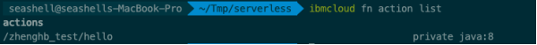

（说明：action list 命令输出中 Action 名称格式为: 命名空间/实际 action 名称）

通过 ibmcloud fn action get 命令可以查看指定 Action 的详细信息，执行结果如图 3 所示。

**图 3\. 查看 Action 详细信息命令输出**

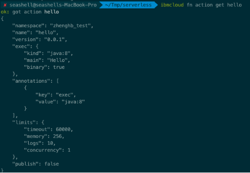

执行如下命令来以同步调用的方式执行 Action，执行结果为图 4 所示。

`ibmcloud fn action invoke hello --param name Alex --result –blocking`

**图 4\. 同步调用 Action 的执行结果**

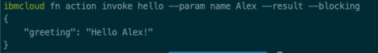

执行如下命令异步调用 Action，执行输出结果为图 5 所示。

`ibmcloud fn action invoke hello --param name Alex`

**图 5\. 异步调用 Action 的执行结果**

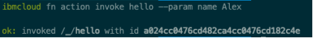

获取到 Action 执行对应的 activationID 后，可以执行如下命令查询执行结果，如图 6 所示。

`ibmcloud fn activation result a024cc0476cd482ca4cc0476cd182c4e`

**图 6\. 查询 activationID 获取 Action 执行返回数据**

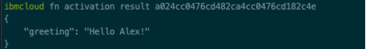

### Action Sequence

从设计粒度层面来说，单个 Action 通常只对应于一块单一职责的业务逻辑，因此针对复杂的业务场景时单个 Action 无法的覆盖整个业务流程。IBM Cloud Functions 引入了 Action sequence 的概念，Action sequence 是用来组装 Action 该 sequence 下关联的所有 action 会按照定义的顺序来依次执行，前一个 Action 的执行输出会作为后一个 Action 的输入。通过对于 Action 的编排，Action sequence 提供了对于复杂业务流程的支持，另外由于同一个 Action 可以被多个 Action sequence 所引用，这样便实现了 action 的重用，如图 7 所示。

**图 7\. Action Sequence 组装 Action**

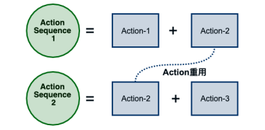

Action Sequence 的创建同样是通过 `ibmcloud fn action create` 命令，但是需要通 `--sequence`参数来指定所有的 Action，命令格式如下：

`ibmcloud fn action create <sequence 名字> --sequence <action1>,<action2> ... ,<actionN>`

Action sequence 同样是通过 `ibmcloud fn action invoke` 命令来触发，执行时 action 按照编排顺序依次执行，传入 action sequence 的参数会传给 sequence 的第一个 action。

### Web Action

IBM Cloud Functions 提供了快速将 Action 转换为一个可通过 http 协议进行访问的 web 服务，这样无需开发人员来编写传统的样板代码只是为了暴露一个 restful 的接口，同时省去管理底层 web 服务器或 servlet 容器的开销。

如果想要一个 Action 可以转换为 web Action，Action 执行的返回结果需遵循一定规则，Action 的返回结果需要是包含三个字段：`statusCode` 来表明 http 请求的响应码，`headers` 包含 http 响应头信息，`body` 为 http 响应数据内容。在创建 action 时需要添加 `--web true` 这一参数，如果想要提供额外 API 安全访问机制，创建 Action 时需要添加参数：`--web-secure <token 值>`，这样客户端调用时必须在请求头添加 `X-Require-Whisk-Auth` 并且值需要设置为创建 web action 时指定的 token。

例如创建一个公网可访问，返回数据类型为 json 的 Web Action，该 Action 基于 nodejs 实现，代码如下：

```
function main(params) {
return {
        statusCode: 200,
        headers: { 'Content-Type': 'application/json' },
        body: {'msg': "greeting from web action!"}
    };
}

```

Show moreShow more icon

执行如下命令创建 Web Action：

`ibmcloud fn action create test_webaction test_webaction.js --web true --web-secure my-secret`

执行如下命令获取 test\_webaction 的 http 访问地址信息，命令执行结果如图 8 所示。

`ibmcloud fn action get test_webaction –url`

**图 8\. 获取 Web Action 的 http 地址信息**

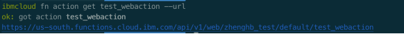

此时如果访问该地址，对应的 Action 代码将会执行，因此会收到 200 的 http 状态码以及对应的 json 格式响应数据，访问 Web Action 的调用结果如图 9 所示。

**图 9\. 访问 Web Action 调用结果**

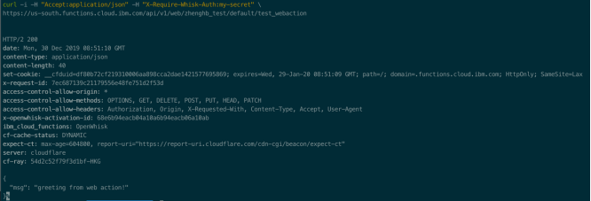

### Trigger

Trigger 用来指代事件的触发。用户可以自己创建事件并通过 trigger 来触发事件，也可以使用 IBM Cloud Functions 系统预置的对于很多常见事件类型的支持。
IBM Cloud Functions 内置事件类型大致分为以下两类：

第一类为外部服务所产生的事件例如 Cloudant 数据库（基于 couchDB 的 NoSQL DB-as-a-Service）存储数据发送变化时生成的事件，位于 whisk.system/cloudant 包下的名为 changes 的事件；github webhook 触事件，位于 `/whisk.system/github` 下名为 webhook 的事件。

第二大类为定时器产生的事件，位于在/whisk.system/alarms 包下，提供如下 3 种定时触发的支持：

- interval：按照定义的时间间隔来定时触发
- once：在指定的时间只触发一次
- alarm：按照配置的 cron 表达式来触发

### Rule

Rule 用来建立 trigger 和 action（也可以是 action sequence）的绑定关系，这样当 trigger 所代表的事件发生时对应的 action 就会执行以此来实现事件驱动的业务模型。

### Package

为了便于 action 或 sequence 的管理，IBM Cloud Functions 引入了 package 来实现对于 action 分类管理。

#### 系统内置 package

IBM Cloud Functions 提供了内置的 package，包含了许多对于常用的功能逻辑（Action）和事件触发（Trigger）的支持，这样用户无需自己编写 action 或事件，只需进行简单配置则可以实现相关的功能。内置包位于 `/whisk.system` 命名空间下，可通过 `ibmcloud fn package list /whisk.system` 来查看所有的内置的 package 和 package 包含的 Action 和 Trigger，如图 10 所示。

**图 10\. 查看系统内置 package**

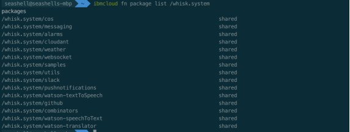

#### 用户自定义 package

用户要自行创建 package，可通过如下命令实现：

`ibmcloud fn package create <package 名称>`

例如我们重新创建一个名为 helloV1 的 Action，并把 helloV1 放到名为 testing 的 package 下。

1. 执行如下命令首先创建 package。

    `ibmcloud fn package create testing`

2. 创建 Action 时指定 package 名称和 Action 名称，命令如下：

    `ibmcloud fn action create testing/helloV1 hello.jar --main Hello --kind java:8`


查看 package，可以看到 action 被创建成功并且位于 testing 包下，如图 11 所示。

**图 11\. 查看 package 下的 Action**

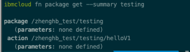

### 配置管理

对于应用部署的配置管理，通常我们会通过设置环境变量，这样应用可以通过读取环境变量来获取相关配置信息。IBM Cloud Functions 则可以通过 parameters 来实现，除了调用 action 时可以传入参数外，我们可以设置默认参数。

1. Action 级别的默认参数，可以在创建 action 或者更新 action 时进行设置。在 Action 执行时，系统会将这些配置的默认参数添加到输入参数，这样 Action 的代码内部可以读取获得。

2. package 级别的默认参数，可以通过创建和更新 package 来进行设置。对于 package 所设置的默认参数，package 下所有的 Action 都可以读取到。


默认参数可以通过 `--param <参数名称> <参数值>` 来进行设置，另外也支持使用 json 格式的参数文件通过 `--param-file` 来批量设置。

例如我们更新之前已经创建的名为 testing 的 package，通过 `package_default.json` 文件格式来配置 package 的默认参数，参数文件内容如图 12 所示。

`ibmcloud fn package update testing --param-file package_default.json`

**图 12\. Package 默认参数**

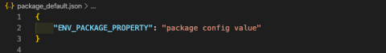

接着修改 Action 对应的工程代码，添加如下代码片段来讲整个输入参数打印出来，如图 13 所示。

**图 13\. 输出 Action 的所有参数信息**

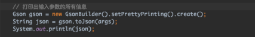

重新编译代码并生成名为 hello\_parameters.jar 更新 action，将之前创建的名为 helloV1 的 Action 代码实现更新为 hello\_parameters.jar，并读取 action\_default.json 配置并设置 action 的默认参数，Action 默认参数文件内容如图 14 所示。命令如下：

`ibmcloud fn action update testing/helloV1 hello_parameters.jar --param-file action_default.json --main Hello --kind java:8`

**图 14\. Action 默认参数文件内容**

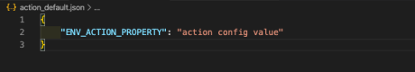

上述操作执行完毕后，调用 action testing/helloV1 时，输入参数除了包含用户传入的参数外，还应包含为 action 设置的默认参数和 action 所在 package 所设置的默认参数，如图 15 所示。

**图 15\. 打印 Action 默认参数和 Package 默认参数**

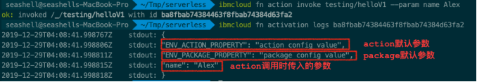

## 基于 Cloudant 数据 Change 事件触发 Action Sequence 的使用示例

系统内置的 `/whisk.system/cloudant` 包预制了针对 cloudant 的常用操作例如读操作、写操作、根据 view 查询数据文档等，另外还提供了 cloudant 数据库存储数据发生变化时的事件触发支持。使用的时候需要首先关联一个具体的 cloudant 数据库示例。

在创建 cloudnat 的数据库绑定时需要指定数据库的用户名，密码和数据库的地址信息，执行的命令格式如下：

```
ibmcloud fn package bind /whisk.system/cloudant <自定义数据库绑定名称> \
--param username "$CLOUDANT_USERNAME" \
--param password "$CLOUDANT_PASSWORD" \
--param host "$CLOUDANT_USERNAME.cloudant.com"

```

Show moreShow more icon

通过上述命令我们来创建一个名为 cloudant\_test 的数据库绑定，关联到一个已经在 IBM cloud 平台搭建好的 cloudant 数据库，操作完成后进入 IBM Cloud Functions 控制面板可以看到被创建出来的数据库绑定 package，如图 16 所示。

**图 16\. IBM Cloud Functions 查看 cloudant 数据库绑定 package**

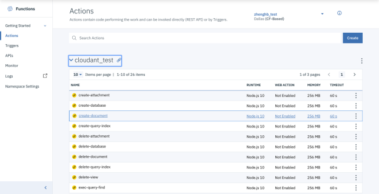

我们可以通过内置 create-database Action 在数据库实例上创建一个名为 testDB 的数据库只需执行如下命令并将数据库名称作为输入参数

`ibmcloud fn action invoke /_/cloudant_test/create-database --param dbname testing_db`

如果要在 testing\_db 数据库写入一个新的 json 文档，可以借助内置的 write Action 来实现。将数据库名称和要创建的 json 文档数据通过 dbname 和 doc 参数分别传入，命令如下，执行结果如图 17。

`ibmcloud fn action invoke /_/cloudant_test/write --param dbname testing_db --param doc "{\"_id\":\"001\",\"name\":\"Alex\", \"gender\": \"male\"}"`

**图 17\. 通过 write Action 执行数据库写操作**

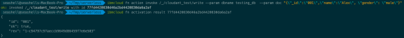

对于读取 cloudant 特定数据文档则需要使用内置的 read Action，将数据库名称和文档的 id 通过 dbname 和 id 分别作为输入参数传入，使用如下命令来读取刚才写入的 id 为 001 的文档，执行结果如图 18 所示。

`ibmcloud fn action invoke /_/cloudant_test/read --param dbname testing_db  --param id "001" --result`

**图 18\. 通过 read Action 执行数据库读操作**

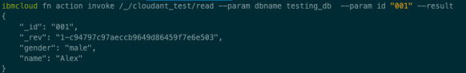

接着创建一个捕捉 testing\_db 的数据变化的 trigger 然后通过 rule 将该 trigger 关联一个 action sequence，从而实现一个基于数据库变动事件来驱动业务代码的执行的样例。

1.首先创建一个 CloudantTestingTrigger 来捕获 cloudant\_test 数据库所有的存储数据变动事件

`ibmcloud fn trigger create CloudantTestingTrigger --feed /_/cloudant_test/changes \
  --param dbname testing_db`

当 testing\_db 中存储的数据发生变化时，trigger 可以捕获到对应发生变化的数据文档 ID，并可以将该信息传给所关联的 Action Sequence。

2.然后创建一个名为 testing\_actionsequence 的 Action Sequence，该 sequence 由如下两个 action 组成：

- whisk.system/cloudant 包内置的 read Action，执行读取数据操作
- 在 IBM Cloud Functions 控制面板，创建一个基于 nodejs 的名为 test\_action 的 Action，所实现的功能只是将传入参数打印出来，代码如图 19 所示

    **图 19\. Nodejs Action 代码**

    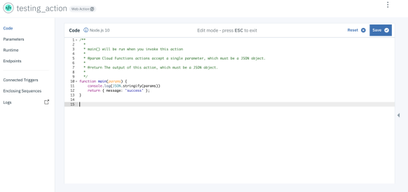

    通过如下命令创建 testing\_actionsequence:

    `ibmcloud fn action create testing_actionsequence –sequence /_/cloudant_test/read,testing_action`


3.最后创建一个名为 cloudantChangeRule 的 rule 将 CloudantTestingTrigger 和 testing\_actionsequence 来建立关联。

`ibmcloud fn rule create cloudantChangeRule CloudantTestingTrigger testing_actionsequence`

命令查看 cloudantChangeRule 的详细信息，如图 20 所示。

**图 20\. 查看 cloudantChangeRule 详细信息**

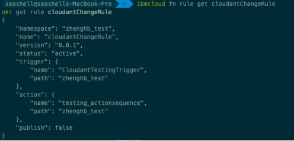

4.测试验证，修改 testing\_db 的 ID 为 001 的文档，添加一个新的 json 字段 `"age": 30`，如图 21 所示。

**图 21.修改存储文档数据**

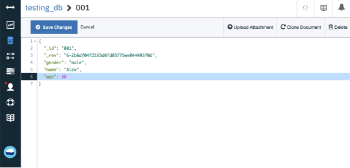

由于数据存储发生变化对应的 action sequence 会被触发执行，通过执行 ibmcloud fn activation poll 来进行实时监控，结果如图 22 所示。

**图 22\. Activation 实时监控结果**

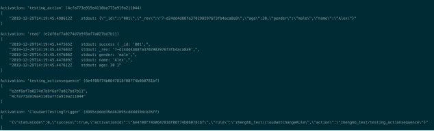

通过上述示例可以看到当数据方式变化时，CloudantTestingTrigger 首先捕捉到数据文档发生变化这一事件，并数据文档 ID 为输入参数传给被关联的 testing\_actionsequence，read Action 会据文档 ID 读取到对应数据并传给后续 Action，testing\_action 将接收到的参数完整打印出来。

## 基于定时触发器 Action 的使用示例

`whisk.system/alarm`s 内置 package 下提供了一系列的定时器，如果想要实现按照特定时间规则来定时触发相关业务功能，可以借助 `/whisk.system/alarms/alarm` 触发器，创建该触发器时提供 crontab expression 并通过 `—param cron <cron expression>` 来配置，同时可以通过 `--param-file` 来读取 json 格式的配置文件。

例如我们创建一个 `cron_config.json`，内容如图 23 所示。

**图 23\. 定时触发器配置文件**

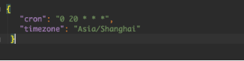

执行如下命令来创建一个名为 cronTrigger 的定时器 trigger。

```
ibmcloud fn trigger create cronTrigger --feed /whisk.system/alarms/alarm --param-file cron_config.json

```

Show moreShow more icon

定时触发器创建完成后，创建 rule 将 cronTrigger 关联到要执行的 Action 或 Action Sequence，这样便实现了一个在中国时间每天晚上 8 点自动触发相关业务处理逻辑的定时器任务。

## 结束语

Serverless 技术有着诸多的优点并且天然适用于事件驱动编程模型，而且通常提供商都提供了许多内置的工具包极大地方便开发人员去快速建立一个能够自动弹性扩展的高可用服务。但是 serverless 技术也并非是适用任何软件开发场景的银弹，目前 Serverless 所存在的一些缺点：

1. 供应商锁定 – 由于各大云厂商对于 serverless 都有着自己的解决方案，因此各个 Serverless 产品的互操作性较差。这也就意味着不同平台间的部署迁移将不是一件容易实现的事情。
2. 鉴于 Serverless 的初始化和启动只有当发生实际请求时按需进行的，冷启动带来的响应延时（可能为秒级）是一个不可忽视的性能瓶颈。针对这一问题，目前大多 Serverless 的平台在首次启动并执行完后会在后续的一断时间内仍旧保持启动状态，确保在一段时间间隔内的请求能够拥有较短的响应时间。
3. Serverless 的系统级限制，例如对于单个执行时长有着明确的限制，一旦超过限制时长运行程序会被强制停止，因此对于需要长时间执行的任务 Serverless 并不是一个合理的解决方案。关于 IBM Cloud Functions 的系统级限制详细信息参考 [IBM Cloud Functions 系统限制说明](https://cloud.ibm.com/docs/openwhisk?topic=cloud-functions-limits)。

Serverless 技术虽然有着十分广阔的前景和可能性，但对于庞大且复杂的应用系统很少有单单通过 Serverless 技术来实现的案例。因此比较合理的做法是先鉴别系统中适合转换成 Serverless 的组件或子系统（尤其是有着事件驱动特性的部分），搭配传统的“有服务”实现来混合使用，而非一味地追求大批量、快速的切换所有业务实现到 Serverless 平台。