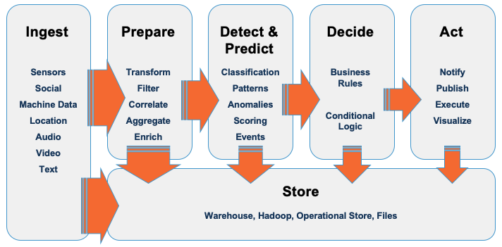
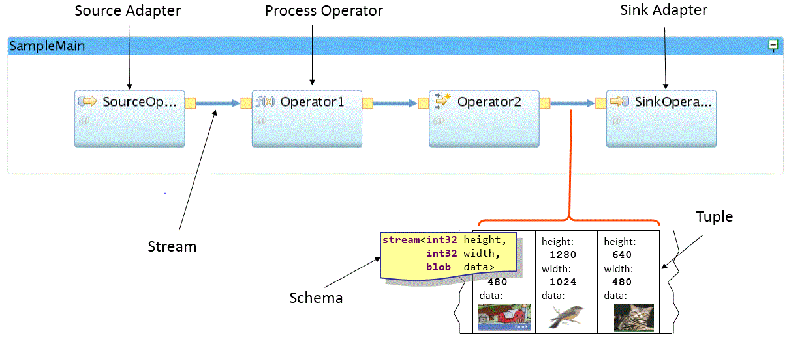
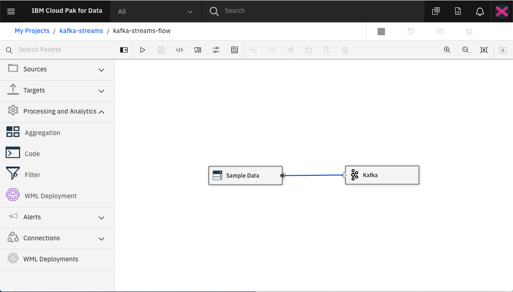
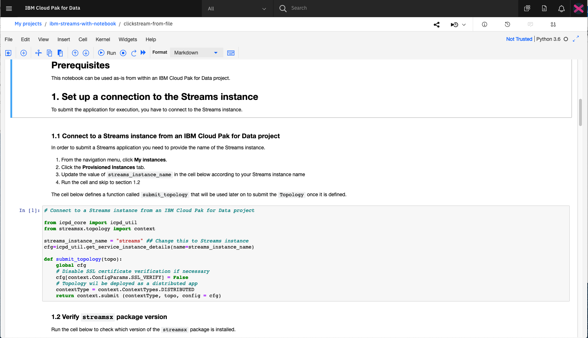

# IBM Streams 简介
一个高级分析平台，支持开发可实时分析数据的应用

**标签:** IBM Cloud Pak for Data,分析,零售

[原文链接](https://developer.ibm.com/zh/articles/introduction-ibm-streams/)

[Richard Hagarty](https://developer.ibm.com/zh/profiles/rich.hagarty), [Mark Sturdevant](https://developer.ibm.com/zh/profiles/mark.sturdevant)

发布: 2020-11-24

* * *

**本文已纳入 [学习路径：IBM Streams 入门](https://developer.ibm.com/zh/series/getting-started-with-ibm-streams-learning-path)**。

级别主题类型**100****IBM Streams 简介****文章**101[无需编写代码即可创建您的第一个 IBM Streams 应用](http://developer.ibm.com/zh/tutorials/create-your-first-ibm-streams-app-without-writing-code)教程201[从 Apache Kafka 中采集数据](https://developer.ibm.com/zh/patterns/add-event-streams-and-a-db-in-python-to-clickstream)Code Pattern301[使用 Python API 构建流应用](https://developer.ibm.com/zh/patterns/build-a-streaming-app-using-ibm-streams-python-api)Code Pattern401[使用机器学习模型对流数据进行评分](https://developer.ibm.com/zh/patterns/score-streaming-data-with-a-machine-learning-model)Code Pattern

## 简介

IBM Streams 是一个高级分析平台，支持开发可实时分析数据的应用程序。通过 IBM Streams，您可以：

- 实时采集和关联来自数千个源的数据。数据格式可以是结构化或非结构化的文本、图像、视频等。
- 以低延迟响应时间连续分析数据。
- 创建可实时为机器学习模型评分的应用程序。这样，您可以在模式和趋势一出现时就检测到并做出响应。

IBM Streams 应用程序可以通过使用 Java、Python 和 C++ 等流行语言来创建。

以下是典型流应用程序的模式：

- 从许多源采集数据。
- 准备要分析的数据。
- 检测并预测数据中的事件和模式。
- 确定如何处理结果并根据结果采取行动。
- 存储任何具有长期价值的数据。

本文是 [学习路径](https://developer.ibm.com/zh/series/getting-started-with-ibm-streams-learning-path) 的第一部分，旨在帮助您更准确地了解 IBM Streams 工作方式，以及如何利用它来构建您自己的流应用程序。

## 用例

Streams 平台擅长分析大量连续数据，而无需事先将其存储起来。 这与分析数据库中的静态数据相反，后者只能事后获得对事件的了解。通过 Streams，您可以在趋势或模式一出现时就检测到，并立即对其做出响应。以下是一些示例用例：

- 支付处理
- 欺诈检测
- 异常检测
- 预测性维护
- IoT 分析
- 点击流分析

数据可以采用多种格式，例如：

- 非结构化文本
- 视频
- 音频
- 地理空间
- 传感器

## 术语和概念

为了更准确地了解流技术的工作方式，很有必要介绍一些对所有 IBM Streams 应用程序非常重要的基本术语和概念。

术语定义操作符操作符在流上执行一些操作。这包括过滤器、聚合器、设置警报以及根据机器学习模型对数据进行评分。源应用程序用于采集流数据的数据源。示例包括 Apache Kafka、RabbitMQ 和 MQTT。流在操作符之间传递的数据。目标流数据的最终输出。目标示例包括 Cloudant®、MySQL 和 Db2® Event Store。 模式流数据在操作符之间移动时的格式。元组流数据中的单个条目或事件。

另外，窗口概念很重要。窗口包含多个元组，这允许应用程序一次分析更大的数据子集。窗口的类型有两种：

- 滑动窗口 – 随着将元组添加到窗口，递增地执行分析。当新元组到达或特定时间段后，元组将被逐个移除。 通常用于移动平均值。
- 翻转窗口 – 在特定时间段或元组数量达到一定值后，将分析所有元组，然后将其从窗口中移除。

## 产品

IBM Streams 在 IBM Cloud Pak® for Data 上可用。流应用程序可以部署在任何公共云、私有云或本地环境中。

注意，IBM 提供了多个 IBM Streams 服务。为避免混淆，此处简要介绍一下：

- [IBM Streaming Analytics](https://cloud.ibm.com/catalog/services/streaming-analytics?cm_sp=ibmdev-_-developer-articles-_-cloudreg) – IBM Streams 的 IBM Cloud® 版本。从开发者的角度来看，这些服务都很相似。
- InfoSphere® Streams – IBM Streams 之前的产品名称。
- [Event Streams](https://cloud.ibm.com/catalog/services/event-streams?cm_sp=ibmdev-_-developer-articles-_-cloudreg) – 基于 Apache Kafka 平台构建的高吞吐量消息总线，目前仅在 IBM Cloud 上可用。
- [Streams 流](https://developer.ibm.com/streamsdev/docs/category/streams-flows/) – 内置到 IBM Streams 中的可视化集成开发环境。
- [streamsx](https://pypi.org/project/streamsx/) – 用于构建 IBM Streams 应用程序的 Python API。

## 工具和语言

开发 IBM Streams 应用程序的方法有多种。

### Streams 流

IBM Streams 附带了一个可视的 IDE，称为 IBM Streams 流。该工具允许您将操作符拖放到画布上，以及通过内置设置面板来修改参数。通过代码操作符，您可以注入自己的 Java、Scala 或 Python 代码来执行诸如过滤或聚合之类的操作。

要试用此工具，需先学习本学习路径中包含的教程： [无需编写代码即可创建您的第一个 IBM Streams 应用](http://developer.ibm.com/zh/tutorials/create-your-first-ibm-streams-app-without-writing-code)。

### Python

IBM Streams 流的一种替代方法是使用 IBM Streams Python API 以 Python 语言编写应用程序。此 API 是由 streamsx Python 包提供。您可以使用自己最喜爱的编辑器以 Python 语言开发应用程序并将其部署在 Streams 运行时上。

#### Jupyter Notebook

如果您正在使用 IBM Cloud Pak for Data，那么还可以使用 Jupyter Notebook 在 Cloud Pak for Data 项目中构建 IBM Streams 应用。IBM Cloud Pak for Data 平台支持与多个数据源、内置分析和机器学习模型集成。

要开始创建您自己的 Notebook，需先学习本学习路径中包含的 Code Pattern： [使用 Python API 构建流应用](https://developer.ibm.com/zh/patterns/build-a-streaming-app-using-ibm-streams-python-api)。

### IBM Streams Processing Language (SPL)

SPL 是专门用于开发 IBM Streams 应用程序的编程语言。您可以使用 Microsoft Visual Studio Code 或 Streams Studio 来创建 SPL 应用程序。本学习路径不会深入介绍 SPL，但需要注意的是，使用 SPL 为 Streams 开发提供了最先进的功能集。

有关 SPL 和 Streams Studio 的更多信息，参阅：

- [SPL 参考](https://www.ibm.com/support/knowledgecenter/en/SSCRJU_5.3/com.ibm.streams.splangref.doc/doc/spl-container.html)
- [创建 SPL Streams 应用](https://github.com/IBMStreams/streamsx.documentation/blob/gh-pages/docs/spl/quick-start/qs-0.markdown)

## 结束语

本文是 [学习路径](https://developer.ibm.com/zh/series/getting-started-with-ibm-streams-learning-path) 的第一部分，旨在指导您完成构建 IBM Streams 应用程序的步骤。本系列将介绍创建流应用的各种方法以及如何浏览支持流应用的平台。您还将学习如何与 [Apache Kafka](https://kafka.apache.org) 之间进行流传输，以及如何通过机器学习模型来丰富流数据。

让我们开始吧。第一步是 [无需编写代码即可创建您的第一个 IBM Streams 应用](http://developer.ibm.com/zh/tutorials/create-your-first-ibm-streams-app-without-writing-code)。

本文翻译自： [Introduction to IBM Streams](https://developer.ibm.com/articles/introduction-ibm-streams/)（2020-09-24）