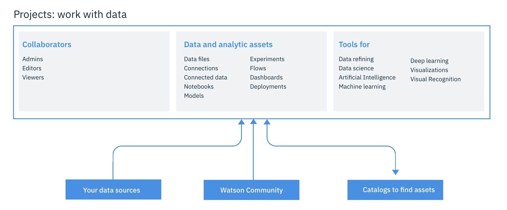
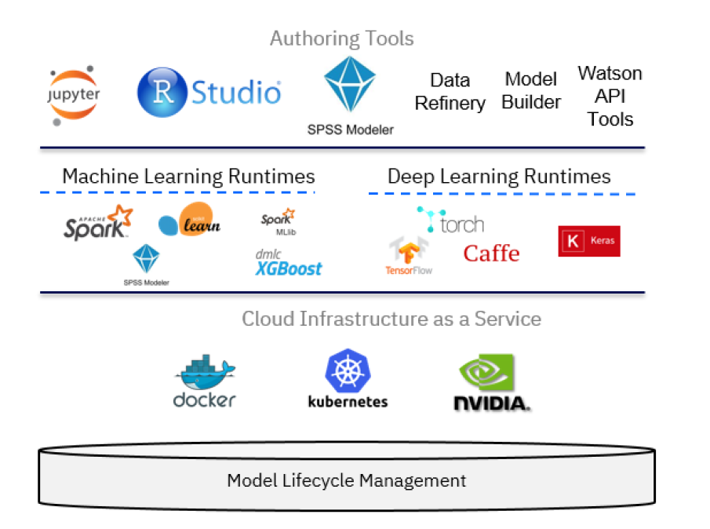

# IBM Watson Studio 简介
了解 IBM Watson Studio 和机器学习服务的基础知识

**标签:** 人工智能,数据科学,机器学习,深度学习

[原文链接](https://developer.ibm.com/zh/articles/introduction-watson-studio/)

[Richard Hagarty](https://developer.ibm.com/zh/profiles/rich.hagarty), Einar Karlsen

发布: 2021-01-11

* * *

本文已纳入 [Watson Studio 入门](https://developer.ibm.com/zh/series/learning-path-watson-studio/) 学习路径。

级别主题类型**100****IBM watson studio 简介****文章**101[使用 IBM Watson Studio 实现数据可视化、准备和转换](https://developer.ibm.com/zh/tutorials/watson-studio-data-visualization-preparation-transformation/)教程201[在 IBM Watson Studio 中自动构建模型](https://developer.ibm.com/zh/tutorials/watson-studio-auto-ai/)教程301[在 IBM Watson Studio 中创建 SPSS Modeler 流程](https://developer.ibm.com/zh/tutorials/watson-studio-spss-modeler-flow/)教程401[在 IBM Watson Studio 中使用 Jupyter Notebook 构建模型](https://developer.ibm.com/zh/tutorials/watson-studio-using-jupyter-notebook/)教程

## 简介

IBM® Watson™ Studio 学习路径演示了使用 IBM Watson Studio 预测客户流失的各种方法。从使用 AutoAI 实验工具的半自动方法，到使用 SPSS Modeler 流的图解方法，再到使用 Jupyter Notebook for Python 的完全编程样式，都一一涉及。

此学习路径中的所有教程都遵循数据科学（和数据挖掘）方法的主要步骤，例如，跨行业数据挖掘标准流程 (CRISP-DM) 和 IBM Data Science Methodology。这些教程的重点是数据理解、数据准备、建模、评估和部署用于预测性分析的机器学习模型方面的任务。它们以 [Kaggle](https://www.kaggle.com/sandipdatta/customer-churn-analysis) 上提供的客户流失数据集和 Notebook 为基础，然后使用 IBM Watson Studio 工具套件提供的 AutoAI、SPSS Modeler 和 IBM Watson Machine Learning 服务来演示解决相同问题的备选方法。该学习路径说明了如何使用概要分析工具和 IBM Watson Studio 的仪表板来理解数据，以及如何使用优化工具来处理简单的数据准备和转换任务。

## Data Science Methodology

IBM 定义了一种 [轻量级 IBM Cloud Garage 方法](https://developer.ibm.com/technologies/data-science/articles/the-lightweight-ibm-cloud-garage-method-for-data-science/)，它包括一个将各个技术组件映射到参考架构的流程模型。此方法不包括任何需求工程或设计思维任务。由于最初很难定义项目的架构，因此该方法支持在流程模型期间更改架构。

每个阶段在整个方法体系中都起着至关重要的作用。在某种抽象程度上，可以将它看作是 [CRISP-DM](https://www.the-modeling-agency.com/crisp-dm.pdf) 数据挖掘方法概述的工作流程的优化。

根据这两种方法，每个项目都以 _业务理解_ 开始，其中定义了问题和目标。在 IBM Data Science Method 中，紧接着是 _分析方法_ 阶段，数据科学家可以在此定义解决问题的方法。然后，IBM Data Science Method 会继续执行三个阶段： _数据需求_、 _数据收集_ 和 _数据理解_，而在 CRISP-DM 中，这三个阶段由单个 _数据理解_ 阶段来表示。

数据科学家理解了数据并掌握足够的数据以着手处理之后，就会进入 _数据准备_ 阶段。这个阶段通常十分耗时。数据科学家将大约 80% 的时间都用在此阶段上，执行数据清理和特征工程等任务。在这种情况下，经常会用到“数据整理”一词。在清理数据期间和之后，数据科学家通常会进行探索，例如，通过描述性统计获取对数据的总体认知，通过聚类查看数据的关系和潜在结构。这个过程通常会迭代几次，直到数据科学家对其数据集感到满意为止。

在模型训练阶段，机器学习用于构建预测模型。在对模型进行训练后，通过统计手段（例如预测准确性、敏感性和特异性）进行评估。在认为模型足以满足要求后，部署该模型，并将其用于对不可见数据进行评分。IBM Data Science Methodology 额外增加了一个 _反馈_ 阶段，用于从模型使用中获取反馈，然后将其用于改进模型。这两种方法本质上都是高度迭代的。

在此学习路径中，我们将侧重于从数据理解开始的各个阶段，然后继续准备数据、构建模型、评估模型，接着再部署和测试模型。目的是开发模型来预测客户流失。有关分析流失原因以改善业务这些方面，不在本学习路径的范围之内。这意味着我们将使用各种分类模型，这些模型可以观察由一组特征定义的客户，并预测该特定客户是否有流失的风险。

## IBM Watson Studio

我们在所有任务中都使用了 [IBM Watson Studio](https://dataplatform.cloud.ibm.com/docs/content/getting-started/welcome-main.html)。它为您提供了 **环境** 和 **工具**，让您能够通过协同处理数据来解决业务问题。您可以选择所需的工具来分析数据并使之可视化，清理和塑造数据，摄取流式数据，或者创建、训练并部署机器学习模型。

利用 IBM Watson Studio，您可以：

- 创建 [项目](https://dataplatform.cloud.ibm.com/docs/content/wsj/manage-data/manage-projects.html?audience=wdp) 来组织资源（例如数据连接、数据资产、合作者和 Notebook），进而实现分析目标。

- 通过指向云或本地数据源的 [连接](https://dataplatform.cloud.ibm.com/docs/content/wsj/getting-started/assets.html#connection) 访问数据。

- [上传文件](https://dataplatform.cloud.ibm.com/docs/content/wsj/manage-data/add-data-project.html) 到项目的对象存储中。

- 创建和维护 [数据目录](https://dataplatform.cloud.ibm.com/docs/content/wsj/catalog/manage-catalog.html) 以发现数据、建立索引和共享数据。

- 通过清理和塑造数据来 [优化数据](https://dataplatform.cloud.ibm.com/docs/content/wsj/refinery/refining_data.html) 以准备进行分析。

- 通过创建适用于 Python 或 Scala 的 Jupyter Notebook 来运行数据处理代码，然后查看内联结果，执行 [数据科学](https://dataplatform.cloud.ibm.com/docs/content/wsj/analyze-data/data-science.html) 任务。您也可以使用 RStudio for R。

- 使用 Streams Designer 工具来摄取并 [分析流](https://dataplatform.cloud.ibm.com/docs/content/wsj/streaming-pipelines/overview-streaming-pipelines.html) 数据。

- 创建、测试和部署 [机器学习](https://dataplatform.cloud.ibm.com/docs/content/wsj/analyze-data/ml-overview.html) 与 **深度学习** 模型。

- 通过训练深度学习模型来识别图像内容，从而 [对图像进行分类](https://dataplatform.cloud.ibm.com/docs/content/wsj/analyze-data/visual-recognition-overview.html)。

- 无需编码即可创建和共享数据可视化 [仪表板](https://dataplatform.cloud.ibm.com/docs/content/wsj/getting-started/assets.html#dashboard)。

从技术上讲，IBM Watson Studio 基于各种开源技术和 IBM 产品，如下图所示。

在数据科学的背景下，IBM Watson Studio 可以被视为一个集成的多角色协作平台，在解决数据科学问题的过程中为开发者、数据工程师、业务分析师和数据科学家提供支持。对于开发者角色，在构建使用机器学习服务的应用程序时，也可能会用到 IBM Cloud 平台的其他组件。而数据科学家则可以使用各种工具来构建机器学习模型，包括：

- [AutoAI Model Builder](https://dataplatform.cloud.ibm.com/docs/content/wsj/analyze-data/autoai-overview.html?audience=wdp&context=wdp)：无需编程技能的图形工具
- [SPSS Modeler 流](https://dataplatform.cloud.ibm.com/docs/content/wsd/spss-modeler.html)：采用图解样式
- [Rstudio](https://dataplatform.cloud.ibm.com/docs/content/wsj/analyze-data/rstudio-overview.html) 和 [Jupyter Notebooks](https://dataplatform.cloud.ibm.com/docs/content/wsj/analyze-data/notebooks-parent.html?linkInPage=true)：使用编程样式

除了这三个主要组件，您还可以使用：

- [IBM Cloud Object Storage](https://www.ibm.com/cn-zh/cloud/object-storage)：存储用于训练和测试模型的数据集
- [Data Refinery](https://dataplatform.cloud.ibm.com/docs/content/wsj/refinery/refining_data.html)：转换数据集
- [Cognos 仪表板](https://www.ibm.com/support/knowledgecenter/en/SSEP7J_11.1.0/com.ibm.swg.ba.cognos.ug_ca_dshb.doc/ca_waca_tut_overview_for_docs.html)：生成可视化效果

有关其他背景，可查看可用于 IBM Watson Studio 的 [“操作方法”视频的详尽列表](https://dataplatform.cloud.ibm.com/docs/content/wsj/getting-started/videos.html)。

## IBM Watson Machine Learning 服务

IBM Watson Studio 的关键组件是 IBM Watson Machine Learning 服务及其 REST API 集，可以从任何编程语言调用这些 API，以便与机器学习模型进行交互。IBM Watson Machine Learning 服务的重点是部署，但是您可以使用 IBM SPSS Modeler 或 IBM Watson Studio 来编写和使用模型及管道。SPSS Modeler 和 IBM Watson Studio 均使用 Spark Mllib 和 Python scikit-learn，并提供从机器学习、人工智能和统计数据中获取的各种建模方法。

使用以下链接获取有关 Watson Machine Learning 的更详细信息：

- [Watson Machine Learning 概述](https://dataplatform.cloud.ibm.com/docs/content/wsj/analyze-data/ml-overview.html)
- [Watson Machine Learning API](https://watson-ml-api.mybluemix.net/)

## 结束语

本文提供了有关 IBM Data Science Methodology 的背景信息、IBM Watson Studio 可以发挥的作用，并预览了该学习路径中将涵盖的内容。

该学习路径的一个目标就是展示除了可用于 Python、Scala 或 R 的 Jupyter Notebook 外，IBM Watson Studio 如何提供备选方法通过类似的流程，这些方法可能速度更快，并且无需编程技能即可实现。本质上，这些机制包括 SPSS Modeler 流，它支持数据科学家以纯粹图形化的方式通过定义流来创建模型，同时还包括 IBM Watson Studio 中的 IBM AutoAI 图形工具，该工具通过提供半自动方法来创建、部署以及测试机器学习模型，比 SPSS 更进一步。与此同时，该学习路径还展示了 IBM Watson Studio 如何提供现成可用的数据概要分析、可视化和转换功能，同样也无需任何编程操作。

要继续该学习路径，可转至本系列的第一个教程 [使用 IBM Watson Studio 实现数据可视化、准备和转换](https://developer.ibm.com/zh/tutorials/watson-studio-data-visualization-preparation-transformation/)。

本文翻译自： [Introduction to IBM Watson Studio](https://developer.ibm.com/articles/introduction-watson-studio/)（2019-09-03）