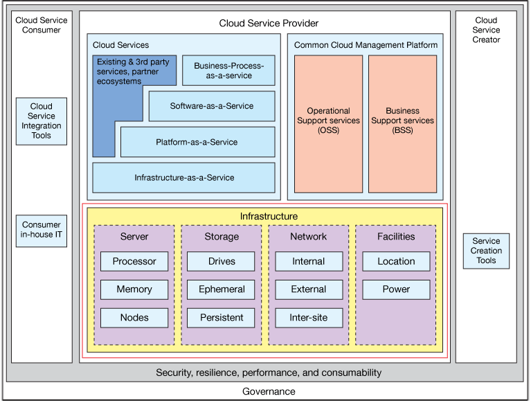

# IBM 云技术：如何结合使用所有技术
探索一些基本概念

**标签:** IBM Cloud,云计算

[原文链接](https://developer.ibm.com/zh/articles/cl-cloud-technology-basics/)

Franck Barillaud, Chuck Calio, John A. Jacobson

更新: 2017-11-28 \| 发布: 2017-06-19

* * *

云计算代表了IT资源的创建，交付和使用方式的巨大转变。云计算技术也是全球 IT 领域增长和创新的核心基础推动力。但是，云计算解决方案领域可能让人难以理解，该领域拥有大量可能并不总是让人一目了然的新术语和技术。虽然您可能已经在使用互联网和云计算来处理移动电子邮件等任务， 但是我们认为进一步深入探讨云计算将是有益的。

例如，本文将探索一系列云技术：基础架构即服务 (IaaS)、平台即服务 (PaaS)、软件即服务 (SaaS)、私有云、混合云、IBM® Cloud™ 、SoftLayer® 、SoftLayer 中的 IBM Power Systems™ 、OpenStack、软件定义的环境 (SDE)、Docker、应用编程接口 (API)、Cloud Foundry、DevOps、混合云，以及 IBM Power Development Platform (PDP)。它们都是什么？如何结合使用所有这些技术？可以在何处和如何获得它们？如何使用它们？

我们知道您有许多疑问 — 但不用担心，您来对地方了！我们承认，我们向市场中推出了许多围绕云计算的新技术。本文将介绍这些主题，阐明它们的概念，并提供一些常见用例来演示如何结合使用它们。我们首先将介绍一些重要的基本概念，然后更深入剖析一些新领域。因为我们在为 IBM 效力，所以我们主要关注围绕云计算解决方案的 IBM 示例，因为这是我们擅长的特定领域。

## 基本的云计算概念

云计算通常称为云，指的是基于按使用付费的规则，通过互联网按需提供计算资源 — 从应用程序到数据，再到硬件、软件，甚至数据中心在内的一切资源。此外，云计算还可能包含快速动态提供和撤销 IT 资源的能力、一种自助式 IT 方法（而不是让用户通过 IT 部门访问 IT 资源），以及对业务效率的实现（通过广泛共享资源并按非常精细的增量方式提供这些资源）。

### 服务模型

- **基础架构即服务**：IaaS为用户提供基本的计算资源，包括服务器，网络，存储和数据中心空间，以自助服务和按次付费为基础。IaaS 通常被称作云计算的基础层。在典型的 IaaS 云模型中，提供给用户的基本计算资源要么是 _裸机的_（专用），要么是 _虚拟的_（共享）。IaaS可以被在IaaS基础平台之上提供更具体或更先进的云服务的用户或服务提供商利用。IaaS 市场中的一些著名供应商包括 IBM、Amazon、Oracle、Microsoft® 、Hewlett-Packard、Fujitsu、Rackspace、Computer Sciences Corporation (CSC)、Google 和 Joyent。
- **平台即服务**：PaaS 基于 IaaS 而构建，提供了基础架构与平台软件的一种组合；这通常意味着基于云的应用程序开发、中间件、数据库软件和合适的硬件环境，为构建、测试和交付 Web（云）应用程序的完整生命周期提供所需的所有支持资源 — 而没有购买、管理和维护底层硬件和平台软件的成本和复杂性。
- **软件即服务**：SaaS 为运行在云中的应用程序提供基于网络的访问。通常，在 SaaS 解决方案中，许多客户端共享云交付的软件和数据库。所以，SaaS 解决方案的一个关键属性是它们是为 _多租户_ 场景而构建的，这意味着许多人可以同时安全地使用并共享软件、硬件和数据。一些非常常见的 SaaS 应用程序包括客户关系管理 (CRM) 系统、企业资源规划 (ERP) 系统或其他特定于行业的应用程序。IBM、Oracle、Microsoft 和 Salesforce.Com 都是著名 SaaS 提供商。

### 部署模型

- **私有云**：私有云是云计算系统，通常在防火墙后面建立一套非常严格的技术，可以控制对云服务和数据的访问。以下是一个具体的示例：一家财富 500 强公司启用了 IaaS、PaaS 或 SaaS 解决方案，并将其内部提供给自己的员工使用。大部分公司选择使用私有云解决方案作为采用云的第一步，以确保对他们的云资源的访问是受控的。 作为一种合乎逻辑的演变，通常私有云将会演变为跨数据中心管理工作负载，同时使用私有云和公共云， — 从而创建混合云。
- **公有云**：公有云是一种通常在公共域中设置的云计算系统，它也可以包含安全技术来实现对公有云服务和特定于用户的数据的受控访问。流行的公有云示例包括 IBM SoftLayer、Amazon、Google、Microsoft Azure、Rackspace 等。例如，如果使用 Google 或 Bing 进行搜索，或者使用了 Google 的 Gmail，那么您已经在使用公有云。
- **混合云**：混合云使用的技术可让您将云应用程序和数据（跨越传统的内部IT系统，私有云服务以及数据和公共云服务）进行组合或”缝合”。事实上，私有云通常无法独立于公司的其他企业内部的非云 IT 资源和公有云而存在。大部分拥有私有云的公司将演化为管理跨数据中心、私有云和公有云的工作负载 — 从而创建混合云。混合云应用程序通常涉及到使用安全的云连接技术，以及 API 和 API 管理解决方案。

## 云架构

云计算用户可以基于即用即付规则，利用来自各种不同供应商的 IaaS、PaaS 和 SaaS，所有这些资源都能快速地、远程地进行访问。开发人员、测试人员和运营人员可以使用云的 PaaS 功能，非常快地创建并交付新的云应用程序和服务。可以在各种各样的云平台上实现特定于企业或行业的 SaaS 解决方案。此外，用户可以选择使用私有云模型还是公有云模型，甚至可以通过使用混合云来混搭两种模型。

下图表示一种完整的云计算参考架构（在本例中是 IBM 云计算参考架构）。从方框的下部可以看到，要构建一个云，首先需要配备硬件（服务器、存储、网络和相关设备）。接下来，添加云软件（例如 OpenStack）来帮助创建和交付一些基本的云功能（比如 IaaS），并创建和交付针对云的运营和业务支持服务。然后，添加一个 PaaS 解决方案，比如 IBM Cloud 。最后，可以添加或交付 SaaS 应用程序，结合使用它们来创建业务流程，并将其作为服务提供。安全性、性能、扩展、灾备能力和治理也是云解决方案的关键元素。

下图的左侧显示了云用户（例如最终用户）的视图。右侧显示了云内容、应用程序和云服务制作者的视图。

##### IBM 云计算参考基础架构

## 部署模型和示例

### 私有云

包括 IBM 在内的许多公司实现私有云解决方案的典型方式通常是，构建裸机或虚拟化云基础架构的组合，然后添加基于受限访问规则来使用 PaaS 或 SaaS 模型向用户提供云软件的功能。值得注意的是，私有云解决方案可以在多种类型的硬件基础架构（x86、IBM Power® 、IBM Systems z® 、IBM Storage 等）上运行，而且通常支持多种管理程序（KVM、IBM PowerVM® 、IBM PowerVC、IBM z® /VM、VMware、Microsoft Hyper-V、Citrix Xen），以便充分利用通过虚拟化和整合所获得的业务效率。IBM 本身就是采用许多私有云解决方案的公司之一。私有云实质上仅适合于一组特定用户访问，而且可能需要遵守法律和治理限制，还有可能不会向一般大众开放。PayPal 使用的基于 OpenStack 的私有云技术是第二个例子。

### 公有云

IBM Power Development Cloud (PDP) 是一个公有云平台。PDP 以前称为 Virtual Loaner Program (VLP)，可以帮助满足许多（但不是所有）典型 IBM 业务合作伙伴® 对以非常低的成本远程访问 IBM Power Systems 硬件和中间件的需求。IBM PDP Cloud 非常受欢迎，因为它使用户（例如 ISV 或其他业务合作伙伴）能快速高效地在 IBM Power 硬件和 IBM 软件上访问并开发解决方案，而且成本极低，甚至是免费，这些使得业务合作伙伴能专心创建自己的下一代创新解决方案。

### 公有云和私有云

SoftLayer（于 2013 年 7 月被 IBM 收购）同时提供了公有云和私有云平台。SoftLayer 在全球越来越多的数据中心和网络点提供云 IaaS。SoftLayer 客户既有小型 Web 初创公司，也有全球企业。产品和服务包括裸机和虚拟服务器、网络、直接可用的大数据解决方案、私有云解决方案等。SoftLayer 的独特优势包括：业界第一个嵌套网络拓扑结构实现了真正的带外访问；易用的客户门户和可靠的 API 实现了对所有产品和服务管理选项的完全远程访问。

### IBM Cloud Managed Services

[IBM Cloud Managed Services™](https://www.ibm.com/services/cloud/managed) 是一个完全托管、高度安全的 IaaS 云，而且针对关键企业工作负载进行了优化。它提供了独一无二的实例级虚拟机 (VM) 正常运行时间 SLA 高达 99.95%，以及私有云的许多优势（比如针对专用服务器和存储的选项，同时还提供了灵活的扩展能力和云的经济效益）。可以通过 IBM Cloud Managed Services 访问在 IBM Power Systems 环境中运行的 IBM AIX®。

### 其他示例

可以在 [IBM Cloud Computing](https://www.ibm.com/cloud/solutions) 或 [OpenStack](http://www.openstack.org/user-stories/) 上找到其他许多云客户用例示例。

## 免费技术和方法

开发和运营 (DevOps) 是一种软件开发方法，注重软件开发人员、客户和其他信息技术 (IT) 专业人员之间的紧密合作，同时快速创建和交付新的云服务。DevOps 经过了优化，可以帮助解决软件开发、客户需求与实际的云 IT 运营和运行时平台之间的相互依赖性。通过与分析结合，DevOps 与分析相结合，能轻松地支持下一代云服务的创建和持续交付。云 PaaS 环境（比如 IBM Cloud）通常针对快速应用程序开发进行了优化，它们提供的服务类型使它们与众不同，而且还能轻松加入到完整的 DevOps 环境中。

### 云服务

云服务是专为在云运行时环境中运行而编写的云原生应用程序（例如，一个专为支持在 OpenStack 环境中执行而编写的新的云分析应用程序）。云服务通常是使用也支持 DevOps 的云 PaaS 环境来编写和部署的。理想情况下，云服务可部署在多个满足特定需求（例如性能、规模等）的云环境中。云服务也可由其他更加新的、不同的云服务在其他环境中重用。 云服务通常存储在云提供商的服务目录中，与云运营和业务支持层的需求一致且相互作用。

### （云之前的）整体式软件应用程序

整体式应用程序也可以重新设计为在云平台上运行。为此，通常会根据在虚拟机中运行的整体式软件来创建一个云虚拟设备，并包含一些特定的（云启用应用程序时会用到的）脚本和预先打包操作。

### Cloud Foundry

[Cloud Foundry](http://pivotal.io/platform-as-a-service/pivotal-cloud-foundry) 是一个开源的云计算 PaaS 解决方案，最初由 VMware 开发，现在归 Pivotal Software（VMware 的子公司）所有。

### IBM Cloud

[IBM Cloud](https://cloud.ibm.com/?cm_sp=ibmdev-_-developer-articles-_-cloudreg) 是一款基于 Cloud Foundry 开源项目的 PaaS 产品。它支持多种编程语言和服务，还支持集成式 DevOps，以便在云上构建、运行、部署和管理应用程序。IBM Cloud 在 SoftLayer 基础架构上运行。

### IBM UrbanCode

[IBM UrbanCode](https://www.ibm.com/us-en/marketplace/application-release-automation) 编排并自动化应用程序、中间件配置、数据库更改在开发、测试和生产环境中的部署。它旨在促进敏捷开发中的快速反馈和持续交付，同时提供生产中所需的审计跟踪、版本控制和审批功能。

### Docker

[Docker](https://www.docker.com/) 是一个供开发人员和系统管理员构建、发布和运行分布式云应用程序的开放平台，这些应用程序通常称为云服务。Docker 应用程序在 Docker 提供的运行时引擎（也称为 Docker 容器）内运行。Docker 生态系统包括一个 Docker 容器引擎、一个便携的轻量级运行时和打包工具，以及一个 Docker Hub（这是一个用于共享应用程序和自动化工作流的云服务）。Docker 在 x86、IBM Power、IBM z Systems™ 和 ARM 平台上都受到支持。

### OpenStack

[OpenStack](https://www.openstack.org/) 是一个开源的云操作系统，控制了一些大型的计算、存储和网络资源，所有资源都通过一个仪表板进行管理，该仪表板为管理员提供了控制权，同时使用户能够通过 Web 界面配备资源。OpenStack IT 资源是通过 API 提供给开发人员的。OpenStack 可用于管理一个数据中心或跨多个数据中心（地区）的 IT 资源。

### 软件定义的环境

软件定义的环境 (SDE) 是一种 IT 基础架构（同时包含硬件和系统软件），支持针对不断变化的工作负载来调整计算、网络和存储资源。许多云工作负载或用例的行为模式可能都是高度动态的。随着时间的推移，云工作负载 IT 资源的使用需求可能发生巨大变化。也可以使用 SDE 技术帮助创建底层云硬件，使其成为高度自适应的响应式云计算系统。

## 混合云计算

现在，让我们将注意力放在混合云的特殊情况上，在混合云中，您可以混搭使用公有云和私有云中的云服务。首先应该注意到的是，大量传统企业具有某种类型的现有 IT 基础架构和系统，这使得将所有资源都迁移到云变得不切实际。许多企业无法将所有旧式应用程序都迁移到云。所以，IBM 和其他公司正在改进混合云模型，使传统 IT 能够与外部甚至内部云配对和集成。以下是一些与创建并交付混合云解决方案有关的基本技术。

- **基于云的集成**：这种方法能安全地连接和集成云应用程序和数据，使开发人员和用户能够访问它们，并将它们与现有记录系统或传统的非云 IT 系统和数据相结合。基于云的集成解决方案中通常会使用安全的连接和软件 API。
- **云服务连接解决方案**：实现云和企业内部的数据及应用程序的简单、快速、安全的连接。安全连接通常是这样实现的：在所有参与的系统间使用特殊软件或行业标准来建立连接。一个例子是使用 IBM Cloud 安全连接器将 IBM Cloud 云 PaaS 环境与 IBM Power Systems 或 IBM z Systems 上的 IBM DB2®® 数据相连。
- **应用编程接口 (API)**：一组用于构建软件应用程序的例程、协议和工具。API 会公开定义的资产、数据或服务，供公众使用。API 是服务和产品通过规定的接口进行相互通信的方式。API 使公司能向外部第三方开发人员、业务合作伙伴和公司的内部部门开放数据。应用程序开发人员可以轻松利用 API，并通过 Web 浏览器、移动应用程序或设备来调用它。产品目录、电话清单、保险案例、订单状态和银行贷款利率都是通过 API 公开的一些服务。API 根据业务需求而不断变化，以包含新的功能，同时向开发人员告知这些更改。建立 API 之后，API 更像是一款产品，而不是一种单纯的技术能力。
- **API 管理**：一个在安全的、可扩展的环境中发布、推广并监督 API 的流程。
- **IBM DataPower® Gateway**：API 管理系统的一个例子，是一个专为移动、云、API、Web、面向服务的架构 (SOA) 和企业对企业 (B2B) 工作负载而构建的安全和集成平台。

## 示例用例

### 在受保护的测试环境中使用 IaaS 进行应用程序开发

应用程序团队需要访问新硬件，以模拟用于测试的生产条件，同时不影响实际生产。在企业传统的内部硬件环境中，这是一个非常耗时且很难以高效、隔离的方式完成的任务。

#### 业务目标

通过使用私有、公有或混合云 IaaS 产品，公司可以显著减少或完全消除大额资本开支，加速新应用程序软件的开发。

#### 必要的条件和解决方案属性

- 云硬件和平台基础架构：必须优化基础架构，以满足各个应用程序开发人员的需求。
- 监控和管理：云提供商应该提供工具来实时监控并管理测试环境。
- 可伸缩性：当测试条件改变时，云提供商应该公开 API 或工具，根据资源来扩大或缩小环境。
- 互操作性：提供一致、符合开放标准的访问和管理接口。需要开放标准格式和接口来请求服务属性的定价和质量。

#### 可用来创建这些环境的 IBM 产品

- [SoftLayer](http://www.softlayer.com/)
- [IBM Power Development Platform](https://www-304.ibm.com/partnerworld/wps/servlet/ContentHandler/stg_com_sys_power-development-platform)
- [IBM Cloud Managed Services](https://www.ibm.com/services/cloud/managed)
- [IBM Cloud Manager with OpenStack for Power Systems](http://www-03.ibm.com/systems/power/solutions/cloud/openstack/)

### 使用 PaaS 实现持续交付

持续交付是一种软件开发实践，它支持自动交付软件和频繁的发布，只需很少或者完全不需要人工干预。从部署管道到发布的过程中，软件必须通过一组验证和条件。持续交付实践的主要目标是，实现以低风险和接近零的宕机时间，可靠、快速且反复地向用户推送软件更新和增强的能力。

#### 必要条件

- 自动化测试：单元、集成和系统测试应该完全自动化。
- 持续集成：一种将所有开发人员的版本集成到一个版本中的开发实践。每次签入都会通过一次自动化构建进行验证，以检测问题。
- 自动化部署：要促进自动化测试和持续集成，必须有一个允许自动化部署的平台，以便为构建和测试建立环境运行时和服务。
- 面向服务的架构 (SOA)：允许使用单独的组件架构并促进 SaaS 模型的实现。以 SOA 方式交付软件使团队能专注于特定领域，提供了对各个领域执行更改和进行修复的能力，而无需修改整体式应用程序。
- 文化改变：这是一种从人工控制和各自为营向支持自动化和交付流水线的环境的思维转变。必须调整为代码建立分支等实践，以适应持续交付模型。

#### IBM 产品

- [IBM Cloud](https://cloud.ibm.com/?cm_sp=ibmdev-_-developer-articles-_-cloudreg)
- [IBM UrbanCode](https://developer.ibm.com/urbancode/)
- [支持 Docker 的 IBM Cloud](https://developer.ibm.com/bluemix/2014/12/04/ibm-containers-beta-docker/)

### 混合云

混合云和云集成的主要目标是，促进以安全可靠的方式，使用企业内部的记录系统在云中创建新的互动参与系统。

云集成通过安全地集成云和企业内部的应用程序及数据，帮助保护您对记录系统的投资。

#### 必要条件

- 安全性：从应用程序访问企业内部的数据应该在一个加密事务中完成。在执行一些工作期间，数据也可能缓存在云中。因此，需要执行适当的加密和数据屏蔽。
- 可靠访问：移动和 Web 应用程序的性质要求，数据访问是可靠的且在合理的时间内完成。
- 订阅模型：允许根据事务或用户将服务分解为不同的访问层。
- 连接器：云集成服务应提供与已知来源建立连接的连接器。否则，应提供软件开发工具包 (SDK) 来帮助创建自定义连接器。
- 监控和管理：用户应能监控和管理对数据源的访问。

#### IBM 产品

- [IBM Cloud 集成服务](https://cloud.ibm.com/?ace_base=true/#/store/serviceOfferingGuid=c2e6d7b9-976b-422e-88bf-0ebe5224d91b&cm_sp=ibmdev-_-developer-articles-_-cloudreg)
- [IBM Aspera Sync](https://www.ibm.com/us-en/marketplace/aspera-sync)
- [IBM DataPower® Gateway](http://www-03.ibm.com/software/products/en/datapower-gateway)
- [IBM API Connect](https://www.ibm.com/cloud/api-connect?cm_sp=ibmdev-_-developer-articles-_-cloudreg)

### 软件即服务

SaaS 使您能通过一种按使用付费、弹性的容量技术和业务交付模型来使用在云基础架构上运行的软件。SaaS 解决方案的主要目标是加快新解决方案的采用速度，降低运营团队的成本并提供对应用程序的自助访问。

#### 必要条件

- 一个与 SaaS 软件相结合的、可靠的、经过优化的云 IaaS 环境。
- 可用性和正常运行时间。将您的数据迁移到云中可能增加复杂性和发生故障的可能性。应用程序需要保证数据库后端将在至少 99.999% 的时间里响应执行操作的请求。
- 使用计量、监控和计费软件是提供即用即付能力的关键部分。
- 延迟和响应时间：用户期望云和数据库（尤其是后者）能够非常快地进行响应。支持云的基础架构（包括数据库和互联网本身）应提供一致的响应时间。
- 安全性：使用公有云提供商或通过公共网络传输数据时，必须特别注意确保安全性。公有云提供商必须拥有经过备案和审计的流程来确保数据安全性。

#### IBM 产品

IBM 提供了 100 多个 SaaS 解决方案，以及 [SoftLayer](http://www.softlayer.com/)、 [IBM Cloud](https://cloud.ibm.com/?cm_sp=ibmdev-_-developer-articles-_-cloudreg) 和 [IBM Cloud Continuous Delivery](https://cloud.ibm.com/catalog/services/continuous-delivery?cm_sp=ibmdev-_-developer-articles-_-cloudreg)。

## 尝试结合使用所有技术

云的最终目的是使用并交付 IT 服务（基础架构、平台和软件），供需要使用它们或授权使用它们的用户进行使用。通常，云计算业务模型（即用即付）与传统的以 IT 产品为中心的业务模型完全不同，传统模型可能需要大量前期资本开支。另外，与以前的提前购买大量 IT 容量的传统模型相比，云基础架构的性质使其适合以更小、更高效、高度虚拟化的软硬件单元形式进行销售和采购。

云计算系统通常是基于供应商硬件和系统软件（管理程序等）来构建的，经常使用涵盖计算、存储和网络资源的云操作环境，比如 OpenStack。构建云操作环境后，可以将特定的云 IT 服务或解决方案提供给用户，例如通过来自 IBM 的 IBM Cloud 提供了 PaaS，或者通过 IBM PDP 获取一些 IBM POWER8™ IaaS 容量，并使用 SoftLayer 公有云提供给一般大众。也可以将 SDE 技术添加到云计算系统环境中（通常添加到基础架构上），并将它们集成到云操作环境（例如 OpenStack）中，使云计算系统更能适应和响应不断变化的工作负载和用例业务需求。当然，不使用 SDE 也能创建云。但是，SDE 技术能实现更加自适应和响应式的云。

云中的开发主要集中在如何创建云服务，然后将其组合成大量问题的解决方案。DevOps 是一种与云开发紧密联系在一起的、更加新的、更现代的方法，通过 DevOps，小型团队能够以迭代方式创建、交付并修改云服务，专注于上市速度，从而获得创新优势。云开发环境中的一种较新的趋势是，从创建大型、整体式软件向创建更小的、可组合的服务（称为微服务）发展。微服务将大型应用程序拆分为一些可组合的小型服务，然后，这些微服务和相关的 API 可以相互松散耦合在一起。Docker 代表着一种较新的容器技术，它经过了优化，能够托管微服务，并将其组合到云应用程序中，促进微服务共享、团队精神和创作，实现更高的便携水平、上市速度和性能。

下表列出了云部署模型、这些模型与特定 IBM 产品的对应关系，还注解了一些额外的支持技术。

##### 与 IBM 产品和支持技术对应的不同的云部署模型

云部署模型服务/产品支持技术IaaSSoftLayer、IBM PDP、IBM Cloud Managed ServicesPOWER8、z Systems、Storage、OpenStack、KVM、PowerVC、PowerVM、z/VMPaaSIBM Cloud、IBM UrbanCode、IBM Rational Test WorkbenchCloud Foundry、Docker、OpenStack Hot/HeatSaaS100 多款产品的 IBM SaaS 云产品组合云应用程序 – 中间件和数据库中特定于企业或行业的多租户技术

本文翻译自： [Cloud technologies: How they all fit together](https://developer.ibm.com/articles/cl-cloud-technology-basics/)（2017-06-19）