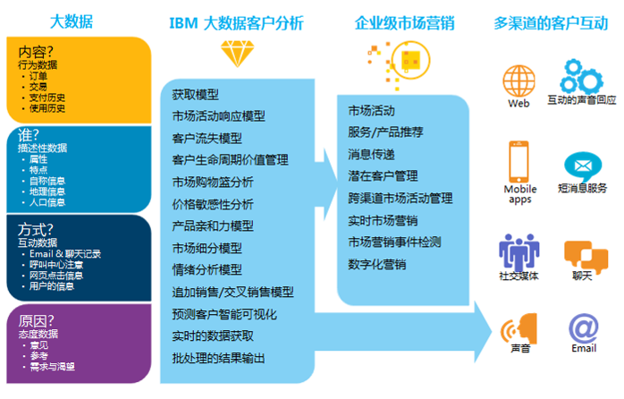
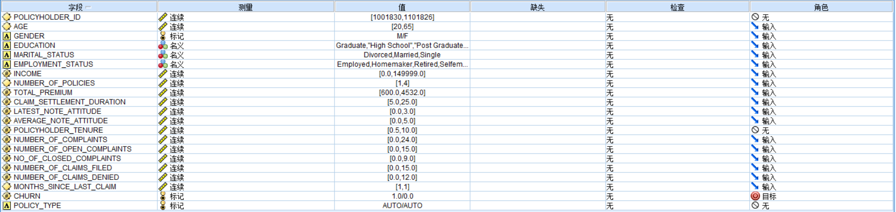
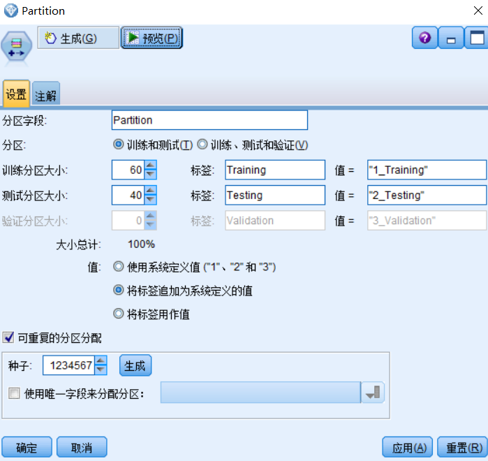
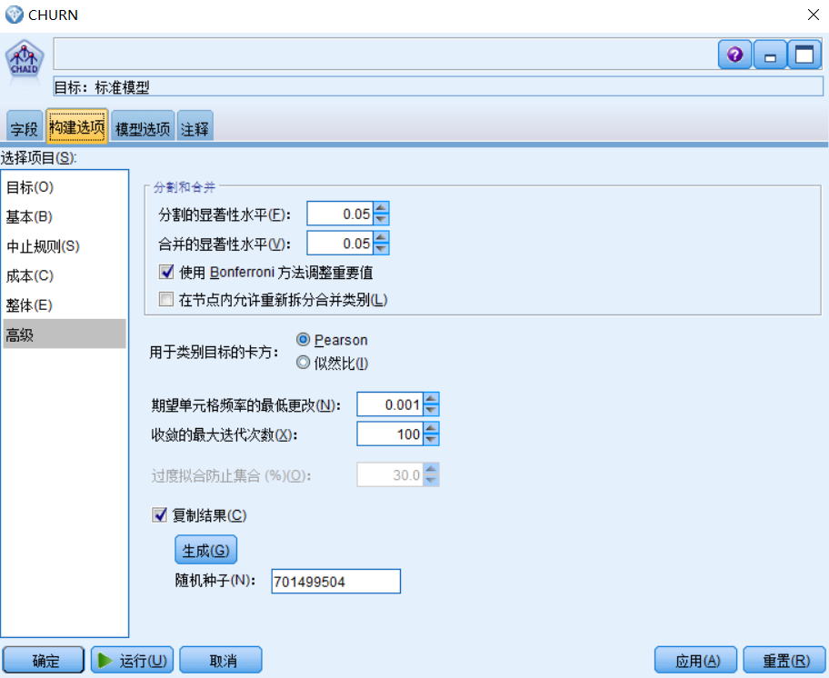
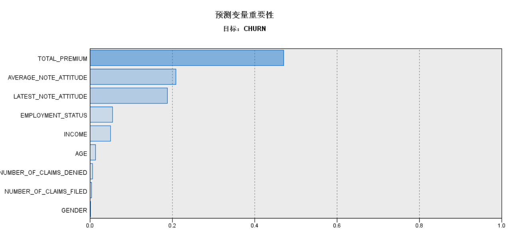
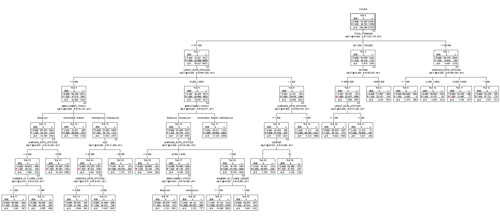
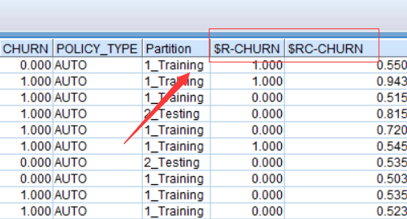

# IBM 客户智能预测下的客户流失率预测模型
PCI 实用

**标签:** 分析

[原文链接](https://developer.ibm.com/zh/articles/ba-cn-predictive-customer-intelligence-loss-rate/)

廖显, 曾滔

发布: 2017-12-20

* * *

自改革开放以来，保险行业取得了长足的发展，但同时也面临着激烈的竞争。由于信息化的快速发展，以及保险行业的自身特点，各个保险公司都累计了数量庞大的客户数据，包括投保人人口统计信息，投保人的客服信息，投保人的满意度信息。每一次与客户的交流都会留下重要的信息。本文主要讨论在保险行业（也可以根据数据的不同推广到其他行业）收集的数据中，建立客户流失率的预测模型，以方便保险公司采取相应的决策，提高客户的留存率。本文所用的工具为 modeler18.0，采用的模型为卡方自动交叉检验模型。

## 基于预测性客户分析的大数据时代的到来

当前的企业拥有来源广泛的大量客户数据。尽管大多数企业认为这些数据可带来潜在的收益，不过，在将信息有效地转化为可行的洞察力方面，许多企业面临着困难。然而，有效的客户分析战略有助于推动收入增加，避免不必要的成本支出，并且提高客户满意度。消费者和企业每天产生 2.5 Quintillion(1 Quintillion 相当于 10 的 18 次方)字节的数据。事实上，当前，全球 90%的数据是在过去两年中创造的。这些数据来源多样：用于收集气候信息的传感器、社交媒体中发布的帖子、在线发布的数码照片和视频、销售点(POS)数据、在线购物交易记录、电子邮件内容和移动电话 GPS 信号等等。由于上网设备和云服务的价格低廉，世界已经从互连向虚拟互连方式转变，比以前产生了更多与客户相关的数据，并且在更短的时间内完成。如今，大多数企业高管都认识到了收集客户相关数据的价值。然而，许多人面临的挑战是，如何从这些数据中获得洞察力，继而创造智慧的、主动的、与客户相关的交互通路。他们不确定如何有效地使用客户数据做决策，才能将洞察力转变为销售业绩的增长。采用业务分析的企业可以全面地利用数据、统计和定量分析、探索式和预防性建模以及基于事实的管理，从而在当前复杂的环境中做出更明智的决策。

IBM 预测性分析可以帮助了解目前状况以及下一步的目标，从依靠猜测进行决策转变为依靠预测进行决策。它可以帮助您分析自己的结构化和非结构化数据中的趋势、模式和关系，运用这些洞察预测将来事件，并采取行动以实现期望的成果。无论您从事市场营销、客户服务、销售、财务、运营还是其他业务领域的工作，都可以随时运用 IBM 预测性分析软件中丰富的高级功能，无论是在内部部署、在云中部署还是采用混合解决方案的形式。我们的产品服务组合将统计分析、预测建模、决策优化和计分、数据收集等功能结合在一起，为您提供各种工具，解决组织所面临的所有数据难题，实现更好的成果。IBM 的预测性分析解决方案能够满足各种不同用户的需求，无论他们是刚刚入门的，还是经验丰富的分析人员。这些解决方案支持各种规模的企业（无论是中小企业还是最大型企业）利用预测性智能的强大能力，为战术性和战略性的决策指引方向。可以说，大数据时代对人类的数据驾驭能力提出了新的挑战，也为人们获得更为深刻、全面的洞察能力提供了前所未有的空间与潜力。整个 IBM 预测性客户智能应用可以帮助用户：

- 建立与增强大数据平台上跨渠道与接触点所有客户关系
- 产生智能化、个性化的客户报价和建议认知分析能力
- 从跨行业分析资产中学习世界级的大数据分析案例研究

## IBM 预测性客户智能介绍

IBM 预测性客户智能（Predictive Customer Intelligence – 简称 PCI）是 IBM 在大数据时代创造出的面相固定客户问题的解决方案应用，旨在帮助行业客户快速搭建基于客户大数据的分析应用，帮助客户能快速提升其客户服务能力，从而加强用户连接，提升客户体验，并帮助获得新客户和取悦并保留现有客户。通过大数据分析所有的企业可用数据，预测性客户智能可以识别动态的客户配置文件和细分，基于这个特点，它创建了高度个性化和优化的用户报价方案，并推荐对该用户的最佳行动，并且通过审计系统开始执行，整个用户分析报告可以帮助企业在这个过程获得动态的洞察和见解。

##### 图 1\. IBM 大数据客户分析的应用架构

### 大数据

数据提供了基本的输入为理解客户是谁,他们如何与业务交互,业务迄今为止他们已经做了什么,为什么他们购买商品或服务。数据交互,态度、描述性和行为的性质。这些数据的来源可以是内部和外部的公司可以结构化和非结构化数据。数据包括历史数据的交互,以及,此时此地(交互的上下文中)。这些数据提供了 IBM 预测客户智能的基础来创建一个 360 度的客户视图,用于提出相关建议。

### IBM 大数据客户分析模型

IBM 内部预测客户智能各种模型可以直接部署在交互或联系人。模型也可以部署与 IBM 和第三方营销系统,海外营销和数字频道。IBM 的总体目标预测客户智能是最大化与客户每一次互动,无论您在哪里以及如何与他们沟通。

这些模型可以定制和扩展,以适应组织的发展和独特的需求,以帮助您自信的推荐个性化的相关报价/解决方案每个客户情况:

- 预测分析帮助组织预测客户的行为。
- 决定管理预测模型评分结果转换成适当的行动。
- 实时得分用于生成和重新生成预测需求。
- Cross-campaign 优化识别与每个客户最赚钱的决定。

IBM 预测客户智能还有一个连接器为 IBM InfoSphere Streams 为了支持高容量的流数据。这种集成对客户很重要,需要在几秒内大量事务的建议。IBM 预测客户智能不仅是对外营销活动,不仅对客户细分。它支持完整的客户生命周期和提高整体的客户交互和客户关系。

### IBM ExperienceOne 营销集成或第三方营销支持

IBM 预测客户智能连接器 ExperienceOne 解决方案有效执行的行动建议:

- IBM 竞选是一个基于 web 的解决方案,使用户能够设计、运行和分析直接营销活动。
- IBM 交互提供了个性化的实时提供和客户个人信息。
- IBM 营销平台提供了安全、配置和仪表板为 IBM ExperienceOne 产品特性。

IBM 预测客户智能还集成了各种第三方营销解决方案,提供服务,如创建和运行活动,创建提供消息,和支持领导管理,横跨海峡的活动管理、实时营销、营销事件检测和数字营销。

### 多渠道客户交互支持

多渠道客户交互包括接触的各种系统,可用于与客户互动。IBM 预测客户智能将推荐最好的接触形式基于组织的营销执行和系统的解决方案。

分析引擎,IBM 的核心预测客户智能战略转型能力可用于一个组织,因为他们提供最富有、最先进的分析技术。基于事实的,他们使一个组织能够部署准确和一致的决策(交互)和他们的客户。

这些相互作用以及由此产生的积极成果直接影响业务。在这种集成的业务环境中,一个组织可以减少矛盾和变化在通信客户交互点。

重要的是要理解组织可以清楚地定义、维护和调整标准用于生成这些面向客户的决策和交互,经常需要的。

IBM 预测性客户智能在应用上是一组 IBM 软件包的组合，包括：DB2，SPSS，Cognos, Integration Bus 等，从数据的存储，集成，到数据的深度分析，以及最后的数据展现，形成了一个完整的大数据应用架构。而本文将在 IBM 预测性客户智能的核心部分-客户分析模型，进行详细的说明，帮助企业的数据科学家快速的掌握分析的方式和应用。

本文将详细介绍其中的客户流失模型的构建和应用原理。

## 数据准备

该模型主要采集到的数据字段如下：

### 源数据字段

字段  字段名称  AGE  年龄  LASTEST\_NOTE\_ATTITUDE  GENDER  性别  POLICYHOLDER\_TENURE  保单时长  EDUCATION  教育情况  NUMBER\_OF\_COMPLAINTS  投诉次数  MARITAL\_STATUS  婚姻情况  NUMBER\_OF\_OPEN\_COMPLAINTS  公开投诉次数  EMPLOYEE\_STATUS  职业状态  NO\_OF\_CLOSED\_COMPLAINTS  已解决的投诉次数  INCOME  收入  NUMBER\_OF\_CLAIMS\_FILED  提建议的次数  NUMBER\_OF\_POLICIES  保单数  NUMBER\_OF\_CLAIMS\_DENIED  被拒绝的建议次数  TOTAL\_PREMIUM  保险费  MONTHS\_SINCE\_LAST\_CLAIM  最后一次建议次数  CLAIM\_SETTLEMENT\_DURATION  客户抱怨解决周期  CHURN  是否流失

以上数据在 modeler 中的数据类型如下图所示：

##### 图 2\. 数据类型展示

## 构建测试集和训练集

以下介绍两个客户流失模型中的两个主要节点 – 分区节点和卡方自动交叉检验模型节点

**_分区节点_**

“分区”节点用于生成分区字段，将数据分割为单独的子集或样本，以供模型构建的训练、测试和验证阶段使用。通过用某个样本生成模型并用另一个样本对模型进行测试，可以预判此模型对类似于当前数据的大型数据集的拟合优劣。

##### 图 3\. 分区节点的参数细节

**_卡方自动交叉检验模型节点_**

卡方自动交互检测法（chi-squared automatic interaction detector, CHAID）最早由 Kass 于 1980 年提出，是一个用来发现变量之间关系的工具，是一种基于调整后的显着性检验（邦费罗尼检验）决策树技术。其核心思想是：根据给定的反应变量和解释变量对样本进行最优分割，按照卡方检验的显著性进行多元列联表的自动判断分组。利用卡方自动交互检测法可以快速、有效地挖掘出主要的影响因素，它不仅可以处理非线性和高度相关的数据，而且可以将缺失值考虑在内，能克服传统的参数检验方法在这些方面的限制。CHAID 或卡方自动交互效应检测是一种通过使用卡方统计量识别最优分割来构建决策树的分类方法。CHAID 可用于预测（类似回归分析，CHAID 最初被称为 XAID）以及分类，并用于检测变量之间的相互作用。

CHAID 首先检查每个输入字段和结果之间的交叉表，然后使用卡方独立性检验来检验显著性。如果以上多个关系具有显著的统计意义，那么 CHAID 将选择最重要（p 值最小）的输入字段。如果输入具有两个以上的类别，那么将会对这些类别进行比较，然后将结果中未显示出差异的类别合并在一起。此操作通过将显示的显著性差异最低的类别对相继合并在一起来实现。当所有剩余类别在指定的检验级别上存在差异时，此类别合并过程将终止。对于名义输入字段，可以合并任何类别；对于有序集合，只能合并相邻的类别。

##### 图 4\. 卡方自动交叉检验算法节点的参数细节

## 构建模型

点击卡方自动交互检验模型运行按钮，等待模型运行完成将输入模型结果，整个模型如下图：

##### 图 5\. 模型流细节

点击上图中黄色的 CHAID，打开模型结果如下图：

##### 图 6\. 模型运行结果

上图显示了通过卡方自动交互模型得出重要的变量值从上到下依次为：TOTAL\_PREMIUM,AVERAGE\_NOTE\_ATTITUDE,LATEST\_NOTE\_ATTITUDE,EMPLOYMENT\_SATUS,INCOME,AGE,NUMBER\_OF\_CLAIMS\_DENIED,NUMBVER\_OF\_CLAIMS\_FILED,GENDER,其他没有显示在以上的变量表示这些变量与客户是否流失的目标值没有直接关系，在这里也不会作为标示出来。整个树形目录如下图，根节点为模型的预测结果。

##### 图 7\. 树形结果展示

点击预览按钮，会发现在数据最后面会出多$R-CHURN,$RC-CHURN 两个字段，$R-CHURN,标示预测的结果（结果 1 代表会流失，0 代表不会流失），$RC-CHURN 表示置信度（即预测值的概率）

##### 图 8\. 置信度

注意：以上有一个字段 Partition，这个字段是前面分区节点中创建的。这个节点只有两种类型，1\_Training，2\_Testing。之所以在决策模型中要引入分区节点，是因为决策树模型在生成树图形后，需要用测试数据对模型进行优化（一般也叫修剪枝），因此 2\_Testing 的标识数据表示是对模型的优化数据。

## 参考资源

阅读本文之前，需要建立对于 SPSS Modeler 的基础知识，并且对于 SPSS Modeler 的使用场景需要有一定掌握。

- [数据挖掘产品 IBM SPSS Modeler 新手使用入门](https://www.ibm.com/developerworks/cn/data/library/techarticle/dm-1103liuzp/index.html)
- [利用 IBM SPSS Modeler 整合不同数据库之间的数据](https://www.ibm.com/developerworks/cn/data/library/ba/ba-1403spssintegrate/index.html)
- [IBM SPSS Modeler 决策树之银行行销预测应用分析](https://www.ibm.com/developerworks/cn/data/library/ba/ba-1412spssmodelerbank/)