# IBM 客户智能预测下的客户生命周期值计算模型
CLTV(Customer lifetime value)

**标签:** 分析

[原文链接](https://developer.ibm.com/zh/articles/customer-life-cycle-value-calculation-model/)

廖显, 曾滔

发布: 2018-01-30

* * *

## IBM 预测性客户智能介绍

IBM 预测性客户智能（Predictive Customer Intelligence – 简称 PCI）是 IBM 在大数据时代创造出的面相固定客户问题的解决方案应用，旨在帮助行业客户快速搭建基于客户大数据的分析应用，帮助客户能快速提升其客户服务能力，从而加强用户连接，提升客户体验，并帮助获得新客户和取悦并保留现有客户。通过大数据分析所有的企业可用数据，预测性客户智能可以识别动态的客户配置文件和细分，基于这个特点，它创建了高度个性化和优化的用户报价方案，并推荐对该用户的最佳行动，并且通过审计系统开始执行，整个用户分析报告可以帮助企业在这个过程获得动态的洞察和见解。

IBM 预测性客户智能在应用上是一组 IBM 软件包的组合，包括：DB2，SPSS，Cognos, Integration Bus 等，从数据的存储，集成，到数据的深度分析，以及最后的数据展现，形成了一个完整的大数据应用架构。而本文将在 IBM 预测性客户智能的核心部分之一-客户生命周期分析模型，进行详细的说明，帮助企业的数据科学家快速的掌握分析的方式和应用。

本文将详细介绍其中的生存分析模型的构建和应用原理。

## 生存分析模型

在介绍 Cox 风险比例模型前，先介绍一下生存分析模型，生存分析(Survival analysis)是指根据试验或调查得到的数据对生物或人的生存时间进行分析和推断，研究生存时间和结局与众多影响因素间关系及其程度大小的方法，也称生存率分析或存活率分析。

某些研究虽然与生存无关，但由于研究中随访资料常因失访等原因造成某些数据观察不完全,要用专门方法进行统计处理,这类方法起源于对寿命资料的统计分析,故也称为生存分析。

关于生存函数（survival function）： S(t)=Pr(T > t) t 表示某个时间，T 表示生存的时间（寿命），Pr 表示表示概率。生存函数就是寿命 T 大于 t 的概率。举例来说，人群中寿命超过 50（t）岁的人在所有人中的概率是多少，就是生存函数要描述的。假定 t=0 时，也就是寿命超过 0 的概率为 1；t 趋近于无穷大，生存概率为 0，没有人有永恒的生命。如果不符合这些前提假定，则不适应 Survival analysis，而使用其他的方法。 由上可以推导：生存函数是一个单调非增函数。t 越大，S(t) 值 越小。

衍生函数： Lifetime distribution function F(t) = 1-S(t) = Pr(T <= t)

概率密度函数： f(t) = d(F(t))/dt 又叫 event density，单位时间事件 event（可以是死亡或者机器失效）的概率，是生存函数的导数。

f(t) 的性质： f(t) 总是非负的（没有人可以再生）。函数曲线下方面积（从 0 到无穷大积分）为 1。 s(t) = d(S(t))/dt = -f(t)

危险函数 Hazard function λ (t) = f(t)/S(t) 危险函数引入分母 S(t)。其物理意义是，如果 t= 50 岁， λ (t)就是事件概率（死亡）除以 50 岁时的生存函数。因为年龄 t 越大，分母生存函数 S(t) 越小，假定死亡概率密度 f(t)对任何年龄一样（这个不是 survival analysis 的假设），那么危险函数λ (t)值越大，预期存活时间短。综合很多因素，卖人身保险的对年龄大的收费越来越高。婴儿的死亡概率密度相对高一些，虽然分母生存函数 S(t) 大，λ (t)值还是略微偏高，交的人身保险费也略偏高。

生存分析模型的主要方法如下表所示：

##### 表 1\. 生存分析模型的主要方法介绍

**主要内容****研究方法**生存过程的描述乘积-极限法（Kaplan-Meier） 寿命表法（Life Tables）生存过程的比较对数秩检验（log-rank）影响因素的分析Cox 比例风险模型

## Cox 风险比例模型简介

Cox 风险比例模型又称为 Cox 回归模型，是英国统计学家 D.R.Cox 于 1972 年提出的用于肿瘤和其它慢性病的预后分析，队列研究的病因探索的一个模型。是生存分析方法下专门研究多因子影响因素的分析。从表 1 也可以看出，Cox 风险比例模型是生存分析模型中专门用来研究影响因素的一种模型。

在介绍 Cox 风险模型是需要注意一下几个概念：

- **生存函数：（** survival function）又称累积生存概率（cumulative survival probability） 、生存率，表示个体生存时间 T≥t 的概率。
- **生存概率：** 在单位时段开始存活的个体到该时段结束时仍存活的可能性，用 p 表示；
- **生存率：** 观察个体活过 t 个单位时间的概率，用 S(t)表示。如数据中无截尾值，则生存率计算公式为：S(t) = 生存时间≥t 的病人数 / 随访病人总数。如有截尾值，则分时段计算不同单位时段的生存概率 p1、p2、…pt，S(t)=p1×p2×…×pt ，即累积生存概率。
- **风险函数 (hazard function)** ：又称危险率函数等，一般用 h(t)表示，表示生存时间已达 t 的个体在 t 时刻的瞬时风险率；在 Cox 比例风险模型中风险函数常用λ(t)表示。h(t) = (死于区间（t，t+⊿t）的病人数)/(在 t 时刻尚存的病人数×⊿t)，求⊿t 为极小时间段的极限值。
- **风险比（hazard ratio）：** 是指同一时点两组的风险函数之比，即相对危险度 RR。

风险比= 第一组个体的 h1(t)

第二组个体的 h2(t)

比例风险：风险比与时间无关，即任何时刻，两组的风险比值是相等的；非比例风险或时间依赖型：风险比与时间有关。

### Cox 回归的一般形式

λ(t) = [λ0(t)] • e( β1 _x1+ β2_ x2+….+ βm\*xm )

= [λ0(t)] • exp(β1 _x1+ β2_ x2+….+ βm\*xm)

λ(t)表示 t 时刻暴露于各危险因素（x1，x2，….xm）状态下的风险函数。λ0(t)为基线风险函数，表示所有的危险因素状态都为 0 情况下的风险函数。

λ(t) / λ0(t) = exp( β1 _x1+ β2_ x2+….+ βm\*xm )

即： ln [λ(t) / λ0(t)] = β1 _x1+ β2_ x2+….+βm\*xm

λ0(t)的形式不限，使模型的适用范围如同非参数法那么广；模型中含有参数β，又使得其统计效率接近参数模型。（但参数β就不能用传统的方法进行估计和检验）

所以模型中含有参数β ，但基线风险函数λ0(t)不要求服从特定分布形式，具有非参数的特点,故 Cox 回归又称为半参数模型。

### 参数的统计学意义

假设只有一个 X 危险因素，0 为”不暴露”，1 为”暴露”，模型形式为：

λ(t) = λ0(t) • exp(β\*x)

X=1 时的风险函数为：λ1(t)=λ0(t)• exp(β\*1)

X=0 时的风险函数为：λ2(t)=λ0(t)• exp(β\*0)

λ1(t)、λ2(t)分别表示暴露于危险因素的两种不同状态下发病的风险函数。

暴露于危险因素的两种不同状态下发病的风险比即为相对危险度 RR。

RR=λ1(t) / λ2(t)

= [λ0(t) • exp(β _1) ] / [λ0(t) • exp(β_ 0) ]

= exp(β _1) / exp(β_ 0) = exp（β）

RR 表示暴露组与非暴露组的风险函数之比，即：暴露组发病的风险是非暴露组的 RR 倍。

回归系数β的流行病学含义是 0、1 协变量 X 的相对危险度的自然对数。

如果 X 为连续性变量——年龄（岁），则λ1(t)、λ2(t)分别表示 k 岁、k+1 岁的两种不同状态下发病的风险函数。

RR = λ1(t) / λ2(t)

=[λ0(t)•exp(β _（k+1）)]/[λ0(t) • exp(β_ k) ]

= exp(β _（k+1） / exp(β_ k) = exp（β）

β：X 每增加一个单位时其相对危险度的自然对数值。

RR 表示某危险因素（或协变量）改变一个测量单位时风险函数改变多少倍。

当β＞0，说明相应协变量值的增加将增大所研究事件发生的可能性；

当β＜0，相应协变量值的增加将减少所研究事件发生的可能性；

当β= 0，相应协变量与所研究事件的发生无关。

## 用 SPSS Modeler 构建基于风险比例模型的客户生命周期值计算

首先，介绍下数据来源，模型的数据源字段如下：

##### 表 2\. 以下是对字段进行说明

**字段****字段名称****字段****字段名称**AGE年龄NUMBER\_OF\_COMPLAINTS客户抱怨次数GENDER性别NUMBER\_OF\_OPEN\_COMPLAINTS客户公开抱怨次数HOUSEHOLDER\_NUMBER\_OF\_CHILDREN投保人小孩数NO\_OF\_CLOSED\_COMPLAINTS解决抱怨次数HOUSEHOLDER\_NUMBER\_OF\_INSURED\_CARS投保人投保汽车数MAINTEANCE\_COST维护成本INSURANCE\_LINESCHURN是否流失NUMBER\_OF\_POLICES保单数EDUCATION\_R受教育程度TOTAL\_PREMIUM保单费用总额EMPLOYMENT\_STATUS\_R就业状况AVERAGE\_NOTE\_ATTITUDECUSTOMER\_FINANCIAL\_SEGMENT\_R客户财务状况POLICYHOLDER\_TENURE保单持有时间

##### 图 1\. 字段在 SPSS Modeler 里的定义示例

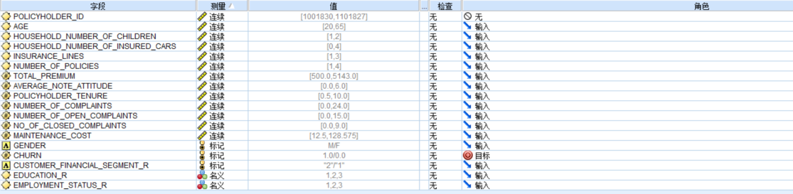

拖入 Cox 风险比例算法，打开算法节点，进行算法配置。

过去生存时间。将迄今为止的记录的生存时间指定为一个字段，例如将现有客户的保有期指定为一个字段。在未来时间对生存的似然进行评分取决于过去生存时间。

- 追加所有概率。指定是否将输出字段每个类别的概率添加到该节点所处理的每条记录。如果未选中此选项，那么仅添加预测类别的概率。为每个未来时间计算概率。

- 计算累积风险函数。指定是否将累积风险的值添加到每条记录中。为每个未来时间计算累积风险。

注：未来和过去生存时间的值必须在用于训练模型的数据的生存时间范围内。时间超出此范围的记录将标记为空。

##### 图 2\. 勾选“追加所有概率”

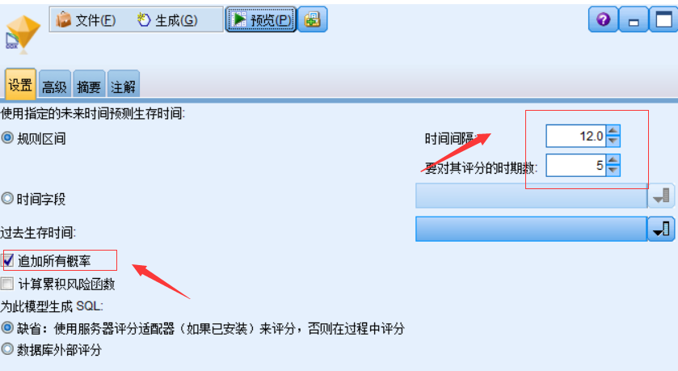

勾选”追加所有概率”，其他保持默认。

预测未来时间的生存情况。指定一个或多个未来时间。即在未发生终端事件的情况下，无论每个观测值是否可能至少在此时间长度（从现在开始）内生存，都将在每个时间值为每条记录预测生存时间，一个时间值对应一个预测值。请注意，生存时间为目标字段的”false”值。

- 规则的时间间隔。即：生存分析模型中的 t 时间，生存时间值是根据指定的时间间隔和要评分的时间段数生成的。例如，如果请求 3 个时段，时间间隔为 2，那么对未来时间的生存时间将为 2、4 和 6。以相同时间值评估每条记录。注意：该处模型值为 12，而整个数据数据的最大值是 10，因此这样设置后，模型中的也测试和概率值都会显示为空如图：

##### 图 3\. 模型中的测试和概率值显示

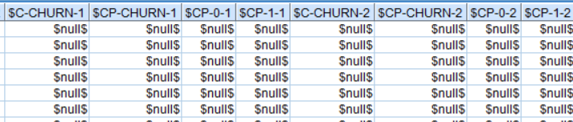

- 时间字段。在所选的时间字段中为每条记录提供生存时间（生成一个预测字段），因此可以在不同的时间评估各条记录。

生存时间选择 POLICYHOLDER\_TENURE。

##### 图 4\. 选择“使用预定义角色”

运行模型得出下图中的 CHURN 模型

##### 图 5\. CHURN 模型

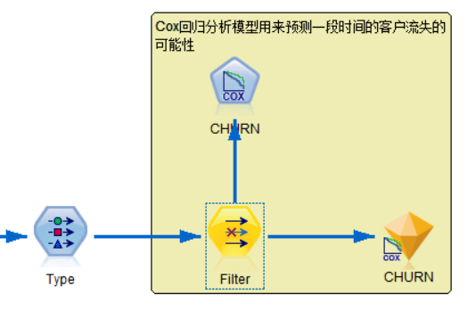

以下对模型的相关参数进行说明，以方便对统计学不是很熟悉的读者更好的阅读。

双击 CHURN,得到如下的模型的相关说明参数：

- Case Processing Summary（样品处理摘要）

##### 图 6\. 样品处理摘要

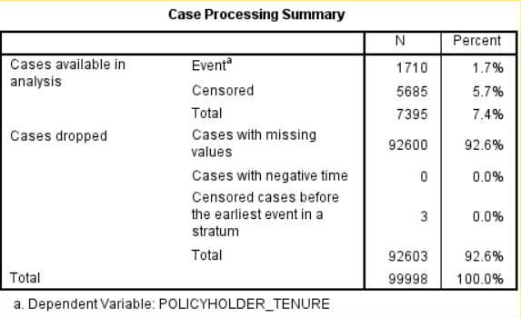

在输出结果中，首先给出样品处理摘要报告，包括如下信息：选择了多少样品，没有选择的有多少样品；在选择的样品里，分析多少样品，缺失了多少样品——缺失样品一般是因为数据中存在缺失值；选择的样品总数以及全体样品总数（如上图）。用 N 表示各类样品数目，Percent 表示各类样品的百分比。在正常情况下，这些信息对我们的分析没有什么用处。但是，如果样本很大并且构成很复杂，涉及到样品的取舍或者数据缺失的时候，这些信息就很重要，会为后面的分析提供很大方便。

- Categorical Variable Codings (分类变量编码)

##### 图 7\. 分类变量编码

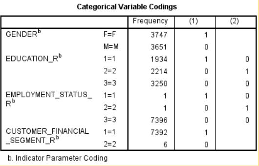

这是很重要的信息，告诉我们对不同分类变量的分类编码结果（上图）。我们的自变量中涉及到代表不同性别，受教育程度，职业状态，客户金融分类等（如上图）。在我们开始的分类中，属于女性用 1 表示，男性用 0 表示。但是，受教育程度 SPSS 改变了这种编码，原来的 0 改用 1 表示，原来的 1 改用 0 表示。也就是说，在这次 SPSS 分析过程中，受教育状态和就职状态，系统默认转换了。记住这个分类对后面开展预测分析非常重要

- Variables in Equation (方程中的变量)

##### 图 8\. 分类变量编码

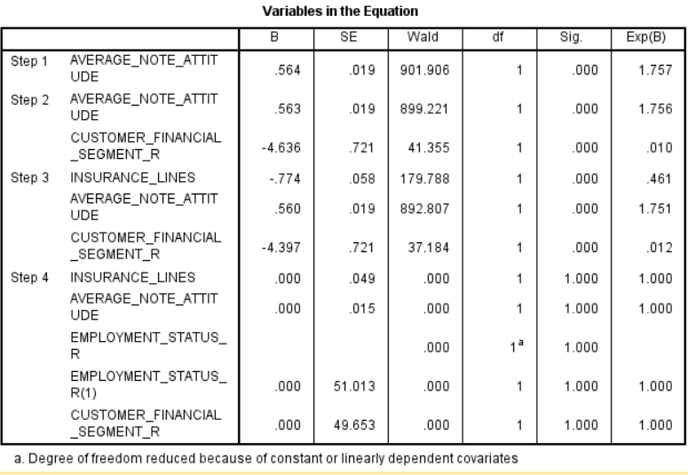

该模型中的风险函数应该为： **λ( _t_ )=λ 0 ( _t_ ) · e (-0.774 _insurance\_lines+0.56_ average\_note\_attituede–4.397\*customer\_financial\_segment\_r)**

Insurance\_lines,average\_note\_attitude,customer\_financial\_segement\_r 的 p 值分别为 0,0,0，均小于 0.05，说明 Insurance\_lines,average\_note\_attitude,customer\_financial\_segement\_r 三个变量对保单是否流失有明显的影响。

Insurance\_lines,average\_note\_attitude,customer\_financial\_segement\_r 的 OR 值分别为 0.464,1.751,0.12，average\_note\_attitude 的值>1，说明 average\_note\_attitude 对于是否流失的风险是 1.751 倍，Insurance\_lines，customer\_financial\_segement\_r 的值<1，说明对于是否流失的影响是负相关。

**由模型可求出不同状态下的相对危险 度 RR 值 :**

##### 图 9\. 各特征的分数

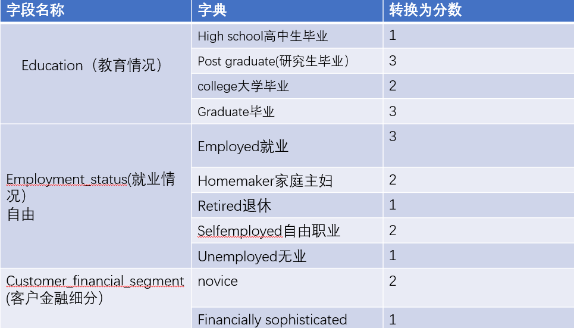

按上图，如求客户金融细分中，在其他条件一定的情况下，customer\_financial\_segment\_r 为 novice 是相对于 financially sophisticated 的风险度

RR= **λ( _t_ )=λ 0 ( _t_ ) · e (-0.774 _insurance\_lines+0.56_ average\_note\_attituede–4.397\*2**

**/ λ 0 ( _t_ ) · e (-0.774 _insurance\_lines+0.56_ average\_note\_attituede+4.397\*1)**

= **e (-0.774 _insurance\_lines+0.56_ average\_note\_attituede+4.397 _2_/ e (-0.774insurance\_lines+0.56 _average\_note\_attituede+4.397_ 1)**

点击，浏览数据如下，发现数据中多出$C-CHURN-1,$CP-CHURN-1,$CP-0-1,$CP-1-1 等多个变量，现在对变量内容进行简单说明。

Cox 回归模型表示由 Cox 节点所估计的方程式。这些方程式包含由模型所捕获的所有信息及有关模型结构和性能的信息。

运行包含生成的 Cox 回归模型的流时，该节点可添加包含模型预测和相关概率在内的两个新字段。新字段的名称派生自要预测的输出字段的名称并带有前缀和后缀，前缀为表示预测类别的 $C- 或表示相关概率的 $CP-，而后缀为未来时间间隔的数目或用于定义时间间隔的时间字段的名称。例如，对于名为 churn 的输出字段，以及以规则区间定义的两个未来时间间隔，新字段命名为 $C-churn-1、 $CP-churn-1、 $C-churn-2 和 $CP-churn-2。如果使用时间字段 tenure 定义未来时间，那么新字段为 $C-churn\_tenure 和 $CP-churn\_tenure。

如果在 Cox 节点中选中了追加所有概率 设置选项，那么会针对每个未来时间添加两个附加字段，其中包含每条记录生存和失败的概率。这些附加字段是根据输出字段的名称进行命名的并带有前缀和后缀，前缀为表示生存概率的 $CP-– 或表示事件已发生概率的 $CP--，而后缀为未来时间间隔的数目。例如，对于”false”值为 0，”true”值为 1 的输出字段和以规则区间定义的两个未来时间间隔，新字段命名为 $CP-0-1、$CP-1-1、$CP-0-2 和 $CP-1-2。如果使用单个时间字段 tenure 定义未来时间，由于存在单个的未来区间，那么新字段为 $CP-0-1 和 $CP-1-1。

如果在 Cox 节点中选中了 计算累积风险函数 设置选项，那么会针对每个未来时间添加附加字段，其中包含每条记录的累计风险函数。这些附加字段是根据输出字段的名称进行命名的并带有前缀和后缀，前缀为 $CH-，而后缀为未来时间间隔的数目或用于定义时间间隔的时间字段的名称。例如，对于名为 churn 的输出字段，以及以规则区间定义的两个未来时间间隔，新字段命名为 $CH-churn-1 和 $CH-churn-2。如果使用时间字段 tenure 定义未来时间，那么新字段为 $CH-churn-1。

##### 图 10\. 结果展示

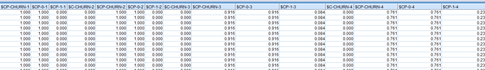

- 替换掉上图中所有的带$的值，只保留$CP-0-1, $CP-0-2, $CP-0-3, $CP-0-4, $CP-0-5 五个表示时间间隔后不再保有保单的概率，病将字段名依次替换成 CP1，CP2，CP3，CP4，CP5，
- 创建一个新字段

NEW\_PROFIT= (TOTAL\_PREMIUM – MAINTENANCE\_COST)\*12

表示每一个保单的利润。

- 创建一个新字段

CLTV=(NET\_PROFIT _(1-C1) / (1 + 0.12)) + (NET\_PROFIT_ (1-C2) / (1 + 0.11) **2) + (NET\_PROFIT \* (1-C3) / (1 + 0.1)** 3) + (NET\_PROFIT _(1-C4) / (1 + 0.09) \*\* 4) + (NET\_PROFIT_ (1-C5) / (1 + 0.08) _\\* 5) + (NET\_PROFIT_ POLICYHOLDER\_TENURE)

表示客户生命周期。

- 创建一个新字段

CLTV\_CAT=if CLTV <=30083.625 then ‘LOW’

elseif CLTV > 30083.625 and CLTV <= 46488.000000000007 then ‘MEDIUM’

elseif CLTV > 46488.000000000007 then ‘HIGH’

else ‘LOW’

endif

- 画出 CLTV 值的分布，如图：

##### 图 11\. CLTV 值的分布

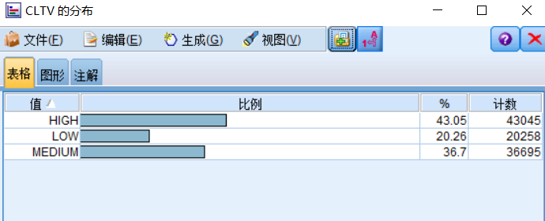

- 输出模型的值如下

##### 图 12\. 模型输出

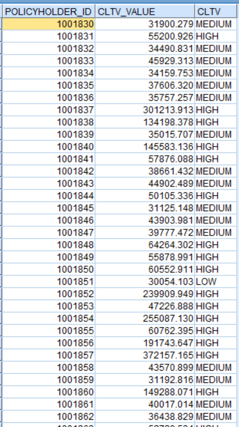

整个模型结构如下:

##### 图 13\. 模型展示

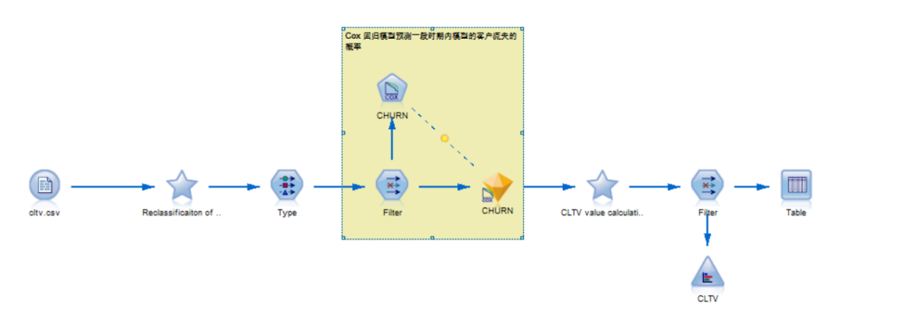

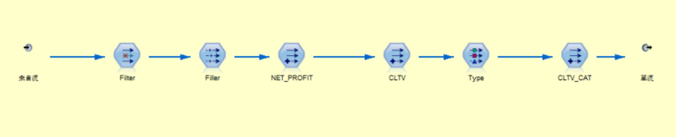

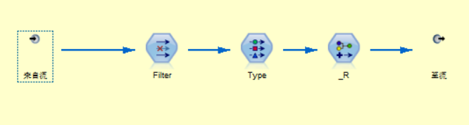

通过以上方法可以预测在一定周期范围内，投保人是否会流失。通过该模型可以使保险公司提前做好客户挽留计划，尽量减少公司的损失。

## 结束语

阅读本文之前，需要建立对于 SPSS Modeler 的基础知识，并且对于 SPSS Modeler 的使用场景需要有一定掌握。