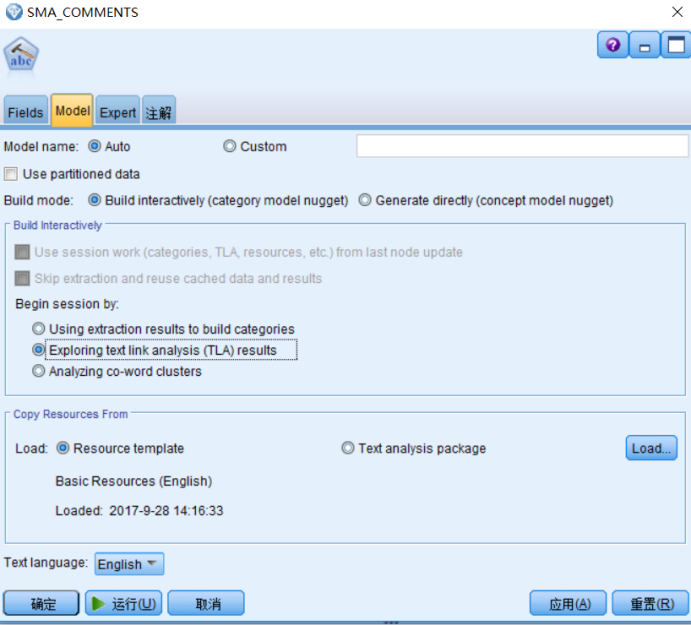
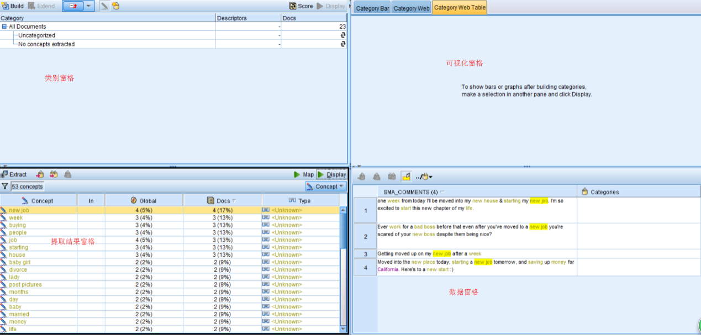
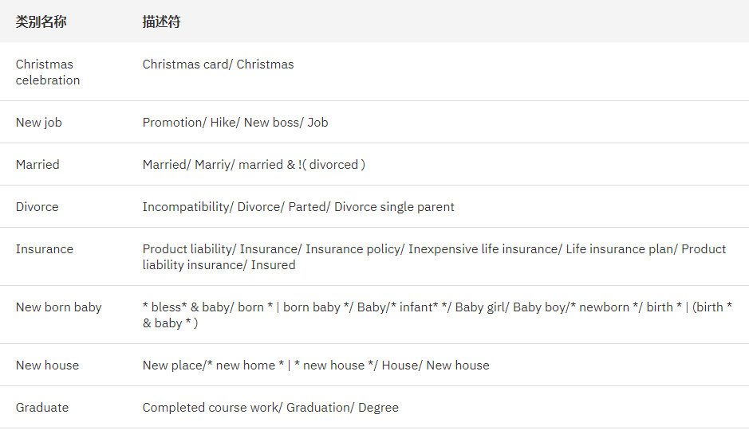
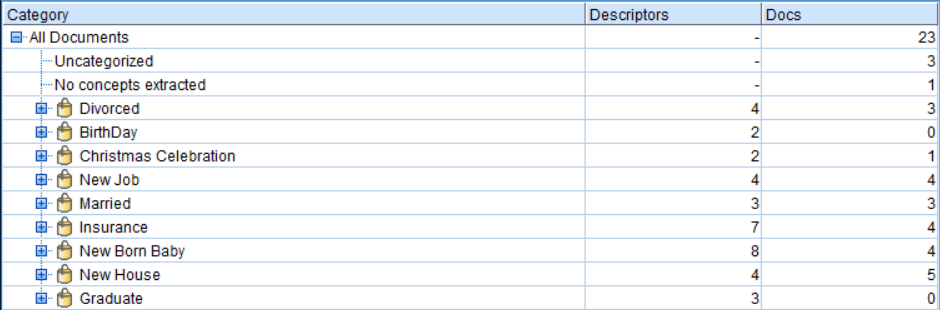
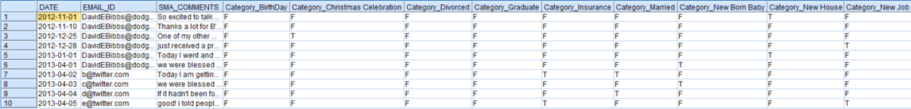
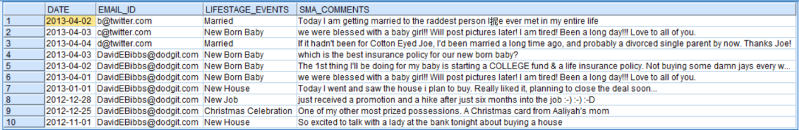
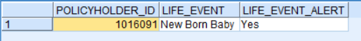

# IBM 客户智能预测下的挖掘互联网中的价值客户
IBM 客户智能预测实例

**标签:** 分析

[原文链接](https://developer.ibm.com/zh/articles/ba-te-min-help-to-ex-pot-com/)

廖显

发布: 2018-05-16

* * *

IBM 预测性客户智能（Predictive Customer Intelligence，简称 PCI）是 IBM 在大数据时代创造出的面向客户问题的解决方案应用，旨在帮助行业客户快速搭建基于客户大数据的分析应用，帮助客户能快速提升其客户服务能力，从而加强用户连接，提升客户体验，并帮助获得新客户和取悦并保留现有客户。通过大数据分析所有的企业可用数据，预测性客户智能可以识别动态的客户配置文件和细分，基于这个特点，它创建了高度个性化和优化的用户报价方案，并推荐对该用户的最佳行动，并且通过审计系统开始执行，整个用户分析报告可以帮助企业在这个过程获得动态的洞察和见解。

IBM 预测性客户智能在应用上是一组 IBM 软件包的组合，包括：DB2，SPSS，Cognos, Integration Bus 等，从数据的存储，集成，到数据的深度分析，以及最后的数据展现，形成了一个完整的大数据应用架构。而本文将在 IBM 预测性客户智能的核心部分 – 客户分析模型，进行详细的说明，帮助企业的数据科学家快速的掌握分析的方式和应用。本文将详细介绍其中的基于文本挖掘能力的 NLP 挖掘互联网中的价值客户的构建和应用原理。

## 模型背景概览

保险行业在投保人购买保险时积累了大量的人口统计学数据，而投保人和意向客户会通过互联网或呼叫中心给予非常多的反馈数据。因此会留下非常多的有价值的信息。本文通过爬虫爬取互联网信息，再通过文本挖掘和自然语言处理技术挖掘有开发潜力的客户，以供客户经理能更好的挖掘客户的价值。

本文采用 SPSS Modeler 作为文本挖掘工具对收集的数据进行挖掘，由于暂时 SPSS Modeler 暂时不支持中文，因此此时爬取的数据是通过国外 Twitter 爬取的英文数据。本文意在说明文本数据的挖掘思路，如何挖掘中文文本，可按照此种思路用 Python，R 进行操作，方法一样。

文本挖掘，顾名思义，就是挖掘本文信息中潜在的有价值的信息。文本数据与数值数据的区别有三：

- 非结构化且数据量大；文本数据的数据量是非常之巨大的，一百万条结构化数据可能才几十到几百兆，而一百万条文本数据就已经是 GB 了。当然文本数据的数据量无法与每天的 log 数据相比，但在基础数据中算是占比很大的数据类型了。大数据容量的数据和大数据条目的数据处理方式完全不一样，普通的机器甚至都无法按条处理；其次呢，文本数据是非结构化数据。非结构化意味着没有任何的列可供你定义和参考。
- 它与人的语言是对接的；文本数据与人的思想直接对接。
- 文字的含义不唯一。

文本数据与数值数据最大的区别，就是难以量化。那么如何处理？通常使用的方法就是数据挖掘中的”数据转换”。而后面的例子就是基于这种”数据转换”而进行的文本标签化，也就是把非结构化数据结构化的过程。

## SPSS Modeler 操作

##### 表 1\. 爬取的部分评论数据显示

**日期****账号****评论**2012/11/1DavidEBibbs@dodgit.comSo excited to talk with a lady at the bank tonight about buying a house2012/11/10DavidEBibbs@dodgit.comThanks a lot for B’day Wishes !2012/12/25DavidEBibbs@dodgit.comOne of my other most prized possessions. A Christmas card from Aaliyah’s mom2012/12/28DavidEBibbs@dodgit.comjust received a promotion and a hike after just six months into the job 🙂 🙂 😀2013/1/1DavidEBibbs@dodgit.comToday I went and saw the house i plan to buy. Really liked it, planning to close the deal soon…2013/4/1DavidEBibbs@dodgit.comwe were blessed with a baby girl!! Will post pictures later! I am tired! Been a long day!!! Love to all of you.2013/4/2b@twitter.comToday I am getting married to the raddest person I 抳 e ever met in my entire life2013/4/3c@twitter.comwe were blessed with a baby girl!! Will post pictures later! I am tired! Been a long day!!! Love to all of you.2013/4/4d@twitter.comIf it hadn’t been for Cotton Eyed Joe, I’d been married a long time ago, and probably a divorced single parent by now. Thanks Joe!2013/4/5e@twitter.comgood! i told people i was gonna get a job and drive, everyone laughed in my face, i passed, got a job and then promoted ;D2013/4/6f@twitter.comSo excited to talk with a lady at the bank tonight about buying a house

#### 文本挖掘节点配置

##### 图 1\. 文本挖掘节点配置



点击 **运行** ，进入交互式界面，如图 2 所示。

#### 文本挖掘节点交互式界面

##### 图 2\. 文本挖掘交互式界面



以上四个窗格分别为类别窗格，数据结果窗格，可视化窗格，数据窗格。鉴于篇幅，本文主要对原理逻辑进行说明，此处不讨论 Modeler 具体软件操作的细节，接下来我们在类别窗格创建以下 9 个类别，数据明细如表 2 所示。

#### 类别分类

##### 表 2\. 类别分类



上表中有一些类似于 birth _\| (birth_ & baby \* )这样的字段，这种是 SPSS Modeler 自带的模式匹配的类别规则，此处不再详述，如读者感兴趣可以去查询模式匹配的相关规则语法，其他的注入 Baby girl，Baby boy 等单词短语是很容易理解的。

按照上图配置完成类别后，如下图 3 所示。

#### 文本挖掘类别视图

##### 图 3\. 文本挖掘类别视图



上图的业务表示是，我们对每条记录都打上一个 Christmas celebration，Divorced，BirthDay，New Job，Married，Inusurance，New Born Baby，New House，Graduate 的标签，标签名称分别以 Category\_为前缀，T 表示为真，F 表示为假，如下图 4 所示。

#### 运行结果数据

##### 图 4\. 运行结果数据



运行结果后，表中新增了刚刚添加的 7 个字段，分别用 T 和 F 来表示数据的真假，由于这种排列会导致数据的稀疏性比较大，因此对上图进行降维处理，新增一个字段 LIFESTAGE\_SEGMENT 分别表示不同的维度，同时删除之前的字段，字段的表示方法如下：

#### 清单 1\. 代码说明

```
if Category_BirthDay ='T' then 'BirthDay'
elseif 'Category_Christmas Celebration'='T' then 'Christmas Celebration'
elseif Category_Divorced='T' then 'Divorced'
elseif Category_Graduate='T' then 'Graduate'
elseif 'Category_New Job'='T' then 'New Job'
elseif Category_Married='T' then 'Married'
elseif 'Category_New Born Baby'='T'  then 'New Born Baby'
elseif 'Category_New House'='T' then 'New House'
elseif Category_Insurance ='T' then 'Insurance'
else undef
endif

```

Show moreShow more icon

#### 降维后数据

##### 图 5\. 降维后的数据说明



此处我们选取刚有小孩的家庭作为潜在客户，以便客户经理能够向家庭推销小孩方面的险种，过滤后得出家里刚有小孩的家庭如图 6 所示。

#### 潜在客户清单

##### 图 6\. 潜在客户清单



然后将挖掘后的数据发布给相关的业务人员，让业务人员通过相关业务来实现数据价值。以上是一个完整的文本数据挖掘过程，以上例子中使用了 SPSS Modeler 中自有的文本挖掘模块。可以根据实际情况，挖掘出数据中的更多价值。

## 总结

基于 SPSS 的文本挖掘，是当今人工智能技术下的一个讨论热点，如何能更加智能的识别和分析非结构化数据-文本，对于 IBM 预测性客户智能应用（Predictive Customer Intelligence）来说无疑是增强了其数据的分析能力，使得整个客户智能分析更加的面向未来应用，从而使的整个 IBM 的客户智能的解决方案更加的完善。

## 相关资源

阅读本文之前，需要建立对于 SPSS Modeler 的基础知识，并且对于 SPSS Modeler 的使用场景需要有一定掌握。您可以参考：

- [数据挖掘产品 IBM SPSS Modeler 新手使用入门](https://www.ibm.com/developerworks/cn/data/library/techarticle/dm-1103liuzp/index.html)
- [利用 IBM SPSS Modeler 整合不同数据库之间的数据](https://www.ibm.com/developerworks/cn/data/library/ba/ba-1403spssintegrate/index.html)
- [IBM SPSS Modeler 决策树之银行行销预测应用分析](https://www.ibm.com/developerworks/cn/data/library/ba/ba-1412spssmodelerbank/)