# IBM 边缘计算架构和使用初探
基于 IBM ICP 及 MCM 多云管理平台探索 IBM 边缘计算产品

**标签:** Docker,IBM Cloud Private,IoT,云计算,边缘计算

[原文链接](https://developer.ibm.com/zh/articles/cl-lo-ibm-edge-computing-architecture-and-deployment/)

李 峥

发布: 2019-12-12

* * *

随着 5G 网络的兴起，IoT 设备的爆发式增长，边缘计算技术被更多的应用场景所采用。本文旨在让读者了解 IBM 边缘计算，初步认识 IBM 边缘计算产品的技术架构和安装部署流程，为读者提供一种可行的边缘计算应用思路。本文将会介绍以下几个方面：

- 什么是边缘计算
- IBM 边缘计算的架构
- IBM Edge Computing for Devices 产品的安装
- 注册边缘 Device 并运行 helloworld 服务

## 什么是边缘计算

边缘计算是一种分布式的计算框架，将企业级的应用部署更贴近数据源，比如部署在 IoT 终端设备及本地边缘服务器中。这种部署方式可以带来显而易见的优势：

- 更快的响应速度
- 更短的时延
- 更好的网络带宽

IoT 设备的爆炸式增长及终端设备的性能提升带来了巨大的数据洪流。而数据洪流将在 5G 网络的加持下从更多的终端设备奔涌而来。在过去云和 AI 是驾驭、发掘数据并使其自动化加速创新的保证。但是大量数据源源不断的从互联设备产生，数据复杂化随之加剧，几乎超过了网络和基础架构的承载能力。无论将这些数据发送到企业核心数据中心或者公有云数据中心都会遇到网络带宽和延时的问题。边缘计算由于不需要将海量数据上传到核心数据中心或云端，降低了网络延迟的影响。将数据的采集、分析、处理贴近数据的产生端，充分发掘边缘设备的计算能力，形成了更高效的解决方案。

在未来，基于 5G 网络的移动设备边缘计算，将赋能更快、更广泛的数据分析技术，创造更深的洞察力、更快的响应速度、更好的客户体验。

## IBM 边缘计算的架构

IBM 边缘计算 Servers 基础架构
IBM 边缘计算的主要设计思想是基于混合云架构，充分利用边缘设备资源进行业务处理。主要将边缘计算架构分为两个部分：

- 边缘计算 Servers
- 边缘计算 Devices

IBM 边缘计算 Servers 部署在运行 IBM Cloud Private（后文简称 ICP）Hub Cluster 的核心数据中心。ICP 一方面承载 Hub Cluster 的运行，另一方面用来承载 IBM Multicloud Manager controller（后文简称 MCM），并通过 MCM 管理其它远端边缘计算 Servers。

远端的边缘计算 Servers 可以部署在 On-Premises 环境，使其更贴近关键业务负载，比如部署在生产线、仓库、零售点等。每一个远端边缘计算 Server 同样需要部署在本地 ICP 环境中，并通过 MCM Klusterlet 接受 Hub Cluster MCM 的远程管理。边缘计算 Servers 架构如图 1 所示。

图 1\. 边缘计算 servers 架构

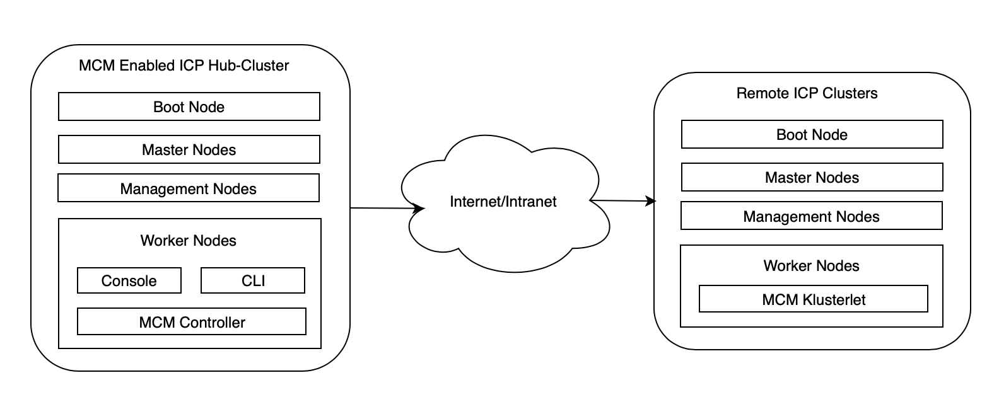

核心 IBM MCM Hub Cluster 是运行在 ICP 环境中的管理 hub，该 Cluster 包含了 ICP 运行需要的各个组件，比如 Boot Node、Master Nodes、Management Nodes 以及 Worker Nodes，另外还用来承载边缘计算支撑组件 Mongodb 和 Postgresql DB。

### IBM 边缘计算 Devices 架构

边缘 Device 的定义相当宽泛，任何接入网络并具有一定计算能力的设备都可以成为边缘 Device，比如手机、摄像头、机械臂、汽车等。IBM Edge Computing for Devices 架构（以下简称 IEC4D）主要任务是实现从边缘计算 Server 到边缘 Device 之间的通讯、管理，在部署简单、易用的基础上，对边缘 Device 中运行的服务软件进行全生命周期管理。IEC4D 架构基于 Open Horizon 开源项目，分散及分布式是其主要特点。所有边缘 Device 都需要安装 Horizon 代理程序来接受边缘计算 Server 的管理，代理程序主要工作包括从 Docker Registry 获取安装 Images、与边缘计算 Server 的 Exchange 模块进行交互完成注册及建立互信、与 AgBot 模块交互完成 Pattern 的部署并启动 Containers 从而运行边缘 Device 服务软件等。服务软件可以根据业务需要，直接访问云端服务。边缘 Device 与其它各个模块交互的逻辑架构如图 2 所示：

图 2\. 边缘 Device 逻辑架构

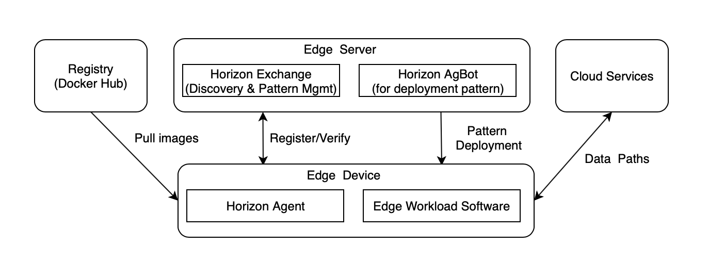

部署在 Hub Cluster 中的边缘计算 Server 可以直接管理边缘 Devices，也可以通过远端部署在公有云或私有云的边缘计算 Server 就近管理边缘 Devices。边缘 Server 与边缘 Devices 之间的拓扑关系如图 3 所示：

图 3\. IEC4D 系统架构

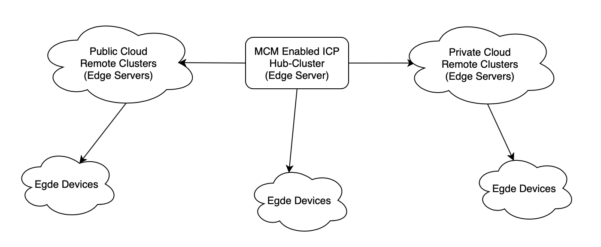

## IBM Edge Computing for Devices 产品的安装

### 安装环境准备

为了使用 IBM 边缘计算产品，须安装 IBM Cloud Private（ICP）并在其 Hub Cluster 安装 IBM Multicloud Manager（MCM）。

文章篇幅所限，详细的安装步骤请参阅安装文档：

- [Installing IBM Edge Computing for servers](https://www.ibm.com/support/knowledgecenter/SSFKVV_3.2.1/servers/install_edge.html)。
- ICP3.2.1 安装步骤请参阅 [ICP 安装文档](https://www.ibm.com/support/knowledgecenter/SSBS6K_3.2.1/installing/install.html)。
- MCM3.2.1 安装步骤请参阅 [MCM 安装文档](https://www.ibm.com/support/knowledgecenter/SSBS6K_3.2.0/mcm/installing/prep_mcm.html)。

从 [IBM 软件下载官网](https://www.ibm.com/products/software) 获取安装包：ibm-edge-computing-x86\_64-3.2.1.tar.gz。

准备一台 Linux 主机作为安装服务器，并在该主机安装以下必须的工具。

- [Kubernetes CLI](https://www.ibm.com/links?url=https%3A%2F%2Fkubernetes.io%2Fdocs%2Ftasks%2Ftools%2Finstall-kubectl%2F) (kubectl) version 1.13.1 or higher
- [Helm CLI](https://www.ibm.com/links?url=https%3A%2F%2Fhelm.sh%2Fdocs%2Fusing_helm%2F%23installing-the-helm-client) (helm) version 2.9.1 or higher
- [IBM Cloud Private CLI](https://www.ibm.com/support/knowledgecenter/SSBS6K_3.2.1/manage_cluster/install_cli.html?view=kc) (cloudctl)
- jq
- git
- docker (version 18.06.01 or later)
- make

### 将 IBM Edge Computing 产品导入 ICP Catalog

请先按照环境准备小节完成 IBM Cloud Private 3.2.1 及 IBM Multicloud Manager 3.2.1 产品安装。

SSH 到安装服务器。按照实际环境设置 ICP Cluster 的静态解析。

```
#export ICP_HOSTNAME=<cluster name>.icp
#sudo echo "<cluster-ip> $ICP_HOSTNAME" >> /etc/hosts

```

Show moreShow more icon

注意：下文示例中 cluster name 均为 mycluster。

解压安装包 ibm-edge-computing-x86\_64-3.2.1.tar.gz 并进入文件夹 ibm-edge-computing-x86\_64-3.2.1。

```
#tar -xvf ibm-edge-computing-x86_64-3.2.1.tar.gz
#cd ibm-edge-computing-x86_64-3.2.1

```

Show moreShow more icon

使用 cloudctl 命令登录 icp 并选择 kube-system 命名空间。

```
#cloudctl login -a https://mycluster.icp:8443

```

Show moreShow more icon

登录成功如 图 4 所 示：

图 4\. 登录 ICP 环境


登录 ICP 的 Docker Registry。

```
#docker login mycluster.icp:8500

```

Show moreShow more icon

将 IBM Edge Computing 产品导入 ICP catalog 中。

```
#cloudctl catalog load-archive --archive ibm-edge-computing-prod-catalog-archive-3.2.1.tgz --registry mycluster.icp:8500/kube-system

```

Show moreShow more icon

解压 chart 安装所需文件并进入目录 ibm-edge-computing-prod。

```
#tar -O -zxvf ibm-edge-computing-prod-catalog-archive-3.2.1.tgz charts/ibm-edge-computing-prod-3.2.1.tgz | tar -zxvf –
#cd ibm-edge-computing-prod

```

Show moreShow more icon

### 部署 IBM Edge Computing 环境的数据库实例

运行安装前，需要在 ICP 中部署边缘计算 Server 所需的 3 个数据库实例。

创建 DB yaml 文件名称为 local-dbs.yaml.tmpl，内容如清单 1 所示。

清单 1\. local-dbs.yaml.tmpl 文件

```
# cat local-dbs.yaml.tmpl
apiVersion: v1
kind: Secret
metadata:
name: edge-computing-remote-dbs
labels:
    release: edge-computing
type: Opaque
stringData:
# agbot postgresql connection settings
agbot-db-host: "edge-agbot-db-postgresql.kube-system.svc.cluster.local"
agbot-db-port: "5432"
agbot-db-name: "edge"
agbot-db-user: "postgres"
agbot-db-pass: "$AGBOT_DB_PASS"
agbot-db-ssl: "disable"
# exchange postgresql connection settings
exchange-db-host: "edge-exchange-db-postgresql.kube-system.svc.cluster.local"
exchange-db-port: "5432"
exchange-db-name: "edge"
exchange-db-user: "postgres"
exchange-db-pass: "$EXCHANGE_DB_PASS"
exchange-db-ssl: "disable"
# css mongodb connection settings
css-db-host: "edge-css-db-mongodb.kube-system.svc.cluster.local"
css-db-name: "edge"
css-db-user: "root"
css-db-pass: "$CSS_DB_PASS"
css-db-auth: "admin"
css-db-ssl: "false"
trusted-certs: ""# cat local-dbs.yaml.tmpl
apiVersion: v1
kind: Secret
metadata:
name: edge-computing-remote-dbs
labels:
    release: edge-computing
type: Opaque
stringData:
# agbot postgresql connection settings
agbot-db-host: "edge-agbot-db-postgresql.kube-system.svc.cluster.local"
agbot-db-port: "5432"
agbot-db-name: "edge"
agbot-db-user: "postgres"
agbot-db-pass: "$AGBOT_DB_PASS"
agbot-db-ssl: "disable"
# exchange postgresql connection settings
exchange-db-host: "edge-exchange-db-postgresql.kube-system.svc.cluster.local"
exchange-db-port: "5432"
exchange-db-name: "edge"
exchange-db-user: "postgres"
exchange-db-pass: "$EXCHANGE_DB_PASS"
exchange-db-ssl: "disable"
# css mongodb connection settings
css-db-host: "edge-css-db-mongodb.kube-system.svc.cluster.local"
css-db-name: "edge"
css-db-user: "root"
css-db-pass: "$CSS_DB_PASS"
css-db-auth: "admin"
css-db-ssl: "false"
trusted-certs: ""

```

Show moreShow more icon

创建 DB 安装脚本 local-db-install.sh，内容如清单 2 所示：

清单 2\. local-db-install.sh 文件

```
# cat local-db-install.sh
helm delete --purge edge-exchange-db --tls; \
helm delete --purge edge-css-db --tls; \
helm delete --purge edge-agbot-db --tls; \
kubectl delete secret edge-computing-remote-dbs; \
helm install --name edge-agbot-db stable/postgresql --set persistence.enabled=false,postgresqlDatabase=edge --tls; \
export AGBOT_DB_PASS=$(kubectl get secret --namespace kube-system edge-agbot-db-postgresql -o jsonpath="{.data.postgresql-password}" | base64 --decode); \
helm install --name edge-exchange-db stable/postgresql --set persistence.enabled=false,postgresqlDatabase=edge --tls; \
export EXCHANGE_DB_PASS=$(kubectl get secret --namespace kube-system edge-exchange-db-postgresql -o jsonpath="{.data.postgresql-password}" | base64 --decode); \
helm install --name edge-css-db stable/mongodb --set persistence.enabled=false,mongodbDatabase=edge,mongodbUsername=root --tls; \
export CSS_DB_PASS=$(kubectl get secret --namespace kube-system edge-css-db-mongodb -o jsonpath="{.data.mongodb-root-password}" | base64 --decode); \
envsubst < local-dbs.yaml.tmpl > local-dbs.yaml; \
kubectl apply -f local-dbs.yaml

```

Show moreShow more icon

运行数据库部署脚本 `./local-db-install.sh`。

验证安装结果如下，如果 3 个数据库容器为 running 状态说明部署成功，如图 5 所示：

图 5\. 查看数据库部署结果


### 安装 IBM Edge Computing 产品

运行安装命令。

```
#./ibm-edge-computing-prod/ibm_cloud_pak/pak_extensions/full-install/install-edge-computing.sh

```

Show moreShow more icon

安装成功完成后可以看到类似清单 3 所示内容：

清单 3\. 安装结果输出

```
There is one more step to populate the environment with sample services, patterns, and business policies.

Visit https://www.ibm.com/support/knowledgecenter/SSFKVV_3.2.1/devices/installing/install.html#postconfig for detailed instructions.

Welcome to the edge!

```

Show moreShow more icon

使用 kubectl get pods\|grep edge 命令可以看到如下 container 运行正常，如图 6 所示：

图 6\. 检查各模块运行状态

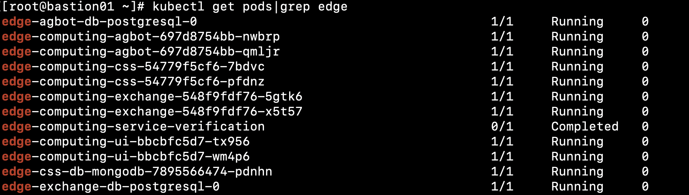

### 安装后的配置

为了便于后续示例演示，本文将 hzn CLI 工具直接安装在边缘 Device 虚拟机中。安装 hzn CLI，安装文件在 horizon-edge-packages 文件夹内。

```
#dpkg -i horizon-edge-packages/linux/ubuntu/bionic/amd64/horizon-cli*.deb

```

Show moreShow more icon

配置环境变量如清单 4 所示：

清单 4\. 配置环境变量

```
export export ICP_URL="https://mycluster.icp:8443"
export EXCHANGE_ROOT_PASS=$(sudo kubectl -n kube-system get secret edge-computing -o jsonpath="{.data.exchange-config}" | base64 --decode | jq -r .api.root.password)
export HZN_EXCHANGE_URL=$ICP_URL/ec-exchange/v1
export HZN_EXCHANGE_USER_AUTH="root/root:$EXCHANGE_ROOT_PASS"
export HZN_ORG_ID=IBM

```

Show moreShow more icon

执行如下命令配置信任 ICP root CA。

```
#kubectl --namespace kube-system get secret cluster-ca-cert -o jsonpath="{.data['tls\.crt']}" | base64 --decode > /tmp/icp-ca.crt
#cp /tmp/icp-ca.crt /usr/local/share/ca-certificates &&update-ca-certificates

```

Show moreShow more icon

生成密匙对。

```
#hzn key create IBM demo@demo.com

```

Show moreShow more icon

查看 hzn 命令是否可以正常访问 exchange API，如果访问正常可见类似图 7 所示结果。

图 7\. hzn 命令返回结果示例

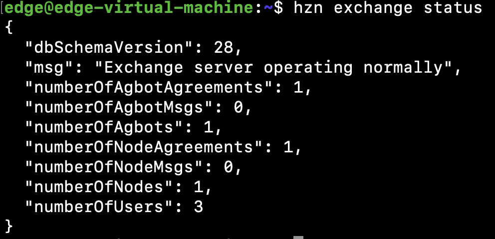

导入 sample edge services。

```
#curl https://raw.githubusercontent.com/open-horizon/examples/v3.2.1/tools/exchangePublishScript.sh | bash

```

Show moreShow more icon

在 MCM Portal UI 上可以查看到 Services 导入结果。如图 8 所示：

图 8\. Edge Computing 服务列表

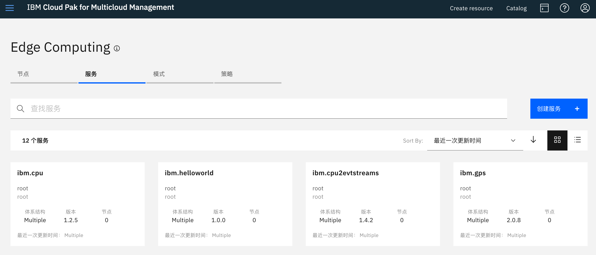

至此 IBM Edge Computing for Devices 产品已经安装成功。

## 注册边缘 Device 并运行 helloworld 服务

### 准备安装 Horizon 代理程序

首先获取安装所需的 ICP API Key 及相关安装文件。本步骤可以在安装有 kubectl 和 cloudctl 工具的 x86 主机上完成，无需在边缘 Device 中运行。

准备环境变量如下：

```
#export ICP_URL= https://mycluster.icp:8443

```

Show moreShow more icon

登录 ICP 环境。

```
#cloudctl login -a $ICP_URL -u PUT-YOUR-ICP-USER-HERE -p PUT-YOUR-ICP-PASSWORD-HERE -n kube-public --skip-ssl-validation

```

Show moreShow more icon

查询 ICP hub-cluster 的名称。本文中为 mycluster。

```
#kubectl get configmap -n kube-public ibmcloud-cluster-info -o jsonpath="{.data.cluster_name}" && echo

```

Show moreShow more icon

生成 ICP 平台的 API Key 用来远程执行 Horizon 代理程序的 hzn 命令。

```
#cloudctl iam api-key-create "PUT-ANY-KEY-NAME-HERE" -d "PUT-ANY-KEY-DESCRIPTION-HERE"

```

Show moreShow more icon

保存该命令输出中的 API Key 供下一步使用。

建立 agent-install.cfg 文件，将 API Key 更新到文件中。为了在安装代理程序后运行 helloworld 服务，在该文件中加入了环境变量 HZN\_EXCHANGE\_PATTERN。

具体内容如清单 5 所示：

清单 5\. 文件 agent-install.cfg 内容

```
#cat agent-install.cfg
ICP_URL=https://mycluster.icp:8443
HZN_EXCHANGE_URL=$ICP_URL/ec-exchange/v1/
HZN_FSS_CSSURL=$ICP_URL/ec-css/
HZN_ORG_ID=mycluster
HZN_EXCHANGE_USER_AUTH=iamapikey:PUT-YOUR-API-KEY-HERE
HZN_EXCHANGE_PATTERN=IBM/pattern-ibm.helloworld

```

Show moreShow more icon

获取 ICP 证书文件 agent-install.crt。

```
#kubectl -n kube-public get secret ibmcloud-cluster-ca-cert -o jsonpath="{.data['ca\.crt']}" | base64 --decode > agent-install.crt

```

Show moreShow more icon

从之前现在的安装包中抽取 Horizon 代理程序软件。

```
#tar --strip-components 6 -zxvf ibm-edge-computing-x86_64-3.2.1.tar.gz ibm-edge-computing-x86_64-3.2.1/horizon-edge-packages/linux/ubuntu/bionic/amd64

```

Show moreShow more icon

将如下准备好的文件拷贝到边缘 Device 中，准备安装 Horizon 代理程序。具体文件列表如清单 6 所示：

清单 6\. 安装 Horizon 代理程序所需文件列表

```
# ls agent-install.cfg agent-install.crt *horizon*
agent-install.cfg                              horizon_2.23.29~ppa~ubuntu.bionic_amd64.deb
agent-install.crt                              horizon-cli_2.23.29~ppa~ubuntu.bionic_amd64.deb
bluehorizon_2.23.29~ppa~ubuntu.bionic_all.deb

```

Show moreShow more icon

### 安装 Horizon 代理程序

目前 IBM Edge Computing for Devices 产品支持的硬件产品型号，请参照 “ [Preparing an edge device](https://www.ibm.com/support/knowledgecenter/SSFKVV_3.2.1/devices/installing/adding_devices.html)” 文档 “Supported architectures” 部分。

本文以 Ubuntu 18.04 LTS 虚拟机为例作为边缘 Device。

安装 Horizon 代理程序的硬件基本需求请参阅 “ [Preparing an edge device](https://www.ibm.com/support/knowledgecenter/SSFKVV_3.2.1/devices/installing/adding_devices.html)” 文档 “Sizing” 部分。

拷贝上文清单 6 中的文件到该边缘 Device 中，并在文件所在目录，运行 agent-install.sh 脚本进行安装：

```
#curl https://raw.githubusercontent.com/open-horizon/anax/master/agent-install/agent-install.sh | sudo -s bash -s -- -i .

```

Show moreShow more icon

导入 agent-install.cfg 中的环境变量。

```
#export $(cat agent-install.cfg)

```

Show moreShow more icon

运行 hzn version、hzn exchange version 及 hzn node list 命令验证安装结果如图 9 所示：

图 9\. 代理程序安装结果验证

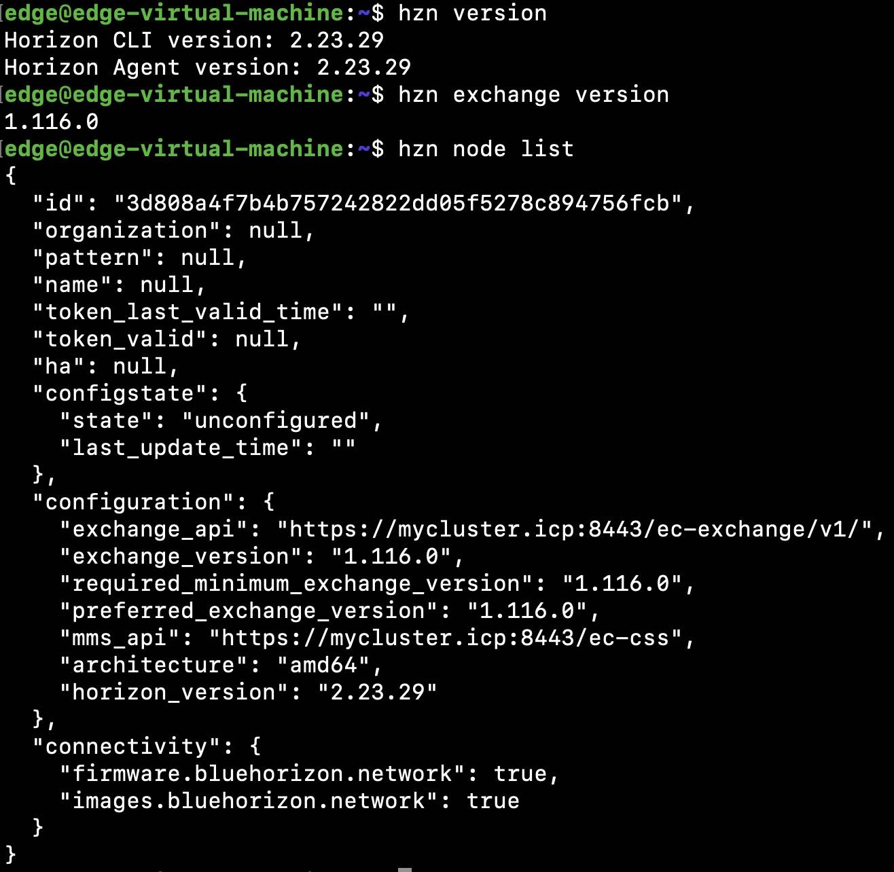

### 注册边缘 Device 并运行 helloworld 服务

导入环境变量。

```
#export $(cat agent-install.cfg)

```

Show moreShow more icon

注册边缘 Device 节点并运行 helloworld 服务。

```
#hzn register -p IBM/pattern-ibm.helloworld

```

Show moreShow more icon

使用 hzn agreement list 命令及 hzn node list 命令验证安装结果如图 10 所示：

图 10\. 代理程序安装结果验证

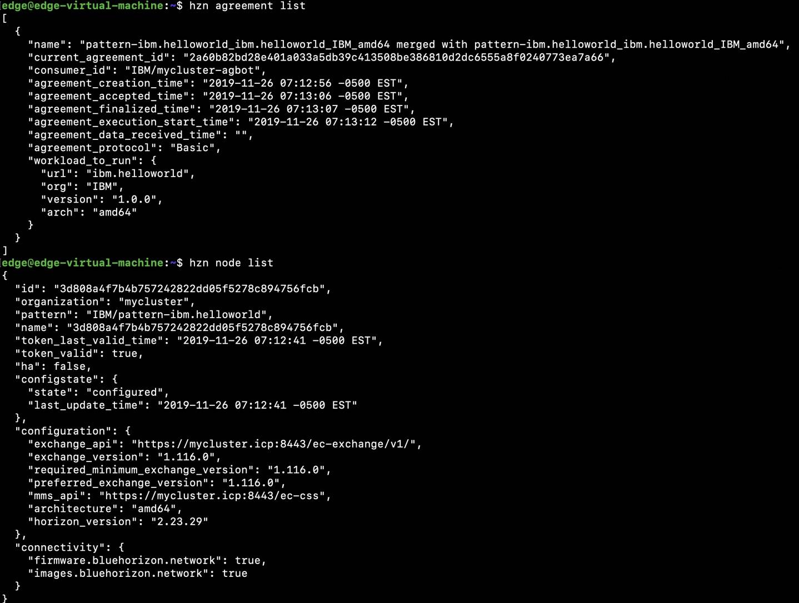

在 MCM Edge Computing Portal 中，可以看到节点已经成功注册并运行 helloworld 服务，如图 11 所示：

图 11\. 边缘 Device 节点列表

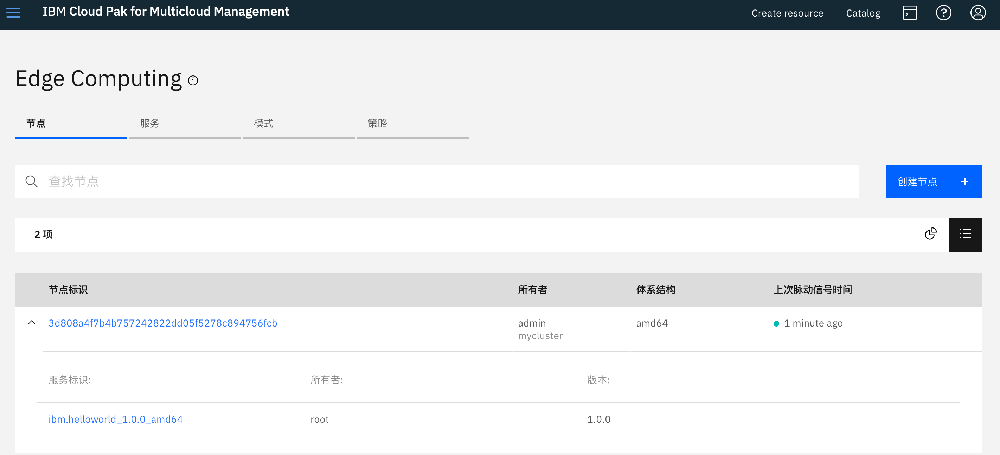

同时，可以看到边缘 Device 中已经启动了 Docker container，从 syslog 可以看到 helloworld 服务正常运行，如图 12 所示：

图 12\. 边缘 Device 运行 helloworld 服务


移除边缘 Device 节点注册并停止 helloworld 服务。

```
# hzn unregister -f

```

Show moreShow more icon

移除成功可见图 13 所示输出。

图 13\. 成功移除边缘 Device 注册并停止 helloworld 服务

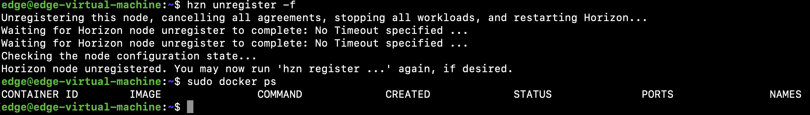

## 定制并运行自己的边缘服务

### 服务定制目标及基本步骤

利用 IEC4D 平台自带的服务开发功能，可以轻松定制运行在边缘 Device 中的 Docker 容器，并作为边缘服务发布到 IEC4D 平台供边缘 Device 使用。本章将利用上文已经部署的边缘 Device 虚拟机作为开发环境，定制一个名为 edgedemo 的边缘服务，定制基本步骤如下：

- 生成 edgedemo 边缘服务的 metadata 并进行配置。
- 定制一个运行边缘服务的 Docker 容器。
- 发布该边缘服务 edgedemo 到 IEC4D 平台。
- 边缘 Device 注册并运行服务 edgedemo。
- 验证边缘服务 edgedemo 的运行状态。

### 示例服务定制过程

首先导入前文生成的环境变量。

```
#export $(cat agent-install.cfg)

```

Show moreShow more icon

在本地开发服务器中，建立开发目录 edgedemo 并建立 edgedemo 服务的 metadata。

具体命令内容如清单 7 所示：

清单 7\. 生成 edgedemo 服务 metadata 的命令

```
# export DOCKER_IMAGE_BASE=mycluster.icp:8500/edge/edgedemo
# mkdir edgedemo
# cd edgedemo
# hzn dev service new -s edgedemo -V 1.0.0 -i $DOCKER_IMAGE_BASE --noImageGen

```

Show moreShow more icon

其中 DOCKER\_IMAGE\_BASE 变量需要与 Docker Registry 名称匹配。命令执行结果如图 14 所示。

图 14\. 生成 edgedemo 服务的 metadata

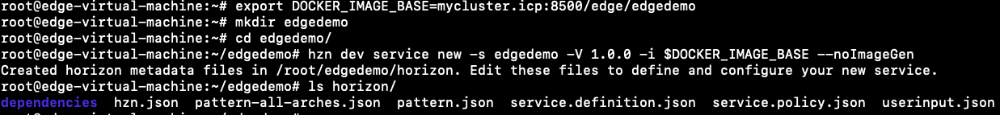

其中 service.definition.json 文件描述了 edgedemo 服务中的启动参数。在其中 deployment 部分加入”binds”: [“/data:/data:rw”] 从而使 Docker 容器在边缘 Device 启动时挂载本地目录 /data。

修改后的 service.definition.json 文件如清单 8 所示。

清单 8\. Service.definition.json 文件内容

```
{
    "org": "$HZN_ORG_ID",
    "label": "$SERVICE_NAME for $ARCH",
    "description": "",
    "public": true,
    "documentation": "",
    "url": "$SERVICE_NAME",
    "version": "$SERVICE_VERSION",
    "arch": "$ARCH",
    "sharable": "multiple",
    "requiredServices": [],
    "userInput": [
        {
            "name": "",
            "label": "",
            "type": "",
            "defaultValue": ""
        }
    ],
    "deployment": {
        "services": {
            "edgedemo": {
                "image": "${DOCKER_IMAGE_BASE}_$ARCH:$SERVICE_VERSION",
                "privileged": false,
        "binds": ["/data:/data:rw"]
            }
        }
    }
}

```

Show moreShow more icon

在 edgedemo 目录中建立 build 容器使用的 Dockerfile。本示例中服务容器中挂载边缘 Device 的 /data 目录，并向文件 edgedevice.log 文件每隔 5 秒写入当前时间及字符串 “I’m a live IBM Edge Device.” 定制后的 Dockerfile 文件如清单 9 所示。

清单 9\. Dockerfile 文件内容

```
# cat Dockerfile
FROM alpine:latest
VOLUME /data
CMD while true; do jobs; MYDATE=$(date); \
echo $MYDATE" I'm a live IBM Edge Device." >> /data/edgedevice.log; \
sleep 5; done;

```

Show moreShow more icon

导入制作 docker 镜像需要的环境变量。

```
#eval $(hzn util configconv -f horizon/hzn.json)
#export ARCH=$(hzn architecture)

```

Show moreShow more icon

运行如下命令制作 docker 镜像。镜像制作结果如图 15 所示。

```
# docker build -t "${DOCKER_IMAGE_BASE}_$ARCH:$SERVICE_VERSION" .

```

Show moreShow more icon

图 15\. 生成 Docker 镜像

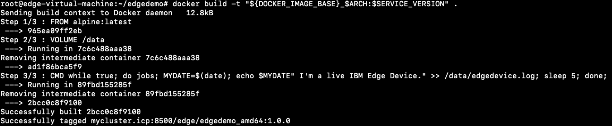

在本地试运行该服务容器，运行结果如图 16 所示。

```
# hzn dev service start -S
# sudo docker ps

```

Show moreShow more icon

图 16\. 服务容器运行成功

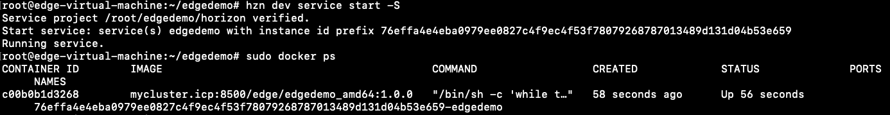

停止该服务容器的运行。

```
# hzn dev service stop

```

Show moreShow more icon

将定制的服务 edgedemo 发布到 IEC4D 平台,如图 17 所示。此步骤如果遇到 “unauthorized: authentication required” 问题，请检查 docker login 是否正确，并确认 docker registry 中存在 edge namespace。

```
# hzn exchange service publish -f horizon/service.definition.json
# hzn exchange pattern publish -f horizon/pattern.json

```

Show moreShow more icon

图 17\. 将服务导入 IEC4D


验证服务导入结果，如图 18 所示。

```
# hzn exchange service list
# hzn exchange pattern list

```

Show moreShow more icon

图 18\. 服务导入成功

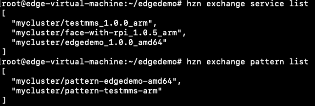

注册边缘 Device，并运行 edgedemo 服务。运行如下命令，输出结果如图 19 所示。

```
# hzn register -p pattern-edgedemo-amd64
# docker ps

```

Show moreShow more icon

图 19\. 边缘 Device 成功注册并运行 edgedemo 服务

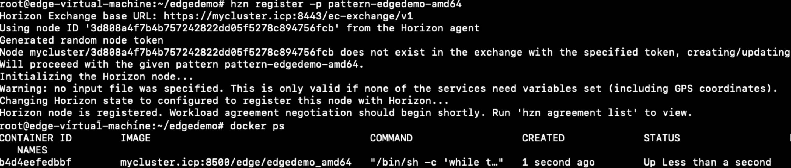

使用命令查看 /data/edgedevice.log 文件中的输出，结果如图 20 所示。

由此可见，edgedemo 服务已经在边缘 Device 中正常运行。

```
# tail -f /data/edgedevice.log

```

Show moreShow more icon

图 20\. Edgedemo 服务运行结果


## 结束语

通过本文，相信您对 IBM 边缘计算产品 IBM Edge Computing for Devices 的架构、安装部署及边缘服务定制有了初步的了解，随着边缘计算技术的不断发展、完善，以及未来 5G 网络的加持，边缘计算的使用场景将越发广阔。

## 参考资源

- [IBM 官方网站 What is edge computing?](https://www.ibm.com/cloud/what-is-edge-computing)
- [IBM® Edge Computing v3.2.1 documentation](https://www.ibm.com/support/knowledgecenter/SSFKVV_3.2.1/kc_welcome_containers.html)
- [基于 ICP 的 IBM Edge Computing 的环境搭建](http://www.ibm.com/developerworks/cn/cloud/library/cl-lo-icp-based-ibm-edge-computing-environment-setup/index.html)