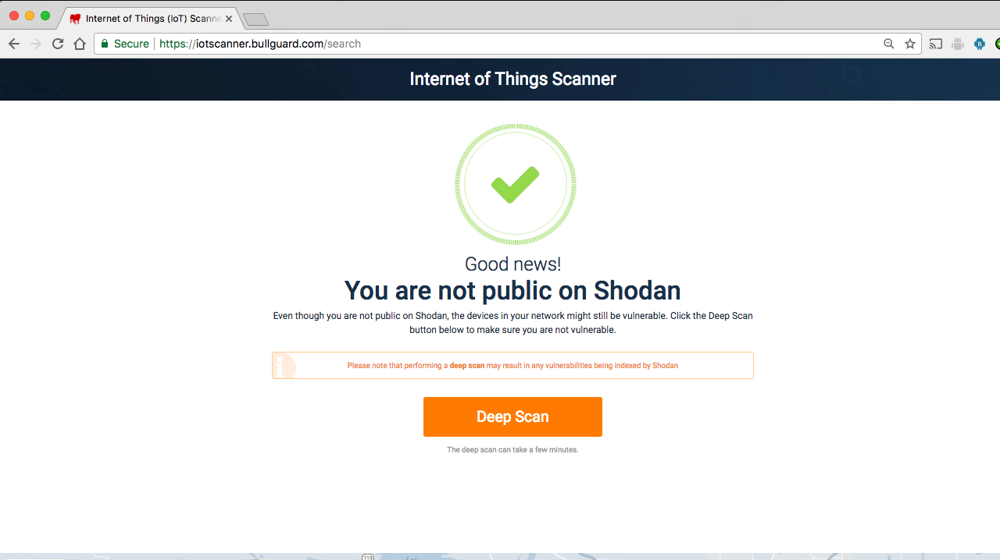
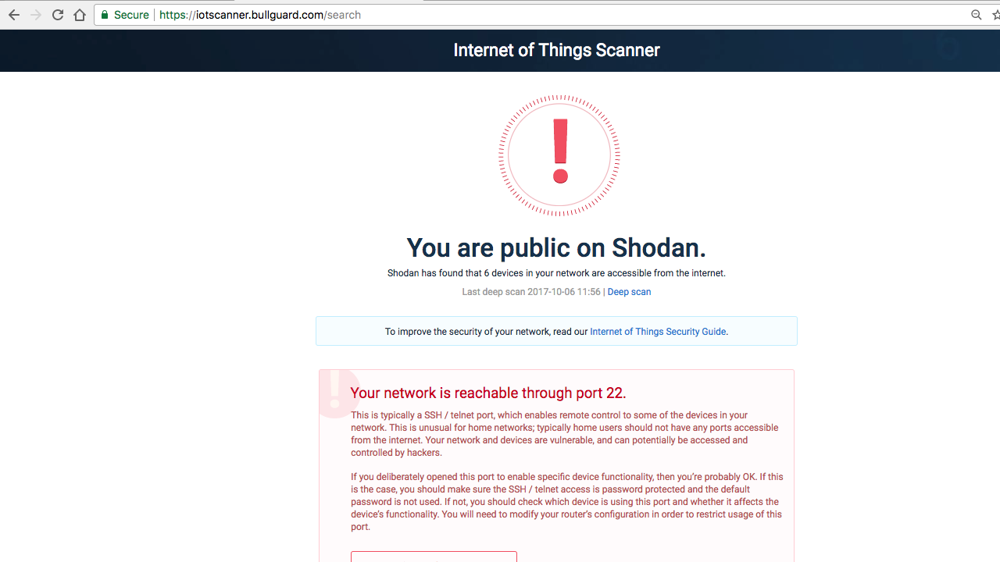
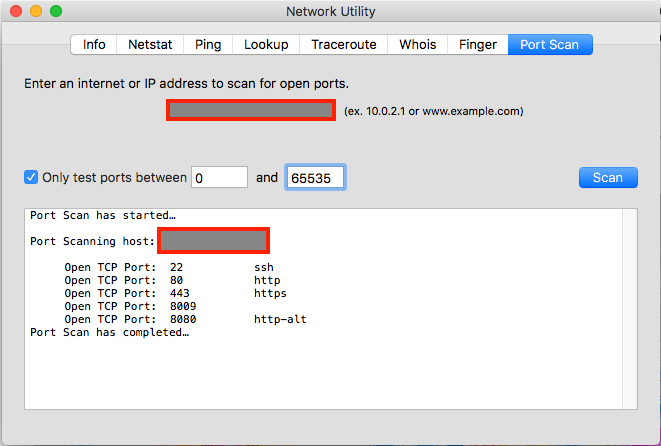

# IoT 恶意软件攻击剖析
如何预防 IoT 设备加入僵尸大军

**标签:** IoT

[原文链接](https://developer.ibm.com/zh/articles/iot-anatomy-iot-malware-attack/)

J Steven Perry

发布: 2017-12-27

* * *

您的 IoT 设备正在遭受攻击！（打哈欠）

哦，我知道了。很长一段时间以来，我一直听到关于 IoT 设备有多不安全的消息。老实讲，我几乎停止关注 IoT 恶意软件攻击了。这有什么新鲜的。更何况，这是别人才会遇到的事，对吧？

不对。如果您的家里和/或企业网络上有 IoT 设备，您可能已经遭到攻击。如果没有受到攻击，几乎可以肯定这只是时间问题。真正令人感到恐怖的是，您的设备可能已遭到攻击并受到损害。而您可能还不知情。

现在我引起您的注意了吗？很好。那么这个问题有多严重？在 [HP 2015 年的调研](http://files.asset.microfocus.com/4aa5-4759/en/4aa5-4759.pdf) 中，100% 的受测试 IoT 家庭安全设备都被发现有“重大”漏洞，而且所有受测试设备在如今的任何智能家庭中都有可能找到：智能电视、家用恒温器、网络摄像头、智能锁，等等。

漏洞包括弱密码，在设备通过网络通信时没有加密，以及帐户枚举（也就是使用密码重置功能找到有效的用户帐户 ID）。

您也许会感到疑惑，为什么 IoT 设备是黑客和僵尸牧人经常攻击的目标呢？比如 2016 年，攻击者分别于 [9 月 20 日对 Brian Krebs](https://krebsonsecurity.com/2016/09/krebsonsecurity-hit-with-record-ddos/)（安全博主）和 [10 月 21 日对 Dyn](https://developer.ibm.com/dwblog/2016/dyn-attacks-internet)（美国 DNS 提供商）发动了分布式拒绝服务 (DDoS) 攻击。

如果您像真正钻研此主题之前的我一样，您可能会有以下疑问：

- IoT 设备在幕后看起来是什么样的？
- IoT 恶意软件攻击看起来是什么样的？
- 如何才能保护 IoT 设备远离攻击？

在本文中，我将回答这些问题。

## IoT 设备剖析

要了解是什么让 IoT 设备容易受到攻击，需要详细分析一下幕后发生的事情。

您或许非常清楚“IoT 设备”这个词的含义，但为了让我们达成一致，让我定义一下这个词，因为本文中将会使用它。

IoT 设备是一种特殊用途的设备，它以无线方式连接到网络，并通过无线连接发射和接收数据，从而监控或控制”物体”（从现在开始我将它称为物体）。

### IoT 设备硬件

要了解 IoT 设备的核心是什么，需要了解让 IoT 设备正常工作的 [底层硬件](http://www.ibm.com/developerworks/cn/iot/library/iot-lp101-best-hardware-devices-iot-project/index.html) 的重要特征：

- 数据获取和控制
- 数据处理和存储

基本上讲，IoT 设备包含 _传感器_、 _执行器_ 或同时包含二者。传感器获取数据，执行器控制或处理数据。

- **传感器** _监控_ 物体，提供物体的相关数据，比如温度、光线强度或电池电量。
- **执行器** 通过设备中的硬件 _控制_ 物体，比如智能恒温器中的控件、智能灯泡中的变光开关，或机器人吸尘器中的齿轮马达。执行器表示让物体”运行”的物理接口，比如打开热水器，调暗灯光，或让机器人吸尘器移动到它的充电位置。

所有 IoT 设备都有一种方式来处理传感器数据，将该数据存储在本地（如果有必要），并提供让该设备运行的计算能力。

如果来自多个传感器的数据需要协调，或者如果需要将数据存储在闪存中（出于某种原因），IoT 设备的数据处理组件会执行此工作。

### IoT 设备固件

运行 IoT 设备的 [固件](https://en.wikipedia.org/wiki/Firmware) 是位于硬件与外部世界之间的板载软件，而且固件通常属于两种类别之一：嵌入式固件或基于操作系统（基于 OS）的固件。

#### 嵌入式固件

IoT 设备的资源有限，所以它们常常使用自定义构建的嵌入式固件，这是在设备上运行的软件的另一种叫法。在许多情况下，对设备制造商而言，唯一具有成本效益的解决方案，是聘请深入了解该硬件的程序员编写嵌入式固件来与该硬件进行交互。

嵌入式软件工程师有双重责任。除了嵌入式固件之外，他们还要编写软件来与硬件进行交互，并编写应用软件来连接设备的用户，比如配置设备的接口。

#### 基于 OS 的固件

随着 IoT 设备变得“更加智能”（也即更复杂） — 更多传感器、更高的数据处理和存储能力，等等 — 对管理和利用新功能的更复杂软件的需求也在增长。

就像第一批计算机从 ROM 中加载固件来运行计算机的基本功能演化为像 MS-DOS 这样的操作系统，IoT 设备正在以类似的方式发展成熟。IoT 设备现在可能运行着一个操作系统 (OS)，以便在硬件和在设备上运行的其他软件之间提供一个抽象层。

通过从设备的应用软件中抽象出底层硬件， [IoT 操作系统](https://devopedia.org/iot-operating-systems) 实现了一种人们熟悉的劳动分工。嵌入式软件工程师（他们理解硬件）现在可以集中精力编写设备驱动程序，而程序员（他们不需要深入理解硬件）则集中精力编写让设备变得“智能”的软件。

许多设备制造商偏爱选择的 OS 是 [Busybox](https://busybox.net)，这是 Unix 操作系统的一个精简版，包含许多最常用的工具，占用空间非常小，而且在单个可执行程序中提供了 Unix 的许多功能。

### IoT 设备无线通信

IoT 设备通常进行无线通信，这意味着它们可以位于家里或企业中的任何地方。设备的通信需求根据其所设计的工作方式进行变更。

一些设备被设计为与路由器建立直接 [802.11 Wifi](https://en.wikipedia.org/wiki/IEEE_802.11) 连接来完成其工作。设备可以通过路由器访问互联网。动作感应安全摄像头就是这种设备的一个流行示例，它使用了 Wifi，因为它可能需要大量带宽。

一些设备被设计为作为一组 IoT 设备的一部分来运行。例如，连接到智能家庭网关设备（有时称为集线器）的开/关窗传感器使用 [Z-Wave](http://www.z-wave.com) 或 [Zigbee](http://www.zigbee.org)（或者 [其他几种协议之一](http://www.ibm.com/developerworks/cn/iot/library/iot-lp101-connectivity-network-protocols/index.html)）等无线协议，所以它可以报告窗户已打开。

### IoT 设备管理

可以通过两个主要步骤管理 IoT 设备：您需要将设备连接到网络（配备），在建立连接后，就可以监控和控制它。下面将详细解释这些步骤。

#### 配备设备

许多 IoT 设备（尤其是像温度传感器这样的小型设备）没有内置的用户交互硬件，比如触摸屏，这些设备称为“无头”设备。配置无头设备的一种方式是使用 Wifi Protected Setup (WPS)，这需要一个启用了 WPS 的设备和一个启用了 WPS 的路由器。最简单的场景是，您按下 IoT 设备上的 WPS 按钮，然后按下路由器上的 WPS 按钮，两个设备最终会相连在一起。

一些设备将创建一个 Wifi 接入点，您可以使用智能手机连接此接入点来访问一个设置程序，您可以在设置程序中输入您的 Wifi 网络凭证。

其他设备（比如网关）扫描并添加它检测到处于设置或配对模式下的设备。您只需配置网关，让它能访问互联网，告诉它寻找其他设备，并按照特定于设备的指令将设备设置为配对模式，这样它们就可以连接到网关。

#### 监控和控制设备

将设备连接到网络后，就可以监控和控制它。一种控制方法是通过智能手机，可以将手机直接连接到网关（比如您家中的网关）或通过云服务的接口来控制设备。

一些设备（比如 CCTV 安全摄像头）直接连接到互联网且拥有专门的 IP 地址。这些设备可直接通过互联网进行访问，绕过对云服务提供商或网关的需求。

许多 IoT 设备安装在家中或企业内，但是，通过修改防火墙来启用端口转发，可以直接向互联网公开这些设备。这使得用户可以在互联网上的任何位置方便地访问设备，以监控和控制它。

### IoT 设备安全性

最后是安全性。不错，这是最后一个考虑要素。不幸的是，这是 IoT 设备的一个最重大的问题：安全性几乎总是在最后才考虑。它是一种事后措施。

我明白。很难创建一个能够连接到无线网络，用电量非常少，而且（对用户）最重要的是便宜的资源受限却可靠的设备。由于生产一个运行正常的设备涉及到如此多的工作，因此人们将安全性当作开发生命周期中的最后一个考虑因素也就不足为奇了。

值得注意的是，有许多制造商对待安全性都非常严肃，但他们的设备可能价格不菲。这就需要做出权衡。

正因如此，现在网络上所有设备才会这么便宜，或者说很经济、 _具有成本效益_，但非常不安全。朋友们，这就是一场等待发生的 IoT 恶意软件攻击。

## IoT 恶意软件攻击剖析

我们经常听说“IoT 恶意软件”，但这到底是什么意思？让我分开来讲，首先从攻击者开始。

### 攻击者

这是一群怎样的人？简短（且不大令人满意）的答案是：没有人确切地知道。

在一篇文章中， [著名安全专家 Bruce Schneier](https://www.lawfareblog.com/someone-learning-how-take-down-internet) 表示，根据最近的攻击规模，作恶者或许不是激进主义者、研究人员，甚至不是罪犯。

据 Schneier 的说法，这些攻击采用多个攻击矢量，导致攻击目标在此过程中启动所有防御措施，这些攻击旨在测试目标的防御能力。Schneier 表示这些精心执行的攻击是 [国家行为者](https://en.wikipedia.org/wiki/State_actor)（政府机构）的特征。目前来看，这是一种可怕的想法，希望 Schneier 有点反应过度了。

无论如何，我们不是非常清楚攻击者是谁，但有一件事很清晰：攻击者是聪明的、足智多谋的黑客。不要低估他们。

### 攻击矢量

对于任何类型的攻击（无论是否是恶意软件），攻击者都需要获得一个 [_攻击面_](http://internetofthingsagenda.techtarget.com/definition/IoT-attack-surface)，攻击面被定义为所有设备的漏洞的总和。当攻击者识别并熟悉攻击面后，他们就会识别一个 _攻击矢量_，也就是攻击者可用来攻破设备的路径，这使得攻击者能够让设备执行本不应该执行的操作。

让我们看看一些常见的 IoT 设备攻击矢量。

#### 弱密码

除了安全性在设备开发生命周期中的优先级较低以外，制造商还希望他们的设备容易设置和使用。制造商知道许多 IoT 设备的最终用户往往不懂技术。除了让设备容易设置和使用之外，制造商还提供了简单的设备登录方法，比如单一的用户名/密码组合。

这种简单性导致了 3 个问题：

1. 在设置设备后，大部分用户就开始愉快地使用设备，并让设备的登录凭证保持不变。
2. 设备发货后，默认用户名/密码就被添加到该设备的已知漏洞列表中。
3. 许多制造商继续使用简单的用户名/密码组合（例如 admin/admin、user/user 等），或者创造新的同样简单的组合，这些组合很快加入到已知矢量行列中。

#### 缺少加密

因为安全性常常不幸地被当作 IoT 设备开发生命周期中的事后措施，所以加密等安全特性往往会被忽略，甚至没有被考虑。业界正在申请嵌入式加密，比如能在 IoT 设备中处理加密和身份验证的加密协处理器。在设计和构建 IoT 应用程序时，必须考虑 [保护您在网络上的数据](http://www.ibm.com/developerworks/cn/iot/library/iot-trs-secure-iot-solutions2/index.html)（采用数据加密技术）。

不幸的是，许多 IoT 设备不支持加密，这意味着您需要实际下点工夫来调查打算在整个解决方案中使用的设备，确保它们提供了加密功能。

#### 后门

一些 IoT 设备制造商在他们的设备中放入了称为 _后门_ 的“隐藏”访问机制。从表面上看，该机制使他们更容易为设备提供支持。但实际上，这可能也为黑客打开了 _前门_。尽管大多数用户没有破解后门的技术知识，但对黑客而言，这就是小儿科。

不过不必担忧，一旦后门被知道，制造商就会大方地道歉并立即发布固件更新来关闭后门。对吧？您应该也会这么想。不幸的是，在许多 [类似这样的](https://tech.slashdot.org/story/17/03/05/1828202/hidden-backdoor-discovered-in-chinese-iot-devices) 的案例中，制造商的设备中有一个已知的后门，但制造商没有关闭后门，只是让它更难访问（或者他们是这么认为的）。

在大部分情况下，后门是一个用户名/密码或设备上的一个开放端口（您无法关闭）。将这些称为“后门”是一种错误。对黑客而言，这些就是敞开着的前门。一目了然。

#### 向互联网公开

任何时候，向互联网公开某个设备（意味着它将接受传入的流量），该设备就会面临攻击。我可以保证这一点。

想想我的工作中的这个例子。我租了一些虚拟服务器来运行网站，而且将端口 22 保持开放，以便我能通过 SSH 连接它们。仅使用默认的防火墙规则时，这些主机常常受到攻击。一个小时发生了数百次登录尝试！当然，我运行了 iptables 来在我管理的每个服务器上设置了规则，以拦截登录失败的 IP 地址足够长时间，从而减弱脚本化的攻击。所以现在我每个小时“仅”看到来自全球的 5-10 次失败登录。

我的讨论重点是：向互联网公开任何事物，它都会受到攻击。而且不同于可以控制防火墙和主机访问方式的加固的服务器，大部分 IoT 设备拥有很少甚至没有安全措施，特别容易受到攻击。

#### 但是等等，这还没完……

如您所见，IoT 设备充满着漏洞。弱密码与直接公开设备和后门相结合，使得甚至最笨拙的黑客（顺便说一下，它们被称为“脚本小子”）也能轻松地攻破 IoT 设备。

认为只有国家行为者和最精明的黑客才拥有攻破您的 IoT 设备的技能？请再想想。

Open Web Application Security Project (OWASP) 有一个名为 IoT Attack Surface Area Project 的子项目，他们有一个 IoT 攻击面中的 [潜在漏洞列表](https://owasp.org/www-project-internet-of-things/#IoT_Attack_Surface_Areas_Project)。

### 攻击

您已看到攻击者如何进入 IoT 设备，现在让我们谈谈攻击本身。

首先需要明确的是，IoT 攻击的最终目的是接管设备，并将黑客个人意志强加到设备之上。攻击分两个阶段进行：扫描并接管阶段，以及攻击启动阶段。两个阶段通常都由一个 [指挥控制 (CNC) 程序](http://searchsecurity.techtarget.com/feature/Command-and-control-servers-The-puppet-masters-that-govern-malware) 执行。

#### 扫描并接管

CNC 程序扫描网络上的 IP 地址，查找具有开放端口的主机，如果找到一个端口，就会尝试使用 [一组已知的默认用户名/密码组合](https://www.csoonline.com/article/3126924/security/here-are-the-61-passwords-that-powered-the-mirai-iot-botnet.html)（例如 admin/admin、root/admin、user/user 等）进行登录。

如果登录成功，则会运行一个脚本来报告设备的 IP 地址和要使用的登录凭证。然后，CNC 程序会将恶意软件推送到它需要进行攻击的设备。该设备现在已 [被攻破](https://en.wikipedia.org/wiki/Pwn)，而且正等待来自 CNC 的开始攻击的进一步指令。

攻击扫描程序继续执行此过程，接管尽可能多的新设备。接管的每个设备被称为 _僵尸_。

没有人确切知道 IoT 设备从变成僵尸到在攻击中被利用会经历多长时间。可能会经过几小时、几天、几星期或者几个月，僵尸才被要求采取行动。在此期间，设备的所有者几乎完全不知道发生了什么。

#### 攻击启动

一个 IoT 设备通常不是很强大，所以一个僵尸没有多大威胁。但是如果创建了一个连接在一起的僵尸群来实现一个共同目的，那就要当心了！这种 _僵尸网络_ 攻击由数百、数千乃至数十万个僵尸组成，它们都在黑客的掌控之下。太恐怖了。

攻击者通常使用他们的僵尸网络武器实现两种目的之一：DDoS 攻击或垃圾邮件僵尸。

- **拒绝服务 (DoS) 攻击** 旨在通过向目标主机发送大量的 HTTP（和其他）流量，使其无法应对，从而削弱主机的性能。最终，目标主机无法响应，并发生宕机。

    分布式拒绝服务 (DDoS) 攻击由许多主机计算机（数千或数十万台）发起，而非一台高性能计算机（或计算机集群）。在 IoT 僵尸网络攻击中，主机计算机就是众多的 IoT 设备。目标毫无幸免的机会。

- **垃圾邮件僵尸** 正在助长垃圾邮件行业。 [垃圾邮件行业有着巨大的利润](https://www.theguardian.com/technology/2013/aug/28/facebook-spam-202-million-italian-research)。系统管理员花大量时间和精力将已知的垃圾邮件中继加入黑名单，希望只有少量垃圾邮件进入您的收件箱。

    但是如果垃圾邮件看起来是从未加入黑名单的 IP 地址发送的呢？一个通过老奶奶的路由器（grandma’s router）在老奶奶的网络（grandma’s network）上运行的 IoT 设备？完美！老奶奶的 IP 地址（ grandma’s IP address）不可能出现在黑名单中。此外，如果老奶奶的智能电视（grandma’s smart TV）只是 10 万个发送垃圾邮件的僵尸之一，可以想象尝试找出所有这些要加入黑名单的 IP 地址对管理员而言是个多么可怕的噩梦！

一旦攻击者有了可自由使用的僵尸网络武器，他们就拥有了海量小设备，可以用它们来创造一股 [可怕的网络洪流](https://www.theguardian.com/technology/2016/oct/26/ddos-attack-dyn-mirai-botnet) 或者向全世界发送垃圾邮件。

## IoT 恶意软件攻击的最新示例

以下是您可能听说过的一些最新的 IoT 恶意软件攻击。

### Mirai

这是一次 Busybox 攻击。它的原理是扫描互联网以寻找开放了端口 23 (telnet) 的主机，然后使用弱密码矢量获取运行 Busybox 的设备的访问权。进入该设备之后，就会安装恶意软件并连接 CNC 服务器，然后在这里等待进一步指令。攻击时，Mirai CNC 服务器会指示所有受它管辖的僵尸，命令它们 [发送海量的各种](https://medium.com/@cjbarker/mirai-ddos-source-code-review-57269c4a68f) 流量，使目标主机不堪重负。

Mirai 或许是最著名的攻击，（事实证明）它 [主要使用受感染的 CCTV 摄像头设备](https://krebsonsecurity.com/2016/10/hacked-cameras-dvrs-powered-todays-massive-internet-outage/) 来执行攻击。Mirai 在一些方面与众不同：

- Mirai 包含一个“勿惹”服务器列表，其中包含通用电气、惠普和美国国防部。
- Mirai 的作者（只知道名叫“Anna-senpai”）于 2016 年 9 月 30 日在 Hack Forums 上 [发布了源代码](https://krebsonsecurity.com/2016/10/source-code-for-iot-botnet-mirai-released/)。

Mirai 执行了多次重大攻击。第一次攻击是 2016 年 9 月 20 日针对 [安全博主 Brian Kreb 的网站](https://krebsonsecurity.com/2016/09/krebsonsecurity-hit-with-record-ddos/) 发动的。另一次攻击发生在 2016 年 10 月 21 日，是 [针对 US DNS 提供商 Dyn](https://www.theguardian.com/technology/2016/oct/21/ddos-attack-dyn-internet-denial-service) 发动的，破坏了流行的流媒体服务 Netflix，以及 Twitter、Airbnb 等。

Errata Security 博客的安全研究人员 Robert Graham 在美国加州旧金山的 [2017 RSA 安全大会上发表了对该攻击的分析](https://www.rsaconference.com/writable/presentations/file_upload/hta-w10-mirai-and-iot-botnet-analysis.pdf)。

### Brickerbot

安全公司 Radware 于 2017 年 4 月 4 日首次发出警告，声称存在一种他们称为“Brickerbot”的潜在攻击。

作为另一种基于 Busybox 的攻击，这个恶意软件会让设备变成砖（让它无法使用），该攻击因此而得名。

在这种攻击中（ [称为永久性拒绝服务](https://security.radware.com/ddos-threats-attacks/brickerbot-pdos-permanent-denial-of-service/)(PDoS) 攻击），Brickerbot 通过一系列 Busybox 命令完成攻击：通过 Unix `rm` 命令擦除设备内部存储中的所有数据，并通过命令重新配置内核，最后重新启动（已无法使用的）设备。

在 4 月末，一个“灰帽”黑客（Hack Forums 的用户 ID 为“Janit0r”）声称是该恶意软件的作者，他在一篇 HackForums 帖子中声称，该病毒针对的是非常容易攻破的设备的“粗心制造商”。您可以在 [这里](https://www.bleepingcomputer.com/news/security/brickerbot-author-claims-he-bricked-two-million-devices/) 进一步了解它。

### 垃圾邮件僵尸

电子邮件是垃圾邮件发送者的命脉，他们的真正目的是通过包含醒目的主题、低俗的内容等（称为点击诱饵）的电子邮件将流量引导到客户的网站。用来诱惑您单击链接的战术各不相同（“一夜减掉 100 磅！立即单击此处！”或“免费获取 iPhone。立即单击此处！”）。

整体战略的关键是让邮件能够发送到您的收件箱。垃圾邮件发送者面临的主要问题是如何发送他们的电子邮件，才会不被垃圾邮件过滤器检测出，许多过滤器都使用了包含已知会被垃圾邮件发送者使用的简单邮件传输协议 (SMTP) 服务器 IP 地址的“黑名单”（比如借助 [Open Relay](https://en.wikipedia.org/wiki/Open_mail_relay)）。

但是，如果垃圾邮件发送者可以为其 SMTP 服务器使用看起来合法的 _代理_（称为 SOCKS 代理），这些代理的 IP 地址未加入黑名单（还记得老奶奶的智能电视吗？），他们的垃圾邮件有更大的几率会找到目标（但是很抱歉，您仍然无法获得免费 iPhone）。

Linux.ProxyM 病毒是一种 [_二次载荷_ 特洛伊木马](https://bestsecuritysearch.com/linux-proxy-trojan-infects-thousands-devices/)，它会在初始特洛伊木马感染您的计算机后运行。如何运行？原理类似于：您被诱惑单击“立即获取免费 iPhone”链接，并同意安装“简单免费 iPhone 插件”（初始特洛伊木马），该木马会感染您的计算机。就在那时，一段脚本将会运行，扫描薄弱的 IoT 设备。如果它找到一个这样的设备，就使用现在熟悉的弱凭证攻击来获取访问权。

获得设备的访问权后，设备就会被包含执行攻击的实际恶意软件的二次载荷所感染。这个恶意软件连接到一个提供电子邮箱地址列表的 CNC 服务器和一个 SMTP 服务器。您的设备此时充当着 SOCKS 代理，它会在 CNC 服务器的命令下发送垃圾邮件。

## 如何保护 IoT 设备

那么如何保护您的 IoT 设备免受感染？从一开始就不让它们受感染。这个建议确实很有帮助。

如果您已经部署了设备，我有一些好消息和一些坏消息。坏消息是，如果您的设备直接对互联网公开（就像我之前介绍的那样），在最好的情况下，它们只是已经被探测到，而在最糟的情况下，它们已转变为僵尸。

好消息是，大部分 IoT 软件都位于内存中，所以只要设备通上电，恶意软件就会运行。重新启动设备后，恶意软件就会消失。

言归正传，最好的方法仍然是从一开始就预防设备感染。以下是一些来自 Captain Obvious 的技巧。

### 始终更改默认密码

配备一台新设备时，始终更改默认密码。这看起来很简单，但在忙碌地设置好新设备，使您能正常使用它之后（我的意思是让它执行有用的工作），您很容易跳过这个关键步骤。 _不要跳过这一步！_

进入管理界面更改密码。如果无法这么做，而且您计划向互联网公开设备，请退回设备。当然您可能很乐观地希望设备没有被转变成僵尸，但恶意软件作者喜欢的就是乐观主义者。

### 移除包含 telnet 后门的设备

供应商可能认为自己植入这些后门很聪明，其实不然。这些后门可能让制造商更容易提供支持，但您付出的代价是什么？

应该从网络中移除开放了 telnet 后门的设备，但是您如何知道这些设备？有一些 IoT 设备扫描器（ [比如来自 BullGuard 的扫描器](https://iotscanner.bullguard.com/search)）能扫描一个名为 [Shodan](https://www.shodan.io/) 的 IoT 搜索引擎，根据您发起扫描的计算机的 IP 地址来揭示您的设备是否很脆弱。 _请注意：作为一条经验规则，应该仅扫描您自己的或所有者允许您扫描的 IP 地址！_

这是一个我在我的计算机运行的扫描。

##### BullGuard 对我的原始公共 IP 地址的扫描

如果扫描结果类似这样，您可能存在问题：

##### BullGuard 扫描显示了潜在问题

### 绝不要直接向互联网公开设备

面对是否通过开放防火墙将设备向互联网公开的问题，正确的答案几乎总是 **不公开** 。

BullGuard 提供了一种“深度扫描”方式来检查您的 ISP 分配的公开 IP 地址上的所有开放端口。这使我能够查看我的路由器上是否有任何开放端口。看到结果是没有时，我如释重负。

##### BullGuard 对我的原始公共 IP 地址的深度扫描

### 在所有机器上运行端口扫描

所以像 BullGuard 这样的扫描器能让您在一定程度上放心您的 IP 地址是锁定的，但是如果您像我一样，您可能希望亲自运行这些工具。

我使用了 Mac Network Utility 来扫描我租用的一个虚拟主机，看看哪些端口是开放的。

##### Mac Network Utility 扫描

实际上我对这些结果并不感到惊讶。这个虚拟服务器托管着一个网站，运行着 Apache，有一个 Tomcat AJP 后端，还提供了用于管理用途的 SSH 访问权。

## 结束语

在本文中，我详细剖析了 IoT 设备。然后，剖析了一个 IoT 恶意软件攻击和一些引起轰动的恶意软件攻击。最后，展示了如何通过更改默认密码和运行 IP 地址扫描来保护 IoT 设备。

本文翻译自： [Anatomy of an IoT malware attack](https://developer.ibm.com/articles/iot-anatomy-iot-malware-attack/)（2017-10-31）