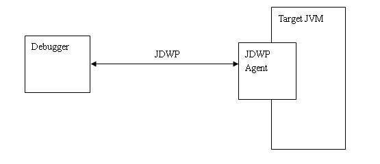
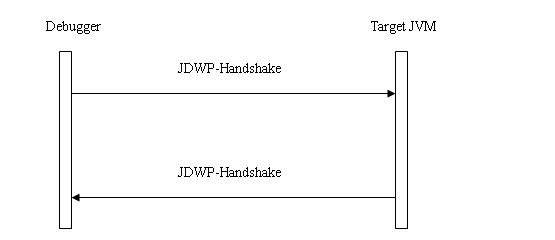
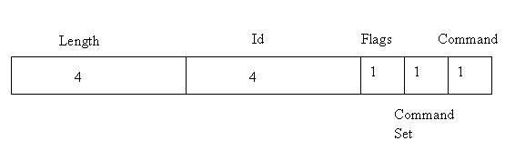
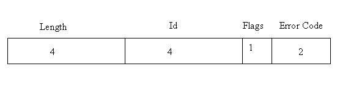
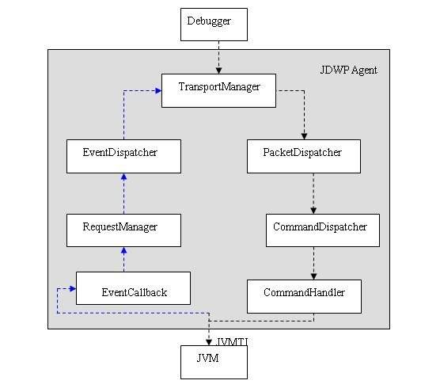
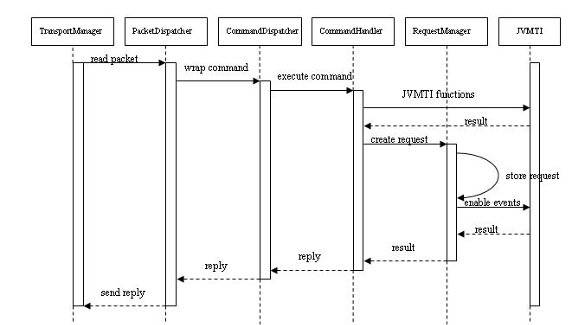
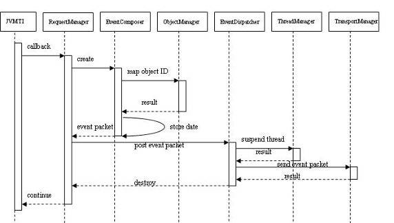

# JDWP 协议及实现
DWP 的协议细节并通过实际调试中的例子展开揭示 JDWP 的实现机制

**标签:** Java

[原文链接](https://developer.ibm.com/zh/articles/j-lo-jpda3/)

虞俊杰, 徐睿智

发布: 2009-09-03

* * *

JDWP 是 Java Debug Wire Protocol 的缩写，它定义了调试器（debugger）和被调试的 Java 虚拟机（target vm）之间的通信协议。

## JDWP 协议介绍

这里首先要说明一下 debugger 和 target vm。Target vm 中运行着我们希望要调试的程序，它与一般运行的 Java 虚拟机没有什么区别，只是在启动时加载了 Agent JDWP 从而具备了调试功能。而 debugger 就是我们熟知的调试器，它向运行中的 target vm 发送命令来获取 target vm 运行时的状态和控制 Java 程序的执行。Debugger 和 target vm 分别在各自的进程中运行，他们之间的通信协议就是 JDWP。

JDWP 与其他许多协议不同，它仅仅定义了数据传输的格式，但并没有指定具体的传输方式。这就意味着一个 JDWP 的实现可以不需要做任何修改就正常工作在不同的传输方式上（在 JDWP 传输接口中会做详细介绍）。

JDWP 是语言无关的。理论上我们可以选用任意语言实现 JDWP。然而我们注意到，在 JDWP 的两端分别是 target vm 和 debugger。Target vm 端，JDWP 模块必须以 Agent library 的形式在 Java 虚拟机启动时加载，并且它必须通过 Java 虚拟机提供的 JVMTI 接口实现各种 debug 的功能，所以必须使用 C/C++ 语言编写。而 debugger 端就没有这样的限制，可以使用任意语言编写，只要遵守 JDWP 规范即可。JDI（Java Debug Interface）就包含了一个 Java 的 JDWP debugger 端的实现（JDI 将在该系列的下一篇文章中介绍），JDK 中调试工具 jdb 也是使用 JDI 完成其调试功能的。

##### 图 1\. JDWP agent 在调试中扮演的角色



## 协议分析

JDWP 大致分为两个阶段：握手和应答。握手是在传输层连接建立完成后，做的第一件事：

Debugger 发送 14 bytes 的字符串”JDWP-Handshake”到 target Java 虚拟机

Target Java 虚拟机回复”JDWP-Handshake”

##### 图 2\. JDWP 的握手协议



握手完成，debugger 就可以向 target Java 虚拟机发送命令了。JDWP 是通过命令（command）和回复（reply）进行通信的，这与 HTTP 有些相似。JDWP 本身是无状态的，因此对 command 出现的顺序并不受限制。

JDWP 有两种基本的包（packet）类型：命令包（command packet）和回复包（reply packet）。

Debugger 和 target Java 虚拟机都有可能发送 command packet。Debugger 通过发送 command packet 获取 target Java 虚拟机的信息以及控制程序的执行。Target Java 虚拟机通过发送 command packet 通知 debugger 某些事件的发生，如到达断点或是产生异常。

Reply packet 是用来回复 command packet 该命令是否执行成功，如果成功 reply packet 还有可能包含 command packet 请求的数据，比如当前的线程信息或者变量的值。从 target Java 虚拟机发送的事件消息是不需要回复的。

还有一点需要注意的是，JDWP 是异步的：command packet 的发送方不需要等待接收到 reply packet 就可以继续发送下一个 command packet。

## Packet 的结构

Packet 分为包头（header）和数据（data）两部分组成。包头部分的结构和长度是固定，而数据部分的长度是可变的，具体内容视 packet 的内容而定。Command packet 和 reply packet 的包头长度相同，都是 11 个 bytes，这样更有利于传输层的抽象和实现。

Command packet 的 header 的结构 :

##### 图 3\. JDWP command packet 结构



Length 是整个 packet 的长度，包括 length 部分。因为包头的长度是固定的 11 bytes，所以如果一个 command packet 没有数据部分，则 length 的值就是 11。

Id 是一个唯一值，用来标记和识别 reply 所属的 command。Reply packet 与它所回复的 command packet 具有相同的 Id，异步的消息就是通过 Id 来配对识别的。

Flags 目前对于 command packet 值始终是 0。

Command Set 相当于一个 command 的分组，一些功能相近的 command 被分在同一个 Command Set 中。Command Set 的值被划分为 3 个部分：

0-63: 从 debugger 发往 target Java 虚拟机的命令

64 – 127： 从 target Java 虚拟机发往 debugger 的命令

128 – 256： 预留的自定义和扩展命令

Reply packet 的 header 的结构：

##### 图 4\. JDWP reply packet 结构



Length、Id 作用与 command packet 中的一样。

Flags 目前对于 reply packet 值始终是 0x80。我们可以通过 Flags 的值来判断接收到的 packet 是 command 还是 reply。

Error Code 用来表示被回复的命令是否被正确执行了。零表示正确，非零表示执行错误。

Data 的内容和结构依据不同的 command 和 reply 都有所不同。比如请求一个对象成员变量值的 command，它的 data 中就包含该对象的 id 和成员变量的 id。而 reply 中则包含该成员变量的值。

JDWP 还定义了一些数据类型专门用来传递 Java 相关的数据信息。下面列举了一些数据类型，详细的说明参见 [1]

##### 表 1\. JDWP 中数据类型介绍

名称长度说明byte1 bytebyte 值。boolean1 byte布尔值，0 表示假，非零表示真。int4 byte4 字节有符号整数。long8 byte8 字节有符号整数。objectID依据 target Java 虚拟机而定，最大 8 byteTarget Java 虚拟机中对象（object）的唯一 ID。这个值在整个 JDWP 的会话中不会被重用，始终指向同一个对象，即使该对象已经被 GC 回收（引用被回收的对象将返回 INVALID\_OBJECT 错误。Tagged-objectIDobjectID 的长度加 1第一个 byte 表示对象的类型，比如，整型，字符串，类等等。紧接着是一个 objectID。threadID同 objectID 的长度表示 Target Java 虚拟机中的一个线程对象stringID同 objectID 的长度表示 Target Java 虚拟机中的一字符串对象referenceTypeID同 objectID 的长度表示 Target Java 虚拟机中的一个引用类型对象，即类（class）的唯一 ID。classID同 objectID 的长度表示 Target Java 虚拟机中的一个类对象。methodID依据 target Java 虚拟机而定，最大 8 byteTarget Java 虚拟机某个类中的方法的唯一 ID。methodID 必须在他所属类和所属类的所有子类中保持唯一。从整个 Java 虚拟机来看它并不是唯一的。methodID 与它所属类的 referenceTypeID 一起在整个 Java 虚拟机中是唯一的。fieldID依据 target Java 虚拟机而定，最大 8 byte与 methodID 类似，Target Java 虚拟机某个类中的成员的唯一 ID。frameID依据 target Java 虚拟机而定，最大 8 byteJava 中栈中的每一层方法调用都会生成一个 frame。frameID 在整个 target Java 虚拟机中是唯一的，并且只在线程挂起（suspended）的时候有效。location依据 target Java 虚拟机而定，最大 8 byte一个可执行的位置。Debugger 用它来定位 stepping 时在源代码中的位置。

## JDWP 传输接口（Java Debug Wire Protocol Transport Interface）

前面提到 JDWP 的定义是与传输层独立的，但如何使 JDWP 能够无缝的使用不同的传输实现，而又无需修改 JDWP 本身的代码？ JDWP 传输接口（Java Debug Wire Protocol Transport Interface）为我们解决了这个问题。

JDWP 传输接口定义了一系列的方法用来定义 JDWP 与传输层实现之间的交互方式。首先传输层的必须以动态链接库的方式实现，并且暴露一系列的标准接口供 JDWP 使用。与 JNI 和 JVMTI 类似，访问传输层也需要一个环境指针（jdwpTransport），通过这个指针可以访问传输层提供的所有方法。

当 JDWP agent 被 Java 虚拟机加载后，JDWP 会根据参数去加载指定的传输层实现（Sun 的 JDK 在 Windows 提供 socket 和 share memory 两种传输方式，而在 Linux 上只有 socket 方式）。传输层实现的动态链接库实现必须暴露 jdwpTransport\_OnLoad 接口，JDWP agent 在加载传输层动态链接库后会调用该接口进行传输层的初始化。接口定义如下：

```
JNIEXPORT jint JNICALL
jdwpTransport_OnLoad(JavaVM *jvm,
    jdwpTransportCallback *callback,
    jint version,
    jdwpTransportEnv** env);

```

Show moreShow more icon

callback 参数指向一个内存管理的函数表，传输层用它来进行内存的分配和释放，结构定义如下：

```
typedef struct jdwpTransportCallback {
    void* (*alloc)(jint numBytes);
    void (*free)(void *buffer);
} jdwpTransportCallback;

```

Show moreShow more icon

env 参数是环境指针，指向的函数表由传输层初始化。

JDWP 传输层定义的接口主要分为两类：连接管理和 I/O 操作。

### 连接管理

连接管理接口主要负责连接的建立和关闭。一个连接为 JDWP 和 debugger 提供了可靠的数据流。Packet 被接收的顺序严格的按照被写入连接的顺序。

连接的建立是双向的，即 JDWP 可以主动去连接 debugger 或者 JDWP 等待 debugger 的连接。对于主动去连接 debugger，需要调用方法 Attach，定义如下：

```
jdwpTransportError
Attach(jdwpTransportEnv* env, const char* address,
    jlong attachTimeout, jlong handshakeTimeout)

```

Show moreShow more icon

在连接建立后，会立即进行握手操作，确保对方也在使用 JDWP。因此方法参数中分别指定了 attch 和握手的超时时间。

address 参数因传输层的实现不同而有不同的格式。对于 socket，address 是主机地址；对于 share memory 则是共享内存的名称。

JDWP 等待 debugger 连接的方式，首先需要调用 StartListening 方法，定义如下：

```
jdwpTransportError
StartListening(jdwpTransportEnv* env, const char* address,
    char** actualAddress)

```

Show moreShow more icon

该方法将使 JDWP 处于监听状态，随后调用 Accept 方法接收连接：

```
jdwpTransportError
Accept(jdwpTransportEnv* env, jlong acceptTimeout, jlong
    handshakeTimeout)

```

Show moreShow more icon

与 Attach 方法类似，在连接建立后，会立即进行握手操作。

### I/O 操作

I/O 操作接口主要是负责从传输层读写 packet。有 ReadPacket 和 WritePacket 两个方法：

```
jdwpTransportError
ReadPacket(jdwpTransportEnv* env, jdwpPacket* packet)

jdwpTransportError
WritePacket(jdwpTransportEnv* env, const jdwpPacket* packet)

```

Show moreShow more icon

参数 packet 是要被读写的 packet，其结构 jdwpPacket 与我们开始提到的 JDWP packet 结构一致，定义如下：

```
typedef struct {
    jint len;          // packet length
    jint id;          // packet id
    jbyte flags;      // value is 0
    jbyte cmdSet;      // command set
    jbyte cmd;          // command in specific command set
    jbyte *data;      // data carried by packet
} jdwpCmdPacket;

typedef struct {
    jint len;          // packet length
    jint id;          // packet id
    jbyte flags;      // value 0x80
    jshort errorCode;      // error code
    jbyte *data;      // data carried by packet
} jdwpReplyPacket;

typedef struct jdwpPacket {
    union {
        jdwpCmdPacket cmd;
        jdwpReplyPacket reply;
    } type;
} jdwpPacket;

```

Show moreShow more icon

## JDWP 的命令实现机制

下面将通过讲解一个 JDWP 命令的实例来介绍 JDWP 命令的实现机制。JDWP 作为一种协议，它的作用就在于充当了调试器与 Java 虚拟机的沟通桥梁。通俗点讲，调试器在调试过程中需要不断向 Java 虚拟机查询各种信息，那么 JDWP 就规定了查询的具体方式。

在 Java 6.0 中，JDWP 包含了 18 组命令集合，其中每个命令集合又包含了若干条命令。那么这些命令是如何实现的呢？下面我们先来看一个最简单的 VirtualMachine（命令集合 1）的 Version 命令，以此来剖析其中的实现细节。

因为 JDWP 在整个 JPDA 框架中处于相对底层的位置（在前两篇本系列文章中有具体说明），我们无法在现实应用中来为大家演示 JDWP 的单个命令的执行过程。在这里我们通过一个针对该命令的 Java 测试用例来说明。

```
CommandPacket packet = new CommandPacket(
    JDWPCommands.VirtualMachineCommandSet.CommandSetID,
    JDWPCommands.VirtualMachineCommandSet.VersionCommand);

ReplyPacket reply = debuggeeWrapper.vmMirror.performCommand(packet);

String description = reply.getNextValueAsString();
int    jdwpMajor   = reply.getNextValueAsInt();
int    jdwpMinor   = reply.getNextValueAsInt();
String vmVersion   = reply.getNextValueAsString();
String vmName      = reply.getNextValueAsString();

logWriter.println("description\t= " + description);
logWriter.println("jdwpMajor\t= " + jdwpMajor);
logWriter.println("jdwpMinor\t= " + jdwpMinor);
logWriter.println("vmVersion\t= " + vmVersion);
logWriter.println("vmName\t\t= " + vmName);

```

Show moreShow more icon

这里先简单介绍一下这段代码的作用。

首先，我们会创建一个 VirtualMachine 的 Version 命令的命令包实例 packet。你可能已经注意到，该命令包主要就是配置了两个参数 : CommandSetID 和 VersionComamnd，它们的值均为 1。表明我们想执行的命令是属于命令集合 1 的命令 1，即 VirtualMachine 的 Version 命令。

然后在 performCommand 方法中我们发送了该命令并收到了 JDWP 的回复包 reply。通过解析 reply，我们得到了该命令的回复信息。

```
description = Java 虚拟机 version 1.6.0 (IBM J9 VM, J2RE 1.6.0 IBM J9 2.4 Windows XP x86-32
jvmwi3260sr5-20090519_35743 (JIT enabled, AOT enabled)
J9VM - 20090519_035743_lHdSMr
JIT  - r9_20090518_2017
GC   - 20090417_AA, 2.4)
jdwpMajor      = 1
jdwpMinor      = 6
vmVersion      = 1.6.0
vmName          = IBM J9 VM

```

Show moreShow more icon

测试用例的执行结果显示，我们通过该命令获得了 Java 虚拟机的版本信息，这正是 VirtualMachine 的 Version 命令的作用。

前面已经提到，JDWP 接收到的是调试器发送的命令包，返回的就是反馈信息的回复包。在这个例子中，我们模拟的调试器会发送 VirtualMachine 的 Version 命令。JDWP 在执行完该命令后就向调试器返回 Java 虚拟机的版本信息。

返回信息的包内容同样是在 JDWP Spec 里面规定的。比如本例中的回复包，Spec 中的描述如下（测试用例中的回复包解析就是参照这个规定的 ):

##### 表 2\. VirtualMachine 的 Version 命令返回包定义

类型名称说明stringdescriptionVM version 的文字描述信息。intjdwpMajorJDWP 主版本号。intjdwpMinorJDWP 次版本号。stringvmVersionVM JRE 版本，也就是 java.version 属性值。stringvmNameVM 的名称，也就是 java.vm.name 属性值。

通过这个简单的例子，相信大家对 JDWP 的命令已经有了一个大体的了解。 那么在 JDWP 内部是如何处理接收到的命令并返回回复包的呢？下面以 Apache Harmony 的 JDWP 为例，为大家介绍其内部的实现架构。

##### 图 5\. JDWP 架构图



如图所示，JDWP 接收和发送的包都会经过 TransportManager 进行处理。JDWP 的应用层与传输层是独立的，就在于 TransportManager 调用的是 JDWP 传输接口（Java Debug Wire Protocol Transport Interface），所以无需关心底层网络的具体传输实现。TransportManager 的主要作用就是充当 JDWP 与外界通讯的数据包的中转站，负责将 JDWP 的命令包在接收后进行解析或是对回复包在发送前进行打包，从而使 JDWP 能够专注于应用层的实现。

对于收到的命令包，TransportManager 处理后会转给 PacketDispatcher，进一步封装后会继续转到 CommandDispatcher。然后，CommandDispatcher 会根据命令中提供的命令组号和命令号创建一个具体的 CommandHandler 来处理 JDWP 命令。

其中，CommandHandler 才是真正执行 JDWP 命令的类。我们会为每个 JDWP 命令都定义一个相对应的 CommandHandler 的子类，当接收到某个命令时，就会创建处理该命令的 CommandHandler 的子类的实例来作具体的处理。

##### 图 6\. JDWP 命令处理流程



### 单线程执行的命令

上图就是一个命令的处理流程图。可以看到，对于一个可以直接在该线程中完成的命令（我们称为单线程执行的命令），一般其内部会调用 JVMTI 方法和 JNI 方法来真正对 Java 虚拟机进行操作。

例如，VirtualMachine 的 Version 命令中，对于 vmVersion 和 vmName 属性，我们可以通过 JNI 来调用 Java 方法 System.getProperty 来获取。然后，JDWP 将回复包中所需要的结果封装到包中后交由 TransportManager 来进行后续操作。

### 多线程执行的命令

对于一些较为复杂的命令，是无法在 CommandHandler 子类的处理线程中完成的。例如，ClassType 的 InvokeMethod 命令，它会要求在指定的某个线程中执行一个静态方法。显然，CommandHandler 子类的当前线程并不是所要求的线程。

这时，JDWP 线程会先把这个请求先放到一个列表中，然后等待，直到所要求的线程执行完那个静态方法后，再把结果返回给调试器。

## JDWP 的事件处理机制

前面介绍的 VirtualMachine 的 Version 命令过程非常简单，就是一个查询和信息返回的过程。在实际调试过程中，一个 JDI 的命令往往会有数条这类简单的查询命令参与，而且会涉及到很多更为复杂的命令。要了解更为复杂的 JDWP 命令实现机制，就必须介绍 JDWP 的事件处理机制。

在 Java 虚拟机中，我们会接触到许多事件，例如 VM 的初始化，类的装载，异常的发生，断点的触发等等。那么这些事件调试器是如何通过 JDWP 来获知的呢？下面，我们通过介绍在调试过程中断点的触发是如何实现的，来为大家揭示其中的实现机制。

在这里，我们任意调试一段 Java 程序，并在某一行中加入断点。然后，我们执行到该断点，此时所有 Java 线程都处于 suspend 状态。这是很常见的断点触发过程。为了记录在此过程中 JDWP 的行为，我们使用了一个开启了 trace 信息的 JDWP。虽然这并不是一个复杂的操作，但整个 trace 信息也有几千行。

可见，作为相对底层的 JDWP，其实际处理的命令要比想象的多许多。为了介绍 JDWP 的事件处理机制，我们挑选了其中比较重要的一些 trace 信息来说明：

```
[RequestManager.cpp:601] AddRequest: event=BREAKPOINT[2], req=48, modCount=1, policy=1
[RequestManager.cpp:791] GenerateEvents: event #0: kind=BREAKPOINT, req=48
[RequestManager.cpp:1543] HandleBreakpoint: BREAKPOINT events: count=1, suspendPolicy=1,
                          location=0
[RequestManager.cpp:1575] HandleBreakpoint: post set of 1
[EventDispatcher.cpp:415] PostEventSet -- wait for release on event: thread=4185A5A0,
                          name=(null), eventKind=2

[EventDispatcher.cpp:309] SuspendOnEvent -- send event set: id=3, policy=1
[EventDispatcher.cpp:334] SuspendOnEvent -- wait for thread on event: thread=4185A5A0,
                          name=(null)
[EventDispatcher.cpp:349] SuspendOnEvent -- suspend thread on event: thread=4185A5A0,
                          name=(null)
[EventDispatcher.cpp:360] SuspendOnEvent -- release thread on event: thread=4185A5A0,
                          name=(null)

```

Show moreShow more icon

首先，调试器需要发起一个断点的请求，这是通过 JDWP 的 Set 命令完成的。在 trace 中，我们看到 AddRequest 就是做了这件事。可以清楚的发现，调试器请求的是一个断点信息（event=BREAKPOINT[2]）。

在 JDWP 的实现中，这一过程表现为：在 Set 命令中会生成一个具体的 request, JDWP 的 RequestManager 会记录这个 request（request 中会包含一些过滤条件，当事件发生时 RequestManager 会过滤掉不符合预先设定条件的事件），并通过 JVMTI 的 SetEventNotificationMode 方法使这个事件触发生效（否则事件发生时 Java 虚拟机不会报告）。

##### 图 7\. JDWP 事件处理流程



当断点发生时，Java 虚拟机就会调用 JDWP 中预先定义好的处理该事件的回调函数。在 trace 中，HandleBreakpoint 就是我们在 JDWP 中定义好的处理断点信息的回调函数。它的作用就是要生成一个 JDWP 端所描述的断点事件来告知调试器（Java 虚拟机只是触发了一个 JVMTI 的消息）。

由于断点的事件在调试器申请时就要求所有 Java 线程在断点触发时被 suspend，那这一步由谁来完成呢？这里要谈到一个细节问题，HandleBreakpoint 作为一个回调函数，其执行线程其实就是断点触发的 Java 线程。

显然，我们不应该由它来负责 suspend 所有 Java 线程。

原因很简单，我们还有一步工作要做，就是要把该断点触发信息返回给调试器。如果我们先返回信息，然后 suspend 所有 Java 线程，这就无法保证在调试器收到信息时所有 Java 线程已经被 suspend。

反之，先 Suspend 了所有 Java 线程，谁来负责发送信息给调试器呢？

为了解决这个问题，我们通过 JDWP 的 EventDispatcher 线程来帮我们 suspend 线程和发送信息。实现的过程是，我们让触发断点的 Java 线程来 PostEventSet（trace 中可以看到），把生成的 JDWP 事件放到一个队列中，然后就开始等待。由 EventDispatcher 线程来负责从队列中取出 JDWP 事件，并根据事件中的设定，来 suspend 所要求的 Java 线程并发送出该事件。

在这里，我们在事件触发的 Java 线程和 EventDispatcher 线程之间添加了一个同步机制，当事件发送出去后，事件触发的 Java 线程会把 JDWP 中的该事件删除，到这里，整个 JDWP 事件处理就完成了。

## 结束语

我们在调试 Java 程序的时候，往往需要对虚拟机内部的运行状态进行观察和调试，JDWP Agent 就充当了调试器与 Java 虚拟机的沟通桥梁。它的工作原理简单来说就是对于 JDWP 命令的处理和事件的管理。由于 JDWP 在 JPDA 中处于相对底层的位置，调试器发出一个 JDI 指令，往往要通过很多 JDWP 命令来完成。在下一篇文章中，我们将具体介绍 JDI 是如何工作在 JDWP 协议上的。