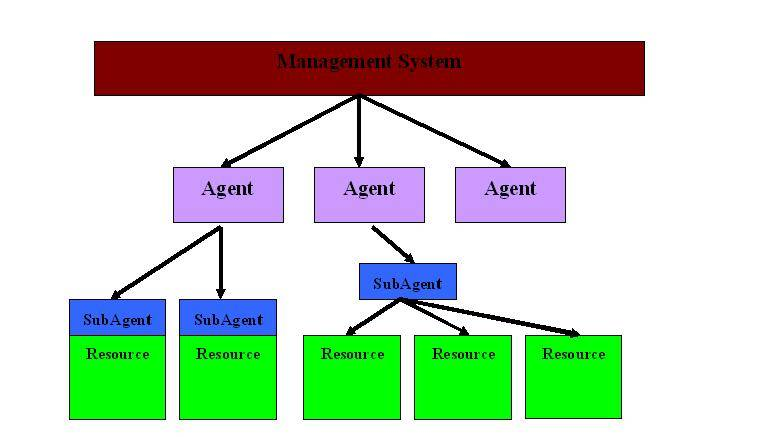
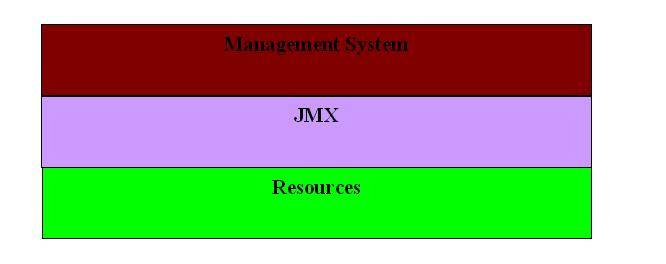

# JMX 与系统管理
JMX 架构及其框架以及JMX API

**标签:** Java

[原文链接](https://developer.ibm.com/zh/articles/j-lo-jse63/)

吕晶, 李夷磊

发布: 2007-07-23

* * *

## 前言

在 Java 程序的运行过程中，对 JVM 和系统的监测一直是 Java 开发人员在开发过程所需要的。一直以来，Java 开发人员必须通过一些底层的 JVM API，比如 JVMPI 和 JVMTI 等，才能监测 Java 程序运行过程中的 JVM 和系统的一系列情况，这种方式一直以来被人所诟病，因为这需要大量的 C 程序和 JNI 调用，开发效率十分低下。于是出现了各种不同的专门做资源管理的程序包。为了解决这个问题，Sun 公司也在其 Java SE 5 版本中，正式提出了 Java 管理扩展（Java Management Extensions，JMX）用来管理检测 Java 程序（同时 JMX 也在 J2EE 1.4 中被发布）。

JMX 的提出，让 JDK 中开发自检测程序成为可能，也提供了大量轻量级的检测 JVM 和运行中对象 / 线程的方式，从而提高了 Java 语言自己的管理监测能力。

## JMX 和系统管理

### 管理系统（Management System）

要了解 JMX，我们就必须对当前的 IT 管理系统有一个初步的了解。随着企业 IT 规模的不断增长，IT 资源（IT resource）数量不断增加，IT 资源的分布也越来越分散。可以想象，甚至对于一家只有几百台 PC 公司的 IT 管理人员来说，分发一个安全补丁并且保证其在每台 PC 上的安装，如果只依赖人工来完成那简直就是一场噩梦。这样，IT 管理系统就应运而生。

然而，CPU、网卡、存储阵列是 IT 资源；OS、MS Office、Oracle database、IBM Websphere 也是 IT 资源。IT 管理系统若要对这些 IT 资源进行管理，就必须对这些管理对象有所了解：形形色色的 IT 资源就像是说着不同语言的人：Oralce 数据库表达内存紧张的方式和 Window XP 是绝然不同的， 而 IT 管理系统就像建造通天塔的经理，必须精通所有的语言， 这几乎是一个不可能完成的任务。难道 IT 管理系统是另外一个通天塔吗？当然不是！其实我们只要给每个 IT 资源配个翻译就可以了。

### 管理系统的构架

##### 图 1\. 管理系统构架



上图分析了管理系统的基本构架模式。其中 Agent / SubAgent 起到的就是翻译的作用：把 IT 资源报告的消息以管理系统能理解的方式传送出去。

也许读者有会问，为什么需要 Agent 和 SubAgent 两层体系呢？这里有两个现实的原因：

1. 管理系统一般是一个中央控制的控制软件，而 SubAgent 直接监控一些资源，往往和这些资源分布在同一物理位置。当这些 SubAgent 把状态信息传输到管理系统或者传达管理系统的控制指令的时候，需要提供一些网络传输的功能。
2. 管理系统的消息是有一定规范的，消息的翻译本身是件复杂而枯燥的事情。

一般来说，管理系统会将同一物理分布或者功能类似的 SubAgent 分组成一组，由一个共用的 Agent 加以管理。在这个 Agent 里封装了 1 和 2 的功能。

### JMX 和管理系统

JMX 既是 Java 管理系统的一个标准，一个规范，也是一个接口，一个框架。图 2 展示了 JMX 的基本架构。

##### 图 2\. JMX 构架



和其它的资源系统一样，JMX 是管理系统和资源之间的一个接口，它定义了管理系统和资源之间交互的标准。 `javax.management.MBeanServer` 实现了 Agent 的功能，以标准的方式给出了管理系统访问 JMX 框架的接口。而 `javax.management.MBeans` 实现了 SubAgent 的功能，以标准的方式给出了 JMX 框架访问资源的接口。而从类库的层次上看，JMX 包括了核心类库 `java.lang.management` 和 `javax.management` 包。 `java.lang.management` 包提供了基本的 VM 监控功能，而 `javax.management` 包则向用户提供了扩展功能。

## JMX 的基本框架

JMX 使用了 Java Bean 模式来传递信息。一般说来，JMX 使用有名的 MBean，其内部包含了数据信息，这些信息可能是：应用程序配置信息、模块信息、系统信息、统计信息等。另外，MBean 也可以设立可读写的属性、直接操作某些函数甚至启动 MBean 可发送的 notification 等。MBean 包括 Standard，MXBean，Dynamic，Model，Open 等几种分类，其中最简单是标准 MBean 和 MXBean，而我们使用得最多的也是这两种。MXBean 主要是 `java.lang.management` 使用较多，将在下一节中介绍。我们先了解其他一些重要的 MBean 的种类。

### 标准 MBean

标准 MBean 是最简单的一类 MBean，与动态 Bean 不同，它并不实现 `javax.management` 包中的特殊的接口。说它是标准 MBean， 是因为其向外部公开其接口的方法和普通的 Java Bean 相同，是通过 lexical，或者说 coding convention 进行的。下面我们就用一个例子来展现，如何实现一个标准 MBean 来监控某个服务器 ServerImpl 状态的。ServerImpl 代表了用来演示的某个 Server 的实现：

```
package standardbeans;
public class ServerImpl {
    public final long startTime;
    public ServerImpl() {
        startTime = System.currentTimeMillis();
    }
}

```

Show moreShow more icon

然后，我们打算使用一个标准 MBean，ServerMonitor 来监控 ServerImpl：

```
package standardbeans;
public class ServerMonitor implements ServerMonitorMBean {
    private final ServerImpl target;
    public ServerMonitor(ServerImpl target){
        this.target = target;
    }
    public long getUpTime(){
        return System.currentTimeMillis() - target.startTime;
    }
}

```

Show moreShow more icon

这里的 ServerMonitorBean 又是怎么回事呢？ MXBean 规定了标准 MBean 也要实现一个接口，所有向外界公开的方法都要在这个接口中声明。否则，管理系统就不能从中获得相应的信息。此外，该接口的名字也有一定的规范：即在标准 MBean 类名之后加上”MBean”后缀。若 MBean 的类名叫做 MBeansName 的话，对应的接口就要叫做 MBeansNameMBean。

对于管理系统来说，这些在 MBean 中公开的方法，最终会被 JMX 转化成属性（Attribute）、监听（Listener）和调用（Invoke）的概念。如果读者对 Java Bean 有一些了解的话，不难看出， `public long getUpTime()` 对应了 Bean 中的一个称为”upTime”的只读属性。

下面我们就看一个模拟管理系统的例子：

```
package standardbeans;
import javax.management.MBeanServer;
import javax.management.MBeanServerFactory;
import javax.management.ObjectName;
public class Main {
    private static ObjectName objectName ;
    private static MBeanServer mBeanServer;
    public static void main(String[] args) throws Exception{
        init();
        manage();
    }
    private static void init() throws Exception{
        ServerImpl serverImpl = new ServerImpl();
        ServerMonitor serverMonitor = new ServerMonitor(serverImpl);
        mBeanServer = MBeanServerFactory.createMBeanServer();
        objectName = new ObjectName("objectName:id=ServerMonitor1");
        mBeanServer.registerMBean(serverMonitor,objectName);
    }
    private static void manage() throws Exception{
        Long upTime = (Long) mBeanServer.getAttribute(objectName,
        "upTime");
        System.out.println(upTime);
    }
}

```

Show moreShow more icon

JMX 的核心是 MBServer。Java SE 已经提供了一个默认实现，可以通过 `MBServerFactory.createMBeanServer()` 获得。每个资源监控者（MBean）一般都会有名称（ObjectName）， 登记在 MBServer 内部的一个 Repository 中。注意，这个 ObjectName 对于每一个 MBServer 必须是唯一的，只能对应于一个 MBean。（读者有兴趣的话，可以试着再给 mBeanServer 注册一个同名的 objectName，看看会怎么样。） 上述例子是在 `init()` 方法中完成向 MBeanServer 注册工作的。

在管理过程中，管理系统并不与资源或者 SubAgent 直接打交道，也就是说，这里不会直接引用到 MBean。而是通过 MBeanServer 的 `getAttribute` 方法取得对应 MBean 的属性的。

### 动态 MBean

但是对于很多已有的 SubAgent 实现，其 Coding Convention 并不符合标准 MBean 的要求。重构所有这些 SubAgent 以符合标准 MBean 标准既费力也不实际。JMX 中给出了动态（Dynamic） MBean 的概念，MBServer 不再依据 Coding Convention 而是直接查询动态 MBean 给出的元数据（meta data）以获得 MBean 的对外接口。

```
package dynamicbeans;

import javax.management.*;
import java.lang.reflect.*;
public class ServerMonitor implements DynamicMBean {

    private final ServerImpl target;
    private MBeanInfo mBeanInfo;

    public ServerMonitor(ServerImpl target){
        this.target = target;
    }

    // 实现获取被管理的 ServerImpl 的 upTime
    public long upTime(){
        return System.currentTimeMillis() - target.startTime;
    }

     //javax.management.MBeanServer 会通过查询 getAttribute("Uptime") 获得 "Uptime" 属性值
    public Object getAttribute(String attribute) throws AttributeNotFoundException,
         MBeanException, ReflectionException {
        if(attribute.equals("UpTime")){
            return upTime();
        }
        return null;
    }

     // 给出 ServerMonitor 的元信息。
    public MBeanInfo getMBeanInfo() {
        if (mBeanInfo == null) {
            try {
                Class cls = this.getClass();
                // 用反射获得 "upTime" 属性的读方法
                Method readMethod = cls.getMethod("upTime", new Class[0]);
                // 用反射获得构造方法
                Constructor constructor = cls.getConstructor(new Class[]
                     {ServerImpl.class});
                // 关于 "upTime" 属性的元信息 : 名称为 UpTime，只读属性 ( 没有写方法 )。
                MBeanAttributeInfo upTimeMBeanAttributeInfo = new MBeanAttributeInfo(
                        "UpTime", "The time span since server start",
                        readMethod, null);
                // 关于构造函数的元信息
                MBeanConstructorInfo mBeanConstructorInfo = new MBeanConstructorInfo(
                        "Constructor for ServerMonitor", constructor);
                //ServerMonitor 的元信息，为了简单起见，在这个例子里，
                // 没有提供 invocation 以及 listener 方面的元信息
                mBeanInfo = new MBeanInfo(cls.getName(),
                        "Monitor that controls the server",
                        new MBeanAttributeInfo[] { upTimeMBeanAttributeInfo },
                        new MBeanConstructorInfo[] { mBeanConstructorInfo },
                        null, null);
            } catch (Exception e) {
                throw new Error(e);
            }

        }
        return mBeanInfo;
    }

    public AttributeList getAttributes(String[] arg0) {
        return null;
    }

    public Object invoke(String arg0, Object[] arg1, String[] arg2)
         throws MBeanException,
         ReflectionException {
        return null;
    }

    public void setAttribute(Attribute arg0) throws AttributeNotFoundException,
         InvalidAttributeValueException, MBeanException, ReflectionException {
        return;
    }

    public AttributeList setAttributes(AttributeList arg0) {
        return null;
    }
}

```

Show moreShow more icon

### 其它动态 MBean

另外还有两类 MBean：Open MBean 和 Model MBean。实际上它们也都是动态 MBean。

Open MBean 与其它动态 MBean 的唯一区别在于，前者对其公开接口的参数和返回值有所限制 —— 只能是基本类型或者 `javax.management.openmbean` 包内的 ArrayType、CompositeType、TarbularType 等类型。这主要是考虑到管理系统的分布，很可能远端管理系统甚至 MBServer 层都不具有 MBean 接口中特殊的类。

### Model Bean

然而，普通的动态 Bean 通常缺乏一些管理系统所需要的支持：比如持久化 MBean 的状态、日志记录、缓存等等。如果让用户去一一实现这些功能确实是件枯燥无聊的工作。为了减轻用户的负担，JMX 提供商都会提供不同的 ModelBean 实现。其中有一个接口是 Java 规范中规定所有厂商必须实现的： `javax.management.modelmbean.RequiredModelBean` 。通过配置 Descriptor 信息，我们可以定制这个 Model Bean， 指定哪些 MBean 状态需要记入日志、如何记录以及是否缓存某些属性、缓存多久等等。这里，我们以 RequiredModelBean 为例讨论 ModelBean。比如，我们先来看一个例子，首先是 server 端：

```
package modelmbean;

public class Server {

     private long startTime;

     public Server() {      }

     public int start(){
         startTime = System.currentTimeMillis();
         return 0;
     }

     public long getUpTime(){
         return System.currentTimeMillis() - startTime;
     }
}

```

Show moreShow more icon

然后我们对它的监测如下：

```
package modelmbean;

import javax.management.*;
import javax.management.modelmbean.*;
public class Main {

    public static void main(String[] args) throws Exception{
        MBeanServer mBeanServer = MBeanServerFactory.createMBeanServer();
        RequiredModelMBean serverMBean =
            (RequiredModelMBean) mBeanServer.instantiate(
            "javax.management.modelmbean.RequiredModelMBean");

        ObjectName serverMBeanName =
            new ObjectName("server: id=Server");
        serverMBean.setModelMBeanInfo(getModelMBeanInfoForServer(serverMBeanName));
        Server server = new Server();
        serverMBean.setManagedResource(server, "ObjectReference");

        ObjectInstance registeredServerMBean =
            mBeanServer.registerMBean((Object) serverMBean, serverMBeanName);

        serverMBean.invoke("start",null, null);

        Thread.sleep(1000);

        System.out.println(serverMBean.getAttribute("upTime"));
        Thread.sleep(5000);
        System.out.println(serverMBean.getAttribute("upTime"));
    }

    private static ModelMBeanInfo getModelMBeanInfoForServer(ObjectName objectName)
        throws Exception{
        ModelMBeanAttributeInfo[] serverAttributes =
            new ModelMBeanAttributeInfo[1];
        Descriptor upTime =
            new DescriptorSupport(
            new String[] {
                "name=upTime",
                "descriptorType=attribute",
                "displayName=Server upTime",
                "getMethod=getUpTime",
            });
            serverAttributes[0] =
                new ModelMBeanAttributeInfo(
                "upTime",
                "long",
                "Server upTime",
                true,
                false,
                false,
            upTime);

        ModelMBeanOperationInfo[] serverOperations =
            new ModelMBeanOperationInfo[2];

        Descriptor getUpTimeDesc =
            new DescriptorSupport(
            new String[] {
                "name=getUpTime",
                "descriptorType=operation",
                "class=modelmbean.Server",
                "role=operation"
            });

        MBeanParameterInfo[] getUpTimeParms = new MBeanParameterInfo[0];
        serverOperations[0] = new ModelMBeanOperationInfo("getUpTime",
            "get the up time of the server",
            getUpTimeParms,
            "java.lang.Long",
            MBeanOperationInfo.ACTION,
        getUpTimeDesc);

        Descriptor startDesc =
            new DescriptorSupport(
            new String[] {
                "name=start",
                "descriptorType=operation",
                "class=modelmbean.Server",
                "role=operation"
            });
        MBeanParameterInfo[] startParms = new MBeanParameterInfo[0];
        serverOperations[1] = new ModelMBeanOperationInfo("start",
            "start(): start server",
            startParms,
            "java.lang.Integer",
            MBeanOperationInfo.ACTION,
        startDesc);

        ModelMBeanInfo serverMMBeanInfo =
            new ModelMBeanInfoSupport(
            "modelmbean.Server",
            "ModelMBean for managing an Server",
            serverAttributes,
            null,
            serverOperations,
        null);

        //Default strategy for the MBean.
        Descriptor serverDescription =
            new DescriptorSupport(
            new String[] {
                ("name=" + objectName),
                "descriptorType=mbean",
                ("displayName=Server"),
                "type=modelmbean.Server",
                "log=T",
                "logFile=serverMX.log",
                "currencyTimeLimit=10" });
        serverMMBeanInfo.setMBeanDescriptor(serverDescription);
        return serverMMBeanInfo;
    }

```

Show moreShow more icon

很明显，和其它 MBean 类似，使用 Model MBean 的过程也是下面几步：

1. 创建一个 MBServer：mBeanServe
2. 获得管理资源用的 MBean：serverBean
3. 给这个 MBean 一个 ObjectName：serverMBeanName
4. 将 serverBean 以 serverMBeanName 注册到 mBeanServer 上去

唯一不同的是，ModelMBean 需要额外两步 :

```
1.serverMBean.setModelMBeanInfo(getModelMBeanInfoForServer(serverMBeanName));
2.serverMBean.setManagedResource(server, "ObjectReference");

```

Show moreShow more icon

第一步用于提供 serverMBean 的元数据，主要包括以下两类

1. 类似于普通的动态 MBean，需要 MBean 的 Attribute、Invocation、Notification 的类型 / 反射信息，诸如返回类型、参数类型和相关的 get/set 方法等。这里将不再赘述。
2. 关于缓存、持久化以及日志等的策略。后面我们将介绍一些这方面的信息。

第二步指出了 ServerMBean 管理的对象，也就是说，从元数据中得到的 Method 将施加在哪个 Object 上。需要指出的是 `setManagedResource(Object o, String type);` 中第二个参数是 Object 类型，可以是 “ObjectReference”、”Handle”、”IOR”、”EJBHandle” 或 “RMIReference”。目前 SE 中的实现只支持 “ObjectReference”。笔者认为后面几种类型是为了将来 JMX 管理对象扩展而设定的，可能将来 Model Bean 不仅可以管理 Plain Java Object（POJO），还可能管理 Native Resource, 并给诸如 EJB 和 RMI 对象的管理提供更多的特性。

Model Bean 与普通动态 Bean 区别在于它的元数据类型 ModelMBeanInfo 扩展了前者的 MBeanInfo，使得 ModelMBeanOperationInfo、ModelMBeanConstructor\_Info、ModelMBeanAttributeInfo 和 ModelMBeanNotificationInfo 都有一个额外的元数据： `javax.management.Descriptor` ，它是用来设定 Model Bean 策略的。数据的存储是典型的 “key-value” 键值对。不同的 Model Bean 实现，以及不同的 MBeanFeatureInfo 支持不同的策略特性。下面我们就以 Attribute 为例，看一下 RequiredModelBean 支持的策略。

首先，它最重要的 Descriptor 主要是 name、displayName 和 descriptorType，其中 name 是属性名称。”name” 要与对应 ModelMBeanAttributeInfo 的 name 相同。descriptorType 必须是 “attribute”。

另外，value、default、legalValues “value” 是用来设定初始值的，”default” 指当不能从 resource 中获得该属性时的默认返回值，”legalValues” 是一组合法的属性数据。它并不用来保证 setAttribute 的数据一致性，而是在 UI 系统，如 JConsole 中提示用户可能的数据输入。

在属性访问的 getMethod, setMethod 方法上，事实上所有对属性的访问都会被 delegate 给同一 MBeanInfo 中特定的 Operation。 getMethod/setMethod 给出了对应的 ModelMBeanOperationInfo 名称。

还有一些额外的属性，比如：persistPolicy, persistPeriod 是代表了持久化策略；currencyTimeLimit, lastUpdatedTimeStamp 缓存策略；iterable 属性是否必须使用 iterate 来访问。默认为否；protocolMap 定义了与第三方系统有关的数据转换的 data model；visibility 定义了与第三方 UI 系统有关的 MBean 如何显示的策略；presentationString 也是定义了与第三方 UI 系统有关的 MBean 如何显示策略，比如 “presentation=server.gif”。

事实上，策略特性有两个层次的作用域：整个 Model Bean 和特定的 MBeanFeature。

Model Bean 的策略描述会被施加到该 Model Bean 的所有 MBeanFeature 上去，除非该 MBeanFeature 重写了这个策略特性。

在上面的例子里，这一个语句：

```
serverMMBeanInfo.setMBeanDescriptor(serverDescription);

```

Show moreShow more icon

给整个 serverMBeanInfo 设了一个策略描述 serverDescription，其中用 “currencyTimeLimit=10” 指出属性的缓存时间是 10 秒。所以，在 Main 方法中，两次 serverMBean.getAttribute(“upTime”)；之间的间隔小于 10 秒就会得到同样的缓存值。

如果我们不想让 “upTime” 这个属性被缓存，我们可以在它的策略描述中加入 “currencyTimeLimit=-1”:

```
Descriptor upTime =    new DescriptorSupport(
                new String[] {
                  "name=upTime",
                  "descriptorType=attribute",
                  "displayName=Server upTime",
                  "getMethod=getUpTime",
                  "currencyTimeLimit=-1" // 不需要缓存
                   });

Descriptor getUpTimeDesc =
              new DescriptorSupport(
                new String[] {
                  "name=getUpTime",
                  "descriptorType=operation",
                  "class=modelmbean.Server",
                  "role=operation"
                  ,"currencyTimeLimit=-1" // 不需要缓存
              });

```

Show moreShow more icon

getUpTimeDesc 也要改动的原因是 RequiredModelBean 会把获取 upTime 属性的工作 delegate 给 getUpTime invocation。只要其中一处使用 MBean 级的缓存策略，就没法获得实时 upTime 数据了。

## 虚拟机检测

### JMX 与虚拟机检测

JMX 的提出，为 Java 虚拟机提供了 Java 层上的检测机制。J2SE 中，新提出的 `java.lang.management` 包即是 JMX 在 JDK 的一个应用，它提供了大量的有用的接口，通过 MBean 方式，提供了对 Java 虚拟机和运行时远端的监控和检测方式，来帮助用户来检测本地或者远端的虚拟机的运行情况。有了 JMX 之后，我们可以设计一个客户端，来检测远端一个正在运行的虚拟机中的线程数、线程当前的 Stack、内存管理、GC 所占用的时间、虚拟机中的对象和当前虚拟机参数等重要的参数和运行时信息。JMX 另外的一个重要功能是对配置信息的检测和再配置。比如，我们可以在远端查看和修改当前 JVM 的 verbose 参数，以达到动态管理的目的。甚至，我们可以在远端指挥 JVM 做一次 GC，这在下文中有详细介绍。

### JMX 提供的虚拟机检测 API

检测虚拟机当前的状态总是 Java 开放人员所关心的，也正是因为如此，出现了大量的 profiler 工具来检测当前的虚拟机状态。从 Java SE 5 之后，在 JDK 中，我们有了一些 Java 的虚拟机检测 API，即 `java.lang.management` 包。Management 包里面包括了许多 MXBean 的接口类和 LockInfo、MemoryUsage、MonitorInfo 和 ThreadInfo 等类。从名字可以看出，该包提供了虚拟机内存分配、垃圾收集（GC）情况、操作系统层、线程调度和共享锁，甚至编译情况的检测机制。这样一来，Java 的开发人员就可以很简单地为自己做一些轻量级的系统检测，来确定当前程序的各种状态，以便随时调整。

要获得这些信息，我们首先通过 `java.lang.management.ManagementFactory` 这个工厂类来获得一系列的 MXBean。包括：

- **ClassLoadingMXBean**

    ClassLoadMXBean 包括一些类的装载信息，比如有多少类已经装载 / 卸载（unloaded），虚拟机类装载的 verbose 选项（即命令行中的 Java – verbose:class 选项）是否打开，还可以帮助用户打开 / 关闭该选项。

- **CompilationMXBean**

    CompilationMXBean 帮助用户了解当前的编译器和编译情况，该 mxbean 提供的信息不多。

- **GarbageCollectorMXBean**

    相对于开放人员对 GC 的关注程度来说，该 mxbean 提供的信息十分有限，仅仅提供了 GC 的次数和 GC 花费总时间的近似值。但是这个包中还提供了三个的内存管理检测类：MemoryManagerMXBean，MemoryMXBean 和 MemoryPoolMXBean。

    - **MemoryManagerMXBean**

         这个类相对简单，提供了内存管理类和内存池（memory pool）的名字信息。

    - **MemoryMXBean**

         这个类提供了整个虚拟机中内存的使用情况，包括 Java 堆（heap）和非 Java 堆所占用的内存，提供当前等待 finalize 的对象数量，它甚至可以做 gc（实际上是调用 System.gc）。

    - **MemoryPoolMXBean**

         该信息提供了大量的信息。在 JVM 中，可能有几个内存池，因此有对应的内存池信息，因此，在工厂类中，getMemoryPoolMXBean() 得到是一个 MemoryPoolMXBean 的 list。每一个 MemoryPoolMXBean 都包含了该内存池的详细信息，如是否可用、当前已使用内存 / 最大使用内存值、以及设置最大内存值等等。
- **OperatingSystemMXBean**

    该类提供的是操作系统的简单信息，如构架名称、当前 CPU 数、最近系统负载等。

- **RuntimeMXBean**

    运行时信息包括当前虚拟机的名称、提供商、版本号，以及 classpath、bootclasspath 和系统参数等等。

- **ThreadMXBean**

    在 Java 这个多线程的系统中，对线程的监控是相当重要的。ThreadMXBean 就是起到这个作用。ThreadMXBean 可以提供的信息包括各个线程的各种状态，CPU 占用情况，以及整个系统中的线程状况。从 ThreadMXBean 可以得到某一个线程的 ThreadInfo 对象。这个对象中则包含了这个线程的所有信息。


### java.lang.management 和虚拟机的关系

我们知道，management 和底层虚拟机的关系是非常紧密的。其实，有一些的是直接依靠虚拟机提供的公开 API 实现的，比如 JVMTI；而另外一些则不然，很大一块都是由虚拟机底层提供某些不公开的 API / Native Code 提供的。这样的设计方式，保证了 management 包可以提供足够的信息，并且使这些信息的提供又有足够的效率；也使 management 包和底层的联系非常紧密。

## Java 6 中的 API 改进

Management 在 Java SE 5 被提出之后，受到了欢迎。在 Java 6 当中，这个包提供更多的 API 来更好地提供信息。

### OperatingSystemMXBean. getSystemLoadAverage()

Java 程序通常关注是虚拟机内部的负载、内存等状况，而不考虑整个系统的状况。但是很多情况下，Java 程序在运行过程中，整个计算机系统的系统负荷情况也会对虚拟机造成一定的影响。随着 Java 的发展，Java 程序已经覆盖了各个行业，这一点也必须得到关注。在以前，利用 Native 代码来检测系统负载往往是唯一的选择，但是在 Java 6 当中，JDK 自己提供了一个轻量级的系统负载检测 API，即 `OperatingSystemMXBean.getSystemLoadAverage()` 。

当然这个 API 事实上仅仅返回一个对前一分钟系统负载的简单的估测。它设计的主要目标是简单快速地估测当前系统负荷，因此它首先保证了这个 API 的效率是非常高的；也因为如此，这个 API 事实上并不适用于所有的系统。

### 锁检测

我们知道，同步是 Java 语言很重要的一个特性。在 Java SE 中，最主要的同步机制是依靠 synchronize 关键字对某一个对象加锁实现的；在 Java SE 5 之后的版本中，concurrent 包的加入，大大强化了 Java 语言的同步能力，concurrent 提供了很多不同类型的锁机制可供扩展。因此，要更好地观测当前的虚拟机状况和不同线程的运行态，去观察虚拟机中的各种锁，以及线程与锁的关系是非常必要的。很可惜的是，在过去的 JDK 中，我们并没有非常方便的 API 以供使用。一个比较直接的检测方式是查看线程的 stack trace，更为强大全面（但是也更复杂并且效率低下）的方案是得到一个 VM 所有对象的快照并查找之，这些策略的代价都比较大，而且往往需要编写复杂的 Native 代码。

JDK 6 里提供了一些相当简单的 API 来提供这个服务。首先了解两个新类，LockInfo 和 MonitorInfo 这两个类承载了锁的信息。LockInfo 可以是任何的 Java 锁，包括简单 Java 锁和 `java.util.concurrent` 包中所使用的锁（包括 AbstractOwnableSynchronizer 和 Condition 的实现类 / 子类），而 MonitorInfo 是简单的 Java 对象所代表的锁。要检测一个线程所拥有的锁和等待的锁，首先，要得到一个线程的 ThreadInfo，然后可以简单地调用：

- **`getLockedMonitors()`**

    返回一个所有当前线程已经掌握的锁对象的列表。

- **`getLockedSynchronizers()`**

    对于使用 concurrent 包的线程，返回一个该线程所掌握的”ownable synchronizer”（即 AbstractOwnableSynchronizer 及其子类）所组成的列表。

- **`getLockInfo()`**

    当前线程正在等待的那个锁对象的信息就可以知道线程所有的锁信息。通过这些锁信息，我们很方便的可以知道当前虚拟机的所有线程的锁信息。由此，我们还可以推导出更多的信息。


### 死锁检测

死锁检测一直以来是软件工程师所重视的，显然一个死锁的系统永远是工程师最大的梦魇。Java 程序的死锁检测也一直以来是 Java 程序员所头痛的。为了解决线程间死锁问题，一般都有预防（代码实现阶段）和死锁后恢复（运行时）两种方式。以前 Java 程序员都重视前者，因为在运行态再来检测和恢复系统是相当麻烦的，缺少许多必要的信息；但是，对于一些比较复杂的系统，采取后者或者运行时调试死锁信息也是非常重要的。由上面所说，现在我们已经可以知道每一个线程所拥有和等待的锁，因此要计算出当前系统中是否有死锁的线程也是可行的了。当然，Java 6 里面也提供了一个 API 来完成这个功能，即：

- **`ThreadMXBean.findDeadlockedThreads()`**

    这个函数的功能就是检测出当前系统中已经死锁的线程。当然，这个功能复杂，因此比较费时。基本上仅仅将之用于调试，以便对复杂系统线程调用的改进。


## 未来的发展

JMX 在 Java SE 5/6 中的功能已经相当强大，但是距离 Java 程序开发人员的要求还是有一段距离，因此 Sun 公司已经向 JCP 提出了 JSR 255 （JMX API 2.0 版本）来扩充和进一步发展 JMX，并希望这个 JSR 将在 Java SE 7 中实现。在这个文档中，新的 JMX 2.0 将着重于：

- 对 management 模型的优化，并提供更好的支持；加入了比如 annotation 等等的新特性；
- 对 JMX 定义的优化，在进一步强化 MBean 扩充性好的优点的同时，尽量改变（用户普遍认为的）MBean 很难实现的缺点；
- 对非 Java 平台客户端的支持。这将是一个令人振奋的新特性；

具体的扩展可能包括：

- 层次性的命名域（Hierarchical namespace）；
- 新的事件服务功能；
- 对 locales 的新支持；
- 为 MBean 启用 annotation 服务；
- 也可以使用用户类型的 mapping 了；

可以看到，JMX 的进一步发展主要关注的是可扩展性、动态性和易用性等 Java 用户非常关注的方面。

## 结束语

在 Java SE 5 出现的 JMX 在 Java SE 6 中有了更多的功能和扩展能力，这很好地适应了 Java 语言的发展和用户的要求，让 Java 的监测、管理的的功能更加强大。