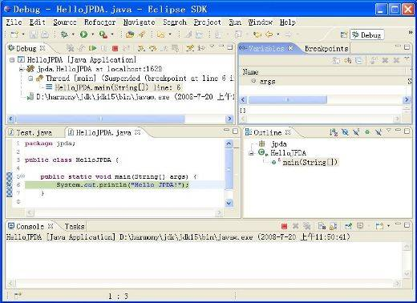
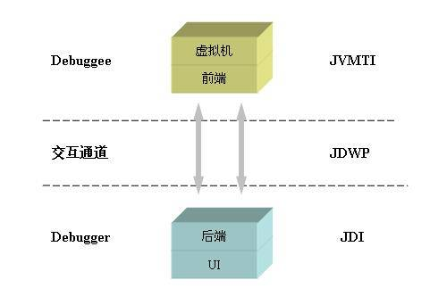

# JPDA 体系概览
从整体上介绍 JPDA 的各个组成并阐述它们彼此之间的内在关联

**标签:** Java

[原文链接](https://developer.ibm.com/zh/articles/j-lo-jpda1/)

邱小侠, 吕晶

发布: 2008-09-03

* * *

## JPDA 概述

所有的程序员都会遇到 bug，对于运行态的错误，我们往往需要一些方法来观察和测试运行态中的环境。在 Java 程序中，最简单的，您是否尝试过使用 `System.out.println()` 来输出您的 Java 程序的执行中的各种变量状态来发现您的 Java 程序运行时的问题？这种方式方便易用，在一些简单的情况下能够解决您的问题，但是如果当您的程序运行在远程环境上，或者当前环境不允许控制台终端输出（比如，考虑一下虚拟机初始化之时），您无法获取终端输出的时候呢？或者，如果您根本无法本地修改运行您的程序？

无须担心，您可以通过很多的调试工具来帮助您解决这个问题，常见的 IDE 都附带一个非常直观简单的调试工具，比如 Eclipse（图 1）就提供一个功能非常全面，操作非常简单的调试器。

##### 图 1\. 使用 Eclipse 调试 Java 程序

其他的一些常见的 Java IDE，比如 Netbeans 和 IntelliJ 等等也都提供了类似的功能，您甚至能不用 IDE 提供的图形界面，使用 JDK 自带的 jdb 工具，以文本命令的形式来调试您的 Java 程序。这些形形色色的调试器都支持本地和远程的程序调试，那么它们是如何被开发的？它们之间存在着什么样的联系呢？我们不得不提及 Java 的调试体系—— JPDA 。

我们知道，Java 程序都是运行在 Java 虚拟机上的，我们要调试 Java 程序，事实上就需要向 Java 虚拟机请求当前运行态的状态，并对虚拟机发出一定的指令，设置一些回调等等，那么 Java 的调试体系，就是虚拟机的一整套用于调试的工具和接口。

对于 Java 虚拟机接口熟悉的人来说，您一定还记得 Java 提供了两个接口体系，JVMPI（Java Virtual Machine Profiler Interface）和 JVMDI（Java Virtual Machine Debug Interface），而它们，以及在 Java SE 5 中准备代替它们的 JVMTI（Java Virtual Machine Tool Interface），都是 Java 平台调试体系（Java Platform Debugger Architecture，JPDA）的重要组成部分。 Java SE 自 1.2.2 版就开始推出 Java 平台调试体系结构（JPDA）工具集，而从 JDK 1.3.x 开始，Java SDK 就提供了对 Java 平台调试体系结构的直接支持。顾名思义，这个体系为开发人员提供了一整套用于调试 Java 程序的 API，是一套用于开发 Java 调试工具的接口和协议。本质上说，它是我们通向虚拟机，考察虚拟机运行态的一个通道，一套工具。理解这一点对于学习 JPDA 非常重要。

换句话说，通过 JPDA 这套接口，我们就可以开发自己的调试工具。通过这些 JPDA 提供的接口和协议，调试器开发人员就能根据特定开发者的需求，扩展定制 Java 调试应用程序，开发出吸引开发人员使用的调试工具。前面我们提到的 IDE 调试工具都是基于 JPDA 体系开发的，区别仅仅在于它们可能提供了不同的图形界面、具有一些不同的自定义功能。另外，我们要注意的是，JPDA 是一套标准，任何的 JDK 实现都必须完成这个标准，因此，通过 JPDA 开发出来的调试工具先天具有跨平台、不依赖虚拟机实现、JDK 版本无关等移植优点，因此大部分的调试工具都是基于这个体系的。

## JPDA 组成模块

JPDA 定义了一个完整独立的体系，它由三个相对独立的层次共同组成，而且规定了它们三者之间的交互方式，或者说定义了它们通信的接口。这三个层次由低到高分别是 Java 虚拟机工具接口（JVMTI），Java 调试线协议（JDWP）以及 Java 调试接口（JDI）。这三个模块把调试过程分解成几个很自然的概念：调试者（debugger）和被调试者（debuggee），以及他们中间的通信器。被调试者运行于我们想调试的 Java 虚拟机之上，它可以通过 JVMTI 这个标准接口，监控当前虚拟机的信息；调试者定义了用户可使用的调试接口，通过这些接口，用户可以对被调试虚拟机发送调试命令，同时调试者接受并显示调试结果。在调试者和被调试着之间，调试命令和调试结果，都是通过 JDWP 的通讯协议传输的。所有的命令被封装成 JDWP 命令包，通过传输层发送给被调试者，被调试者接收到 JDWP 命令包后，解析这个命令并转化为 JVMTI 的调用，在被调试者上运行。类似的，JVMTI 的运行结果，被格式化成 JDWP 数据包，发送给调试者并返回给 JDI 调用。而调试器开发人员就是通过 JDI 得到数据，发出指令。图 2 展示了这个过程：

##### 图 2\. JPDA 模块层次

当然，开发人员完全可以不使用完整的三个层次，而是基于其中的某一个层次开发自己的应用。比如您完全可以仅仅依靠通过 JVMTI 函数开发一个调试工具，而不使用 JDWP 和 JDI，只使用自己的通讯和命令接口。当然，除非是有特殊的需求，利用已有的实现会使您事半功倍，避免重复发明轮子。

这三个模块我们会在后续文章中分别详细介绍，这里我们简单介绍它们的主要功能：

### Java 虚拟机工具接口（JVMTI）

JVMTI（Java Virtual Machine Tool Interface）即指 Java 虚拟机工具接口，它是一套由虚拟机直接提供的 native 接口，它处于整个 JPDA 体系的最底层，所有调试功能本质上都需要通过 JVMTI 来提供。通过这些接口，开发人员不仅调试在该虚拟机上运行的 Java 程序，还能查看它们运行的状态，设置回调函数，控制某些环境变量，从而优化程序性能。我们知道，JVMTI 的前身是 JVMDI 和 JVMPI，它们原来分别被用于提供调试 Java 程序以及 Java 程序调节性能的功能。在 J2SE 5.0 之后 JDK 取代了 JVMDI 和 JVMPI 这两套接口，JVMDI 在最新的 Java SE 6 中已经不提供支持，而 JVMPI 也计划在 Java SE 7 后被彻底取代。

### Java 调试线协议（JDWP）

JDWP（Java Debug Wire Protocol）是一个为 Java 调试而设计的一个通讯交互协议，它定义了调试器和被调试程序之间传递的信息的格式。在 JPDA 体系中，作为前端（front-end）的调试者（debugger）进程和后端（back-end）的被调试程序（debuggee）进程之间的交互数据的格式就是由 JDWP 来描述的，它详细完整地定义了请求命令、回应数据和错误代码，保证了前端和后端的 JVMTI 和 JDI 的通信通畅。比如在 Sun 公司提供的实现中，它提供了一个名为 jdwp.dll（jdwp.so）的动态链接库文件，这个动态库文件实现了一个 Agent，它会负责解析前端发出的请求或者命令，并将其转化为 JVMTI 调用，然后将 JVMTI 函数的返回值封装成 JDWP 数据发还给后端。

另外，这里需要注意的是 JDWP 本身并不包括传输层的实现，传输层需要独立实现，但是 JDWP 包括了和传输层交互的严格的定义，就是说，JDWP 协议虽然不规定我们是通过 EMS 还是快递运送货物的，但是它规定了我们传送的货物的摆放的方式。在 Sun 公司提供的 JDK 中，在传输层上，它提供了 socket 方式，以及在 Windows 上的 shared memory 方式。当然，传输层本身无非就是本机内进程间通信方式和远端通信方式，用户有兴趣也可以按 JDWP 的标准自己实现。

### Java 调试接口（JDI）

JDI（Java Debug Interface）是三个模块中最高层的接口，在多数的 JDK 中，它是由 Java 语言实现的。 JDI 由针对前端定义的接口组成，通过它，调试工具开发人员就能通过前端虚拟机上的调试器来远程操控后端虚拟机上被调试程序的运行，JDI 不仅能帮助开发人员格式化 JDWP 数据，而且还能为 JDWP 数据传输提供队列、缓存等优化服务。从理论上说，开发人员只需使用 JDWP 和 JVMTI 即可支持跨平台的远程调试，但是直接编写 JDWP 程序费时费力，而且效率不高。因此基于 Java 的 JDI 层的引入，简化了操作，提高了开发人员开发调试程序的效率。

表 1 总结了三个模块的不同点：

##### 表 1\. JPDA 层次比较

模块层次编程语言作用JVMTI底层C获取及控制当前虚拟机状态JDWP中介层C定义 JVMTI 和 JDI 交互的数据格式JDI高层Java提供 Java API 来远程控制被调试虚拟机

## JPDA 实现

##### 关于 Apache Harmony 项目

[Apache Harmony](https://harmony.apache.org/) 旨在开发出一个独立且与现有 JDK 兼容的 Java SE 5 实现，它以 Apache 软件许可证 2.0 版发行。它建立了一个开放的模块化运行时架构，包括虚拟机和类库之间及其内部的模块化，通过这个平台，社区能在已有实现的基础上自由定制自己的 Java 实现，或者对某个模块单独进行创新。

每一个虚拟机都应该实现 JVMTI 接口，但是 JDWP 和 JDI 本身与虚拟机并非是不可分的，这三个层之间是通过标准所定义的交互的接口和协议联系起来的，因此它们可以被独立替换或取代，但不会影响到整体调试工具的开发和使用。因此，开发和使用自己的 JDWP 和 JDI 接口实现是可能的。

Java 软件开发包（SDK）标准版里提供了 JPDA 三个层次的标准实现，事实上，调试工具开发人员还有很多其他开源实现可以选择，比如 Apache Harmony 提供了 JDWP 的实现。而 JDI，我们可以在 Eclipse 一个子项目 org.eclipse.jdt.debug 里找到其完整的实现（Harmony 也使用了这套实现，作为其 J2SE 类库的一部分）。通过标准协议，Eclipse IDE 的调试工具就可以完全在 Harmony 的环境上运行。

## Java 调试接口的特点

Java 语言是第一个使用虚拟机概念的流行的编程语言，正是因为虚拟机的存在，使很多事情变得简单而轻松，掌握了虚拟机，就掌握了内存分配、线程管理、即时优化等等运行态。同样的，Java 调试的本质，就是和虚拟机打交道，通过操作虚拟机来达到观察调试我们自己代码的目的。这个特点决定了 Java 调试接口和以前其他编程语言的巨大区别。

以 C/C++ 的调试为例，目前比较流行的调试工具是 GDB 和微软的 Visual Studio 自带的 debugger，在这种 debugger 中，首先，我们必须编译一个” debug ”模式的程序，这个会比实际的 release 模式程序大很多。其次，在调试过程中，debugger 将会深层接入程序的运行，掌握和控制运行态的一些信息，并将这些信息及时返回。这种介入对运行的效率和内存占用都有一定的需求。基于这些需求，这些 Debugger 本身事实上是提供了，或者说，创建和管理了一个运行态，因此他们的程序算法比较复杂，个头都比较大。对于远端的调试，GDB 也没有很好的默认实现，当然，C/C++ 在这方面也没有特别大的需求。

而 Java 则不同，由于 Java 的运行态已经被虚拟机所很好地管理，因此作为 Java 的 Debugger 无需再自己创造一个可控的运行态，而仅仅需要去操作虚拟机就可以了。 Java 的 JPDA 就是一套为调试和优化服务的虚拟机的操作工具，其中，JVMTI 是整合在虚拟机中的接口，JDWP 是一个通讯层，而 JDI 是前端为开发人员准备好的工具和运行库。

从构架上说，我们可以把 JPDA 看作成是一个 C/S 体系结构的应用，在这个构架下，我们可以方便地通过网络，在任意的地点调试另外一个虚拟机上的程序，这个就很好地解决了部署和测试的问题，尤其满足解决了很多网络时代中的开发应用的需求。前端和后端的分离，也方便用户开发适合于自己的调试工具。

从效率上看，由于 Java 程序本身就是编译成字节码，运行在虚拟机上的，因此调试前后的程序、内存占用都不会有大变化（仅仅是启动一个 JDWP 所需要的内存），任意程度都可以很好地调试，非常方便。而 JPDA 构架下的几个组成部分，JDWP 和 JDI 都比较小，主要的工作可以让虚拟机自己完成。

从灵活性上，Java 调试工具是建立在强大的虚拟机上的，因此，很多前沿的应用，比如动态编译运行，字节码的实时替换等等，都可以通过对虚拟机的改进而得到实现。随着虚拟机技术的逐步发展和深入，各种不同种类，不同应用领域中虚拟机的出现，各种强大的功能的加入，给我们的调试工具也带来很多新的应用。

总而言之，一个先天的，可控的运行态给 Java 的调试工作，给 Java 调试接口带来了极大的优势和便利。通过 JPDA 这个标准，我们可以从虚拟机中得到我们所需要的信息，完成我们所希望的操作，更好地开发我们的程序。

## 结束语

本文简单介绍了 JPDA 的三个模块以及它们如何和其它层次交互，让读者在整体上对 JPDA 体系有了一个直观的了解，从而方便后面针对每个模块具体介绍的学习，这里我们学习到：

- JPDA 定义了一套如何开发调试工具的接口和规范。
- JPDA 由三个独立的模块 JVMTI、JDWP、JDI 组成。

    - 调试者通过 JDI 发送接受调试命令。
    - JDWP 定义调试者和被调试者交流数据的格式。
    - JVMTI 可以控制当前虚拟机运行状态。
- 除了标准实现，JPDA 还有许多开源实现供使用。
- Java 调试工具的优点。