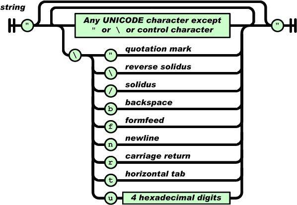

# JSON 入门指南
如何分别在客户端和服务器端进行 JSON 格式数据的处理

**标签:** JavaScript,Web 开发

[原文链接](https://developer.ibm.com/zh/articles/wa-lo-json/)

廖雪峰

发布: 2008-08-22

* * *

尽管有许多宣传关于 XML 如何拥有跨平台，跨语言的优势，然而，除非应用于 Web Services，否则，在普通的 Web 应用中，开发者经常为 XML 的解析伤透了脑筋，无论是服务器端生成或处理 XML，还是客户端用 JavaScript 解析 XML，都常常导致复杂的代码，极低的开发效率。实际上，对于大多数 Web 应用来说，他们根本不需要复杂的 XML 来传输数据，XML 的扩展性很少具有优势，许多 AJAX 应用甚至直接返回 HTML 片段来构建动态 Web 页面。和返回 XML 并解析它相比，返回 HTML 片段大大降低了系统的复杂性，但同时缺少了一定的灵活性。

现在，JSON 为 Web 应用开发者提供了另一种数据交换格式。让我们来看看 JSON 到底是什么，同 XML 或 HTML 片段相比，JSON 提供了更好的简单性和灵活性。

## JSON 数据格式解析

和 XML 一样，JSON 也是基于纯文本的数据格式。由于 JSON 天生是为 JavaScript 准备的，因此，JSON 的数据格式非常简单，您可以用 JSON 传输一个简单的 String，Number，Boolean，也可以传输一个数组，或者一个复杂的 Object 对象。

String，Number 和 Boolean 用 JSON 表示非常简单。例如，用 JSON 表示一个简单的 String ” abc ”，其格式为：

```
"abc"

```

Show moreShow more icon

除了字符 `"`，`\` ，`/` 和一些控制符（ `\b`，`\f`，`\n`，`\r`，`\t`）需要编码外，其他 Unicode 字符可以直接输出。下图是一个 String 的完整表示结构：

##### 图 1\. String 的完整表示结构



一个 Number 可以根据整型或浮点数表示如下：

##### 图 2\. Number 的表示结构


这与绝大多数编程语言的表示方法一致，例如：

```
12345（整数）
 -3.9e10（浮点数）

```

Show moreShow more icon

Boolean 类型表示为 `true` 或 `false` 。此外，JavaScript 中的 null 被表示为 `null` ，注意， `true` 、 `false` 和 `null` 都没有双引号，否则将被视为一个 String 。

JSON 还可以表示一个数组对象，使用 `[]` 包含所有元素，每个元素用逗号分隔，元素可以是任意的 Value，例如，以下数组包含了一个 String，Number，Boolean 和一个 null：

```
["abc",12345,false,null]

```

Show moreShow more icon

Object 对象在 JSON 中是用 `{}` 包含一系列无序的 Key-Value 键值对表示的，实际上此处的 Object 相当于 Java 中的 `Map<String, Object>` ，而不是 Java 的 Class 。注意 Key 只能用 String 表示。

例如，一个 Address 对象包含如下 Key-Value：

```
city:Beijing
street:Chaoyang Road
postcode:100025（整数）

```

Show moreShow more icon

用 JSON 表示如下：

```
{"city":"Beijing","street":" Chaoyang Road ","postcode":100025}

```

Show moreShow more icon

其中 Value 也可以是另一个 Object 或者数组，因此，复杂的 Object 可以嵌套表示，例如，一个 Person 对象包含 name 和 address 对象，可以表示如下：

```
{"name":"Michael","address":
    {"city":"Beijing","street":" Chaoyang Road ","postcode":100025}
}

```

Show moreShow more icon

## JavaScript 处理 JSON 数据

上面介绍了如何用 JSON 表示数据，接下来，我们还要解决如何在服务器端生成 JSON 格式的数据以便发送到客户端，以及客户端如何使用 JavaScript 处理 JSON 格式的数据。

我们先讨论如何在 Web 页面中用 JavaScript 处理 JSON 数据。我们通过一个简单的 JavaScript 方法就能看到客户端如何将 JSON 数据表示给用户：

```
function handleJson() {
var j={"name":"Michael","address":
      {"city":"Beijing","street":" Chaoyang Road ","postcode":100025}
};
document.write(j.name);
document.write(j.address.city);
}

```

Show moreShow more icon

假定服务器返回的 JSON 数据是上文的：

```
{"name":"Michael","address":
    {"city":"Beijing","street":" Chaoyang Road ","postcode":100025}
}

```

Show moreShow more icon

只需将其赋值给一个 JavaScript 变量，就可以立刻使用该变量并更新页面中的信息了，相比 XML 需要从 DOM 中读取各种节点而言，JSON 的使用非常容易。我们需要做的仅仅是发送一个 Ajax 请求，然后将服务器返回的 JSON 数据赋值给一个变量即可。有许多 Ajax 框架早已包含了处理 JSON 数据的能力，例如 Prototype（一个流行的 JavaScript 库：`http://prototypejs.org`）提供了 `evalJSON()` 方法，能直接将服务器返回的 JSON 文本变成一个 JavaScript 变量：

```
new Ajax.Request("http://url", {
method: "get",
onSuccess: function(transport) {
    var json = transport.responseText.evalJSON();
    // TODO: document.write(json.xxx);
}
});

```

Show moreShow more icon

## 服务器端输出 JSON 格式数据

下面我们讨论如何在服务器端输出 JSON 格式的数据。以 Java 为例，我们将演示将一个 Java 对象编码为 JSON 格式的文本。

将 String 对象编码为 JSON 格式时，只需处理好特殊字符即可。另外，必须用 (`"`) 而非 (`'`) 表示字符串：

```
static String string2Json(String s) {
    StringBuilder sb = new StringBuilder(s.length()+20);
    sb.append('\"');
    for (int i=0; i<s.length(); i++) {
        char c = s.charAt(i);
        switch (c) {
        case '\"':
            sb.append("\\\"");
            break;
        case '\\':
            sb.append("\\\\");
            break;
        case '/':
            sb.append("\\/");
            break;
        case '\b':
            sb.append("\\b");
            break;
        case '\f':
            sb.append("\\f");
            break;
        case '\n':
            sb.append("\\n");
            break;
        case '\r':
            sb.append("\\r");
            break;
        case '\t':
            sb.append("\\t");
            break;
        default:
            sb.append(c);
        }
    }
    sb.append('\"');
    return sb.toString();
}

```

Show moreShow more icon

将 Number 表示为 JSON 就容易得多，利用 Java 的多态，我们可以处理 Integer，Long，Float 等多种 Number 格式：

```
static String number2Json(Number number) {
    return number.toString();
}

```

Show moreShow more icon

Boolean 类型也可以直接通过 `toString()` 方法得到 JSON 的表示：

```
static String boolean2Json(Boolean bool) {
    return bool.toString();
}

```

Show moreShow more icon

要将数组编码为 JSON 格式，可以通过循环将每一个元素编码出来：

```
static String array2Json(Object[] array) {
    if (array.length==0)
        return "[]";
    StringBuilder sb = new StringBuilder(array.length << 4);
    sb.append('[');
    for (Object o : array) {
        sb.append(toJson(o));
        sb.append(',');
    }
    // 将最后添加的 ',' 变为 ']':
    sb.setCharAt(sb.length()-1, ']');
    return sb.toString();
}

```

Show moreShow more icon

最后，我们需要将 `Map<String, Object>` 编码为 JSON 格式，因为 JavaScript 的 Object 实际上对应的是 Java 的 `Map<String, Object>` 。该方法如下：

```
static String map2Json(Map<String, Object> map) {
    if (map.isEmpty())
        return "{}";
    StringBuilder sb = new StringBuilder(map.size() << 4);
    sb.append('{');
    Set<String> keys = map.keySet();
    for (String key : keys) {
        Object value = map.get(key);
        sb.append('\"');
        sb.append(key);
        sb.append('\"');
        sb.append(':');
        sb.append(toJson(value));
        sb.append(',');
    }
    // 将最后的 ',' 变为 '}':
    sb.setCharAt(sb.length()-1, '}');
    return sb.toString();
}

```

Show moreShow more icon

为了统一处理任意的 Java 对象，我们编写一个入口方法 `toJson(Object)` ，能够将任意的 Java 对象编码为 JSON 格式：

```
public static String toJson(Object o) {
    if (o==null)
        return "null";
    if (o instanceof String)
        return string2Json((String)o);
    if (o instanceof Boolean)
        return boolean2Json((Boolean)o);
    if (o instanceof Number)
        return number2Json((Number)o);
    if (o instanceof Map)
        return map2Json((Map<String, Object>)o);
    if (o instanceof Object[])
        return array2Json((Object[])o);
    throw new RuntimeException("Unsupported type: " + o.getClass().getName());
}

```

Show moreShow more icon

我们并未对 Java 对象作严格的检查。不被支持的对象（例如 List）将直接抛出 RuntimeException 。此外，为了保证输出的 JSON 是有效的， `Map<String, Object>` 对象的 Key 也不能包含特殊字符。细心的读者可能还会发现循环引用的对象会引发无限递归，例如，精心构造一个循环引用的 Map，就可以检测到 `StackOverflowException` ：

```
@Test(expected=StackOverflowError.class)
public void testRecurrsiveMap2Json() {
    Map<String, Object> map = new HashMap<String, Object>();
    map.put("key", map);
    JsonUtil.map2Json(map);
}

```

Show moreShow more icon

好在服务器处理的 JSON 数据最终都应该转化为简单的 JavaScript 对象，因此，递归引用的可能性很小。

最后，通过 Servlet 或 MVC 框架输出 JSON 时，需要设置正确的 MIME 类型（application/json）和字符编码。假定服务器使用 UTF-8 编码，则可以使用以下代码输出编码后的 JSON 文本：

```
response.setContentType("application/json;charset=UTF-8");
response.setCharacterEncoding("UTF-8");
PrintWriter pw = response.getWriter();
pw.write(JsonUtil.toJson(obj));
pw.flush();

```

Show moreShow more icon

## 结束语

JSON 已经是 JavaScript 标准的一部分。目前，主流的浏览器对 JSON 支持都非常完善。应用 JSON，我们可以从 XML 的解析中摆脱出来，对那些应用 Ajax 的 Web 2.0 网站来说，JSON 确实是目前最灵活的轻量级方案。