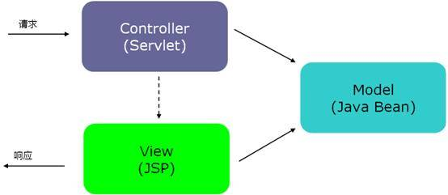
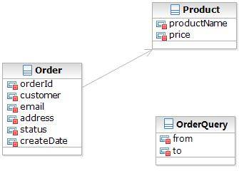
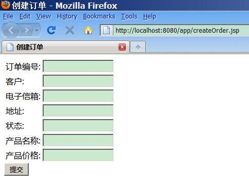
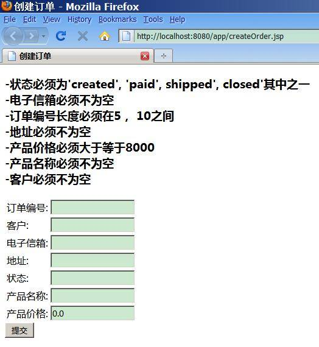

# JSR 303 – Bean Validation 介绍及最佳实践
通过一些示例来演示如何在 Java 开发过程正确的使用 Bean Validation

**标签:** Java

[原文链接](https://developer.ibm.com/zh/articles/j-lo-jsr303/)

安大鹏, 杨乐, 翁志弘

发布: 2011-05-24

* * *

## 关于 Bean Validation

在任何时候，当你要处理一个应用程序的业务逻辑，数据校验是你必须要考虑和面对的事情。应用程序必须通过某种手段来确保输入进来的数据从语义上来讲是正确的。在通常的情况下，应用程序是分层的，不同的层由不同的开发人员来完成。很多时候同样的数据验证逻辑会出现在不同的层，这样就会导致代码冗余和一些管理的问题，比如说语义的一致性等。为了避免这样的情况发生，最好是将验证逻辑与相应的域模型进行绑定。

Bean Validation 为 JavaBean 验证定义了相应的元数据模型和 API。缺省的元数据是 Java Annotations，通过使用 XML 可以对原有的元数据信息进行覆盖和扩展。在应用程序中，通过使用 Bean Validation 或是你自己定义的 constraint，例如 `@NotNull`, `@Max`, `@ZipCode` ， 就可以确保数据模型（JavaBean）的正确性。constraint 可以附加到字段，getter 方法，类或者接口上面。对于一些特定的需求，用户可以很容易的开发定制化的 constraint。Bean Validation 是一个运行时的数据验证框架，在验证之后验证的错误信息会被马上返回。

下载 JSR 303 – Bean Validation 规范 [http://jcp.org/en/jsr/detail?id=303](http://jcp.org/en/jsr/detail?id=303)

Hibernate Validator 是 Bean Validation 的参考实现 . Hibernate Validator 提供了 JSR 303 规范中所有内置 constraint 的实现，除此之外还有一些附加的 constraint。如果想了解更多有关 Hibernate Validator 的信息，请查看 [http://www.hibernate.org/subprojects/validator.html](http://www.hibernate.org/subprojects/validator.html)

## Bean Validation 中的 constraint

##### 表 1\. Bean Validation 中内置的 constraint

**Constraint****详细信息**`@Null`被注释的元素必须为 `null``@NotNull`被注释的元素必须不为 `null``@AssertTrue`被注释的元素必须为 `true``@AssertFalse`被注释的元素必须为 `false``@Min(value)`被注释的元素必须是一个数字，其值必须大于等于指定的最小值`@Max(value)`被注释的元素必须是一个数字，其值必须小于等于指定的最大值`@DecimalMin(value)`被注释的元素必须是一个数字，其值必须大于等于指定的最小值`@DecimalMax(value)`被注释的元素必须是一个数字，其值必须小于等于指定的最大值`@Size(max, min)`被注释的元素的大小必须在指定的范围内`@Digits (integer, fraction)`被注释的元素必须是一个数字，其值必须在可接受的范围内`@Past`被注释的元素必须是一个过去的日期`@Future`被注释的元素必须是一个将来的日期`@Pattern(value)`被注释的元素必须符合指定的正则表达式

##### 表 2\. Hibernate Validator 附加的 constraint

**Constraint****详细信息**`@Email`被注释的元素必须是电子邮箱地址`@Length`被注释的字符串的大小必须在指定的范围内`@NotEmpty`被注释的字符串的必须非空`@Range`被注释的元素必须在合适的范围内

一个 constraint 通常由 annotation 和相应的 constraint validator 组成，它们是一对多的关系。也就是说可以有多个 constraint validator 对应一个 annotation。在运行时，Bean Validation 框架本身会根据被注释元素的类型来选择合适的 constraint validator 对数据进行验证。

有些时候，在用户的应用中需要一些更复杂的 constraint。Bean Validation 提供扩展 constraint 的机制。可以通过两种方法去实现，一种是组合现有的 constraint 来生成一个更复杂的 constraint，另外一种是开发一个全新的 constraint。

## 创建一个包含验证逻辑的简单应用（基于 JSP）

在本文中，通过创建一个虚构的订单管理系统（基于 JSP 的 web 应用）来演示如何在 Java 开发过程中应用 Bean Validation。该简化的系统可以让用户创建和检索订单。

### 系统设计和运用的技术

##### 图 1\. 系统架构



图 1 是报表管理系统的结构图，是典型的 MVC（Model-View-Controller）应用。Controller 负责接收和处理请求，Servlet 扮演 Controller 的角色去处理请求、业务逻辑并转向合适的 JSP 页面。在 Servlet 中对数据进行验证。JSP 扮演 View 的角色以图型化界面的方式呈现 Model 中的数据方便用户交互。Model 就是此系统进行操作的数据模型，我们对这部分加以简化不对数据进行持久化。

### 数据模型

##### 图 2\. 数据模型



图 2 展示的是订单管理系统的数据模型。

### 声明了 contraint 的 JavaBean

##### 清单 1\. Order.java

```
public class Order {
// 必须不为 null, 大小是 10
@NotNull
@Size(min = 10, max = 10)
private String orderId;
// 必须不为空
@NotEmpty
private String customer;
// 必须是一个电子信箱地址
@Email
private String email;
// 必须不为空
@NotEmpty
private String address;
// 必须不为 null, 必须是下面四个字符串'created', 'paid', 'shipped', 'closed'其中之一
// @Status 是一个定制化的 contraint
@NotNull
@Status
private String status;
// 必须不为 null
@NotNull
private Date createDate;
// 嵌套验证
@Valid
private Product product;

...
getter 和 setter
}

```

Show moreShow more icon

##### 清单 2\. Product.java

```
public class Product {
// 必须非空
@NotEmpty
private String productName;
// 必须在 8000 至 10000 的范围内
// @Price 是一个定制化的 constraint
@Price
private float price;
...
Getter 和 setter
}

```

Show moreShow more icon

##### 清单 3\. OrderQuery.java

```
// 'to'所表示的日期必须在'from'所表示的日期之后
// @QueryConstraint 是一个定制化的 constraint
@QueryConstraint
public class OrderQuery {
private Date from;
private Date to;
... omitted...
Getter and setter
}

```

Show moreShow more icon

### 定制化的 constraint

`@Price` 是一个定制化的 constraint，由两个内置的 constraint 组合而成。

##### 清单 4\. @Price 的 annotation 部分

```
// @Max 和 @Min 都是内置的 constraint
@Max(10000)
@Min(8000)
@Constraint(validatedBy = {})
@Documented
@Target( { ElementType.ANNOTATION_TYPE, ElementType.METHOD, ElementType.FIELD })
@Retention(RetentionPolicy.RUNTIME)
public @interface Price {
String message() default "错误的价格";
Class<?>[] groups() default {};
Class<? extends Payload>[] payload() default {};
}

```

Show moreShow more icon

`@Status` 是一个新开发的 constraint.

##### 清单 5\. @Status 的 annotation 部分

```
@Constraint(validatedBy = {StatusValidator.class})
@Documented
@Target( { ElementType.ANNOTATION_TYPE, ElementType.METHOD, ElementType.FIELD })
@Retention(RetentionPolicy.RUNTIME)
public @interface Status {
String message() default "不正确的状态 , 应该是 'created', 'paid', shipped', closed'其中之一";
Class<?>[] groups() default {};
Class<? extends Payload>[] payload() default {};
}

```

Show moreShow more icon

##### 清单 6\. @Status 的 constraint validator 部分

```
public class StatusValidator implements ConstraintValidator<Status, String>{
private final String[] ALL_STATUS = {"created", "paid", "shipped", "closed"};
public void initialize(Status status) {
}
public boolean isValid(String value, ConstraintValidatorContext context) {
if(Arrays.asList(ALL_STATUS).contains(value))
return true;
return false;
}
}

```

Show moreShow more icon

## Bean Validation API 使用示例

### 创建订单

用户在创建一条订单记录时，需要填写以下信息：订单编号，客户，电子信箱，地址，状态，产品名称，产品价格

##### 图 3\. 创建订单



对这些信息的校验，使用 Bean Validation API

##### 清单 7\. 代码片段

```
protected void doPost(HttpServletRequest req, HttpServletResponse resp)
throws ServletException, IOException {
HttpSession session = req.getSession();
// 从 request 中获取输入信息
String orderId = (String) req.getParameter("orderId");
String customer = (String) req.getParameter("customer");
String email = (String) req.getParameter("email");
String address = (String) req.getParameter("address");
String status = (String) req.getParameter("status");
String productName = (String) req.getParameter("productName");
String productPrice = (String) req.getParameter("productPrice");
// 将 Bean 放入 session 中
Order order = new Order();
order.setOrderId(orderId);
order.setCustomer(customer);
order.setEmail(email);
order.setAddress(address);
order.setStatus(status);
order.setCreateDate(new Date());
Product product = new Product();
product.setName(productName);
if(productPrice != null && productPrice.length() > 0)
product.setPrice(Float.valueOf(productPrice));
order.setProduct(product);
session.setAttribute("order", order);
ValidatorFactory factory = Validation.buildDefaultValidatorFactory();
Validator validator = factory.getValidator();
Set<ConstraintViolation<Order>> violations = validator.validate(order);
if(violations.size() == 0) {
session.setAttribute("order", null);
session.setAttribute("errorMsg", null);
resp.sendRedirect("creatSuccessful.jsp");
} else {
StringBuffer buf = new StringBuffer();
ResourceBundle bundle = ResourceBundle.getBundle("messages");
for(ConstraintViolation<Order> violation: violations) {
buf.append("-" + bundle.getString(violation.getPropertyPath().toString()));
buf.append(violation.getMessage() + "<BR>\n");
}
session.setAttribute("errorMsg", buf.toString());
resp.sendRedirect("createOrder.jsp");
}
}

```

Show moreShow more icon

如果用户不填写任何信息提交订单，相应的错误信息将会显示在页面上

##### 图 4\. 验证后返回错误信息



其实在整个程序的任何地方都可以调用 JSR 303 API 去对数据进行校验，然后将校验后的结果返回。

##### 清单 8\. 调用 JSR 303 API 进行校验

```
Order order = new Order();
...
ValidatorFactory factory = Validation.buildDefaultValidatorFactory();
Validator validator = factory.getValidator();
Set<ConstraintViolation<Order>> violations = validator.validate(order);

```

Show moreShow more icon

…

## 结束语

JSR 303 的发布使得在数据自动绑定和验证变得简单，使开发人员在定义数据模型时不必考虑实现框架的限制。当然 Bean Validation 还只是提供了一些最基本的 constraint，在实际的开发过程中，用户可以根据自己的需要组合或开发出更加复杂的 constraint