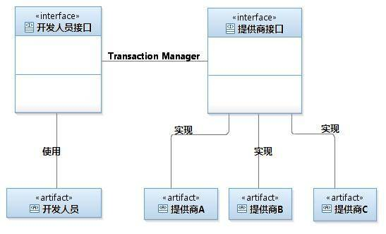
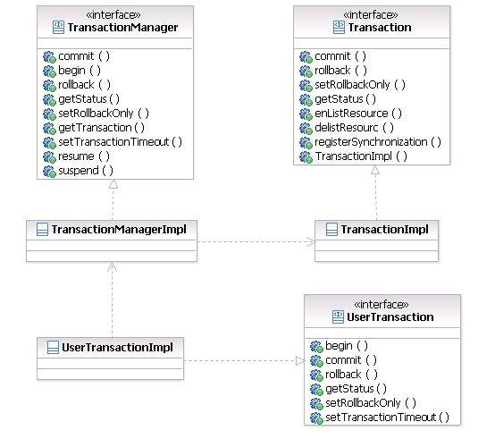
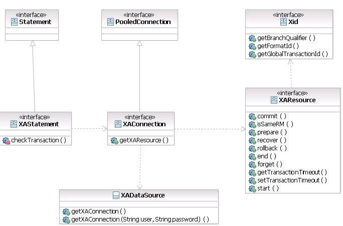

# JTA 深度 历险 – 原理与实现
深入探寻 JTA 的体系架构并通过详细的代码介绍其实现机制

**标签:** Java

[原文链接](https://developer.ibm.com/zh/articles/j-lo-jta/)

肖国一, 王晓利

发布: 2012-08-06

* * *

## 利用 JTA 处理事务

**什么是事务处理**

事务是计算机应用中不可或缺的组件模型，它保证了用户操作的原子性 ( Atomicity )、一致性 ( Consistency )、隔离性 ( Isolation ) 和持久性 ( Durabilily )。关于事务最经典的示例莫过于信用卡转账：将用户 A 账户中的 500 元人民币转移到用户 B 的账户中，其操作流程如下

1. 将 A 账户中的金额减少 500

2. 将 B 账户中的金额增加 500


这两个操作必须保正 ACID 的事务属性：即要么全部成功，要么全部失败；假若没有事务保障，用户的账号金额将可能发生问题：

假如第一步操作成功而第二步失败，那么用户 A 账户中的金额将就减少 500 元而用户 B 的账号却没有任何增加（不翼而飞）；同样如果第一步出错 而第二步成功，那么用户 A 的账户金额不变而用户 B 的账号将增加 500 元（凭空而生）。上述任何一种错误都会产生严重的数据不一致问题，事务的缺失对于一个稳定的生产系统是不可接受的。

**J2EE 事务处理方式**

1. 本地事务：紧密依赖于底层资源管理器（例如数据库连接 )，事务处理局限在当前事务资源内。此种事务处理方式不存在对应用服务器的依赖，因而部署灵活却无法支持多数据源的分布式事务。在数据库连接中使用本地事务示例如下：

    清单 1\. 本地事务处理实例


```
public void transferAccount() {
         Connection conn = null;
         Statement stmt = null;
         try{
             conn = getDataSource().getConnection();
             // 将自动提交设置为 false，
             //若设置为 true 则数据库将会把每一次数据更新认定为一个事务并自动提交
             conn.setAutoCommit(false);

             stmt = conn.createStatement();
             // 将 A 账户中的金额减少 500
             stmt.execute("\
             update t_account set amount = amount - 500 where account_id = 'A'");
             // 将 B 账户中的金额增加 500
             stmt.execute("\
             update t_account set amount = amount + 500 where account_id = 'B'");

             // 提交事务
             conn.commit();
             // 事务提交：转账的两步操作同时成功
         } catch(SQLException sqle){
             try{
                 // 发生异常，回滚在本事务中的操做
                conn.rollback();
                 // 事务回滚：转账的两步操作完全撤销
                 stmt.close();
                 conn.close();
             }catch(Exception ignore){

             }
             sqle.printStackTrace();
         }
     }

```

Show moreShow more icon

1. 分布式事务处理 : Java 事务编程接口（JTA：Java Transaction API）和 Java 事务服务 (JTS；Java Transaction Service) 为 J2EE 平台提供了分布式事务服务。分布式事务（Distributed Transaction）包括事务管理器（Transaction Manager）和一个或多个支持 XA 协议的资源管理器 ( Resource Manager )。我们可以将资源管理器看做任意类型的持久化数据存储；事务管理器承担着所有事务参与单元的协调与控制。JTA 事务有效的屏蔽了底层事务资源，使应用可以以透明的方式参入到事务处理中；但是与本地事务相比，XA 协议的系统开销大，在系统开发过程中应慎重考虑是否确实需要分布式事务。若确实需要分布式事务以协调多个事务资源，则应实现和配置所支持 XA 协议的事务资源，如 JMS、JDBC 数据库连接池等。使用 JTA 处理事务的示例如下（注意：connA 和 connB 是来自不同数据库的连接）

    清单 2\. JTA 事务处理


```
public void transferAccount() {

         UserTransaction userTx = null;
         Connection connA = null;
         Statement stmtA = null;

         Connection connB = null;
         Statement stmtB = null;

         try{
               // 获得 Transaction 管理对象
             userTx = (UserTransaction)getContext().lookup("\
                   java:comp/UserTransaction");
             // 从数据库 A 中取得数据库连接
             connA = getDataSourceA().getConnection();

             // 从数据库 B 中取得数据库连接
             connB = getDataSourceB().getConnection();

                        // 启动事务
             userTx.begin();

             // 将 A 账户中的金额减少 500
             stmtA = connA.createStatement();
             stmtA.execute("
            update t_account set amount = amount - 500 where account_id = 'A'");

             // 将 B 账户中的金额增加 500
             stmtB = connB.createStatement();
             stmtB.execute("\
             update t_account set amount = amount + 500 where account_id = 'B'");

             // 提交事务
             userTx.commit();
             // 事务提交：转账的两步操作同时成功（数据库 A 和数据库 B 中的数据被同时更新）
         } catch(SQLException sqle){

             try{
                     // 发生异常，回滚在本事务中的操纵
                  userTx.rollback();
                 // 事务回滚：转账的两步操作完全撤销
                 //( 数据库 A 和数据库 B 中的数据更新被同时撤销）

                 stmt.close();
                 conn.close();
                 ...
             }catch(Exception ignore){

             }
             sqle.printStackTrace();

         } catch(Exception ne){
             e.printStackTrace();
         }
     }

```

Show moreShow more icon

## JTA 实现原理

很多开发人员都会对 JTA 的内部工作机制感兴趣：我编写的代码没有任何与事务资源（如数据库连接）互动的代码，但是我的操作（数据库更新）却实实在在的被包含在了事务中，那 JTA 究竟是通过何种方式来实现这种透明性的呢？ 要理解 JTA 的实现原理首先需要了解其架构：它包括事务管理器（Transaction Manager）和一个或多个支持 XA 协议的资源管理器 ( Resource Manager ) 两部分， 我们可以将资源管理器看做任意类型的持久化数据存储；事务管理器则承担着所有事务参与单元的协调与控制。 根据所面向对象的不同，我们可以将 JTA 的事务管理器和资源管理器理解为两个方面：面向开发人员的使用接口（事务管理器）和面向服务提供商的实现接口（资源管理器）。其中开发接口的主要部分即为上述示例中引用的 UserTransaction 对象，开发人员通过此接口在信息系统中实现分布式事务；而实现接口则用来规范提供商（如数据库连接提供商）所提供的事务服务，它约定了事务的资源管理功能，使得 JTA 可以在异构事务资源之间执行协同沟通。以数据库为例，IBM 公司提供了实现分布式事务的数据库驱动程序，Oracle 也提供了实现分布式事务的数据库驱动程序， 在同时使用 DB2 和 Oracle 两种数据库连接时， JTA 即可以根据约定的接口协调者两种事务资源从而实现分布式事务。正是基于统一规范的不同实现使得 JTA 可以协调与控制不同数据库或者 JMS 厂商的事务资源，其架构如下图所示：

图 1\. JTA 体系架构



开发人员使用开发人员接口，实现应用程序对全局事务的支持；各提供商（数据库，JMS 等）依据提供商接口的规范提供事务资源管理功能；事务管理器（ TransactionManager ）将应用对分布式事务的使用映射到实际的事务资源并在事务资源间进行协调与控制。 下面，本文将对包括 UserTransaction、Transaction 和 TransactionManager 在内的三个主要接口以及其定义的方法进行介绍。

面向开发人员的接口为 UserTransaction （使用方法如上例所示），开发人员通常只使用此接口实现 JTA 事务管理，其定义了如下的方法：

- **begin()** – 开始一个分布式事务，（在后台 TransactionManager 会创建一个 Transaction 事务对象并把此对象通过 ThreadLocale 关联到当前线程上 )
- **commit()** – 提交事务（在后台 TransactionManager 会从当前线程下取出事务对象并把此对象所代表的事务提交）
- **rollback()** – 回滚事务（在后台 TransactionManager 会从当前线程下取出事务对象并把此对象所代表的事务回滚）
- **getStatus()** – 返回关联到当前线程的分布式事务的状态 (Status 对象里边定义了所有的事务状态，感兴趣的读者可以参考 API 文档 )
- **setRollbackOnly()** – 标识关联到当前线程的分布式事务将被回滚

面向提供商的实现接口主要涉及到 TransactionManager 和 Transaction 两个对象

Transaction 代表了一个物理意义上的事务，在开发人员调用 UserTransaction.begin() 方法时 TransactionManager 会创建一个 Transaction 事务对象（标志着事务的开始）并把此对象通过 ThreadLocale 关联到当前线程。UserTransaction 接口中的 commit()、rollback()，getStatus() 等方法都将最终委托给 Transaction 类的对应方法执行。Transaction 接口定义了如下的方法：

- **commit()** – 协调不同的事务资源共同完成事务的提交
- **rollback()** – 协调不同的事务资源共同完成事务的回滚
- **setRollbackOnly()** – 标识关联到当前线程的分布式事务将被回滚
- **getStatus()** – 返回关联到当前线程的分布式事务的状态
- **enListResource(XAResource xaRes, int flag)** – 将事务资源加入到当前的事务中（在上述示例中，在对数据库 A 操作时 其所代表的事务资源将被关联到当前事务中，同样，在对数据库 B 操作时其所代表的事务资源也将被关联到当前事务中）
- **delistResourc(XAResource xaRes, int flag)** – 将事务资源从当前事务中删除
- **registerSynchronization(Synchronization sync)** – 回调接口，Hibernate 等 ORM 工具都有自己的事务控制机制来保证事务， 但同时它们还需要一种回调机制以便在事务完成时得到通知从而触发一些处理工作，如清除缓存等。这就涉及到了 Transaction 的回调接口 registerSynchronization。工具可以通过此接口将回调程序注入到事务中，当事务成功提交后，回调程序将被激活。

TransactionManager 本身并不承担实际的事务处理功能，它更多的是充当用户接口和实现接口之间的桥梁。下面列出了 TransactionManager 中定义的方法，可以看到此接口中的大部分事务方法与 UserTransaction 和 Transaction 相同。 在开发人员调用 UserTransaction.begin() 方法时 TransactionManager 会创建一个 Transaction 事务对象（标志着事务的开始）并把此对象通过 ThreadLocale 关联到当前线程上；同样 UserTransaction.commit() 会调用 TransactionManager.commit()， 方法将从当前线程下取出事务对象 Transaction 并把此对象所代表的事务提交， 即调用 Transaction.commit()

- **begin()** – 开始事务
- **commit()** – 提交事务
- **rollback()** – 回滚事务
- **getStatus()** – 返回当前事务状态
- **setRollbackOnly()**
- **getTransaction()** – 返回关联到当前线程的事务
- **setTransactionTimeout(int seconds)** – 设置事务超时时间
- **resume(Transaction tobj)** – 继续当前线程关联的事务
- **suspend()** – 挂起当前线程关联的事务

在系统开发过程中会遇到需要将事务资源暂时排除的操作，此时就需要调用 suspend() 方法将当前的事务挂起：在此方法后面所做的任何操作将不会被包括在事务中，在非事务性操作完成后调用 resume()以继续事务（注： 要进行此操作需要获得 TransactionManager 对象， 其获得方式在不同的 J2EE 应用服务器上是不一样的）

下面将通过具体的代码向读者介绍 JTA 实现原理。下图列出了示例实现中涉及到的 Java 类，其中 UserTransactionImpl 实现了 UserTransaction 接口，TransactionManagerImpl 实现了 TransactionManager 接口，TransactionImpl 实现了 Transaction 接口

图 2\. JTA 实现类图



清单 3\. 开始事务 – UserTransactionImpl implenments UserTransaction

```
public void begin() throws NotSupportedException, SystemException {
// 将开始事务的操作委托给 TransactionManagerImpl
TransactionManagerImpl.singleton().begin();
     }

```

Show moreShow more icon

清单 4\. 开始事务 – TransactionManagerImpl implements TransactionManager

```
// 此处 transactionHolder 用于将 Transaction 所代表的事务对象关联到线程上
private static ThreadLocal<TransactionImpl> transactionHolder
        = new ThreadLocal<TransactionImpl>();

     //TransacationMananger 必须维护一个全局对象，因此使用单实例模式实现
     private static TransactionManagerImpl singleton = new TransactionManagerImpl();

     private TransactionManagerImpl(){

     }

     public static TransactionManagerImpl singleton(){
         return singleton;
     }

     public void begin() throws NotSupportedException, SystemException {
         //XidImpl 实现了 Xid 接口，其作用是唯一标识一个事务
         XidImpl xid = new XidImpl();
         // 创建事务对象，并将对象关联到线程
         TransactionImpl tx = new TransactionImpl(xid);

         transactionHolder.set(tx);
     }

```

Show moreShow more icon

现在我们就可以理解 Transaction 接口上没有定义 begin 方法的原因了：Transaction 对象本身就代表了一个事务，在它被创建的时候就表明事务已经开始，因此也就不需要额外定义 begin() 方法了。

清单 5\. 提交事务 – UserTransactionImpl implenments UserTransaction

```
public void commit() throws RollbackException, HeuristicMixedException,
             HeuristicRollbackException, SecurityException,
             IllegalStateException, SystemException {

             // 检查是否是 Roll back only 事务，如果是回滚事务
                if(rollBackOnly){
                 rollback();

                 return;
               } else {
                // 将提交事务的操作委托给 TransactionManagerImpl
                TransactionManagerImpl.singleton().commit();
               }
     }

```

Show moreShow more icon

清单 6\. 提交事务 – TransactionManagerImpl implenments TransactionManager

```
public void commit() throws RollbackException, HeuristicMixedException,
    HeuristicRollbackException, SecurityException,
    IllegalStateException, SystemException {

     // 取得当前事务所关联的事务并通过其 commit 方法提交
     TransactionImpl tx = transactionHolder.get();
     tx.commit();
             }

```

Show moreShow more icon

同理， rollback、getStatus、setRollbackOnly 等方法也采用了与 commit() 相同的方式实现。 UserTransaction 对象不会对事务进行任何控制， 所有的事务方法都是通过 TransactionManager 传递到实际的事务资源即 Transaction 对象上。

上述示例演示了 JTA 事务的处理过程，下面将为您展示事务资源（数据库连接，JMS）是如何以透明的方式加入到 JTA 事务中的。首先需要明确的一点是，在 JTA 事务 代码中获得的数据库源 ( DataSource ) 必须是支持分布式事务的。在如下的代码示例中，尽管所有的数据库操作都被包含在了 JTA 事务中，但是因为 MySql 的数据库连接是通过本地方式获得的，对 MySql 的任何更新将不会被自动包含在全局事务中。

清单 7\. JTA 事务处理

```
public void transferAccount() {

         UserTransaction userTx = null;
         Connection mySqlConnection = null;
         Statement mySqlStat = null;

         Connection connB = null;
         Statement stmtB = null;

         try{
                // 获得 Transaction 管理对象
             userTx =
            (UserTransaction)getContext().lookup("java:comp/UserTransaction");
             // 以本地方式获得 mySql 数据库连接
             mySqlConnection = DriverManager.getConnection("localhost:1111");

             // 从数据库 B 中取得数据库连接， getDataSourceB 返回应用服务器的数据源
             connB = getDataSourceB().getConnection();

                        // 启动事务
             userTx.begin();

             // 将 A 账户中的金额减少 500
             //mySqlConnection 是从本地获得的数据库连接，不会被包含在全局事务中
             mySqlStat = mySqlConnection.createStatement();
             mySqlStat.execute("
             update t_account set amount = amount - 500 where account_id = 'A'");

             //connB 是从应用服务器得的数据库连接，会被包含在全局事务中
             stmtB = connB.createStatement();
             stmtB.execute("
             update t_account set amount = amount + 500 where account_id = 'B'");

             // 事务提交：connB 的操作被提交，mySqlConnection 的操作不会被提交
             userTx.commit();

         } catch(SQLException sqle){
             // 处理异常代码
         } catch(Exception ne){
             e.printStackTrace();
         }
     }

```

Show moreShow more icon

为什么必须从支持事务的数据源中获得的数据库连接才支持分布式事务呢？其实支持事务的数据源与普通的数据源是不同的，它实现了额外的 XADataSource 接口。我们可以简单的将 XADataSource 理解为普通的数据源（继承了 java.sql.PooledConnection），只是它为支持分布式事务而增加了 getXAResource 方法。另外，由 XADataSource 返回的数据库连接与普通连接也是不同的，此连接除了实现 java.sql.Connection 定义的所有功能之外还实现了 XAConnection 接口。我们可以把 XAConnection 理解为普通的数据库连接，它支持所有 JDBC 规范的数据库操作，不同之处在于 XAConnection 增加了对分布式事务的支持。通过下面的类图读者可以对这几个接口的关系有所了解：

图 3\. 事务资源类图



应用程序从支持分布式事务的数据源获得的数据库连接是 XAConnection 接口的实现，而由此数据库连接创建的会话（Statement）也为了支持分布式事务而增加了功能，如下代码所示：

清单 8\. JTA 事务资源处理

```
public void transferAccount() {

         UserTransaction userTx = null;

         Connection conn = null;
         Statement stmt = null;

         try{
                // 获得 Transaction 管理对象
             userTx = (UserTransaction)getContext().lookup("
             java:comp/UserTransaction");

             // 从数据库中取得数据库连接， getDataSourceB 返回支持分布式事务的数据源
             conn = getDataSourceB().getConnection();
                        // 会话 stmt 已经为支持分布式事务进行了功能增强
             stmt = conn.createStatement();

                        // 启动事务
             userTx.begin();
             stmt.execute("update t_account ... where account_id = 'A'");
             userTx.commit();

         } catch(SQLException sqle){
             // 处理异常代码
         } catch(Exception ne){
             e.printStackTrace();
         }
     }

```

Show moreShow more icon

我们来看一下由 XAConnection 数据库连接创建的会话（Statement）部分的代码实现（不同的 JTA 提供商会有不同的实现方式，此处代码示例只是向您演示事务资源是如何被自动加入到事务中）。 我们以会话对象的 execute 方法为例，通过在方法开始部分增加对 associateWithTransactionIfNecessary 方法的调用，即可以保证在 JTA 事务期间，对任何数据库连接的操作都会被透明的加入到事务中。

清单 9\. 将事务资源自动关联到事务对象 – XAStatement implements Statement

```
public void execute(String sql) {
                // 对于每次数据库操作都检查此会话所在的数据库连接是否已经被加入到事务中
         associateWithTransactionIfNecessary();

         try{
                      // 处理数据库操作的代码
              ....

         } catch(SQLException sqle){
             // 处理异常代码
         } catch(Exception ne){
             e.printStackTrace();
         }
     }

public void associateWithTransactionIfNecessary(){

         // 获得 TransactionManager
         TransactionManager tm = getTransactionManager();

                Transaction tx = tm.getTransaction()；
             // 检查当前线程是否有分布式事务
            if(tx != null){
             // 在分布式事务内，通过 tx 对象判断当前数据连接是否已经被包含在事务中，
             //如果不是那么将此连接加入到事务中
             Connection conn = this.getConnection();
             //tx.hasCurrentResource， xaConn.getDataSource() 不是标准的 JTA
                        // 接口方法，是为了实现分布式事务而增加的自定义方法
             if(!tx.hasCurrentResource(conn)){
                 XAConnection xaConn = (XAConnection)conn;
                 XADataSource xaSource = xaConn.getDataSource();

                 // 调用 Transaction 的接口方法，将数据库事务资源加入到当前事务中
                 tx.enListResource(xaSource.getXAResource(), 1);
                 }
             }
        }

```

Show moreShow more icon

XAResource 与 Xid： XAResource 是 Distributed Transaction Processing: The XA Specification 标准的 Java 实现，它是对底层事务资源的抽象，定义了分布式事务处理过程中事务管理器和资源管理器之间的协议，各事务资源提供商（如 JDBC 驱动，JMS）将提供此接口的实现。使用此接口，开发人员可以通过自己的编程实现分布式事务处理，但这些通常都是由应用服务器实现的（服务器自带实现更加高效，稳定） 为了说明，我们将举例说明他的使用方式。

在使用分布式事务之前，为了区分事务使之不发生混淆，必须实现一个 Xid 类用来标识事务，可以把 Xid 想象成事务的一个标志符，每次在新事务创建是都会为事务分配一个 Xid，Xid 包含三个元素：formatID、gtrid（全局事务标识符）和 bqual（分支修饰词标识符）。 formatID 通常是零，这意味着你将使用 OSI CCR（Open Systems Interconnection Commitment, Concurrency 和 Recovery 标准）来命名；如果你要使用另外一种格式，那么 formatID 应该大于零，-1 值意味着 Xid 为无效。

gtrid 和 bqual 分别包含 64 个字节二进制码来分别标识全局事务和分支事务， 唯一的要求是 gtrid 和 bqual 必须是全局唯一的。

XAResource 接口中主要定义了如下方法：

- **commit()** – 提交事务
- **isSameRM(XAResource xares)** – 检查当前的 XAResource 与参数是否同一事务资源
- **prepare()** – 通知资源管理器准备事务的提交工作
- **rollback()** – 通知资源管理器回滚事务

在事务被提交时，Transaction 对象会收集所有被当前事务包含的 XAResource 资源，然后调用资源的提交方法，如下代码所示：

清单 10\. 提交事务 – TransactionImpl implements Transaction

```
public void commit() throws RollbackException, HeuristicMixedException,
             HeuristicRollbackException, SecurityException,
             IllegalStateException, SystemException {

             // 得到当前事务中的所有事务资源
                List<XAResource> list = getAllEnlistedResouces();

             // 通知所有的事务资源管理器，准备提交事务
                        // 对于生产级别的实现，此处需要进行额外处理以处理某些资源准备过程中出现的异常
             for(XAResource xa : list){
                 xa.prepare();
             }

             // 所有事务性资源，提交事务
             for(XAResource xa : list){
                 xa.commit();
             }
       }

```

Show moreShow more icon

## 结束语

通过如上介绍相信读者对 JTA 的原理已经有所了解，本文中的示例代码都是理想情况下的假设实现。一款完善成熟的 JTA 事务实现需要考虑与处理的细节非常多，如性能（提交事务的时候使用多线程方式并发提交事务）、容错（网络，系统异常）等， 其成熟也需要经过较长时间的积累。感兴趣的读者可以阅读一些开源 JTA 实现以进一步深入学习。

## 相关主题

- [Java Transaction API Specification](https://www.oracle.com/technetwork/java/javaee/jta/index.html)
- [Java Transaction API 概述](https://www.oracle.com/technetwork/java/javaee/jta/index.html)
- [JOTM](https://projects.ow2.org/view/jotm/)