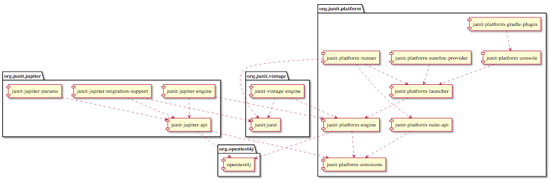

# JUnit 5 Vintage 和 JUnit Jupiter 扩展模型
了解用于参数注入、参数化测试、动态测试和自定义注解的 JUnit Jupiter 扩展

**标签:** Java

[原文链接](https://developer.ibm.com/zh/articles/j-introducing-junit5-part2-vintage-jupiter-extension-model/)

J Steven Perry

发布: 2017-12-18

* * *

在本教程的 [第 1 部分](/zh/tutorials/j-introducing-junit5-part1-jupiter-api) 中，我介绍了 JUnit 5 的设置说明，以及 JUnit 5 的架构和组件。还介绍了如何使用 JUnit Jupiter API 中的新特性，包括注解、断言和前置条件。

在本部分中，您将熟悉组成全新 JUnit 5 的另外两个模块：JUnit Vintage 和 JUnit Jupiter 扩展模型。我将介绍如何使用这些组件实现参数注入、参数化测试、动态测试和自定义注解等。

与第 1 部分中一样，我将介绍如何使用 Maven 和 Gradle 运行测试。

请注意，本教程的示例基于 [JUnit 5,Version 5.0.2](http://junit.org/junit5/docs/current/user-guide/#release-notes-5.0.2) 。

## 前提条件

假设您熟悉以下软件的使用：

- Eclipse IDE
- Maven
- Gradle（可选）
- Git

要跟随示例进行操作，您应在计算机上安装 JDK 8、Eclipse、Maven、Gradle（可选）和 Git。如果缺少其中的任何工具，可使用下面的链接下载和安装它们：

- [JDK 8 for Windows, Mac, and Linux。](http://www.oracle.com/technetwork/java/javase/downloads/jdk8-downloads-2133151.html)
- [Eclipse IDE for Windows, Mac, and Linux。](http://www.eclipse.org/downloads/eclipse-packages/)
- [Apache Maven for Windows, Mac, and Linux。](https://maven.apache.org/download.cgi)
- [Gradle for Windows, Mac, and Linux。](https://gradle.org/install)
- [Git for Windows, Mac, and Linux。](https://git-scm.com/downloads)

[从 GitHub 克隆示例应用程序](https://github.com/makotogo/HelloJUnit5Part2)

## JUnit Vintage

升级到新的重要软件版本始终存在风险，但是在这里，升级不仅是个好主意，而且还很安全。

因为许多组织对 JUnit 4 （甚至对 JUnit 3）进行了大力投资，所以 JUnit 5 的开发团队创建了 JUnit Vintage 包，其中包含 JUnit Vintage 测试引擎。JUnit Vintage 可确保现有 JUnit 测试能与使用 JUnit Jupiter 创建的新测试一同运行。

JUnit 5 的架构还支持同时运行多个测试引擎：可以一同运行 JUnit Vintage 测试引擎和任何其他兼容 JUnit 5 的测试引擎。

现在您已了解 JUnit Vintage，可能想知道它的工作原理。图 1 给出了来自第 1 部分的 JUnit 5 依赖关系图，展示了 JUnit 5 中各种包之间的关系。

##### JUnit 5 依赖关系图



图 1 中间行中所示的 JUnit Vintage 旨在提供一条通往 JUnit Jupiter 的 “平稳升级路径”。两个 JUnit 5 模块依赖于 JUnit Vintage：

- **junit-platform-runner** 提供一个 `Runner` ，允许在 JUnit 4 环境（比如 Eclipse）中执行测试。
- **junit-jupiter-migration-support** 提供了后向兼容性，允许您选择 JUnit 4 `Rule` 。

JUnit Vintage 本身由两个模块组成：

- **junit:junit** 是用于 JUnit 3 和 JUnit 4 的 API。
- **junit-vintage-engine** 是在 JUnit Platform 上运行 JUnit 3 和 JUnit 4 测试的测试引擎。

因为 JUnit Platform 允许多个测试引擎同时运行，所以可让您的 JUnit 3 和 JUnit 4 测试与使用 JUnit Jupiter 编写的测试并列运行。教程后面将介绍如何执行该操作。

在 Eclipse、Maven 和 Gradle 中运行测试之前，我们花点时间复习一下基本单元测试的概念。我们将分析在 JUnit 3 和 JUnit 4 中编写的测试。

### JUnit 3 中的测试

使用 JUnit 3 编写的测试将按原样在 JUnit Platform 上运行。只需将 `junit-vintage` 依赖项包含在构建版本中，其他部分就能直接运行。

在示例应用程序中，您将看到已包含在示例应用程序中的 Maven POM (`pom.xml`) 和 Gradle 构建文件 (`build.gradle`)，所以您可立即运行这些测试。

清单 1 给出了示例应用程序的一个 JUnit 3 测试的 _部分_ 内容。它位于 `com.makotojava.learn.junit3` 包中的 `src/test/java` 树中。

##### HelloJunit5Part2 示例应用程序的 JUnit 3 测试用例

```
.
.
public class PersonDaoBeanTest extends TestCase {

private ApplicationContext ctx;

private PersonDaoBean classUnderTest;

@Override
protected void setUp() throws Exception {
    ctx = new AnnotationConfigApplicationContext(TestSpringConfiguration.class);
    classUnderTest = ctx.getBean(PersonDaoBean.class);
}

@Override
protected void tearDown() throws Exception {
    DataSource dataSource = (DataSource) ctx.getBean("dataSource");
    if (dataSource instanceof EmbeddedDatabase) {
      ((EmbeddedDatabase) dataSource).shutdown();
    }
}

public void testFindAll() {
    assertNotNull(classUnderTest);
    List<Person> people = classUnderTest.findAll();
    assertNotNull(people);
    assertFalse(people.isEmpty());
    assertEquals(5, people.size());
}
.
.
}

```

Show moreShow more icon

JUnit 3 测试用例扩展了 JUnit 3 API 类 `TestCase` （第 3 行），每个测试方法必须以单词 `test` 开头（第 23 行）。

要在 Eclipse 中运行此测试，可右键单击 Package Explorer 视图中的测试类，选择 **Run As > Junit Test** 。

教程后面将介绍如何使用 Maven 和 Gradle 运行此测试。

### JUnit 4 中的测试

您的 JUnit 4 测试按原样在 JUnit Platform 上运行。只需将 `junit-vintage` 依赖项包含在构建版本中，就能直接运行它。

示例应用程序中包含的 Maven POM 和 Gradle 构建文件 (`build.gradle`) 中已包含该依赖项，所以您可立即运行这些测试。

清单 2 给出了示例应用程序的一个 JUnit 4 测试的 _部分_ 内容。它位于 `com.makotojava.learn.junit4` 包中的 `src/test/java` 树中。

##### HelloJunit5Part2 示例应用程序的 JUnit 4 测试用例

```
.
.
public class PersonDaoBeanTest {

private ApplicationContext ctx;

private PersonDaoBean classUnderTest;

@Before
public void setUp() throws Exception {
    ctx = new AnnotationConfigApplicationContext(TestSpringConfiguration.class);
    classUnderTest = ctx.getBean(PersonDaoBean.class);
}

@After
public void tearDown() throws Exception {
    DataSource dataSource = (DataSource) ctx.getBean("dataSource");
    if (dataSource instanceof EmbeddedDatabase) {
      ((EmbeddedDatabase) dataSource).shutdown();
    }
}

@Test
public void findAll() {
    assertNotNull(classUnderTest);
    List<Person> people = classUnderTest.findAll();
    assertNotNull(people);
    assertFalse(people.isEmpty());
    assertEquals(5, people.size());
}
.
.
}

```

Show moreShow more icon

JUnit 4 测试用例以单词 `Test` 结尾（第 3 行），每个测试方法使用 `@Test` 注解（第 23 行）。

要在 Eclipse 中运行此测试，可右键单击 Package Explorer 视图中的测试类，选择 **Run As > Junit Test** 。

教程后面将介绍如何使用 Maven 和 Gradle 运行此测试。

### 对迁移到 JUnit Jupiter 的支持

##### 从 JUnit 4 迁移

打算从 JUnit4 迁移？一定要通读 [文档](http://junit.org/junit5/docs/current/user-guide/#migrating-from-junit4)。

`junit-jupiter-migration-support` 包中包含了用于后向兼容性的一些选定 `Rule` ，所以如果您对 JUnit 4 规则进行了大力投资也不用担心。在 JUnit 5 中，您将使用 JUnit Jupiter 扩展模型实现 JUnit 4 中的各种规则提供的相同行为。下一节将介绍如何完成该工作。

## JUnit Jupiter 扩展模型

通过使用 JUnit 扩展模型，现在任何开发人员或工具供应商都能扩展 JUnit 的核心功能。

要想真正认识到 JUnit Jupiter 扩展模型的开创性，需要理解它 _如何_ 扩展 JUnit 4 的核心功能。如果您已理解这一点，可跳过下一节。

### 扩展 JUnit 4 的核心功能

过去，希望扩展 JUnit 4 核心功能的开发人员或工具供应商会使用 `Runner` 和 `@Rule` 。

_Runner_ 通常是 `BlockJUnit4ClassRunner` 的子类，用于提供 JUnit 中没有直接提供的某种行为。目前有许多第三方 `Runner` ，比如用于运行基于 Spring 的单元测试的 `SpringJUnit4ClassRunner` ，以及用于处理单元测试中 Mockito 对象的 `MockitoJUnitRunner` 。

必须在测试类级别上使用 `@RunWith` 注解来声明 `Runner` 。 `@RunWith` 接受一个参数： `Runner` 的实现类。因为每个测试类最多只能拥有一个 `Runner` ，所以每个测试类最多也只能拥有一个扩展点。

为了解决 `Runner` 概念的这一内置限制，JUnit 4.7 引入了 `@Rule` 。一个测试类可声明多个 `@Rule` ，这些规则可在测试方法级别和类级别上运行（而 `Runner` 只能在类级别上运行）。

鉴于 JUnit 4.7 的 `@Rule` 解决方法很好地处理了大部分情况，您可能想知道为什么我们还需要新的 JUnit Jupiter 扩展模型。下节将解释其中的原因。

### 特性与扩展

##### 选择 JUnit 5 还是 JUnit Jupiter？

JUnit 5 和 JUnit Jupiter 之间的区别可能很容易让人混淆。提及 JUnit 5 时，我谈论的是 JUnit 的最新版本，其中包含一种新的 JUnit 方法和架构。而提及 JUnit Jupiter 时，我指的是用于编写测试的 API。

JUnit 5 的一个核心原则是 [扩展点优于特性](https://github.com/junit-team/junit5/wiki/Core-Principles#prefer-extension-points-over-features) 。

这意味着尽管 JUnit _能_ 为工具供应商和开发人员提供各种特性，但 JUnit 5 团队更喜欢在架构中提供扩展点。这样第三方（无论是工具供应商、测试编写者还是其他任何人）就能在这些点上编写各种 _扩展_ 。根据 JUnit Wiki 的解释，优先选择扩展点有 3 个原因：

- JUnit 不是，也不会尝试成为一个无所不包的实用程序。
- 第三方开发人员知道他们的需求，并且编写代码来满足自己需求的速度比 JUnit 团队响应某个特性请求的速度更快。
- API 一旦发布，就 _很难更改_ 。

接下来我将解释如何扩展 JUnit Jupiter API，首先从扩展点开始。

### 扩展点和测试生命周期

一个扩展点对应于 JUnit test 生命周期中一个预定义的点。从 Java™ 语言的角度讲， _扩展点_ 是您实现并向 JUnit 注册（激活）的回调接口。因此， _扩展点_ 是回调接口， _扩展_ 是该接口的实现。

在本教程中，我将把已实现的扩展点回调接口称为 _扩展_ 。

一旦注册您的扩展，就会将其激活。在测试生命周期中合适的点上，JUnit 将使用回调接口调用它。

表 1 总结了 JUnit Jupiter 扩展模型中的扩展点。

##### 扩展点

接口说明AfterAllCallback定义 API 扩展，希望在调用所有测试后让测试容器执行额外的行为。AfterEachCallback定义 API 扩展，希望在调用每个测试方法后让测试执行额外的行为。AfterTestExecutionCallback定义 API 扩展，希望在执行每个测试后让测试立即执行额外的行为。BeforeAllCallback定义 API 扩展，希望在调用所有测试前让测试容器执行额外的行为。BeforeEachCallback定义 API 扩展，希望在调用每个测试前让测试执行额外的行为。BeforeTestExecutionCallback定义 API 扩展，希望在执行每个测试前让测试立即执行额外的行为。ParameterResolver定义 API 扩展，希望在运行时动态解析参数。TestExecutionExceptionHandler定义 API 扩展，希望处理在测试执行期间抛出的异常。

表 1 中列出的扩展点回调接口已在示例应用程序的 `JUnit5ExtensionShowcase` 类中实现。可在 `com.makotojava.learn.junit5` 包中的 `test/src` 树中找到该类。

### 创建扩展

要创建扩展，只需实现该扩展点的回调接口。假设我想创建一个在每个测试方法运行之前就运行的扩展。在此情况下，我只需要实现 `BeforeEachCallback` 接口：

```
public class MyBeforeEachCallbackExtension implements BeforeEachCallback {
@Override
public void beforeEach(ExtensionContext context) throws Exception {
    // Implementation goes here
}
}

```

Show moreShow more icon

实现扩展点接口后，需要激活它，这样 JUnit 才能在测试生命周期中合适的点调用它。通过注册扩展来激活它。

### 激活扩展

要激活上述扩展，只需使用 `@ExtendWith` 注解注册它：

```
@ExtendWith(MyBeforeEachCallbackExtension.class)
public class MyTestClass {
.
.
    @Test
    public void myTestMethod() {
        // Test code here
    }
    @Test
    public void someOtherTestMethod() {
        // Test code here
    }
.
.
}

```

Show moreShow more icon

当 `MyTestClass` 运行时，在执行每个 `@Test` 方法前，会调用 `MyBeforeEachCallbackExtension` 。

注意，这种注册扩展的风格是 _声明性的_ 。JUnit 还提供了一种自动注册机制，它使用了 Java 的 `ServiceLoader` 机制。此处不会详细介绍该机制，但 JUnit 5 用户指南的 [扩展模型](http://junit.org/junit5/docs/current/user-guide/#extensions-registration) 部分中提供了大量的有用信息。

## 参数注入

假设您想将一个参数传递给 `@Test` 方法。您如何完成该工作？下面我们就学习一下。

### ParameterResolver 接口

如果所编写的测试方法在其签名中包含一个参数，则必须将该参数解析为一个实际对象，然后 JUnit 才能调用该方法。一种 _乐观的场景_ 如下所示：JUnit (1) 寻找一个实现 `ParameterResolver` 接口的已注册扩展；(2) 调用它来解析该参数；(3) 然后调用您的测试方法，传入解析后的参数值。

`ParameterResolver` 接口包含 2 个方法：

```
package org.junit.jupiter.api.extension;

import static org.junit.platform.commons.meta.API.Usage.Experimental;
import java.lang.reflect.Parameter;
import org.junit.platform.commons.meta.API;

@API(Experimental)
public interface ParameterResolver extends Extension {

    boolean supportsParameter(ParameterContext parameterContext,
                              ExtensionContext extensionContext)
            throws ParameterResolutionException;

    Object resolveParameter(ParameterContext parameterContext,
                            ExtensionContext extensionContext)
            throws ParameterResolutionException;

}

```

Show moreShow more icon

Jupiter 测试引擎需要解析您的测试类中的一个参数时，它首先会调用 `supports()` 方法，查看该扩展是否能处理这种参数类型。如果 `supports()` 返回 `true` ，则 Jupiter 测试引擎调用 `resolve()` 来获取正确类型的 `Object` ，随后在调用测试方法时会使用该对象。

如果未找到能处理该参数类型的扩展，您会看到一条与下面类似的消息：

```
org.junit.jupiter.api.extension.ParameterResolutionException:
No ParameterResolver registered for parameter [java.lang.String arg0] in executable
[public void com.makotojava.learn.junit5.PersonDaoBeanTest$WhenDatabaseIsPopulated.findAllByLastName(java.lang.String)].
.
.

```

Show moreShow more icon

### 创建 ParameterResolver 实现

要创建一个 `ParameterResolver` ，您只需实现该接口：

##### Person 对象的 ParameterResolver 扩展点实现

```
import org.junit.jupiter.api.extension.ExtensionContext;
import org.junit.jupiter.api.extension.ParameterContext;
import org.junit.jupiter.api.extension.ParameterResolutionException;
import org.junit.jupiter.api.extension.ParameterResolver;

import com.makotojava.learn.junit.Person;
import com.makotojava.learn.junit.PersonGenerator;

public class GeneratedPersonParameterResolver implements ParameterResolver {

@Override
public boolean supportsParameter(ParameterContext parameterContext, ExtensionContext extensionContext)
      throws ParameterResolutionException {
    return parameterContext.getParameter().getType() == Person.class;
}

@Override
public Object resolveParameter(ParameterContext parameterContext, ExtensionContext extensionContext)
      throws ParameterResolutionException {
    return PersonGenerator.createPerson();
}

}

```

Show moreShow more icon

在这个特定的用例中，如果参数的类型是 `Person` （第 14 行），则 `supports()` 返回 `true` 。JUnit 需要将参数解析为 `Person` 对象时，它调用 `resolve()` ，后者返回一个新生成的 `Person` 对象（第 20 行）。

### 使用 ParameterResolver 实现

要使用 `ParameterResolver` ，必须向 JUnit Jupiter 测试引擎注册它。与前面的演示一样，可使用 `@ExtendWith` 注解完成注册工作。

##### 使用 ParameterResolver

```
@DisplayName("Testing PersonDaoBean")
@ExtendWith(GeneratedPersonParameterResolver.class)
public class PersonDaoBeanTest extends AbstractBaseTest {
.
.
    @Test
    @DisplayName("Add generated Person should succeed - uses Parameter injection")
    public void add(Person person) {
      assertNotNull(classUnderTest, "PersonDaoBean reference cannot be null.");
      Person personAdded = classUnderTest.add(person);
      assertNotNull(personAdded, "Add failed but should have succeeded");
      assertNotNull(personAdded.getId());
      performPersonAssertions(person.getLastName(), person.getFirstName(), person.getAge(), person.getEyeColor(),
          person.getGender(), personAdded);
    }
.
.
}

```

Show moreShow more icon

`PersonDaoBeanTest` 类运行时，它将向 Jupiter 测试引擎注册 `GeneratedPersonParameterResolver` 。每次需要解析一个参数时，就会调用自定义 `ParameterResolver` 。

扩展有一个影响范围 – 类级别或方法级别。

在这个特定的用例中，我选择在类级别注册扩展（第 2 行）。在类级别注册意味着，接受 _任何_ 参数的任何测试方法都会导致 JUnit 调用 `GeneratedPersonParameterResolver` 扩展。如果参数类型为 `Person` ，则返回一个已生成的 `Person` 对象并将其传递给测试方法（第 8 行）。

要将扩展的范围缩小到单个方法，可按如下方式注册扩展：

##### 仅将 ParameterResolver 用于单个方法

```
@Test
@DisplayName("Add generated Person should succeed - uses Parameter injection")
@ExtendWith(GeneratedPersonParameterResolver.class)
public void add(Person person) {
assertNotNull(classUnderTest, "PersonDaoBean reference cannot be null.");
Person personAdded = classUnderTest.add(person);
assertNotNull(personAdded, "Add failed but should have succeeded");
assertNotNull(personAdded.getId());
performPersonAssertions(person.getLastName(), person.getFirstName(), person.getAge(), person.getEyeColor(),
      person.getGender(), personAdded);
}

```

Show moreShow more icon

现在，系统只会调用该扩展来解析 `add()` 测试方法的参数。如果类中的任何其他测试方法需要参数解析，它们需要一个不同的 `ParameterResolver` 。

注意，任何给定类的特定范围上只能有一个 `ParameterResolver` 。举例而言，如果您已经为在类级别上声明的 `Person` 对象提供了一个 `ParameterResolver` ，并在同一个类中为在方法级别上声明的对象提供了另一个 `ParameterResolver` ，那么 JUnit 就不知道使用哪一个。最终会看到以下消息来表明这种模糊性：

```
org.junit.jupiter.api.extension.ParameterResolutionException:
Discovered multiple competing ParameterResolvers for parameter
[com.makotojava.learn.junit.Person arg0] in executable
[public void com.makotojava.learn.junit5.PersonDaoBeanTest$WhenDatabaseIsPopulated.update(com.makotojava.learn.junit.Person)]: .
.
.

```

Show moreShow more icon

### 准备看个视频来放松一下？

下节将介绍参数化测试，但首先让我们用少许时间进行一些实践学习。本 [视频](https://v.youku.com/v_show/id_XMjk1NTY4MTkxNg==.html) 演示了如何在 JUnit 5 中使用 `ParameterResolver` 和 `@ParameterizedTest` 注解来测试基于 Spring 的应用程序。

## 参数化测试

_参数化测试_ 是指多次调用 `@Test` 方法，但每次都使用不同的参数值。参数化测试必须使用 `@ParameterizedTest` 进行注解，而且必须为其参数指定一个 _来源_ 。

JUnit Jupiter 提供了多个来源。每个来源指定一个 `@ArgumentsSource` ，也就是一个 `ArgumentsProvider` 实现。本节将介绍如何使用 3 个来源：

- `@ValueSource`
- `@EnumSource`
- `@MethodSource`

每个来源都在所允许的数据类型的易用性与灵活性之间进行了折中。最容易使用但最不灵活（仅限于一个 Java 原语子集）的是 `@ValueSource` 。最灵活的是 `@MethodSource` ，允许您使用所选的任何复杂对象来参数化测试方法。（注意， `@MethodSource` 也是最难使用的。）

### @ValueSource

在 `@ValueSource` 中，您指定单个文字值数组，系统将这些文字值 — 一次一个地 — 提供给您的 `@ParameterizedTest` 方法。

语法类似于：

```
@ParameterizedTest
@ValueSource(longs = { 1L, 2L, 3L, 4L, 5L })
public void findById(Long id) {
assertNotNull(classUnderTest);
Person personFound = classUnderTest.findById(id);
assertNotNull(personFound);
assertEquals(id, personFound.getId());
}

```

Show moreShow more icon

首先您告诉 JUnit， `findById()` 方法是一个 `@ParameterizedTest` ，如上面第 1 行所示。然后使用数组初始化器语法来指定数组，如第 2 行所示。JUnit 将调用 `findById()` 测试方法，每次将数组中的下一个 `long` 传递给该方法（第 3 行），直到用完数组。您可像任何 Java 方法参数一样使用该参数（第 5 行）。

作为数组名所提供的 `@ValueSource` 属性名必须全部采用小写，而且必须与其末尾有字母 _s_ 的类型相匹配。例如， `ints` 与 `int` 数组匹配， `strings` 与 `String` 数组匹配，等等。

并不支持所有的原语类型，仅支持以下类型：

- `String`
- `int`
- `long`
- `double`

### @EnumSource

在 `@EnumSource` 中，您指定一个 `enum` ，JUnit — 一次一个地 — 将其中的值提供给 `@ParameterizedTest` 方法。

语法类似于：

```
@ParameterizedTest
@EnumSource(PersonTestEnum.class)
public void findById(PersonTestEnum testPerson) {
assertNotNull(classUnderTest);
Person person = testPerson.getPerson();
Person personFound = classUnderTest.findById(person.getId());
assertNotNull(personFound);
performPersonAssertions(person.getLastName(), person.getFirstName(), person.getAge(), person.getEyeColor(),
      person.getGender(), personFound);
}

```

Show moreShow more icon

首先您告诉 JUnit， `findById()` 方法是一个 `@ParameterizedTest` ，如第 1 行所示。然后指定该 `enum` 的 Java 类，如第 2 行所示。JUnit 将调用 `findById()` 测试方法，每次将下一个 `enum` 值传递给该方法（第 3 行），直到用完该 `enum` 。您可像任何 Java 方法参数一样使用该参数（第 5 行）。

注意， `PersonTestEnum` 类包含在本教程的配套示例应用程序中。它位于 `com.makotojava.learn.junit` 包中的 `src/test/java` 树中。

### @MethodSource

使用注解 `@MethodSource` ，可以指定您喜欢的任何复杂对象作为测试方法的参数类型。语法类似于：

```
@ParameterizedTest
@MethodSource(value = "personProvider")
public void findById(Person paramPerson) {
assertNotNull(classUnderTest);
long id = paramPerson.getId();
Person personFound = classUnderTest.findById(id);
assertNotNull(personFound);
performPersonAssertions(paramPerson.getLastName(), paramPerson.getFirstName(),
      paramPerson.getAge(),
      paramPerson.getEyeColor(), paramPerson.getGender(), personFound);
}

```

Show moreShow more icon

`@MethodSource` 的 `names` 属性用于指定一个或多个方法名，这些方法为测试方法提供参数。一个方法来源的返回类型必须是 `Stream` 、 `Iterator` 、 `Iterable` 或数组。此外，提供者方法必须声明为 `static` ，所以不能将它用在 `@Nested` 测试类内（至少截至 JUnit 5 Milestone 5 时不能这么做）。

在上面的示例中， `personProvider` 方法（来自示例应用程序）类似于：

```
static Iterator<Person> personProvider() {
    PersonTestEnum[] testPeople = PersonTestEnum.values();
    Person[] people = new Person[testPeople.length];
    for (int aa = 0; aa < testPeople.length; aa++) {
      people[aa] = testPeople[aa].getPerson();
    }
    return Arrays.asList(people).iterator();
}

```

Show moreShow more icon

假设您想为测试方法添加一个额外的参数提供者。可以这样声明它：

```
@ParameterizedTest
@MethodSource(value = { "personProvider", "additionalPersonProvider" })
public void findById(Person paramPerson) {
assertNotNull(classUnderTest);
long id = paramPerson.getId();
Person personFound = classUnderTest.findById(id);
assertNotNull(personFound);
performPersonAssertions(paramPerson.getLastName(), paramPerson.getFirstName(),
      paramPerson.getAge(),
      paramPerson.getEyeColor(), paramPerson.getGender(), personFound);
}

```

Show moreShow more icon

我们使用数组初始化器语法指定这些方法（第 2 行），而且将按您指定的顺序调用各个方法，最后调用的是 `additionalPersonProvider()` 。

### 自定义显示名称

参数化测试的缺省显示名称包含测试索引（一个从 1 开始的迭代编号），以及该参数的 `String` 表示。如果测试类中有多个测试方法，那么输出容易让人混淆。幸运的是，可以通过向 `@ParameterizedTest` 注解提供任何以下属性值来自定义输出：

- _{index}_ ：从 1 开始的索引（当前测试迭代 ）。
- _{arguments}_ ：完整的参数列表，使用逗号分隔。
- _{0}, {1} …_ ：一个特定的参数（0 是第一个，依此类推）。

举例而言，假设提供了一个包含 5 个 `long` 的数组。在此情况下，可像这样注解 `@ParameterizedTest`

```
@ParameterizedTest(name = "@ValueSource: FindById(): Test# {index}: Id: {0}")
@ValueSource(longs = { 1L, 2L, 3L, 4L, 5L })
public void findById(Long id) {
assertNotNull(classUnderTest);
Person personFound = classUnderTest.findById(id);
assertNotNull(personFound);
assertEquals(id, personFound.getId());
}

```

Show moreShow more icon

将会生成以下输出：

```
@ValueSource: FindById(): Test# 1: Id: 1
@ValueSource: FindById(): Test# 2: Id: 2
@ValueSource: FindById(): Test# 3: Id: 3
@ValueSource: FindById(): Test# 4: Id: 4
@ValueSource: FindById(): Test# 5: Id: 5

```

Show moreShow more icon

## 动态测试

目前为止，我们分析的都是 _静态测试_ ，这意味着测试代码、测试数据和测试的通过/失败条件在编译时都是已知的。

JUnit Jupiter 引入了一种称为 _动态测试_ 的新测试类型，这种测试在运行时由一个称为 _测试工厂_ 的特殊方法生成。

### @TestFactory

`@TestFactory` 方法用于生成动态测试。此方法必须返回 `DynamicTest` 实例的 `Stream` 、 `Collection` 、 `Iterable` 或 `Iterator` 。

不同于 `@Test` 方法， `DynamicTest` 实例没有生命周期回调。所以 `@BeforeEach` 、 `@AfterEach` 和表 1 中的其他生命周期回调都不适用于 `DynamicTest` 。

### 创建 @TestFactory

考虑来自示例应用程序中 `PersonDaoBeanTest` 类的以下代码（可在 `com.makotojava.learn.junit5` 包的 `src/test/java` 树中找到它）：

```
@TestFactory
@DisplayName("FindById - Dynamic Test Generator")
Stream<DynamicTest> generateFindByIdDynamicTests() {
Long[] ids = { 1L, 2L, 3L, 4L, 5L };
return Stream.of(ids).map(id -> dynamicTest("DynamicTest: Find by ID " + id, () -> {
    Person person = classUnderTest.findById(id);
    assertNotNull(person);
    int index = id.intValue() - 1;
    Person testPerson = PersonTestEnum.values()[index].getPerson();
    performPersonAssertions(testPerson.getLastName(), testPerson.getFirstName(),
        testPerson.getAge(), testPerson.getEyeColor(), testPerson.getGender(), person);
}));
}

```

Show moreShow more icon

`@TestFactory` 注解将此方法标记为一个 `DynamicTest` 工厂（第 1 行），并根据 JUnit Jupiter 的要求返回 `DynamicTest` 实例的一个 `Stream` （第 2 行）。该 `@TestFactory` 所生成的测试不会执行任何花哨的操作；它们仅在 `PersonDaoBean` Spring bean 上调用 `findById` （第 6 行），并执行一些断言（第 10 和 11 行）。但它展示了如何创建一个动态测试。

## 标签和过滤

标签对过滤测试很有用。在本节中，我将介绍如何创建一个自定义过滤器，然后将它转换为一个组合注解，用于控制哪些测试可运行。

### 使用 @Tags

JUnit Jupiter _标签_ 描述 `@Tag` 注解的用法，该注解创建一个新的标识符（标签），并接受单个 `String` 参数来唯一地标识该标签。下面给出了一些示例：

```
@Tag("foo")
@Tag("bar")
@Tag("advanced")

```

Show moreShow more icon

您可使用标签来注解方法或类，比如：

```
@Tag("advanced")
@TestFactory
@DisplayName("FindById - Dynamic Test Generator")
Stream<DynamicTest> generateFindByIdDynamicTests() {
Long[] ids = { 1L, 2L, 3L, 4L, 5L, 6L };
return Stream.of(ids).map(id -> dynamicTest("DynamicTest: Find by ID " + id, () -> {
    Person person = classUnderTest.findById(id);
    assertNotNull(person);
    int index = id.intValue() - 1;
    Person testPerson = PersonTestEnum.values()[index].getPerson();
    performPersonAssertions(testPerson.getLastName(), testPerson.getFirstName(),
        testPerson.getAge(), testPerson.getEyeColor(), testPerson.getGender(), person);
}));
}

```

Show moreShow more icon

然后可使用 Maven POM 或 Gradle 构建脚本中的过滤器设置来过滤掉此测试。教程后面将介绍如何执行该操作。

### 创建您自己的组合注解

与使用 `@Tag` 和它的唯一名称相比， 使用 `@Tag` 创建新的 _组合注解_ 更重要。还记得上节中的 `@Tag("advanced")` 吗？我可以创建一个新的组合注解来表示一种高级测试类型，比如：

##### 创建组合注解

```
import static java.lang.annotation.ElementType.METHOD;
import static java.lang.annotation.ElementType.TYPE;
import static java.lang.annotation.RetentionPolicy.RUNTIME;

import java.lang.annotation.Retention;
import java.lang.annotation.Target;

import org.junit.jupiter.api.Tag;

@Retention(RUNTIME)
@Target({ TYPE, METHOD })
@Tag("advanced")
public @interface Advanced {
// Nothing to do
}

```

Show moreShow more icon

现在，我在所有使用 `@Tag("advanced")` 的地方都使用 `@Advanced` 来代替，如下所示：

```
@Advanced
@TestFactory
@DisplayName("FindById - Dynamic Test Generator")
Stream<DynamicTest> generateFindByIdDynamicTests() {
Long[] ids = { 1L, 2L, 3L, 4L, 5L, 6L };
return Stream.of(ids).map(id -> dynamicTest("DynamicTest: Find by ID " + id, () -> {
    Person person = classUnderTest.findById(id);
    assertNotNull(person);
    int index = id.intValue() - 1;
    Person testPerson = PersonTestEnum.values()[index].getPerson();
    performPersonAssertions(testPerson.getLastName(), testPerson.getFirstName(),
        testPerson.getAge(), testPerson.getEyeColor(), testPerson.getGender(), person);
}));
}

```

Show moreShow more icon

如前所述，您可在类级别或方法级别上使用新的组合注解（感谢 `@Target` 注解；参见清单 6 中的第 11 行）。可以查看示例应用程序中的 `PersonDaoBeanRepeatedTest` 类，看看这么做的实际效果，我在其中使用 `@Advanced` 注解了整个类。在 `PersonDaoBeanTest` 中，我只将生成动态测试的 `generateFindByIdDynamicTests()` 方法标记为 `@Advanced` 。

## 使用 Maven 运行

在第 1 部分中，我展示了如何使用 Maven 和 Gradle 运行 JUnit 测试。本节将展示如何配置 Maven POM，从示例应用程序中过滤掉 `@Advanced` 测试。

JUnit 用户指南包含各种 Maven 配置设置的 [更详细参考指南](http://junit.org/junit5/docs/current/user-guide/#running-tests-build) ，所以如果需要更多信息，推荐您查阅该指南。

要试用它，首先需要运行构建，并注意运行的测试数量（下面第 12 行）。您应看到类似下面这样的信息：

```
$ mvn clean test
.
.
-------------------------------------------------------
T E S T S
-------------------------------------------------------
May 22, 2017 10:04:15 AM org.junit.jupiter.engine.discovery.JavaElementsResolver resolveClass
.
.
Results :

Tests run: 92, Failures: 0, Errors: 0, Skipped: 0

[INFO] ------------------------------------------------------------------------
[INFO] BUILD SUCCESS
[INFO] ------------------------------------------------------------------------
[INFO] Total time: 55.276 s
[INFO] Finished at: 2017-05-22T10:05:08-05:00
[INFO] Final Memory: 19M/297M
[INFO] ------------------------------------------------------------------------
$

```

Show moreShow more icon

记住运行了多少个测试（第 12 行），这样才能将该数字与应用过滤器后的值进行比较。

在 Eclipse 中打开 POM，找到 Maven surefire 插件：

```
<build>
    <plugins>
    .
    .
        <plugin>
            <artifactId>maven-surefire-plugin</artifactId>
            <version>2.19.1</version>
    .
    .
</build>
    </plugins>

```

Show moreShow more icon

现在修改 `version` 元素（第 7 行）下的 POM，使它类似于：

```
<build>
    <plugins>
    .
    .
        <plugin>
            <artifactId>maven-surefire-plugin</artifactId>
            <version>2.19</version>
            <configuration>
                <properties>
                    <excludeTags>advanced</excludeTags>
                </properties>
            </configuration>
    .
    .
    </plugins>
</build>

```

Show moreShow more icon

再次运行构建内容，您应该看到运行的测试更少了。输出看起来应类似于：

```
$mvn clean test
.
.
-------------------------------------------------------
T E S T S
-------------------------------------------------------
May 22, 2017 10:09:42 AM org.junit.jupiter.engine.discovery.JavaElementsResolver resolveClass
.
.
Results :

Tests run: 47, Failures: 0, Errors: 0, Skipped: 0

[INFO] ------------------------------------------------------------------------
[INFO] BUILD SUCCESS
[INFO] ------------------------------------------------------------------------
[INFO] Total time: 32.023 s
[INFO] Finished at: 2017-05-22T10:10:11-05:00
[INFO] Final Memory: 20M/300M
[INFO] ------------------------------------------------------------------------
$

```

Show moreShow more icon

可以注意到，应用过滤后（第 12 行），运行的测试数量比以前少多了。

## 使用 Gradle 运行

接下来，我将展示如何配置 Gradle 构建脚本，从示例应用程序中过滤掉 `@Advanced` 测试。

JUnit 用户指南包含各种 Gradle 配置设置的 [更详细参考指南](http://junit.org/junit5/docs/current/user-guide/#running-tests-build) ，所以如果需要更多信息，推荐您查阅该指南。

要试用它，首先需要运行构建，并注意运行的测试数量（第 19、21 和 23 行）。您应看到类似下面这样的信息：

```
$ gradle clean test
:clean
:compileJava
:processResources NO-SOURCE
:classes
:compileTestJava
:processTestResources
:testClasses
:junitPlatformTest
.
.
Test run finished after 62083 ms
[        24 containers found      ]
[         0 containers skipped    ]
[        24 containers started    ]
[         0 containers aborted    ]
[        24 containers successful ]
[         0 containers failed     ]
[        92 tests found           ]
[         0 tests skipped         ]
[        92 tests started         ]
[         0 tests aborted         ]
[        92 tests successful      ]
[         0 tests failed          ]

:test SKIPPED

BUILD SUCCESSFUL

Total time: 1 mins 3.718 secs
$

```

Show moreShow more icon

记住运行了多少个测试（第 23 行），这样才能将该数字与应用过滤器后的值进行比较。

在 Eclipse 中打开构建脚本并找到 `junitplatform` 节，该节类似于：

```
junitPlatform {
filters {
    engines {
    }
    tags {
    }
}
logManager 'org.apache.logging.log4j.jul.LogManager'
}

```

Show moreShow more icon

现在修改 `tags` 元素下的 POM，使它类似于：

```
junitPlatform {
filters {
    engines {
    }
    tags {
        exclude 'advanced'
    }
}
logManager 'org.apache.logging.log4j.jul.LogManager'
}

```

Show moreShow more icon

再次运行构建内容，您应该看到运行的测试更少了。输出看起来应类似于：

```
$ gradle clean test
:clean
:compileJava
:processResources NO-SOURCE
:classes
:compileTestJava
:processTestResources
:testClasses
:junitPlatformTest
.
.
Test run finished after 38834 ms
[        13 containers found      ]
[         0 containers skipped    ]
[        13 containers started    ]
[         0 containers aborted    ]
[        13 containers successful ]
[         0 containers failed     ]
[        47 tests found           ]
[         0 tests skipped         ]
[        47 tests started         ]
[         0 tests aborted         ]
[        47 tests successful      ]
[         0 tests failed          ]

:test SKIPPED

BUILD SUCCESSFUL

Total time: 40.487 secs
$

```

Show moreShow more icon

注意在应用过滤（第 19、21、23）后，运行的测试比以前少了多少。

## 结束语

JUnit 5 教程的后半部分重点介绍了 JUnit Vintage 和 JUnit Jupiter 扩展模型。JUnit Vintage 提供了与 JUnit 3 和 JUnit 4 的后向兼容性，JUnit Jupiter 扩展模型支持针对第三方工具或自定义测试场景来扩展 JUnit Jupiter API。我总结了 JUnit Jupiter 中提供的新扩展点，然后通过一系列示例重点展示了 JUnit 5 中针对参数注入、参数化测试、动态测试和自定义注解等新的可扩展特性。