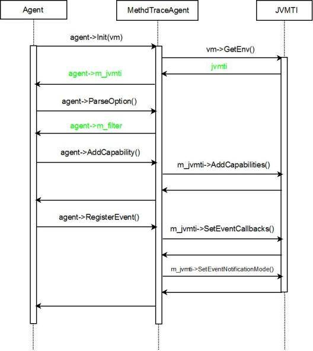
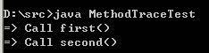
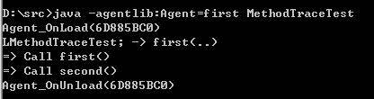

# JVMTI 和 Agent 实现
使用 JVMTI 编写用户自定义的 Java 调试和诊断程序

**标签:** Java,Java 平台

[原文链接](https://developer.ibm.com/zh/articles/j-lo-jpda2/)

吕晶, 邱小侠

发布: 2009-03-19

* * *

## Java 程序的诊断和调试

开发人员对 Java 程序的诊断和调试有许多不同种类、不同层次的需求，这就使得开发人员需要使用不同的工具来解决问题。比如，在 Java 程序运行的过程中，程序员希望掌握它总体的运行状况，这个时候程序员可以直接使用 JDK 提供的 jconsole 程序。如果希望提高程序的执行效率，开发人员可以使用各种 Java Profiler。这种类型的工具非常多，各有优点，能够帮助开发人员找到程序的瓶颈，从而提高程序的运行速度。开发人员还会遇到一些与内存相关的问题，比如内存占用过多，大量内存不能得到释放，甚至导致内存溢出错误（OutOfMemoryError）等等，这时可以把当前的内存输出到 Dump 文件，再使用堆分析器或者 Dump 文件分析器等工具进行研究，查看当前运行态堆（Heap）中存在的实例整体状况来诊断问题。所有这些工具都有一个共同的特点，就是最终他们都需要通过和虚拟机进行交互，来发现 Java 程序运行的问题。

已有的这些工具虽然强大易用，但是在一些高级的应用环境中，开发者常常会有一些特殊的需求，这个时候就需要定制工具来达成目标。 JDK 本身定义了目标明确并功能完善的 API 来与虚拟机直接交互，而且这些 API 能很方便的进行扩展，从而满足开发者各式的需求。在本文中，将比较详细地介绍 JVMTI，以及如何使用 JVMTI 编写一个定制的 Agent 。

##### Agent

Agent 即 JVMTI 的客户端，它和执行 Java 程序的虚拟机运行在同一个进程上，因此通常他们的实现都很紧凑，他们通常由另一个独立的进程控制，充当这个独立进程和当前虚拟机之间的中介，通过调用 JVMTI 提供的接口和虚拟机交互，负责获取并返回当前虚拟机的状态或者转发控制命令。

## JVMTI 的简介

JVMTI（JVM Tool Interface）是 Java 虚拟机所提供的 native 编程接口，是 JVMPI（Java Virtual Machine Profiler Interface）和 JVMDI（Java Virtual Machine Debug Interface）的更新版本。从这个 API 的发展历史轨迹中我们就可以知道，JVMTI 提供了可用于 debug 和 profiler 的接口；同时，在 Java 5/6 中，虚拟机接口也增加了监听（Monitoring），线程分析（Thread analysis）以及覆盖率分析（Coverage Analysis）等功能。正是由于 JVMTI 的强大功能，它是实现 Java 调试器，以及其它 Java 运行态测试与分析工具的基础。

JVMTI 并不一定在所有的 Java 虚拟机上都有实现，不同的虚拟机的实现也不尽相同。不过在一些主流的虚拟机中，比如 Sun 和 IBM，以及一些开源的如 Apache Harmony DRLVM 中，都提供了标准 JVMTI 实现。

JVMTI 是一套本地代码接口，因此使用 JVMTI 需要我们与 C/C++ 以及 JNI 打交道。事实上，开发时一般采用建立一个 Agent 的方式来使用 JVMTI，它使用 JVMTI 函数，设置一些回调函数，并从 Java 虚拟机中得到当前的运行态信息，并作出自己的判断，最后还可能操作虚拟机的运行态。把 Agent 编译成一个动态链接库之后，我们就可以在 Java 程序启动的时候来加载它（启动加载模式），也可以在 Java 5 之后使用运行时加载（活动加载模式）。

- -agentlib:agent-lib-name=options
- -agentpath:path-to-agent=options

## Agent 的工作过程

### 启动

Agent 是在 Java 虚拟机启动之时加载的，这个加载处于虚拟机初始化的早期，在这个时间点上：

- 所有的 Java 类都未被初始化；
- 所有的对象实例都未被创建；
- 因而，没有任何 Java 代码被执行；

但在这个时候，我们已经可以：

- 操作 JVMTI 的 Capability 参数；
- 使用系统参数；

动态库被加载之后，虚拟机会先寻找一个 Agent 入口函数：

```
JNIEXPORT jint JNICALL Agent_OnLoad(JavaVM *vm, char *options, void *reserved)

```

Show moreShow more icon

在这个函数中，虚拟机传入了一个 JavaVM 指针，以及命令行的参数。通过 JavaVM，我们可以获得 JVMTI 的指针，并获得 JVMTI 函数的使用能力，所有的 JVMTI 函数都通过这个 jvmtiEnv 获取，不同的虚拟机实现提供的函数细节可能不一样，但是使用的方式是统一的。

```
jvmtiEnv *jvmti;
(*jvm)->GetEnv(jvm, &jvmti, JVMTI_VERSION_1_0);

```

Show moreShow more icon

这里传入的版本信息参数很重要，不同的 JVMTI 环境所提供的功能以及处理方式都可能有所不同，不过它在同一个虚拟机中会保持不变（有心的读者可以去比较一下 JNI 环境）。命令行参数事实上就是上面启动命令行中的 options 部分，在 Agent 实现中需要进行解析并完成后续处理工作。参数传入的字符串仅仅在 Agent\_OnLoad 函数里有效，如果需要长期使用，开发者需要做内存的复制工作，同时在最后还要释放这块存储。另外，有些 JDK 的实现会使用 JAVA\_TOOL\_OPTIONS 所提供的参数，这个常见于一些嵌入式的 Java 虚拟机（不使用命令行）。需要强调的是，这个时候由于虚拟机并未完成初始化工作，并不是所有的 JVMTI 函数都可以被使用。

Agent 还可以在运行时加载，如果您了解 Java Instrument 模块（可以参考 [这篇文章](http://www.ibm.com/developerworks/cn/java/j-lo-jse61/) ），您一定对它的运行态加载有印象，这个新功能事实上也是 Java Agent 的一个实现。具体说来，虚拟机会在运行时监听并接受 Agent 的加载，在这个时候，它会使用 Agent 的：

```
JNIEXPORT jint JNICALL Agent_OnAttach(JavaVM* vm, char *options, void *reserved);

```

Show moreShow more icon

同样的在这个初始化阶段，不是所有的 JVMTI 的 Capability 参数都处于可操作状态，而且 options 这个 char 数组在这个函数运行之后就会被丢弃，如果需要，需要做好保留工作。

Agent 的主要功能是通过一系列的在虚拟机上设置的回调（callback）函数完成的，一旦某些事件发生，Agent 所设置的回调函数就会被调用，来完成特定的需求。

### 卸载

最后，Agent 完成任务，或者虚拟机关闭的时候，虚拟机都会调用一个类似于类析构函数的方法来完成最后的清理任务，注意这个函数和虚拟机自己的 VM\_DEATH 事件是不同的。

```
JNIEXPORT void JNICALL Agent_OnUnload(JavaVM *vm)

```

Show moreShow more icon

## JVMTI 的环境和错误处理

我们使用 JVMTI 的过程，主要是设置 JVMTI 环境，监听虚拟机所产生的事件，以及在某些事件上加上我们所希望的回调函数。

### JVMTI 环境

我们可以通过操作 jvmtiCapabilities 来查询、增加、修改 JVMTI 的环境参数。当然，对于每一个不同的虚拟机来说，基于他们的实现不尽相同，导致了 JVMTI 的环境也不一定一致。标准的 jvmtiCapabilities 定义了一系列虚拟机的功能，比如 can\_redefine\_any\_class 定义了虚拟机是否支持重定义类，can\_retransform\_classes 定义了是否支持在运行的时候改变类定义等等。如果熟悉 Java Instrumentation，一定不会对此感到陌生，因为 Instrumentation 就是对这些在 Java 层上的包装。对用户来说，这块最主要的是查看当前 JVMTI 环境，了解虚拟机具有的功能。要了解这个，其实很简单，只需通过对 jvmtiCapabilities 的一系列变量的考察就可以。

```
err = (*jvmti)->GetCapabilities(jvmti, &capa); // 取得 jvmtiCapabilities 指针。
if (err == JVMTI_ERROR_NONE) {
         if (capa.can_redefine_any_class) { ... }
         } // 查看是否支持重定义类

```

Show moreShow more icon

另外，虚拟机有自己的一些功能，一开始并未被启动，那么增加或修改 jvmtiCapabilities 也是可能的，但不同的虚拟机对这个功能的处理也不太一样，多数的虚拟机允许增改，但是有一定的限制，比如仅支持在 Agent\_OnLoad 时，即虚拟机启动时作出，它某种程度上反映了虚拟机本身的构架。开发人员无需要考虑 Agent 的性能和内存占用，就可以在 Agent 被加载的时候启用所有功能：

```
err = (*jvmti)->GetPotentialCapabilities(jvmti, &capa); // 取得所有可用的功能
if (err == JVMTI_ERROR_NONE) {
    err = (*jvmti)->AddCapabilities(jvmti, &capa);
    ...
}

```

Show moreShow more icon

最后我们要注意的是，JVMTI 的函数调用都有其时间性，即特定的函数只能在特定的虚拟机状态下才能调用，比如 SuspendThread（挂起线程）这个动作，仅在 Java 虚拟机处于运行状态（live phase）才能调用，否则导致一个内部异常。

### JVMTI 错误处理

JVMTI 沿用了基本的错误处理方式，即使用返回的错误代码通知当前的错误，几乎所有的 JVMTI 函数调用都具有以下模式：

```
jvmtiError err = jvmti->someJVMTImethod (somePara... );

```

Show moreShow more icon

其中 err 就是返回的错误代码，不同函数的错误信息可以在 Java 规范里查到。

## JVMTI 基本功能

JVMTI 的功能非常丰富，包含了虚拟机中线程、内存 / 堆 / 栈，类 / 方法 / 变量，事件 / 定时器处理等等 20 多类功能，下面我们介绍一下，并举一些简单列子。

### 事件处理和回调函数

从上文我们知道，使用 JVMTI 一个基本的方式就是设置回调函数，在某些事件发生的时候触发并作出相应的动作。因此这一部分的功能非常基本，当前版本的 JVMTI 提供了许多事件（Event）的回调，包括虚拟机初始化、开始运行、结束，类的加载，方法出入，线程始末等等。如果想对这些事件进行处理，我们需要首先为该事件写一个函数，然后在 jvmtiEventCallbacks 这个结构中指定相应的函数指针。比如，我们对线程启动感兴趣，并写了一个 HandleThreadStart 函数，那么我们需要在 Agent\_OnLoad 函数里加入：

```
jvmtiEventCallbacks eventCallBacks;
memset(&ecbs, 0, sizeof(ecbs)); // 初始化
eventCallBacks.ThreadStart = &HandleThreadStart; // 设置函数指针
...

```

Show moreShow more icon

在设置了这些回调之后，就可以调用下述方法，来最终完成设置。在接下来的虚拟机运行过程中，一旦有线程开始运行发生，虚拟机就会回调 HandleThreadStart 方法。

```
jvmti->SetEventCallbacks(eventCallBacks, sizeof(eventCallBacks));

```

Show moreShow more icon

设置回调函数的时候，开发者需要注意以下几点：

- 如同 Java 异常机制一样，如果在回调函数中自己抛出一个异常（Exception），或者在调用 JNI 函数的时候制造了一些麻烦，让 JNI 丢出了一个异常，那么任何在回调之前发生的异常就会丢失，这就要求开发人员要在处理错误的时候需要当心。
- 虚拟机不保证回调函数会被同步，换句话说，程序有可能同时运行同一个回调函数（比如，好几个线程同时开始运行了，这个 HandleThreadStart 就会被同时调用几次），那么开发人员在开发回调函数时需要处理同步的问题。

### 内存控制和对象获取

内存控制是一切运行态的基本功能。 JVMTI 除了提供最简单的内存申请和撤销之外（这块内存不受 Java 堆管理，开发人员需要自行进行清理工作，不然会造成内存泄漏），也提供了对 Java 堆的操作。众所周知，Java 堆中存储了 Java 的类、对象和基本类型（Primitive），通过对堆的操作，开发人员可以很容易的查找任意的类、对象，甚至可以强行执行垃圾收集工作。 JVMTI 中对 Java 堆的操作与众不同，它没有提供一个直接获取的方式（由此可见，虚拟机对对象的管理并非是哈希表，而是某种树 / 图方式），而是使用一个迭代器（iterater）的方式遍历：

```
jvmtiError FollowReferences(jvmtiEnv* env,
    jint heap_filter,
    jclass klass,
    jobject initial_object,// 该方式可以指定根节点
    const jvmtiHeapCallbacks* callbacks,// 设置回调函数
    const void* user_data)

```

Show moreShow more icon

或者

```
jvmtiError IterateThroughHeap(jvmtiEnv* env,
    jint heap_filter,
    jclass klass,
    const jvmtiHeapCallbacks* callbacks,
    const void* user_data)// 遍历整个 heap

```

Show moreShow more icon

在遍历的过程中，开发者可以设定一定的条件，比如，指定是某一个类的对象，并设置一个回调函数，如果条件被满足，回调函数就会被执行。开发者可以在回调函数中对当前传回的指针进行打标记（tag）操作——这又是一个特殊之处，在第一遍遍历中，只能对满足条件的对象进行 tag ；然后再使用 GetObjectsWithTags 函数，获取需要的对象。

```
jvmtiError GetObjectsWithTags(jvmtiEnv* env,
    jint tag_count,
    const jlong* tags, // 设定特定的 tag，即我们上面所设置的
    jint* count_ptr,
    jobject** object_result_ptr,
    jlong** tag_result_ptr)

```

Show moreShow more icon

如果你仅仅想对特定 Java 对象操作，应该避免设置其他类型的回调函数，否则会影响效率，举例来说，多增加一个 primitive 的回调函数，可能会使整个操作效率下降一个数量级。

### 线程和锁

线程是 Java 运行态中非常重要的一个部分，在 JVMTI 中也提供了很多 API 进行相应的操作，包括查询当前线程状态，暂停，恢复或者终端线程，还可以对线程锁进行操作。开发者可以获得特定线程所拥有的锁：

```
jvmtiError GetOwnedMonitorInfo(jvmtiEnv* env,
    jthread thread,
    jint* owned_monitor_count_ptr,
    jobject** owned_monitors_ptr)

```

Show moreShow more icon

也可以获得当前线程正在等待的锁：

```
jvmtiError GetCurrentContendedMonitor(jvmtiEnv* env,
    jthread thread,
    jobject* monitor_ptr)

```

Show moreShow more icon

知道这些信息，事实上我们也可以设计自己的算法来判断是否死锁。更重要的是，JVMTI 提供了一系列的监视器（Monitor）操作，来帮助我们在 native 环境中实现同步。主要的操作是构建监视器（CreateRawMonitor），获取监视器（RawMonitorEnter），释放监视器（RawMonitorExit），等待和唤醒监视器 (RawMonitorWait,RawMonitorNotify) 等操作，通过这些简单锁，程序的同步操作可以得到保证。

### 调试功能

调试功能是 JVMTI 的基本功能之一，这主要包括了设置断点、调试（step）等，在 JVMTI 里面，设置断点的 API 本身很简单：

```
jvmtiError SetBreakpoint(jvmtiEnv* env,
    jmethodID method,
    jlocation location)

```

Show moreShow more icon

jlocation 这个数据结构在这里代表的是对应方法方法中一个可执行代码的行数。在断点发生的时候，虚拟机会触发一个事件，开发者可以使用在上文中介绍过的方式对事件进行处理。

### JVMTI 数据结构

JVMTI 中使用的数据结构，首先也是一些标准的 JNI 数据结构，比如 jint，jlong ；其次，JVMTI 也定义了一些基本类型，比如 jthread，表示一个 thread，jvmtiEvent，表示 jvmti 所定义的事件；更复杂的有 JVMTI 的一些需要用结构体表示的数据结构，比如堆的信息（jvmtiStackInfo）。这些数据结构在文档中都有清楚的定义，本文就不再详细解释。

## 一个简单的 Agent 实现

下面将通过一个具体的例子，来阐述如何开发一个简单的 Agent 。这个 Agent 是通过 C++ 编写的（读者可以在最后下载到完整的代码），他通过监听 JVMTI\_EVENT\_METHOD\_ENTRY 事件，注册对应的回调函数来响应这个事件，来输出所有被调用函数名。有兴趣的读者还可以参照这个基本流程，通过 JVMTI 提供的丰富的函数来进行扩展和定制。

### Agent 的设计

具体实现都在 MethodTraceAgent 这个类里提供。按照顺序，他会处理环境初始化、参数解析、注册功能、注册事件响应，每个功能都被抽象在一个具体的函数里。

```
class MethodTraceAgent
{
    public:
        void Init(JavaVM *vm) const throw(AgentException);
        void ParseOptions(const char* str) const throw(AgentException);
        void AddCapability() const throw(AgentException);
        void RegisterEvent() const throw(AgentException);
        ...

    private:
        ...
        static jvmtiEnv * m_jvmti;
        static char* m_filter;
};

```

Show moreShow more icon

Agent\_OnLoad 函数会在 Agent 被加载的时候创建这个类，并依次调用上述各个方法，从而实现这个 Agent 的功能。

```
JNIEXPORT jint JNICALL Agent_OnLoad(JavaVM *vm, char *options, void *reserved)
{
    ...
    MethodTraceAgent* agent = new MethodTraceAgent();
    agent->Init(vm);
    agent->ParseOptions(options);
    agent->AddCapability();
    agent->RegisterEvent();
    ...
}

```

Show moreShow more icon

运行过程如图 1 所示：

##### 图 1\. Agent 时序图



### Agent 编译和运行

Agent 的编译非常简单，他和编译普通的动态链接库没有本质区别，只是需要将 JDK 提供的一些头文件包含进来。

- Windows:


    ```
    cl /EHsc -I${JAVA_HOME}\include\ -I${JAVA_HOME}\include\win32
    -LD MethodTraceAgent.cpp Main.cpp -FeAgent.dll

    ```


    Show moreShow more icon

- Linux:


    ```
    g++ -I${JAVA_HOME}/include/ -I${JAVA_HOME}/include/linux
    MethodTraceAgent.cpp Main.cpp -fPIC -shared -o libagent.so

    ```


    Show moreShow more icon


在附带的代码文件里提供了一个可运行的 Java 类，默认情况下运行的结果如下图所示：

##### 图 2\. 默认运行输出



现在，我们运行程序前告诉 Java 先加载编译出来的 Agent：

```
java -agentlib:Agent=first MethodTraceTest

```

Show moreShow more icon

这次的输出如图 3\. 所示：

##### 图 3\. 添加 Agent 后输出



可以当程序运行到到 MethodTraceTest 的 first 方法是，Agent 会输出这个事件。” first ”是 Agent 运行的参数，如果不指定话，所有的进入方法的触发的事件都会被输出，如果读者把这个参数去掉再运行的话，会发现在运行 main 函数前，已经有非常基本的类库函数被调用了。

## 结束语

Java 虚拟机通过 JVMTI 提供了一整套函数来帮助用户检测管理虚拟机运行态，它主要通过 Agent 的方式实现与用户的互操作。本文简单介绍了 Agent 的实现方式和 JVMTI 的使用。通过 Agent 这种方式不仅仅用户可以使用，事实上，JDK 里面的很多工具，比如 Instrumentation 和 JDI, 都采用了这种方式。这种方式无需把这些工具绑定在虚拟机上，减少了虚拟机的负荷和内存占用。在下一篇中，我们将介绍 JDWP 如何采用 Agent 的方式，定义自己的一套通信原语，并通过多种通信方式，对外提供基本调试功能。

## 获取源码

[source.zip](http://www.ibm.com/developerworks/cn/java/j-lo-jpda2/source.zip): 本文用到的 C++ 和 Java 源码