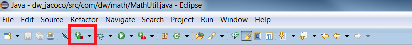
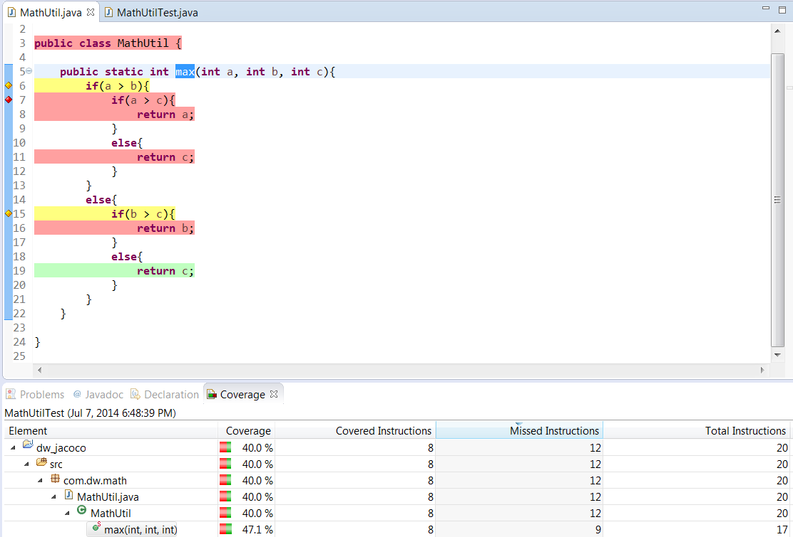
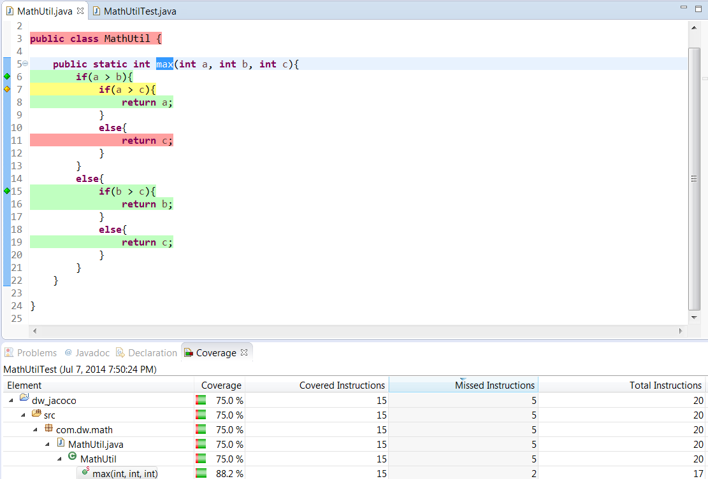
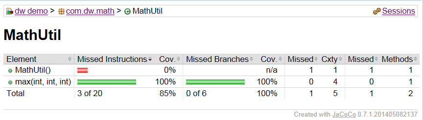

# JaCoCo：分析单元测试覆盖率的利器
使用 JaCoCo 分析 Java 项目的单元测试覆盖率并使用 EclEMMA 直观地查看单元测试的覆盖情况

**标签:** Java

[原文链接](https://developer.ibm.com/zh/articles/j-lo-jacoco/)

王群峰

发布: 2014-08-11

* * *

## 前言

随着敏捷开发的流行，编写单元测试已经成为业界共识。但如何来衡量单元测试的质量呢？有些管理者片面追求单元测试的数量，导致底下的开发人员投机取巧，编写出大量的重复测试，数量上去了，质量却依然原地踏步。相比单纯追求单元测试的数量，分析单元测试的代码覆盖率是一种更为可行的方式。JaCoCo（Java Code Coverage）就是一种分析单元测试覆盖率的工具，使用它运行单元测试后，可以给出代码中哪些部分被单元测试测到，哪些部分没有没测到，并且给出整个项目的单元测试覆盖情况百分比，看上去一目了然。EclEmma 是基于 JaCoCo 的一个 Eclipse 插件，开发人员可以方便的和其交互。因此，本文先从 EclEmma 入手，给读者一个直观的体验。

## 使用 EclEmma 在 Eclipse 中查看单元测试覆盖率

EclEmma 是基于 JaCoCo 的 Eclipse 插件，使用它，开发人员可以直观地看到单元测试的覆盖情况。

### 安装 EclEmma

打开 Eclipse 的软件市场，在其中搜索 EclEmma，找到后完成安装，如下图所示：

##### 图 1\. 安装 EclEmma


安装完成后，Eclipse 的工具条里会多出下面这样一个图标：

##### 图 2\. Coverage 图标



### 分析单元测试覆盖率

成功安装 EclEmma 后，就可以试着用它来分析项目的单元测试覆盖率了。为了方便演示，我们使用 Eclipse 创建了一个标准 Java 工程。其中包含一个数学工具类，用来计算三个数中的最大值，代码如下：

##### 清单 1\. 数学工具类

```
package com.dw.math;
public class MathUtil {
public static int max(int a, int b, int c){
       if(a > b){
           if(a > c){
               return a;
           }else{
               return c;
           }
        }else{
           if(b > c){
               return b;
           }else{
               return c;
           }
        }
    }
}

```

Show moreShow more icon

可以看到，这里的算法稍微有点复杂，使用到了多个条件判断分支，因此，特别适合为其编写单元测试。第一个版本的单元测试如下：

##### 清单 2\. 第一个版本的单元测试

```
package com.dw.math;
import static org.junit.Assert.*;
import org.junit.Test;
public class MathUtilTest {
    @Test
    public void test_max_1_2_3() {
          assertEquals(3, MathUtil.max(1, 2, 3));
    }
}

```

Show moreShow more icon

试着运行一下单元测试覆盖率分析工具：40.0%！似乎不太理想。展开分析报告，双击后在编辑器里可以看到覆盖情况被不同的颜色标识出来，其中绿颜色表示代码被单元测试覆盖到，黄色表示部分覆盖，红色则表示完全没有覆盖到，如下图所示：

##### 图 3\. 单元测试覆盖率报告



让我们尝试多加一些单元测试，来改善这种情况，请看下面第二个版本的单元测试：

##### 清单 3\. 第二个版本的单元测试

```
package com.dw.math;
import static org.junit.Assert.*;
import org.junit.Test;
public class MathUtilTest {
@Test
public void test_max_1_2_3() {
      assertEquals(3, MathUtil.max(1, 2, 3));
}
@Test
public void test_max_10_20_30() {
      assertEquals(30, MathUtil.max(10, 20, 30));
}
@Test
public void test_max_100_200_300() {
      assertEquals(300, MathUtil.max(100, 200, 300));
}
}

```

Show moreShow more icon

测试覆盖率还是 40.0%！虽然我们额外再加了两个测试，但覆盖率没有半点提升，这些单元测试其实是重复的，它们在重复测试同一段代码。如果单纯追求单元测试的数量，那么这无疑会给管理者造成错觉，他们觉得单元测试的数量增加了，软件的质量更有保证了；而对于那些喜欢偷懒的程序员，也蒙混过关，但却给软件质量埋下了隐患。让我们删掉这些重复的单元测试，重新思考一下怎么测试这个方法。

首先我们要测试正常情况，这其中又包含 3 种情况：第一个参数最大，第二个参数最大，以及最后一个参数最大。然后我们还需测试几种特殊情况，比如三个参数相同，三个参数中，其中两个相同。让我们照此思路重新编写单元测试：

##### 清单 4\. 第三个版本的单元测试

```
package com.dw.math;
import static org.junit.Assert.*;
import org.junit.Test;
public class MathUtilTest {
@Test
public void test_max_1_2_3() {
      assertEquals(3, MathUtil.max(1, 2, 3));
}
@Test
public void test_max_1_3_2() {
      assertEquals(3, MathUtil.max(1, 3, 2));
}
@Test
public void test_max_3_2_1() {
      assertEquals(3, MathUtil.max(3, 2, 1));
}
@Test
public void test_max_0_0_0(){
      assertEquals(0, MathUtil.max(0, 0, 0));
}
@Test
public void test_max_0_1_0(){
      assertEquals(1, MathUtil.max(0, 1, 0));
}
}

```

Show moreShow more icon

再次运行单元测试分析工具：75.0%！这次比以前有了很大提升，但是结果还不能令人满意，打开分析报告可以看到，有一个分支还是没有覆盖到，如图所示：

##### 图 4\. 单元测试覆盖率报告



阅读代码可以看出，这种情况是指第一个参数大于第二个参数，却小于第三个参数，因此我们再增加一个单元测试：

##### 清单 5\. 再增加一个单元测试

```
@Test
public void test_max_2_1_3() {
    assertEquals(3, MathUtil.max(2, 1, 3));
}

```

Show moreShow more icon

再运行一遍单元测试分析工具：100.0%！终于我们的单元测试达到了全覆盖，这样我们对自己开发的代码更有信心了。当然，我们在这里并不是为了单纯的追求这个数字，在增加单元测试覆盖率的诱导下，我们重新理清了测试的步骤，写出了更有意义、更全面的单元测试。而且根据单元测试分析工具给的反馈，我们还发现了先前没有想到的情形。因此，单元测试的覆盖率并不只是一个为了取悦管理者的数据，它实实在在地帮助我们改善了代码的质量，增加了我们对所编写代码的信心。

## 给管理者的单元测试覆盖率报告

管理者天生喜欢阅读报告。他们不会屈尊坐在你的办公桌前，让你向他展示 Eclipse 中这一片花花绿绿的东西。而且这份报告对他们至关重要，他们需要用它向上级汇报；年底回顾时，他们也可以兴奋地宣称产品的单元测试覆盖率增加了多少。作为一名开发人员，我们很大一部分工作量就在于满足管理者的这种需求。因此，本节我们讨论如何将 JaCoCo 集成到 Ant 脚本中，生成漂亮的单元测试覆盖率报告。

### 准备工作

在集成 JaCoCo 前，必须先确保你的 Java 工程有一个可执行的 Ant 构建脚本。一个简单的 Ant 构建脚本一般会执行如下任务：编译（包括编译工程代码和测试代码）、打包和执行单元测试。下面是本文示例 Java 项目所用的 Ant 构建脚本，读者可结合自己的项目及文件路径，在此基础之上进行修改。

##### 清单 6\. build.xml

```
<project name="math" basedir="." default="junit">
<!--预定义的属性和 classpath -->
<property name="src.dir" value="src" />
<property name="test.dir" value="test" />
<property name="build.dir" value="build" />
<property name="classes.dir" value="${build.dir}/classes" />
<property name="tests.dir" value="${build.dir}/tests" />
<property name="jar.dir" value="${build.dir}/jar" />
<property name="lib.dir" value="lib" />

<path id="classpath">
     <fileset dir="${lib.dir}" includes="**/*.jar" />
</path>

<!--清除上次构建 -->
<target name="clean">
      <delete dir="${build.dir}" />
</target>

<!--编译代码，包括单元测试 -->
<target name="compile" depends="clean">
     <mkdir dir="${classes.dir}" />
     <mkdir dir="${tests.dir}" />
     <javac srcdir="${src.dir}" destdir="${classes.dir}" />
     <javac srcdir="${test.dir}" destdir="${tests.dir}">
     <classpath>
     <path refid="classpath" />
     <path location="${classes.dir}" />
     </classpath>
     </javac>
</target>

<!--打包 -->
<target name="jar" depends="compile">
     <mkdir dir="${jar.dir}" />
     <jar destfile="${jar.dir}/${ant.project.name}.jar" basedir="${classes.dir}">
     </jar>
</target>

<!--运行单元测试 -->
<target name="junit" depends="jar">
     <junit printsummary="yes">
       <classpath>
       <path refid="classpath"/>
       <path location="${classes.dir}" />
       <path location="${tests.dir}" />
       </classpath>
       <batchtest fork="yes">
       <fileset dir="${test.dir}" includes="**/*Test.java"/>
       </batchtest>
     </junit>
</target>
</project>

```

Show moreShow more icon

### 集成 JaCoCo

首先需要从 然后就是使用 [JaCoCo 官网下载](http://www.eclemma.org/jacoco/) 需要的版本，然后将下载得到的压缩文件解压，将其中的 jacocoant.jar 拷贝至 Java 工程下存放第三方 jar 包的目录，在示例工程里，我有一个和 src 平级的 lib 目录，jacocoant.jar 就放到了这个目录底下，读者可根据自己的项目组织结构做相应调整。然后我们需要在 Ant 构建脚本中定义新的任务：

##### 清单 7\. 定义新的构建任务

```
<taskdef uri="antlib:org.jacoco.ant" resource="org/jacoco/ant/antlib.xml">
<classpath refid="classpath" />
</taskdef>

```

Show moreShow more icon

现在就可以在 Ant 构建脚本中使用 JaCoCo 了。需要注意的是，为了避免命名冲突，需要给 Ant 构建脚本加入新的 XML 命名空间：

##### 清单 8\. 加入新的 JaCoCo 命名空间

```
<project name="math" basedir="." xmlns:jacoco="antlib:org.jacoco.ant" default="junit">

```

Show moreShow more icon

我们主要使用 JaCoCo 的两个任务：首先是 `jacoco:coverage` ，用来生成单元测试覆盖率数据，这是一个二进制文件，为了生成从该文件生成报表，我们还要调用另外一个任务 `jacoco:report` ，它的输入为 `jacoco:coverage` 生成的二进制文件，输出报表。报表有多种格式可选，可以是 HTML、XML、CSV 等。具体的脚本如下：

##### 清单 9\. 使用 JaCoCo 生成测试覆盖率和报表

```
<jacoco:coverage destfile="${build.dir}/jacoco.exec">
<junit fork="true" forkmode="once" printsummary="yes">
     <classpath>
         <path refid="classpath" />
         <path location="${classes.dir}" />
         <path location="${tests.dir}" />
     </classpath>
     <batchtest fork="yes">
          <fileset dir="${test.dir}" includes="**/*Test.java"/>
     </batchtest>
</junit>
</jacoco:coverage>

<jacoco:report>
<executiondata>
        <file file="${build.dir}/jacoco.exec"/>
</executiondata>
<structure name="dw demo">
      <classfiles>
           <fileset dir="${classes.dir}"/>
      </classfiles>
      <sourcefiles encoding="UTF-8">
           <fileset dir="${src.dir}"/>
      </sourcefiles>
</structure>
<html destdir="${build.dir}"/>
</jacoco:report>

```

Show moreShow more icon

JaCoCo 的任务定义非常清晰，在这里略作说明。首先需要将原来的 `junit` 任务嵌入 `jacoco:coverage` ，而且需要指定 `fork="true"` ，代表单元测试需要另起一个 JVM 执行，否则 JaCoCo 就会执行失败。 `destfile="${build.dir}/jacoco.exec"` 指定生成的测试覆盖率文件输出到什么地方，后面生成报告的时候需要输入该文件的地址。然后就是使用 `jacoco:report` 生成报告，指定前面任务生成的单元测试覆盖率文件、编译好的类文件以及源代码，最后选择一种格式，这里使用 html，生成报告。打开报告的存放路径，就可以看到如下所示的单元测试覆盖率报告：

##### 图 5\. HTML 版的单元测试覆盖率报告



## 和同类产品比较

市面上流行的单元测试覆盖率工具还有 [Clover](https://www.atlassian.com/software/clover/overview) 和 [Cobertura](http://cobertura.github.io/cobertura/) 。和它们相比，JaCoCo 有如下优势：

1. JaCoCo 拥有友好的授权形式。JaCoCo 使用了 Eclipse Public License，方便个人用户和商业用户使用。而 Clover 对于商业用户是收费的。
2. JaCoCo 被良好地集成进各种工具中。在 Java 社区里，很多流行的工具都可以集成 JaCoCo，比如 SonarQube、Jenkins、Netbeans、Eclipse、IntelliJ IDEA、Gradle 等。
3. JaCoCo 社区非常活跃，它是目前唯一支持 Java 8 的单元测试覆盖率工具。而且关于 JaCoCo 的文档相对较多，降低了学习门槛。

## 结束语

本文为大家介绍了如何使用 JaCoCo 分析项目的单元测试覆盖率，文章先从 JaCoCo 的 Eclipse 插件 EclEmma 开始，直观地介绍了如何一步步提高单元测试质量，最终达到对代码的全覆盖；然后为大家介绍了如何将 JaCoCo 集成到 Ant 构建脚本中，生成漂亮的单元测试覆盖率报告。但是使用 JaCoCo 只是第一步，重要的是开发人员能够根据工具所给的反馈，不断改进自己的单元测试，写出高质量的代码。

## 相关主题

- [Unit Testing In The Real World](https://jazz.net/wiki/bin/view/Main/UnitTestingInTheRealWorld)
- [Java Code Coverage for Eclipse](https://www.eclemma.org/)
- [Java Code Coverage Tools](https://en.wikipedia.org/wiki/JaCoCo)
- [JaCoCo Ant Tasks](https://www.eclemma.org/jacoco/trunk/doc/ant.html)
- [Creating Code Coverage Reports for Unit And Integration Tests with The JaCoCo Maven Plugin](https://www.petrikainulainen.net/programming/maven/creating-code-coverage-reports-for-unit-and-integration-tests-with-the-jacoco-maven-plugin/)
- [JaCoCo 示例构建脚本](https://www.eclemma.org/jacoco/trunk/doc/examples/build/build.xml)
- [简易 Ant 教程](https://ant.apache.org/manual/tutorial-HelloWorldWithAnt.html)