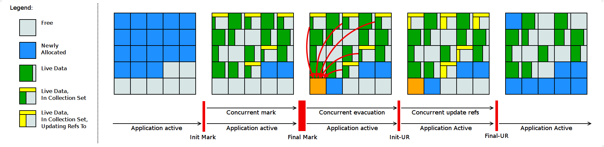
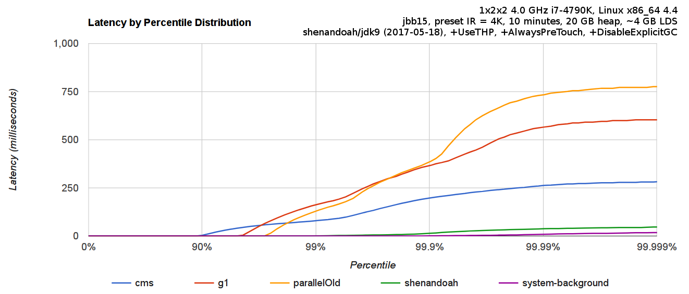

# Java 12 新特性概述
快速了解 Java 12 带来的变化

**标签:** Java,OpenJDK

[原文链接](https://developer.ibm.com/zh/articles/the-new-features-of-java-12/)

李 林锋

发布: 2019-06-05

* * *

Java 12 已如期于 3 月 19 日正式发布，此次更新是 Java 11 这一长期支持版本发布之后的一次常规更新，截至目前，Java 半年为发布周期，并且不会跳票承诺的发布模式，已经成功运行一年多了。通过这样的方式，Java 开发团队能够将一些重要特性尽早的合并到 Java Release 版本中，以便快速得到开发者的反馈，避免出现类似 Java 9 发布时的两次延期的情况。

Java 12 早在 2018 年 12 月便进入了 Rampdown Phase One 阶段，这意味着该版本所有新的功能特性被冻结，不会再加入更多的 JEP。该阶段将持续大概一个月，主要修复 P1-P3 级错误。主要时间节点如下：

- 2018-12-13 Rampdown 第一阶段 ( 从主线分离 )
- 2019-01-17 Rampdown 第二阶段
- 2019-02-07 发布候选阶段
- 2019-03-19 正式发布

本文主要针对 Java 12 中的新特性展开介绍，让您快速了解 Java 12 带来的变化。

## Shenandoah：一个低停顿垃圾收集器（实验阶段）

Java 12 中引入一个新的垃圾收集器：Shenandoah，它是作为一中低停顿时间的垃圾收集器而引入到 Java 12 中的，其工作原理是通过与 Java 应用程序中的执行线程同时运行，用以执行其垃圾收集、内存回收任务，通过这种运行方式，给虚拟机带来短暂的停顿时间。

Shenandoah 垃圾回收器是 Red Hat 在 2014 年宣布进行的一项垃圾收集器研究项目，旨在针对 JVM 上的内存收回实现低停顿的需求。该设计将与应用程序线程并发，通过交换 CPU 并发周期和空间以改善停顿时间，使得垃圾回收器执行线程能够在 Java 线程运行时进行堆压缩，并且标记和整理能够同时进行，因此避免了在大多数 JVM 垃圾收集器中所遇到的问题。

据 Red Hat 研发 Shenandoah 团队对外宣称，Shenandoah 垃圾回收器的暂停时间与堆大小无关，这意味着无论将堆设置为 200 MB 还是 200 GB，都将拥有一致的系统暂停时间，不过实际使用性能将取决于实际工作堆的大小和工作负载。

##### 图 1\. Shenandoah GC 工作周期如下所示



_本图片引用自：_ [_Shenandoah GC_](https://wiki.openjdk.java.net/display/shenandoah/Main#Main-Overview)

上图对应工作周期如下：

1. Init Mark 启动并发标记 阶段
2. 并发标记遍历堆阶段
3. 并发标记完成阶段
4. 并发整理回收无活动区域阶段
5. 并发 Evacuation 整理内存区域阶段
6. Init Update Refs 更新引用初始化 阶段
7. 并发更新引用阶段
8. Final Update Refs 完成引用更新阶段
9. 并发回收无引用区域阶段

需要了解不是唯有 GC 停顿可能导致常规应用程序响应时间比较长。具有较长的 GC 停顿时间会导致系统响应慢的问题，但响应时间慢并非一定是 GC 停顿时间长导致的，队列延迟、网络延迟、其他依赖服务延迟和操作提供调度程序抖动等都可能导致响应变慢。使用 Shenandoah 时需要全面了解系统运行情况，综合分析系统响应时间。各种 GC 工作负载对比如下所示：

##### 图 2\. 各种 GC 工作负载对比



_本图片引用自：_ [_Shenandoah GC_](https://wiki.openjdk.java.net/display/shenandoah#Main-PerformanceAnalysis)

下面推荐几个配置或调试 Shenandoah 的 JVM 参数:

- `-XX:+AlwaysPreTouch` ：使用所有可用的内存分页，减少系统运行停顿，为避免运行时性能损失。
- `-Xmx == -Xmsv` ：设置初始堆大小与最大值一致，可以减轻伸缩堆大小带来的压力，与 `AlwaysPreTouch` 参数配合使用，在启动时提交所有内存，避免在最终使用中出现系统停顿。
- `-XX:+ UseTransparentHugePages` ：能够大大提高大堆的性能，同时建议在 Linux 上使用时将 `/sys/kernel/mm/transparent_hugepage/enabled` 和 `/sys/kernel/mm/transparent_hugepage/defragv` 设置为： `madvise` ，同时与 `AlwaysPreTouch` 一起使用时， `init` 和 `shutdownv` 速度会更快，因为它将使用更大的页面进行预处理。
- `-XX:+UseNUMA` ：虽然 `Shenandoah` 尚未明确支持 NUMA（Non-Uniform Memory Access），但最好启用此功能以在多插槽主机上启用 NUMA 交错。与 `AlwaysPreTouch` 相结合，它提供了比默认配置更好的性能。
- `-XX:+DisableExplicitGC` ：忽略代码中的 `System.gc()` 调用。当用户在代码中调用 `System.gc()` 时会强制 Shenandoah 执行 STW Full GC ，应禁用它以防止执行此操作，另外还可以使用 `-XX:+ExplicitGCInvokesConcurrent` ，在 调用 `System.gc()` 时执行 CMS GC 而不是 Full GC，建议在有 `System.gc()` 调用的情况下使用。

不过目前 Shenandoah 垃圾回收器还被标记为实验项目，需要使用参数： `- XX:+UnlockExperimentalVMOptions` 启用。更多有关如何配置、调试 Shenandoah 的信息，请参阅 [henandoah wiki](https://wiki.openjdk.java.net/display/shenandoah) 。

## 增加一套微基准套件

Java 12 中添加一套新的基本的微基准测试套件，该套微基准测试套件基于 JMH（Java Microbenchmark Harness），使开发人员可以轻松运行现有的微基准测试并创建新的基准测试，其目标在于提供一个稳定且优化过的基准，其中包括将近 100 个基准测试的初始集合，并且能够轻松添加新基准、更新基准测试和提高查找已有基准测试的便利性。

微基准套件与 JDK 源代码位于同一个目录中，并且在构建后将生成单个 Jar 文件。但它是一个单独的项目，在支持构建期间不会执行，以方便开发人员和其他对构建微基准套件不感兴趣的人在构建时花费比较少的构建时间。

要构建微基准套件，用户需要运行命令： `make build-microbenchmark` ，类似的命令还有： `make test TEST="micro:java.lang.invoke"` 将使用默认设置运行 `java.lang.invoke` 相关的微基准测试。关于配置本地环境可以参照文档 `docs/testing.md|html` 。

## Switch 表达式扩展（预览功能）

Java 11 以及之前 Java 版本中的 Switch 语句是按照类似 C、C++ 这样的语言来设计的，在默认情况下支持 `fall-through` 语法。虽然这种传统的控制流通常用于编写低级代码，但 Switch 控制语句通常运用在高级别语言环境下的，因此其容易出错性掩盖其灵活性。

在 Java 12 中重新拓展了 Switch 让它具备了新的能力，通过扩展现有的 Switch 语句，可将其作为增强版的 Switch 语句或称为 “Switch 表达式”来写出更加简化的代码。

Switch 表达式也是作为预览语言功能的第一个语言改动被引入新版 Java 中来的，预览语言功能的想法是在 2018 年初被引入 Java 中的，本质上讲，这是一种引入新特性的测试版的方法。通过这种方式，能够根据用户反馈进行升级、更改，在极端情况下，如果没有被很好的接纳，则可以完全删除该功能。预览功能的关键在于它们没有被包含在 Java SE 规范中。

在 Java 11 以及之前版本中传统形式的 Switch 语句写法如下：

##### 清单 1\. Switch 语句示例

```
int dayNumber;
switch (day) {
    case MONDAY:
    case FRIDAY:
    case SUNDAY:
        dayNumber = 6;
        break;
    case TUESDAY:
        dayNumber = 7;
        break;
    case THURSDAY:
    case SATURDAY:
        dayNumber = 8;
        break;
    case WEDNESDAY:
        dayNumber = 9;
        break;
    default:
        throw new IllegalStateException("Huh? " + day);
}

```

Show moreShow more icon

上面代码中多处出现 break 语句，显得代码比较冗余，同时如果某处漏写一段 break 语句，将导致程序一直向下穿透执行的逻辑错误，出现异常结果，同时这种写法比较繁琐，也容易出问题。

换做 Java 12 中的 Switch 表达式，上述语句写法如下：

##### 清单 2\. Switch 表达式示例

```
int dayNumber = switch (day) {
    case MONDAY, FRIDAY, SUNDAY -> 6;
    case TUESDAY                -> 7;
    case THURSDAY, SATURDAY     -> 8;
    case WEDNESDAY              -> 9;
    default                      -> throw new IllegalStateException("Huh? " + day);
}

```

Show moreShow more icon

使用 Java 12 中 Switch 表达式的写法，省去了 break 语句，避免了因少些 break 而出错，同时将多个 case 合并到一行，显得简洁、清晰也更加优雅的表达逻辑分支，其具体写法就是将之前的 case 语句表成了： `case L ->` ，即如果条件匹配 case L，则执行 标签右侧的代码 ，同时标签右侧的代码段只能是表达式、代码块或 throw 语句。为了保持兼容性，case 条件语句中依然可以使用字符 `:` ，这时 fall-through 规则依然有效的，即不能省略原有的 break 语句，但是同一个 Switch 结构里不能混用 `->` 和 `:` ，否则会有编译错误。并且简化后的 Switch 代码块中定义的局部变量，其作用域就限制在代码块中，而不是蔓延到整个 Switch 结构，也不用根据不同的判断条件来给变量赋值。

Java 11 以及之前版本中，Switch 表达式支持下面类型： byte、char、short、int、Byte、Character、Short、Integer、enum、tring，在未来的某个 Java 版本有可能会允许支持 float、double 和 long （以及上面类型的封装类型）。

## 引入 JVM 常量 API

Java 12 中引入 JVM 常量 API，用来更容易地对关键类文件 (key class-file) 和运行时构件（artefact）的名义描述 (nominal description) 进行建模，特别是对那些从常量池加载的常量，这是一项非常技术性的变化，能够以更简单、标准的方式处理可加载常量。

此项改进主要在新的 `java.lang.invoke.constant` 包中定义了一系列基于值的符号引用类型，能够描述每种可加载常量。符号引用以纯粹 nominal 的形式描述可加载常量，与类加载或可访问 性上下文分开。同时有些类可以作为自己的符号引用（例如 String），而对于可链接常量，另外定义了一系列符号引用类型，具体包括： ClassDesc (Class 的可加载常量标称描述符) ，MethodTypeDesc(方法类型常量标称描述符) ，MethodHandleDesc (方法句柄常量标称描述符) 和 DynamicConstantDesc (动态常量标称描述符) ，它们包含描述这些常量的 nominal 信息。

## 改进 AArch64 实现

Java 12 中将只保留一套 AArch64 实现，删除所有与 arm64 实现相关的代码，只保留 32 位 ARM 端口和 64 位 aarch64 的端口。删除此套实现将允许所有开发人员将目标集中在剩下的这个 64 位 ARM 实现上，消除维护两套端口所需的重复工作。

当前 Java 11 中存在两套 64 位 AArch64 端口，它们主要存在于 `src/hotspot/cpu/arm` 和 `open/src/hotspot/cpu/aarch64` 目录中。这两套代码中都实现了 AArch64，Java 12 中将删除目录 `open/src/hotspot/cpu/arm` 中关于 64-bit 的这套实现，只保留其中有关 32-bit 的实现，余下目录的 `open/src/hotspot/cpu/aarch64` 代码部分就成了 AArch64 的默认实现。

## 使用默认类数据共享（CDS）存档

类数据共享机制 (Class Data Sharing ，简称 CDS) ，允许将一组类预处理为共享归档文件，以便在运行时能够进行内存映射以减少 Java 程序的启动时间，当多个 Java 虚拟机（JVM）共享相同的归档文件时，还可以减少动态内存的占用量，同时减少多个虚拟机在同一个物理或虚拟的机器上运行时的资源占用。

自 Java 8 以来，在基本 CDS 功能上进行了许多增强、改进，启用 CDS 后应用的启动时间和内存占用量显着减少。使用 Java 11 早期版本在 64 位 Linux 平台上运行 HelloWorld 进行测试，测试结果显示启动时间缩短有 32 ％，同时在其他 64 位平台上，也有类似或更高的启动性能提升。

Java 12 针对 64 位平台下的 JDK 构建过程进行了增强改进，使其默认生成类数据共享（CDS）归档，以进一步达到改进应用程序的启动时间的目的，同时也避免了需要手动运行： `-Xshare:dump` 的需要，修改后的 JDK 将在 `lib/server` 目录中保留构建时生成的 CDS 存档。

当然如果需要，也可以添加其他 GC 参数，来调整堆大小等，以获得更优的内存分布情况，同时用户也可以像之前一样创建自定义的 CDS 存档文件。

## 改善 G1 垃圾收集器，使其能够中止混合集合

G1 是垃圾收集器，设计用于具有大量内存的多处理器机器，提高了垃圾回收效率。该垃圾收集器 设计的主要目标之一是满足用户设置的预期的 JVM 停顿时间，G1 采用一个高级分析引擎来选择在收集期间要处理的工作量，此选择过程的结果是一组称为 GC 回收集的区域。一旦收集器确定了 GC 回收集 并且 GC 回收、整理工作已经开始，则 G1 收集器必须完成收集集合集的所有区域中的所有活动对象之后才能停止；但是如果收集器选择过大的 GC 回收集，可能会导致 G1 回收器停顿时间超过预期时间。

Java 12 中将把 GC 回收集（混合收集集合）拆分为必需和可选两部分，使 G1 垃圾回收器能中止垃圾回收过程。其中必需处理的部分包括 G1 垃圾收集器不能递增处理的 GC 回收集的部分（如：年轻代），同时也可以包含老年代以提高处理效率。将 GC 回收集拆分为必需和可选部分时，需要为可选 GC 回收集部分维护一些其他数据，这会产生轻微的 CPU 开销，但小于 1 ％的变化，同时在 G1 回收器处理 GC 回收集期间，本机内存使用率也可能会增加，使用上述情况只适用于包含可选 GC 回收部分的 GC 混合回收集合。

在 G1 垃圾回收器完成收集需要必需回收的部分之后，便开始收集可选的部分，如果还有时间的话，但是粗粒度的处理，可选部分的处理粒度取决于剩余的时间，一次只能处理可选部分的一个子集区域。在完成可选收集部分的收集后，G1 垃圾回收器可以根据剩余时间决定是否停止收集。如果在处理完 必需处理的 部分后，属于时间不足，总时间花销接近预期时间，G1 垃圾回收器也可以中止可选部分的回收以达到满足预期停顿时间的目标。

## 增强 G1 垃圾收集器，使其能自动返回未用堆内存给操作系统

上节中介绍了 Java 12 中增强了 G1 垃圾收集器关于混合收集集合的处理策略，这节主要介绍在 Java 12 中同时也对 G1 垃圾回收器进行了改进，使其能够在空闲时自动将 Java 堆内存返还给操作系统，这也是 Java 12 中的另外一项重大改进。

目前 Java 11 版本中包含的 G1 垃圾收集器 暂时无法及时将已提交的 Java 堆内存返回给操作系统， G1 垃圾收集器仅在进行完整 GC (Full GC) 或并发处理周期时才能将 Java 堆返回内存。由于 G1 回收器尽可能避免完整 GC，并且只触发基于 Java 堆占用和分配活动的并发周期，因此在许多情况下 G 1 垃圾回收器不能回收 Java 堆内存，除非有外部强制执行。

在使用云平台的容器环境中，这种不利之处特别明显。即使在虚拟机不活动，但如果仍然使用其分配的内存资源，哪怕是其中的一小部分，G1 回收器也仍将保留所有已分配的 Java 堆内存。而这将导致用户需要始终为所有资源付费，哪怕是实际并未用到，而云提供商也无法充分利用其硬件。如果在次期间虚拟机能够检测到 Java 堆内存的实际使用情况，并在利用空闲时间自动将 Java 堆内存返还，则两者都将受益。

为了尽可能的向操作系统返回空闲内存，G1 垃圾收集器将在应用程序不活动期间定期生成或持续循环检查整体 Java 堆使用情况，以便 G 1 垃圾收集器能够更及时的将 Java 堆中不使用内存部分返还给操作系统。对于长时间处于空闲状态的应用程序，此项改进将使 JVM 的内存利用率更加高效。

如果应用程序为非活动状态，在下面两种情况下，G1 回收器会触发定期垃圾收集：

- 自上次垃圾回收完成 以来已超过 `G1PeriodicGCInterva` l 毫秒， 并且此时没有正在进行的垃圾回收任务。如果 `G1PeriodicGCInterval` 值为零表示禁用快速回收内存的定期垃圾收集。
- 应用所在主机系统上执行方法 `getloadavg()` ，一分钟内系统返回的平均负载值低于 `G1PeriodicGCSystemLoadThreshold` 。如果 `G1PeriodicGCSystemLoadThreshold` 值为零，则此条件不生效。

如果不满足上述条件中的任何一个，则取消当期的定期垃圾回收。等一个 `G1PeriodicGCInterval` 时间周期后，将重新考虑是否执行定期垃圾回收。

G1 定期垃圾收集的类型根据 `G1PeriodicGCInvokesConcurrent` 参数的值确定：如果设置值了，G1 垃圾回收器将继续上一个或者启动一个新并发周期；如果没有设置值，则 G1 回收器将执行一个完整的 GC。在每次一次 GC 回收末尾，G1 回收器将调整当前的 Java 堆大小，此时便有可能会将未使用内存返还给操作系统。新的 Java 堆内存大小根据现有配置确定，具体包括下列配置： `- XX:MinHeapFreeRatio` 、 `-XX:MaxHeapFreeRatio` 、 `-Xms` 、 `-Xmx` 。

默认情况下，G1 回收器在定期垃圾回收期间新启动或继续上一轮并发周期，将最大限度地减少应用程序的中断。如果定期垃圾收集严重影响程序执行，则需要考虑整个系统 CPU 负载，或让用户禁用定期垃圾收集。

## 结束语

自上次 Java 11 发布后，很快我们又迎来了 Java 12 版本的更新。Java 12 版本虽然是非 LTS 版本，但是这次更新也带来了不少 JVM、GC 功能增强、改进，本文主要针对其中几个影响重大变化以及主要的特性做了介绍。Java 12 已经来了，还跟得上更新的节奏吗？

本文只是个人的一点思考，仅代表个人观点，不代表作者所在单位的意见，如有不足之处，还望各位读者能够海涵，如可以，希望读者们能够反馈意见，交流心得，一同进步。