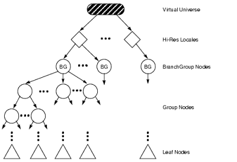
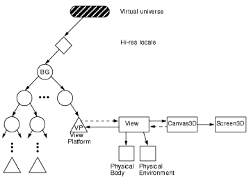
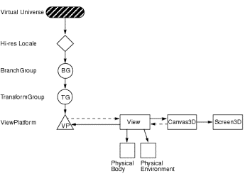
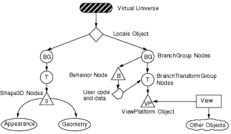
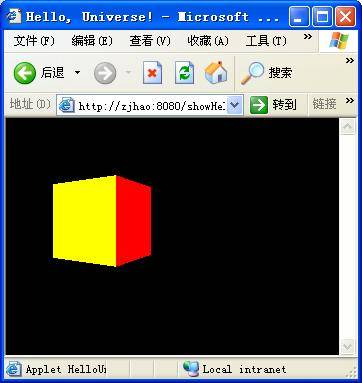
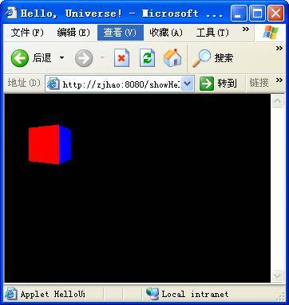

# Java3D 实现三维显示
Java3D 原理和接口使用

**标签:** Java,Web 开发

[原文链接](https://developer.ibm.com/zh/articles/l-java3d/)

钟家豪, 陈漠

发布: 2003-06-20

* * *

## 关于 Java3D

### 1.1 Java3D 简介

Java3D API 是 Sun 定义的用于实现 3D 显示的接口。3D 技术是底层的显示技术，Java3D 提供了基于 Java 的上层接口。Java3D 把 OpenGL 和 DirectX 这些底层技术包装在 Java 接口中。这种全新的设计使 3D 技术变得不再繁琐并且可以加入到 J2SE、J2EE 的整套架构，这些特性保证了 Java3D 技术强大的扩展性。

JAVA3D 建立在 JAVA2（JAVA1.2) 基础之上，JAVA 语言的简单性使 JAVA3D 的推广有了可能。它实现了以下三维显示能够用到的功能：

- 生成简单或复杂的形体（也可以调用现有的三维形体）
- 使形体具有颜色、透明效果、贴图。
- 在三维环境中生成灯光、移动灯光。
- 具有行为的处理判断能力（键盘、鼠标、定时等）。
- 生成雾、背景、声音。
- 使形体变形、移动、生成三维动画。
- 编写非常复杂的应用程序，用于各种领域如 VR（虚拟现实）。

J2SE 在其标准开发包中并不提供 Java3D 的 API，Java3D 是一个独立的可选组件，可以单独下载。Java3D 现在 (截止到 2003 年 5 月）提供的正式版本是 1.3.0，可以在 [http://java.sun.com/products/java-media/3D/download.html](http://java.sun.com/products/java-media/3D/download.html) 下载该开发工具包。

Java3D 1.3 有 7 个不同的可下载版本：

Java3D for Windows（DirectX version）SDK for JDK（include Runtime）；

Java3D for Windows（OpenGL version）SDK for JDK（include Runtime）；

Java3D for Solaris/SPARC Runtime for JDK（include Runtime）；

Java3D for Windows（DirectX version）Runtime for JRE；

Java3D for Windows（OpenGL version）Runtime for JRE；

Java3D for Solaris/SPARC SDK for JRE；

Java3D for Solaris Runtime 64 bit support；

其中前三个版本是开发包。第 4、5、6 个版本是 Java3D 运行期支持程序包。最后一个是支持 Solaris 64 bit 操作平台运行 Java3D 的程序包。前三个的开发包包含了各自对应的运行期支持包。Java 语言本身具有跨平台特性，无论使用上述哪个版本的开发包，概念和实现代码都会保持完全一致。这里我们使用 Java3D for Windows（OpenGL version）SDK for JDK（include Runtime）；版本作为我们讨论、实现 Java3D 的工具包。注意在安装此版本 SDK 前要保证下列环境：

Java 2 (Runtime or SDK) version 1.3.1 或更后的版本

OpenGL 1.1 或更后的版本，并且是 Microsoft 支持的显卡厂商

Windows NT 4.0 only: Service Pack 3 或更后的版本（Window2000、WindowXP）

### 1.2 Java3D 与其他三维技术的比较

JAVA3D 可应用在三维动画、三维游戏、机械 CAD 等多个领域。但作为三维显示实现技术，它并不是唯一选择而且是一个新面孔。在 Java3D 之前已经存在很多三维技术，这些三维技术在实现的技术、使用的语言以及适用的情况上各有不同，我们主要介绍与 Java3D 又密切关系的三种技术：OpenGL、DIRECT3D、VRML

OpenGL 是业界最为流行也是支持最广泛的一个底层 3D 技术，几乎所有的显卡厂商都在底层实现了对 OpenGL 的支持和优化。OpenGL 同时也定义了一系列接口用于编程实现三维应用程序，但是这些接口使用 C（C++）语言实现并且很复杂。掌握针对 OpenGL 的编程技术需要花费大量时间精力。

DIRECT3D 是 Microsoft 公司推出的三维图形编程 API，它主要应用于三维游戏的编程。众多优秀的三维游戏都是由这个接口实现。与 OpenGL 一样，Direct3D 的实现主要使用 C++语言。

VRML2.0(VRML97) 自 1997 年 12 月正式成为国际标准之后，在网络上得到了广泛的应用，这是一种比 BASIC、JAVASCRIPT 等还要简单的语言。脚本化的语句可以编写三维动画片、三维游戏、计算机三维辅助教学。它最大的优势在于可以嵌在网页中显示，但这种简单的语言功能较弱（如目前没有形体之间的碰撞检查功能），与 JAVA 语言等其它高级语言的连接较难掌握，因而逐渐被淹没在竞争激烈的网络三维技术中。

表 1 是 Java3D 与其它三维技术的比较图，可以从中直观的看出他们相互间的区别：

##### 表 1\. 3D 技术对招表

技术实现层次开发技术（难度）扩展性最适合应用领域Java3D中层（JVM）Java（较易）J2SE 标准扩展（好）网上三维显示实现…OpenGL底层（显卡）C\\C++（难）各大厂商支持（较好）三维设计软件…Direct3D底层（操作系统）C++（较难）Windows 平台（差）三维游戏…VRML上层（网页）标记语言（容易）安装插件支持（一般）网上虚拟现实…

## Java3D 的场景图结构

Java3D 实际上是 Java 语言在三维图形领域的扩展，与 Java 一样，Java3D 有纯粹的面向对象结构。Java3D 的数据结构采用的是 Scene Graphs Structure（场景图），就是一些具有方向性的不对称图形组成的树状结构（图 1）。

我们在一个 Java3D 应用程序看到的逼真三维场景从程序的角度看来，实际就是由 Java3D 定义的一系列的对象，这些对象不是杂乱无序，对象之间也不是毫无关系。如果想让三维图像正常显示，必须在这两点上遵循 Java3D 场景图的规定。观察图 1，Java3D 场景图的树结构由各种各样的对象组成：

在图中出现的这些对象都实现了 Java3D 中有重要的意义的类，从逻辑上我们将它们分为三类：

- 根节点（Root）：Virtual Universe Object
- 节点（Node）：Local Object、Branch Group Nodes、Behavior Node、Shape3D Node…
- 叶子节点（Leaf）：Appearance、Geomery..

##### 图 1\. 在应用中的 Java3D 场景图


场景图中线和线的交汇点称为节点（Node），这些节点都是 Java3D 类的实例（Instance of Class），节点之间的线表示各个实例之间的关系。

- Virtual Universe 是根节点，每一个场景图的 Virtual Universe 是唯一的。
- 在 Virtual Universe 下面是 Locale 节点，每个程序可以有一个或多个 Locale，但同时只能有一个 Locale 处于显示状态，就好象一个三维世界非常大，有很多个景点，但我们同时只能在一个景点进行观察。Java3D 允许从一个 Locale 跳到另一个 Locale，不过绝大多数程序只有一个 Locale。
- 每一个 Locale 可以拥有多个 BranchGroup 节点。所有三维形体的其位置信息（Transform Group Nodes）都建立在 BranchGroup 节点之上。
- TransformGroup Node 用来设定 Shape3D 在 Virtual Universe 中的位置。
- Spape3D Node 是三维图形节点，这个节点的实体放映在最后的显示画面中，就是三维世界中的每个形体。包括正方体、球体以及任何形状和外观的三维形体。
- 位于场景图最下层的是两个叶子节点：三维体的外观（Appearance）和几何信息（Geometry），这两个节点定义了一个三维体的显示效果。
- View Platform 位于图 1 的另一个分枝上，与前面所有描述三维体的性质的概念不同，View Platform 和 View 都是用来定义观察者的信息。

上面所列的概念很多，但是对于建立一个简单的 Java3D 程序，我们至少需要了解三个概念：虚拟宇宙（Virtual Universe）、场景（Locale）、坐标系统。

### 2.1 虚拟宇宙（Virtual Universe）

在 Java3D 中，虚拟宇宙被定义为结合一系列对象的三维空间。虚拟宇宙被用作最大的聚集体表现单位，同时也可被看作一个数据库。不管是在物理空间还是逻辑内容，虚拟宇宙都可以很大。实际上在大多数情况下，一个虚拟宇宙就可以满足一个应用程序所有的需求。

虚拟宇宙是各自独立的个体，原因是在任何时候一个结点对象都不能在超过一个的虚拟宇宙中存在。同样的，在一个虚拟宇宙中的结点对象也不能在其他的虚拟宇宙中可见或者与其他的对象结合。

对于一个 Java3D 应用程序，必须定义一个虚拟宇宙才可以在这个”宇宙”中显示三维图像。

### 2.2 Java3D 的坐标系统

默认情况下，Java3D 的坐标系统是右旋的，用方位语义学来解释就是：正 y 方向是本地重力的上，正 x 方向是水平的右，正 z 是这对着观察者的方向。默认的单位是米。

双精度浮点、单精度浮点甚至是定点来表示的三维坐标都足够来表示和显示丰富的 3D 场景。不幸的是，场景不是真实世界，更不必说整个宇宙了。如果使用单精度坐标，有可能出现下列情景：

1. 离原点仅有一百公里的距离，被描绘得相当量子化，所能达到的最好效果就是三分之一英寸，在实际应用中这样的精度比要求的粗糙的多。
2. 如果要缩小到一个很小的尺寸（例如表现集成电路的大小），甚至在离原点很近的地方就会出现同坐标问题。

为了支持一个大型的邻接虚拟宇宙，Java3D 选择了有 256 位的高分辨率坐标：

Java3D 高分辨率坐标由三个 256 位的定点数组成，分别表示 x、y、z。定点被固定在第 128 位，并且值 1.0 被定义为真实的 1 米。这个坐标系统足够用来描述一个超过几百万光年距离的宇宙，也可以定义小于一质子大小（小于一普朗克长度）的对象。

在 Java3D 中，高分辨率坐标仅仅用于将更加传统的浮点坐标系统嵌入更高分辨率的底层系统。用这种方法，可以创造出一个具有任意大小和规模的在视觉上无缝的虚拟宇宙，而且可以不必担心数字上的精度。（参看表 2）

一个 256 位的定点数还具有能够直接表示几乎任何的合理适当的单精度浮点值。

Java3D 用有符号的、两位补码的 256 位定点数字来表示高分标率坐标。尽管 Java3D 保持内部高分辨率坐标表示的不透明，但用户用有八个整型变量的数组来表示 256 位的坐标。Java3D 把数组中从索引号由 0 到 7 分别看作高分辨率坐标的从高到底位上的数。第 128 位上是二进制的小数点，也可以说在索引号为 3 和 4 的整数之间。高分辨率坐标的 1.0 就是 1 米。

如果是”小”的虚拟宇宙（类似于相对比例的几百米），在虚拟宇宙对象下的（0.0,0.0,0.0）点建立一个带有高分辨率坐标的 Locale 作为根节点就足够使用了；装入程序在装入过程中能自动构建结点，而在高分辨率坐标下的点不需要任何外部文件的直接描述。

大一些的虚拟宇宙期待被构建为有如同计算机文件那样的层次，这意味着一个根宇宙要包含由外部文件引用的嵌入虚拟宇宙。就这样，文件引用的对象（用户指定的 Java3D 组或高分辨率结点）定义了被读入现存虚拟宇宙的数据的位置。

表 2-1. Java 3D 高分辨率坐标 {: #表-2-1-java-3d-高分辨率坐标}

Java 3D 高分辨率坐标2n MetersUnits87.29Universe (20 billion light years)69.68Galaxy (100000 light years)53.07Light year43.43Solar system diameter23.60Earth diameter10.65Mile9.97Kilometer0.00Meter-19.93Micron-33.22Angstrom-115.57Planck length

### 2.3 场景（Locale）

为了支持大型虚拟宇宙，Java3D 提出了”Locale”的概念。Locale 把高分辨率坐标作为起源。把高分辨率坐标看作精确的定位，它在高分辨率坐标的影响范围之内使用精度较低的浮点坐标指定对象的位置。

一个 Locale 和与它结合的高分辨率坐标一起组成了在虚拟宇宙之下的一个表现层。所有虚拟宇宙包含一个或多个高分辨率 Locale。而所有其他的对象都是附加在一个 Locale 上的。在整个体系中，高分辨率坐标扮演的是上层的仅供翻译的转换结点。例如，附加到一个特定 Locale 的所有对象的坐标都会与这个 Locale 位置的高分辨率坐标有关。（图 2）

##### 图 2\. 高分辨率坐标指定场景



如果一个虚拟宇宙与传统的计算机图像的概念相近，给定的虚拟宇宙可能会变得太大。所以在通常情况下最好把一个场景图看作是一个高分辨率坐标场景的子结点。

构造一个三维场景，程序员必须运行一个 Java3D 程序。这个 Java3D 应用程序必须首先创建一个虚拟宇宙对象并且至少把一个 Locale 对象附加之上。然后，构建出需要的场景图像，它由一个分支组结点开始并且包括至少一个观察平台对象，而场景图就是附加于这个观察平台。当一个包含场景图的观察对象被附加于一个虚拟宇宙，Java3D 的渲染循环就开始工作。这样，场景就会和它的观察对象一起被绘制在画布上。

### 2.4 编程实现一个三维世界

这一部分描述怎样调用 VirtualUniverse、Locale 和 HiResCoord 对象的编程接口实现建立一个完整的”三维世界”。注意，这个三维世界有原点、坐标，是实现三维显示程序的第一步。

1. VirtualUniverse 对象有下列构造函数：


    ```
    public VirtualUniverse()

    ```


    Show moreShow more icon

    这个函数构造了一个新的 VirtualUniverse 对象，这个对象可以用来创建 Locale 对象。

2. Locale 对象有下列构建器：


    ```
    public Locale(VirtualUniverse universe)
    public Locale(VirtualUniverse universe, int x[], int y[], int z[])
    public Locale(VirtualUniverse universe, HiResCoord hiRes)

    ```


    Show moreShow more icon

    这三个构建器在指定的 VirtualUniverse 中创建了一个新的高分辨率 Locale 对象。其中第一个形成了一个在（0.0,0.0,0.0）的 Locale 对象。其他的两个构建器在指定的坐标上建立了 Locale 对象。在第二种形式里，参数 x,y,z 是含八个 32 位整数的数组，这些数组指定了各自的高分辨率坐标。

    HiResCoord 对象定义了一个使用三个高分辨率坐标的点，而每一个坐标又由三个定点数组成。每个高分辨率坐标数共有 256 位，第 128 位是二进制小数点。Java3D 使用长度为八的整数数组来定义或提取一个 256 位的坐标值。Java3D 用数组内的第一个整数来表示高 32 位，最后一个整数来表示低 32 位。

3. HiResCoord 对象有以下的构建函数：


    ```
    public HiResCoord(int x[], int y[], int z[])
    public HiResCoord(HiResCoord hc)
    public HiResCoord()

    ```


    Show moreShow more icon

    第一个构造函数从输入的三个长度为八的整数数组生成高分辨率坐标。整数数组定义了与其同名坐标对象的值。第二个构造函数通过复制另外一个坐标创建一个新的坐标。第三个构造函数创建了一个值为（0.0,0.0,0.0）的坐标。

    所有 Java3D 程序都会首先建立 VirtualUniverse 和 Locale 对象，也就是说都会包含表 3 所示的代码。为了方便使用，Java3D 为最原始的 VirtualUniverse 创建了几个子类：SimpleUniverse 、ConfiguredUniverse，这些子类保证了可以将三维图像轻易的在通过 Canvas3D 的对象在 Applet 或 Frame 中显示。其中最常用到的是 SimpleUnivese 对象，这个类位于包 com.sun.j3d.utils.universe 中。

    `u = new SimpleUniverse(v,viewer);
    u.getViewingPlatform();
    ViewingPlatform viewingPlatform = u.getViewingPlatform();` **例 1 初始化 VirtualUniverse 和 Locale 代码**


## Java3D 的观察模式

Java3D 引入了一种新的观察模式，这种模式使 Java 编写的显示效果符合”编写一次，随处运行”的原则。Java3D 还把这种功能推广到显示设备或六等级自由度输入外部设备，例如跟踪摄像头。这种新的观察模式的”一次编写，随处观察”的特性意味着用 Java3D 观察模式编写的应用程序和 Applet 可以广泛应用于各种各样的显示设备。在不修改场景图的条件下，图像可以在包括标准电脑显示、多放射显示空间和安装摄像头设备的显示设备上被渲染。这也意味着在不需要修改场景图的情况下，同一个应用程序既能够渲染立体景象，还能通过摄像头的输入控制渲染过的观察图。

Java3D 的观察模式通过完全分离虚拟和现实世界来实现这种多功能性。这种模式区分了以下两种情况：

1. 一个应用程序通过控制观察平台的位置和方向在虚拟宇宙中对一个观察台对象（ViewPlatform）定位、定向和设定比例尺；
2. 渲染器使用已知位置和方向计算出要使用的观察对象，对终端用户物理环境的描述确定用户在物理环境中的位置和方向。

### 3.1 为什么使用一个新的模式

在底层的编程接口中可以找到基于照相机的观察模式，开发者通过它可以控制所有渲染图的参数。它可以应付处理常规的应用程序，但是处理有更广阔的适应性的系统的时候就显得力不从心，这些系统包括：把整个世界作为一个单元装入和显示的观察器或浏览器、可供终端用户观察、操纵、显示、甚至与虚拟世界交互的系统。

基于照相机的观察模式仿效在虚拟世界中放置一个照相机而不是一个人。开发者必须持续重新配置一个照相机来模拟”在虚拟世界中有一个人”。

Java3D 观察模式直接和跟踪摄像头结合。在有摄像头的情况下，用户会有好像他们是真实的存在在那个虚拟世界的错觉，而开发者可以不做任何附加的工作就可以为用户带来这种效果。

在没有摄像头并且只是用来表现一个单一的标准显示的情况下，Java3D 观察模式表现得更像传统的基于照相机的观察模式，只是加上了能够产生立体透视图的功能。

在一个需要由物理环境规定一些观察参数的系统中，让应用程序来控制所有的观察参数并不合理。

例子就是：一个带有摄像头的显示设备可以用其光系统直接决定应用程序中的观察领域。不同的设备有不同的光系统，程序开发者硬绑定这样的参数或允许终端用户改变这样的参数都是不合理的。

另外一个例子是：一个可以由用户当前的头部位置自动计算出观察参数的系统。只有一个对世界的说明和一条预先定义的轨迹可能不会严密的定义一个终端对象的观察。对于有摄像头设备用户，他们可能会期待在沿着一条固定的路线前进的时候能够看到他们左右两旁的物体。就好像在一个游乐场中，游客乘坐观光车按照固定的路线参观游乐场，但是在这过程中，游客可以持续转动他们的头。

由于依靠终端用户的具体物理环境，观察的各个参数，尤其是观察和投影的基体变化很大。影响观察和投影基体的因素包括显示设备的物理尺寸，显示设备的安装方法（在用户的桌面或用户的头顶上），计算机是否知道用户的头在三维空间的位置，头顶装置真实的观察领域，显示设备上每平方英寸的像素数，还有其他类似的参数。

Java3D 建立的观察模式完全可以满足上述所有的需求。

### 3.2 分离物理和虚拟

Java3D 分离了虚拟环境和物理环境：应用程序在虚拟环境中按照一定关系放置对象，而用户存在在物理环境之中，看计算机显示器并操纵输入设备。

Java3D 也定义了用户所在的物理世界和图像程序所在的虚拟世界之间最基本的通信。这种”物理到虚拟世界”的通信定义了一个单一的公共空间，在这个空间中用户的动作影响虚拟世界中的对象，而在虚拟世界中的任何活动都会影响最终用户的观察。

**虚拟世界** 是虚拟对象存在的通用空间。虚拟世界的坐标系统相对于每个 Locale 对象的高分辨率坐标存在，它定义了所有附加于这个 Locale 的虚拟世界坐标原点。包含当前活动的观察平台对象的 Local 定义了用来绘图的虚拟世界坐标。Java3D 最后把所有图像单元的坐标转换到通用的虚拟世界空间中。

**物理世界** 就是指真实的世界。这是真实的用户存在和移动他（她）的头和手的空间。这也是使用任何物理追踪仪可以定义他们的局部坐标和几个标准的坐标系统被描述的空间。

物理世界是一个空间，而不是 Java3D 不同的程序执行实例之间的通用坐标系统。所以当两个不同的计算机在世界上两个不同的地方同时运行同一个程序的时候，Java3D 中没有直接来描述它们在物理世界坐标系统中相对位置的机制。因为标准问题，当地的跟踪系统仅仅定义了特定的 Java3D 应用程序实例的物理坐标系统。

### 3.3 Java3D 中用来定义观察的对象

Java3D 通过几个对象来发布它的观察模式。特别是 View 对象和与它相关的组件对象：PhysicalBody 对象、PhysicalEnvironment 对象、Canvas3D 对象、Screen3D 对象。图 3 描述了 View 对象的中心角色和组件对象的辅助角色。

观察有关的对象都在图 3 中，它们起的作用如下：

**ViewPlatform（观察平台）：** 一个 view 用一个叶子结点来在场景图为自己定位。观察平台的起始结点指定了它的位置、方向和在虚拟世界中的比例尺。

**View（观察）：** 主要的观察对象包含了很多观察的状态。

**Canvas3D：** 抽象窗口工具箱中画布对象的 3D 版本。它描绘了一个可以让 Java3D 在上面画图像的窗口。它包括了一个对 Screen3D 对象的引用和描述一个 Canvas3D 要用到的尺寸、形状和位置信息。

**Screen3D：** 一个包含描述显示荧屏物理属性信息的对象。Java3D 把显示荧屏信息分别放在单独的对象中，这样做可以防止在每一个 Canvas3D 对象中不同的显示屏幕信息共享一个屏幕。

**PhysicalBody：** 一个包含刻度信息的对象，它描述了用户的物理身体。

**PhysicalEnvironment：** 一个包含刻度信息的对象，它描述了物理世界。主要的信息描述了环境的六自由度硬件。

##### 图 3\. View 和它的组件对象以及它们的相互联系



这些对象一起描述观察的几何体胜于明白的提供观察或投影基体。Java3D 的表现工具用这个信息来构造适合的观察和投影基体。这些观察对象的几何中心为产生一个观察提供了更大的弹性，这种弹性需要支持可以选择的显示配置。

### 3.4 ViewPlatform: 在虚拟世界中的位置

一个 Viewplatform 结点定义了一个坐标系统。这样，在虚拟世界中就有了一个有原点或参考点的参考系。观察平台是一个附加在观察对象的点并且作为决定描绘工具观察的基础。

图 4 表示了一个场景图的一部分，它包括一个观察平台结点。直接在观察平台之上的结点决定了它在虚拟世界中的位置和方向。应用程序和或行为通过修改直接在观察平台之上任何与 TransformGroup 结点结合的 Tramsform3D 对象可以在虚拟世界中任意移动 VierPlatform。一个简单的应用程序可能直接在一个观察平台上定义一个 TransformGroup 结点。

一个虚拟宇宙可能有很多不同的观察平台，但是一个特定的 View 对象只能附加于一个单一的观察平台之上。这样，每个画在 Canvas3D 上的图画都是从一个单一的观察平台开始。

##### 图 4\. 包含观察平台的一部分场景图



### 3.5 如何在虚拟世界中移动

应用程序通过修改观察平台的上级 TransformGroup 在虚拟世界中航行。修改一个观察平台的位置和方向的应用程序的例子包括：浏览器、提供航行控制的阅读器、做建筑预设计的程序、甚至是搜寻和毁坏游戏。

控制观察平台对象能产生很有趣和有用的结果。我们可以定义一个简单的场景图，这个程序的目的是在窗口的正中画了一个对象并且绕自己的中心转动。

我们不管在中心的对象，而让 ViewPlatform 在虚拟世界中绕圈。如果形体结点包括一个地球模型，这个程序可能产生一个类似于绕地球的远航员观察对象。

如果在这个世界中加入更多的对象，这个场景图允许经由行为结点来浏览整个虚拟世界。

##### 图 5\. 一个由观察控制的简单场景图



应用程序和动作通过 TransformGroup 的可访问方法操纵它。这些方法允许应用程序得到和设置组结点的 Transform3D 对象。Transform3D 结点有 setTransform 和 getTransform 两个方法。

### 3.6 加载于喜欢的地方

一个场景图可能包括多个观察平台对象。如果用户把一个观察对象从一个观察平台分离，然后把这个观察对象附加到另外一个不同的观察平台上。显示屏上的图像现在就要从新的观察平台上的观察点画图了。

在 Java3D 的绘图机制中，真实的观察由当前附加观察平台的观察附加策略决定。观察平台定义了设置和得到观察附加策略的方法：

```
public void setViewAttachPolicy(int policy)
public int getViewAttachPolicy()

```

Show moreShow more icon

这些方法设置和得到在虚拟世界策略中的共存中心。默认的附加策略是 View.NOMINAL\_HEAD。观察平台的附加观察策略决定了 Java3D 怎样在观察平台中放置出射点。这个策略可以是以下的几个值之一：

**View.NOMINAL\_HEAD：** 保证终端用户在物理世界名义上的眼睛位置对应于在虚拟世界中虚拟眼睛的位置。本质上，这个策略告诉 Java3D 要用同一种方法把虚拟出射点和观察平台原点及物理出射点和物理世界的原点相对放置。物理世界中出射点的方向和位置与原点的背离会产生相应的虚拟出射点的方向和位置在虚拟世界中的背离。

**View.NOMINAL\_FEET：** 保证终端用户的虚拟世界中的脚一直接触虚拟地面，这个策略告诉 Java3D 要以这种约束计算物理-虚拟世界的通信。为达到之一目的，Java3D 通过移动终端用户的眼睛位置和物理高度。Java3D 用在 PhysicalBody 对象中的 nominalEyeHeightFromGround 参数来执行这个计算。

**View.NOMINAL\_SCREEN：** 允许应用程序总是拥有一个和”感兴趣的点”保持”可观察”距离的出射点。这个策略也决定了 Java3D 计算”物理到虚拟世界”通信的方法。这个方法保证程序根据 PhysicalBody 对象定义 nominalEyeOffsetFromNominalScreen 参数来设置虚拟出射点与要表现的点之间的距离。

### 3.7 在三维世界中建立、移动观察点

形体移动的实现向来都是三维实现的难点和复杂之处，传统三维技术的实现多是注重模拟三维物体的真实移动。而 Java3D 除了提供传统的方案，还可以在一个存在的三维世界中移动一个观察点，借助观察点的移动模拟物体的移动。如同物理所学的切割磁力线发电，转子和静子本来就是一对可以互逆的对象，结果都是把动能转化为电能。例 2 的代码显示了在 Virtual Universe 中建立 Viewer、ViewPlatForm、和如何通过绑定 OrbitBehavior 实现移动 ViewPlatform。

##### 例 2\. 建立、移动观察点代码

```
setLayout(new BorderLayout());
Canvas3D c = new Canvas3D(null);
add("Center", c);
Viewer viewer = new Viewer(c);
Vector3d viewpoint = new Vector3d(0.0,0.0,2.41);
//初始观察点位置
Transform3D t = new Transform3D();
t.set(viewpoint);
ViewingPlatform v = new ViewingPlatform( );
v.getViewPlatformTransform().setTransform(t);
u = new SimpleUniverse(v,viewer);
u.getViewingPlatform();
ViewingPlatform viewingPlatform = u.getViewingPlatform();
OrbitBehavior orbit = new OrbitBehavior(c, OrbitBehavior.REVERSE_ALL);
BoundingSphere bounds =
new BoundiBoundingSpherengSphere(new Point3d(0.0, 0.0, 0.0), 100.0);
orbit.setSchedulingBounds(bounds);
viewingPlatform.setViewPlatformBehavior(orbit);
....

```

Show moreShow more icon

## 将 Java3D 与 Java 平台技术的结合

Java3D 可以很容易的与 Java 平台的其他技术相结合，如 Applet、JSP、Serverlet、JDBC、EJB 等。100%的纯 Java 实现是 Java3D 可以与如此多的 Java 平台技术结合的根本原因：

1. 同是 Java 平台保证 Java3D 可以在 Applet 中实现；
2. Applet 使 Java3D 可以轻易的在网页中显示；
3. JSP、Serverlet 技术保证将动态网页技术用于 Java3D 显示；
4. Serverlet 本身就是 J2EE 平台的核心技术，这使得 Java3D 可以搭建于 J2EE 平台。更可以使用所有 J2EE 的其他技术：JDBC、EJB、JMS…

### 4.1 在网页上显示 3D 图形

Java3D 一个最大的特性是可以使用 Applet 作为显示容器，例 3 和例 4 的代码分别显示了如何在 Applet 中显示 3D 图形和在网页文件中（HTML）嵌入该 Applet。

##### 例 3\. Applet 实现 Java3D

```
Public class HelloUniverse extends Applet {
private SimpleUniverse u = null;
public BranchGroup createSceneGraph() {
BranchGroup objRoot = new BranchGroup();
....
return objRoot;
}
public void init() {
Canvas3D c = new Canvas3D(config);
add("Center", c);
....
u.addBranchGraph(scene);
}
....
}

```

Show moreShow more icon

##### 例 4\. 在网页嵌入显示 3D Applet

```
<HTML>
<HEAD>
<TITLE>Hello, Universe!</TITLE>
</HEAD>
<BODY BGCOLOR="#000000">
<applet align=middle code="HelloUniverse.class" width=256 height=256>
</applet>
</BODY>
</HTML>

```

Show moreShow more icon

### 4.2 动态网页技术与 Java3D

通过 Jsp 和 Serverlet，可以使 Java3D 在网页中”动”起来。虽然 Java3D 本身就有三维动画的功能，但是这里的”动”指得是赋予了程序编写人员对 Java3D 动态的控制能力。改造上面的 HelloUniverse，例 5 的 jsp 代码可以实现控制旋转的正方体大小的功能。通过每次 Random 对象生成的随机数，立方体的大小也是随即改变，这段程执行的效果，如图 6、7 所示。

##### 例 5 实现可以动态调整三位物体大小的 jsp 代码

```
<%@ page contentType="text/html; charset=GBK" %>
<HTML>
<HEAD>
<TITLE>Hello, Universe!</TITLE>
</HEAD>
<BODY BGCOLOR="#000000">
<%int i=300;%>
<%float j=i*(new java.util.Random()).nextFloat();%>
<applet align=middle code="HelloUniverse.class" width=<%=j%> height=<%=j%>>
</applet>
</BODY>
</HTML>

```

Show moreShow more icon

##### 图 6\. Jsp 显示效果 1



##### 图 7\. Jsp 显示效果 2



### 4.3 J2EE 平台对 Java3D 的支持

上面的例子只是通过动态设定 Applet 大小来控制 Java3D 的显示，实际上可应通过更多的方法实现 Jsp、Serverlet 对 Java3D 显示效果的控制，甚至可以将 Java3D 置于 J2EE 平台的显示层，实现对 EJB、JDBC 的调用。

实现 Java3D 利用 J2EE 平台资源的方法很多，甚至可以直接在 Java3D 的实现类中直接调用 EJB。但是从 J2EE 平台的设计模式出发，把对 EJB 调用放到 Jsp 中，而将返回的结果作为参数传入实现 Java3D 的 Applet 类中是一个更好的模式。具体代码见例 6。

##### 例 6 调用 EJB 作为 Java3D 参数代码

```
<%@ page contentType="text/html; charset=GBK" %>
<%@ page import="javax.ejb.*" %>
<%@ page import="java.rmi.*"%>
<%@ page import="javax.rmi.PortableRemoteObject"%>
<%@ page import="javax.naming.*"%>
<%@ page import="java.util.Properties"%>
<HTML>
<HEAD>
<TITLE>Hello, Universe!</TITLE>
</HEAD>
<BODY BGCOLOR="#000000">
<% try{
Properties properties = null;
Context context = new InitialContext(properties);
Object ref = context.lookup("Customer");
EJBHome home= (EJBHome)PortableRemoteObject.narrow(ref,CustomerHome.class);
CustomerHome home=(CustomerHome)home;
Customer customer= home.findByPrimaryKey("1000000");
String data = customer.getData();
}
catch(Exception e){e.printStackTrace();}
%>
<applet align=middle code="HelloUniverse.class" width=200 height=200>
<param name="Data" value=<%=data%>>
</applet>
</BODY>
</HTML>

```

Show moreShow more icon

上面的代码首先访问 JNDI 名为”Customer”的 EJB，然后将返回值作为参数传入实现 Java3D 的 Applet。

Java3D 与 J2EE 是相互支持的关系：Java3D 丰富、强化了 J2EE 的显示模式，使略显枯燥的 J2EE 客户端光鲜多彩；J2EE 平台为 Java3D 提供了支持，功能强大的 Server 端处理能力为三维显示所需的复杂计算和大数据量提供了有力的支持。

我们可以想象下面的两幅场景：

- 通讯卫星将全国所有道路、建筑信息录入大型数据库；EJB 实现应用逻辑并将之部署到 AppServer 上；所有支持 JVM 的手机、PDA、车载 GPS 可以通过调用 EJB 显示与真实世界一模一样的周围环境。
- 地震局根据实际勘测到的地表等高线信息绘制二维矢量图，存为 FDX 文件；将二维图像转为三维实现的复杂算法放到 EJB 中实现；Jsp 页面调用 EJB 后可以在 Appet 上实现三维 GIS 的显示。

有了 Java3D 和 Java，这一切都不只是梦想。