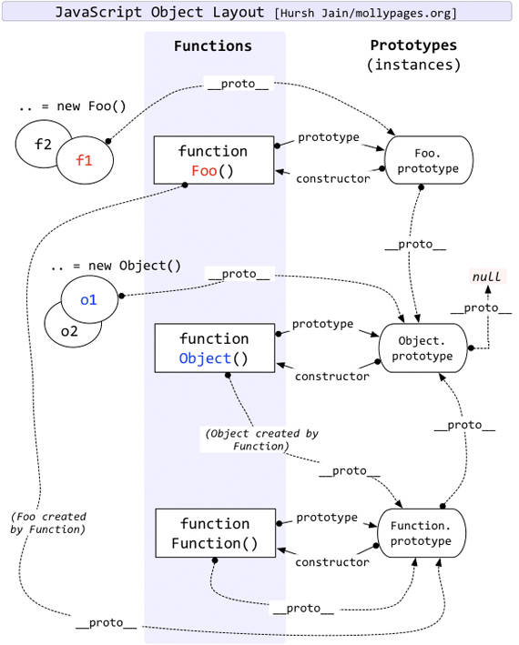

# JavaScript instanceof 运算符深入剖析
深入理解 instanceof 运算符的用法，写好复杂的 JavaScript 程序

**标签:** JavaScript,Web 开发

[原文链接](https://developer.ibm.com/zh/articles/1306-jiangjj-jsinstanceof/)

姜俊杰

发布: 2013-06-06

* * *

## instanceof 运算符简介

在 JavaScript 中，判断一个变量的类型尝尝会用 typeof 运算符，在使用 typeof 运算符时采用引用类型存储值会出现一个问题，无论引用的是什么类型的对象，它都返回 “object”。ECMAScript 引入了另一个 Java 运算符 instanceof 来解决这个问题。instanceof 运算符与 typeof 运算符相似，用于识别正在处理的对象的类型。与 typeof 方法不同的是，instanceof 方法要求开发者明确地确认对象为某特定类型。例如：

##### 清单 1\. instanceof 示例

```
var oStringObject = new String("hello world");
console.log(oStringObject instanceof String);      // 输出 "true"

```

Show moreShow more icon

这段代码问的是”变量 oStringObject 是否为 String 对象的实例？”oStringObject 的确是 String 对象的实例，因此结果是”true”。尽管不像 typeof 方法那样灵活，但是在 typeof 方法返回 “object” 的情况下，instanceof 方法还是很有用的。

## instanceof 运算符的常规用法

通常来讲，使用 instanceof 就是判断一个实例是否属于某种类型。例如：

##### 清单 2\. instanceof 常规用法

```
// 判断 foo 是否是 Foo 类的实例
function Foo(){}
var foo = new Foo();
console.log(foo instanceof Foo)//true

```

Show moreShow more icon

另外，更重的一点是 instanceof 可以在继承关系中用来判断一个实例是否属于它的父类型。例如：

##### 清单 3\. instanceof 在继承中关系中的用法

```
// 判断 foo 是否是 Foo 类的实例 , 并且是否是其父类型的实例
function Aoo(){}
function Foo(){}
Foo.prototype = new Aoo();//JavaScript 原型继承

var foo = new Foo();
console.log(foo instanceof Foo)//true
console.log(foo instanceof Aoo)//true

```

Show moreShow more icon

上面的代码中是判断了一层继承关系中的父类，在多层继承关系中，instanceof 运算符同样适用。

## 你真的了解 instanceof 操作符吗？

看了上面的代码示例，是不是觉得 instanceof 操作符很简单，下面来看点复杂的用法。

##### 清单 4\. instanceof 复杂用法

```
console.log(Object instanceof Object);//true
console.log(Function instanceof Function);//true
console.log(Number instanceof Number);//false
console.log(String instanceof String);//false

console.log(Function instanceof Object);//true

console.log(Foo instanceof Function);//true
console.log(Foo instanceof Foo);//false

```

Show moreShow more icon

看了上面的代码是不是又晕头转向了？为什么 Object 和 Function instanceof 自己等于 true，而其他类 instanceof 自己却又不等于 true 呢？如何解释？要想从根本上了解 instanceof 的奥秘，需要从两个方面着手：1，语言规范中是如何定义这个运算符的。2，JavaScript 原型继承机制。

## 详细剖析 ECMAScript-262 edition 3 中 instanceof 运算符的定义

语言规范对中 instanceof 运算符的定义如下：

##### 清单 5\. 规范中 instanceof 运算符定义

```
11.8.6 The instanceof operator
The production RelationalExpression:
     RelationalExpression instanceof ShiftExpression is evaluated as follows:

1. Evaluate RelationalExpression.
2. Call GetValue(Result(1)).// 调用 GetValue 方法得到 Result(1) 的值，设为 Result(2)
3. Evaluate ShiftExpression.
4. Call GetValue(Result(3)).// 同理，这里设为 Result(4)
5. If Result(4) is not an object, throw a TypeError exception.// 如果 Result(4) 不是 object，
                                                                //抛出异常
/* 如果 Result(4) 没有 [[HasInstance]] 方法，抛出异常。规范中的所有 [[...]] 方法或者属性都是内部的，
在 JavaScript 中不能直接使用。并且规范中说明，只有 Function 对象实现了 [[HasInstance]] 方法。
所以这里可以简单的理解为：如果 Result(4) 不是 Function 对象，抛出异常 */
6. If Result(4) does not have a [[HasInstance]] method,
throw a TypeError exception.
// 相当于这样调用：Result(4).[[HasInstance]](Result(2))
7. Call the [[HasInstance]] method of Result(4) with parameter Result(2).
8. Return Result(7).

// 相关的 HasInstance 方法定义
15.3.5.3 [[HasInstance]] (V)
Assume F is a Function object.// 这里 F 就是上面的 Result(4)，V 是 Result(2)
When the [[HasInstance]] method of F is called with value V,
     the following steps are taken:
1. If V is not an object, return false.// 如果 V 不是 object，直接返回 false
2. Call the [[Get]] method of F with property name "prototype".// 用 [[Get]] 方法取
                                                                // F 的 prototype 属性
3. Let O be Result(2).//O = F.[[Get]]("prototype")
4. If O is not an object, throw a TypeError exception.
5. Let V be the value of the [[Prototype]] property of V.//V = V.[[Prototype]]
6. If V is null, return false.
// 这里是关键，如果 O 和 V 引用的是同一个对象，则返回 true；否则，到 Step 8 返回 Step 5 继续循环
7. If O and V refer to the same object or if they refer to objects
joined to each other (section 13.1.2), return true.
8. Go to step 5.

```

Show moreShow more icon

上面的规范定义很晦涩，而且看起来比较复杂，涉及到很多概念，但把这段规范翻译成 JavaScript 代码却很简单，如下：

##### 清单 6\. JavaScript instanceof 运算符代码

```
function instance_of(L, R) {//L 表示左表达式，R 表示右表达式
var O = R.prototype;// 取 R 的显示原型
L = L.__proto__;// 取 L 的隐式原型
while (true) {
    if (L === null)
      return false;
    if (O === L)// 这里重点：当 O 严格等于 L 时，返回 true
      return true;
    L = L.__proto__;
}
}

```

Show moreShow more icon

## JavaScript 原型继承机制

由于本文主要集中在剖析 JavaScript instanceof 运算符，所以对于 JavaScript 的原型继承机制不再做详细的讲解，下面参考来自 `http://www.mollypages.org/misc/js.mp` 的一张图片，此图片详细的描述了 JavaScript 各种对象的显示和隐式原型链结构。

由其本文涉及显示原型和隐式原型，所以下面对这两个概念作一下简单说明。在 JavaScript 原型继承结构里面，规范中用 [[Prototype]] 表示对象隐式的原型，在 JavaScript 中用 **proto** 表示，并且在 Firefox 和 Chrome 浏览器中是可以访问得到这个属性的，但是 IE 下不行。所有 JavaScript 对象都有 **proto** 属性，但只有 Object.prototype. **proto** 为 null，前提是没有在 Firefox 或者 Chrome 下修改过这个属性。这个属性指向它的原型对象。 至于显示的原型，在 JavaScript 里用 prototype 属性表示，这个是 JavaScript 原型继承的基础知识，在这里就不在叙述了。

##### 图 1\. JavaScript 原型链



## 讲解 instanceof 复杂用法

有了上面 instanceof 运算符的 JavaScript 代码和原型继承图，再来理解 instanceof 运算符将易如反掌。下面将详细讲解 Object instanceof Object，Function instanceof Function 和 Foo instanceof Foo 三个示例，其它示例读者可自行推演。

##### 清单 7\. Object instanceof Object

```
// 为了方便表述，首先区分左侧表达式和右侧表达式
ObjectL = Object, ObjectR = Object;
// 下面根据规范逐步推演
O = ObjectR.prototype = Object.prototype
L = ObjectL.__proto__ = Function.prototype
// 第一次判断
O != L
// 循环查找 L 是否还有 __proto__
L = Function.prototype.__proto__ = Object.prototype
// 第二次判断
O == L
// 返回 true

```

Show moreShow more icon

##### 清单 8\. Function instanceof Function

```
// 为了方便表述，首先区分左侧表达式和右侧表达式
FunctionL = Function, FunctionR = Function;
// 下面根据规范逐步推演
O = FunctionR.prototype = Function.prototype
L = FunctionL.__proto__ = Function.prototype
// 第一次判断
O == L
// 返回 true

```

Show moreShow more icon

##### 清单 9\. Foo instanceof Foo

```
// 为了方便表述，首先区分左侧表达式和右侧表达式
FooL = Foo, FooR = Foo;
// 下面根据规范逐步推演
O = FooR.prototype = Foo.prototype
L = FooL.__proto__ = Function.prototype
// 第一次判断
O != L
// 循环再次查找 L 是否还有 __proto__
L = Function.prototype.__proto__ = Object.prototype
// 第二次判断
O != L
// 再次循环查找 L 是否还有 __proto__
L = Object.prototype.__proto__ = null
// 第三次判断
L == null
// 返回 false

```

Show moreShow more icon

## 简析 instanceof 在 Dojo 继承机制中的应用

在 JavaScript 中，是没有多重继承这个概念的，就像 Java 一样。但在 Dojo 中使用 declare 声明类时，是允许继承自多个类的。下面以 Dojo 1.6.1 为例。

##### 清单 10\. Dojo 中多重继承

```
dojo.declare("Aoo",null,{});
dojo.declare("Boo",null,{});
dojo.declare("Foo",[Aoo,Boo],{});

var foo = new Foo();
console.log(foo instanceof Aoo);//true
console.log(foo instanceof Boo);//false

console.log(foo.isInstanceOf(Aoo));//true
console.log(foo.isInstanceOf(Boo));//true

```

Show moreShow more icon

上面的示例中，Foo 同时继承自 Aoo 和 Boo，但当使用 instanceof 运算符来检查 foo 是否是 Boo 的实例时，返回的是 false。实际上，在 Dojo 的内部，Foo 仍然只继承自 Aoo，而通过 mixin 机制把 Boo 类中的方法和属性拷贝到 Foo 中，所以当用 instanceof 运算符来检查是否是 Boo 的实例时，会返回 false。所以 Dojo 为每个类的实例添加了一个新的方法叫 isInstanceOf，用这个方法来检查多重继承。

## 结束语

本文详细介绍了 JavaScript 语言中 instanceof 运算符，并且结合语言规范深入剖析了此操作符的算法。对读者使用 JavaScript 编写复杂的面向对象程序会有很大的帮助。本文所有代码在 Firefox 15 下通过测试。