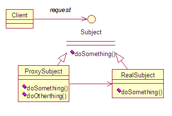
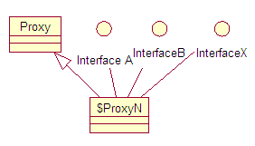

# Java 动态代理机制分析及扩展
一个完整的 Java 动态代理运作过程

**标签:** Java

[原文链接](https://developer.ibm.com/zh/articles/j-lo-proxy1/)

王忠平, 何平

发布: 2010-01-21

* * *

## 引言

Java 动态代理机制的出现，使得 Java 开发人员不用手工编写代理类，只要简单地指定一组接口及委托类对象，便能动态地获得代理类。代理类会负责将所有的方法调用分派到委托对象上反射执行，在分派执行的过程中，开发人员还可以按需调整委托类对象及其功能，这是一套非常灵活有弹性的代理框架。通过阅读本文，读者将会对 Java 动态代理机制有更加深入的理解。本文首先从 Java 动态代理的运行机制和特点出发，对其代码进行了分析，推演了动态生成类的内部实现。

## 代理：设计模式

代理是一种常用的设计模式，其目的就是为其他对象提供一个代理以控制对某个对象的访问。代理类负责为委托类预处理消息，过滤消息并转发消息，以及进行消息被委托类执行后的后续处理。

##### 图 1\. 代理模式



为了保持行为的一致性，代理类和委托类通常会实现相同的接口，所以在访问者看来两者没有丝毫的区别。通过代理类这中间一层，能有效控制对委托类对象的直接访问，也可以很好地隐藏和保护委托类对象，同时也为实施不同控制策略预留了空间，从而在设计上获得了更大的灵活性。Java 动态代理机制以巧妙的方式近乎完美地实践了代理模式的设计理念。

## 相关的类和接口

要了解 Java 动态代理的机制，首先需要了解以下相关的类或接口：

- java.lang.reflect.Proxy：这是 Java 动态代理机制的主类，它提供了一组静态方法来为一组接口动态地生成代理类及其对象。

##### 清单 1\. Proxy 的静态方法

```
// 方法 1: 该方法用于获取指定代理对象所关联的调用处理器
static InvocationHandler getInvocationHandler(Object proxy)

// 方法 2：该方法用于获取关联于指定类装载器和一组接口的动态代理类的类对象
static Class getProxyClass(ClassLoader loader, Class[] interfaces)

// 方法 3：该方法用于判断指定类对象是否是一个动态代理类
static boolean isProxyClass(Class cl)

// 方法 4：该方法用于为指定类装载器、一组接口及调用处理器生成动态代理类实例
static Object newProxyInstance(ClassLoader loader, Class[] interfaces,
      InvocationHandler h)

```

Show moreShow more icon

- java.lang.reflect.InvocationHandler：这是调用处理器接口，它自定义了一个 invoke 方法，用于集中处理在动态代理类对象上的方法调用，通常在该方法中实现对委托类的代理访问。

##### 清单 2\. InvocationHandler 的核心方法

```
// 该方法负责集中处理动态代理类上的所有方法调用。第一个参数既是代理类实例，第二个参数是被调用的方法对象
// 第三个方法是调用参数。调用处理器根据这三个参数进行预处理或分派到委托类实例上发射执行
Object invoke(Object proxy, Method method, Object[] args)

```

Show moreShow more icon

每次生成动态代理类对象时都需要指定一个实现了该接口的调用处理器对象（参见 Proxy 静态方法 4 的第三个参数）。

- java.lang.ClassLoader：这是类装载器类，负责将类的字节码装载到 Java 虚拟机（JVM）中并为其定义类对象，然后该类才能被使用。Proxy 静态方法生成动态代理类同样需要通过类装载器来进行装载才能使用，它与普通类的唯一区别就是其字节码是由 JVM 在运行时动态生成的而非预存在于任何一个 .class 文件中。

    每次生成动态代理类对象时都需要指定一个类装载器对象（参见 Proxy 静态方法 4 的第一个参数）


## 代理机制及其特点

首先让我们来了解一下如何使用 Java 动态代理。具体有如下四步骤：

1. 通过实现 InvocationHandler 接口创建自己的调用处理器；
2. 通过为 Proxy 类指定 ClassLoader 对象和一组 interface 来创建动态代理类；
3. 通过反射机制获得动态代理类的构造函数，其唯一参数类型是调用处理器接口类型；
4. 通过构造函数创建动态代理类实例，构造时调用处理器对象作为参数被传入。

##### 清单 3\. 动态代理对象创建过程

```
// InvocationHandlerImpl 实现了 InvocationHandler 接口，并能实现方法调用从代理类到委托类的分派转发
// 其内部通常包含指向委托类实例的引用，用于真正执行分派转发过来的方法调用
InvocationHandler handler = new InvocationHandlerImpl(..);

// 通过 Proxy 为包括 Interface 接口在内的一组接口动态创建代理类的类对象
Class clazz = Proxy.getProxyClass(classLoader, new Class[] { Interface.class, ... });

// 通过反射从生成的类对象获得构造函数对象
Constructor constructor = clazz.getConstructor(new Class[] { InvocationHandler.class });

// 通过构造函数对象创建动态代理类实例
Interface Proxy = (Interface)constructor.newInstance(new Object[] { handler });

```

Show moreShow more icon

实际使用过程更加简单，因为 Proxy 的静态方法 newProxyInstance 已经为我们封装了步骤 2 到步骤 4 的过程，所以简化后的过程如下

##### 清单 4\. 简化的动态代理对象创建过程

```
// InvocationHandlerImpl 实现了 InvocationHandler 接口，并能实现方法调用从代理类到委托类的分派转发
InvocationHandler handler = new InvocationHandlerImpl(..);

// 通过 Proxy 直接创建动态代理类实例
Interface proxy = (Interface)Proxy.newProxyInstance( classLoader,
     new Class[] { Interface.class },
     handler );

```

Show moreShow more icon

接下来让我们来了解一下 Java 动态代理机制的一些特点。

首先是动态生成的代理类本身的一些特点。1）包：如果所代理的接口都是 public 的，那么它将被定义在顶层包（即包路径为空），如果所代理的接口中有非 public 的接口（因为接口不能被定义为 protect 或 private，所以除 public 之外就是默认的 package 访问级别），那么它将被定义在该接口所在包（假设代理了 com.ibm.developerworks 包中的某非 public 接口 A，那么新生成的代理类所在的包就是 com.ibm.developerworks），这样设计的目的是为了最大程度的保证动态代理类不会因为包管理的问题而无法被成功定义并访问；2）类修饰符：该代理类具有 final 和 public 修饰符，意味着它可以被所有的类访问，但是不能被再度继承；3）类名：格式是”$ProxyN”，其中 N 是一个逐一递增的阿拉伯数字，代表 Proxy 类第 N 次生成的动态代理类，值得注意的一点是，并不是每次调用 Proxy 的静态方法创建动态代理类都会使得 N 值增加，原因是如果对同一组接口（包括接口排列的顺序相同）试图重复创建动态代理类，它会很聪明地返回先前已经创建好的代理类的类对象，而不会再尝试去创建一个全新的代理类，这样可以节省不必要的代码重复生成，提高了代理类的创建效率。4）类继承关系：该类的继承关系如图：

##### 图 2\. 动态代理类的继承图



由图可见，Proxy 类是它的父类，这个规则适用于所有由 Proxy 创建的动态代理类。而且该类还实现了其所代理的一组接口，这就是为什么它能够被安全地类型转换到其所代理的某接口的根本原因。

接下来让我们了解一下代理类实例的一些特点。每个实例都会关联一个调用处理器对象，可以通过 Proxy 提供的静态方法 getInvocationHandler 去获得代理类实例的调用处理器对象。在代理类实例上调用其代理的接口中所声明的方法时，这些方法最终都会由调用处理器的 invoke 方法执行，此外，值得注意的是，代理类的根类 java.lang.Object 中有三个方法也同样会被分派到调用处理器的 invoke 方法执行，它们是 hashCode，equals 和 toString，可能的原因有：一是因为这些方法为 public 且非 final 类型，能够被代理类覆盖；二是因为这些方法往往呈现出一个类的某种特征属性，具有一定的区分度，所以为了保证代理类与委托类对外的一致性，这三个方法也应该被分派到委托类执行。当代理的一组接口有重复声明的方法且该方法被调用时，代理类总是从排在最前面的接口中获取方法对象并分派给调用处理器，而无论代理类实例是否正在以该接口（或继承于该接口的某子接口）的形式被外部引用，因为在代理类内部无法区分其当前的被引用类型。

接着来了解一下被代理的一组接口有哪些特点。首先，要注意不能有重复的接口，以避免动态代理类代码生成时的编译错误。其次，这些接口对于类装载器必须可见，否则类装载器将无法链接它们，将会导致类定义失败。再次，需被代理的所有非 public 的接口必须在同一个包中，否则代理类生成也会失败。最后，接口的数目不能超过 65535，这是 JVM 设定的限制。

最后再来了解一下异常处理方面的特点。从调用处理器接口声明的方法中可以看到理论上它能够抛出任何类型的异常，因为所有的异常都继承于 Throwable 接口，但事实是否如此呢？答案是否定的，原因是我们必须遵守一个继承原则：即子类覆盖父类或实现父接口的方法时，抛出的异常必须在原方法支持的异常列表之内。所以虽然调用处理器理论上讲能够，但实际上往往受限制，除非父接口中的方法支持抛 Throwable 异常。那么如果在 invoke 方法中的确产生了接口方法声明中不支持的异常，那将如何呢？放心，Java 动态代理类已经为我们设计好了解决方法：它将会抛出 UndeclaredThrowableException 异常。这个异常是一个 RuntimeException 类型，所以不会引起编译错误。通过该异常的 getCause 方法，还可以获得原来那个不受支持的异常对象，以便于错误诊断。

## 代码是最好的老师

机制和特点都介绍过了，接下来让我们通过源代码来了解一下 Proxy 到底是如何实现的。

首先记住 Proxy 的几个重要的静态变量：

##### 清单 5\. Proxy 的重要静态变量

```
// 映射表：用于维护类装载器对象到其对应的代理类缓存
private static Map loaderToCache = new WeakHashMap();

// 标记：用于标记一个动态代理类正在被创建中
private static Object pendingGenerationMarker = new Object();

// 同步表：记录已经被创建的动态代理类类型，主要被方法 isProxyClass 进行相关的判断
private static Map proxyClasses = Collections.synchronizedMap(new WeakHashMap());

// 关联的调用处理器引用
protected InvocationHandler h;

```

Show moreShow more icon

然后，来看一下 Proxy 的构造方法：

##### 清单 6\. Proxy 构造方法

```
// 由于 Proxy 内部从不直接调用构造函数，所以 private 类型意味着禁止任何调用
private Proxy() {}

// 由于 Proxy 内部从不直接调用构造函数，所以 protected 意味着只有子类可以调用
protected Proxy(InvocationHandler h) {this.h = h;}

```

Show moreShow more icon

接着，可以快速浏览一下 newProxyInstance 方法，因为其相当简单：

##### 清单 7\. Proxy 静态方法 newProxyInstance

```
public static Object newProxyInstance(ClassLoader loader,
            Class<?>[] interfaces,
            InvocationHandler h)
            throws IllegalArgumentException {

    // 检查 h 不为空，否则抛异常
    if (h == null) {
        throw new NullPointerException();
    }

    // 获得与制定类装载器和一组接口相关的代理类类型对象
    Class cl = getProxyClass(loader, interfaces);

    // 通过反射获取构造函数对象并生成代理类实例
    try {
        Constructor cons = cl.getConstructor(constructorParams);
        return (Object) cons.newInstance(new Object[] { h });
    } catch (NoSuchMethodException e) { throw new InternalError(e.toString());
    } catch (IllegalAccessException e) { throw new InternalError(e.toString());
    } catch (InstantiationException e) { throw new InternalError(e.toString());
    } catch (InvocationTargetException e) { throw new InternalError(e.toString());
    }
}

```

Show moreShow more icon

由此可见，动态代理真正的关键是在 getProxyClass 方法，该方法负责为一组接口动态地生成代理类类型对象。在该方法内部，您将能看到 Proxy 内的各路英雄（静态变量）悉数登场。有点迫不及待了么？那就让我们一起走进 Proxy 最最神秘的殿堂去欣赏一番吧。该方法总共可以分为四个步骤：

第 1 步，对这组接口进行一定程度的安全检查，包括检查接口类对象是否对类装载器可见并且与类装载器所能识别的接口类对象是完全相同的，还会检查确保是 interface 类型而不是 class 类型。这个步骤通过一个循环来完成，检查通过后将会得到一个包含所有接口名称的字符串数组，记为 `String[] interfaceNames` 。总体上这部分实现比较直观，所以略去大部分代码，仅保留留如何判断某类或接口是否对特定类装载器可见的相关代码。

##### 清单 8\. 通过 Class.forName 方法判接口的可见性

```
try {
       // 指定接口名字、类装载器对象，同时制定 initializeBoolean 为 false 表示无须初始化类
       // 如果方法返回正常这表示可见，否则会抛出 ClassNotFoundException 异常表示不可见
       interfaceClass = Class.forName(interfaceName, false, loader);
} catch (ClassNotFoundException e) {
}

```

Show moreShow more icon

第 2 步，从 loaderToCache 映射表中获取以类装载器对象为关键字所对应的缓存表，如果不存在就创建一个新的缓存表并更新到 loaderToCache。缓存表是一个 HashMap 实例，正常情况下它将存放键值对（接口名字列表，动态生成的代理类的类对象引用）。当代理类正在被创建时它会临时保存（接口名字列表，pendingGenerationMarker）。标记 pendingGenerationMarke 的作用是通知后续的同类请求（接口数组相同且组内接口排列顺序也相同）代理类正在被创建，请保持等待直至创建完成。

##### 清单 9\. 缓存表的使用

```
do {
       // 以接口名字列表作为关键字获得对应 cache 值
       Object value = cache.get(key);
       if (value instanceof Reference) {
           proxyClass = (Class) ((Reference) value).get();
       }
       if (proxyClass != null) {
           // 如果已经创建，直接返回
           return proxyClass;
       } else if (value == pendingGenerationMarker) {
           // 代理类正在被创建，保持等待
           try {
               cache.wait();
           } catch (InterruptedException e) {
           }
           // 等待被唤醒，继续循环并通过二次检查以确保创建完成，否则重新等待
           continue;
       } else {
           // 标记代理类正在被创建
           cache.put(key, pendingGenerationMarker);
           // break 跳出循环已进入创建过程
           break;
} while (true);

```

Show moreShow more icon

第 3 步，动态创建代理类的类对象。首先是确定代理类所在的包，其原则如前所述，如果都为 public 接口，则包名为空字符串表示顶层包；如果所有非 public 接口都在同一个包，则包名与这些接口的包名相同；如果有多个非 public 接口且不同包，则抛异常终止代理类的生成。确定了包后，就开始生成代理类的类名，同样如前所述按格式”$ProxyN”生成。类名也确定了，接下来就是见证奇迹的发生 —— 动态生成代理类：

##### 清单 10\. 动态生成代理类

```
// 动态地生成代理类的字节码数组
byte[] proxyClassFile = ProxyGenerator.generateProxyClass( proxyName, interfaces);
try {
       // 动态地定义新生成的代理类
       proxyClass = defineClass0(loader, proxyName, proxyClassFile, 0,
           proxyClassFile.length);
} catch (ClassFormatError e) {
       throw new IllegalArgumentException(e.toString());
}

// 把生成的代理类的类对象记录进 proxyClasses 表
proxyClasses.put(proxyClass, null);

```

Show moreShow more icon

由此可见，所有的代码生成的工作都由神秘的 ProxyGenerator 所完成了，当你尝试去探索这个类时，你所能获得的信息仅仅是它位于并未公开的 sun.misc 包，有若干常量、变量和方法以完成这个神奇的代码生成的过程，但是 sun 并没有提供源代码以供研读。至于动态类的定义，则由 Proxy 的 native 静态方法 defineClass0 执行。

第 4 步，代码生成过程进入结尾部分，根据结果更新缓存表，如果成功则将代理类的类对象引用更新进缓存表，否则清楚缓存表中对应关键值，最后唤醒所有可能的正在等待的线程。

走完了以上四个步骤后，至此，所有的代理类生成细节都已介绍完毕，剩下的静态方法如 getInvocationHandler 和 isProxyClass 就显得如此的直观，只需通过查询相关变量就可以完成，所以对其的代码分析就省略了。

## 代理类实现推演

分析了 Proxy 类的源代码，相信在读者的脑海中会对 Java 动态代理机制形成一个更加清晰的理解，但是，当探索之旅在 sun.misc.ProxyGenerator 类处嘎然而止，所有的神秘都汇聚于此时，相信不少读者也会对这个 ProxyGenerator 类产生有类似的疑惑：它到底做了什么呢？它是如何生成动态代理类的代码的呢？诚然，这里也无法给出确切的答案。还是让我们带着这些疑惑，一起开始探索之旅吧。

事物往往不像其看起来的复杂，需要的是我们能够化繁为简，这样也许就能有更多拨云见日的机会。抛开所有想象中的未知而复杂的神秘因素，如果让我们用最简单的方法去实现一个代理类，唯一的要求是同样结合调用处理器实施方法的分派转发，您的第一反应将是什么呢？”听起来似乎并不是很复杂”。的确，掐指算算所涉及的工作无非包括几个反射调用，以及对原始类型数据的装箱或拆箱过程，其他的似乎都已经水到渠成。非常地好，让我们整理一下思绪，一起来完成一次完整的推演过程吧。

##### 清单 11\. 代理类中方法调用的分派转发推演实现

```
// 假设需代理接口 Simulator
public interface Simulator {
    short simulate(int arg1, long arg2, String arg3) throws ExceptionA, ExceptionB;
}

// 假设代理类为 SimulatorProxy, 其类声明将如下
final public class SimulatorProxy implements Simulator {

    // 调用处理器对象的引用
    protected InvocationHandler handler;

    // 以调用处理器为参数的构造函数
    public SimulatorProxy(InvocationHandler handler){
        this.handler = handler;
    }

    // 实现接口方法 simulate
    public short simulate(int arg1, long arg2, String arg3)
        throws ExceptionA, ExceptionB {

        // 第一步是获取 simulate 方法的 Method 对象
        java.lang.reflect.Method method = null;
        try{
            method = Simulator.class.getMethod(
                "simulate",
                new Class[] {int.class, long.class, String.class} );
        } catch(Exception e) {
            // 异常处理 1（略）
        }

        // 第二步是调用 handler 的 invoke 方法分派转发方法调用
        Object r = null;
        try {
            r = handler.invoke(this,
                method,
                // 对于原始类型参数需要进行装箱操作
                new Object[] {new Integer(arg1), new Long(arg2), arg3});
        }catch(Throwable e) {
            // 异常处理 2（略）
        }
        // 第三步是返回结果（返回类型是原始类型则需要进行拆箱操作）
        return ((Short)r).shortValue();
    }
}

```

Show moreShow more icon

模拟推演为了突出通用逻辑所以更多地关注正常流程，而淡化了错误处理，但在实际中错误处理同样非常重要。从以上的推演中我们可以得出一个非常通用的结构化流程：第一步从代理接口获取被调用的方法对象，第二步分派方法到调用处理器执行，第三步返回结果。在这之中，所有的信息都是可以已知的，比如接口名、方法名、参数类型、返回类型以及所需的装箱和拆箱操作，那么既然我们手工编写是如此，那又有什么理由不相信 ProxyGenerator 不会做类似的实现呢？至少这是一种比较可能的实现。

接下来让我们把注意力重新回到先前被淡化的错误处理上来。在异常处理 1 处，由于我们有理由确保所有的信息如接口名、方法名和参数类型都准确无误，所以这部分异常发生的概率基本为零，所以基本可以忽略。而异常处理 2 处，我们需要思考得更多一些。回想一下，接口方法可能声明支持一个异常列表，而调用处理器 invoke 方法又可能抛出与接口方法不支持的异常，再回想一下先前提及的 Java 动态代理的关于异常处理的特点，对于不支持的异常，必须抛 UndeclaredThrowableException 运行时异常。所以通过再次推演，我们可以得出一个更加清晰的异常处理 2 的情况：

##### 清单 12\. 细化的异常处理 2

```
Object r = null;

try {
    r = handler.invoke(this,
        method,
        new Object[] {new Integer(arg1), new Long(arg2), arg3});

} catch( ExceptionA e) {

    // 接口方法支持 ExceptionA，可以抛出
    throw e;

} catch( ExceptionB e ) {
    // 接口方法支持 ExceptionB，可以抛出
    throw e;

} catch(Throwable e) {
    // 其他不支持的异常，一律抛 UndeclaredThrowableException
    throw new UndeclaredThrowableException(e);
}

```

Show moreShow more icon

这样我们就完成了对动态代理类的推演实现。推演实现遵循了一个相对固定的模式，可以适用于任意定义的任何接口，而且代码生成所需的信息都是可知的，那么有理由相信即使是机器自动编写的代码也有可能延续这样的风格，至少可以保证这是可行的。

## 美中不足

诚然，Proxy 已经设计得非常优美，但是还是有一点点小小的遗憾之处，那就是它始终无法摆脱仅支持 interface 代理的桎梏，因为它的设计注定了这个遗憾。回想一下那些动态生成的代理类的继承关系图，它们已经注定有一个共同的父类叫 Proxy。Java 的继承机制注定了这些动态代理类们无法实现对 class 的动态代理，原因是多继承在 Java 中本质上就行不通。

有很多条理由，人们可以否定对 class 代理的必要性，但是同样有一些理由，相信支持 class 动态代理会更美好。接口和类的划分，本就不是很明显，只是到了 Java 中才变得如此的细化。如果只从方法的声明及是否被定义来考量，有一种两者的混合体，它的名字叫抽象类。实现对抽象类的动态代理，相信也有其内在的价值。此外，还有一些历史遗留的类，它们将因为没有实现任何接口而从此与动态代理永世无缘。如此种种，不得不说是一个小小的遗憾。

但是，不完美并不等于不伟大，伟大是一种本质，Java 动态代理就是佐例。