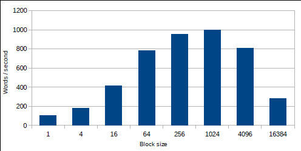
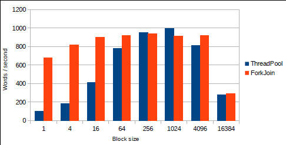
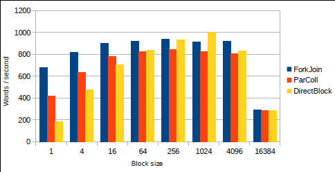

# Java 和 Scala 并发性基础
了解 Java 语言中的并发性和 Scala 提供的附加选项

**标签:** Akka,Java,消息传递

[原文链接](https://developer.ibm.com/zh/articles/j-jvmc1/)

Dennis Sosnoski

发布: 2014-05-12

* * *

处理器速度数十年来一直持续快速发展，并在世纪交替之际走到了终点。从那时起，处理器制造商更多地是通过增加核心而不再是通过增加时钟速率来提高芯片性能。多核系统现在成为了从手机到企业服务器等所有设备的标准，而这种趋势可能继续并有所加速。开发人员越来越需要在他们的应用程序代码中支持多个核心，这样才能满足性能需求。

在本系列文章中，您将了解一些针对 Java 和 Scala 语言的并发编程的新方法，包括 Java 如何将 Scala 和其他基于 JVM 的语言中已经探索出来的理念结合在一起。第一期文章通过介绍 Java 7 和 Scala 的一些最新技术来帮助您了解 JVM 并发性编程概貌。您将了解如何使用 Java `ExecutorService` 和 `ForkJoinPool` 类来简化并发编程。还将了解一些将并发编程选项扩展到普通 Java 已有功能之外的基本 Scala 特性。在此过程中，您会看到不同的方法对并发编程性能有何影响。后续几期文章将会介绍 Java 8 中的并发性改进和一些扩展，包括用于执行可扩展的 Java 和 Scala 编程的 [Akka](http://akka.io/) 工具包。

## Java 并发性支持

在 Java 平台诞生之初，并发性支持就是它的一个特性，线程和同步的实现为它提供了超越其他竞争语言的优势。Scala 基于 Java 并在 JVM 上运行，能够直接访问所有 Java 运行时（包括所有并发性支持）。所以在分析 Scala 特性之前，我首先会快速回顾一下 Java 语言已经提供的功能。

##### 关于本系列

由于多核系统普遍存在，并发性编程的应用无疑比以往任何时候都要广泛。但并发性很难正确实现，用户需要借助工具来为他们提供帮助。很多基于 JVM 的语言都属于这类开发工具，Scala 在此领域尤为活跃。此系列文章将介绍一些针对 Java 和 Scala 语言的较新的并发性编程方法。

#### Java 线程基础

在 Java 编程过程中创建和使用线程非常容易。它们由 `java.lang.Thread` 类表示，线程要执行的代码为 `java.lang.Runnable` 实例的形式。如果需要的话，可以在应用程序中创建大量线程，您甚至可以创建数千个线程。在有多个核心时，JVM 使用它们来并发执行多个线程；超出核心数量的线程会共享这些核心。

##### Java 5：并发性的转折点

Java 从一开始就包含对线程和同步的支持。但在线程间共享数据的最初规范不够完善，这带来了 Java 5 的 Java 语言更新中的重大变化 (JSR-133)。Java Language Specification for Java 5 更正并规范化了 `synchronized` 和 `volatile` 操作。该规范还规定不变的对象如何使用多线程。（基本上讲，只要在执行构造函数时不允许引用 “转义”，不变的对象始终是线程安全的。）以前，线程间的交互通常需要使用阻塞的 `synchronized` 操作。这些更改支持使用 `volatile` 在线程间执行非阻塞协调。因此，在 Java 5 中添加了新的并发集合类来支持非阻塞操作  这与早期仅支持阻塞的线程安全方法相比是一项重大改进。

线程操作的协调难以让人理解。只要从程序的角度让所有内容保持一致，Java 编译器和 JVM 就不会对您代码中的操作重新排序，这使得问题变得更加复杂。例如：如果两个相加操作使用了不同的变量，编译器或 JVM 可以安装与指定的顺序相反的顺序执行这些操作，只要程序不在两个操作都完成之前使用两个变量的总数。这种重新排序操作的灵活性有助于提高 Java 性能，但一致性只被允许应用在单个线程中。硬件也有可能带来线程问题。现代系统使用了多种缓存内存机制，一般来讲，不是系统中的所有核心都能同样看到这些缓存。当某个核心修改内存中的一个值时，其他核心可能不会立即看到此更改。

由于这些问题，在一个线程使用另一个线程修改的数据时，您必须显式地控制线程交互方式。Java 使用了特殊的操作来提供这种控制，在不同线程看到的数据视图中建立顺序。基本操作是，线程使用 `synchronized` 关键字来访问一个对象。当某个线程在一个对象上保持同步时，该线程将会获得此对象所独有的一个锁的独占访问。如果另一个线程已持有该锁，等待获取该锁的线程必须等待，或者被 _阻塞_ ，直到该锁被释放。当该线程在一个 `synchronized` 代码块内恢复执行时，Java 会保证该线程可以 “看到了” 以前持有同一个锁的其他线程写入的所有数据，但只是这些线程通过离开自己的 `synchronized` 块来释放该锁之前写入的数据。这种保证既适用于编译器或 JVM 所执行的操作的重新排序，也适用于硬件内存缓存。一个 `synchronized` 块的内部是您代码中的一个稳定性孤岛，其中的线程可依次安全地执行、交互和共享信息。

在变量上对 `volatile` 关键字的使用，为线程间的安全交互提供了一种稍微较弱的形式。 `synchronized` 关键字可确保在您获取该锁时可以看到其他线程的存储，而且在您之后，获取该锁的其他线程也会看到您的存储。 `volatile` 关键字将这一保证分解为两个不同的部分。如果一个线程向 `volatile` 变量写入数据，那么首先将会擦除它在这之前写入的数据。如果某个线程读取该变量，那么该线程不仅会看到写入该变量的值，还会看到写入的线程所写入的其他所有值。所以读取一个 `volatile` 变量会提供与 _输入_ 一个 `synchronized` 块相同的内存保证，而且写入一个 `volatile` 变量会提供与 _离开_ 一个 `synchronized` 块相同的内存保证。但二者之间有很大的差别： `volatile` 变量的读取或写入绝不会受阻塞。

#### 抽象 Java 并发性

同步很有用，而且许多多线程应用程序都是在 Java 中仅使用基本的 `synchronized` 块开发出来的。但协调线程可能很麻烦，尤其是在处理许多线程和许多锁的时候。确保线程仅在安全的方式下交互 _并_ 避免潜在的死锁（两个或更多线程等待对方释放锁之后才能继续执行），这很困难。支持并发性而不直接处理线程和锁的抽象，这为开发人员提供了处理常见用例的更好方法。

`java.util.concurrent` 分层结构包含一些集合变形，它们支持并发访问、针对原子操作的包装器类，以及同步原语。这些类中的许多都是为支持非阻塞访问而设计的，这避免了死锁的问题，而且实现了更高效的线程。这些类使得定义和控制线程之间的交互变得更容易，但他们仍然面临着基本线程模型的一些复杂性。

`java.util.concurrent` 包中的一对抽象，支持采用一种更加分离的方法来处理并发性： `Future<T>` 接口、 `Executor` 和 `ExecutorService` 接口。这些相关的接口进而成为了对 Java 并发性支持的许多 Scala 和 Akka 扩展的基础，所以更详细地了解这些接口和它们的实现是值得的。

`Future<T>` 是一个 `T` 类型的值的持有者，但奇怪的是该值一般在创建 `Future` 之后才能使用。在并发执行过程中，这个值可能是异步操作返回的。收到 `Future` 的线程可调用方法来：

- 查看该值是否可用
- 等待该值变为可用
- 在该值可用时获取它
- 如果不再需要该值，则取消该操作

`Future` 的具体实现结构支持处理异步操作的不同方式。

`Executor` 是一种围绕某个执行任务的东西的抽象。这个 “东西” 最终将是一个线程，但该接口隐藏了该线程处理执行的细节。 `Executor` 本身的适用性有限， `ExecutorService` 子接口提供了管理终止的扩展方法，并为任务的结果生成了 `Future` 。 `Executor` 的所有标准实现还会实现 `ExecutorService` ，所以实际上，您可以忽略根接口。

线程是相对重量级的资源，而且与分配并丢弃它们相比，重用它们更有意义。 `ExecutorService` 简化了线程间的工作共享，还支持自动重用线程，实现了更轻松的编程和更高的性能。 `ExecutorService` 的 `ThreadPoolExecutor` 实现管理着一个执行任务的线程池。

#### 应用 Java 并发性

并发性的实际应用常常涉及到需要与您的主要处理逻辑独立的外部交互的任务（与用户、存储或其他系统的交互）。这类应用很难浓缩为一个简单的示例，所以在演示并发性的时候，人们通常会使用简单的计算密集型任务，比如数学计算或排序。我将使用一个类似的示例。

任务是找到离一个未知的输入最近的已知单词，其中的 _最近_ 是按照 _Levenshtein 距离_ 来定义的：将输入转换为已知的单词所需的最少的字符增加、删除或更改次数。我使用的代码基于 Wikipedia 上的 [Levenshtein 距离](http://en.wikipedia.org/wiki/Levenshtein_distance) 文章中的一个示例，该示例计算了每个已知单词的 Levenshtein 距离，并返回最佳匹配值（或者如果多个已知的单词拥有相同的距离，那么返回结果是不确定的）。

清单 1 给出了计算 Levenshtein 距离的 Java 代码。该计算生成一个矩阵，将行和列与两个对比的文本的大小进行匹配，在每个维度上加 1。为了提高效率，此实现使用了一对大小与目标文本相同的数组来表示矩阵的连续行，将这些数组包装在每个循环中，因为我只需要上一行的值就可以计算下一行。

##### 清单 1\. Java 中的 Levenshtein 距离计算

```
/**
* Calculate edit distance from targetText to known word.
*
* @param word known word
* @param v0 int array of length targetText.length() + 1
* @param v1 int array of length targetText.length() + 1
* @return distance
*/
private int editDistance(String word, int[] v0, int[] v1) {

    // initialize v0 (prior row of distances) as edit distance for empty 'word'
    for (int i = 0; i < v0.length; i++) {
        v0[i] = i;
    }

    // calculate updated v0 (current row distances) from the previous row v0
    for (int i = 0; i < word.length(); i++) {

        // first element of v1 = delete (i+1) chars from target to match empty 'word'
        v1[0] = i + 1;

        // use formula to fill in the rest of the row
        for (int j = 0; j < targetText.length(); j++) {
            int cost = (word.charAt(i) == targetText.charAt(j)) ? 0 : 1;
            v1[j + 1] = minimum(v1[j] + 1, v0[j + 1] + 1, v0[j] + cost);
        }

        // swap v1 (current row) and v0 (previous row) for next iteration
        int[] hold = v0;
        v0 = v1;
        v1 = hold;
    }

    // return final value representing best edit distance
    return v0[targetText.length()];
}

```

Show moreShow more icon

如果有大量已知词汇要与未知的输入进行比较，而且您在一个多核系统上运行，那么您可以使用并发性来加速处理：将已知单词的集合分解为多个块，将每个块作为一个独立任务来处理。通过更改每个块中的单词数量，您可以轻松地更改任务分解的粒度，从而了解它们对总体性能的影响。清单 2 给出了分块计算的 Java 代码，摘自 [示例代码](https://github.com/dsosnoski/concur1) 中的 `ThreadPoolDistance` 类。清单 2 使用一个标准的 `ExecutorService` ，将线程数量设置为可用的处理器数量。

##### 清单 2\. 在 Java 中通过多个线程来执行分块的距离计算

```
private final ExecutorService threadPool;
private final String[] knownWords;
private final int blockSize;

public ThreadPoolDistance(String[] words, int block) {
    threadPool = Executors.newFixedThreadPool(Runtime.getRuntime().availableProcessors());
    knownWords = words;
    blockSize = block;
}

public DistancePair bestMatch(String target) {

    // build a list of tasks for matching to ranges of known words
    List<DistanceTask> tasks = new ArrayList<DistanceTask>();

    int size = 0;
    for (int base = 0; base < knownWords.length; base += size) {
        size = Math.min(blockSize, knownWords.length - base);
        tasks.add(new DistanceTask(target, base, size));
    }
    DistancePair best;
    try {

        // pass the list of tasks to the executor, getting back list of futures
        List<Future<DistancePair>> results = threadPool.invokeAll(tasks);

        // find the best result, waiting for each future to complete
        best = DistancePair.WORST_CASE;
        for (Future<DistancePair> future: results) {
            DistancePair result = future.get();
            best = DistancePair.best(best, result);
        }

    } catch (InterruptedException e) {
        throw new RuntimeException(e);
    } catch (ExecutionException e) {
        throw new RuntimeException(e);
    }
    return best;
}

/**
* Shortest distance task implementation using Callable.
*/
public class DistanceTask implements Callable<DistancePair>
{
    private final String targetText;
    private final int startOffset;
    private final int compareCount;

    public DistanceTask(String target, int offset, int count) {
        targetText = target;
        startOffset = offset;
        compareCount = count;
    }

    private int editDistance(String word, int[] v0, int[] v1) {
        ...
    }

    /* (non-Javadoc)
     * @see java.util.concurrent.Callable#call()
     */
    @Override
    public DistancePair call() throws Exception {

        // directly compare distances for comparison words in range
        int[] v0 = new int[targetText.length() + 1];
        int[] v1 = new int[targetText.length() + 1];
        int bestIndex = -1;
        int bestDistance = Integer.MAX_VALUE;
        boolean single = false;
        for (int i = 0; i < compareCount; i++) {
            int distance = editDistance(knownWords[i + startOffset], v0, v1);
            if (bestDistance > distance) {
                bestDistance = distance;
                bestIndex = i + startOffset;
                single = true;
            } else if (bestDistance == distance) {
                single = false;
            }
        }
        return single ? new DistancePair(bestDistance, knownWords[bestIndex]) :
                new DistancePair(bestDistance);
    }
}

```

Show moreShow more icon

清单 2 中的 `bestMatch()` 方法构造一个 `DistanceTask` 实例列表，然后将该列表传递给 `ExecutorService` 。这种对 `ExecutorService` 的调用形式将会接受一个 `Collection<? extends Callable<T>>` 类型的参数，该参数表示要执行的任务。该调用返回一个 `Future<T>` 列表，用它来表示执行的结果。 `ExecutorService` 使用在每个任务上调用 `call()` 方法所返回的值，异步填写这些结果。在本例中， `T` 类型为 `DistancePair` — 一个表示距离和匹配的单词的简单的值对象，或者在没有找到惟一匹配值时近表示距离。

`bestMatch()` 方法中执行的原始线程依次等待每个 `Future` 完成，累积最佳的结果并在完成时返回它。通过多个线程来处理 `DistanceTask` 的执行，原始线程只需等待一小部分结果。剩余结果可与原始线程等待的结果并发地完成。

#### 并发性性能

要充分利用系统上可用的处理器数量，必须为 `ExecutorService` 配置至少与处理器一样多的线程。您还必须将至少与处理器一样多的任务传递给 `ExecutorService` 来执行。实际上，您或许希望拥有比处理器多得多的任务，以实现最佳的性能。这样，处理器就会繁忙地处理一个接一个的任务，近在最后才空闲下来。但是因为涉及到开销（在创建任务和 future 的过程中，在任务之间切换线程的过程中，以及最终返回任务的结果时），您必须保持任务足够大，以便开销是按比例减小的。

图 1 展示了我在使用 Oracle 的 Java 7 for 64-bit Linux® 的四核 AMD 系统上运行测试代码时测量的不同任务数量的性能。每个输入单词依次与 12,564 个已知单词相比较，每个任务在一定范围的已知单词中找到最佳的匹配值。全部 933 个拼写错误的输入单词会重复运行，每轮运行之间会暂停片刻供 JVM 处理，该图中使用了 10 轮运行后的最佳时间。从图 1 中可以看出，每秒的输入单词性能在合理的块大小范围内（基本来讲，从 256 到大于 1,024）看起来是合理的，只有在任务变得非常小或非常大时，性能才会极速下降。对于块大小 16,384，最后的值近创建了一个任务，所以显示了单线程性能。

##### 图 1\. `ThreadPoolDistance` 性能



#### Fork-Join

Java 7 引入了 `ExecutorService` 的另一种实现： `ForkJoinPool` 类。 `ForkJoinPool` 是为高效处理可反复分解为子任务的任务而设计的，它使用 `RecursiveAction` 类（在任务未生成结果时）或 `RecursiveTask<T>` 类（在任务具有一个 `T` 类型的结果时）来处理任务。 `RecursiveTask<T>` 提供了一种合并子任务结果的便捷方式，如清单 3 所示。

##### 清单 3\. `RecursiveTask<DistancePair>` 示例

```
private ForkJoinPool threadPool = new ForkJoinPool();

private final String[] knownWords;

private final int blockSize;

public ForkJoinDistance(String[] words, int block) {
    knownWords = words;
    blockSize = block;
}

public DistancePair bestMatch(String target) {
    return threadPool.invoke(new DistanceTask(target, 0, knownWords.length, knownWords));
}

/**
* Shortest distance task implementation using RecursiveTask.
*/
public class DistanceTask extends RecursiveTask<DistancePair>
{
    private final String compareText;
    private final int startOffset;
    private final int compareCount;
    private final String[] matchWords;

    public DistanceTask(String from, int offset, int count, String[] words) {
        compareText = from;
        startOffset = offset;
        compareCount = count;
        matchWords = words;
    }

    private int editDistance(int index, int[] v0, int[] v1) {
        ...
    }

    /* (non-Javadoc)
     * @see java.util.concurrent.RecursiveTask#compute()
     */
    @Override
    protected DistancePair compute() {
        if (compareCount > blockSize) {

            // split range in half and find best result from bests in each half of range
            int half = compareCount / 2;
            DistanceTask t1 = new DistanceTask(compareText, startOffset, half, matchWords);
            t1.fork();
            DistanceTask t2 = new DistanceTask(compareText, startOffset + half,
                compareCount - half, matchWords);
            DistancePair p2 = t2.compute();
            return DistancePair.best(p2, t1.join());
        }

        // directly compare distances for comparison words in range
        int[] v0 = new int[compareText.length() + 1];
        int[] v1 = new int[compareText.length() + 1];
        int bestIndex = -1;
        int bestDistance = Integer.MAX_VALUE;
        boolean single = false;
        for (int i = 0; i < compareCount; i++) {
            int distance = editDistance(i + startOffset, v0, v1);
            if (bestDistance > distance) {
                bestDistance = distance;
                bestIndex = i + startOffset;
                single = true;
            } else if (bestDistance == distance) {
                single = false;
            }
        }
        return single ? new DistancePair(bestDistance, knownWords[bestIndex]) :
            new DistancePair(bestDistance);
    }
}

```

Show moreShow more icon

图 2 显示了清单 3 中的 `ForkJoin` 代码与 [清单 2](#在-java-中通过多个线程来执行分块的距离计算) 中的 `ThreadPool` 代码的性能对比。 `ForkJoin` 代码在所有块大小中稳定得多，仅在您只有单个块（意味着执行是单线程的）时性能会显著下降。标准的 `ThreadPool` 代码仅在块大小为 256 和 1,024 时会表现出更好的性能。

##### 图 2\. `ThreadPoolDistance` 与 `ForkJoinDistance` 的性能对比



这些结果表明，如果可调节应用程序中的任务大小来实现最佳的性能，那么使用标准 `ThreadPool` 比 `ForkJoin` 更好。但请注意， `ThreadPool` 的 “最佳性能点” 取决于具体任务、可用处理器数量以及您系统的其他因素。一般而言， `ForkJoin` 以最小的调优需求带来了优秀的性能，所以最好尽可能地使用它。

## Scala 并发性基础

Scala 通过许多方式扩展了 Java 编程语言和运行时，其中包括添加更多、更轻松的处理并发性的方式。对于初学者而言， `Future<T>` 的 Scala 版本比 Java 版本灵活得多。您可以直接从代码块中创建 future，可向 future 附加回调来处理这些 future 的完成。清单 4 显示了 Scala future 的一些使用示例。该代码首先定义了 `futureInt()` 方法，以便按需提供 `Future<Int>` ，然后通过三种不同的方式来使用 future。

##### 清单 4\. Scala `Future<T>` 示例代码

```
import ExecutionContext.Implicits.global

val lastInteger = new AtomicInteger
def futureInt() = future {
Thread sleep 2000
lastInteger incrementAndGet
}

// use callbacks for completion of futures
val a1 = futureInt
val a2 = futureInt
a1.onSuccess {
    case i1 => {
      a2.onSuccess {
        case i2 => println("Sum of values is " + (i1 + i2))
      }
    }
}
Thread sleep 3000

// use for construct to extract values when futures complete
val b1 = futureInt
val b2 = futureInt
for (i1 <- b1; i2 <- b2) yield println("Sum of values is " + (i1 + i2))
Thread sleep 3000

// wait directly for completion of futures
val c1 = futureInt
val c2 = futureInt
println("Sum of values is " + (Await.result(c1, Duration.Inf) +
Await.result(c2, Duration.Inf)))

```

Show moreShow more icon

清单 4 中的第一个示例将回调闭包附加到一对 future 上，以便在两个 future 都完成时，将两个结果值的和打印到控制台上。回调是按照创建它们的顺序直接嵌套在 future 上，但是，即使更改顺序，它们也同样有效。如果在您附加回调时 future 已完成，该回调仍会运行，但无法保证它会立即运行。原始执行线程会在 `Thread sleep 3000` 行上暂停，以便在进入下一个示例之前完成 future。

第二个示例演示了使用 Scala `for` comprehension\_ 从 future 中异步提取值，然后直接在表达式中使用它们。 `for` comprehension 是一种 Scala 结构，可用于简洁地表达复杂的操作组合（ `map` 、 `filter` 、 `flatMap` 和 `foreach` ）。它一般与各种形式的集合结合使用，但 Scala future 实现了相同的单值方法来访问集合值。所以可以使用 future 作为一种特殊的集合，一种包含最多一个值（可能甚至在未来某个时刻之前之后才包含该值）的集合。在这种情况下， `for` 语句要求获取 future 的结果，并在表达式中使用这些结果值。在幕后，这种技术会生成与第一个示例完全相同的代码，但以线性代码的形式编写它会得到更容易理解的更简单的表达式。和第一个示例一样，原始执行线程会暂停，以便在进入下一个示例之前完成 future。

第三个示例使用阻塞等待来获取 future 的结果。这与 Java future 的工作原理相同，但在 Scala 中，一个获取最大等待时间参数的特殊 `Await.result()` 方法调用会让阻塞等待变得更为明显。

[清单 4](#清单-4-code-scala-code-future-lt-t-gt-code-示例代码) 中的代码没有显式地将 future 传递给 `ExecutorService` 或等效的对象，所以如果没有使用过 Scala，那么您可能想知道 future 内部的代码是如何执行的。答案取决于 [清单 4](#清单-4-code-scala-code-future-lt-t-gt-code-示例代码) 中最上面一行： `import ExecutionContext.Implicits.global` 。Scala API 常常为代码块中频繁重用的参数使用 `implicit` 值。 `future { }` 结构要求 `ExecutionContext` 以隐式参数的形式提供。这个 `ExecutionContext` 是 Java `ExecutorService` 的一个 Scala 包装器，以相同方式用于使用一个或多个托管线程来执行任务。

除了 future 的这些基本操作之外，Scala 还提供了一种方式将任何集合转换为使用并行编程的集合。将集合转换为并行格式后，您在集合上执行的任何标准的 Scala 集合操作（比如 `map` 、 `filter` 或 `fold` ）都会自动地尽可能并行完成。（本文稍后会在 [清单 7](#清单-7-scala-中使用多个线程的一次阻塞距离计算) 中提供一个相关示例，该示例使用 Scala 查找一个单词的最佳匹配值。）

#### 错误处理

Java 和 Scala 中的 future 都必须解决错误处理的问题。在 Java 中，截至 Java 7，future 可抛出一个 `ExecutionException` 作为返回结果的替代方案。应用程序可针对具体的失败类型而定义自己的 `ExecutionException` 子类，或者通过异常链来传递详细信息，但这限制了灵活性。

Scala future 提供了更灵活的错误处理。您可以通过两种方式完成 Scala future：成功时提供一个结果值（假设要求一个结果值），或者在失败时提供一个关联的 `Throwable` 。您也可以采用多种方式处理 future 的完成。在 [清单 4](#清单-4-code-scala-code-future-lt-t-gt-code-示例代码) 中， `onSuccess` 方法用于附加回调来处理 future 的成功完成。您还可以使用 `onComplete` 来处理任何形式的完成（它将结果或 throwable 包装在一个 `Try` 中来适应两种情况），或者使用 `onFailure` 来专门处理错误结果。Scala future 的这种灵活性扩展到了您可以使用 future 执行的所有操作，所以您可以将错误处理直接集成到代码中。

这个 Scala `Future<T>` 还有一个紧密相关的 `Promise<T>` 类。future 是一个结果的持有者，该结果在某个时刻可能可用（或不可用 — 无法内在地确保一个 future 将完成）。future 完成后，结果是固定的，不会发生改变。promise 是这个相同契约的另一端：结果的一个一次性、可分配的持有者，具有结果值或 throwable 的形式。可从 promise 获取 future，在 promise 上设置了结果后，就可以在该 future 上设置此结果。

#### 应用 Scala 并发性

现在您已熟悉一些基本的 Scala 并发性概念，是时候来了解一下解决 Levenshtein 距离问题的代码了。清单 5 显示了 Levenshtein 距离计算的一个比较符合语言习惯的 Scala 实现，该代码基本上与 [清单 1](#清单-1-java-中的-levenshtein-距离计算) 中的 Java 代码类似，但采用了函数风格。

##### 清单 5\. Scala 中的 Levenshtein 距离计算

```
val limit = targetText.length
/** Calculate edit distance from targetText to known word.
*
* @param word known word
* @param v0 int array of length targetText.length + 1
* @param v1 int array of length targetText.length + 1
* @return distance
*/
def editDistance(word: String, v0: Array[Int], v1: Array[Int]) = {

val length = word.length

@tailrec
def distanceByRow(rnum: Int, r0: Array[Int], r1: Array[Int]): Int = {
    if (rnum >= length) r0(limit)
    else {

      // first element of r1 = delete (i+1) chars from target to match empty 'word'
      r1(0) = rnum + 1

      // use formula to fill in the rest of the row
      for (j <- 0 until limit) {
        val cost = if (word(rnum) == targetText(j)) 0 else 1
        r1(j + 1) = min(r1(j) + 1, r0(j + 1) + 1, r0(j) + cost);
      }

      // recurse with arrays swapped for next row
      distanceByRow(rnum + 1, r1, r0)
    }
}

// initialize v0 (prior row of distances) as edit distance for empty 'word'
for (i <- 0 to limit) v0(i) = i

// recursively process rows matching characters in word being compared to find best
distanceByRow(0, v0, v1)
}

```

Show moreShow more icon

[清单 5](# #清单-5-scala-中的-levenshtein-距离计算) 中的代码对每个行值计算使用了尾部递归 `distanceByRow()` 方法。此方法首先检查计算了多少行，如果该数字与检查的单词中的字符数匹配，则返回结果距离。否则会计算新的行值，然后递归地调用自身来计算下一行（将两个行数组包装在该进程中，以便正确地传递新的最新的行值）。Scala 将尾部递归方法转换为与 Java `while` 循环等效的代码，所以保留了与 Java 代码的相似性。

但是，此代码与 Java 代码之间有一个重大区别。 [清单 5](# #清单-5-scala-中的-levenshtein-距离计算) 中的 `for` comprehension 使用了闭包。闭包并不总是得到了当前 JVM 的高效处理（参阅 [Why is using for/foreach on a Range slow?](http://www.scalablescala.com/roller/scala/entry/why_is_using_for_foreach) ，了解有关的详细信息），所以它们在该计算的最里层循环上增加了大量开销。如上所述， [清单 5](# #清单-5-scala-中的-levenshtein-距离计算) 中的代码的运行速度没有 Java 版本那么快。清单 6 重写了代码，将 `for` comprehension 替换为添加的尾部递归方法。这个版本要详细得多，但执行效率与 Java 版本相当。

##### 清单 6\. 为提升性能而重新构造的计算代码

```
val limit = targetText.length

/** Calculate edit distance from targetText to known word.
*
* @param word known word
* @param v0 int array of length targetText.length + 1
* @param v1 int array of length targetText.length + 1
* @return distance
*/
def editDistance(word: String, v0: Array[Int], v1: Array[Int]) = {

val length = word.length

@tailrec
def distanceByRow(row: Int, r0: Array[Int], r1: Array[Int]): Int = {
    if (row >= length) r0(limit)
    else {

      // first element of v1 = delete (i+1) chars from target to match empty 'word'
      r1(0) = row + 1

      // use formula recursively to fill in the rest of the row
      @tailrec
      def distanceByColumn(col: Int): Unit = {
        if (col < limit) {
          val cost = if (word(row) == targetText(col)) 0 else 1
          r1(col + 1) = min(r1(col) + 1, r0(col + 1) + 1, r0(col) + cost)
          distanceByColumn(col + 1)
        }
      }
      distanceByColumn(0)

      // recurse with arrays swapped for next row
      distanceByRow(row + 1, r1, r0)
    }
}

// initialize v0 (prior row of distances) as edit distance for empty 'word'
@tailrec
def initArray(index: Int): Unit = {
    if (index <= limit) {
      v0(index) = index
      initArray(index + 1)
    }
}
initArray(0)

// recursively process rows matching characters in word being compared to find best
distanceByRow(0, v0, v1)
}

```

Show moreShow more icon

清单 7 给出的 Scala 代码执行了与 [清单 2](#清单-2-在-java-中通过多个线程来执行分块的距离计算) 中的 Java 代码相同的阻塞的距离计算。 `bestMatch()` 方法找到由 `Matcher` 类实例处理的特定单词块中与目标文本最匹配的单词，使用尾部递归 `best()` 方法来扫描单词。 `*Distance` 类创建多个 `Matcher` 实例，每个对应一个单词块，然后协调匹配结果的执行和组合。

##### 清单 7\. Scala 中使用多个线程的一次阻塞距离计算

```
class Matcher(words: Array[String]) {

def bestMatch(targetText: String) = {

    val limit = targetText.length
    val v0 = new Array[Int](limit + 1)
    val v1 = new Array[Int](limit + 1)

    def editDistance(word: String, v0: Array[Int], v1: Array[Int]) = {
      ...
    }

    @tailrec
    /** Scan all known words in range to find best match.
      *
      * @param index next word index
      * @param bestDist minimum distance found so far
      * @param bestMatch unique word at minimum distance, or None if not unique
      * @return best match
      */
    def best(index: Int, bestDist: Int, bestMatch: Option[String]): DistancePair =
      if (index < words.length) {
        val newDist = editDistance(words(index), v0, v1)
        val next = index + 1
        if (newDist < bestDist) best(next, newDist, Some(words(index)))
        else if (newDist == bestDist) best(next, bestDist, None)
        else best(next, bestDist, bestMatch)
      } else DistancePair(bestDist, bestMatch)

    best(0, Int.MaxValue, None)
}
}

class ParallelCollectionDistance(words: Array[String], size: Int) extends TimingTestBase {

val matchers = words.grouped(size).map(l => new Matcher(l)).toList

def shutdown = {}

def blockSize = size

/** Find best result across all matchers, using parallel collection. */
def bestMatch(target: String) = {
    matchers.par.map(m => m.bestMatch(target)).
      foldLeft(DistancePair.worstMatch)((a, m) => DistancePair.best(a, m))
}
}

class DirectBlockingDistance(words: Array[String], size: Int) extends TimingTestBase {

val matchers = words.grouped(size).map(l => new Matcher(l)).toList

def shutdown = {}

def blockSize = size

/** Find best result across all matchers, using direct blocking waits. */
def bestMatch(target: String) = {
    import ExecutionContext.Implicits.global
    val futures = matchers.map(m => future { m.bestMatch(target) })
    futures.foldLeft(DistancePair.worstMatch)((a, v) =>
      DistancePair.best(a, Await.result(v, Duration.Inf)))
}
}

```

Show moreShow more icon

清单 7 中的两个 `*Distance` 类显示了协调 `Matcher` 结果的执行和组合的不同方式。 `ParallelCollectionDistance` 使用前面提到的 Scala 的并行集合 feature 来隐藏并行计算的细节，只需一个简单的 `foldLeft` 就可以组合结果。

`DirectBlockingDistance` 更加明确，它创建了一组 future，然后在该列表上为每个结果使用一个 `foldLeft` 和嵌套的阻塞等待。

#### 性能再分析

[清单 7](#清单-7-scala-中使用多个线程的一次阻塞距离计算) 中的两个 `*Distance` 实现都是处理 `Matcher` 结果的合理方法。（它们不仅合理，而且非常高效。 [示例代码](https://github.com/dsosnoski/concur1) 包含我在试验中尝试的其他两种实现，但未包含在本文中。）在这种情况下，性能是一个主要问题，所以图 3 显示了这些实现相对于 Java `ForkJoin` 代码的性能。

##### 图 3\. `ForkJoinDistance` 与 Scala 替代方案的性能对比



图 3 显示，Java `ForkJoin` 代码的性能比每种 Scala 实现都更好，但 `DirectBlockingDistance` 在 1,024 的块大小下提供了更好的性能。两种 Scala 实现在大部分块大小下，都提供了比 [清单 1](#清单-1-java-中的-levenshtein-距离计算) 中的 `ThreadPool` 代码更好的性能。

这些性能结果仅是演示结果，不具权威性。如果您在自己的系统上运行计时测试，可能会看到不同的性能，尤其在使用不同数量的核心的时候。如果希望为距离任务获得最佳的性能，那么可以实现一些优化：可以按照长度对已知单词进行排序，首先与长度和输入相同的单词进行比较（因为编辑距离总是不低于与单词长度之差）。或者我可以在距离计算超出之前的最佳值时，提前退出计算。但作为一个相对简单的算法，此试验公平地展示了两种并发操作是如何提高性能的，以及不同的工作共享方法的影响。

在性能方面， [清单 7](#清单-7-scala-中使用多个线程的一次阻塞距离计算) 中的 Scale 控制代码与 [清单 2](#清单-2-在-java-中通过多个线程来执行分块的距离计算) 和 [清单 3](#清单-3-code-recursivetask-lt-distancepair-gt-code-示例) 中的 Java 代码的对比结果很有趣。Scala 代码短得多，而且（假设您熟悉 Scala！）比 Java 代码更清晰。Scala 和 Java 可很好的相互操作，您可以在本文的 [完整示例代码](https://github.com/dsosnoski/concur1) 中看到：Scala 代码对 Scala 和 Java 代码都运行了计时测试，Java 代码进而直接处理 Scala 代码的各部分。得益于这种轻松的互操作性，您可以将 Scala 引入现有的 Java 代码库中，无需进行通盘修改。最初使用 Scala 为 Java 代码实现高水平控制常常很有用，这样您就可以充分利用 Scala 强大的表达特性，同时没有闭包或转换的任何重大性能影响。

[清单 7](#清单-7-scala-中使用多个线程的一次阻塞距离计算) 中的 `ParallelCollectionDistance` Scala 代码的简单性非常具有吸引力。使用此方法，您可以从代码中完全抽象出并发性，从而编写类似单线程应用程序的代码，同时仍然获得多个处理器的优势。幸运的是，对于喜欢此方法的简单性但又不愿意或无法执行 Scala 开发的人而言，Java 8 带来了一种执行直接的 Java 编程的类似特性。

## 结束语

现在您已经了解了 Java 和 Scala 并发性操作的基础知识，本系列下一篇文章将介绍 Java 8 如何改进对 Java 的并发性支持（以及从长远来讲，可能对 Scala 的并发性支持）。Java 8 的许多改动您看起来可能都很熟悉（Scala 并发性特性中使用的许多相同的概念都包含在 Java 8 中），所以您很快就能够在普通的 Java 代码中使用一些 Scala 技术。请阅读下一期文章，了解应该如何做。

本文翻译自： [Java and Scala concurrency basics](https://developer.ibm.com/articles/j-jvmc1/)（2014-03-25）