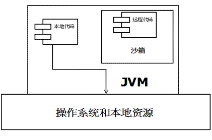
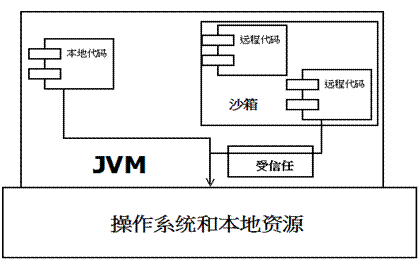
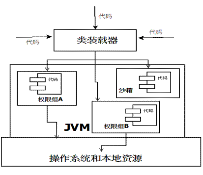
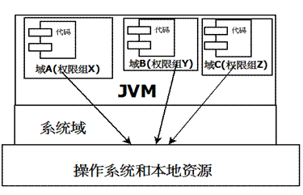

# Java 安全模型介绍
Java 中安全模型框架，并用样例程序来讲解安全访问控制的使用

**标签:** Java

[原文链接](https://developer.ibm.com/zh/articles/j-lo-javasecurity/)

刘进

发布: 2012-12-27

* * *

作为一种诞生于互联网兴起时代的语言，Java 从一开始就带有安全上的考虑，如何保证通过互联网下载到本地的 Java 程序是安全的，如何对 Java 程序访问本地资源权限进行有限授权，这些安全角度的考虑一开始就影响到 Java 语言的设计与实现。可以说 Java 在这些方面的探索与经验，对后来的一些语言与产品都带来了积极影响。

本篇文章中将介绍 Java 中安全模型，以及如何利用安全访问控制机制来实现一些特定目的。

## Java 中的安全模型

在 Java 中将执行程序分成本地和远程两种，本地代码默认视为可信任的，而远程代码则被看作是不受信的。对于授信的本地代码，可以访问一切本地资源。而对于非授信的远程代码在早期的 Java 实现中，安全依赖于沙箱 (Sandbox) 机制。沙箱机制就是将 Java 代码限定在虚拟机 (JVM) 特定的运行范围中，并且严格限制代码对本地系统的资源访问，通过这样的措施来保证对远程代码的有效隔离，防止对本地系统造成破坏。如图 1 所示，

##### 图 1.JDK1.0 安全模型



但如此严格的安全机制也给程序的功能扩展带来障碍，比如当用户希望远程代码访问本地系统的文件时候，就无法实现。因此在后续的 Java1.1 版本中，针对安全机制做了改进，增加了安全策略，允许用户指定代码对本地资源的访问权限。如图 2 所示，

##### 图 2.JDK1.1 安全模型



在 Java1.2 版本中，再次改进了安全机制，增加了代码签名。不论本地代码或是远程代码，都会按照用户的安全策略设定，由类加载器加载到虚拟机中权限不同的运行空间，来实现差异化的代码执行权限控制。如图 3 所示，

##### 图 3.JDK1.2 安全模型



当前最新的安全机制实现，则引入了域 (Domain) 的概念。虚拟机会把所有代码加载到不同的系统域和应用域，系统域部分专门负责与关键资源进行交互，而各个应用域部分则通过系统域的部分代理来对各种需要的资源进行访问。虚拟机中不同的受保护域 (Protected Domain)，对应不一样的权限 (Permission)。存在于不同域中的类文件就具有了当前域的全部权限，如图 4 所示：

##### 图 4\. 最新安全模型



以上提到的都是基本的 Java 安全模型概念，在应用开发中还有一些关于安全的复杂用法，其中最常用到的 API 就是 doPrivileged。doPrivileged 方法能够使一段受信任代码获得更大的权限，甚至比调用它的应用程序还要多，可做到临时访问更多的资源。有时候这是非常必要的，可以应付一些特殊的应用场景。例如，应用程序可能无法直接访问某些系统资源，但这样的应用程序必须得到这些资源才能够完成功能。针对这种情况，Java SDK 给域提供了 doPrivileged 方法，让程序突破当前域权限限制，临时扩大访问权限。下面内容会详细讲解一下安全相关的方法使用。

## Java 安全控制实现

Java SDK 中与安全相关的类和接口都放在 java.security 包中，其中既包括访问控制配置及细粒度访问控制框架的实现，还包括签名和加解密的实现。本文中涉及到的安全访问控制主要与安全包中访问控制框架相关，这里面最常用的就是 AccessController 类。通过下图的描述，您可以了解 ACC(Access Contorller) 机制是如何运作的。

在某一个线程的调用栈中，当 AccessController 的 checkPermission 方法被最近的调用程序（例如 A 类中的方法）调用时，对于程序要求的所有访问权限，ACC 决定是否授权的基本算法如下：

1. 如果调用链中的某个调用程序没有所需的权限，将抛出 AccessControlException；

2. 若是满足以下情况即被授予权限：


a. 调用程序访问另一个有该权限域里程序的方法，并且此方法标记为有访问”特权”；

b. 调用程序所调用（直接或间接）的后续对象都有上述权限。

在上面例子的调用链中，假定 E 域和 F 域不具备 X 权限 (permission)，而在 C.class 对应的 G 域具有 X 权限，同时 C 使用 X 权限的对外接口 Y 方法是通过 doPrivilege 方式实现。那么，B.class A.class 调用 Y 方法就都具备 X 权限。如果 Y 方法没有标注 doPrivilege，那么对 Y 方法的调用就不具备 X 权限。

还有一种特殊的情况，就是访问控制上下文的继承问题。当一个线程创建另一个新线程时，会同时创建新的堆栈。如果创建新线程时没有保留当前的安全上下文，也就是线程相关的安全信息，则新线程调用 AccessController.checkPermission 检验权限时，安全访问控制机制只会根据新线程的上下文来决定安全性问题，而不会考虑其父线程的相应权限。这个清除堆栈的做法本身并不会给系统带来安全隐患，但它会使源代码，尤其是系统代码的编写容易出现错误。例如，对安全框架实现不熟悉编程人员可能会很自然地认为，子线程执行的信任代码继承了父线程执行的不可信任代码的安全限制特性。当从子线程内访问受控制的资源时，如果父线程的安全上下文信息并未保存，就会导致意外的安全漏洞。因为丢失的父线程中安全限制数据会使子线程将资源传递给一些不可信任的代码。因此，在创建新线程时，必须确保利用父线程创建，或利用其他形式创建代码。总之，要保证让子线程自动继承父线程的安全性上下文，这样子线程中的后续 AccessController.checkPermission 调用就会考虑所继承的父线程的安全特性。

需要注意是 AccessController 类的 checkPermission 方法将在当前执行线程的上下文，包括继承的上下文中进行安全检查。当这种安全检查只能在不同的上下文中进行时就会出现问题。意即，本应在一个线程上下文内部进行的安全检查，有时却需要在不同上下文中进行。例如，当一个线程将某个事件传给另一个线程时，如果所请求的事件服务要求访问某种安全受控资源，则为其请求事件服务的第二个线程将没有事件产生源线程相应的上下文来完成所需的访问控制决策。为解决这样的问题，Java 在 AccessController 类中提供了 getContext 方法和 AccessControlContext 对象。通过 getContext 方法可获取当前调用上下文的”快照 (snapshot)”，然后将其存放到返回的 AccessControlContext 对象中。调用的样例程序如下所示：AccessControlContext acc = AccessController.getContext();

getContext 方法将当前上下文的快照信息捕获，然后执行程序就可以通过检查前后不同上下文中的信息，即比较快照上下文信息与本上下文信息，然后来做出对受控资源访问控制的决策。上面问题就可以如下方式来解决，当前一个线程把某个请求事件传给第二个线程时，同时捕获其上下文信息并将这些信息提供给后一个线程。略有不同的是，AccessControlContext 类本身的 checkPermission 方法可根据它自身携带的上下文信息来决定访问控制，而不是根据当前正在执行的线程上下文。因此必要时，后一个线程可直接通过调用前一个线程上下文快照本身的权限检查方法来执行相应的安全检查。如下，acc.checkPermission(permission)，上述方法调用等同于在前一个线程的上下文中执行相同的安全检查，尽管访问控制检查实际上是在后一个线程中完成的。

## 安全控制使用的代码实例

上面关于安全控制使用的描述还是比较晦涩，下面将通过一个代码示例进行说明。

在 Eclipse 开发环境中建立两个不同工程：projectX 和 projectY。我们会给 projectX 工程中的 bin 目录赋予写文件的权限，换句话说就是允许所有存在于此目录中的 class 文件可以自由的在 bin 目录中进行文件写操作。然后，我们会在 projectY 工程中调用 projectX 工程中的一个文件操作工具类。这个工具类提供两种类型接口，一种是特权访问方式，另外一种是普通访问方式。由于在 projectY 工程中的文件是不具备在 projectX 工程中 bin 目录的任何写权限，所以通过三种不同访问方式的调用结果，我们就可以很清楚地了解到 Java 中安全控制该如何使用。

假定 ProjectX 的项目路径为 D:\\workspace\\projectX\

```
package learn.java.security;

import java.io.File;
import java.io.IOException;
import java.security.AccessControlException;
import java.security.AccessController;
import java.security.PrivilegedAction;

public class FileUtil {
    // 工程 A 执行文件的路径
    private final static String FOLDER_PATH = "D:\\workspace\\projectX\\bin";

    public static void makeFile(String fileName) {
        try {
            // 尝试在工程 A 执行文件的路径中创建一个新文件
            File fs = new File(FOLDER_PATH + "\\" + fileName);
            fs.createNewFile();
        } catch (AccessControlException e) {
            e.printStackTrace();
        } catch (IOException e) {
            e.printStackTrace();
        }
    }

    public static void doPrivilegedAction(final String fileName) {
        // 用特权访问方式创建文件
        AccessController.doPrivileged(new PrivilegedAction<String>() {
            @Override
            public String run() {
                makeFile(fileName);
                return null;
            }
        });
    }
}

```

Show moreShow more icon

假定 ProjectY 的项目路径为 D:\\workspace\\projectY\

```
package demo.security;

import java.io.File;
import java.io.IOException;
import java.security.AccessControlException;

import learn.java.security.FileUtil;

public class DemoDoPrivilege {

    public static void main(String[] args) {
        System.out.println("***************************************");
        System.out.println("I will show AccessControl functionality...");

        System.out.println("Preparation step : turn on system permission check...");
        // 打开系统安全权限检查开关
        System.setSecurityManager(new SecurityManager());
        System.out.println();

        System.out.println("~~~~~~~~~~~~~~~~~~~~~~~~~~~~~~~~~~~~~~~~~");
        System.out.println("
        Create a new file named temp1.txt via privileged action ...");
        // 用特权访问方式在工程 A 执行文件路径中创建 temp1.txt 文件
        FileUtil.doPrivilegedAction("temp1.txt");
        System.out.println("~~~~~~~~~~~~~~~~~~~~~~~~~~~~~~~~~~~~~~~~~");
        System.out.println();

        System.out.println("/////////////////////////////////////////");
        System.out.println("Create a new file named temp2.txt via File ...");
        try {
            // 用普通文件操作方式在工程 A 执行文件路径中创建 temp2.txt 文件
            File fs = new File(
                    "D:\\workspace\\projectX\\bin\\temp2.txt");
            fs.createNewFile();
        } catch (IOException e) {
            e.printStackTrace();
        } catch (AccessControlException e1) {
            e1.printStackTrace();
        }
        System.out.println("/////////////////////////////////////////");
        System.out.println();

        System.out.println("-----------------------------------------");
        System.out.println("create a new file named temp3.txt via FileUtil ...");
        // 直接调用普通接口方式在工程 A 执行文件路径中创建 temp3.txt 文件
        FileUtil.makeFile("temp3.txt");
        System.out.println("-----------------------------------------");
        System.out.println();

        System.out.println("***************************************");
    }
}

```

Show moreShow more icon

应用的安全访问控制策略文件 (MyPolicy.txt) 如下 , 假定安全策略文件放于 projectY 工程的根目录下：

```
// 授权工程 A 执行文件路径中文件在本目录中的写文件权限
grant codebase "file:/D:/workspace/projectX/bin"
{
permission java.io.FilePermission
    "D:\\workspace\\projectX\\bin\\*", "write";
};

```

Show moreShow more icon

下面就可以运行程序了，您可以选择在 Eclipse 开发环境中直接运行，也可以通过命令行来执行。命令行执行如下所示，假定当前执行目录就是 projectY 的根目录。

```
java -Djava.security.policy=.\\MyPolicy.txt -classpath
D:\workspace\projectY\bin;D:\workspace\projectX\bin demo.security.DemoDoPrivilege

```

Show moreShow more icon

执行结果如下：

```
***************************************
I will show AccessControl functionality...
Preparation step : turn on system permission check...

~~~~~~~~~~~~~~~~~~~~~~~~~~~~~~~~~~~~~~~~
Create a new file named temp1.txt via privileged action ...
~~~~~~~~~~~~~~~~~~~~~~~~~~~~~~~~~~~~~~~~

////////////////////////////////////////
Create a new file named temp2.txt via File ...
java.security.AccessControlException: Access denied (java.io.FilePermission
      D:\workspace\projectX\bin\temp2.txt write)
     at java.security.AccessController.checkPermission(AccessController.java:108)
     at java.lang.SecurityManager.checkPermission(SecurityManager.java:533)
     at java.lang.SecurityManager.checkWrite(SecurityManager.java:963)
     at java.io.File.createNewFile(File.java:882)
     at demo.security.DemoDoPrivilege.main(DemoDoPrivilege.java:32)
////////////////////////////////////////

 ----------------------------------------
create a new file named temp3.txt via FileUtil ...
java.security.AccessControlException: Access denied (java.io.FilePermission
     D:\workspace\projectX\bin\temp3.txt write)
     at java.security.AccessController.checkPermission(AccessController.java:108)
     at java.lang.SecurityManager.checkPermission(SecurityManager.java:533)
     at java.lang.SecurityManager.checkWrite(SecurityManager.java:963)
     at java.io.File.createNewFile(File.java:882)
     at learn.java.security.FileUtil.makeFile(FileUtil.java:16)
     at demo.security.DemoDoPrivilege.main(DemoDoPrivilege.java:43)
 ----------------------------------------

***************************************

```

Show moreShow more icon

通过程序打印结果来看，当往 projectX 工程中 bin 目录创建 temp1.txt，temp2.txt，temp3.txt 文件时候，除了通过特权访问方式可以创建成功外，通过普通接口访问或者直接文件操作方式都会失败，失败的原因都是没有通过权限检查。对照前文所描述的权限检查规则，用一句话总结就是想访问安全资源，要么调用链上权限齐全，要么就要用特权。特权访问机制实际上就是给应用开后门的使用上需要小心，所以这也给代码实现带来新的考虑，开放范围一定要限定好，否则可能留下安全隐患。