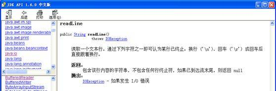
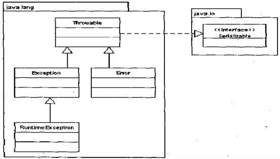

# Java 异常处理及其应用
理解异常处理机制以便更加灵活和有效地在开发中使用它

**标签:** Java

[原文链接](https://developer.ibm.com/zh/articles/j-lo-exception/)

张银利

发布: 2010-09-30

* * *

## Java 异常处理引出

假设您要编写一个 Java 程序，该程序读入用户输入的一行文本，并在终端显示该文本。

程序如下：

```
1 import java.io.*;
2 public class EchoInput {
3      public static void main(String args[]){
4          System.out.println("Enter text to echo:");
5          InputStreamReader isr = new InputStreamReader(System.in);
6          BufferedReader inputReader = new BufferedReader(isr);
7          String inputLine = inputReader.readLine();
8          System.out.println("Read:" + inputLine);
9   }
10 }

```

Show moreShow more icon

分析上面的代码，在 EchoInput 类中，第 3 行声明了 main 方法；第 4 行提示用户输入文本；第 5、6 行设置 BufferedReader 对像连接到 InputStreamReader，而 InputStreamReader 又连接到标准输入流 System.in；第 7 行读入一行文本；第 8 行用标准输出流 System.out 显示出该文本。

表面看来上面的程序没有问题，但实际上，EchoInput 类完全可能出现问题。要在调用第 7 行的 readLine 方法时正确读取输入，这几种假设都必须成立：假定键盘有效，键盘能与计算机正常通信；假定键盘数据可从操作系统传输到 Java 虚拟机，又从 Java 虚拟机传输 inputReader。

大多数情况下上述假设都成立，但不尽然。为此，Java 采用异常方法，以应对可能出现的错误，并采取步骤进行更正。在本例中，若试图编译以上代码，将看到以下信息：

```
Exception in thread "main" java.lang.Error: Unresolved compilation problem:
    Unhandled exception type IOException
    at EchoInput.main(EchoInput.java:7)

```

Show moreShow more icon

从中可以看到，第 7 行调用 readLine 方法可能出错：若果真如此，则产生 IOException 来记录故障。编译器错误是在告诉您，需要更改代码来解决这个潜在的问题。在 JDK API 文档中，可以看到同样的信息。我们可以看到 readLine 方法，如图 1 所示。

##### 图 1\. BufferedReader 类的 readLine 方法的 JDK API 文档



由图 1 可知，readLine 方法有时产生 IOException。如何处理潜在的故障？编译器需要”捕获”或”声明”IOException。

“捕获 (catch)”指当 readLine 方法产生错误时截获该错误，并处理和记录该问题。而”声明 (declare)”指错误可能引发 IOException，并通知调用该方法的任何代码：可能产生异常。

若要捕获异常，必须添加一个特殊的”处理代码块”，来接收和处理 IOException。于是程序改为如下：

```
1 import java.io.*;
2 public class EchoInputHandle {
3      public static void main(String args[]){
4          System.out.println("Enter text to echo:");
5          InputStreamReader isr = new InputStreamReader(System.in);
6          BufferedReader inputReader = new BufferedReader(isr);
7          try{
8              String inputLine = inputReader.readLine();
9              System.out.println("Read:" + inputLine);
10          }
11          catch(IOException exc){
12              System.out.println("Exception encountered: ” + exc);
13          }
14      }
15 }

```

Show moreShow more icon

新添的代码块包含关键字 try 和 catch（第 7,10,11,13 行），表示要读取输入。若成功，则正常运行。若读取输入时错误，则捕获问题（由 IOException 对象表示），并采取相应措施。在本例，采用的处理方式是输出异常。

若不准备捕获 IOException，仅声明异常，则要特别指定 main 方法可能出错，而且特别说明可能产生 IOException。于是程序改为如下：

```
1 import java.io.*;
2 public class EchoInputDeclare {
3      public static void main(String args[]) throws IOException{
4          System.out.println("Enter text to echo:");
5          InputStreamReader isr = new InputStreamReader(System.in);
6          BufferedReader inputReader = new BufferedReader(isr);
7          String inputLine = inputReader.readLine();
8          System.out.println("Read:" + inputLine);
9   }
10 }

```

Show moreShow more icon

从上面的这个简单的例子中，我们可以看出异常处理在 Java 代码开发中不能被忽视。

### Java 异常以及异常处理

可将 Java 异常看作是一类消息，它传送一些系统问题、故障及未按规定执行的动作的相关信息。异常包含信息，以将信息从应用程序的一部分发送到另一部分。

编译语言为何要处理异常？为何不在异常出现位置随时处理具体故障？因为有时候我们需要在系统中交流错误消息，以便按照统一的方式处理问题，有时是因为有若干处理问题的可能方式，但您不知道使用哪一种，此时，可将处理异常的任务委托给调用方法的代码。调用者通常更能了解问题来源的上下文，能更好的确定恢复方式。

图 2 是一个通用消息架构。

##### 图 2\. 通用消息架构


从上图可以看出，必定在运行的 Java 应用程序的一些类或对象中产生异常。出现故障时，”发送者”将产生异常对象。异常可能代表 Java 代码出现的问题，也可能是 JVM 的相应错误，或基础硬件或操作系统的错误。

异常本身表示消息，指发送者传给接收者的数据”负荷”。首先，异常基于类的类型来传输有用信息。很多情况下，基于异常的类既能识别故障本因并能更正问题。其次，异常还带有可能有用的数据（如属性）。

在处理异常时，消息必须有接收者；否则将无法处理产生异常的底层问题。

在上例中，异常”产生者”是读取文本行的 BufferedReader。在故障出现时，将在 readLine 方法中构建 IOException 对象。异常”接收者”是代码本身。EchoInputHandle 应用程序的 try-catch 结构中的 catch 块是异常的接收者，它以字符串形式输出异常，将问题记录下来。

## Java 异常类的层次结构

在我们从总体上了解异常后，我们应该了解如何在 Java 应用程序中使用异常，即需要了解 Java 类的层次结构。图 3 是 Java 类的层次结构图。

##### 图 3\. Java 类的层次结构



在 Java 中，所有的异常都有一个共同的祖先 Throwable（可抛出）。Throwable 指定代码中可用异常传播机制通过 Java 应用程序传输的任何问题的共性。

Throwable 有两个重要的子类：Exception（异常）和 Error（错误），二者都是 Java 异常处理的重要子类，各自都包含大量子类。

Exception（异常）是应用程序中可能的可预测、可恢复问题。一般大多数异常表示中度到轻度的问题。异常一般是在特定环境下产生的，通常出现在代码的特定方法和操作中。在 EchoInput 类中，当试图调用 readLine 方法时，可能出现 IOException 异常。

Error（错误）表示运行应用程序中较严重问题。大多数错误与代码编写者执行的操作无关，而表示代码运行时 JVM（Java 虚拟机）出现的问题。例如，当 JVM 不再有继续执行操作所需的内存资源时，将出现 OutOfMemoryError。

Exception 类有一个重要的子类 RuntimeException。RuntimeException 类及其子类表示”JVM 常用操作”引发的错误。例如，若试图使用空值对象引用、除数为零或数组越界，则分别引发运行时异常（NullPointerException、ArithmeticException）和 ArrayIndexOutOfBoundException。

## Java 异常的处理

在 Java 应用程序中，对异常的处理有两种方式：处理异常和声明异常。

### 处理异常：try、catch 和 finally

若要捕获异常，则必须在代码中添加异常处理器块。这种 Java 结构可能包含 3 个部分，

都有 Java 关键字。下面的例子中使用了 try-catch-finally 代码结构。

```
1 import java.io.*;
2 public class EchoInputTryCatchFinally {
3      public static void main(String args[]){
4          System.out.println("Enter text to echo:");
5          InputStreamReader isr = new InputStreamReader(System.in);
6          BufferedReader inputReader = new BufferedReader(isr);
7          try{
8              String inputLine = inputReader.readLine();
9              System.out.println("Read:" + inputLine);
10          }
11          catch(IOException exc){
12              System.out.println("Exception encountered: " + exc);
13          }
14          finally{
15             System.out.println("End. ");
16      }
17 }
18}

```

Show moreShow more icon

其中：

- try 块：将一个或者多个语句放入 try 时，则表示这些语句可能抛出异常。编译器知道可能要发生异常，于是用一个特殊结构评估块内所有语句。
- catch 块：当问题出现时，一种选择是定义代码块来处理问题，catch 块的目的便在于此。catch 块是 try 块所产生异常的接收者。基本原理是：一旦生成异常，则 try 块的执行中止，JVM 将查找相应的 JVM。
- finally 块：还可以定义 finally 块，无论运行 try 块代码的结果如何，该块里面的代码一定运行。在常见的所有环境中，finally 块都将运行。无论 try 块是否运行完，无论是否产生异常，也无论是否在 catch 块中得到处理，finally 块都将执行。

try-catch-finally 规则：

1. 必须在 try 之后添加 catch 或 finally 块。try 块后可同时接 catch 和 finally 块，但至少有一个块。
2. 必须遵循块顺序：若代码同时使用 catch 和 finally 块，则必须将 catch 块放在 try 块之后。
3. catch 块与相应的异常类的类型相关。
4. 一个 try 块可能有多个 catch 块。若如此，则执行第一个匹配块。
5. 可嵌套 try-catch-finally 结构。
6. 在 try-catch-finally 结构中，可重新抛出异常。
7. 除了下列情况，总将执行 finally 做为结束：JVM 过早终止（调用 System.exit(int)）；在 finally 块中抛出一个未处理的异常；计算机断电、失火、或遭遇病毒攻击。

### 声明异常

若要声明异常，则必须将其添加到方法签名块的结束位置。下面是一个实例：

```
public void errorProneMethod(int input) throws java.io.IOException {
    //Code for the method,including one or more method
    //calls that may produce an IOException
}

```

Show moreShow more icon

这样，声明的异常将传给方法调用者，而且也通知了编译器：该方法的任何调用者必须遵守处理或声明规则。声明异常的规则如下：

- 必须声明方法可抛出的任何可检测异常（checked exception）。
- 非检测性异常（unchecked exception）不是必须的，可声明，也可不声明。
- 调用方法必须遵循任何可检测异常的处理和声明规则。若覆盖一个方法，则不能声明与覆盖方法不同的异常。声明的任何异常必须是被覆盖方法所声明异常的同类或子类。

## Java 异常处理的分类

Java 异常可分为可检测异常，非检测异常和自定义异常。

### 可检测异常

可检测异常经编译器验证，对于声明抛出异常的任何方法，编译器将强制执行处理或声明规则，例如：sqlExecption 这个异常就是一个检测异常。你连接 JDBC 时，不捕捉这个异常，编译器就通不过，不允许编译。

### 非检测异常

非检测异常不遵循处理或声明规则。在产生此类异常时，不一定非要采取任何适当操作，编译器不会检查是否已解决了这样一个异常。例如：一个数组为 3 个长度，当你使用下标为３时，就会产生数组下标越界异常。这个异常 JVM 不会进行检测，要靠程序员来判断。有两个主要类定义非检测异常：RuntimeException 和 Error。

Error 子类属于非检测异常，因为无法预知它们的产生时间。若 Java 应用程序内存不足，则随时可能出现 OutOfMemoryError；起因一般不是应用程序的特殊调用，而是 JVM 自身的问题。另外，Error 一般表示应用程序无法解决的严重问题。

RuntimeException 类也属于非检测异常，因为普通 JVM 操作引发的运行时异常随时可能发生，此类异常一般是由特定操作引发。但这些操作在 Java 应用程序中会频繁出现。因此，它们不受编译器检查与处理或声明规则的限制。

### 自定义异常

自定义异常是为了表示应用程序的一些错误类型，为代码可能发生的一个或多个问题提供新含义。可以显示代码多个位置之间的错误的相似性，也可以区分代码运行时可能出现的相似问题的一个或者多个错误，或给出应用程序中一组错误的特定含义。例如，对队列进行操作时，有可能出现两种情况：空队列时试图删除一个元素；满队列时试图添加一个元素。则需要自定义两个异常来处理这两种情况。

## Java 异常处理的原则和忌讳

### Java 异常处理的原则

1. 尽可能的处理异常

    要尽可能的处理异常，如果条件确实不允许，无法在自己的代码中完成处理，就考虑声明异常。如果人为避免在代码中处理异常，仅作声明，则是一种错误和依赖的实践。

2. 具体问题具体解决

    异常的部分优点在于能为不同类型的问题提供不同的处理操作。有效异常处理的关键是识别特定故障场景，并开发解决此场景的特定相应行为。为了充分利用异常处理能力，需要为特定类型的问题构建特定的处理器块。

3. 记录可能影响应用程序运行的异常

    至少要采取一些永久的方式，记录下可能影响应用程序操作的异常。理想情况下，当然是在第一时间解决引发异常的基本问题。不过，无论采用哪种处理操作，一般总应记录下潜在的关键问题。别看这个操作很简单，但它可以帮助您用很少的时间来跟踪应用程序中复杂问题的起因。

4. 根据情形将异常转化为业务上下文

    若要通知一个应用程序特有的问题，有必要将应用程序转换为不同形式。若用业务特定状态表示异常，则代码更易维护。从某种意义上讲，无论何时将异常传到不同上下文（即另一技术层），都应将异常转换为对新上下文有意义的形式。


### Java 异常处理的忌讳

1. 一般不要忽略异常

    在异常处理块中，一项最危险的举动是”不加通告”地处理异常。如下例所示：


    ```
    1   try{
    2       Class.forName("business.domain.Customer");
    3   }
    4   catch (ClassNotFoundException exc){}

    ```


    Show moreShow more icon

    经常能够在代码块中看到类似的代码块。有人总喜欢在编写代码时简单快速地编写空处理器块，并”自我安慰地”宣称准备在”后期”添加恢复代码，但这个”后期”变成了”无期”。

    这种做法有什么坏处？如果异常对应用程序的其他部分确实没有任何负面影响，这未尝不可。但事实往往并非如此，异常会扰乱应用程序的状态。此时，这样的代码无异于掩耳盗铃。

    这种做法若影响较轻，则应用程序可能出现怪异行为。例如，应用程序设置的一个值不见了， 或 GUI 失效。若问题严重，则应用程序可能会出现重大问题，因为异常未记录原始故障点，难以处理，如重复的 NullPointerExceptions。

    如果采取措施，记录了捕获的异常，则不可能遇到这个问题。实际上，除非确认异常对代码其余部分绝无影响，至少也要作记录。进一步讲，永远不要忽略问题；否则，风险很大，在后期会引发难以预料的后果。

2. 不要使用覆盖式异常处理块

    另一个危险的处理是覆盖式处理器（blanket handler）。该代码的基本结构如下：


    ```
    1   try{
    2     //...
    3   }
    4   catch(Exception e){
    5     //...
    6   }

    ```


    Show moreShow more icon

    使用覆盖式异常处理块有两个前提之一：


    1. 代码中只有一类问题。

        这可能正确，但即便如此，也不应使用覆盖式异常处理，捕获更具体的异常形式有利物弊。

    2. 单个恢复操作始终适用。

        这几乎绝对错误。几乎没有哪个方法能放之四海而皆准，能应对出现的任何问题。


    分析下这样编写代码将发生的情况。只要方法不断抛出预期的异常集，则一切正常。但是，如果抛出了未预料到的异常，则无法看到要采取的操作。当覆盖式处理器对新异常类执行千篇一律的任务时，只能间接看到异常的处理结果。如果代码没有打印或记录语句，则根本看不到结果。

    更糟糕的是，当代码发生变化时，覆盖式处理器将继续作用于所有新异常类型，并以相同方式处理所有类型。

3. 一般不要把特定的异常转化为更通用的异常

    将特定的异常转换为更通用异常时一种错误做法。一般而言，这将取消异常起初抛出时产生的上下文，在将异常传到系统的其他位置时，将更难处理。见下例：


    ```
    1   try{
    2     // Error-prone code
    3   }
    4   catch(IOException e){
    5      String msg = "If you didn ' t have a problem before,you do now!";
    6      throw new Exception(msg);
    7   }

    ```


    Show moreShow more icon

    因为没有原始异常的信息，所以处理器块无法确定问题的起因，也不知道如何更正问题。

4. 不要处理能够避免的异常

    对于有些异常类型，实际上根本不必处理。通常运行时异常属于此类范畴。在处理空指针或者数据索引等问题时，不必求助于异常处理。


## Java 异常处理的应用实例

在定义银行类时，若取钱数大于余额时需要做异常处理。

定义一个异常类 insufficientFundsException。取钱（withdrawal）方法中可能产生异常，条件是余额小于取额。

处理异常在调用 withdrawal 的时候，因此 withdrawal 方法要声明抛出异常，由上一级方法调用。

异常类：

```
class InsufficientFundsExceptionextends Exception{
private Bank  excepbank;      // 银行对象
private double excepAmount;   // 要取的钱
InsufficientFundsException(Bank ba, double  dAmount)
    {  excepbank=ba;
       excepAmount=dAmount;
}
public String excepMessage(){
         String  str="The balance is"+excepbank.balance
       + "\n"+"The withdrawal was"+excepAmount;
         return str;
}
}// 异常类

```

Show moreShow more icon

银行类：

```
class Bank{
double balance;// 存款数
Bank(double  balance){this.balance=balance;}
public void deposite(double dAmount){
        if(dAmount>0.0) balance+=dAmount;
}
public void withdrawal(double dAmount)
               throws  InsufficientFundsException{
        if (balance<dAmount)     throw new
          InsufficientFundsException(this, dAmount);
      balance=balance-dAmount;
}
public void showBalance(){
      System.out.println("The balance is "+(int)balance);
}
}

```

Show moreShow more icon

前端调用：

```
public class ExceptionDemo{
public static void main(String args[]){
        try{
           Bank ba=new Bank(50);
          ba.withdrawal(100);
          System.out.println("Withdrawal successful!");
      }catch(InsufficientFundsException e) {
          System.out.println(e.toString());
          System.out.println(e.excepMessage());
      }
}
}

```

Show moreShow more icon

## 结束语

Java 异常处理是使用 Java 语言进行软件开发和测试脚本开发中非常重要的一个方面。对异常处理的重视会是您开发出的代码更健壮，更稳定。本文系统的阐述了 Java 异常处理的原理和方法。能帮助读者更加清楚的理解 Java 异常处理机制，在开发代码时更加灵活的使用它。