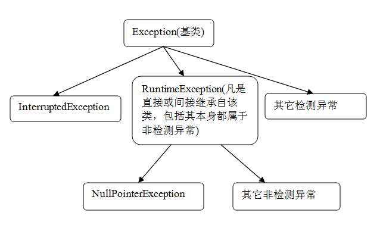

# Java 异常处理的误区和经验总结
异常的选择、错误代码的利用、处理多层次的异常、以及如何添加有效信息到异常等

**标签:** Java

[原文链接](https://developer.ibm.com/zh/articles/j-lo-exception-misdirection/)

赵爱兵

发布: 2014-09-01

* * *

本文着重介绍了 Java 异常选择和使用中的一些误区，希望各位读者能够熟练掌握异常处理的一些注意点和原则，注意总结和归纳。只有处理好了异常，才能提升开发人员的基本素养，提高系统的健壮性，提升用户体验，提高产品的价值。

## 误区一、异常的选择

##### 图 1\. 异常分类



图 1 描述了异常的结构，其实我们都知道异常分检测异常和非检测异常，但是在实际中又混淆了这两种异常的应用。由于非检测异常使用方便，很多开发人员就认为检测异常没什么用处。其实异常的应用情景可以概括为以下：

一、调用代码不能继续执行，需要立即终止。出现这种情况的可能性太多太多，例如服务器连接不上、参数不正确等。这些时候都适用非检测异常，不需要调用代码的显式捕捉和处理，而且代码简洁明了。

二、调用代码需要进一步处理和恢复。假如将 SQLException 定义为非检测异常，这样操作数据时开发人员理所当然的认为 SQLException 不需要调用代码的显式捕捉和处理，进而会导致严重的 Connection 不关闭、Transaction 不回滚、DB 中出现脏数据等情况，正因为 SQLException 定义为检测异常，才会驱使开发人员去显式捕捉，并且在代码产生异常后清理资源。当然清理资源后，可以继续抛出非检测异常，阻止程序的执行。根据观察和理解，检测异常大多可以应用于工具类中。

## 误区二、将异常直接显示在页面或客户端。

将异常直接打印在客户端的例子屡见不鲜，以 JSP 为例，一旦代码运行出现异常，默认情况下容器将异常堆栈信息直接打印在页面上。其实从客户角度来说，任何异常都没有实际意义，绝大多数的客户也根本看不懂异常信息，软件开发也要尽量避免将异常直接呈现给用户。

##### 清单 1

```
package com.ibm.dw.sample.exception;
/**
* 自定义 RuntimeException
* 添加错误代码属性
*/
public class RuntimeException extends java.lang.RuntimeException {
     //默认错误代码
    public static final Integer GENERIC = 1000000;
    //错误代码
    private Integer errorCode;
     public RuntimeException(Integer errorCode, Throwable cause) {
            this(errorCode, null, cause);
     }
     public RuntimeException(String message, Throwable cause) {
            //利用通用错误代码
            this(GENERIC, message, cause);
     }
     public RuntimeException(Integer errorCode, String message, Throwable cause) {
            super(message, cause);
            this.errorCode = errorCode;
     }
     public Integer getErrorCode() {
            return errorCode;
     }
}

```

Show moreShow more icon

正如示例代码所示，在异常中引入错误代码，一旦出现异常，我们只要将异常的错误代码呈现给用户，或者将错误代码转换成更通俗易懂的提示。其实这里的错误代码还包含另外一个功能，开发人员亦可以根据错误代码准确的知道了发生了什么类型异常。

## 误区三、对代码层次结构的污染

我们经常将代码分 Service、Business Logic、DAO 等不同的层次结构，DAO 层中会包含抛出异常的方法，如清单 2 所示：

##### 清单 2

```
public Customer retrieveCustomerById(Long id) throw SQLException {
//根据 ID 查询数据库
}

```

Show moreShow more icon

上面这段代码咋一看没什么问题，但是从设计耦合角度仔细考虑一下，这里的 SQLException 污染到了上层调用代码，调用层需要显式的利用 try-catch 捕捉，或者向更上层次进一步抛出。根据设计隔离原则，我们可以适当修改成：

##### 清单 3

```
public Customer retrieveCustomerById(Long id) {
     try{
            //根据 ID 查询数据库
     }catch(SQLException e){
            //利用非检测异常封装检测异常，降低层次耦合
            throw new RuntimeException(SQLErrorCode, e);
     }finally{
            //关闭连接，清理资源
     }
}

```

Show moreShow more icon

## 误区四、忽略异常

如下异常处理只是将异常输出到控制台，没有任何意义。而且这里出现了异常并没有中断程序，进而调用代码继续执行，导致更多的异常。

##### 清单 4

```
public void retrieveObjectById(Long id){
try{
       //..some code that throws SQLException
    }catch(SQLException ex){
     /**
       *了解的人都知道，这里的异常打印毫无意义，仅仅是将错误堆栈输出到控制台。
       * 而在 Production 环境中，需要将错误堆栈输出到日志。
       * 而且这里 catch 处理之后程序继续执行，会导致进一步的问题*/

          ex.printStacktrace();
     }
}

```

Show moreShow more icon

可以重构成：

##### 清单 5

```
public void retrieveObjectById(Long id){
try{
    //..some code that throws SQLException
}
catch(SQLException ex){
    throw new RuntimeException("Exception in retieveObjectById”, ex);
}
finally{
    //clean up resultset, statement, connection etc
}
}

```

Show moreShow more icon

这个误区比较基本，一般情况下都不会犯此低级错误。

## 误区五、将异常包含在循环语句块中

如下代码所示，异常包含在 for 循环语句块中。

##### 清单 6

```
for(int i=0; i<100; i++){
    try{
    }catch(XXXException e){
         //....
    }
}

```

Show moreShow more icon

我们都知道异常处理占用系统资源。一看，大家都认为不会犯这样的错误。换个角度，类 A 中执行了一段循环，循环中调用了 B 类的方法，B 类中被调用的方法却又包含 try-catch 这样的语句块。褪去类的层次结构，代码和上面如出一辙。

## 误区六、利用 Exception 捕捉所有潜在的异常

一段方法执行过程中抛出了几个不同类型的异常，为了代码简洁，利用基类 Exception 捕捉所有潜在的异常，如下例所示：

##### 清单 7

```
public void retrieveObjectById(Long id){
    try{
        //...抛出 IOException 的代码调用
        //...抛出 SQLException 的代码调用
    }catch(Exception e){
        //这里利用基类 Exception 捕捉的所有潜在的异常，如果多个层次这样捕捉，会丢失原始异常的有效信息
        throw new RuntimeException("Exception in retieveObjectById”, e);
    }
}

```

Show moreShow more icon

可以重构成

##### 清单 8

```
public void retrieveObjectById(Long id){
    try{
        //..some code that throws RuntimeException, IOException, SQLException
    }catch(IOException e){
        //仅仅捕捉 IOException
        throw new RuntimeException(/*指定这里 IOException 对应的错误代码*/code,"Exception in retieveObjectById”, e);
    }catch(SQLException e){
        //仅仅捕捉 SQLException
        throw new RuntimeException(/*指定这里 SQLException 对应的错误代码*/code,"Exception in retieveObjectById”, e);
    }
}

```

Show moreShow more icon

## 误区七、多层次封装抛出非检测异常

如果我们一直坚持不同类型的异常一定用不同的捕捉语句，那大部分例子可以绕过这一节了。但是如果仅仅一段代码调用会抛出一种以上的异常时，很多时候没有必要每个不同类型的 Exception 写一段 catch 语句，对于开发来说，任何一种异常都足够说明了程序的具体问题。

##### 清单 9

```
try{
    //可能抛出 RuntimeException、IOExeption 或者其它；
    //注意这里和误区六的区别，这里是一段代码抛出多种异常。以上是多段代码，各自抛出不同的异常
}catch(Exception e){
    //一如既往的将 Exception 转换成 RuntimeException，但是这里的 e 其实是 RuntimeException 的实例，已经在前段代码中封装过
    throw new RuntimeException(/**/code, /**/, e);
}

```

Show moreShow more icon

如果我们如上例所示，将所有的 Exception 再转换成 RuntimeException，那么当 Exception 的类型已经是 RuntimeException 时，我们又做了一次封装。将 RuntimeException 又重新封装了一次，进而丢失了原有的 RuntimeException 携带的有效信息。

解决办法是我们可以在 RuntimeException 类中添加相关的检查，确认参数 Throwable 不是 RuntimeException 的实例。如果是，将拷贝相应的属性到新建的实例上。或者用不同的 catch 语句块捕捉 RuntimeException 和其它的 Exception。个人偏好方式一，好处不言而喻。

## 误区八、多层次打印异常

我们先看一下下面的例子，定义了 2 个类 A 和 B。其中 A 类中调用了 B 类的代码，并且 A 类和 B 类中都捕捉打印了异常。

##### 清单 10

```
public class A {
private static Logger logger = LoggerFactory.getLogger(A.class);
public void process(){
     try{
     //实例化 B 类，可以换成其它注入等方式
     B b = new B();
     b.process();
     //other code might cause exception
    } catch(XXXException e){
       //如果 B 类 process 方法抛出异常，异常会在 B 类中被打印，在这里也会被打印，从而会打印 2 次
       logger.error(e);
       throw new RuntimeException(/* 错误代码 */ errorCode, /*异常信息*/msg, e);
       }
    }
}
public class B{
private static Logger logger = LoggerFactory.getLogger(B.class);
    public void process(){
        try{
            //可能抛出异常的代码
        }
        catch(XXXException e){
            logger.error(e);
            throw new RuntimeException(/* 错误代码 */ errorCode, /*异常信息*/msg, e);
        }
}
}

```

Show moreShow more icon

同一段异常会被打印 2 次。如果层次再复杂一点，不去考虑打印日志消耗的系统性能，仅仅在异常日志中去定位异常具体的问题已经够头疼的了。

其实打印日志只需要在代码的最外层捕捉打印就可以了，异常打印也可以写成 AOP，织入到框架的最外层。

## 误区九、异常包含的信息不能充分定位问题

异常不仅要能够让开发人员知道哪里出了问题，更多时候开发人员还需要知道是什么原因导致的问题，我们知道 java .lang.Exception 有字符串类型参数的构造方法，这个字符串可以自定义成通俗易懂的提示信息。

简单的自定义信息开发人员只能知道哪里出现了异常，但是很多的情况下，开发人员更需要知道是什么参数导致了这样的异常。这个时候我们就需要将方法调用的参数信息追加到自定义信息中。下例只列举了一个参数的情况，多个参数的情况下，可以单独写一个工具类组织这样的字符串。

##### 清单 11

```
public void retieveObjectById(Long id){
    try{
        //..some code that throws SQLException
}catch(SQLException ex){
        //将参数信息添加到异常信息中
        throw new RuntimeException("Exception in retieveObjectById with Object Id :”+ id, ex);
}
}

```

Show moreShow more icon

## 误区十、不能预知潜在的异常

在写代码的过程中，由于对调用代码缺乏深层次的了解，不能准确判断是否调用的代码会产生异常，因而忽略处理。在产生了 Production Bug 之后才想起来应该在某段代码处添加异常补捉，甚至不能准确指出出现异常的原因。这就需要开发人员不仅知道自己在做什么，而且要去尽可能的知道别人做了什么，可能会导致什么结果，从全局去考虑整个应用程序的处理过程。这些思想会影响我们对代码的编写和处理。

## 误区十一、混用多种第三方日志库

现如今 Java 第三方日志库的种类越来越多，一个大项目中会引入各种各样的框架，而这些框架又会依赖不同的日志库的实现。最麻烦的问题倒不是引入所有需要的这些日志库，问题在于引入的这些日志库之间本身不兼容。如果在项目初期可能还好解决，可以把所有代码中的日志库根据需要重新引入一遍，或者换一套框架。但这样的成本不是每个项目都承受的起的，而且越是随着项目的进行，这种风险就越大。

怎么样才能有效的避免类似的问题发生呢，现在的大多数框架已经考虑到了类似的问题，可以通过配置 Properties 或 xml 文件、参数或者运行时扫描 Lib 库中的日志实现类，真正在应用程序运行时才确定具体应用哪个特定的日志库。

其实根据不需要多层次打印日志那条原则，我们就可以简化很多原本调用日志打印代码的类。很多情况下，我们可以利用拦截器或者过滤器实现日志的打印，降低代码维护、迁移的成本。

## 结束语

以上纯属个人的经验和总结，事物都是辩证的，没有绝对的原则，适合自己的才是最有效的原则。希望以上的讲解和分析可以对您有所帮助。