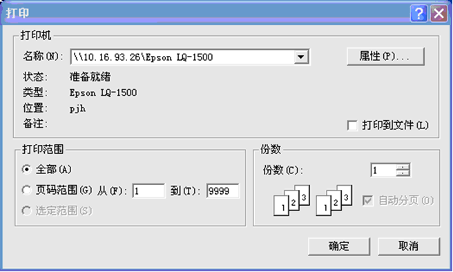
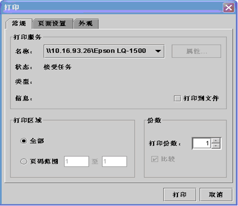

# Java 打印程序设计
通过一个具体的程序实例来说明如何设计 Java 打印程序以实现这些功能

**标签:** 

[原文链接](https://developer.ibm.com/zh/articles/l-javaprint/)

文枫

发布: 2002-10-22

* * *

## 前言

在我们的实际工作中，经常需要实现打印功能。但由于历史原因，Java 提供的打印功能一直都比较弱。实际上最初的 jdk 根本不支持打印，直到 jdk1.1 才引入了很轻量的打印支持。所以，在以前用 Java/Applet/JSP/Servlet 设计的程序中，较复杂的打印都是通过调用 ActiveX/OCX 控件或者 VB/VC 程序来实现的，非常麻烦。实际上，SUN 公司也一直致力于 Java 打印功能的完善，而 Java2 平台则终于有了一个健壮的打印模式的开端，该打印模式与 Java2D 图形包充分结合成一体。更令人鼓舞的是，新发布的 jdk1.4 则提供了一套完整的”Java 打印服务 API” （Java Print Service API），它对已有的打印功能是积极的补充。利用它，我们可以实现大部分实际应用需求，包括打印文字、图形、文件及打印预览等等。本文将通过一个具体的程序实例来说明如何设计 Java 打印程序以实现这些功能，并对不同版本的实现方法进行分析比较。希望大家能从中获取一些有益的提示。

## Java 中的打印

### 2.1 Java 的打印 API

Java 的打印 API 主要存在于 java.awt.print 包中。而 jdk1.4 新增的类则主要存在于 javax.print 包及其相应的子包 javax.print.event 和 javax.print.attribute 中。其中 javax.print 包中主要包含打印服务的相关类，而 javax.print.event 则包含打印事件的相关定义，javax.print.attribute 则包括打印服务的可用属性列表等。

### 2.2 如何实现打印

要产生一个打印，至少需要考虑两条：

1. 需要一个打印服务对象。这可通过三种方式实现：在 jdk1.4 之前的版本，必须要实现 java.awt.print.Printable 接口或通过 Toolkit.getDefaultToolkit().getPrintJob 来获取打印服务对象；在 jdk1.4 中则还可以通过 javax.print.PrintSerivceLookup 来查找定位一个打印服务对象。
2. 需要开始一个打印工作。这也有几种实现方法：在 jdk1.4 之前可以通过 java.awt.print.PrintJob（jdk1.1 提供的，现在已经很少用了）调用 print 或 printAll 方法开始打印工作；也可以通过 java.awt.print.PrinterJob 的 printDialog 显示打印对话框，然后通过 print 方法开始打印；在 jdk1.4 中则可以通过 javax.print.ServiceUI 的 printDialog 显示打印对话框，然后调用 print 方法开始一个打印工作。

### 2.3 打印机对话框

**2.3.1 Printable 的打印对话框**

开始打印工作之前，可以通过 PrinterJob.printDialog 来显示一个打印对话框。它给用户一个机会以选择应该打印的页码范围，并可供用户改变打印设置。它是一个本地对话框。



事实上，当从一个 Printable 对象进行一个打印工作时，打印对象并不知道需要打印多少页。它只是不停地调用 print 方法。只要 print 方法返回 Printable.PAGE\_EXISTS 值，打印工作就不停地产生打印页，直到 print 方法返回 Printable.NO\_SUCH\_PAGE 时，打印工作才停止。

由于打印工作只有在打印完成后才进行准确的页数计算，所以在对话框上的页码范围是尚未初始化的 [1,9999]。我们可以通过构建一个 java.awt.print.Book 对象传递给打印对象；也可以通过指定的格式计算需要打印的页数并传递给打印对象，使其准确地知道要打印多少页。

**2.3.2 ServiceUI 的打印对话框**

与 Printable 的对话框不同的是，在 jdk1.4 提供 ServiceUI 的打印机对话框的缺省行为已经用新的 API 更改了：缺省情况下对话框不显示。我们必须使用 ServiceUI 类调用 printDialog 方法创建如下所示的打印对话框。



## Java 打印程序设计实例

### 3.1 打印文本

**3.1.1 应用场景**

假设我们需要打印一个窗体的某个文本编辑域（可能只有几行，也可能包含多页）的内容，并且每页最多打印 54 行，如何实现呢？

**3.1.2 解决方法**

基本思路如下：首先我们需要实现 Printable 接口，然后按照每页最多 54 行的格式计算共需要打印多少页，当打印文本的按钮被点击时，执行相应的打印动作。打印文本的具体操作可通过 Graphics2D 的 drawString 方法来实现。

1.实现 Printable 接口

```
/*Graphic 指明打印的图形环境；PageFormat 指明打印页格式（页面大小以点为计量单位，
1 点为 1 英才的 1/72，1 英寸为 25.4 毫米。A4 纸大致为 595 × 842 点）；page 指明页号 */
public int print(Graphics g, PageFormat pf, int page) throws PrinterException
{
    Graphics2D g2 = (Graphics2D)g;
    g2.setPaint(Color.black); // 设置打印颜色为黑色
     if (page >= PAGES) // 当打印页号大于需要打印的总页数时，打印工作结束
         return Printable.NO_SUCH_PAGE;
    g2.translate(pf.getImageableX(), pf.getImageableY());// 转换坐标，确定打印边界
    drawCurrentPageText(g2, pf, page); // 打印当前页文本
return Printable.PAGE_EXISTS; // 存在打印页时，继续打印工作
}
     /* 打印指定页号的具体文本内容 */
    private void drawCurrentPageText(Graphics2D g2, PageFormat pf, int page)
     {
         String s = getDrawText(printStr)[page];// 获取当前页的待打印文本内容
        // 获取默认字体及相应的尺寸
FontRenderContext context = g2.getFontRenderContext();
        Font f = area.getFont();
        String drawText;
        float ascent = 16;      // 给定字符点阵
        int k, i = f.getSize(), lines = 0;
        while(s.length() > 0 && lines < 54) // 每页限定在 54 行以内
        {
             k = s.indexOf('\n'); // 获取每一个回车符的位置
            if (k != -1)  // 存在回车符
            {
                 lines += 1; // 计算行数
                drawText = s.substring(0, k); // 获取每一行文本
                g2.drawString(drawText, 0, ascent); // 具体打印每一行文本，同时走纸移位
                if (s.substring(k + 1).length() > 0)
                {
                     s = s.substring(k + 1); // 截取尚未打印的文本
                    ascent += i;
                }
            }
            else // 不存在回车符
            {
                 lines += 1; // 计算行数
                    drawText = s; // 获取每一行文本
                g2.drawString(drawText, 0, ascent); // 具体打印每一行文本，同时走纸移位
                s = ""; // 文本已结束
            }
        }
    }
     /* 将打印目标文本按页存放为字符串数组 */
     public String[] getDrawText(String s)
    {
        String[] drawText = new String[PAGES];// 根据页数初始化数组
        for (int i = 0; i < PAGES; i++)
            drawText[i] = ""; // 数组元素初始化为空字符串

        int k, suffix = 0, lines = 0;
        while(s.length() > 0)
        {
            if(lines < 54) // 不够一页时
            {
                k = s.indexOf('\n');
                if (k != -1) // 存在回车符
                {
                    lines += 1; // 行数累加
                     // 计算该页的具体文本内容，存放到相应下标的数组元素
                    drawText[suffix] = drawText[suffix] + s.substring(0, k + 1);
                    if (s.substring(k + 1).length() > 0)
                        s = s.substring(k + 1);
                }
                else
                {
                    lines += 1; // 行数累加
                     // 将文本内容存放到相应的数组元素
                    drawText[suffix] = drawText[suffix] + s;
                    s = "";
                }
            }
            else // 已满一页时
            {
                lines = 0; // 行数统计清零
                suffix++; // 数组下标加 1
            }
        }
        return drawText;
    }

```

Show moreShow more icon

2.计算需要打印的总页数

```
public int getPagesCount(String curStr)
     {
        int page = 0;
        int position, count = 0;
        String str = curStr;
        while(str.length() > 0) // 文本尚未计算完毕
        {
            position = str.indexOf('\n'); // 计算回车符的位置
            count += 1; // 统计行数
            if (position != -1)
                str = str.substring(position + 1); // 截取尚未计算的文本
            else
                str = ""; // 文本已计算完毕
        }
        if (count > 0)
            page = count / 54 + 1; // 以总行数除以 54 获取总页数
        return page; // 返回需打印的总页数
     }

```

Show moreShow more icon

3.以 jdk1.4 以前的版本实现打印动作按钮监听，并完成具体的打印操作

```
private void printTextAction()
    {
        printStr = area.getText().trim(); // 获取需要打印的目标文本
        if (printStr != null && printStr.length() > 0) // 当打印内容不为空时
        {
            PAGES = getPagesCount(printStr); // 获取打印总页数
            PrinterJob myPrtJob = PrinterJob.getPrinterJob(); // 获取默认打印作业
            PageFormat pageFormat = myPrtJob.defaultPage(); // 获取默认打印页面格式
            myPrtJob.setPrintable(this, pageFormat); // 设置打印工作
            if (myPrtJob.printDialog()) // 显示打印对话框
            {
                try
                {
                    myPrtJob.print(); // 进行每一页的具体打印操作
                }
                catch(PrinterException pe)
                {
                    pe.printStackTrace();
                }
            }
        }
        else
        {
             // 如果打印内容为空时，提示用户打印将取消
            JOptionPane.showConfirmDialog
             (null, "Sorry, Printer Job is Empty, Print Cancelled!", "Empty",
             JOptionPane.DEFAULT_OPTION, JOptionPane.WARNING_MESSAGE);
        }
    }

```

Show moreShow more icon

4.以 jdk1.4 新版本提供的 API 实现打印动作按钮监听，并完成具体的打印操作

```
private void printText2Action()
    {
        printFlag = 0; // 打印标志清零
        printStr = area.getText().trim();// 获取需要打印的目标文本
        if (printStr != null && printStr.length() > 0) // 当打印内容不为空时
        {
            PAGES = getPagesCount(printStr); // 获取打印总页数
             // 指定打印输出格式
            DocFlavor flavor = DocFlavor.SERVICE_FORMATTED.PRINTABLE;
            // 定位默认的打印服务
PrintService printService = PrintServiceLookup.lookupDefaultPrintService();
            // 创建打印作业
DocPrintJob job = printService.createPrintJob();
            // 设置打印属性
PrintRequestAttributeSet pras = new HashPrintRequestAttributeSet();
            DocAttributeSet das = new HashDocAttributeSet();
            // 指定打印内容
Doc doc = new SimpleDoc(this, flavor, das);
             // 不显示打印对话框，直接进行打印工作
            try
            {
                job.print(doc, pras); // 进行每一页的具体打印操作
            }
            catch(PrintException pe)
            {
                pe.printStackTrace();
            }
        }
        else
        {
            // 如果打印内容为空时，提示用户打印将取消
JOptionPane.showConfirmDialog(null, "Sorry, Printer Job is Empty, Print Cancelled!",
"Empty", JOptionPane.DEFAULT_OPTION, JOptionPane.WARNING_MESSAGE);
        }
    }

```

Show moreShow more icon

### 3.2 打印预览

**3.2.1 应用场景**

大多少商业应用都需要提供打印预览机制，它可以让我们在屏幕上看到页面，这样就不会因为不喜欢的打印结果而浪费纸张。 假设我们在打印上一节所说的文本之前，需要先进行打印预览。那么该怎么实现呢？

界面实现图示如下：（Next 预览下一页，Preview 预览前一页，Close 则关闭预览）


**3.2.2 解决方法**

基本思路：虽然 Java2 平台的打印 API 并不提供标准的打印预览对话框，但是自己来进行设计也并不复杂。正常情况下，print 方法将页面环境绘制到一个打印机图形环境上，从而实现打印。而事实上，print 方法并不能真正产生打印页面，它只是将待打印内容绘制到图形环境上。所以，我们可以忽略掉屏幕图形环境，经过适当的缩放比例，使整个打印页容纳在一个屏幕矩形里，从而实现精确的打印预览。

在打印预览的设计实现中，主要需要解决两个问题。第一，如何将打印内容按合适的比例绘制到屏幕；第二，如何实现前后翻页。下面我给出这两个问题的具体实现方法，完整的实现请参看附件中的 PrintPreviewDialog.java 文件。

```
/* 将待打印内容按比例绘制到屏幕 */
public void paintComponent(Graphics g)
    {
super.paintComponent(g);
        Graphics2D g2 = (Graphics2D)g;
        PageFormat pf = PrinterJob.getPrinterJob().defaultPage(); // 获取页面格式
        double xoff; // 在屏幕上页面初始位置的水平偏移
        double yoff; // 在屏幕上页面初始位置的垂直偏移
        double scale; // 在屏幕上适合页面的比例
        double px = pf.getWidth(); // 页面宽度
        double py = pf.getHeight(); // 页面高度
        double sx = getWidth() - 1;
        double sy = getHeight() - 1;
        if (px / py < sx / sy)
        {
             scale = sy / py; // 计算比例
            xoff = 0.5 * (sx - scale * px); // 水平偏移量
            yoff = 0;
        }
        else
        {
             scale = sx / px; // 计算比例
            xoff = 0;
            yoff = 0.5 * (sy - scale * py); // 垂直偏移量
        }
        g2.translate((float)xoff, (float)yoff); // 转换坐标
        g2.scale((float)scale, (float)scale);
        Rectangle2D page = new Rectangle2D.Double(0, 0, px, py); // 绘制页面矩形
        g2.setPaint(Color.white); // 设置页面背景为白色
        g2.fill(page);
        g2.setPaint(Color.black);// 设置页面文字为黑色
        g2.draw(page);
        try
        {
             preview.print(g2, pf, currentPage); // 显示指定的预览页面
        }
        catch(PrinterException pe)
        {
             g2.draw(new Line2D.Double(0, 0, px, py));
            g2.draw(new Line2D.Double(0, px, 0, py));
        }
}
/* 预览指定的页面 */
public void viewPage(int pos)
    {
         int newPage = currentPage + pos;
         // 指定页面在实际的范围内
        if (0 <= newPage && newPage < preview.getPagesCount(printStr))
        {
             currentPage = newPage; // 将指定页面赋值为当前页
            repaint();
        }
    }

```

Show moreShow more icon

这样，在按下”Next”按钮时，只需要调用 canvas.viewPage(1)；而在按下”Preview”按钮时，只需要调用 canvas.viewPage(-1) 即可实现预览的前后翻页。

### 3.3 打印图形

**3.3.1 应用场景**

在实际应用中，我们还需要打印图形。譬如，我们有时需要将一个 Java Applet 的完整界面或一个应用程序窗体及其所包含的全部组件都打印出来，又应该如何实现呢？

**3.3.2 解决方法**

基本思路如下：在 Java 的 Component 类及其派生类中都提供了 print 和 printAll 方法，只要设置好属性就可以直接调用这两个方法，从而实现对组件及图形的打印。

```
/* 打印指定的窗体及其包含的组件 */
private void printFrameAction()
{
Toolkit kit = Toolkit.getDefaultToolkit(); // 获取工具箱
    Properties props = new Properties();
    props.put("awt.print.printer", "durango");// 设置打印属性
    props.put("awt.print.numCopies", "2");
    if(kit != null)
    {
         // 获取工具箱自带的打印对象
PrintJob printJob = kit.getPrintJob(this, "Print Frame", props);
        if(printJob != null)
        {
             Graphics pg = printJob.getGraphics();// 获取打印对象的图形环境
            if(pg != null)
            {
                 try
                 {
                     this.printAll(pg);// 打印该窗体及其所有的组件
                }
                finally
                {
                     pg.dispose();// 注销图形环境
                }
            }
            printJob.end();// 结束打印作业
         }
    }
}

```

Show moreShow more icon

### 3.4 打印文件

**3.4.1 应用场景**

在很多实际应用情况下，我们可能都需要打印用户指定的某一个文件。该文件可能是图形文件，如 GIF、JPEG 等等；也可能是文本文件，如 TXT、Java 文件等等；还可能是复杂的 PDF、DOC 文件等等。那么对于这样的打印需求，我们又应该如何实现呢？

**3.4.2 解决方法**

基本思路：在 JDK 1.4 以前的版本，要实现这样的打印功能将非常麻烦和复杂，甚至是难以想象的。但幸运的是，jdk1.4 的打印服务 API 提供了一整套的打印文件流的类和方法。利用它们，我们可以非常方便快捷地实现各式各样不同类型文件的打印功能。下面给出一个通用的处理方法。

```
/* 打印指定的文件 */
private void printFileAction()
{
    // 构造一个文件选择器，默认为当前目录
    JFileChooser fileChooser = new JFileChooser(SystemProperties.USER_DIR);
    int state = fileChooser.showOpenDialog(this);// 弹出文件选择对话框
    if (state == fileChooser.APPROVE_OPTION)// 如果用户选定了文件
    {
         File file = fileChooser.getSelectedFile();// 获取选择的文件
         // 构建打印请求属性集
        PrintRequestAttributeSet pras = new HashPrintRequestAttributeSet();
         // 设置打印格式，因为未确定文件类型，这里选择 AUTOSENSE
        DocFlavor flavor = DocFlavor.INPUT_STREAM.AUTOSENSE;
         // 查找所有的可用打印服务
        PrintService printService[] =
            PrintServiceLookup.lookupPrintServices(flavor, pras);
         // 定位默认的打印服务
        PrintService defaultService = PrintServiceLookup.lookupDefaultPrintService();
        // 显示打印对话框
        PrintService service = ServiceUI.printDialog(null, 200, 200, printService
            , defaultService, flavor, pras);
        if (service != null)
        {
             try
            {
                 DocPrintJob job = service.createPrintJob();// 创建打印作业
                FileInputStream fis = new FileInputStream(file);// 构造待打印的文件流
                DocAttributeSet das = new HashDocAttributeSet();
                Doc doc = new SimpleDoc(fis, flavor, das);// 建立打印文件格式
                job.print(doc, pras);// 进行文件的打印
            }
            catch(Exception e)
            {
                 e.printStackTrace();
            }
        }
    }
}

```

Show moreShow more icon

在上面的示例中，因尚未确定文件的类型，所以将指定文件的打印格式定义为 DocFlavor.INPUT\_STREAM.AUTOSENSE。事实上，如果在进行打印之前，就已确定地知道文件的格式，如为 GIF，就应定义为 DocFlavor.INPUT\_STREAM.GIF ；如为 PDF，就应该定义为 DocFlavor.INPUT\_STREAM.PDF；如为纯 ASCII 文件，就可以定义为 DocFlavor.INPUT\_STREAM.TEXT\_HTML\_US\_ASCII。等等。jdk1.4 的 javax.print.DocFlavor 提供了极为丰富的文件流类型，你可以根据具体的应用需求进行合适的选择。具体的 API 参考文档可见本文的参考资料 3。

## 结束语

以上是本人在两年多 J2EE 应用开发中，总结的关于用 Java 进行打印程序设计的一些经验，希望能给大家一些启示和裨益。尽管目前用 Java 来实现打印功能与用 Microsoft 的 MFC API 相比确实有更多的麻烦。但 jdk1.4 的推出，对 Java 以前较弱的打印功能是一个极好的补充。相信大家如果能够很好地理解前文所述的打印程序设计实例，并加以应用和拓展，应该可以解决目前大部分应用的实际编程问题。而随着 Java 的进一步发展和完善，必将更好地充实其基础类库及打印 API，相信用 Java 实现高级打印功能也将越来越不成为我们这些 Java 痴迷者头痛的问题。

## 例程源码

[PrintSrc.zip](https://www.ibm.com/developerworks/cn/java/l-javaprint/PrintSrc.zip) 包含下列 java 源代码和 Class 代码：

1. PrintTest.java 包含了本文所描述的所有打印功能的实现源代码。相应的打印文本功能通过 Print Text 和 PrintText2（jdk1.4 实现）按钮调用；打印文件通过 Print File 按钮调用；打印图形通过 Print Frame 按钮调用；而 Print Preview 则进行打印预览。
2. PrintPreviewDialog.java 包含打印预览源代码，你可以通过 PrintTest 窗体中的 Print Preview 按钮来调用。

文枫