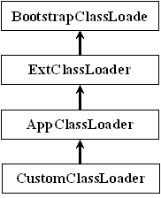
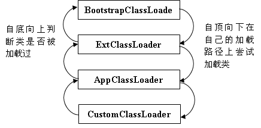

# Java 类的热替换 —— 概念、设计与实现
构建基于 Java 的在线升级系统

**标签:** Java

[原文链接](https://developer.ibm.com/zh/articles/j-lo-hotswapcls/)

孙鸣, 邓辉

发布: 2010-01-14

* * *

## Java ClassLoader 技术剖析

在本文中，我们将不对 Java ClassLoader 的细节进行过于详细的讲解，而是关注于和构建在线升级系统相关的基础概念。关于 ClassLoader 的详细细节许多资料可以参考，有兴趣的读者可以自行研读。

要构建在线升级系统，一个重要的技术就是能够实现 Java 类的热替换 —— 也就是在不停止正在运行的系统的情况下进行类（对象）的升级替换。而 Java 的 ClassLoader 正是实现这项技术的基础。

在 Java 中，类的实例化流程分为两个部分：类的加载和类的实例化。类的加载又分为显式加载和隐式加载。大家使用 new 关键字创建类实例时，其实就隐式地包含了类的加载过程。对于类的显式加载来说，比较常用的是 Class.forName。其实，它们都是通过调用 ClassLoader 类的 loadClass 方法来完成类的实际加载工作的。直接调用 ClassLoader 的 loadClass 方法是另外一种不常用的显式加载类的技术。

##### 图 1\. Java 类加载器层次结构图



ClassLoader 在加载类时有一定的层次关系和规则。在 Java 中，有四种类型的类加载器，分别为：BootStrapClassLoader、ExtClassLoader、AppClassLoader 以及用户自定义的 ClassLoader。这四种类加载器分别负责不同路径的类的加载，并形成了一个类加载的层次结构。

BootStrapClassLoader 处于类加载器层次结构的最高层，负责 sun.boot.class.path 路径下类的加载，默认为 jre/lib 目录下的核心 API 或 -Xbootclasspath 选项指定的 jar 包。ExtClassLoader 的加载路径为 java.ext.dirs，默认为 jre/lib/ext 目录或者 -Djava.ext.dirs 指定目录下的 jar 包加载。AppClassLoader 的加载路径为 java.class.path，默认为环境变量 CLASSPATH 中设定的值。也可以通过 -classpath 选型进行指定。用户自定义 ClassLoader 可以根据用户的需要定制自己的类加载过程，在运行期进行指定类的动态实时加载。

这四种类加载器的层次关系图如 [图 1\. Java 类加载器层次结构图](#图-1-java-类加载器层次结构图) 所示。一般来说，这四种类加载器会形成一种父子关系，高层为低层的父加载器。在进行类加载时，首先会自底向上挨个检查是否已经加载了指定类，如果已经加载则直接返回该类的引用。如果到最高层也没有加载过指定类，那么会自顶向下挨个尝试加载，直到用户自定义类加载器，如果还不能成功，就会抛出异常。Java 类的加载过程如 [图 2\. Java 类的加载过程](#图-2-java-类的加载过程) 所示。

##### 图 2\. Java 类的加载过程



每个类加载器有自己的名字空间，对于同一个类加载器实例来说，名字相同的类只能存在一个，并且仅加载一次。不管该类有没有变化，下次再需要加载时，它只是从自己的缓存中直接返回已经加载过的类引用。

我们编写的应用类默认情况下都是通过 AppClassLoader 进行加载的。当我们使用 new 关键字或者 Class.forName 来加载类时，所要加载的类都是由调用 new 或者 Class.forName 的类的类加载器（也是 AppClassLoader）进行加载的。要想实现 Java 类的热替换，首先必须要实现系统中同名类的不同版本实例的共存，通过上面的介绍我们知道，要想实现同一个类的不同版本的共存，我们必须要通过不同的类加载器来加载该类的不同版本。另外，为了能够绕过 Java 类的既定加载过程，我们需要实现自己的类加载器，并在其中对类的加载过程进行完全的控制和管理。

## 编写自定义的 ClassLoader

为了能够完全掌控类的加载过程，我们的定制类加载器需要直接从 ClassLoader 继承。首先我们来介绍一下 ClassLoader 类中和热替换有关的的一些重要方法。

- **findLoadedClass：** 每个类加载器都维护有自己的一份已加载类名字空间，其中不能出现两个同名的类。凡是通过该类加载器加载的类，无论是直接的还是间接的，都保存在自己的名字空间中，该方法就是在该名字空间中寻找指定的类是否已存在，如果存在就返回给类的引用，否则就返回 null。这里的直接是指，存在于该类加载器的加载路径上并由该加载器完成加载，间接是指，由该类加载器把类的加载工作委托给其他类加载器完成类的实际加载。
- **getSystemClassLoader ：** Java2 中新增的方法。该方法返回系统使用的 ClassLoader。可以在自己定制的类加载器中通过该方法把一部分工作转交给系统类加载器去处理。
- **defineClass：** 该方法是 ClassLoader 中非常重要的一个方法，它接收以字节数组表示的类字节码，并把它转换成 Class 实例，该方法转换一个类的同时，会先要求装载该类的父类以及实现的接口类。
- **loadClass：** 加载类的入口方法，调用该方法完成类的显式加载。通过对该方法的重新实现，我们可以完全控制和管理类的加载过程。
- **resolveClass：** 链接一个指定的类。这是一个在某些情况下确保类可用的必要方法，详见 Java 语言规范中”执行”一章对该方法的描述。

了解了上面的这些方法，下面我们来实现一个定制的类加载器来完成这样的加载流程：我们为该类加载器指定一些必须由该类加载器直接加载的类集合，在该类加载器进行类的加载时，如果要加载的类属于必须由该类加载器加载的集合，那么就由它直接来完成类的加载，否则就把类加载的工作委托给系统的类加载器完成。

在给出示例代码前，有两点内容需要说明一下：1、要想实现同一个类的不同版本的共存，那么这些不同版本必须由不同的类加载器进行加载，因此就不能把这些类的加载工作委托给系统加载器来完成，因为它们只有一份。2、为了做到这一点，就不能采用系统默认的类加载器委托规则，也就是说我们定制的类加载器的父加载器必须设置为 null。该定制的类加载器的实现代码如下：

##### 清单 1\. 定制的类加载器的实现代码

```
class CustomCL extends ClassLoader {

    private String basedir; // 需要该类加载器直接加载的类文件的基目录
    private HashSet dynaclazns; // 需要由该类加载器直接加载的类名

    public CustomCL(String basedir, String[] clazns) {
        super(null); // 指定父类加载器为 null
        this.basedir = basedir;
        dynaclazns = new HashSet();
        loadClassByMe(clazns);
    }

    private void loadClassByMe(String[] clazns) {
        for (int i = 0; i < clazns.length; i++) {
            loadDirectly(clazns[i]);
            dynaclazns.add(clazns[i]);
        }
    }

    private Class loadDirectly(String name) {
        Class cls = null;
        StringBuffer sb = new StringBuffer(basedir);
        String classname = name.replace('.', File.separatorChar) + ".class";
        sb.append(File.separator + classname);
        File classF = new File(sb.toString());
        cls = instantiateClass(name,new FileInputStream(classF),
            classF.length());
        return cls;
    }

    private Class instantiateClass(String name,InputStream fin,long len){
        byte[] raw = new byte[(int) len];
        fin.read(raw);
        fin.close();
        return defineClass(name,raw,0,raw.length);
    }

    protected Class loadClass(String name, boolean resolve)
            throws ClassNotFoundException {
        Class cls = null;
        cls = findLoadedClass(name);
        if(!this.dynaclazns.contains(name) && cls == null)
            cls = getSystemClassLoader().loadClass(name);
        if (cls == null)
            throw new ClassNotFoundException(name);
        if (resolve)
            resolveClass(cls);
        return cls;
    }

}

```

Show moreShow more icon

在该类加载器的实现中，所有指定必须由它直接加载的类都在该加载器实例化时进行了加载，当通过 loadClass 进行类的加载时，如果该类没有加载过，并且不属于必须由该类加载器加载之列都委托给系统加载器进行加载。理解了这个实现，距离实现类的热替换就只有一步之遥了，我们在下一小节对此进行详细的讲解

## 实现 Java 类的热替换

在本小节中，我们将结合前面讲述的类加载器的特性，并在上小节实现的自定义类加载器的基础上实现 Java 类的热替换。首先我们把上小节中实现的类加载器的类名 CustomCL 更改为 HotswapCL，以明确表达我们的意图。

现在来介绍一下我们的实验方法，为了简单起见，我们的包为默认包，没有层次，并且省去了所有错误处理。要替换的类为 Foo，实现很简单，仅包含一个方法 sayHello：

##### 清单 2\. 待替换的示例类

```
public class Foo{
    public void sayHello() {
        System.out.println("hello world! (version one)");
    }
}

```

Show moreShow more icon

在当前工作目录下建立一个新的目录 swap，把编译好的 Foo.class 文件放在该目录中。接下来要使用我们前面编写的 HotswapCL 来实现该类的热替换。具体的做法为：我们编写一个定时器任务，每隔 2 秒钟执行一次。其中，我们会创建新的类加载器实例加载 Foo 类，生成实例，并调用 sayHello 方法。接下来，我们会修改 Foo 类中 sayHello 方法的打印内容，重新编译，并在系统运行的情况下替换掉原来的 Foo.class，我们会看到系统会打印出更改后的内容。定时任务的实现如下（其它代码省略，请读者自行补齐）：

##### 清单 3\. 实现定时任务的部分代码

```
public void run(){
    try {
        // 每次都创建出一个新的类加载器
        HowswapCL cl = new HowswapCL("../swap", new String[]{"Foo"});
        Class cls = cl.loadClass("Foo");
        Object foo = cls.newInstance();

        Method m = foo.getClass().getMethod("sayHello", new Class[]{});
        m.invoke(foo, new Object[]{});

    }  catch(Exception ex) {
        ex.printStackTrace();
    }
}

```

Show moreShow more icon

编译、运行我们的系统，会出现如下的打印：

##### 图 3\. 热替换前的运行结果


好，现在我们把 Foo 类的 sayHello 方法更改为：

```
public void sayHello() {
    System.out.println("hello world! (version two)");
}

```

Show moreShow more icon

在系统仍在运行的情况下，编译，并替换掉 swap 目录下原来的 Foo.class 文件，我们再看看屏幕的打印，奇妙的事情发生了，新更改的类在线即时生效了，我们已经实现了 Foo 类的热替换。屏幕打印如下：

##### 图 4\. 热替换后的运行结果


敏锐的读者可能会问，为何不用把 foo 转型为 Foo，直接调用其 sayHello 方法呢？这样不是更清晰明了吗？下面我们来解释一下原因，并给出一种更好的方法。

如果我们采用转型的方法，代码会变成这样： `Foo foo = (Foo)cls.newInstance();` 读者如果跟随本文进行试验的话，会发现这句话会抛出 ClassCastException 异常，为什么吗？因为在 Java 中，即使是同一个类文件，如果是由不同的类加载器实例加载的，那么它们的类型是不相同的。在上面的例子中 cls 是由 HowswapCL 加载的，而 foo 变量类型声名和转型里的 Foo 类却是由 run 方法所属的类的加载器（默认为 AppClassLoader）加载的，因此是完全不同的类型，所以会抛出转型异常。

那么通过接口调用是不是就行了呢？我们可以定义一个 IFoo 接口，其中声名 sayHello 方法，Foo 实现该接口。也就是这样： `IFoo foo = (IFoo)cls.newInstance();` 本来该方法也会有同样的问题的，因为外部声名和转型部分的 IFoo 是由 run 方法所属的类加载器加载的，而 Foo 类定义中 implements IFoo 中的 IFoo 是由 HotswapCL 加载的，因此属于不同的类型转型还是会抛出异常的，但是由于我们在实例化 HotswapCL 时是这样的：

`HowswapCL cl = new HowswapCL("../swap", new String[]{"Foo"});`

其中仅仅指定 Foo 类由 HotswapCL 加载，而其实现的 IFoo 接口文件会委托给系统类加载器加载，因此转型成功，采用接口调用的代码如下：

##### 清单 4\. 采用接口调用的代码

```
public void run(){
    try {
        HowswapCL cl = new HowswapCL("../swap", new String[]{"Foo"});
        Class cls = cl.loadClass("Foo");
        IFoo foo = (IFoo)cls.newInstance();
        foo.sayHello();
    } catch(Exception ex) {
        ex.printStackTrace();
    }
}

```

Show moreShow more icon

确实，简洁明了了很多。在我们的实验中，每当定时器调度到 run 方法时，我们都会创建一个新的 HotswapCL 实例，在产品代码中，无需如此，仅当需要升级替换时才去创建一个新的类加载器实例。

## 在线升级系统的设计原则

在上小节中，我们给出了一个 Java 类热替换的实例，掌握了这项技术，就具备了实现在线升级系统的基础。但是，对于一个真正的产品系统来说，升级本省就是一项非常复杂的工程，如果要在线升级，就会更加复杂。其中，实现类的热替换只是最后一步操作，在线升级的要求会对系统的整体设计带来深远的影响。下面我们来谈谈在线升级系统设计方面的一些原则：

- **在系统设计一开始，就要考虑系统的哪些部分是需要以后在线升级的，哪些部分是稳定的。**

    虽然我们可以把系统设计成任何一部分都是可以在线升级的，但是其成本是非常高昂的，也没有必要。因此，明确地界定出系统以后需要在线升级的部分是明智之举。这些部分常常是系统业务逻辑规则、算法等等。

- **设计出规范一致的系统状态转换方法。**

    替换一个类仅仅是在线升级系统所要做的工作中的一个步骤，为了使系统能够在升级后正常运行，就必须保持升级前后系统状态的一致性。因此，在设计时要考虑需要在线升级的部分所涉及的系统状态有哪些，把这些状态设计成便于获取、设置和转换的，并用一致的方式来进行。

- **明确出系统的升级控制协议。**

    这个原则是关于系统在线升级的时机和流程控制的，不考虑系统的当前运行状态就贸然进行升级是一项非常危险的活动。因此在系统设计中， 就要考虑并预留出系统在线升级的控制点， 并定义清晰、明确的升级协议来协调、控制多个升级实体的升级次序，以确保系统在升级的任何时刻都处在一个确定的状态下。

- **考虑到升级失败时的回退机制。**

    即使我们做了非常缜密细致的设计，还是难以从根本上保证系统升级一定是成功的，对于大型分布式系统来说尤其如此。因此在系统设计时，要考虑升级失败后的回退机制。


好了，本小节我们简单介绍了在线升级系统设计时的几个重要的原则，下一小节我们将给出一个简单的实例，来演示一下如何来实现一个在线升级系统。

## 在线升级系统实例

首先，我们来简单介绍一下这个实例的结构组成和要完成的工作。在我们的例子中，主要有三个实体，一个是升级控制实体，两个是工作实体，都基于 ActiveObject 实现，通过命令消息进行通信（关于 ActiveObject 的详细信息，可以参见作者的另外一篇文章“ [构建 Java 并发模型框架](https://www.ibm.com/developerworks/cn/java/l-multithreading/) ”）。

升级控制实体以 RMI 的方式对外提供了一个管理命令接口，用以接收外部的在线升级命令。工作实体有两个消息队列，一个用以接收分配给它的任务（我们用定时器定时给它发送任务命令消息），我们称其为任务队列；另一个用于和升级控制实体交互，协作完成升级过程，我们称其为控制队列。工作实体中的任务很简单，就是使用我们前面介绍的 Foo 类简单地打印出一个字符串，不过这次字符串作为状态保存在工作实体中，动态设置给 Foo 类的实例的。升级的协议流程如下：

当升级控制实体接收到来自 RMI 的在线升级命令时，它会向两个工作实体的任务队列中发送一条准备升级消息，然后等待回应。当工作实体在任务队列中收到准备升级消息时，会立即给升级控制实体发送一条准备就绪消息，然后切换到控制队列等待进一步的升级指令。升级控制实体收齐这两个工作实体发来的准备就绪消息后，就给这两个工作实体的控制队列各发送一条开始升级消息，然后等待结果。工作实体收到开始升级消息后，进行实际的升级工作，也就是我们前面讲述的热替换类。然后，给升级控制实体发送升级完毕消息。升级控制实体收到来自两个工作实体的升级完毕消息后，会给这两个工作实体的控制队列各发送一条继续工作消息，工作实体收到继续工作消息后，切换到任务队列继续工作。升级过程结束。

主要的代码片段如下（略去命令消息的定义和执行细节）：

##### 清单 5\. 主要的代码片段

```
// 升级控制实体关键代码
class UpgradeController extends ActiveObject{
    int nready  = 0;
    int nfinished = 0;
    Worker[] workers;
    ......
    // 收到外部升级命令消息时，会触发该方法被调用
    public void askForUpgrade() {
        for(int i=0; i<workers.length; i++)
            workers[i].getTaskQueue().enqueue(new PrepareUpgradeCmd(workers[i]));
    }

    // 收到工作实体回应的准备就绪命令消息时，会触发该方法被调用
    public void readyForUpgrade(String worker_name) {
        nready++;
        if(nready == workers.length){
            for(int i=0; i<workers.length; i++)
                workers[i].getControlQueue().enqueue(new
                    StartUpgradeCmd(workers[i]));
        }
    }

    // 收到工作实体回应的升级完毕命令消息时，会触发该方法被调用
    public void finishUpgrade(String worker_name) {
        nfinished++;
        if(nfinished == workers.length){
            for(int i=0; i<workers.length; i++)
                workers[i].getControlQueue().enqueue(new
                    ContineWorkCmd(workers[i]));

        }
    }

    ......

}

// 工作实体关键代码
class Worker extends ActiveObject{
    UpgradeController ugc;
    HotswapCL hscl;
    IFoo foo;
    String state = "hello world!";

    ......

    // 收到升级控制实体的准备升级命令消息时，会触发该方法被调用
    public void prepareUpgrade() {
        switchToControlQueue();
        ugc.getMsgQueue().enqueue(new ReadyForUpdateCMD(ugc,this));
    }

    // 收到升级控制实体的开始升级命令消息时，会触发该方法被调用
    public void startUpgrade(String worker_name) {
        doUpgrade();
        ugc.getMsgQueue().enqueue(new FinishUpgradeCMD(ugc,this));
    }

    // 收到升级控制实体的继续工作命令消息时，会触发该方法被调用
    public void continueWork(String worker_name) {
        switchToTaskQueue();
    }

    // 收到定时命令消息时，会触发该方法被调用
    public void doWork() {
        foo.sayHello();
    }

    // 实际升级动作
    private void doUpgrade() {
        hscl = new HowswapCL("../swap", new String[]{"Foo"});
        Class cls = hscl.loadClass("Foo");
        foo = (IFoo)cls.newInstance();
        foo.SetState(state);
    }
}

//IFoo 接口定义
interface IFoo {
    void SetState(String);
    void sayHello();
}

```

Show moreShow more icon

在 Foo 类第一个版本的实现中，只是把设置进来的字符串直接打印出来。在第二个版本中，会先把设置进来的字符串变为大写，然后打印出来。例子很简单，旨在表达规则或者算法方面的升级变化。另外，我们并没有提及诸如：消息超时、升级失败等方面的异常情况，这在实际产品开发中是必须要考虑的。

## 结束语

在本文中，我们对 Java 在线升级系统中设计的基础技术：类的热替换，进行了详细的讲解。此外，还给出了在线升级系统设计时的一些主要指导原则。为了使读者更好地理解这些技术和原则，我们在最后给出了一个在线升级系统的实例。值得注意的是，构建在线升级系统不仅仅是一个技术问题，还牵扯到很多管理方面的因素，比如：如何管理、部署系统中的可在线升级部分和不可在线升级部分以降低系统的管理、维护成本等。希望本文在读者构建自己的在线升级系统时能够提供一些帮助。