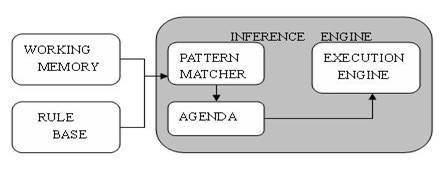
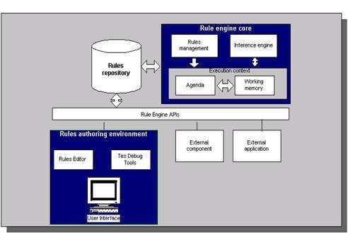
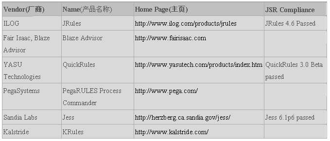

# Java 规则引擎与其 API (JSR-94)
Java 规则引擎与其 API (JSR-94) 详解

**标签:** Java

[原文链接](https://developer.ibm.com/zh/articles/j-java-rules/)

李国乐

发布: 2005-07-01

* * *

复杂企业级项目的开发以及其中随外部条件不断变化的业务规则(business logic),迫切需要分离商业决策者的商业决策逻辑和应用开发者的技术决策，并把这些商业决策放在中心数据库或其他统一的地方，让它们能在运行时（即商务时间）可以动态地管理和修改从而提供软件系统的柔性和适应性。规则引擎正是应用于上述动态环境中的一种解决方法。

本文第一部分简要介绍了规则引擎的产生背景和基于规则的专家系统，第二部分介绍了什么是规则引擎及其架构和算法，第三部分介绍了商业产品和开源项目实现等各种 Java 规则引擎，第四部分对 Java 规则引擎 API（JSR-94）作了详细介绍，讲解了其体系结构，管理 API 和运行时 API 及相关安全问题，第五部分则对规则语言及其标准化作了探讨，第六部分给出了一个使用 Java 规则引擎 API 的简单示例，第七部分给予小结和展望。

1

## 介绍

### 1.1 规则引擎产生背景

企业管理者对企业级 IT 系统的开发有着如下的要求：(1)为提高效率，管理流程必须自动化，即使现代商业规则异常复杂(2)市场要求业务规则经常变化，IT 系统必须依据业务规则的变化快速、低成本的更新(3)为了快速、低成本的更新，业务人员应能直接管理 IT 系统中的规则，不需要程序开发人员参与。

而项目开发人员则碰到了以下问题:(1)程序=算法+数据结构，有些复杂的商业规则很难推导出算法和抽象出数据模型(2)软件工程要求从需求->设计->编码，然而业务规则常常在需求阶段可能还没有明确，在设计和编码后还在变化，业务规则往往嵌在系统各处代码中(3)对程序员来说，系统已经维护、更新困难，更不可能让业务人员来管理。

基于规则的专家系统的出现给开发人员以解决问题的契机。规则引擎由基于规则的专家系统中的推理引擎发展而来。下面简要介绍一下基于规则的专家系统。

### 1.2 基于规则的专家系统(RBES)

专家系统是人工智能的一个分支，它模仿人类的推理方式，使用试探性的方法进行推理，并使用人类能理解的术语解释和证明它的推理结论。专家系统有很多分类：神经网络、基于案例推理和基于规则系统等。

RBES 包括三部分：Rule Base（knowledge base）、Working Memory（fact base）和 Inference Engine（推理引擎）。它们的结构如下所示：

##### 图 1.基于规则的专家系统组成



如上图所示，推理引擎包括三部分：Pattern Matcher、Agenda 和 Execution Engine。Pattern Matcher 何时执行哪个规则；Agenda 管理 PatternMatcher 挑选出来的规则的执行次序；Execution Engine 负责执行规则和其他动作。

推理引擎通过决定哪些规则满足事实或目标，并授予规则优先级，满足事实或目标的规则被加入议程。 存在两者推理方式：演绎法（Forward-Chaining 正向链）和归纳法（Backward-Chaining 反向链）。演绎法从一个初始的事实出发，不断地应用规则得出结论（或执行指定的动作）。而归纳法则是从假设出发，不断地寻找符合假设的事实。

2

## 规则引擎

### 2.1 业务规则

一个业务规则包含一组条件和在此条件下执行的操作，它们表示业务规则应用程序的一段业务逻辑。业务规则通常应该由业务分析人员和策略管理者开发和修改，但有些复杂的业务规则也可以由技术人员使用面向对象的技术语言或脚本来定制。业务规则的理论基础是:设置一个或多个条件，当满足这些条件时会触发一个或多个操作。

### 2.2 规则引擎

什么是规则引擎？规则引擎是如何执行规则的？这可以称之为”什么”与”如何”的问题。到底规则引擎是什么还是目前业界一个比较有争议的问题，在 JSR-94 种也几乎没有定义。可以这样认为充分定义和解决了”如何”的问题，”什么”问题本质上也迎刃而解。也许这又是一种”先有蛋还是先有鸡”哲学争论。今后标准规则语言的定义和推出及相关标准的制定应该可以给这样的问题和争论划上一个句号。本文中，暂且这样述说什么是规则引擎：规则引擎由推理引擎发展而来，是一种嵌入在应用程序中的组件，实现了将业务决策从应用程序代码中分离出来，并使用预定义的语义模块编写业务决策。接受数据输入，解释业务规则，并根据规则做出业务决策。

### 2.3 规则引擎的使用方式

由于规则引擎是软件组件，所以只有开发人员才能够通过程序接口的方式来使用和控制它，规则引擎的程序接口至少包含以下几种 API：加载和卸载规则集的 API；数据操作的 API；引擎执行的 API。开发人员在程序中使用规则引擎基本遵循以下 5 个典型的步骤：创建规则引擎对象；向引擎中加载规则集或更换规则集；向引擎提交需要被规则集处理的数据对象集合；命令引擎执行;导出引擎执行结果，从引擎中撤出处理过的数据。使用了规则引擎之后，许多涉及业务逻辑的程序代码基本被这五个典型步骤所取代。

一个开放的业务规则引擎应该可以”嵌入”在应用程序的任何位置，不同位置的规则引擎可以使用不同的规则集，用于处理不同的数据对象。此外，对使用引擎的数量没有限制。

### 2.4 规则引擎架构与推理

规则引擎的架构如下图所示：

##### 图 2\. 业务规则引擎架构



规则引擎的推理步骤如下：a. 将初始数据（fact）输入至工作内存(Working Memory)。b. 使用 Pattern Matcher 将规则库(Rules repository)中的规则（rule）和数据（fact）比较。c. 如果执行规则存在冲突（conflict），即同时激活了多个规则，将冲突的规则放入冲突集合。d. 解决冲突，将激活的规则按顺序放入 Agenda。e. 执行 Agenda 中的规则。重复步骤 b 至 e，直到执行完毕 Agenda 中的所有规则。

任何一个规则引擎都需要很好地解决规则的推理机制和规则条件匹配的效率问题。

当引擎执行时，会根据规则执行队列中的优先顺序逐条执行规则执行实例，由于规则的执行部分可能会改变工作区的数据对象，从而会使队列中的某些规则执行实例因为条件改变而失效，必须从队列中撤销，也可能会激活原来不满足条件的规则，生成新的规则执行实例进入队列。于是就产生了一种”动态”的规则执行链，形成规则的推理机制。这种规则的”链式”反应完全是由工作区中的数据驱动的。

规则条件匹配的效率决定了引擎的性能，引擎需要迅速测试工作区中的数据对象，从加载的规则集中发现符合条件的规则，生成规则执行实例。1982 年美国卡耐基·梅隆大学的 Charles L. Forgy 发明了一种叫 Rete 算法，很好地解决了这方面的问题。目前世界顶尖的商用业务规则引擎产品基本上都使用 Rete 算法。

### 2.5 规则引擎的算法

大部分规则引擎产品的算法，基本上都来自于 Dr. Charles Forgy 在 1979 年提出的 RETE 算法及其变体，Rete 算法是目前效率最高的一个 Forward-Chaining 推理算法，Drools 项目是 Rete 算法的一个面向对象的 Java 实现，Rete 算法其核心思想是将分离的匹配项根据内容动态构造匹配树，以达到显著降低计算量的效果。详情请见 CIS587:The RETE Algorithm，The Rete Algorithm，RETE 演算法，《专家系统原理与编程》中第 11 章等。

## 3\. Java 规则引擎

目前主流的规则引擎组件多是基于 Java 和 C++程序语言环境，已经有多种 Java 规则引擎商业产品与开源项目的实现，其中有的已经支持 JSR94，有的正朝这个方向做出努力，列出如下：

### 3.1 Java 规则引擎商业产品

Java 规则引擎商业产品主要有（Jess 不是开源项目，它可以免费用于学术研究，但用于商业用途则要收费）：



### 3.2 Java 规则引擎开源项目

开源项目的实现主要包括：

Drools – Drools 规则引擎应用 Rete 算法的改进形式 Rete-II 算法。从内部机制上讲，它使用了和 Forgy 的算法相同的概念和方法，但是增加了可与面向对象语言无缝连接的节点类型。

Mandarax 基于反向推理（归纳法）。能够较容易地实现多个数据源的集成。例如，数据库记录能方便地集成为事实集(facts sets)，reflection 用来集成对象模型中的功能。目前不支持 JSR 94

OFBiz Rule Engine – 支持归纳法(Backward chaining).最初代码基于 Steven John Metsker 的”Building Parsers in Java”，不支持 JSR 94

JLisa – JLisa 是用来构建业务规则的强大框架，它有着扩展了 LISP 优秀特色的优点,比 Clips 还要强大.这些特色对于多范例软件的开发是至关重要的.支持 JSR 94

其它的开源项目实现有诸如 Algernon, TyRuBa, JTP, JEOPS, InfoSapient, RDFExpert, Jena 2, Euler, JLog, Pellet OWL Reasoner, Prova, OpenRules, SweetRules, JShop2 等等。

4

## Java 规则引擎 API(JSR-94)

### 4.1 简介

过去大部分的规则引擎开发并没有规范化，有其自有的 API，这使得其与外部程序交互集成不够灵活。转而使用另外一种产品时往往意味需要重写应用程序逻辑和 API 调用，代价较大。规则引擎工业中标准的缺乏成为令人关注的重要方面。2003 年 11 月定稿并于 2004 年 8 月最终发布的 JSR 94（Java 规则引擎 API）使得 Java 规则引擎的实现得以标准化。

Java 规则引擎 API 由 javax.rules 包定义，是访问规则引擎的标准企业级 API。Java 规则引擎 API 允许客户程序使用统一的方式和不同厂商的规则引擎产品交互，就像使用 JDBC 编写独立于厂商访问不同的数据库产品一样。Java 规则引擎 API 包括创建和管理规则集合的机制，在 Working Memory 中添加，删除和修改对象的机制，以及初始化，重置和执行规则引擎的机制。

### 4.2 简介 Java 规则引擎 API 体系结构

Java 规则引擎 API 分为两个主要部分:运行时客户 API(the Runtime client API)和规则管理 API(the rules administration API)。

**4.2.1 规则管理 API**

规则管理 API 在 javax.rules.admin 中定义,包括装载规则以及与规则对应的动作(执行集 execution sets)以及实例化规则引擎。规则可以从外部资源中装载,比如说 URI,Input streams, XML streams 和 readers 等等.同时管理 API 提供了注册和取消注册执行集以及对执行集进行维护的机制。使用 admin 包定义规则有助于对客户访问运行规则进行控制管理,它通过在执行集上定义许可权使得未经授权的用户无法访问受控规则。

管理 API 使用类 RuleServiceProvider 来获得规则管理(RuleAdministrator)接口的实例.规则管理接口提供方法注册和取消注册执行集.规则管理器(RuleAdministrator)提供了本地和远程的 RuleExecutionSetProvider.在前面已提及,RuleExecutionSetProvider 负责创建规则执行集.规则执行集可以从如 XML streams, input streams 等来源中创建.这些数据来源及其内容经汇集和序列化后传送到远程的运行规则引擎的服务器上.大多数应用程序中,远程规则引擎或远程规则数据来源的情况并不多见.为了避免这些情况中的网络开销,API 规定了可以从运行在同一 JVM 中规则库中读取数据的本地 RuleExecutionSetProvider.

规则执行集接口除了拥有能够获得有关规则执行集的方法,还有能够检索在规则执行集中定义的所有规则对象.这使得客户能够知道规则集中的规则对象并且按照自己需要来使用它们。

**4.2.2 运行时 API**

运行时 API 定义在 javax.rules 包中,为规则引擎用户运行规则获得结果提供了类和方法。运行时客户只能访问那些使用规则管理 API 注册过的规则，运行时 API 帮助用户获得规则对话并且在这个对话中执行规则。

运行时 API 提供了对厂商规则引擎 API 实现的类似于 JDBC 的访问方法.规则引擎厂商通过类 RuleServiceProvider(类 RuleServiceProvider 提供了对具体规则引擎实现的运行时和管理 API 的访问)将其规则引擎实现提供给客户,并获得 RuleServiceProvider 唯一标识规则引擎的 URL.

URL 推荐标准用法是使用类似”com.mycompany.myrulesengine.rules.RuleServiceProvider”这样的 Internet 域名空间,这将有助于访问 URL 的唯一性.类 RuleServiceProvider 内部实现了规则管理和运行时访问所需的接口.所有的 RuleServiceProvider 要想被客户所访问都必须用 RuleServiceProviderManager 进行注册。注册方式类似于 JDBC API 的 DriverManager 和 Driver。

运行时接口是运行时 API 的关键部分.运行时接口提供了用于创建规则会话(RuleSession)的方法,规则会话如前所述是用来运行规则的.运行时 API 同时也提供了访问在 service provider 注册过的所有规则执行集(RuleExecutionSets).规则会话接口定义了客户使用的会话的类型,客户根据自己运行规则的方式可以选择使用有状态会话或者无状态会话。

无状态会话的工作方式就像一个无状态会话 bean.客户可以发送单个输入对象或一列对象来获得输出对象.当客户需要一个与规则引擎间的专用会话时,有状态会话就很有用.输入的对象通过 addObject() 方法可以加入到会话当中.同一个会话当中可以加入多个对象.对话中已有对象可以通过使用 updateObject()方法得到更新.只要客户与规则引擎间的会话依然存在,会话中的对象就不会丢失。

RuleExecutionSetMetaData 接口提供给客户让其查找规则执行集的元数据(metadata).元数据通过规则会话接口(RuleSession Interface)提供给用户。

使用运行时 Runtime API 的代码片断如下所示:

```
RuleServiceProvider ruleProvider =
RuleServiceProviderManager.getRuleServiceProvider
("com.mycompany.myrulesengine.rules. RuleServiceProvider");
RuleRuntime ruleRuntime = ruleProvider.getRuleRuntime();
StatelessRuleSession ruleSession = (StatelessRuleSession)
ruleRuntime.createRuleSession(ruleURL, null, RuleRuntime.STTELESS_SESSION_TYPE);
List inputRules = new ArrayList();
inputRules.add(new String("Rule 1"));
inputRules.add(new Integer(1));
List resultRules = ruleSession.executeRules(inputRules);

```

Show moreShow more icon

### 4.3 Java 规则引擎 API 安全问题

规则引擎 API 将管理 API 和运行时 API 加以分开,从而为这些包提供了较好粒度的安全控制.规则引擎 API 并没有提供明显的安全机制,它可以和 J2EE 规范中定义的标准安全 API 联合使用.安全可以由以下机制提供,如 Java authentication and authorization service (JAAS),the Java cryptography extension (JCE),Java secure Socket Extension (JSSE),或者其它定制的安全 API.JAAS 能被用来定义规则执行集的许可权限,从而只有授权用户才能访问。

### 4.4 异常与日志

规则引擎 API 定义了 javax.rules.RuleException 作为规则引擎异常层次的根类.所有其它异常都继承于这个根类.规则引擎中定义的异常都是受控制的异常(checked exceptions),所以捕获异常的任务就交给了规则引擎。 规则引擎 API 没有提供明确的日志机制,但是它建议将 Java Logging API 用于规则引擎 API。

### 4.5 JSR 94 小结

JSR 94 为规则引擎提供了公用标准 API,仅仅为实现规则管理 API 和运行时 API 提供了指导规范,并没有提供规则和动作该如何定义以及该用什么语言定义规则,也没有为规则引擎如何读和评价规则提供技术性指导.JSR 94 规范将上述问题留给了规则引擎的厂商.在下一节我将简要介绍一下规则语言。

5

## 规则语言

JSR 94 中没有涉及用来创建规则和动作的语言.规则语言是规则引擎应用程序的重要组成部分,所有的业务规则都必须用某种语言定义并且存储于规则执行集中,从而规则引擎可以装载和处理他们。

由于没有关于规则如何定义的公用规范,市场上大多数流行的规则引擎都有其自己的规则语言，目前便有许多种规则语言正在应用，因此，当需要将应用移植到其他的 Java 规则引擎实现时，可能需要变换规则定义，如将 Drools 私有的 DRL 规则语言转换成标准的 ruleML，Jess 规则语言转换成 ruleML 等。这个工作一般由 XSLT 转换器来完成。

规则语言的详情这里不作详细介绍，名称及其网址列出如下：

```
Rule Markup language (RuleML)                        http://www.ruleml.org/
Simple Rule Markup Language (SRML)                    http://xml.coverpages.org/srml.html
Business Rules Markup Language (BRML)                    http://xml.coverpages.org/brml.html
SWRL: A Semantic Web Rule Language Combining OWL and RuleML   http://www.daml.org/2003/11/swrl/

```

Show moreShow more icon

多种规则语言的使用使得不同规则引擎实现之间的兼容性成为问题.通用的规则引擎 API 或许可以减轻不同厂家 API 之间的问题,但公用规则语言的缺乏将仍然阻碍不同规则引擎实现之间的互操作性.尽管业界在提出公用规则语言上做出了一些努力, 比如说 RuleML,SRML 的出现,但距离获得绝大部分规则引擎厂商同意的公用标准还有很长的路要走。

6

## Java 规则引擎 API 使用示例

### 6.1 设置规则引擎

Java 规则引擎的管理活动阶段开始于查找一个合适的 javax.rules.RuleServiceProvider 对象，这个对象是应用程序访问规则引擎的入口。在 J2EE 环境中，你可能可以通过 JNDI 获得 RuleServiceProvider。否则，你可以使用 javax.rules.RuleServiceProviderManager 类：

```
javax.rules.RuleServiceProviderManager class:
           String implName = "org.jcp.jsr94.ri.RuleServiceProvider";
           Class.forName(implName);
           RuleServiceProvider
serviceProvider = RuleServiceProviderManager.getRuleServiceProvider(implName);

```

Show moreShow more icon

拥有了 RuleServiceProvider 对象，你就可以获得一个 javax.rules.admin.RuleAdministrator 类。从 RuleAdministrator 类中，你可以得到一个 RuleExecutionSetProvider，从类名可以知道，它用于创建 javax.rules.RuleExecutionSets 对象。RuleExecutionSet 基本上是一个装入内存的，准备好执行的规则集合。

包 javax.rules.admin 包括两个不同的 RuleExecutionSetProvider 类。RuleExecutionSetProvider 类本身包括了从 Serializable 对象创建 RuleExecutionSets 的方法，因此在规则引擎位于远程服务器的情况下，仍然可以使用 RuleExecutionSetProvider 类，构造器的参数可以通过 RMI 来传递。另一个类是 LocalRuleExecutionSetProvider，包含了其他方法，用于从非 Serializable 资源（如 java.io.Reader－本地文件）创建 RuleExectionSets。假设拥有了一个 RuleServiceProvider 对象，你可以从本地文件 rules.xml 文件创建一个 RuleExectionSet 对象。如以下的代码所示：

```
RuleAdministrator admin = serviceProvider.getRuleAdministrator();
          HashMap properties = new HashMap();
          properties.put("name", "My Rules");
          properties.put("description", "A trivial rulebase");
          FileReader reader = new FileReader("rules.xml");
          RuleExecutionSet ruleSet = null;
          try {
               LocalRuleExecutionSetProvider lresp =
               admin.getLocalRuleExecutionSetProvider(properties);
               ruleSet = lresp.createRuleExecutionSet(reader, properties);
          } finally {
               reader.close();
          }

```

Show moreShow more icon

接下来，你可以使用 RuleAdministrator 注册获得的 RuleExecutionSet，并给它分配一个名称。在运行时，你可以用同一个名称创建一个 RuleSession；该 RuleSession 使用了这个命名的 RuleExecutionSet。参见下面的用法：admin.registerRuleExecutionSet(“rules”, ruleSet, properties);

### 6.2 执行规则引擎

在运行时阶段，你可以参见一个 RuleSession 对象。RuleSession 对象基本上是一个装载了特定规则集合的规则引擎实例。你从 RuleServiceProvider 得到一个 RuleRuntime 对象，接下来，从 javax.rules.RuleRuntime 得到 RuleSession 对象。

RuleSession 分为两类：stateful 和 stateless。它们具有不同的功能。StatefulRuleSession 的 Working Memory 能够在多个方法调用期间保存状态。你可以在多个方法调用期间在 Working Memory 中加入多个对象，然后执行引擎，接下来还可以加入更多的对象并再次执行引擎。相反，StatelessRuleSession 类是不保存状态的，为了执行它的 executeRules 方法，你必须为 Working Memory 提供所有的初始数据，执行规则引擎，得到一个内容列表作为返回值。

下面的例子中，我们创建一个 StatefulRuleSession 实例，添加两个对象（一个 Integer 和一个 String）到 Working Memory，执行规则，然后得到 Working Memory 中所有的内容，作为 java.util.List 对象返回。最后，我们调用 release 方法清理 RuleSession：

```
RuleRuntime runtime = rsp.getRuleRuntime();
         StatefulRuleSession session = (StatefulRuleSession)
         runtime.createRuleSession("rules", properties,
         RuleRuntime.STATEFUL_SESSION_TYPE);
         session.addObject(new Integer(1));
         session.addObject("A string");
         session.executeRules();
         List results = session.getObjects();
         session.release();

```

Show moreShow more icon

7

## 结束语

Java 规则引擎 API(JSR-94)允许客户程序使用统一的方式和不同厂商的规则引擎产品交互，一定程度上给规则引擎厂商提供了标准化规范。但其几乎没有定义什么是规则引擎，当然也没有深入到规则是如何构建和操纵的，规则调用的效用，规则与 Java 语言的绑定等方面。并且 JSR-94 在对 J2EE 的支持上也不足。规则语言的标准化，JSR-94 的进一步的充实深化都有待研究。