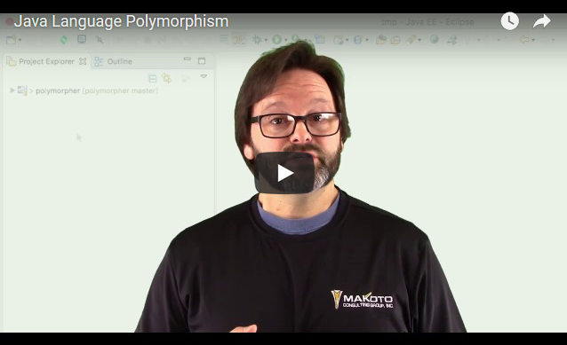

# Java 语言多态性
使用 Java 语言在您的项目中实现多态性

**标签:** Java

[原文链接](https://developer.ibm.com/zh/articles/java-language-polymorphism/)

J Steven Perry

发布: 2017-09-07

* * *

此文将演示如何使用 Java™ 语言实现多态性。有一些构建此文的视频和逐步操作说明。学习这些后，您就能使用 Java 语言在您的项目中实现多态性！

## 前提条件

#### Java 平台的基础知识

- 更多信息： [《Java 编程简介》学习路径，第 1 单元](https://www.ibm.com/developerworks/cn/java/j-perry-java-platform-overview/index.html)

#### 面向对象概念的基础知识

- 更多信息： [《Java 编程简介》学习路径，第 3 单元](https://www.ibm.com/developerworks/cn/java/j-perry-object-oriented-programming-concepts-and-principles/index.html)

### 逐步介绍

## 设置开发环境

要完成此文，需要安装 JDK 和 Eclipse IDE。假设您拥有一定的 Java 基础知识。如果没有，请查阅 IBM Developer 上的 [《Java 编程简介》学习路径](https://www.ibm.com/developerworks/cn/java/intro-to-java-course/index.html) 。

您还需要一个正常工作的开发环境。如果已有一个 Java 开发环境，可跳到第 2 步。

否则，请参阅 [《Java 编程简介》学习路径，第 2 单元](https://www.ibm.com/developerworks/cn/java/j-perry-setting-up-your-java-development-environment/index.html) 获得逐步操作说明。如果需要更多帮助，本节中还有一些视频可帮助您。

首先，下载 Java Development Kit (JDK) V8 并将它安装在您的机器上。如果需要帮助，请观看下面的视频。

[点击查看视频演示](http://v.youku.com/v_show/id_XMzAwOTY1MzAzNg==.html)

接下来，将 Eclipse IDE 安装在计算机上。如果需要帮助，请观看下面的视频。

[点击查看视频演示](http://v.youku.com/v_show/id_XMzAwOTY1NTgyNA==.html)

设置并准备好开发环境后，前进到第 2 步，在这一步中将介绍多态性。

## 定义多态性

多态性是面向对象编程中的一个概念，表示”不同形态”，实际上意味着，根据实现方法的对象，相同方法名称具有不同的行为。

在 Java 编程语言的语境中，多态性意味着（通过一种方法）以不同方式为不同对象实现相同的行为契约。在 Java 中，通常有 3 种方式实现此目的：

- 接口
- 抽象方法
- 方法重写

通过接口实现多态性

实质上，接口要求每个顶级对象实现都是不同的（顶级对象指的是继承图中第一个对象，该对象显式声明它实现了所指的接口）。在通过引用接口 A，而不是引用对象 B 来传递实现接口 A 的对象 B 时，就会实现多态性。

通过抽象方法实现多态性

Java 语言还能创建抽象方法，这种方法只能存在于抽象类（即无法实例化的类）上。这种实现方式的思路是，必须在分层结构中的某处由子类 B 实现（抽象类 A 上定义的）抽象方法（假设为 foo()），然后才能实例化 B。在通过引用接口 A 来传递类型 B 的对象时，就会实现多态性。

通过方法重写实现多态性

子类 B 提供父类 A 中的某个方法（假设为 foo()）的替代实现时，就可以说重写了 foo()。类型 B 的对象作为类型 A 传递给某个方法时，Java 运行时会确定是否必须实际调用 B.foo()，而不是 A.foo()。这就是通过方法重写实现多态性的方式。

## 编写代码

在设置开发环境并基本了解多态性后，是时候动手实践了。

在本节中，将从 Github 拉取代码，在 Eclipse 中创建一个新项目，导入该代码，并处理该代码。

我非常喜欢测试驱动开发 (TDD)，所以您首先将会执行单元测试，看看应用程序会有何种行为，然后实现该行为，直到通过单元测试。我在 com.makotojava.learn.polymorpher.solution 包中为必须编写的每个模块提供了一个解决方案，以防您遇到困难，或者想要了解我是如何实现该解决方案的。

在本视频中，我将展示以下内容：

[点击查看视频演示](http://v.youku.com/v_show/id_XMzAwOTY1NzEyMA==.html)

视频中的总体步骤（强烈建议跟着视频一起操作）：

- 克隆 Github 存储库。
- 打开 Eclipse。
- 基于 Github 中的代码导入新的 Maven 项目。
- 运行单元测试，并观察它们失败。
- 研究单元测试，了解应如何编写方法。
- 编写实现代码，直到通过单元测试。
- 恭喜您编写了一个具有多态性的应用程序！

## 融会贯通

这个应用程序演示了哪些知识？

第 2 步已提到，在 Java 语言中，多态性主要通过 3 种方法实现：

- 使用接口
- 使用抽象方法
- 使用方法重写

单元测试描述了实现过程。如果您学习了这些方法并真正理解了它们的工作原理（和原因），将很容易掌握多态性！

## 了解后续行动

实际了解多态性后，可通过访问 [《Java 编程简介》学习路径](https://www.ibm.com/developerworks/cn/java/intro-to-java-course/index.html) 进一步了解 Java 语言。

此文融合了第 3-6 单元课程的知识。如欲继续学习，请访问 [第 7 单元](https://www.ibm.com/developerworks/cn/java/j-perry-strings-and-operators/index.html) ！

希望您喜欢此文！

如果有疑问或想要与我交流，请在 Twitter 上关注我并向我发送推文 (@jstevenperry)。