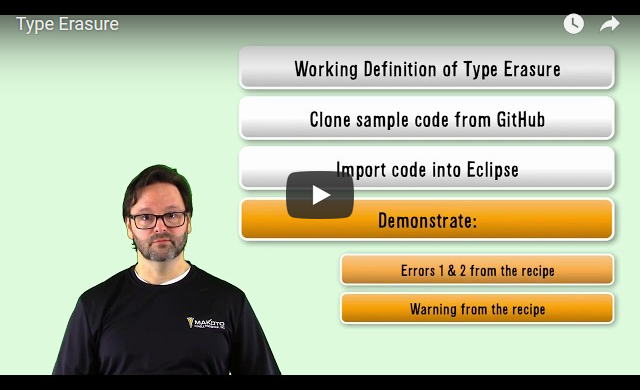

# Java 语言类型擦除
定义类型擦除，它与 Java 泛型的关系，以及未正确使用泛型时看到的一些神秘错误和警告消息

**标签:** Java

[原文链接](https://developer.ibm.com/zh/articles/java-language-type-erasure/)

J Steven Perry

发布: 2017-09-07

* * *

初学者只要学习了”Java 编程简介学习路径”的第 20 单元，也可以学习本文。

此文将定义类型擦除，它与 Java 泛型的关系，以及未正确使用泛型时看到的一些神秘错误和警告消息（相信我，我们都经历过这些）。

## 前提条件

#### Java 编程语言的基础知识

- 更多信息： [《Java 编程简介》学习路径，第 1 单元](https://www.ibm.com/developerworks/cn/java/j-perry-java-platform-overview/index.html)

#### Java 泛型的初中级知识（第 20 单元）

- 更多信息： [《Java 编程简介》学习路径，第 3 单元](https://www.ibm.com/developerworks/cn/java/j-perry-object-oriented-programming-concepts-and-principles/index.html)

### 逐步介绍

## 设置开发环境

要完成此文，需要安装 JDK 和 Eclipse IDE。假设您拥有一定的 Java 基础知识。如果没有，请查阅 IBM Developer 上的 [《Java 编程简介》学习路径](https://www.ibm.com/developerworks/cn/java/intro-to-java-course/index.html) 。

您还需要一个正常工作的开发环境。如果已有一个 Java 开发环境，可跳到第 2 步。

否则，请参阅 [《Java 编程简介》学习路径，第 2 单元](https://www.ibm.com/developerworks/cn/java/j-perry-setting-up-your-java-development-environment/index.html) 获得逐步操作说明。如果需要更多帮助，本节中还有一些视频可帮助您。

首先，下载 Java Development Kit (JDK) V8 并将它安装在您的机器上。如果需要帮助，请观看下面的视频。


[点击查看视频演示](http://v.youku.com/v_show/id_XMzAwOTY1MzAzNg==.html)

接下来，将 Eclipse IDE 安装在计算机上。如果需要帮助，请观看下面的视频。


[点击查看视频演示](http://v.youku.com/v_show/id_XMzAwOTY1NTgyNA==.html)

设置并准备好开发环境后，前进到第 2 步，这一步将定义类型擦除。

## 定义类型擦除

我们在编写 Java 代码时都会犯错，在犯错时，Java 编译器会提供警告和错误消息。但有时，从 Java 编译器获得的信息有些晦涩难懂，尤其是在使用 Java 泛型时（除非您已了解类型擦除）。

在此文中，将会展示您将看到的与 Java 泛型相关的一些最常见警告和错误，以及如何避免或修复它们。首先，我们需要定义泛型工作原理背后的重要概念，那就是类型擦除。

类型擦除是 Java 编译器用来支持使用泛型的一项技术。在 [《Java 编程简介》学习路径的第 20 单元](https://www.ibm.com/developerworks/cn/java/j-perry-generics/index.html) 中，我展示了如何使用 Java 泛型，您已在其中了解了如何创建参数化的类和方法。我没有真正谈论类型擦除，因为它是一个非常复杂的主题，而且如果正确使用 Java 泛型，实际上不需要理解它。

如果编写的 Java 代码足够长，就会看到我将展示的部分或所有消息。完成此文 后，您应能理解这些消息的含义，以及如何永远避免它们！

使用泛型定义参数化的类时，Java 编译器不会实际创建一个新类型（出于各种深层的技术原因，这里不会详细解释）。编译器会接受您指定的 类型，将它擦除并替换回以下两种类型之一：上限（如果您已指定）或 Object （如果没指定）。考虑这个示例：

```
public class ObjectContainer<T> {
    private T contained;
public ObjectContainer(T contained) {
    this.contained = contained;
}
public T  getContained() {
    return contained;
}
}

```

Show moreShow more icon

在这个示例中，声明参数化类型 ObjectContainer 时未指定上限，所以编译器生成以下代码：

```
public class ObjectContainer {
    private Object contained;
public ObjectContainer(Object contained) {
    this.contained = contained;
}
public Object getContained() {
    return contained;
}
}

```

Show moreShow more icon

因为没有上限，参数的类型 ( T ) 被擦除并替换回 Object 。在声明 ObjectContainer 时，编译器插入了一个强制转换，所以代码类似于：

```
ObjectContainer<Person> personContainer = new ObjectContainer<>(new Person("Steve", 49));
                             Person contained = personContainer.getContained();
System.out.println("ObjectContainer<Person> contains: " +contained.toString());

```

Show moreShow more icon

但是，编译器生成以下代码：

```
ObjectContainer personContainer = new ObjectContainer(new Person("Steve",49));
               Person contained = (Person)personContainer.getContained();
System.out.println("ObjectContainer<Person> contains: " +contained.toString());

```

Show moreShow more icon

请注意上面代码中转换为 Person 的强制转换。这是因为，编译器在幕后将声明的类型 ( Person ) 擦除并替换回 Object ，必须插入强制转换，代码才能正确运行。

使用限定类型时，就会出现类似情况，除非使用指定的上限，而不是使用 Object 作为上限。

考虑下面的代码：

```
public class ObjectContainer<T extends Person> {
    private T contained;
public ObjectContainer(T contained) {
    this.contained =contained;
}
public T getContained() {
    return contained;
}
}

```

Show moreShow more icon

在这种情况下，编译器生成以下代码：

```
public class ObjectContainer {
private Person contained;
public ObjectContainer(Person contained) {
this.contained = contained;
}
public Person getContained() {
return contained;
}
}

```

Show moreShow more icon

擦除参数的类型 ( T extends Person ) 并替换回 Person ，后者是上限。声明 ObjectContainer 时，编译器插入了一个强制转换，所以代码类似于：

```
ObjectContainer<Employee> personContainer = new ObjectContainer<>(new Employee("Steve", 49, "EMP001"));
                             Employee contained = personContainer.getContained();
System.out.println("ObjectContainer<Employee> contains: " + contained.toString());

```

Show moreShow more icon

但是，编译器生成以下代码：

```
ObjectContainer<Employee> personContainer = new ObjectContainer<>(new Employee("Steve", 49, "EMP001"));
               Employee<String> contained = (Employee)personContainer.getContained();
System.out.println("ObjectContainer<Employee> contains: " + contained.toString());

```

Show moreShow more icon

## 解决错误

泛型通常很容易使用。除了在个别情况下。在我的经验中，当我尝试执行从面向对象角度讲合理、但不受泛型支持的操作（通常为 [协变](https://en.wikipedia.org/wiki/Covariance_and_contravariance_(computer_science)?cm\_mc\_uid=02262581419415045137539&cm\_mc\_sid\_50200000=1504677006) ）时，就会出现这种情况。

接下来的 3 节将介绍两种错误和一种警告，如果您使用的泛型足够长，肯定会在某处看到这些错误和警告。看到它们后，您就会知道如何修复问题。

首先介绍错误。遇到这些错误时（您一定会遇到），您要知道发生了什么，这样才能修复它们。

然后将介绍比任何其他与泛型相关的警告更常见的警告。遇到此警告时（您一定会遇到），您就会知道该做什么。

## 错误 1 – “Erasure of method xyz(…) is the same as another method in type Abc”

考虑下面的代码：

```
public class App {
public int process(List<Person> people) {
    for (Person person : people) {
    log.info("Processing person: " + person.toString());
}
    return person.size();
}
public int process(List<Employee> employees) {
    for (Employee employee :employees) {
    log.info("Processing employee: " + employee.toString());
}
    return employees.size();
}
}

```

Show moreShow more icon

上面的代码初看起来很正常（比如 process() 只一个重载的方法），但是当您编译它时，会获得以下消息：

Erasure of method process(List) is the same as another method in type App Erasure of method process(List) is the same as another method in type App

发生了什么？这些方法有不同的方法签名，所以重载了 process() 方法，对吗？不对。回忆一下第 2 步，使用泛型时，（在本例中）编译器擦除了 <> 中指定的类型并替换回 Object 。编译器生成的代码类似于：

```
public class App {
public int process(List people) {
    for (Person person : people) {
    log.info("Processing person: " + person.toString());
}
    return person.size();
}
public int process(List employees) {
    for (Employee employee : employees) {
    log.info("Processing employee: " + employee.toString());
}
    return employees.size();
}
}

```

Show moreShow more icon

现在，存在的问题显而易见。两个具有相同签名 ( process(List) ) 的方法无法在同一个类中共存。

知道编译器如何擦除类型后，可以稍微更改一下设计来修复该问题：

```
public class App {
public int processPeople(List<Person>people) {
    for (Person person : people) {
    log.info("Processing person: " + person.toString());
}
    return person.size();
}
public int processEmployees(List<Employee> employees) {
    for (Employee employee : employees) {
    log.info("Processing employee: " + employee.toString());
}
    return employees.size();
}
}

```

Show moreShow more icon

现在，代码能正常编译，方法名称更准确地反映了它们实际执行的操作。

## 错误 2 – “The method xyz(Foo) in the type Abc is not applicable for the arguments (Foo)”

通常，会在以下情况下看到此错误： A 是 B 的超类，而且似乎可以合理地假设泛型类型 Foo **是 Foo 的子类（或者行为上类似子类，也就是说，具有协变行为）。但是，Java 泛型没有协变性，可以认为尽管 B 是 A 的子类，但 SomeGenericType **既不是 SomeGenericType** 的子类，行为也不像子类。**

基本上讲，此错误与我们已在方法名称上看到的错误非常相似，但此错误适用于方法参数。基础问题相同。

考虑下面的代码（备注： Employee 是 Person 的子类）：

```
public class App {
public int processPeople(List<Person> people){
    for (Person person : people) {
    log.info("Processing person: " + person.toString());
}
    return person.size();
}
..
}
..
    List<Employee>employees;
    employees = new ArrayList<>();
    employees.add(employee1);
    employees.add(employee2);
    App app = new App();
    // ERROR ON NEXT LINE!
    app.processPeople(employees);..

```

Show moreShow more icon

对 App.processPeople(List) 的调用生成以下错误消息：

The method processPeople(List) in the type App is not applicable for the arguments

(List)

最初，这似乎是合理的，因为 Employee 是 Person 的子类，我们可以将一个 List 传递给一个需要 List 的方法，对吗？

不对。由于类型擦除， List 和 List 被擦除并替换回 List 。（在我看来）该消息让人困惑，而且应提及错误的擦除方面（就像我们看到的第一个错误一样）。

因为已擦除该类型并替换回 Object ，所以您可能认为编译器会允许这种情况通过检测。但事实是，编译器知道，由于类型擦除， List 不是 List 的合适替代。擦除类型后，有关实际参数类型的信息就会丢失，而且允许编译此代码会导致运行时问题。

那么如何修复此问题？也可以专门使用（或创建）一个方法来处理（之前示例中的） Employee 。

```
public class App {
public int processPeople(List<Person> people){
    for (Person person : people) {
    log.info("Processing person: " + person.toString());
}
    return person.size();
}
public int processEmployees(List<Employee> employees) {
    for (Employee employee : employees) {
    log.info("Processing employee: " + employee.toString());
}
    return employees.size();
}
}..
    List<Employee> employees;
    employees = new ArrayList<>();
    employees.add(employee1);
    employees.add(employee2);
    App app = new App();
// ERROR ON NEXT LINE!
    app.processEmployees(employees);..

```

Show moreShow more icon

但是，如果没有 processEmployees() 方法，而且 Person 与 Employee 之间实际共享了”process person”的逻辑，该怎么办？可以将 processPeople() 的签名更改为：

```
public int processPeople(List<? extends Person> people)...
.
.
.
List<Employee> employees;
employees = new ArrayList<>();
employees.add(employee1);
employees.add(employee2);
App app = new App();
// THIS WORKS GREAT NOW!
app.processPeople(employees);

```

Show moreShow more icon

现在，编译器认为类型参数的上限为 Person ，并在它生成的代码中使用 Person （而不是 Object ），而且代码运行正常。

## 警告 – “Foo is a raw type.References to generic type Foo should be parameterized”

警告不会阻止程序运行，但获得警告就表明代码中的某处可能存在错误。看到类似这样的警告时，知道发生了什么会对您有所帮助，这样您就可以知道代码是正常的还是会在某个时刻引发问题。

泛型被设计为向后兼容原始类型（例如，对 List 的引用兼容 List ）。但是，您编写的任何使用泛型的新代码都绝不应该使用原始类型。

为什么？像这样通过引用在非参数化的泛型类型上调用方法是很危险的。它可能导致 [堆污染](https://docs.oracle.com/javase/tutorial/java/generics/nonReifiableVarargsType.html?cm_mc_uid=02262581419415045137539&cm_mc_sid_50200000=1504677006#heap_pollution) 等问题，我稍后将展示。

考虑下面的代码：

```
public class ObjectContainer<T> {
    private T contained;
public ObjectContainer(T contained) {
    this.contained = contained;
}
public T getContained() {
    return contained;
}
public void setContained(T contained){
    this.contained = contained;
}
@Override public String toString() {
    return contained.toString();
}
}
...
public class PersonContainer extends ObjectContainer<Person> {
public PersonContainer(Person contained) {
    super(contained);
}
@Override public void setContained(Person contained) {
    super.setContained(contained); }
}
..
PersonContainer pc = new PersonContainer(new Person("Test", 23));
    ObjectContainer oc = pc;
// WARNING occurs here System.out.println("PersonContainer (through ObjectContainer): " + oc.toString());

```

Show moreShow more icon

我引用的警告出现在我指定的位置上面的行上。在这里，准确的警告是：

ObjectContainer is a raw type.References to generic type ObjectContainer should be

parameterized

使用原始泛型类型时，可能发生糟糕的事情。您可能想知道会发生哪些糟糕的事情。请继续阅读。

考虑下面这段代码（它是在上一节的 ObjectContainer 定义的基础上构建的）：

由于类型擦除， PersonContainer 不再通过 setContained() 方法来获得多态性。请记住，泛型类型被擦除并替换回它的上限，所以 ObjectContainer 实际上看起来类似于：

```
public class ObjectContainer {
    private Object contained;
public ObjectContainer(Object contained) {
    this.contained = contained;
}
public Object getContained() {
    return contained;
}
public void setContained(Object contained) {
    this.contained = contained;
}
@Override public String toString() {
    return contained.toString();
}
}

```

Show moreShow more icon

目前一切顺利，但问题仍然存在，因为我在 PersonContainer 中提供了一个接受 Person 对象的 setContained() 版本。现在， PersonContainer 和它的超类 ObjectContainer 之间的 setContained() 签名是不同的。初看起来，似乎重写了 setContained() ，事实并非如此。

为了保留多态性，编译器为 PersonContainer 生成 setContained() **_桥接方法_** 的重写版本，所以 PersonContainer 实际上看起来类似于：

```
public class PersonContainer extends ObjectContainer<Person> {
public PersonContainer(Person contained) {
    super(contained);
}
//Bridge method generated by the compiler – you never see this method
//(unless there is a problem)
public void setContained(Object contained) {
    setContained((Person)contained);
}
@Override public void setContained(Person contained) {
    super.setContained(contained);
}
}

```

Show moreShow more icon

现在考虑如果运行此代码会发生什么 – 假设我将它放在一个测试方法中：

```
@Test
@DisplayName("Testing PersonContainer - will throw ClassCastException")
public void testSetContainedPerson() {
                PersonContainer pc = new PersonContainer(new Person("Test", 23));
                ObjectContainer oc = pc;
// WARNING occurs here
                System.out.println("PersonContainer (through ObjectContainer): " + oc.toString());
// ClassCastException.Not good.assertThrows(ClassCastException.class, () -> oc.setContained("Howdy!"));
}

```

Show moreShow more icon

这就是我们所说的堆污染。堆污染不是好事。

类型擦除支持泛型类型的向后兼容，但如果未正确使用泛型，可能导致各种各样的烦人问题。

现在您已更深入地了解了类型擦除，在遇到与泛型相关的错误和警告消息时，您将能更好地处理它们。

使用泛型时的最佳经验规则是：坚决不让泛型相关警告悄然存在。编译器会提醒您未正确使用泛型，而且您应认真留意到这些警告。

## 解决错误（视频）

我创建了一个视频来演练前几节中的代码，指出我们看到的各种错误，以及您不当使用泛型时，编译器为了提醒”危险”而发出的一些警告。

在该视频中，我展示了如何：

- 克隆包含此 recipe 的代码的 Github 存储库。
- 将基于 Github 中的代码的新 Maven 项目导入 Eclipse 中。
- 演示：

- - 错误 1 和错误 2，
    - 忽略警告时会发生什么（糟糕的事情！）
    - 一个额外警告，如果忽略该警告，则会发生其他糟糕的事情！



[点击查看视频演示](http://v.youku.com/v_show/id_XMzAwOTY1ODk1Ng==.html)

## 后续行动

网上与类型擦除和 Java 泛型相关的资源有许多。本节给出了我最喜欢的一些资源。尽情阅读吧！

[Angelika Langer – 类型擦除](http://www.angelikalanger.com/GenericsFAQ/FAQSections/TechnicalDetails.html?cm_mc_uid=02262581419415045137539&cm_mc_sid_50200000=1504677006#Topic3)

[Oracle 文档 – 类型擦除](https://docs.oracle.com/javase/tutorial/java/generics/erasure.html?cm_mc_uid=02262581419415045137539&cm_mc_sid_50200000=1504677006)