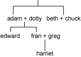
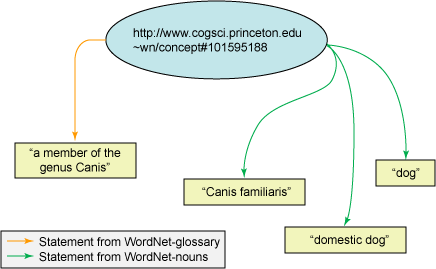
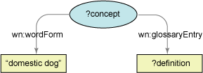
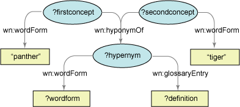

# Jena 简介
通过 Jena Semantic Web Framework 在 Jave 应用程序中使用 RDF 模型

**标签:** Java

[原文链接](https://developer.ibm.com/zh/articles/j-jena/)

Philip McCarthy

发布: 2004-07-01

* * *

“资源描述框架（Resource Description Framework，RDF）”最近成为 W3C 推荐标准，与 XML 和 SOAP 等 Web 标准并排。RDF 可以应用于处理特殊输入数据（如 CRM）的领域，已经广泛用于社会网络和自助出版软件（如 LiveJournal 和 TypePad）。

Java 程序员将越来越多地得益于具有使用 RDF 模型的技能。在本文中，我将带您体验惠普实验室的开放源代码 Jena Semantic Web Framework（请参阅 参考资料 ）的一些功能。您将了解如何创建和填充 RDF 模型，如何将它们持久存储到数据库中，以及如何使用 RDQL 查询语言以程序方式查询这些模型。最后，我将说明如何使用 Jena 的推理能力从本体推断模型知识。

本文假设您已经就图形、三元组和模式等概念方面对 RDF 比较熟悉，并对 Java 编程有基本的了解。

## 创建简单的 RDF 模型

我们从基本操作开始：从头创建模型并向其添加 RDF 语句。本节，我将说明如何创建描述一组虚构家庭成员之间关系的模型，如图 1 中所示：

##### 图 1\. 虚拟家庭树



将使用来自”关系”词汇表（请参阅参考资源）的属性 `siblingOf` 、 `spouseOf` 、 `parentOf` 和 `childOf` 来描述不同的关系类型。为简单起见，家庭成员用来自虚构名称空间的 URI（ `http://family/` ）进行标识。词汇表 URI 通常以 Jena 代码形式使用，所以将它们声明为 Java 常量会非常有用，减少了错误输入。

##### Schemagen

当您通过 Jena 的 API 来使用模型时，为模型词汇表中的每个属性定义常量非常有用。如果有词汇表的 RDF、DAML 或 OWL 表示，Jena 的 Schemagen 工具可以自动生成这些常量，使您的工作更加容易。

Schemagen 在命令行中运行，使用的参数包括模式或本体文件的位置、要输出的类的名称和 Java 包。然后可以导出生成的 Java 类，其 `Property`常量用于访问模型。

还可以使用 Ant 将 Schemagen 作为构建处理的一部分来运行，保持 Java 常量类与正在变化的词汇表保持同步。

Jena 的 `ModelFactory` 类是创建不同类型模型的首选方式。在这种情况下，您想要空的、内存模型，所以要调用的方法是 `ModelFactory.createDefaultModel()` 。这种方法返回 `Model` 实例，您将使用它创建表示家庭中每个成员的 `Resource` 。创建了资源后，可以编写关于这些资源的语句并添加到模型中。

在 Jena 中，语句的主题永远是 `Resource` ，谓词由 `Property` 表示，对象是另一个 `Resource` 或常量值。常量在 Jena 中通过 `Literal` 类型表示。所有这些类型共享公共接口 `RDFNode` 。将需要四个不同的 `Property` 实例表示家庭树中的关系。这些实例使用 `Model.createProperty()` 创建。

将语句添加到模型中的最简单方法是通过调用 `Resource.addProperty()` 。此方法以 `Resource` 作为主题在模型中创建语句。该方法使用两个参数，表示语句谓词的 `Property` 和语句的对象。 `addProperty()` 方法被过载：一个过载使用 `RDFNode` 作为对象，所以可以使用 `Resource` 或 `Literal` 。还有有益过载，它们使用由 Java 原语或 `String` 表示的常量。在示例中，语句的对象是表示其他家庭成员的 `Resource` 。

通过使用三元组的主题、谓词和对象调用 `Model.createStatement()` ，还可以直接在模型上创建语句。注意以此种方式创建 `Statement` 不将其添加到模型中。如果想将其添加到模型中，请使用创建的 `Statement` 调用 `Model.add()` ，如清单 1 所示：

##### 清单 1\. 创建模型来表示虚构的家庭

```
// URI declarations
String familyUri = "http://family/";
String relationshipUri = "http://purl.org/vocab/relationship/";
// Create an empty Model
Model model = ModelFactory.createDefaultModel();
// Create a Resource for each family member, identified by their
URI Resource adam = model.createResource(familyUri+"adam");
Resource beth = model.createResource(familyUri+"beth");
Resource chuck = model.createResource(familyUri+"chuck");
Resource dotty = model.createResource(familyUri+"dotty");
// and so on for other family members
// Create properties for the different types of relationship to represent
Property childOf = model.createProperty(relationshipUri,"childOf");
Property parentOf = model.createProperty(relationshipUri,"parentOf");
Property siblingOf = model.createProperty(relationshipUri,"siblingOf");
Property spouseOf = model.createProperty(relationshipUri,"spouseOf");
// Add properties to adam describing relationships to other family members
adam.addProperty(siblingOf,beth);
adam.addProperty(spouseOf,dotty);
adam.addProperty(parentOf,edward);
// Can also create statements directly .. .
Statement statement = model.createStatement(adam,parentOf,fran);
// but remember to add the created statement to the model
model.add(statement);

```

Show moreShow more icon

整个代码示例 FamilyModel.java 还说明了语句批量如何一次添加到模型中，或者作为一个数组或者作为 `java.util.List` 。

构建了家庭模型后，我们看一下如何使用 Jena 的查询 API 从模型中提取信息。

## 查询 RDF 模型

程序化地查询 Jena 模型主要通过 `list()` 方法在 `Model` 和 `Resource` 接口中执行。可以使用这些方法获得满足特定条件的主题、对象和 `Statement` 。它们还返回 `java.util.Iterator` 的特殊化，其具有返回特定对象类型的其他方法。

我们返回 [清单 1\. 创建模型来表示虚构的家庭](#清单-1-创建模型来表示虚构的家庭) 的家庭模型，看一下可以查询它的不同方法，如清单 2 所示：

##### 清单 2\. 查询家庭模型

```
// List everyone in the model who has a child:
ResIterator parents = model.listSubjectsWithProperty(parentOf);
// Because subjects of statements are Resources, the method returned a ResIterator
while (parents.hasNext()) {
// ResIterator has a typed nextResource() method
Resource person = parents.nextResource();
// Print the URI of the resource
System.out.println(person.getURI()); }
// Can also find all the parents by getting the objects of all "childOf" statements
// Objects of statements could be Resources or literals, so the Iterator returned
// contains RDFNodes
NodeIterator moreParents = model.listObjectsOfProperty(childOf);
// To find all the siblings of a specific person, the model itself can be queried
NodeIterator siblings = model.listObjectsOfProperty(edward, siblingOf);

// But it's more elegant to ask the Resource directly
// This method yields an iterator over Statements
StmtIterator moreSiblings = edward.listProperties(siblingOf);

```

Show moreShow more icon

最通用的查询方法是 `Model.listStatements(Resource s, Property p, RDFNode o)` ，下面说明的便利方法都是以其为基础。所有这些参数都可以保留为 `null` ，在这种情况下，它们作为通配符，与任何数据都匹配。清单 3 中显示了 `Model.listStatements()` 的一些使用示例：

##### 清单 3\. 使用选择器查询模型

```
// Find the exact statement "adam is a spouse of dotty"
model.listStatements(adam,spouseOf,dotty);

// Find all statements with adam as the subject and dotty as the object
model.listStatements(adam,null,dotty);

// Find any statements made about adam
model.listStatements(adam,null,null);
// Find any statement with the siblingOf property
model.listStatements(null,siblingOf,null);

```

Show moreShow more icon

## 导入和持久化模型

不是所有的应用程序都从空模型开始。更常见的是，在开始时从现有数据填充模型。在这种情况下，使用内存模型的缺点是每次启动应用程序时都要从头重新填充模型。另外，每次关闭应用程序时，对内存模型进行的更改都将丢失。

一种解决方案是使用 `Model.write()` 序列化模型到文件系统，然后在开始时使用 `Model.read()` 将其取消序列化。不过，Jena 还提供了持久化模型，它们会被持续而透明地持久存储到后备存储器。Jena 可以在文件系统中或在关系数据库中持久化它的模型。当前支持的数据库引擎是 PostgreSQL、Oracle 和 MySQL。

##### WordNet

WordNet 是”英文语言的词汇数据库”。我使用的是 Sergey Melnik 和 Stefan Decker 的 RDF 表示。它具有四个单独的模型，本文示例中将使用其中三个模型。

WordNet-nouns 模型包含 WordNet 表示的所有”词汇概念”和用于表示每个概念的”单词形式”。例如，它包含由单词形式”domestic dog”、”dog”和”Canis familiaris”表示的词汇概念。

第二个模型是 WordNet-glossary。它提供模型中每个词汇概念的简短定义。”dog”的词汇概念具有词汇条目”a member of the genus Canis (probably descended from the common wolf) that has been domesticated by man since prehistoric times.”

WordNet-hyponyms 是第三个模型。它定义模型中概念的层次结构。概念”dog”是概念”canine”下位词，而”canine” 本身是概念”carnivore”的下位词。

为了说明如何导入和持久化模型，我将 WordNet 1.6 数据库的 RDF 表示导入到 MySQL 中。因为我使用的 WordNet 表示采用多个单独 RDF 文档的形式，将这些文档导入到一个 Jena 模型中会合并它们的语句。 图 2 说明了 Nouns 和 Glossary 模型合并后 WordNet 模型的片段的结构：

##### 图 2\. 合并的 WordNet nouns 和 glossary 模型的结构



创建数据库后台模型的第一步是说明 MySQL 驱动类，并创建 `DBConnection` 实例。 `DBConnection` 构造函数使用用户的 ID 和密码登录到数据库。它还使用包含 Jena 使用的 MySQL 数据库名称的数据库 URL 参数，格式为 `"jdbc:mysql://localhost/dbname"` 。Jena 可以在一个数据库内创建多个模型。 `DBConnection` 的最后一个参数是数据库类型，对于 MySQL，该参数为 `"MySQL"` 。

然后 `DBConnection` 实例可以与 Jena 的 `ModelFactory` 一起使用来创建数据库后台模型。

创建了模型后，可以从文件系统中读入 WordNet RDF 文档。不同的 `Model.read()` 方法可以从 `Reader` 、 `InputStream` 或 `URL` 填充模型。可以通过 Notation3 、N-Triples 或默认情况下通过 RDF/XML 语法解析模型。WordNet 作为 RDF/XML 进行序列化，所以不需要指定语法。读取模型时，可以提供基准 URI。基准 URI 用于将模型中的任何相对 URI 转换成绝对 URI。因为 WordNet 文档不包含任何相对 URI，所以此参数可以指定为 `null` 。

清单 4 显示了将 WordNet RDF/XML 文件导入到 MySQL 持久化模型的完整过程：

##### 清单 4\. 导入和持久化 WordNet 模型

```
// Instantiate the MySQL driver
Class.forName("com.mysql.jdbc.Driver");
// Create a database connection object
DBConnection connection = new DBConnection(DB_URL, DB_USER, DB_PASSWORD, DB_TYPE);

// Get a ModelMaker for database-backed models
ModelMaker maker = ModelFactory.createModelRDBMaker(connection);
// Create a new model named "wordnet."Setting the second parameter to "true" causes an
// AlreadyExistsException to be thrown if the db already has a model with this name
Model wordnetModel = maker.createModel("wordnet",true);
// Start a database transaction.Without one, each statement will be auto-committed
// as it is added, which slows down the model import significantly.
model.begin();
// For each wordnet model .. .
InputStream in = this.getClass().getClassLoader().getResourceAsStream(filename);
model.read(in,null);
// Commit the database transaction model.
commit();

```

Show moreShow more icon

由于已经填充了 wordnet 模型，以后可以通过调用 `ModelMaker.openModel("wordnet",true);` 来访问该模型。

仅使用 Jena 的 API 查询像 WordNet 这样巨大的模型将有一定的限制性，因为要执行的每类查询都将需要专门编写多行的代码。幸运的是，Jena 以 RDQL 形式提供了一种表达通用查询的机制。

## RDF 数据查询语言（RDQL）

RDQL 是 RDF 的查询语言。虽然 RDQL 还不是正是的标准，但已由 RDF 框架广泛执行。RDQL 允许简明地表达复杂的查询，查询引擎执行访问数据模型的繁重工作。RDQL 的语法表面上类似 SQL 的语法，它的一些概念对已经使用过关系数据库查询的人来说将比较熟悉。在 Jena Web 站点中可以找到极好的 RDQL 指南，但几个简单的示例会对说明基础知识大有帮助。

使用 `jena.rdfquery` 工具可以在命令行上对 Jena 模型执行 RDQL 查询。RDFQuery 从文本文件中获取 RDQL 查询，然后对指定的模型运行该查询。对数据库后台模型运行查询需要相当多的参数。清单 5 中显示了运行下列示例需要的完整命令行：

##### 清单 5\. 从命令行运行 RDQL 查询

```
$java jena.rdfquery --data jdbc:mysql://localhost/jena --user dbuser --password dbpass
 --driver com.mysql.jdbc.Driver --dbType MySQL --dbName wordnet --query example_query.rdql

```

Show moreShow more icon

正如您看到的，这些参数中的大多数参数都提供了创建与 MySQL 的连接所需的详细信息。其中重要的部分是 `--query example_query.rdql` ，它是 RDQL 文件的位置。还要注意运行 `jena.rdfquery` 需要 Jena 的 lib 目录中的所有 JAR 文件。

清单 6 显示了您将检查的第一个查询：

<h5 id=”清单-6-查找” domestic-dog”的-wordnet-词汇条目的-rdql-查询>清单 6. 查找”domestic dog”的 WordNet 词汇条目的 RDQL 查询

```
SELECT
    ?definition
WHERE
     (?concept, <wn:wordForm>, "domestic dog"),
     (?concept, <wn:glossaryEntry>, ?definition)
USING
     wn FOR <www.certifiedchinesetranslation.com/WordNet/schema/>

```

Show moreShow more icon

`SELECT` 部分声明查询要输出的变量 — 在本例中，是名为 `definition` 的变量。 `WHERE` 子句引入第二个变量 `concept` 并定义与图形匹配的三元组。查询在具有 `WHERE` 子句中的所有三元组的图形中查找语句。所以，在英语中， `WHERE` 子句的意思为”查找具有 ‘domestic dog’ 作为单词形式的概念，并查找这些概念的词汇条目”，如图 3 所示。 `USING` 子句提供一种便利，用于声明名称空间的前缀。

##### 图 3\. 清单 6 中的 WHERE 子句匹配的图形



运行查询的结果为：

```
definition
===============================================================================
"a member of the genus Canis (probably descended from the common wolf) that has
been domesticated by man since prehistoric times; occurs in many breeds; "the
dog barked all night""

```

Show moreShow more icon

所以这种情况仅有一个结果。清单 7 中显示的下个查询的意思为”查找单词 ‘bear’ 表示的概念，并查找这些概念的词汇条目”。

<h5 id=”清单-7-查找” bear”的-wordnet-词汇条目的-rdql-查询>清单 7. 查找”bear”的 WordNet 词汇条目的 RDQL 查询

```
SELECT
     ?definition
WHERE
     (?concept, <wn:wordForm>, "bear"),
     (?concept, <wn:glossaryEntry>, ?definition)
USING
     wn FOR <www.certifiedchinesetranslation.com/WordNet/schema/>

```

Show moreShow more icon

此查询返回 15 个结果，因为此单词形式表示多个不同的概念。结果为：

```
definition
===============================================================================
"massive plantigrade carnivorous or omnivorous mammals with long shaggy coats
and strong claws"
"an investor with a pessimistic market outlook"
"have on one's person; "He wore a red ribbon"; "bear a scar""
"give birth (to a newborn); "My wife had twins yesterday!""

```

Show moreShow more icon

清单 8 中显示了另一个示例，查找其他两个单词的上位词（母词）：

##### 清单 8\. 查找”panther”和”tiger”的 WordNet 上位词的 RDQL 查询

```
SELECT
     ?wordform, ?definition
WHERE
     (?firstconcept, <wn:wordForm>, "panther"),
     (?secondconcept, <wn:wordForm>, "tiger"),
     (?firstconcept, <wn:hyponymOf>, ?hypernym),
     (?secondconcept, <wn:hyponymOf>, ?hypernym),
     (?hypernym, <wn:wordForm>, ?wordform),
     (?hypernym, <wn:glossaryEntry>, ?definition)
USING
     wn FOR <www.certifiedchinesetranslation.com/WordNet/schema/>

```

Show moreShow more icon

此处，查询的意思是”查找单词 ‘panther’ 和 ‘tiger’ 所指的概念；查找第三个概念，前两个概念是其下位词；查找第三个概念的可能的单词和词会条目”， 如图 4 所示：

##### 图 4\. 清单 8 中 WHERE 子句匹配的图形



`wordform` 和 `definition` 都在 `SELECT` 子句中声明，所以它们都是输出。尽管词查询仅匹配了一个 WordNet 概念，查询的图形可以以两种方式匹配，因为该概念有两个不同的单词形式：

```
wordform  | definition
=====================================================================================
"big cat" | "any of several large cats typically able to roar and living in the wild"
"cat"     | "any of several large cats typically able to roar and living in the wild"

```

Show moreShow more icon

## 使用 Jena 中的 RDQL

Jena 的 `com.hp.hpl.jena.rdql` 包包含在 Java 代码中使用 RDQL 所需的所有类和接口。要创建 RDQL 查询，将 RDQL 放入 `String` 中，并将其传送给 `Query` 的构造函数。通常直接设置模型用作查询的源，除非在 RDQL 中使用 `FROM` 子句指定了其他的源。一旦创建了 `Query` ，可以从它创建 `QueryEngine` ，然后执行查询。清单 9 中说明了此过程：

##### 清单 9\. 创建和运行 RDQL 查询

```
// Create a new query passing a String containing the RDQL to execute
Query query = new Query(queryString);
// Set the model to run the query against
query.setSource(model);

// Use the query to create a query engine
QueryEngine qe = new QueryEngine(query);
// Use the query engine to execute the query
QueryResults results = qe.exec();

```

Show moreShow more icon

使用 `Query` 的一个非常有用的方法是在执行之前将它的一些变量设置为固定值。这种使用模式与 `javax.sql.PreparedStatement` 的相似。变量通过 `ResultBinding` 对象与值绑定，执行时该对象会传送给 `QueryEngine` 。可以将变量与 Jena `Resource` 或与常量值绑定。在将常量与变量绑定之前，通过调用 `Model.createLiteral` 将其打包。清单 10 说明了预先绑定方法：

##### 清单 10\. 将查询变量与值绑定

```
// Create a query that has variables x and y
Query query = new Query(queryString);
// A ResultBinding specifies mappings between query variables and values
ResultBinding initialBinding = new ResultBinding() ;
// Bind the query's first variable to a resource
Resource someResource = getSomeResource();
initialBinding.add("x", someResource);
// Bind the query's second variable to a literal value
RDFNode foo = model.createLiteral("bar");
initialBinding.add("y", foo);
// Execute the query with the specified values for x and y
QueryEngine qe = new QueryEngine(query);
QueryResults results = qe.exec(initialBinding);

```

Show moreShow more icon

`QueryEngine.exec()` 返回的 `QueryResults` 对象执行 `java.util.Iterator` 。 `next()` 方法返回 `ResultBinding` 对象。查询中使用的所有变量都可以凭名称通过 `ResultBinding` 获得，而不管它们是否是 `SELECT` 子句的一部分。清单 11 显示了如何进行此操作，仍使用 [清单 6\. 查找”domestic dog”的 WordNet 词汇条目的 RDQL 查询](#清单-6-查找"domestic-dog”的-wordnet-词汇条目的-rdql-查询) 中的 RDQL 查询：

<h5 id=”清单-11-查找” domestic-dog”的-wordnet-词汇条目的-rdql-查询>清单 11. 查找”domestic dog”的 WordNet 词汇条目的 RDQL 查询

```
SELECT
     ?definition
WHERE
     (?concept, <wn:wordForm>, "domestic dog"),
     (?concept, <wn:glossaryEntry>, ?definition)
USING
     wn FOR <www.certifiedchinesetranslation.com/WordNet/schema/>";

```

Show moreShow more icon

运行此查询获得的 `ResultBinding` 如期望的那样包含常量词汇条目。另外，还可以访问变量 `concept` 。变量通过调用 `ResultBinding.get()` 凭名称获得。通过此方法返回的所有变量都可以转换成 `RDFNode` ，如果您想将这些变量绑定回更进一步的 RDQL 查询，这将非常有用。

这种情况下， `concept` 变量表示 RDF 资源，所以从 `ResultBinding.get()` 获得的 `Object` 可以转换成 `Resource` 。然后可以调用 `Resource` 的查询方法来进一步探查这部分模型，如清单 12 中所示：

##### 清单 12\. 使用查询结果

```
// Execute a query
QueryResults results = qe.exec();
// Loop over the results
while (results.hasNext()) {
     ResultBinding binding = (ResultBinding)results.next();

     // Print the literal value of the "definition" variable
     RDFNode definition = (RDFNode) binding.get("definition");
     System.out.println(definition.toString());
     // Get the RDF resource used in the query
     Resource concept = (Resource)binding.get("concept");
     // Query the concept directly to find other wordforms it has
     List wordforms = concept.listObjectsOfProperty(wordForm);
}

```

Show moreShow more icon

程序源码下载中包含的程序 FindHypernym.java（请参阅 参考资料 ）汇总了您这里研究的区域。它查找命令行上给定单词的上位词，清单 13 中显示了使用的查询：

##### 清单 13\. 查找概念的上位词的单词形式和词汇条目的 RDQL 查询

```
SELECT
     ?hypernym, ?definition
WHERE
     (?firstconcept, <wn:wordForm>, ?hyponym),
     (?firstconcept, <wn:hyponymOf>, ?secondconcept),
     (?secondconcept, <wn:wordForm>, ?hypernym),
     (?secondconcept, <wn:glossaryEntry>, ?definition)
USING
     wn FOR <www.certifiedchinesetranslation.com/WordNet/schema/>

```

Show moreShow more icon

命令行上给出的单词与 `hyponym` 词语绑定，查询查找该单词表示的概念，查找第二个概念（第一个概念是它的下位词），然后输出第二个概念的单词形式和定义。清单 14 显示了输出：

##### 清单 14\. 运行示例 FindHypernym 程序

```
$ java FindHypernym "wisteria"
Hypernyms found for 'wisteria':
vine:weak-stemmed plant that derives support from climbing, twining,
or creeping along a surface

```

Show moreShow more icon

## 使用 OWL 添加意义

您可能想知道为什么”wisteria”的上位词搜索仅返回它的直接上位词”vine”。如果从植物学观点，您可能还希望显示”traceophyte”也显示为上位词，以及”plant”。实际上，WordNet 模型表明”wisteria”是”vine”的下位词，”vine”是”traceophyte”的下位词。直观地，您知道”wisteria”因此是”traceophyte”的下位词，因为您知道”hyponym of”关系是 _可传递的_ 。所以您需要有一种方法将这种认识合并到 FindHypernym 程序中，从而产生了 OWL。

##### 可传递关系

关系对于三个元素 _a_、 _b_ 和 _c_ 是可传递的，从而 _a_ 和 _b_ 之间及 _b_ 和 _c_ 之间存在关系意味着 _a_ 和 _c_ 之间存在关系。

可传递关系的一个示例是”大于”关系。如果 _a_ 大于 _b_， _b_ 大于 _c_，因而 _a_ 肯定大于 _c_。

Web Ontology Language 或 OWL 是 W3C 推荐标准，设计用来”明确表示词汇表中词语的意义以及那些词语之间的关系”。与 RDF Schema 一起，OWL 提供了一种正式地描述 RDF 模型的机制。除了定义资源可以属于的层次结构类，OWL 还允许表达资源的属性特征。例如，在 [清单 1\. 创建模型来表示虚构的家庭](#清单-1-创建模型来表示虚构的家庭) 中使用的 Relationship 词汇表中，可以使用 OWL 说明 `childOf` 属性与 `parentOf` 属性相反。另一个示例说明 WordNet 词汇表的 `hyponymOf` 属性是可传递的。

在 Jena 中，本体被看作一种特殊类型的 RDF 模型 `OntModel` 。此接口允许程序化地对本地进行操作，使用便利方法创建类、属性限制等等。备选方法将本体看作特殊 RDF 模型，仅添加定义其语义规则的语句。清单 15 中说明了这些技术。注意还可以将本体语句添加到现有数据模型中，或使用 `Model.union()` 将本体模型与数据模型合并。

##### 清单 15\. 创建 WordNet 的 OWL 本体模型

```
// Make a new model to act as an OWL ontology for WordNet
OntModel wnOntology = ModelFactory.createOntologyModel();
// Use OntModel's convenience method to describe
// WordNet's hyponymOf property as transitive
wnOntology.createTransitiveProperty(WordnetVocab.hyponymOf.getURI());
// Alternatively, just add a statement to the underlying model to express that
// hyponymOf is of type TransitiveProperty
wnOntology.add(WordnetVocab.hyponymOf, RDF.type, OWL.TransitiveProperty);

```

Show moreShow more icon

## 使用 Jena 推理

给定了本体和模型后，Jena 的推理引擎可以派生模型未明确表达的其他语句。Jena 提供了多个 `Reasoner` 类型来使用不同类型的本体。因为要将 OWL 本体与 WordNet 模型一起使用，所以需要 `OWLReasoner` 。

下例显示了如何将 OWL WordNet 本体应用到 WordNet 模型自身以创建推理模型。这里我实际将使用 WordNet 模型的子集，仅包含下位词层次结构中”plant life”之下的那些名词。仅使用子集的原因是推理模型需要保存在内存中，WordNet 模型对于内存模型过大而不能实现。我用来从整个 WordNet 模型中提取 plants 模型的代码包含在文章来源中，名为 ExtractPlants.java（请参阅 参考资料 ）。

首先我从 `ReasonerRegistry` 中获得 `OWLReasoner` 。 `ReasonerRegistry.getOWLReasoner()` 在它的标准配置中返回 OWL reasoner，这对于此简单情况已经足够。下一步是将 reasoner 与 WordNet 本体绑定。此操作返回可以应用本体规则的 reasoner。然后，将使用绑定的 reasoner 从 WordNet 模型创建 `InfModel` 。

从原始数据和 OWL 本体创建了推理模型后，它就可以像任何其他 `Model` 实例一样进行处理。因此，如清单 16 所示，通过 FindHypernym.java 与正常 Jena 模型一起使用的 Java 代码和 RDQL 查询可以重新应用到推理模型，而不进行任何更改：

##### 清单 16\. 创建和查询推理模型

```
// Get a reference to the WordNet plants model
ModelMaker maker = ModelFactory.createModelRDBMaker(connection);
Model model = maker.openModel("wordnet-plants",true);
// Create an OWL reasoner
Reasoner owlReasoner = ReasonerRegistry.getOWLReasoner();
// Bind the reasoner to the WordNet ontology model
Reasoner wnReasoner = owlReasoner.bindSchema(wnOntology);
// Use the reasoner to create an inference model
InfModel infModel = ModelFactory.createInfModel(wnReasoner, model);
// Set the inference model as the source of the
query query.setSource(infModel);
// Execute the query as normal
QueryEngine qe = new QueryEngine(query);
QueryResults results = qe.exec(initialBinding);

```

Show moreShow more icon

文章来源中有完整清单，名为 FindInferredHypernyms.java。清单 17 显示了当对推理模型查询”wisteria”的上位词时的结果：

##### 清单 17\. 运行示例 FindInferredHypernyms 程序

```
$ java FindInferredHypernyms wisteria
Hypernyms found for 'wisteria':
vine:weak-stemmed plant that derives support from climbing,
twining, or creeping along a surface
tracheophyte:green plant having a vascular system:ferns, gymnosperms, angiosperms
vascular plant:green plant having a vascular system:ferns, gymnosperms, angiosperms
plant life:a living organism lacking the power of locomotion
flora:a living organism lacking the power of locomotion
plant:a living organism lacking the power of locomotion

```

Show moreShow more icon

OWL 本体中包含的信息已经使 Jena 可以推断”wisteria”在模型中有上位词。

## 结束语

本文说明了 Jena Semantic Web Toolkit 的一些最重要的功能，并用示例说明了如何创建、导入和持久化 RDF 模型。您已经了解了查询模型的不同方法，并看到了如何使用 RDQL 简明地表达任意查询。另外，您还了解了如何使用 Jena 的推理引擎对基于本体的模型进行推理。

本文中的示例已经说明了将数据表示为 RDF 模型的一些效果，以及 RDQL 从这些模型中提取数据的灵活性。当在您自己的 Java 应用程序中使用 RDF 模型时，这里说明的基本方法将是非常有用的起点。

Jena 是综合的 RDF 工具集，它的功能远不止您这里了解的这些。Jena 项目的主页是开始学习其功能的好地方。

## 下载示例代码

[j-jena-examples.zip](https://download.boulder.ibm.com/ibmdl/pub/software/dw/library/j-jena-examples.zip)

本文翻译自： [Introduction to Jena](https://www.ibm.com/developerworks/library/j-jena/index.html)（2004-06-23）