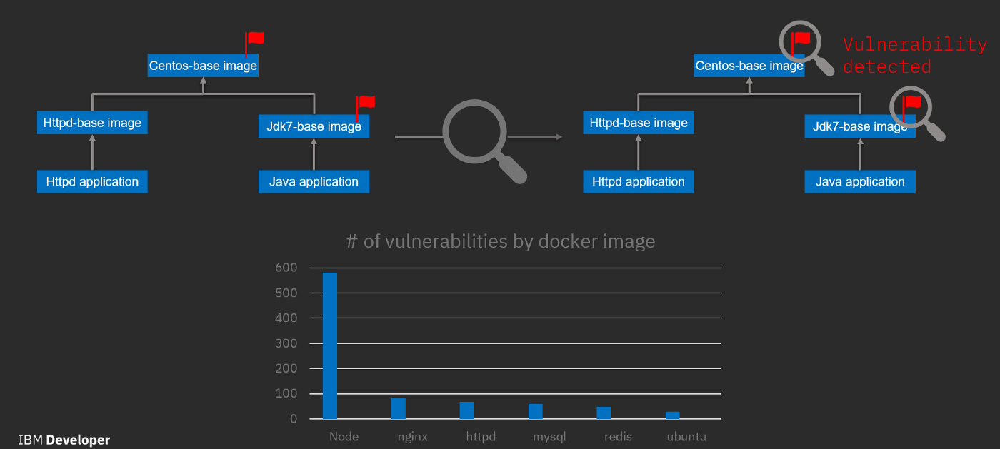
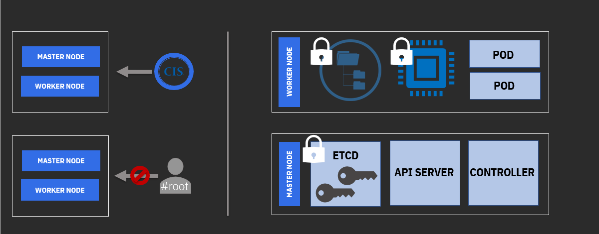
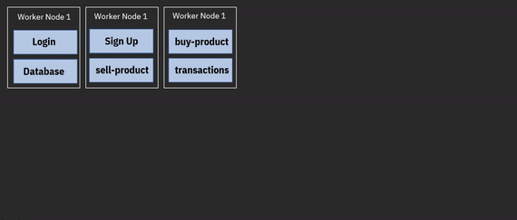
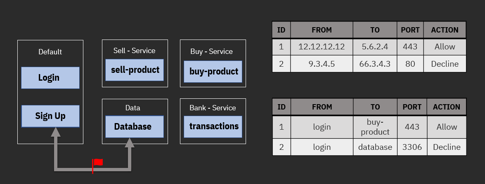
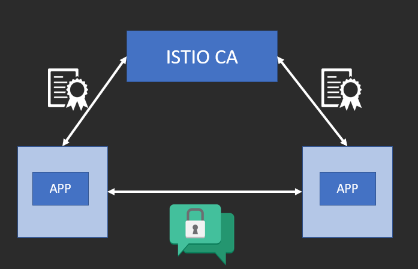

# Kubernetes 安全之旅
在实现应用程序现代化时优先考虑安全性

**标签:** Docker,Istio,Kubernetes,云计算,容器,微服务

[原文链接](https://developer.ibm.com/zh/articles/journey-to-kubernetes-security/)

[Chandani Vaya](https://developer.ibm.com/zh/profiles/chandni.vaya)

发布: 2020-02-27

* * *

近年来，企业和开发者开始采用应用程序现代化的理念，具体做法是将应用程序迁移到云端，应用容器化方法，使用无服务器架构，而最重要的是将他们的整体式应用程序分解为微服务。由于 [Kubernetes](https://kubernetes.io/) 能够在一组机器上运行和协调容器化服务，因此在其中发挥了重要作用。

但是，当开发者进入 Kubernetes 世界时，有一件事需要特别注意，那就是安全性。各种博客、视频、书籍和教程都教导开发者如何使用 Kubernetes，但只有少数提到需要增加的用于保护集群中应用程序的安全控制措施。

让我们从 Kubernetes 架构的不同攻击向量开始讨论安全性：

_Kubernetes 架构及其攻击向量_

## 容器镜像安全性

正如开发者需要为应用程序安全性采用安全编码的实践一样，他们也需要确保构建在应用程序之上的图像层的安全性。例如，Java 应用程序需要一个 Java 开发工具包作为基础镜像，而这又需要一个基础操作系统镜像。即使您确保自己的 Java 应用程序没有漏洞，但如果基础镜像不安全，容器也可能容易受到攻击。请看下面的图表以了解漏洞：

_容器镜像安全性_

维护 Docker 镜像比攻击它要困难得多，因为黑客只需要找到一个漏洞就可以攻击该镜像，或者利用该漏洞获取根权限、执行远程执行或控制主机。

Docker 镜像的主要利用来源之一是易受攻击的包。例如，使用易受攻击的影子包的 Docker 镜像漏洞 (`CVE-2019-5021`) 允许任何拥有 shell 访问权限的用户或黑客提升他们在容器内的权限。另一个易受攻击的包是 `sqlite3 3.26.0`，该包存在允许远程代码执行的漏洞，如果攻击者发送恶意 SQL 命令，则会受到攻击。

很难跟踪应用程序使用的所有包，也很难确保它们不会受到攻击。像 IBM Cloud 上的 [Vulnerability Advisor](https://cloud.ibm.com/docs/services/Registry?topic=va-va_index) 这样的漏洞扫描程序可以非常灵活地扫描您提交到注册表的镜像，并就存在漏洞的包向您发送通知。这些漏洞扫描程序告诉您攻击者如何利用易受攻击的包，以及如何解决这些问题。

除了易受攻击的包外，Vulnerability Advisor 还会告诉您是否存在任何可能导致您的镜像易受攻击的配置问题。

您可以使用其他各种商用工具和开源工具来确保容器镜像安全，比如 Twistlock、 [CoreOS Clair](https://github.com/coreos/clair/)、Dagda 和 Anchore。一个好的做法是使用多个工具测试您的镜像，以解决大多数可能的漏洞。

## 主节点和工作节点的安全性

尽管 Kubernetes 服务的大多数云提供商负责节点的安全性，但您永远不能全面依赖云提供商来确保安全性。如下图所示，您可以遵循准则来帮助您：

_主节点/工作节点安全性_

注意这些最佳实践：

- 确保机器的操作系统满足 [互联网安全中心 (CIS)](https://www.cisecurity.org/) 基准。
- 实施“最小特权”的原则：除非绝对需要，否则不要给予任何人根访问权。
- 加密工作节点的文件系统并将其设为只读。
- 使用内存加密对运行时加载应用程序数据的内存部分进行加密。在单个工作节点上运行多个 Pod 时，这种方法尤其重要。
- 在主节点中加密 [etcd 值存储](https://github.com/etcd-io/etcd)，因为其中存储了加密密钥。

## API 服务器安全性

如前所述，API 服务器控制对集群的访问。因此，身份验证和授权起着重要的作用。使用大多数云提供商提供的身份和访问管理 (IAM) 服务来实现身份验证和访问控制，或者使用基于 Kubernetes 角色的访问控制进行基于名称空间的细粒度访问控制，如下图所示：

_细粒度访问控制_

## 网络安全性

传统上，网络分段是使用 IP 地址以物理方式实现的。在 Kubernetes 世界中，服务在一台机器上作为不同容器运行，您可以使用名称空间以虚拟方式将网络进行分段。使用 IP 地址允许或阻止通信不再有效。相反，规则是基于服务标签或名称空间设计的，如下图所示：

_网络安全性_

在整体式应用中，数据从一个函数到另一个函数的传输发生在同一个应用进程中。对于微服务和 Kubernetes，同样的数据传输在网络上进行，这增加了额外的攻击向量。服务之间的通信必须经过认证和加密，而 Istio 是一个可以使用的选项。 [Istio](https://istio.io/) 是一个服务网格，它使用相互传输层安全性 (TLS) 实现对 Pod 间通信的认证和加密，如下图所示：

_Mutual TLS – Istio_

## 结束语

本文介绍了 Kubernetes 的一些重要安全措施，您必须慎重考虑这些措施。在实现应用程序现代化时，安全性是一项优先功能。问题不在于您的应用程序是否会受到攻击，而在于何时会受到攻击。

要深入阅读，请参阅“资源”链接。

_我由衷感谢 [Haytham Elkhoja](https://medium.com/u/ad66a1cb0000) 对本文提供的宝贵反馈意见。_

本文翻译自： [A journey to Kubernetes security](https://developer.ibm.com/articles/journey-to-kubernetes-security/)（2019-06-27）