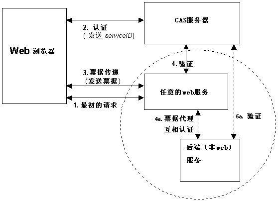
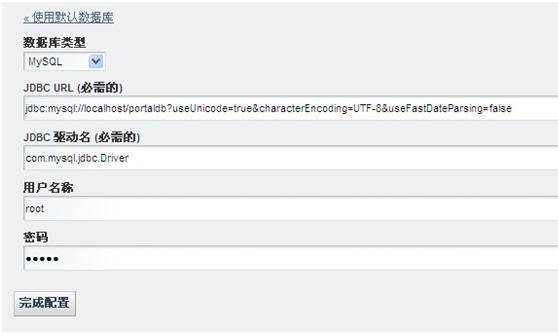
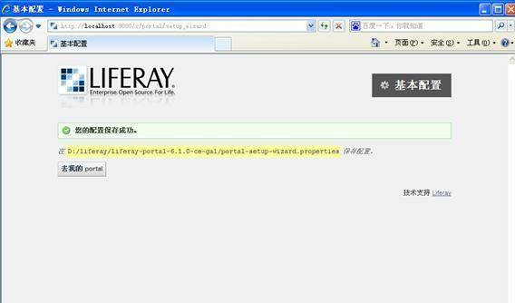
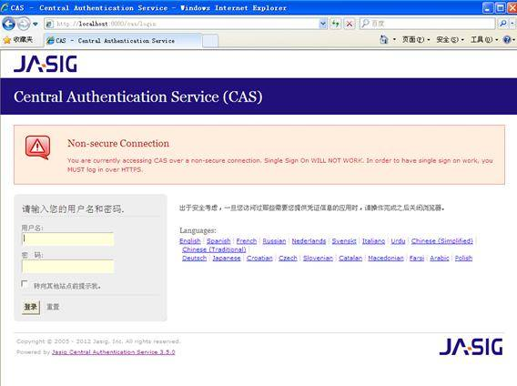
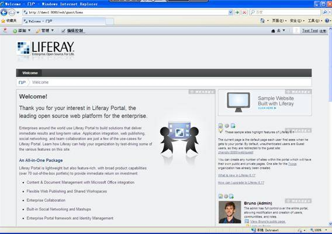

# Liferay 集成 CAS 实现单点登录与应用系统集成
利用 CAS 做为认证中心连接 Liferay 的用户信息

**标签:** Web 开发

[原文链接](https://developer.ibm.com/zh/articles/os-cn-liferay-cas/)

王嘉瑞

发布: 2012-11-29

* * *

## Liferay 门户介绍

Liferay 是一个基于 J2EE 架构的完整的门户解决方案，使用了 EJB、JMS 等技术， 前台界面使用了 Struts MVC 框架、模板技术等一些开源的主流技术，基于 XML 的 portlet 配置文件可以自由地动态扩展， 使用了 Web Services 来支持一些远程信息的获取，使用 Lucene 实现全文检索功能。

主要特点：

- 采用最先进的技术 Java, EJB, JMS, SOAP, XML。
- 提供多种单点登录接口，如 CAS，LDAP, OpenID,OpenSSO 等。
- 管理员能通过用户界面轻松管理用户，组，角色，并为不同的用户分配不同的权限范围和相应的功能。
- 用户可以根据需要定制个性化的页面布局和颜色风格。
- 可以在主流的 J2EE 应用服务器上运行，如 Tomcat,Weblogic,WebSphere 等商业或开源免费的服务器。
- 支持多种主流的数据库，如 Oracle,DB2, MySQL 等。
- 使用了第三方的开源项目，如 Velocity ,Hibernate, Lucene, Struts 等。
- 支持包括中文在内的多种语言。
- 目前最新的版本为 Liferay 6.1（2012 年 2 月更新）。

## CAS 系统介绍

CAS 是一个独立的 web 应用 , 当前使用 Java Servlets 实现，通过 HTTPS 协议保证其数据的传输安全性。 它通过三个 Url 地址进行访问：登录 Url、验证 URL、注销 URL。

##### 图 1\. CAS 原理和协议



## Liferay 部署安装

本文中，我们以 Liferay6.1 的版本进行部署示例。

**准备：**

由于本文需要将 Liferay 的数据库作为单点登录的认证数据库，所以需要将 Liferay 的数据库安装到 Mysql 上。 Mysql 的下载和安装本文不做缀述。在此只简要介绍 Liferay 的安装和配置。Liferay 可以从官方网站下载到安装包的最新版本。

Liferay 安装包的下载地址：

[http://sourceforge.net/projects/lportal/files/Liferay%20Portal/6.1.0%20GA1/liferay-portal-tomcat-6.1.0-ce-ga1-20120106155615760.zip/download](http://sourceforge.net/projects/lportal/files/Liferay%20Portal/6.1.0%20GA1/liferay-portal-tomcat-6.1.0-ce-ga1-20120106155615760.zip/download)

**安装 Liferay：**

Liferay 在启动时会对数据库进行初始化。

将下载到的安装包 liferay-portal-tomcat-6.1.0-ce-ga1-20120106155615760.zip 解压到安装目录下， 在路径 liferay-portal-6.1.0-ce-ga1\\tomcat-7.0.23\\bin 下找到 startup.bat 启动文件，并执行。在默认情况下， liferay 会使用 Hypersonic 作为默认数据库，在第一次访问时，我们可以对数据库、管理用户等参数进行配置。 当 tomcat 服务器启动后，我们可以访问 `http://localhost:8080/` 如果出现基本配置页面，则说明部署成功。 接下来，我们可以在这个配置页面上对 Liferay 进行一些基本设置。首先我们要做的是将默认的数据库更改为我们要使用的 Mysql 数据库。 点击（更改）如图 2：

##### 图 2\. Liferay 配置页面



在此我们将数据库的链接 URL 修改为我们新建的数据库地址。完成后点击完成配置。 此时 Liferay 将根据新的配置参数和数据库地址对数据库进行初始化。当出现如下界面时，则 Liferay 安装完成：

##### 图 3\. Liferay 配置初始化成功界面



## CAS 部署安装

**准备：**

下载最新版的 CAS 产品包，下载地址：

[https://github.com/apereo/cas](https://github.com/apereo/cas)

**安装 CAS：**

解压缩以后，在其路径 cas-server-3.5.0\\modules 下面找到 cas-server-webapp-3.5.0.war， 将其拷贝到 liferay 的服务器部署目录 liferay-portal-6.1.0-ce-ga1\\tomcat-7.0.23\\webapps 下， 改名为 cas.war, 并修改 war 包中配置文件 cas.properties 里的 cas server name=cas 并启动 liferay 服务器， 启动后可在浏览器访问 `http://localhost:8080/cas/login`

当出现如下界面时，说明 cas 服务器已经部署成功。如图 4：

##### 图 4\. CAS 服务器登录界面



此时，CAS 还不能作为有效的单点登录服务器。在实际使用的时候，还需要根据实际概况做扩展和定制，最主要的是扩展认证 (Authentication) 接口和 CAS Server 的界面。其中红色部分的提示当前登录的 CAS 链接是不安全的，建议使用 https 协议。 由于 https 协议在服务器上配置已经有很多对应的文档和帮助，在此将不做赘述，本文中，我们将使用 http 协议对 CAS server 进行配置。

取消 CAS 服务器 HTTPS 认证方式 :

修改 cas\\WEB-INF\\spring-configuration\\ticketGrantingTicketCookieGenerator.xml 配置文件，将 p:cookieSecure=”true” 改为 p:cookieSecure=”false” ，改完后如下：

##### 清单 1\. ticketGrantingTicketCookieGenerator 配置

```
<bean id="ticketGrantingTicketCookieGenerator"
      class="org.jasig.cas.web.support.CookieRetrievingCookieGenerator"
      p:cookieSecure="false"
      p:cookieMaxAge="-1"
      p:cookieName="CASTGC"
      p:cookiePath="/cas" />

```

Show moreShow more icon

修改 cas\\WEB-INF\\spring-configuration\\warnCookieGenerator.xml 配置文件，将 p:cookieSecure=”true” 改为 p:cookieSecure=”false” ，改完后如下：

##### 清单 2\. warnCookieGenerator 配置

```
<bean id="warnCookieGenerator"
      class="org.jasig.cas.web.support.CookieRetrievingCookieGenerator"
      p:cookieSecure="false"
      p:cookieMaxAge="-1"
      p:cookieName="CASPRIVACY"
      p:cookiePath="/cas" />

```

Show moreShow more icon

修改 deployerConfigContext.xml: 找到”HttpBasedServiceCredentialsAuthenticationHandler” bean 添加：p:requireSecure=”false”, 改完后如下：

##### 清单 3\. warnCookieGenerator 配置

```
<bean class="org.jasig.cas.authentication.handler.support.
                HttpBasedServiceCredentialsAuthenticationHandler"
      p:httpClient-ref="httpClient"
      p:requireSecure="false"/>

```

Show moreShow more icon

这样，在 cas 服务器运行的时候，就可以只使用 http 请求了，省去了 HTTPS 协议的麻烦配置。

## 集成方式说明

CAS 作为单点登录的认证服务器，在收到页面传递的登录请求以后，将请求转发到 CAS 服务器后端进行验证，在未经配置的时候， 只要输入的密码和用户名称一致，则验证通过。在实际的使用中当然这样是不可行的。在此我们要对用户输入的用户名称和密码做校验。 如果存在该用户，并且密码正确则说明验证通过。

这里就有了两个问题：第一，CAS 需要连接到存储用户信息的数据库才能读取到用户信息。 第二，验证密码的加密算法必须和数据库存储密码的加密方式一致。基于此文采用的方式，对于第一个问题， 我们将直接使用 CAS 服务器连接到 Liferay 安装的数据库，直接读取 Liferay 门户的用户信息。 对于第二个问题，我们将直接调用 Liferay 中的加密算法对用户输入的密码进行加密，然后与数据库中的加密密码进行比对。 这样就可以保证 CAS 服务器在进行用户认证时，可以和 Liferay 服务器使用的用户保持一致。

## CAS 配置

我们要读取 Liferay 中的认证用户信息，就需要用 CAS 链接到 Liferay 的数据库。CAS 提供了通过 JDBC 连接数据库进行验证的缺省实现， 基于该包的支持，我们只需要做一些配置工作即可实现 JDBC 认证。

JDBC 认证方法支持多种数据库，在此我们以 Mysql 数据库为例 :

##### 清单 4\. 配置 dataSource

```
<bean id="dataSource"
         class="org.springframework.jdbc.datasource.DriverManagerDataSource">
         <property name="driverClassName"  value="com.mysql.jdbc.Driver" />
         <property name="url" value="jdbc:mysql://localhost:3306/portaldb?
         useUnicode=true&characterEncoding=UTF-8&useFastDateParsing=false" />
         <property name="username" value="username" />
         <property name="password" value="password" />
</bean />

```

Show moreShow more icon

其中 id 属性为该 dataSource 的标识，在后面配置 authenticationManager 会被引用， 另外，需要提供 dataSource 所必需的数据库驱动程序、连接地址、数据库登录用户名以及登录密码。

修改 cas.properties 配置文件

##### 清单 5\. 配置 cas.properties

```
host.name=cas
server.prefix=http://localhost:8080/cas
database.hibernate.dialect=org.hibernate.dialect.MySQLDialect

```

Show moreShow more icon

## 加密方式修改

CAS 默认使用了一套简单的密码验证，在 deployerConfigContext.xml 配置文件中， 为认证管理接口 authenticationManager 配置了属性 authenticationHandlers 处理器， 其中： 就是默认的认证处理逻辑，我们可以在下载到的压缩包找到他的源代码：cas-server-core\\src\\main\\java\\org\\jasig\\cas\\authentication\\handler\\support\\SimpleTestUsernamePasswordAuthenticationHandler.java,

##### 清单 6\. 默认认证算法

```
public boolean authenticateUsernamePasswordInternal
            (final UsernamePasswordCredentials credentials) {
        final String username = credentials.getUsername();
        final String password = credentials.getPassword();
        if (StringUtils.hasText(username) && StringUtils.hasText(password)
            && username.equals(getPasswordEncoder().encode(password))) {
            log.debug("User [" + username + "] was successfully authenticated.");
            return true;
        }
        log.debug("User [" + username + "] failed authentication");
        return false;
}

```

Show moreShow more icon

默认的用户名和密码认证方式是只要校验用户名和密码相同，则认证通过。因此我们要对这种认证方式进行修改， 改为用户名和密码都采用 Liferay 中用户的校验方式。将默认的认证类注释掉，配置提供的 jdbc 认证：

##### 清单 7\. 配置自定义 JDBC 认证方式

```
<!--
<bean class="org.jasig.cas.authentication.handler.support.
                SimpleTestUsernamePasswordAuthenticationHandler" />
 -->
<bean class="org.jasig.cas.adaptors.jdbc.QueryDatabaseAuthenticationHandler" >
     <property name="sql" value="select password_ from user_ where screenName=?"/>
     <property name="dataSource" ref="dataSource"/>
     <property name="passwordEncoder" ref="mypasswordEncoder"/>
</bean>

```

Show moreShow more icon

属性 sql 配置为查询 Liferay 数据库表 user _，字段 password_ 和 screenName 其中 passwordEncoder 是对清单 7 中设置的实际加密器类的引用。 为了使用 Liferay 的密码加密方式，我们需要配置一个我们自己开发的密码加密类：

##### 清单 8\. 指定具体加密类和加密算法

```
<bean id="mypasswordEncoder"
         class="com.test.portal.cas.MyPasswordEncoder">
           <constructor-arg value="SHA"/>
</bean>

```

Show moreShow more icon

在此我们采用和 Liferay 一致的默认加密算法”SHA”，在调用 Liferay 提供的加密算法时， 我们需要将 Liferay 的几个 jar 包引入到我们的 cas 工程中，自定义的加密算法也很简单， 只需要调用 jar 包中的加密工具类提供的加密算法即可，同时自定义的类需要继承 PasswordEncoder 接口：

##### 清单 9\. 自定义加密算法类

```
import javax.validation.constraints.NotNull;
import org.jasig.cas.authentication.handler.PasswordEncoder;
import com.liferay.portal.kernel.util.DigesterUtil;
public final class MyPasswordEncoder implements PasswordEncoder {
    @NotNull
    private final String algorithm;

    public MyPasswordEncoder(final String algorithm) {
        this.algorithm = algorithm;
    }

    public String encode(final String password) {
         String pass = DigesterUtil.digest(algorithm,password);
        return pass;
    }
}

```

Show moreShow more icon

至此 CAS 部分的配置就完成了，只需要再 Liferay 中进行相应的设置以后就可以使用了。

## Liferay 配置

使用有管理权限的用户登录 Liferay，在控制面板中进入”设置”页面。再右侧的面板中选择”认证”， 进入 Liferay 认证设置。在用户如何认证的选项中选择”按屏幕名称”。选择”CAS”设置页面，选中”开启”， 修改登录 URL：`http://demo1:8080/cas/login`，修改注销 URL：`http://demo1:8080/cas/logout`， 修改服务器名称：demo1:8080，修改服务器 URL：`http://demo1:8080/cas`， 修改无用户时重定向的 URL：`http://demo1:8080`，点击测试 CAS 配置，验证通过后，保存配置。

至此 Liferay 的配置也已经完成，此时点击”注销”用户，则根据配置，系统会跳转到 CAS 服务器的登录界面。使用 Liferay 的用户登录， CAS 服务器会链接 Liferay 的数据库进行认证，认证成功后会跳转到 Liferay 的首页，表示 CAS 和 Liferay 的连接配置完成。

##### 图 5\. 登录成功



## 应用系统集成

配置好 CAS 与 Liferay 的集成以后，我们可以通过 CAS 服务器进行单点登录，这样 Liferay 门户中集成的 Web 应用就可以采用 CAS 作为单点登录的服务器。 在实际使用中，还需要实现用户的同步，其他 Web 应用中的用户信息需要与 Liferay 数据库中的数据保持同步， 用户信息的同步可以使用 Liferay 提供的接口从 Liferay 的数据库中同步，也可以使用第三方的用户目录服务器进行同步， 具体的同步方法在此不做过多说明。

## 结束语

本文介绍了 使用 Liferay 集成 CAS 实现单点登录的解决方案，并结合实例讲解了在 Liferay 中使用 CAS 的配置、部署方法以及效果。 Liferay 是作为开源门户解决方案的一个不错选择，更多的使用细节可以参考 Liferay 官方网站。