# Linux 中 RPM 的构建与打包
RPM 实践

**标签:** Linux

[原文链接](https://developer.ibm.com/zh/articles/l-lo-rpm-build-package/)

魏 新宇

发布: 2019-11-06

* * *

## 什么是 RPM

RPM 全称为：Red-Hat Package Manager，即红帽 Linux 发行版的软件包管理器。RPM 的出现，提升了 Linux 软件安装、升级的便捷性。RPM 遵循 GPL 协议，除了红帽 Linux 发行版，Caldera OpenLinux、SUSE 以及 Turbo Linux 等 Linux 的发行版也使用 RPM，因此 RPM 是 Linux 软件包管理的行业标准。为了使读者能够较为深入理解 RPM，我们先介绍软件的构建方法。

计算机软件的软件是从源代码构建出来的。源代码是人们以人类可读的语言书写的、让计算机执行任务的指令。人类可读的语言格式和规范，就是编程语言。

从源代码制作软件的过程，称之为是软件编译。从源代码构建成软件的编译有两种方式：

- 本机编译 （Natively Compiled），对应编译型语言。
- 解释编译（Interpreted Compiled），对应解释性语言。

本机编译方式下，代码可以独立编译成机器代码或直接编译为二进制文件可执行文件。本机编译构建的软件包中，包含编译环境下计算机体系架构的特征。例如，使用 64 位（x86\_64）AMD 计算机中编译的软件，不能在 Intel 处理器架构上运行。

与本机编译可以独立执行相对应，某些编程语言不能将软件编译成计算机可以直接理解的格式，而需要语言解释器或语言虚拟机（如 JVM），我们称之为解释编译。常用的解释语言有 Byte Compiled（源代码需要编译成字节代码，然后由语言虚拟机执行，如 Python）和 Raw Interpreted（原始解释语言完全不需要编译，它们由解释器直接执行，如 Bash shell）两种。

我们常用的 bash shell 和 Python 是解释型的，这种方式编译出的程序与硬件架构无关，通过这种方式编译出的 RPM 会被标注为 noarch（说明 RPM 包不依赖于特定 linux 发行版）。

在介绍了源代码的编译方式后，接下来我们通过实验的方式展现软件的编译过程。

## 从源代码构建软件

在正式开始验证之前，我们需要在 Linux 中安装编译工具。

```
# yum install gcc rpm-build rpm-devel rpmlint make python bash coreutils diffutils

```

Show moreShow more icon

接下来，我们分别介绍本机编译和解释编译。

### 本机编译代码

在编程语言中，C 语言是本机编译。我们查看一个源代码文件，如清单 1 所示：

##### 清单 1\. C 语言源码文件

```
      # cat cello.c
#include <stdio.h>
int main(void) {
    printf("Hello World, I'm DavidWei!\n");
    return 0;
}

```

Show moreShow more icon

调用 C 编译器 gcc 进行编译：

```
# gcc -o cello cello.c

```

Show moreShow more icon

编译成功后，我们可以执行结果输出。

```
# ./cello

Hello World, I'm DavidWei!

```

Show moreShow more icon

为了实现自动化构建代码，我们添加 Makefile，这是大型软件开发中常用的方法。

首先创建一个 Makefile，如清单 2 所示：

##### 清单 2\. Makefile 文件

```
# cat Makefile
cello:
              gcc -o cello cello.c
clean:
               rm cello

```

Show moreShow more icon

接下来，通过 make 来完成编译。

执行 make 会自动编译源代码，然后可以成功执行，如下图 1 所示：

**图 1\. 编译并运行代码**

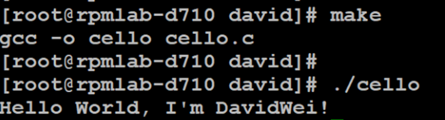

执行 make clean 会删除编译结果，如下图 2 所示：

**图 2\. 删除编译结果**

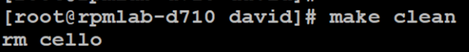

在介绍了本机编译后，我们介绍解释编译。

### 解释型代码

对于用解释型编程语言编写的软件，如果是 Byte Compiled 语言如 Python，就需要一个编译步骤，把源代码构建成 Python 的语言解释器（称为 CPython）的可以执行文件。

我们查看一个 python 的源代码，如清单 3 所示：

##### 清单 3\. Python 源代码文件

```
        # cat pello.py
#!/usr/bin/env python
print("Hello World, I'm DavidWei!")

```

Show moreShow more icon

对源代码进行编译：

```
# python -m compileall pello.py

Compiling pello.py ...

```

Show moreShow more icon

编译成功后运行：

```
# python pello.pyc

Hello World, I'm DavidWei!

```

Show moreShow more icon

我们看到，对源.py 文件进行字节编译后会生成一个.pyc 文件，这是 python 2.7 字节编译的文件类型，这个文件可以使用 python 语言虚拟机运行。

查看文件类型：

```
# file pello.pyc

pello.pyc: python 2.7 byte-compiled

```

Show moreShow more icon

和 python 相对应，无需编译的解释性代码是 Raw Interpreted，如我们日常使用的 bash shell。

我们看一个 shell 文件，如清单 4 所示：

##### 清单 4\. Shell 文件

```
# cat bello
#!/bin/bash
printf "Hello World, I'm DavidWei!\n"

```

Show moreShow more icon

对于 Raw Interpreted 源码，我们使文件可执行、然后直接运行即可，如下图 3 所示：

**图 3\. 修改权限运行 shell**

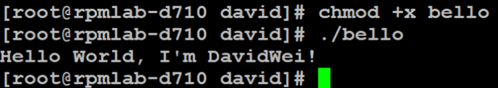

在介绍了如何从源码构建软件包后，接下来我们介绍如何给软件打补丁。

### 给软件打补丁

在计算机软件中，补丁是用来修复代码中的漏洞的。软件中的补丁表示的是与源代码之间的不同之处。接下来，我们从原始源代码创建补丁，然后应用补丁。

创建补丁的第一步是备份原始源代码，通常是将它拷贝为.orig 文件。我们以 cello.c 为例。

首先备份 cello.c，然后修改 cello.c 中的内容，如下图 4 所示，我们修改了源代码中的描述：

**图 4\. 备份并修改源码**

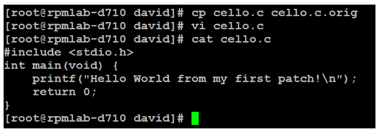

首先查看两个源码文件的不同之处，如下图 5 所示：

**图 5\. 查看两个源码文件的不同**

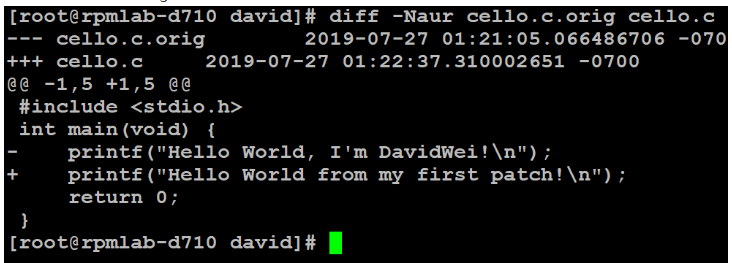

将两个源码的不同之处保存到 cello-output-first-patch.patch 中。

```
# diff -Naur cello.c.orig cello.c > cello-output-first-patch.patch

```

Show moreShow more icon

为了验证打补丁的效果，将 cello.c 文件恢复为原始源代码，如下图 6 所示：

**图 6\. 恢复 cello.c 初始内容**

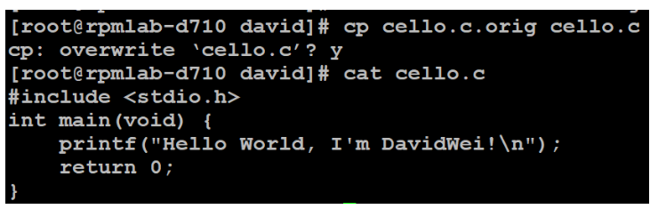

将补丁文件重定向到补丁，给源码打补丁，如下图 7 所示。

**图 7\. 给源码打补丁**

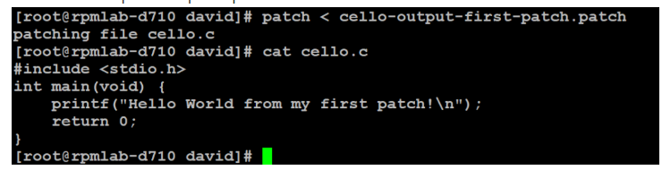

从上图 cat 命令的输出中可以看到补丁已成功构建并运行，如图 8 所示：

**图 8\. 构建源码并运行**

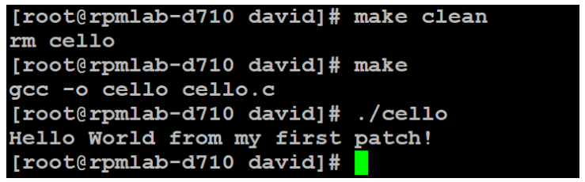

至此，证明为打补丁成功。

### 安装软件

一旦我们构建了软件，我们就可以将它放在系统的某个目录下，以便用户可以执行。为了方便操作，很多时候我们需要将编译和安装进行合并。

对于不需要编译类的解释型语言，例如 shell，可以使用 install 命令安装到 linux 中，如下图 9 所示：

**图 9\. 安装并执行 shell**

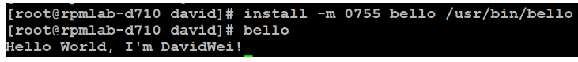

对于需要编译的语言，就需要先编译再安装。例如使用 make install。修改 makefile 文件，如下图 10 所示：

**图 10\. 修改 Makefile**

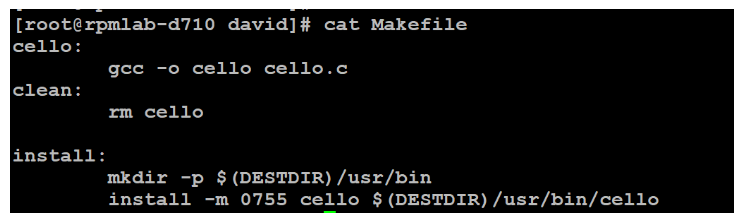

构建并安装 cello.c 程序，并执行验证成功，如下图 11 所示：

**图 11\. 构建并安装 cello.c**

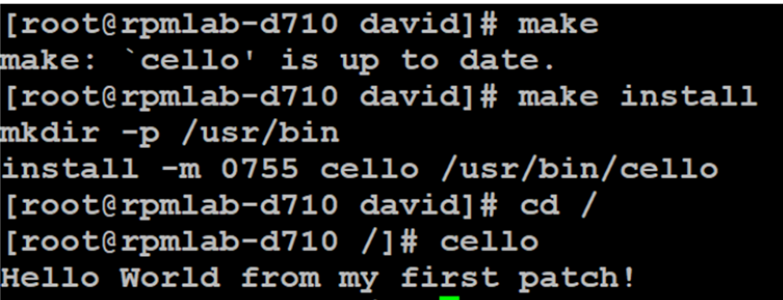

我们刚展示的是编译与安装在相同的环境下，即可以通过 Makefile 的方式，直接编译和安装程序；如果编译和运行是两个环境，那么我们就需要对软件进行 RPM 打包。在 RPM 打包之前，需要将源代码进行打包生成 tar.gz 文件。

### 源代码生成 tar.gz 包

在源码打包时，需要在每个源代码版本中包含一个 LICENSE 文件。我们模拟生成遵守 GPLv3 的压缩包，如下图 12 所示：

**图 12\. 生成 LICENSE 文件**

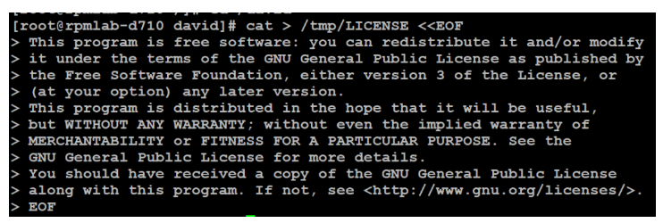

将 bello 程序的源码打包，如下图 13 所示：

**图 13\. 将 bello 程序的源码打包**

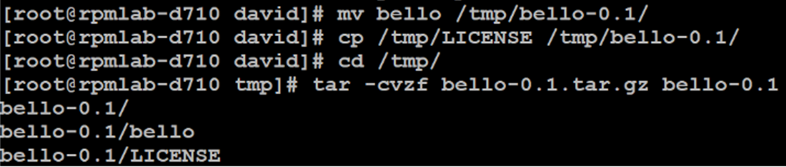

创建~/rpmbuild/SOURCES 目录，将 tar.gz 文件移动过去，如下图 14 所示：

**图 14\. 移动 tar.gz 包**

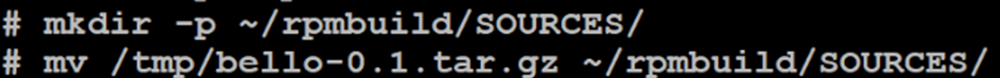

用相同的方法，我们为 Pello 和 Cello 的源码打包，由于方法相同因此不再赘述。

将源码打包以后，接下来我们就可以使用 RPM 将其构建成 RPM 包。

## RPM 打包

RPM 文件有两类：源 RPM（SRPM）和二进制 RPM。SRPM 中的有效负载是 SPEC 文件（描述如何构建二进制 RPM）。

查看 SRPM 的目录结构，如下图 15 所示：

**图 15\. 查看 S RPM 目录结构**

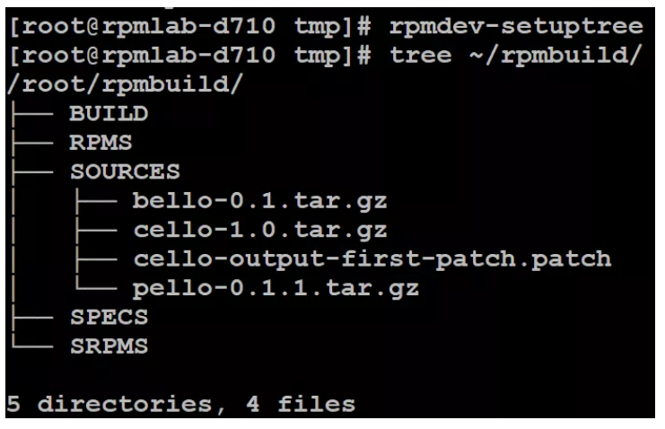

上图中 SRPM 五个目录的作用分别是：

**目录****作用**BUILD构建 RPM 包的时，会在此目录下产生各种%buildroot 目录。如果构建失败，可以据此查看目录日志，进行问题诊断。RPMS构建成功二进制 RPM 的存放目录。存放在 architecture 的子目录中。例如：noarch 和 x86\_64SOURCES存放源代码和补丁的目录。构建 RPM 包时，rpmbuild 命令将会从这个目录查找源代码。SPECSSPEC 文件存放目录SRPMS存放 SRPM 的目录

在介绍了 SRPM 的目录结构后，我们详细介绍 SPEC 的作用。

### 什么是 SPEC 文件？

SPEC 文件是 rpmbuild 程序用于实际构建 RPM 的方法。SPEC 文件包含如下字段：

**字段****描述**SPEC DirectiveDefinitionName包的名称，应与 SPEC 文件名匹配Version软件的上游版本号。ReleaseRPM 软件版本号。初始值通常应为 1％{？dist}，并在一个新版本构建时重置为 1.SummaryRPM 包的简要说明License正在打包的软件的许可证。URL该程序的更多信息的完整 URL（通常是打包的软件的上游项目网站）。Source0上游源代码的压缩归档的路径或 URL 如果需要，可以添加更多的 SourceX 指令，每次递增数字，例如：Source1，Source2，Source3，依此类推Patch0应用于源代码的第一个补丁的名称。 如果需要，可以添加更多 PatchX 指令，增加每次编号如：Patch1，Patch2，Patch3 等。BuildArch表示 RPM 包的构建的计算机架构。如果包不依赖于体系结构，即完全用于编写解释的编程语言，这应该是 BuildArch：noarch。BuildRequires编译软件包所需的依赖包列表，以逗号分隔。Requires安装软件包时所需的依赖包列表，以逗号分隔。ExcludeArch如果某个软件无法在特定处理器架构下运行，在此进行指定。

在运维过程中，我们经常会查看到一个 RPM 包的 Name、Version、Release。这个字段就是在 SPEC 文件中定义的。

例如，我们要查询 Python RPM 包版本，如下图 16 所示：

**图 16\. 查看 python 版本**

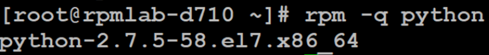

在上图的输出中：python 是 Name、2.7.5 是 Version、58.el7 是 Release、x86\_64 是 BuildArch。这些信息都是在 SPEC 中定义的。

接下来，我们介绍 RPM SPEC 文件中使用的语法。

**语法****描述**SPEC DirectiveDefinition%description完整描述了 RPM 中打包的软件，可以包含多行并分成段落。%prep打包准备阶段执行一些命令%build包含构建阶段执行的命令，构建完成后便开始后续安装。%install包含安装阶段执行的命令。%check包含测试阶段执行的命令。%files需要被打包/安装的文件列表。%changelogRPM 包变更日志。

在介绍了 SEPC 的格式和语法后，接下来我们介绍如何书写 SPEC 并构建 RPM 包。

### 书写 SPEC 文件

在打包新软件时，可以通过 rpmdev-newspec 工具创建一个新的 SPEC 文件，然后据此进行修改。

首先，我们通过三个源码文件生成三个 SPEC，如下图 17 所示：

**图 17\. 生成 S PEC 文件**

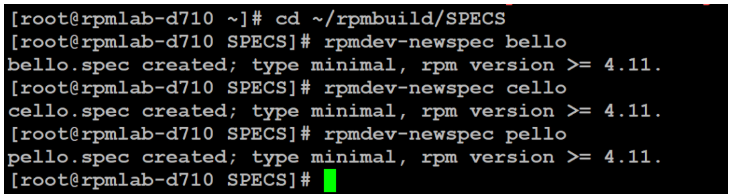

SPEC 已经生成，如下图 18 所示：

**图 18\. 查看生成的 SPEC 文件**

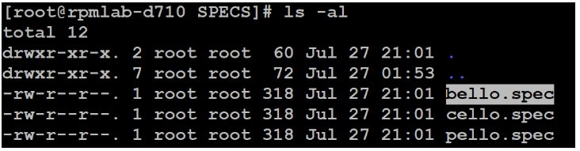

接下来我们为三个 SRPM 书写 SPEC，描述如下：

**SRPM****描述**Software NameExplanation of examplebello基于 bash 书写的。不需要构建但只需要安装文件。 如果是预编译的二进制文件需要打包，这种方法也可以使用，因为二进制文件也只是一个文件。pello基于 Python 书写的软件。用 byte-compiled 的解释编程语言编写的软件，用于演示字节编译过程的安装和安装生成的预优化文件。cello基于 C 书写的软件。用 natively compiled 的编程语言编写的软件，演示使用工具的常见构建和安装过程以及编译本机代码。

由于三个 SPEC 修改的思路类似，因此我们只细致介绍 bello 的 SPEC 修改步骤。

生成的 bello.spec 文件内容如清单 5 所示：

##### 清单 5\. 自动生成的 bello.spec

```
        # cat bello.spec
Name:           bello
Version:
Release:        1%{?dist}
Summary:

License:
URL:
Source0:

BuildRequires:
Requires:

%description

%prep
%setup -q

%build
%configure
make %{?_smp_mflags}

%install
rm -rf $RPM_BUILD_ROOT
%make_install

%files
%doc

%changelog

```

Show moreShow more icon

修改后的 bello.spec 内容如清单 6 所示：

##### 清单 6\. 修改后的 bello.spec

```
        [root@rpmlab-d710 ~]# cat ~/rpmbuild/SPECS/bello.spec
Name:           bello
Version:        0.1
Release:        1%{?dist}
Summary:        Hello World example implemented in bash script

License:       GPLv3+
URL:           https://www.example.com/%{name}
Source0:       https://www.example.com/%{name}/releases/%{name}-%{version}.tar.gz

Requires:      bash

BuildArch:     noarch

%description
The long-tail description for our Hello World Example implemented in
bash script of DavidWei.

%prep
%setup -q

%build

%install

mkdir -p %{buildroot}%{_bindir}

install -m 0755 %{name} %{buildroot}%{_bindir}/%{name}

%files
%license LICENSE
%{_bindir}/%{name}

%changelog
* Tue Jun 29 2019 DavidWei - 0.1-1
- First bello package
- Example second item in the changelog for version-release 0.1-1

```

Show moreShow more icon

在修改完 SEPC 后，我们就可以根据源代码和 SPEC 文件构建软件包。

## 构建二进制 RPM 包

实际上，我们在构建二进制 RPM 包时，有两种构建方法：

- 从源码构建 SRPM，然后再构建二进制 RPM
- 直接从源码构建二进制 RPM。

然而，在软件开发中，我们通常会采用第一种方法，因为它有以下优势：

- 便于保留的 RPM 版本的确切来源（以 Name-Version-Release 格式标注）。这对于 debug 非常有用。
- 需要在不同的处理器硬件平台上使用 SRPM 构建二进制 RPM。

由于篇幅有限，本文只展示从源码构建 SRPM，再从 SRPM 构建二进制 RPM 的步骤。

### 构建 Source RPM 和二进制 RPM

下面我们演示如何通过源码和刚修改的 SPEC 文件构建 Source RPM 并在构建时指定-bs 参数（如果使用-bb 参数，则直接生成二进制 RPM），以便生成 SRPM，如下图 19 所示：

**图 19\. 构建 SRPM**

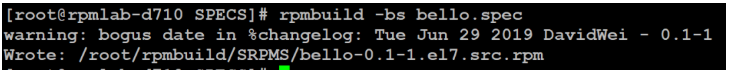

首先，我们基于 SRPM 生成二进制 RPM。执行过程如清单 7 所示：

##### 清单 7\. 由 SRPM 构建二进制 RPM

```
        # rpmbuild --rebuild ~/rpmbuild/SRPMS/bello-0.1-1.el7.src.rpm
Installing /root/rpmbuild/SRPMS/bello-0.1-1.el7.src.rpm
warning: bogus date in %changelog: Tue Jun 29 2019 DavidWei - 0.1-1
Executing(%prep): /bin/sh -e /var/tmp/rpm-tmp.hNMkOC
+ umask 022
+ cd /root/rpmbuild/BUILD
+ cd /root/rpmbuild/BUILD
+ rm -rf bello-0.1
+ /usr/bin/tar -xf -
+ /usr/bin/gzip -dc /root/rpmbuild/SOURCES/bello-0.1.tar.gz
+ STATUS=0
+ '[' 0 -ne 0 ']'
+ cd bello-0.1
+ /usr/bin/chmod -Rf a+rX,u+w,g-w,o-w .
+ exit 0
Executing(%build): /bin/sh -e /var/tmp/rpm-tmp.0isn4Y
+ umask 022
+ cd /root/rpmbuild/BUILD
+ cd bello-0.1
+ exit 0
Executing(%install): /bin/sh -e /var/tmp/rpm-tmp.epoHml
+ umask 022
+ cd /root/rpmbuild/BUILD
+ '[' /root/rpmbuild/BUILDROOT/bello-0.1-1.el7.x86_64 '!=' / ']'
+ rm -rf /root/rpmbuild/BUILDROOT/bello-0.1-1.el7.x86_64
++ dirname /root/rpmbuild/BUILDROOT/bello-0.1-1.el7.x86_64
+ mkdir -p /root/rpmbuild/BUILDROOT
+ mkdir /root/rpmbuild/BUILDROOT/bello-0.1-1.el7.x86_64
+ cd bello-0.1
+ mkdir -p /root/rpmbuild/BUILDROOT/bello-0.1-1.el7.x86_64/usr/bin
+ install -m 0755 bello /root/rpmbuild/BUILDROOT/bello-0.1-1.el7.x86_64/usr/bin/bello
+ /usr/lib/rpm/find-debuginfo.sh --strict-build-id -m --run-dwz --dwz-low-mem-die-limit 10000000 --dwz-max-die-limit 110000000 /root/rpmbuild/BUILD/bello-0.1
/usr/lib/rpm/sepdebugcrcfix: Updated 0 CRC32s, 0 CRC32s did match.
+ '[' noarch = noarch ']'
+ case "${QA_CHECK_RPATHS:-}" in
+ /usr/lib/rpm/check-buildroot
+ /usr/lib/rpm/redhat/brp-compress
+ /usr/lib/rpm/redhat/brp-strip-static-archive /usr/bin/strip
+ /usr/lib/rpm/brp-python-bytecompile /usr/bin/python 1
+ /usr/lib/rpm/redhat/brp-python-hardlink
+ /usr/lib/rpm/redhat/brp-java-repack-jars
Processing files: bello-0.1-1.el7.noarch
Executing(%license): /bin/sh -e /var/tmp/rpm-tmp.hV1l1H
+ umask 022
+ cd /root/rpmbuild/BUILD
+ cd bello-0.1
+ LICENSEDIR=/root/rpmbuild/BUILDROOT/bello-0.1-1.el7.x86_64/usr/share/licenses/bello-0.1
+ export LICENSEDIR
+ /usr/bin/mkdir -p /root/rpmbuild/BUILDROOT/bello-0.1-1.el7.x86_64/usr/share/licenses/bello-0.1
+ cp -pr LICENSE /root/rpmbuild/BUILDROOT/bello-0.1-1.el7.x86_64/usr/share/licenses/bello-0.1
+ exit 0
Provides: bello = 0.1-1.el7
Requires(rpmlib): rpmlib(CompressedFileNames) <= 3.0.4-1 rpmlib(FileDigests) <= 4.6.0-1 rpmlib(PayloadFilesHavePrefix) <= 4.0-1
Requires: /bin/bash
Checking for unpackaged file(s): /usr/lib/rpm/check-files /root/rpmbuild/BUILDROOT/bello-0.1-1.el7.x86_64
Wrote: /root/rpmbuild/RPMS/noarch/bello-0.1-1.el7.noarch.rpm
Executing(%clean): /bin/sh -e /var/tmp/rpm-tmp.PCJIAr
+ umask 022
+ cd /root/rpmbuild/BUILD
+ cd bello-0.1
+ /usr/bin/rm -rf /root/rpmbuild/BUILDROOT/bello-0.1-1.el7.x86_64
+ exit 0
Executing(--clean): /bin/sh -e /var/tmp/rpm-tmp.ift0pO
+ umask 022
+ cd /root/rpmbuild/BUILD
+ rm -rf bello-0.1
+ exit 0

```

Show moreShow more icon

二进制 RPM 构建成功后，可以在~/rpmbuild/RPMS/中找到生成的二进制 RPM：bello-0.1-1.el7.noarch.rpm，如下图 20 所示：

**图 20\. 查看生成的二进制 RPM**

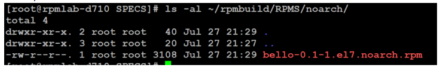

通过 SRPM 构建成二进制 RPM 后，源码会被自动删除。如果想恢复源码，需要安装 srpm，如下图 21 所示：

**图 21\. 安装 SRPM 并查看源代码**

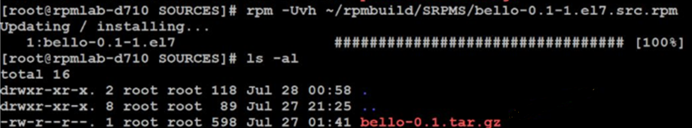

现在我们检查生成的二进制 RPM 的正确性并进行安装。

### 检查并安装 RPM 包

Rpmlint 命令可以检查二进制 RPM、SRPMs 和 SPEC 文件的正确性。

我们以 bello.spec 为例进行检查。

```
        # rpmlint bello.spec
bello.spec: E: specfile-error warning: bogus date in %changelog: Tue Jun 29 2019 DavidWei - 0.1-1
0 packages and 1 specfiles checked; 1 errors, 0 warnings.

```

Show moreShow more icon

从 bello.spec 的检查结果中，发现一个 error。具体报错描述我们需要检查 srpm。

```
# rpmlint ~/rpmbuild/SRPMS/bello-0.1-1.el7.src.rpm
bello.src: W: invalid-url URL: https://www.example.com/bello HTTP Error 404: Not Found
bello.src: E: specfile-error warning: bogus date in %changelog: Tue Jun 29 2019 DavidWei - 0.1-1
1 packages and 0 specfiles checked; 1 errors, 1 warnings.

```

Show moreShow more icon

从检查 SRPM 的结果可以看出，报错的原因是 URL（ [https://www.example.com/bello）无法访问。](https://www.example.com/bello）无法访问。)

我们修改 SEPC，将地址设置为可访问地址，如下图 22 所示：

**图 22\. 修改 SPEC 设置 URL 为可访问地址**

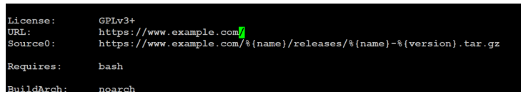

修改成功后再重新编译后检查，重新验证二进制 RPM 正确性，error 数量为 0，如下图 23 所示：

**图 23\. 验证二进制 RPM 的正确性**

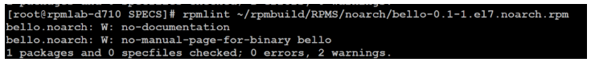

最后，安装编译好的 rpm 包并运行程序进行验证，如下图 24 所示：

**图 24\. 安装二进制 RPM 包并执行程序**

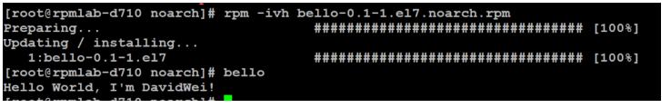

我们看到，上图中执行 bello 程序成功，证明 RPM 安装成功。

### 如何在异构环境重新编译 RPM

在前文中我们已经提到，有的 RPM 包与运行环境有关，有的无关。如果一个 RPM 依赖于某一个版本的运行环境（linux 版本或处理器架构），我们如何让这个 RPM 在其他的环境中运行？这涉及到异构环境下的 RPM 重新编译。

Mock 是一个用于构建 RPM 包的工具（就像 docker 启动一个 build 的环境一样，摆脱对编译环境 linux 版本的限制）。它可以为不同的架构、Linux 版本构建 RPM 软件包。在 RHEL 系统上使用 Mock，需要启用”Extra Packages for Enterprise Linux”（EPEL）存储库。

针对 RPM 包，Mock 最常见的用例之一是创建原始的构建环境。通过指定不同的配置文件（/etc/mock 目录下）即模拟使用不同的构建环境。

查看 mock 配置文件，如下图 25 所示：

**图 25\. 查看 mock 配置文件**

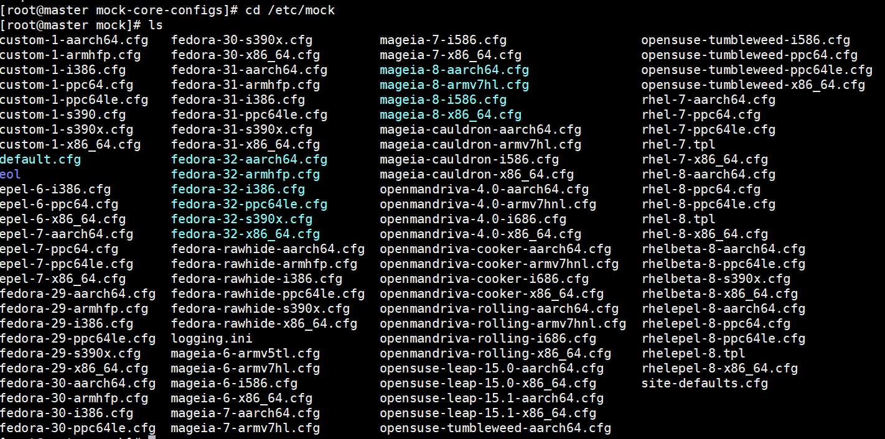

我们以 epel-7-x86\_64.cfg 为例，查看其中关于架构的描述，如清单 8 所示，可以看到是 x86\_64 和红帽 Linux 发行版 7 的信息：

##### 清单 8\. 查看 epel-7-x86\_64.cfg 配置文件中架构信息

```
        [root@master mock]# cat epel-7-x86_64.cfg  |grep -i arch
config_opts['target_arch'] = 'x86_64'
config_opts['legal_host_arches'] = ('x86_64',)
mirrorlist=http://mirrorlist.centos.org/?release=7& arch=x86_64& repo=os
mirrorlist=http://mirrorlist.centos.org/?release=7& arch=x86_64& repo=updates
mirrorlist=http://mirrors.fedoraproject.org/mirrorlist?repo=epel-7& arch=x86_64
mirrorlist=http://mirrorlist.centos.org/?release=7& arch=x86_64& repo=extras
mirrorlist=http://mirrorlist.centos.org/?release=7& arch=x86_64& repo=sclo-rh
mirrorlist=http://mirrors.fedoraproject.org/mirrorlist?repo=testing-epel7& arch=x86_64
mirrorlist=http://mirrors.fedoraproject.org/mirrorlist?repo=epel-debug-7& arch=x86_64

```

Show moreShow more icon

使用 epel-7-x86\_64 配置来构建 SRPM，如下图 26 所示：

**图 26\. 使用 epel-7-x86\_64 构建二进制 RPM**

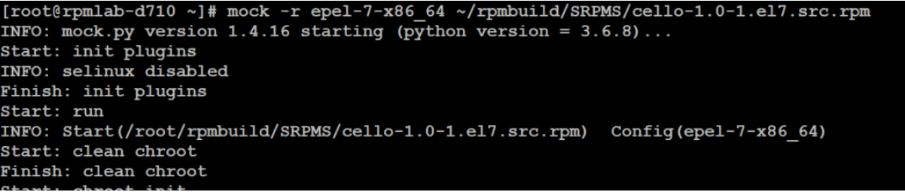

使用 epel-6-x86\_64 配置来构建 SRPM，如下图 27 所示：

**图 27\. 使用 epel-6-x86\_64 构建二进制 RPM**

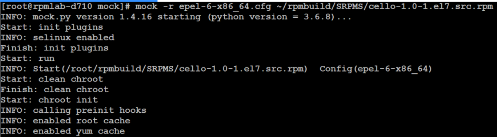

查看构建好的二进制 rpm：cello-1.0-1.el6.x86\_64.rpm，如下图 28 所示：

**图 28\. 查看构建好的二进制 RPM**

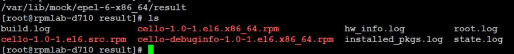

安装 cello-1.0-1.el6.x86\_64.rpm，如下图所示：

**图 29\. 安装 cello-1.0-1.el6.x86\_64.rpm**

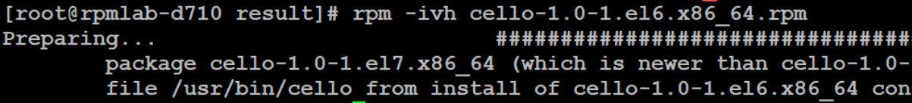

查看构建好的二进制 RPM cello-1.0-1.el7.x86\_64.rpm，并进行安装验证，如下图 30 所示：

**图 30\. 安装构建好的二进制 RPM**

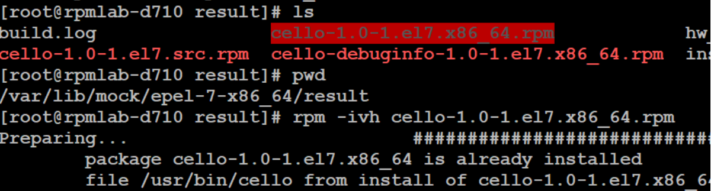

至此，在异构环境下重新编译二进制 RPM 成功。

## 结束语

通过本文，相信您对通过源码构建成 RPM 有了较为深刻的理解。随着开源理念的不断普及，越来越多的客户将业务系统从 Windows 迁移到 Linux 上，理解了 Linux 中的 RPM 打包方式，会对以后我们日常的工作有很大的帮助。

## 参考资源

- [Fedora 社区](https://github.com/fedora-infra)